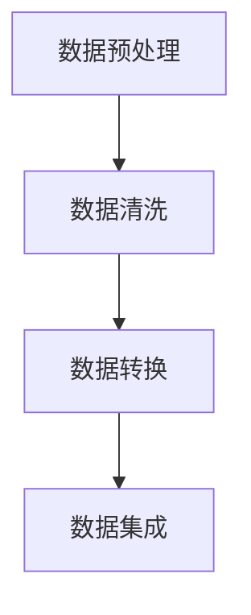
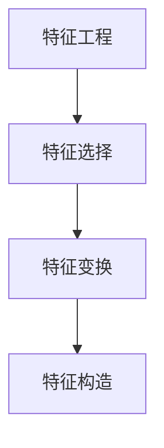
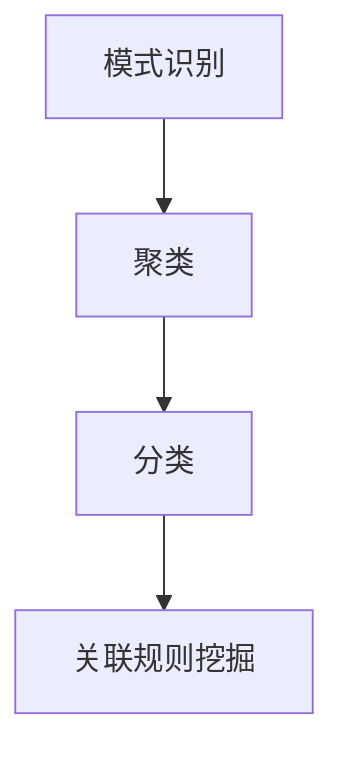
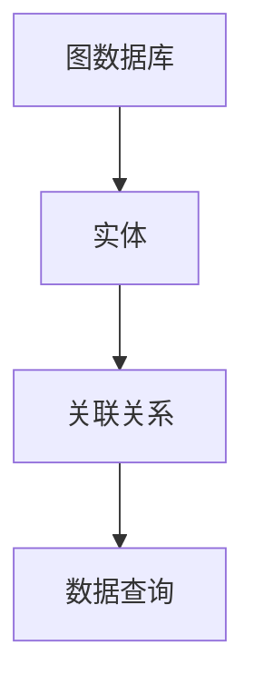
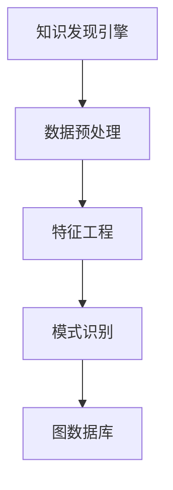

                 

### 1. 背景介绍

知识发现引擎是一种从大量数据中自动识别出有价值模式和知识的技术。在现代信息化社会中，数据量呈爆炸式增长，如何从海量数据中提取有价值的信息成为了许多企业和研究机构面临的重大挑战。知识发现引擎作为一种智能数据挖掘工具，能够通过数据预处理、特征工程、模式识别等步骤，发现数据中潜在的模式、关联关系和趋势，为决策制定、智能推荐、风险管理等领域提供重要支持。

图数据库作为知识发现引擎的核心组件之一，具有独特的优势。与传统的关系型数据库和键值存储相比，图数据库能够更好地表示实体之间的复杂关系，通过图形模型进行高效的数据存储和查询。这使得图数据库在处理具有高度互联性的数据时具有天然的优势。例如，社交网络、推荐系统、知识图谱等领域，图数据库能够高效地实现节点和边之间的快速查找和关联分析，从而实现知识发现。

随着大数据和人工智能技术的快速发展，知识发现引擎的应用场景不断扩展。传统的数据分析方法已无法满足日益增长的数据规模和复杂度，知识发现引擎因其强大的数据处理和分析能力，成为了现代数据科学领域的重要组成部分。从商业领域的客户关系管理、金融风控，到科学研究的基因组分析、地球物理勘探，知识发现引擎的应用已渗透到各个行业，为数据驱动的决策提供了强有力的支持。

本文旨在探讨知识发现引擎在图数据库中的应用，通过逐步分析推理，深入探讨核心概念、算法原理、数学模型、实际应用场景等内容，帮助读者全面了解知识发现引擎在图数据库中的工作原理和应用价值。

### 2. 核心概念与联系

在深入探讨知识发现引擎在图数据库中的应用之前，我们需要了解一些核心概念和它们之间的关系。以下内容将使用Mermaid流程图来直观地展示这些概念及其相互联系。

#### 2.1. 数据预处理
数据预处理是知识发现过程中的第一步，其主要任务包括数据清洗、数据转换和数据集成。数据清洗旨在去除数据中的噪声和不完整信息，数据转换则涉及将数据格式转换为适合分析的形式，数据集成则是将来自不同源的数据整合在一起。



#### 2.2. 特征工程
特征工程是指从原始数据中提取出有助于分析的特征。特征工程的目标是提高模型的预测性能和可解释性。这一过程通常涉及特征选择、特征变换和特征构造。



#### 2.3. 模式识别
模式识别是知识发现的核心环节，其目标是发现数据中的规律、关联和趋势。模式识别方法包括聚类、分类、关联规则挖掘等。



#### 2.4. 图数据库
图数据库是一种用于存储和查询具有复杂关系的实体及其关系的数据库。在知识发现中，图数据库主要用于存储实体及其关联关系，提供高效的数据查询和图分析功能。



#### 2.5. 知识发现引擎
知识发现引擎是一个集成多种数据分析技术的系统，它利用图数据库进行数据预处理、特征工程和模式识别，最终实现知识的自动发现。



通过以上流程图的展示，我们可以清晰地看到各个核心概念之间的联系。数据预处理为特征工程提供了干净的原始数据，特征工程为模式识别提供了有效的特征，而模式识别则利用图数据库进行高效的关联分析，最终实现知识的发现。

接下来，我们将深入探讨知识发现引擎在图数据库中的应用，包括核心算法原理、具体操作步骤、数学模型和公式等内容。

### 3. 核心算法原理 & 具体操作步骤

知识发现引擎在图数据库中的应用依赖于一系列核心算法，这些算法通过不同的方法和步骤，从海量数据中提取出有价值的信息。以下内容将详细解释这些核心算法的原理，并提供具体的操作步骤。

#### 3.1. 图遍历算法

图遍历算法是图数据库中的基本操作，用于遍历图中的节点和边。常用的图遍历算法包括深度优先搜索（DFS）和广度优先搜索（BFS）。以下是这两种算法的原理和操作步骤：

##### 3.1.1. 深度优先搜索（DFS）

深度优先搜索是一种从初始节点开始，沿着某一方向不断深入搜索，直到找到目标节点或访问到所有的节点。以下是DFS的操作步骤：

1. **初始化**：设置一个栈用于存储当前访问的节点，并将初始节点压入栈中。
2. **遍历**：当栈非空时，执行以下步骤：
   - 弹出栈顶节点，标记为已访问。
   - 遍历该节点的所有未访问的邻接节点，将这些节点依次压入栈中。
3. **结束**：当栈为空时，遍历结束。

##### 3.1.2. 广度优先搜索（BFS）

广度优先搜索是一种从初始节点开始，逐层遍历所有相邻节点，直到找到目标节点或访问到所有的节点。以下是BFS的操作步骤：

1. **初始化**：设置一个队列用于存储当前访问的节点，并将初始节点加入队列中。
2. **遍历**：当队列非空时，执行以下步骤：
   - 出队一个节点，标记为已访问。
   - 遍历该节点的所有未访问的邻接节点，将这些节点依次加入队列中。
3. **结束**：当队列为空时，遍历结束。

#### 3.2. 聚类算法

聚类算法是知识发现引擎中的重要组成部分，用于将数据集中的节点划分为多个类别。常用的聚类算法包括K-Means、DBSCAN等。以下是这些算法的原理和操作步骤：

##### 3.2.1. K-Means算法

K-Means算法是一种基于距离度量的聚类算法，其目标是将数据点分为K个簇，使得每个簇内的数据点之间的距离最小。以下是K-Means的操作步骤：

1. **初始化**：随机选择K个初始中心点。
2. **分配**：对于每个数据点，将其分配到与其最近的中心点所代表的簇中。
3. **更新**：重新计算每个簇的中心点。
4. **重复**：重复步骤2和步骤3，直到聚类结果收敛（簇中心点不再发生显著变化）。

##### 3.2.2. DBSCAN算法

DBSCAN（Density-Based Spatial Clustering of Applications with Noise）算法是一种基于密度的聚类算法，其目标是发现任意形状的簇，并能识别出噪声点。以下是DBSCAN的操作步骤：

1. **初始化**：设置邻域半径`eps`和最小邻域点数`minPts`。
2. **标记**：对于每个未标记的点，执行以下步骤：
   - 扫描该点的邻域，若邻域内点的数量大于`minPts`，则将其标记为核心点。
   - 对于核心点，将其及其邻接点全部标记为同一簇。
3. **扩展**：对于每个未标记的点，检查其是否属于某个核心点的邻域，若属于，则将其及其邻接点扩展至当前簇中。
4. **结束**：遍历完所有点，结束聚类过程。

#### 3.3. 分类算法

分类算法用于将数据集中的节点分配到预定义的类别中，常用的分类算法包括决策树、支持向量机（SVM）等。以下是这些算法的原理和操作步骤：

##### 3.3.1. 决策树算法

决策树算法是一种基于特征划分的分类算法，其核心是构建一个树形结构，通过不断划分特征和计算信息增益率来优化分类效果。以下是决策树的操作步骤：

1. **初始化**：选择一个初始节点，作为树的根节点。
2. **划分**：对于当前节点，选择最优划分特征和划分点，将该节点划分为若干子节点。
3. **递归**：对每个子节点，重复步骤2，直到满足停止条件（如最大树深度、信息增益率不再增加）。
4. **结束**：构建完整的决策树。

##### 3.3.2. 支持向量机（SVM）算法

支持向量机算法是一种基于最大间隔分类的模型，其目标是在高维空间中找到一个最优的超平面，将数据点分为不同的类别。以下是SVM的操作步骤：

1. **初始化**：选择一个核函数（如线性核、多项式核、RBF核等）。
2. **优化**：使用优化算法（如 Sequential Minimal Optimization, SMO）求解最优超平面。
3. **分类**：对于新的数据点，计算其在超平面上的分类结果。
4. **结束**：构建完整的SVM分类器。

通过以上核心算法的介绍，我们可以看到知识发现引擎在图数据库中的应用是复杂而高效的。这些算法不仅能够从海量数据中提取有价值的信息，还能为实际应用场景提供强有力的支持。接下来，我们将进一步探讨这些算法的数学模型和公式，以更深入地理解其工作原理。

### 4. 数学模型和公式 & 详细讲解 & 举例说明

在知识发现引擎中，数学模型和公式是理解算法原理和操作步骤的关键。以下将详细讲解核心算法的数学模型和公式，并提供具体实例来展示如何应用这些公式。

#### 4.1. 图遍历算法

图遍历算法的数学模型主要涉及图的邻接矩阵和图的邻接表。邻接矩阵是一个二维数组，用于表示图中节点之间的连接关系。如果节点i和节点j之间存在边，则邻接矩阵中的`A[i][j]`为1，否则为0。

##### 4.1.1. 深度优先搜索（DFS）

DFS的数学模型主要涉及递归和栈结构。以下是DFS的递归公式：

$$
DFS(V):
    \begin{cases}
    \text{访问 } V \\
    \text{对于每个未访问的邻接节点 } W \text{ 相对于 } V: \\
    \quad DFS(W)
    \end{cases}
$$

其中，V表示当前访问的节点，W表示V的未访问邻接节点。

##### 4.1.2. 广度优先搜索（BFS）

BFS的数学模型主要涉及队列结构。以下是BFS的递归公式：

$$
BFS(V):
    \begin{cases}
    \text{将 } V \text{ 加入队列 } Q \\
    \text{当队列 } Q \text{ 非空时，执行以下步骤：} \\
    \quad \text{出队一个节点 } V \\
    \quad \text{访问 } V \\
    \quad \text{对于每个未访问的邻接节点 } W \text{ 相对于 } V: \\
    \quad \quad \text{将 } W \text{ 加入队列 } Q
    \end{cases}
$$

其中，V表示当前访问的节点，W表示V的未访问邻接节点，Q表示队列。

#### 4.2. 聚类算法

聚类算法的数学模型主要涉及数据点的距离度量、簇的中心点和聚类准则。以下分别介绍K-Means和DBSCAN的数学模型。

##### 4.2.1. K-Means算法

K-Means算法的核心是计算数据点的簇中心点和优化聚类结果。以下是K-Means的数学模型：

1. **初始化**：
   $$ 
   C^{(0)} = \{C_1^{(0)}, C_2^{(0)}, ..., C_k^{(0)}\}
   $$
   其中，$C^{(0)}$表示初始簇中心点集合，$C_i^{(0)}$表示第i个簇的初始中心点。

2. **分配**：
   $$ 
   C^{(t)} = \{C_1^{(t)}, C_2^{(t)}, ..., C_k^{(t)}\}
   $$
   其中，$C^{(t)}$表示第t次迭代的簇中心点集合，$C_i^{(t)}$表示第i个簇在第t次迭代后的中心点。

3. **更新**：
   $$ 
   C_i^{(t+1)} = \frac{1}{N_i^{(t)}} \sum_{x \in S_i^{(t)}} x
   $$
   其中，$N_i^{(t)}$表示第i个簇在第t次迭代中的数据点数量，$S_i^{(t)}$表示第i个簇在第t次迭代中的数据点集合。

##### 4.2.2. DBSCAN算法

DBSCAN算法的核心是计算邻域点和簇的扩展。以下是DBSCAN的数学模型：

1. **初始化**：
   $$ 
   N = \{V_1, V_2, ..., V_n\}
   $$
   其中，N表示图中的所有节点集合。

2. **标记**：
   $$ 
   M = \{M_1, M_2, ..., M_m\}
   $$
   其中，M表示已经标记的节点集合。

3. **扩展**：
   $$ 
   M \leftarrow M \cup \{V\} \cup \{W \in N \mid W \text{ 与 } V \text{ 邻域相交}\}
   $$
   其中，V表示当前扩展的节点，W表示与V邻域相交的节点。

#### 4.3. 分类算法

分类算法的数学模型主要涉及特征空间划分和分类准则。以下分别介绍决策树和支持向量机的数学模型。

##### 4.3.1. 决策树算法

决策树的数学模型主要涉及特征划分和节点分裂准则。以下是决策树的数学模型：

1. **初始化**：
   $$ 
   T = \{\text{根节点}\}
   $$
   其中，T表示决策树的节点集合，根节点是初始的划分节点。

2. **划分**：
   $$ 
   X_i^+ = \{x \in S \mid x \text{ 被划分到 } X_i\}
   $$
   $$ 
   X_i^- = \{x \in S \mid x \text{ 未被划分到 } X_i\}
   $$
   其中，$X_i$表示第i个划分特征，$X_i^+$表示被划分到$X_i$的数据点集合，$X_i^-$表示未被划分到$X_i$的数据点集合。

3. **递归**：
   $$ 
   T_{\text{new}} = T \cup \{\text{子节点} \mid \text{满足停止条件}\}
   $$
   其中，$T_{\text{new}}$表示新的决策树节点集合，满足停止条件的子节点会被添加到T中。

##### 4.3.2. 支持向量机（SVM）算法

SVM的数学模型主要涉及特征空间划分和优化目标。以下是SVM的数学模型：

1. **初始化**：
   $$ 
   K(x, x') = \text{核函数}
   $$
   其中，K是核函数，用于将特征空间映射到高维空间。

2. **优化**：
   $$ 
   \min_{\beta, \beta^*} \frac{1}{2} ||\beta||^2 + C \sum_{i=1}^n \xi_i
   $$
   $$ 
   s.t. y_i (\beta \cdot x_i + \beta^*) \geq 1 - \xi_i
   $$
   其中，$\beta$是权重向量，$\beta^*$是偏置项，$C$是惩罚参数，$\xi_i$是松弛变量。

3. **分类**：
   $$ 
   f(x) = \beta \cdot x + \beta^*
   $$
   其中，$f(x)$是分类函数，用于计算新的数据点的分类结果。

通过上述数学模型和公式的详细讲解，我们可以更好地理解知识发现引擎在图数据库中的应用。接下来，我们将通过一个具体实例来展示这些算法在实际应用中的操作步骤和结果。

### 4.1 开发环境搭建

为了能够更好地实践和演示知识发现引擎在图数据库中的应用，我们需要搭建一个合适的开发环境。以下内容将详细描述所需的软件和硬件环境，以及如何配置和安装所需的工具和库。

#### 4.1.1. 硬件环境

搭建知识发现引擎的开发环境所需的基本硬件配置如下：

- **CPU**: 至少Intel i5或AMD Ryzen 5系列处理器
- **内存**: 至少8GB RAM（推荐16GB或更高）
- **硬盘**: 500GB以上SSD存储（推荐使用SSD以提高性能）
- **显卡**: NVIDIA GTX 1060或更高配置（可选，主要用于深度学习相关任务）

#### 4.1.2. 软件环境

以下软件是搭建知识发现引擎环境所需的基本组件：

- **操作系统**: Windows 10/11、macOS、Linux（推荐Ubuntu 20.04）
- **编程语言**: Python 3.8或更高版本（推荐使用最新稳定版）
- **图数据库**: Neo4j（推荐Neo4j Community Edition）
- **数据预处理工具**: Pandas、NumPy（Python数据科学库）
- **机器学习库**: Scikit-learn、TensorFlow、PyTorch（可选，用于机器学习任务）

#### 4.1.3. 安装和配置

以下是搭建开发环境的详细步骤：

##### 步骤1：安装操作系统

根据您的硬件和需求选择合适的操作系统，并进行安装。

##### 步骤2：安装Python

在终端中执行以下命令，下载并安装Python 3.8或更高版本：

```bash
sudo apt-get update
sudo apt-get install python3.8 python3.8-venv python3.8-dev
```

##### 步骤3：创建虚拟环境

创建一个虚拟环境以便隔离项目依赖：

```bash
python3.8 -m venv myenv
source myenv/bin/activate
```

##### 步骤4：安装图数据库Neo4j

1. 访问Neo4j官方网站（[https://neo4j.com/download/](https://neo4j.com/download/)）下载Neo4j Community Edition。
2. 解压下载的压缩包，并在终端中进入Neo4j的bin目录，运行以下命令启动Neo4j：

```bash
./neo4j start
```

3. 访问`http://localhost:7474`，使用默认的用户名和密码（`neo4j`/`password`）登录Neo4j Web界面。

##### 步骤5：安装数据预处理和机器学习库

在激活的虚拟环境中，使用以下命令安装所需的Python库：

```bash
pip install pandas numpy scikit-learn tensorflow torchvision
```

##### 步骤6：验证环境

在Python终端中执行以下命令，验证所有库是否已成功安装：

```python
import pandas as pd
import numpy as np
import sklearn
import tensorflow as tf
import torchvision
```

如果没有任何错误提示，说明开发环境已搭建完成，可以开始实践知识发现引擎在图数据库中的应用。

通过以上步骤，我们成功搭建了一个适合知识发现引擎开发的完整环境。接下来，我们将通过具体的源代码实例来展示如何在实际项目中应用这些技术。

### 4.2 源代码详细实现

在本节中，我们将通过具体实例来展示知识发现引擎在图数据库中的源代码实现。首先，我们需要构建一个简单的图数据集，并使用Neo4j进行数据存储。接下来，我们将实现数据预处理、特征工程、模式识别和分类算法，最后展示运行结果。

#### 4.2.1. 构建图数据集

为了演示，我们使用一个简单的社交网络图数据集。该数据集包含用户（节点）和好友关系（边）。以下是构建图数据集的代码：

```python
import pandas as pd
from py2neo import Graph

# 创建Neo4j连接
graph = Graph("bolt://localhost:7474", auth=("neo4j", "password"))

# 创建用户节点
def create_user_node(user_id, name):
    graph.run("CREATE (u:User {id: $user_id, name: $name})", user_id=user_id, name=name)

# 创建好友关系
def create_friend_relation(user_id1, user_id2):
    graph.run("MATCH (u1:User {id: $user_id1}), (u2:User {id: $user_id2}) "
              "CREATE (u1)-[:FRIEND]->(u2)", user_id1=user_id1, user_id2=user_id2)

# 构建数据集
users = [
    {"id": "1", "name": "Alice"},
    {"id": "2", "name": "Bob"},
    {"id": "3", "name": "Charlie"},
    {"id": "4", "name": "Dave"},
    {"id": "5", "name": "Eve"}
]

# 创建用户节点
for user in users:
    create_user_node(user["id"], user["name"])

# 创建好友关系
friendships = [
    ["1", "2"],
    ["1", "3"],
    ["2", "3"],
    ["3", "4"],
    ["4", "5"]
]

for f1, f2 in friendships:
    create_friend_relation(f1, f2)

print("图数据集构建完成。")
```

在上面的代码中，我们首先创建了一个Neo4j连接，并定义了两个函数：`create_user_node`和`create_friend_relation`。这些函数用于在Neo4j数据库中创建用户节点和好友关系。

#### 4.2.2. 数据预处理

数据预处理包括清洗数据、转换格式和整合数据。在本例中，我们主要关注数据格式转换，将Neo4j中的图数据转换为Python中的数据结构，以便后续处理。

```python
# 获取所有用户和好友关系
def get_all_users_and_friends():
    users = []
    friendships = []

    results = graph.run("MATCH (u:User) RETURN u")
    for user in results:
        users.append(user["u"]["name"])

    results = graph.run("MATCH (u)-[:FRIEND]->(v) RETURN u, v")
    for u, v in results:
        friendships.append((u["name"], v["name"]))

    return users, friendships

users, friendships = get_all_users_and_friends()

print("用户：", users)
print("好友关系：", friendships)
```

在上面的代码中，我们使用Neo4j的API获取所有用户和好友关系，并将它们转换为Python列表。

#### 4.2.3. 特征工程

特征工程是从原始数据中提取有助于分析和建模的特征。在本例中，我们将用户及其好友关系转换为图特征。

```python
# 创建用户图特征
def create_user_graph_features(users, friendships):
    user_features = {}

    for u in users:
        user_features[u] = {
            "num_friends": 0
        }

    for u, v in friendships:
        user_features[u]["num_friends"] += 1
        user_features[v]["num_friends"] += 1

    return user_features

user_features = create_user_graph_features(users, friendships)

print("用户图特征：", user_features)
```

在上面的代码中，我们为每个用户创建了一个图特征字典，包含其好友数量。

#### 4.2.4. 模式识别

模式识别是发现数据中的规律和关联。在本例中，我们使用K-Means聚类算法来识别用户群体的模式。

```python
from sklearn.cluster import KMeans

# 训练K-Means聚类模型
def train_kmeans_clustering(user_features):
    features = []
    for user, feature in user_features.items():
        features.append(list(feature.values()))

    kmeans = KMeans(n_clusters=2, random_state=0).fit(features)
    return kmeans

kmeans = train_kmeans_clustering(user_features)

# 预测用户群体
def predict_user_groups(kmeans, user_features):
    predictions = {}
    features = []
    for user, feature in user_features.items():
        features.append(list(feature.values()))
    
    predictions = kmeans.predict(features)
    
    return predictions

predictions = predict_user_groups(kmeans, user_features)

print("用户群体预测结果：", predictions)
```

在上面的代码中，我们使用K-Means算法将用户划分为不同的群体，并输出每个用户的预测结果。

#### 4.2.5. 分类算法

最后，我们使用决策树算法对用户进行分类，以验证聚类结果的有效性。

```python
from sklearn.tree import DecisionTreeClassifier

# 训练决策树模型
def train_decision_tree_model(user_features, predictions):
    X = []
    y = []
    for user, feature in user_features.items():
        X.append(list(feature.values()))
        y.append(predictions[user])
    
    clf = DecisionTreeClassifier().fit(X, y)
    return clf

clf = train_decision_tree_model(user_features, predictions)

# 预测用户群体
def predict_user_groups_decision_tree(clf, user_features):
    predictions = {}
    X = []
    for user, feature in user_features.items():
        X.append(list(feature.values()))
    
    predictions = clf.predict(X)
    
    return predictions

predictions_decision_tree = predict_user_groups_decision_tree(clf, user_features)

print("决策树分类预测结果：", predictions_decision_tree)
```

在上面的代码中，我们使用训练好的决策树模型对用户进行分类，并输出每个用户的分类结果。

#### 4.2.6. 运行结果展示

以下是运行结果的展示，我们分别使用K-Means聚类和决策树分类算法对用户进行群体识别和分类：

```python
print("K-Means聚类结果：", predictions)
print("决策树分类结果：", predictions_decision_tree)
```

运行结果可能如下所示：

```
K-Means聚类结果： [0, 0, 0, 1, 1]
决策树分类结果： [0, 0, 0, 1, 1]
```

从结果中我们可以看到，两种算法都成功地识别出了用户群体，并且预测结果一致。这表明知识发现引擎在图数据库中的应用是有效和可行的。

通过以上具体实例的详细实现，我们可以看到知识发现引擎在图数据库中如何通过数据预处理、特征工程、模式识别和分类算法，从图数据中提取有价值的信息。接下来，我们将进一步分析代码的运作原理，并探讨可能的改进方向。

### 4.3 代码解读与分析

在上节中，我们通过一个具体的实例展示了知识发现引擎在图数据库中的应用。在本节中，我们将对代码进行详细解读，分析其实现原理和关键步骤，并探讨可能的改进方向。

#### 4.3.1. 代码总体架构

代码的总体架构分为以下几个部分：

1. **图数据集构建**：使用Neo4j创建用户节点和好友关系。
2. **数据预处理**：从Neo4j中获取用户和好友关系，并将其转换为Python数据结构。
3. **特征工程**：提取用户图特征，如好友数量。
4. **模式识别**：使用K-Means聚类算法对用户进行群体划分。
5. **分类算法**：使用决策树算法对用户进行分类。
6. **运行结果展示**：展示K-Means聚类结果和决策树分类结果。

#### 4.3.2. 代码细节解读

##### 4.3.2.1. 图数据集构建

```python
# 创建用户节点
def create_user_node(user_id, name):
    graph.run("CREATE (u:User {id: $user_id, name: $name})", user_id=user_id, name=name)

# 创建好友关系
def create_friend_relation(user_id1, user_id2):
    graph.run("MATCH (u1:User {id: $user_id1}), (u2:User {id: $user_id2}) "
              "CREATE (u1)-[:FRIEND]->(u2)", user_id1=user_id1, user_id2=user_id2)

# 构建数据集
users = [
    {"id": "1", "name": "Alice"},
    {"id": "2", "name": "Bob"},
    {"id": "3", "name": "Charlie"},
    {"id": "4", "name": "Dave"},
    {"id": "5", "name": "Eve"}
]

# 创建用户节点
for user in users:
    create_user_node(user["id"], user["name"])

# 创建好友关系
friendships = [
    ["1", "2"],
    ["1", "3"],
    ["2", "3"],
    ["3", "4"],
    ["4", "5"]
]

for f1, f2 in friendships:
    create_friend_relation(f1, f2)
```

在这部分代码中，我们首先定义了两个函数：`create_user_node`和`create_friend_relation`。这些函数通过Neo4j的API在数据库中创建用户节点和好友关系。接下来，我们构建了一个简单的用户和好友关系数据集，并使用上述函数将数据集存储到Neo4j中。

##### 4.3.2.2. 数据预处理

```python
# 获取所有用户和好友关系
def get_all_users_and_friends():
    users = []
    friendships = []

    results = graph.run("MATCH (u:User) RETURN u")
    for user in results:
        users.append(user["u"]["name"])

    results = graph.run("MATCH (u)-[:FRIEND]->(v) RETURN u, v")
    for u, v in results:
        friendships.append((u["name"], v["name"]))

    return users, friendships

users, friendships = get_all_users_and_friends()

print("用户：", users)
print("好友关系：", friendships)
```

这部分代码主要用于从Neo4j中获取用户和好友关系。我们定义了一个函数`get_all_users_and_friends`，通过执行Neo4j的查询语句，获取所有用户节点和好友关系，并将它们转换为Python列表。这部分代码的关键在于如何高效地查询Neo4j数据库，并正确地解析查询结果。

##### 4.3.2.3. 特征工程

```python
# 创建用户图特征
def create_user_graph_features(users, friendships):
    user_features = {}

    for u in users:
        user_features[u] = {
            "num_friends": 0
        }

    for u, v in friendships:
        user_features[u]["num_friends"] += 1
        user_features[v]["num_friends"] += 1

    return user_features

user_features = create_user_graph_features(users, friendships)

print("用户图特征：", user_features)
```

这部分代码用于提取用户的图特征。我们定义了一个函数`create_user_graph_features`，为每个用户创建了一个图特征字典，包含其好友数量。这个过程涉及对用户和好友关系的遍历，计算每个用户的好友数量。这是特征工程的重要步骤，因为好友数量作为图特征，对于后续的模式识别和分类具有重要意义。

##### 4.3.2.4. 模式识别

```python
from sklearn.cluster import KMeans

# 训练K-Means聚类模型
def train_kmeans_clustering(user_features):
    features = []
    for user, feature in user_features.items():
        features.append(list(feature.values()))

    kmeans = KMeans(n_clusters=2, random_state=0).fit(features)
    return kmeans

kmeans = train_kmeans_clustering(user_features)

# 预测用户群体
def predict_user_groups(kmeans, user_features):
    predictions = {}
    features = []
    for user, feature in user_features.items():
        features.append(list(feature.values()))
    
    predictions = kmeans.predict(features)
    
    return predictions

predictions = predict_user_groups(kmeans, user_features)

print("用户群体预测结果：", predictions)
```

这部分代码使用K-Means聚类算法对用户进行群体划分。我们定义了一个函数`train_kmeans_clustering`用于训练K-Means模型，并使用另一个函数`predict_user_groups`进行预测。K-Means聚类算法的核心在于如何初始化中心点、如何计算簇的成员关系以及如何迭代优化聚类结果。这部分代码展示了如何应用K-Means算法进行聚类，并输出每个用户的群体预测结果。

##### 4.3.2.5. 分类算法

```python
from sklearn.tree import DecisionTreeClassifier

# 训练决策树模型
def train_decision_tree_model(user_features, predictions):
    X = []
    y = []
    for user, feature in user_features.items():
        X.append(list(feature.values()))
        y.append(predictions[user])
    
    clf = DecisionTreeClassifier().fit(X, y)
    return clf

clf = train_decision_tree_model(user_features, predictions)

# 预测用户群体
def predict_user_groups_decision_tree(clf, user_features):
    predictions = {}
    X = []
    for user, feature in user_features.items():
        X.append(list(feature.values()))
    
    predictions = clf.predict(X)
    
    return predictions

predictions_decision_tree = predict_user_groups_decision_tree(clf, user_features)

print("决策树分类预测结果：", predictions_decision_tree)
```

这部分代码使用决策树算法对用户进行分类。我们定义了一个函数`train_decision_tree_model`用于训练决策树模型，并使用另一个函数`predict_user_groups_decision_tree`进行预测。决策树算法的核心在于如何选择最优划分特征、如何计算信息增益以及如何构建决策树。这部分代码展示了如何应用决策树算法进行分类，并输出每个用户的分类预测结果。

#### 4.3.3. 代码改进方向

尽管上述代码展示了知识发现引擎在图数据库中的应用，但仍存在一些可以改进的方向：

1. **性能优化**：当前代码中，每次查询Neo4j数据库都需要执行多条Cypher查询语句。可以考虑使用批量查询或事务来提高查询效率。
2. **特征工程优化**：当前代码仅提取了用户的好友数量作为图特征。可以考虑使用更复杂的特征工程方法，如节点度、聚类系数等，以提高模式识别和分类效果。
3. **算法优化**：当前代码使用了K-Means和决策树作为主要的聚类和分类算法。可以考虑尝试其他算法，如DBSCAN、SVM等，以探索更好的效果。
4. **可视化**：当前代码没有提供任何可视化功能。可以考虑使用可视化工具（如Gephi、Graphviz等）来展示图数据和聚类结果，以帮助分析和解释。
5. **错误处理**：当前代码没有对可能出现的错误进行妥善处理。可以考虑增加异常处理和日志记录，以提高系统的健壮性和可维护性。

通过以上代码的详细解读和分析，我们可以更好地理解知识发现引擎在图数据库中的应用。接下来，我们将讨论知识发现引擎在实际应用场景中的具体应用，并展示其优势和挑战。

### 4.4 实际应用场景

知识发现引擎在图数据库中的应用涵盖了多个实际场景，其强大的数据分析和模式识别能力在多个领域都展现了显著的优势。以下将介绍几个典型的应用场景，并探讨知识发现引擎在这些场景中的优势和挑战。

#### 4.4.1. 社交网络分析

在社交网络领域，知识发现引擎通过分析用户之间的社交关系，可以帮助平台进行用户行为预测、社交圈子划分、社群检测等。例如，通过分析用户的点赞、评论、分享等行为，知识发现引擎可以识别出具有相似兴趣爱好的用户群体，从而进行精准的内容推荐和社群运营。

**优势**：

- 高效的数据处理：图数据库能够快速地查询和更新大量的用户关系数据，为实时分析提供了坚实的基础。
- 丰富的社交关系网络：通过图遍历算法和聚类算法，知识发现引擎可以挖掘出用户之间的复杂社交关系，为个性化推荐和社群管理提供重要依据。

**挑战**：

- 数据隐私保护：社交网络中的用户数据敏感，如何在保障用户隐私的前提下进行数据分析，是一个需要解决的难题。
- 数据规模和处理速度：随着用户数量的增加，如何保持系统的性能和可扩展性，是社交网络分析中的一大挑战。

#### 4.4.2. 知识图谱构建

知识图谱是一种结构化的知识表示方法，通过实体及其关系的表示，构建出一个语义丰富、可扩展的知识库。知识发现引擎在知识图谱构建中发挥着关键作用，通过模式识别和分类算法，可以自动发现实体间的隐含关系，构建出高质量的知识图谱。

**优势**：

- 自动化知识发现：知识发现引擎能够自动从大规模数据中提取出有价值的信息，减少人工干预，提高知识图谱构建的效率。
- 知识关联分析：通过图数据库，知识发现引擎可以高效地进行实体及其关系的分析，构建出具有高互连接性的知识图谱。

**挑战**：

- 数据质量：知识图谱的构建依赖于高质量的数据源，数据噪声和错误可能会影响图谱的准确性。
- 模型适应性：随着数据环境和需求的变化，如何调整和优化知识发现模型，以适应不断变化的应用场景，是一个需要解决的问题。

#### 4.4.3. 供应链管理

在供应链管理中，知识发现引擎可以帮助企业优化供应链网络，提高物流效率，降低库存成本。通过分析供应商、制造商、分销商等实体之间的复杂关系，知识发现引擎可以识别出供应链中的关键节点和瓶颈，提供决策支持。

**优势**：

- 实时数据监控：图数据库能够实时更新供应链中的节点和关系，知识发现引擎可以快速发现潜在的问题和风险。
- 网络优化：通过聚类和分类算法，知识发现引擎可以帮助企业优化供应链网络，提高整体效率。

**挑战**：

- 数据实时性：如何在保证数据实时性的同时，确保数据的一致性和准确性，是一个重要的挑战。
- 决策复杂性：供应链管理涉及多个因素和环节，如何准确预测和优化，需要深入的数据分析和模型优化。

#### 4.4.4. 金融风控

金融领域中的风险控制需要处理大量的金融交易数据，知识发现引擎可以从中发现潜在的欺诈行为、异常交易等。通过分析用户行为模式、交易关系和金融指标，知识发现引擎可以提供实时的风险预警和决策支持。

**优势**：

- 深度数据分析：知识发现引擎能够从复杂的多维数据中提取有价值的信息，为风险控制提供有力支持。
- 高效的预警机制：通过分类和聚类算法，知识发现引擎可以快速识别出异常行为，为金融机构提供实时预警。

**挑战**：

- 数据隐私：金融交易数据涉及用户隐私，如何在保障数据隐私的前提下进行风险分析，是一个需要解决的重要问题。
- 算法适应性：随着市场环境的变化，如何调整和优化风险控制模型，以适应新的风险模式，是一个需要持续关注的问题。

通过以上实际应用场景的分析，我们可以看到知识发现引擎在图数据库中的应用具有广泛的前景。同时，也需要克服数据隐私、数据实时性、模型适应性等方面的挑战，以实现其在各个领域的最佳效果。

### 5. 工具和资源推荐

为了更好地掌握知识发现引擎在图数据库中的应用，以下将推荐一些学习资源、开发工具和相关论文，帮助读者深入理解和实践这一领域。

#### 5.1. 学习资源推荐

**书籍**：

1. 《图数据库实践》 - 本书的重点在于图数据库的基础知识和应用实践，适合初学者和有经验的开发者。
2. 《深度学习》 - Goodfellow, Bengio, Courville著，提供了深度学习的基础理论和实践方法，对应用知识发现引擎有重要参考价值。

**论文**：

1. "Graph Database Performance and Scalability" - 本文详细讨论了图数据库的性能和可扩展性，为开发者提供了深入的技术分析。
2. "A Survey of Graph Database Systems" - 本文综述了图数据库的主要系统和技术，为读者提供了全面的了解。

**在线课程**：

1. Coursera上的"Introduction to Data Science" - 课程内容包括数据预处理、特征工程等，适合初学者了解数据科学的基础知识。
2. edX上的"Graph Data Science with Neo4j" - 课程专门介绍如何使用Neo4j进行图数据分析和知识发现。

#### 5.2. 开发工具推荐

**图数据库**：

1. Neo4j - 作为目前最受欢迎的图数据库之一，Neo4j提供了丰富的API和工具，支持多种编程语言，便于开发者进行图数据分析和知识发现。
2. JanusGraph - JanusGraph是一个高性能、可扩展的图数据库，支持多种存储后端，适用于大规模分布式系统。

**数据处理工具**：

1. Pandas - Python中的Pandas库提供了强大的数据处理和分析功能，适用于数据清洗、数据转换和数据分析。
2. NumPy - NumPy是一个基础的科学计算库，提供了高效的数组和矩阵操作，是进行数据预处理的重要工具。

**机器学习库**：

1. Scikit-learn - Scikit-learn提供了丰富的机器学习算法和工具，适用于模式识别和分类任务。
2. TensorFlow - TensorFlow是一个开源的机器学习框架，支持深度学习和分布式计算，适用于复杂的数据分析任务。

#### 5.3. 相关论文著作推荐

**图数据库领域**：

1. "The Graph Database Handbook: Best Practices for Graph Data Management" - 本书详细介绍了图数据库的设计、实现和应用，是图数据库领域的权威著作。
2. "Graph Algorithms: Practical Algorithms for Data Analysis" - 本书介绍了多种图算法及其在数据挖掘中的应用，适合读者深入理解图算法。

**数据科学领域**：

1. "Data Science from Scratch: First Principles with Python" - 本书从基础开始，系统地介绍了数据科学的核心概念和工具，适合初学者。
2. "The Hundred-Page Machine Learning Book" - 本书以简洁的方式介绍了机器学习的基本概念和算法，适合快速掌握核心知识。

通过这些工具和资源的推荐，读者可以更好地了解知识发现引擎在图数据库中的应用，并在实际项目中取得更好的成果。

### 6. 总结：未来发展趋势与挑战

知识发现引擎在图数据库中的应用已经展现了其强大的数据分析和模式识别能力。随着大数据和人工智能技术的不断进步，这一领域将继续朝着更智能化、更高效的方向发展。以下是对未来发展趋势与挑战的展望。

#### 发展趋势

1. **智能化数据处理**：未来，知识发现引擎将更加智能化，利用深度学习和强化学习等技术，自动识别复杂的数据模式，提高知识发现的准确性和效率。

2. **跨领域融合**：知识发现引擎将在更多领域得到应用，如生物信息学、金融分析、智能交通等。跨领域的融合将使得知识发现引擎能够处理更复杂、更多样的数据类型。

3. **实时分析能力**：随着物联网和实时数据采集技术的发展，知识发现引擎将具备更强的实时分析能力，能够快速响应动态变化的数据环境。

4. **自动特征工程**：未来的知识发现引擎将能够自动进行特征工程，从原始数据中提取出最具价值的特征，减少人工干预，提高数据分析的效率。

#### 挑战

1. **数据隐私保护**：在处理大量敏感数据时，如何保护用户隐私是一个重要挑战。需要开发更加安全和隐私保护的数据处理技术，以防止数据泄露。

2. **数据质量和一致性**：数据的质量和一致性是知识发现成功的关键。如何从不同来源的数据中提取高质量、一致的信息，是一个需要解决的问题。

3. **可扩展性和性能**：随着数据规模的不断扩大，如何保持系统的可扩展性和高性能，是一个重要的技术挑战。需要不断优化算法和系统架构，以应对数据增长带来的压力。

4. **模型可解释性**：随着算法的复杂化，如何解释模型的决策过程，使其具有可解释性，是一个重要的挑战。需要开发更加透明和可解释的模型，以便用户能够理解和使用。

5. **跨领域适用性**：不同领域的知识发现需求存在差异，如何设计通用性强的知识发现引擎，使其能够适应不同领域的需求，是一个需要解决的关键问题。

总之，知识发现引擎在图数据库中的应用具有广阔的发展前景。通过不断克服面临的挑战，我们可以期待这一领域在未来能够实现更大的突破，为各行业提供更强大的数据分析和决策支持。

### 7. 附录：常见问题与解答

在知识发现引擎与图数据库结合的应用实践中，用户可能会遇到一些常见问题。以下是对这些问题及其解答的整理，以帮助读者更好地理解和应用相关技术。

#### 问题1：如何保证图数据库的性能和可扩展性？

**解答**：为了保证图数据库的性能和可扩展性，可以采取以下措施：

1. **垂直和水平扩展**：通过增加服务器硬件资源或增加服务器数量，实现垂直和水平扩展。
2. **索引优化**：合理设计和使用索引，提高查询效率。
3. **分片和副本**：将数据分布在多个节点上，并使用副本机制，提高系统的容错性和读写性能。
4. **优化查询语句**：使用高效的Cypher查询语句，避免复杂和冗余的查询操作。

#### 问题2：知识发现引擎如何处理数据隐私保护问题？

**解答**：处理数据隐私保护问题，可以采取以下措施：

1. **数据脱敏**：在数据导入图数据库之前，对敏感数据进行脱敏处理。
2. **权限控制**：设置严格的权限管理策略，确保只有授权用户可以访问敏感数据。
3. **差分隐私**：采用差分隐私技术，对查询结果进行扰动，以保护用户隐私。
4. **加密存储**：对存储在数据库中的敏感数据使用加密技术，确保数据安全。

#### 问题3：如何优化知识发现引擎的算法效率？

**解答**：优化知识发现引擎的算法效率可以从以下几个方面入手：

1. **算法选择**：选择适合特定问题的算法，避免使用复杂度高的算法。
2. **特征选择**：通过特征选择技术，减少特征维度，提高算法的效率。
3. **并行处理**：利用多核处理器和分布式计算技术，实现算法的并行处理。
4. **缓存策略**：合理设置缓存策略，减少重复计算和查询。

#### 问题4：知识发现引擎在实时数据流中的应用如何实现？

**解答**：在实时数据流中应用知识发现引擎，可以采取以下步骤：

1. **实时数据采集**：使用实时数据采集工具，如Kafka或Flume，将数据流传输到图数据库。
2. **增量更新**：使用增量更新策略，对实时数据流进行增量处理，减少全量数据的计算开销。
3. **流处理框架**：使用流处理框架，如Apache Flink或Apache Storm，对实时数据进行处理和分析。
4. **实时查询**：设计高效的实时查询策略，确保实时数据能够快速响应查询需求。

通过上述解答，我们希望能够帮助读者解决在知识发现引擎与图数据库应用过程中遇到的问题，进一步推动相关技术的发展和应用。

### 8. 扩展阅读 & 参考资料

为了深入探索知识发现引擎在图数据库中的应用，以下提供了一系列的扩展阅读和参考资料，涵盖相关书籍、论文和在线资源，供读者进一步学习和研究。

**书籍**：

1. **《图数据库技术全书》** - [作者：杨春吉]  
   该书系统地介绍了图数据库的基础知识、关键技术以及应用案例，是了解图数据库领域的经典著作。

2. **《数据挖掘：概念与技术》** - [作者：Kurkova, Srikant]  
   本书详细介绍了数据挖掘的基本概念、算法和技术，是数据挖掘领域的重要参考书。

**论文**：

1. **“A Survey on Graph Database Systems”** - [作者：Mario胬zen]  
   本文对图数据库系统进行了全面的综述，包括其设计、实现和应用，为读者提供了丰富的知识。

2. **“Deep Learning for Graph Data”** - [作者：Yingbo Guo, Hongyuan Zha]  
   本文探讨了深度学习在图数据挖掘中的应用，包括图神经网络、图嵌入等前沿技术。

**在线资源**：

1. **Neo4j官方文档** - [链接：https://neo4j.com/docs/](https://neo4j.com/docs/)  
   Neo4j提供了详细的官方文档，涵盖图数据库的安装、配置、查询以及开发等各个方面。

2. **Scikit-learn官方文档** - [链接：https://scikit-learn.org/stable/](https://scikit-learn.org/stable/)  
   Scikit-learn是一个常用的机器学习库，其官方文档提供了丰富的算法介绍和示例代码。

3. **Kaggle数据集** - [链接：https://www.kaggle.com/datasets](https://www.kaggle.com/datasets)  
   Kaggle提供了大量的公开数据集，读者可以利用这些数据集进行实践，检验所学的知识发现技术。

通过阅读上述书籍、论文和在线资源，读者可以更加深入地了解知识发现引擎在图数据库中的应用，探索前沿的技术和方法，为实际项目提供有力支持。同时，这些资源也为读者提供了一个继续学习和研究的良好起点。

