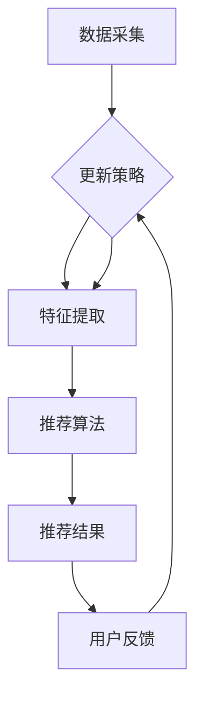

                 

### 背景介绍

#### 知识发现引擎的定义与重要性

知识发现引擎（Knowledge Discovery Engine）是指一种能够自动地从大量数据中提取隐藏模式、规律和知识的工具或系统。随着互联网和大数据技术的快速发展，数据爆炸式增长，传统的数据分析方法已经无法满足处理如此庞大和复杂的数据集的需求。知识发现引擎通过融合机器学习、数据挖掘、自然语言处理等前沿技术，实现自动化、智能化地发现知识，为企业提供决策支持和业务洞察。

知识发现引擎的重要性在于其能够帮助企业从海量数据中挖掘有价值的信息，提升决策的准确性和效率。具体来说，知识发现引擎具有以下几个关键作用：

1. **业务洞察**：通过分析大量历史数据，知识发现引擎可以帮助企业发现业务趋势、优化业务流程、预测市场变化等，从而做出更加明智的决策。
2. **个性化推荐**：知识发现引擎可以根据用户的兴趣和行为数据，生成个性化的推荐列表，提高用户的满意度和粘性。
3. **风险评估**：在金融、保险等领域，知识发现引擎能够识别潜在风险，提供预警，降低企业的运营风险。
4. **智能监控**：通过对实时数据的分析，知识发现引擎可以实时监控业务运行状态，及时发现异常情况，保证系统的稳定性和可靠性。

#### 实时推荐系统的定义与重要性

实时推荐系统（Real-time Recommendation System）是知识发现引擎的一种典型应用。它通过实时分析用户的兴趣和行为数据，为用户提供个性化的推荐内容。实时推荐系统的重要性体现在以下几个方面：

1. **用户体验优化**：实时推荐系统可以提供与用户兴趣高度相关的推荐内容，提高用户的满意度和参与度，从而增强用户黏性。
2. **商业价值提升**：通过精准的推荐，实时推荐系统可以帮助企业增加用户购买率、提高销售额，提升企业的经济效益。
3. **市场竞争力增强**：实时推荐系统能够快速响应用户需求，提供个性化的服务，提升企业的市场竞争力。
4. **数据驱动的决策**：实时推荐系统通过分析用户数据，为企业提供有价值的市场洞察和业务指导，帮助企业实现数据驱动的决策。

#### 本文的目标与结构

本文旨在深入探讨知识发现引擎的实时推荐系统设计。通过逐步分析推理的方式，本文将详细解析实时推荐系统的核心概念、算法原理、数学模型、项目实践和实际应用场景，旨在为读者提供全面、系统的理解，并探讨未来发展趋势和挑战。

本文结构如下：

1. **背景介绍**：介绍知识发现引擎和实时推荐系统的定义、重要性以及本文的目标和结构。
2. **核心概念与联系**：阐述实时推荐系统的核心概念，并通过Mermaid流程图展示其原理和架构。
3. **核心算法原理 & 具体操作步骤**：详细解析实时推荐系统的核心算法，包括协同过滤、基于内容的推荐、混合推荐等。
4. **数学模型和公式 & 详细讲解 & 举例说明**：介绍实时推荐系统中常用的数学模型和公式，并通过具体例子进行详细讲解。
5. **项目实践：代码实例和详细解释说明**：提供实时推荐系统的实际项目代码实例，并进行详细解读和分析。
6. **实际应用场景**：探讨实时推荐系统在不同行业中的应用案例和效果。
7. **工具和资源推荐**：推荐学习资源、开发工具和框架。
8. **总结：未来发展趋势与挑战**：总结实时推荐系统的发展趋势和面临的挑战。
9. **附录：常见问题与解答**：回答读者可能遇到的常见问题。
10. **扩展阅读 & 参考资料**：提供进一步学习的参考资料。

通过本文的逐步分析推理，读者将能够深入理解实时推荐系统的设计和实现，为实际应用提供指导。

#### 知识发现引擎的工作原理

知识发现引擎的工作原理可以概括为以下几个关键步骤：

1. **数据采集**：首先，知识发现引擎需要从各种数据源（如数据库、文件、流数据等）中采集数据。这些数据可以是结构化的（如关系型数据库中的表格数据）、半结构化的（如XML、JSON等）或非结构化的（如图像、文本、语音等）。

2. **数据预处理**：采集到的原始数据通常需要进行清洗、转换和归一化等预处理操作，以便后续的数据分析。数据预处理包括去除重复数据、填补缺失值、去除噪声、特征提取等步骤。

3. **特征提取**：特征提取是将原始数据转换为适合机器学习模型处理的形式的过程。通过提取数据中的关键特征，知识发现引擎可以更好地理解和分析数据。特征提取的方法包括统计特征、文本特征、图像特征等。

4. **模式识别**：在特征提取之后，知识发现引擎使用各种机器学习算法（如分类、聚类、关联规则学习等）来识别数据中的隐藏模式。这些模式可以是用户行为、市场趋势、潜在顾客等。

5. **模型训练**：通过使用历史数据，知识发现引擎训练机器学习模型，使其能够对新的数据进行预测和分类。训练过程通常涉及参数调整、模型选择和交叉验证等步骤。

6. **知识表示**：知识发现引擎将训练好的模型输出为知识表示，这些知识表示可以是规则、图表、报表等形式，以便后续的应用和分析。

7. **决策支持**：最终，知识发现引擎将提取的知识应用于实际业务场景中，提供决策支持。例如，在个性化推荐系统中，知识发现引擎可以根据用户的历史行为和偏好推荐相关商品；在金融风险评估中，可以识别潜在风险并提供建议。

#### 实时推荐系统的工作原理

实时推荐系统作为知识发现引擎的重要应用之一，其工作原理可以简化为以下步骤：

1. **用户行为采集**：实时推荐系统首先需要采集用户的在线行为数据，包括浏览记录、购买行为、搜索历史、点赞和评论等。这些数据可以通过API接口、日志分析等方式获取。

2. **实时处理**：采集到的用户行为数据需要实时处理，以提取用户当前的兴趣偏好。实时处理通常涉及数据清洗、转换和特征提取等步骤，可以使用流处理技术（如Apache Kafka、Apache Flink等）实现。

3. **推荐算法计算**：在提取了用户行为特征之后，实时推荐系统使用推荐算法计算与用户兴趣相关的推荐内容。常用的推荐算法包括协同过滤、基于内容的推荐和混合推荐等。

   - **协同过滤**：协同过滤是一种基于用户行为相似性的推荐算法。它通过分析用户之间的行为模式来推荐相似用户喜欢的商品。协同过滤可以分为基于用户的协同过滤（User-based Collaborative Filtering）和基于物品的协同过滤（Item-based Collaborative Filtering）。
   - **基于内容的推荐**：基于内容的推荐是根据用户的历史行为和内容特征来推荐相似内容。例如，如果一个用户喜欢阅读某本小说，系统可以推荐其他类似题材的小说。
   - **混合推荐**：混合推荐结合了协同过滤和基于内容的推荐，以提高推荐系统的准确性和多样性。

4. **推荐结果生成**：计算出的推荐结果需要根据用户兴趣和系统策略进行排序和筛选，生成最终的推荐列表。推荐结果的生成过程通常涉及排序算法、去重策略和推荐阈值等。

5. **用户反馈与优化**：实时推荐系统在生成推荐结果后，会收集用户的反馈，如点击、购买、收藏等行为。通过分析用户反馈，系统可以不断优化推荐算法和策略，提高推荐质量。

6. **界面展示**：最终，实时推荐系统将推荐结果通过Web、移动应用或其他界面展示给用户。用户可以通过界面进行互动，如查看推荐内容、点击、评价等，这些行为数据将反馈给系统，用于进一步优化推荐算法。

#### 实时推荐系统的架构

实时推荐系统的架构设计直接影响到系统的性能、可扩展性和可靠性。一个典型的实时推荐系统通常包括以下几个关键模块：

1. **数据采集模块**：该模块负责从各种数据源（如Web服务器日志、数据库、社交媒体平台等）中采集用户行为数据。数据采集模块通常使用消息队列（如Kafka）来实现实时数据流处理，确保数据的及时性和一致性。

2. **数据预处理模块**：数据预处理模块对采集到的原始数据进行清洗、转换和归一化等操作，确保数据质量。预处理模块可以使用ETL（Extract, Transform, Load）工具（如Apache NiFi、Apache Spark等）来实现。

3. **特征提取模块**：特征提取模块将预处理后的数据转换为适合机器学习模型处理的特征向量。特征提取可以基于用户行为、用户属性、内容特征等多个维度进行，以提高推荐系统的准确性和多样性。

4. **推荐算法模块**：推荐算法模块是实现实时推荐系统的核心，包括协同过滤、基于内容的推荐、混合推荐等算法。推荐算法模块需要支持高并发处理和实时计算，以快速生成推荐结果。

5. **推荐结果生成模块**：推荐结果生成模块根据推荐算法计算出的结果，进行排序、筛选和去重等操作，生成最终的推荐列表。推荐结果生成模块还需要支持个性化推荐策略，如基于用户兴趣的推荐、基于内容匹配的推荐等。

6. **用户反馈模块**：用户反馈模块负责收集用户的互动行为数据（如点击、购买、收藏等），并将其反馈给推荐算法模块。通过分析用户反馈，系统可以不断优化推荐算法和策略。

7. **界面展示模块**：界面展示模块负责将推荐结果通过Web、移动应用或其他界面展示给用户。界面设计需要简洁易用，以提高用户的交互体验。

8. **存储模块**：实时推荐系统需要存储大量的用户数据、推荐算法模型和结果数据。常用的存储方案包括关系型数据库（如MySQL、PostgreSQL等）、NoSQL数据库（如MongoDB、Cassandra等）和分布式文件系统（如HDFS、HBase等）。

9. **监控与优化模块**：监控与优化模块负责监控系统运行状态、性能指标和错误日志，及时发现和处理系统故障。通过监控数据，系统管理员可以优化系统配置、调整推荐策略，提高系统的稳定性和可靠性。

#### Mermaid流程图展示

为了更好地理解实时推荐系统的原理和架构，我们可以使用Mermaid流程图来可视化地展示其工作流程。以下是一个简化的Mermaid流程图示例：



**图1：实时推荐系统流程图**

- **数据采集（A）**：从各种数据源（如Web服务器日志、数据库等）中实时采集用户行为数据。
- **数据预处理（B）**：对采集到的数据进行清洗、转换和归一化等预处理操作，确保数据质量。
- **特征提取（C）**：将预处理后的数据转换为特征向量，包括用户行为特征、用户属性特征等。
- **推荐算法（D）**：使用协同过滤、基于内容的推荐或混合推荐算法计算推荐结果。
- **推荐结果（E）**：根据推荐算法的结果生成推荐列表，并进行排序、筛选和去重等操作。
- **用户反馈（F）**：收集用户的点击、购买、收藏等行为数据，并将其反馈给推荐算法模块，用于策略更新。

通过这个Mermaid流程图，我们可以清晰地看到实时推荐系统的各个环节以及它们之间的数据流动和依赖关系。这有助于我们更好地理解和设计实时推荐系统的架构。

### 核心算法原理 & 具体操作步骤

实时推荐系统设计中的核心算法主要包括协同过滤、基于内容的推荐和混合推荐。以下将详细阐述这些算法的基本原理和具体操作步骤。

#### 协同过滤（Collaborative Filtering）

**基本原理**：

协同过滤是一种基于用户行为相似性的推荐算法，它通过分析用户之间的行为模式来发现相似用户，然后根据这些相似用户的偏好推荐内容。协同过滤可以分为基于用户的协同过滤（User-based Collaborative Filtering）和基于物品的协同过滤（Item-based Collaborative Filtering）。

**基于用户的协同过滤**：

1. **计算用户相似度**：首先，计算用户之间的相似度，常用的相似度度量方法包括余弦相似度、皮尔逊相关系数等。相似度计算公式如下：
   \[
   sim(u_i, u_j) = \frac{\sum_{k=1}^{n} w_{ik} w_{jk}}{\sqrt{\sum_{k=1}^{n} w_{ik}^2 \sum_{k=1}^{n} w_{jk}^2}}
   \]
   其中，\(w_{ik}\) 表示用户 \(u_i\) 对物品 \(k\) 的评分，\(n\) 表示评分数量。

2. **推荐物品**：对于目标用户 \(u_t\)，找到与其最相似的 \(k\) 个用户（邻居），然后推荐邻居们共同喜欢的物品。推荐物品的计算公式如下：
   \[
   rec(u_t) = \sum_{i=1}^{k} sim(u_i, u_t) \cdot r_{it}
   \]
   其中，\(r_{it}\) 表示邻居 \(u_i\) 对物品 \(t\) 的评分。

**基于物品的协同过滤**：

1. **计算物品相似度**：首先，计算物品之间的相似度，常用的相似度度量方法包括余弦相似度、余弦相似度等。相似度计算公式如下：
   \[
   sim(i_j, i_t) = \frac{\sum_{u=1}^{m} w_{uj} w_{ut}}{\sqrt{\sum_{u=1}^{m} w_{uj}^2 \sum_{u=1}^{m} w_{ut}^2}}
   \]
   其中，\(w_{uj}\) 表示用户 \(u\) 对物品 \(j\) 的评分，\(m\) 表示用户数量。

2. **推荐用户**：对于目标物品 \(i_t\)，找到与其最相似的 \(k\) 个物品，然后推荐对这些物品评分较高的用户。推荐用户的计算公式如下：
   \[
   rec(u) = \sum_{j=1}^{k} sim(i_j, i_t) \cdot r_{uj}
   \]
   其中，\(r_{uj}\) 表示用户 \(u\) 对物品 \(j\) 的评分。

#### 基于内容的推荐（Content-based Filtering）

**基本原理**：

基于内容的推荐是根据用户的历史行为和内容特征来推荐相似内容。它将用户对物品的评分看作是用户对物品内容的偏好，通过计算物品之间的相似度来生成推荐列表。

**具体操作步骤**：

1. **特征提取**：首先，对物品的内容进行特征提取，常见的特征包括文本特征、图像特征、标签等。对于文本特征，可以使用词袋模型、TF-IDF等方法；对于图像特征，可以使用卷积神经网络提取视觉特征。

2. **计算内容相似度**：计算目标物品与用户历史偏好物品之间的内容相似度。对于文本特征，可以使用余弦相似度；对于图像特征，可以使用欧氏距离或余弦相似度。

3. **生成推荐列表**：对于目标用户，找到与用户历史偏好物品最相似的新物品，将这些物品作为推荐结果。计算公式如下：
   \[
   rec(i) = \sum_{j=1}^{n} sim(i_j, i_t) \cdot r_{jt}
   \]
   其中，\(sim(i_j, i_t)\) 表示物品 \(i_t\) 与物品 \(i_j\) 的内容相似度，\(r_{jt}\) 表示用户对物品 \(i_j\) 的评分。

#### 混合推荐（Hybrid Recommendation）

**基本原理**：

混合推荐结合了协同过滤和基于内容的推荐，以利用两种方法的优点，提高推荐系统的准确性和多样性。混合推荐系统通常采用加权组合的方式，将协同过滤和基于内容的推荐结果进行融合。

**具体操作步骤**：

1. **协同过滤推荐**：使用协同过滤算法生成初步的推荐列表。

2. **基于内容的推荐**：使用基于内容的推荐算法生成另一个推荐列表。

3. **融合推荐结果**：将两种推荐结果进行融合，生成最终的推荐列表。融合策略可以根据实际需求进行调整，常用的方法包括简单平均、加权平均等。融合推荐结果的计算公式如下：
   \[
   rec(i) = w_1 \cdot rec_{cf}(i) + w_2 \cdot rec_{cb}(i)
   \]
   其中，\(w_1\) 和 \(w_2\) 分别为协同过滤和基于内容的推荐权重，\(rec_{cf}(i)\) 和 \(rec_{cb}(i)\) 分别为协同过滤和基于内容的推荐结果。

通过以上核心算法的详细解析，我们可以更好地理解实时推荐系统的设计和实现，为后续的项目实践提供理论基础。

### 数学模型和公式 & 详细讲解 & 举例说明

在实时推荐系统中，数学模型和公式起到了核心作用，它们不仅帮助我们在算法层面理解和实现推荐系统，还确保了推荐结果的准确性和可靠性。以下将介绍几种常用的数学模型和公式，并通过具体例子进行详细讲解。

#### 余弦相似度（Cosine Similarity）

**基本原理**：

余弦相似度是一种衡量两个向量之间相似度的方法，它通过计算两个向量夹角的余弦值来确定相似度。余弦相似度的取值范围在[-1,1]之间，值越接近1，表示两个向量越相似。

**公式**：

给定两个向量 \( \mathbf{u} \) 和 \( \mathbf{v} \)，余弦相似度计算公式如下：
\[
sim(\mathbf{u}, \mathbf{v}) = \frac{\mathbf{u} \cdot \mathbf{v}}{||\mathbf{u}|| \cdot ||\mathbf{v}||}
\]
其中，\( \mathbf{u} \cdot \mathbf{v} \) 表示向量的点积，\( ||\mathbf{u}|| \) 和 \( ||\mathbf{v}|| \) 分别表示向量的模长。

**举例说明**：

假设有两个用户 \(u_1\) 和 \(u_2\)，他们对不同物品的评分向量如下：
\[ 
u_1 = (1, 0, 1, 0) \\
u_2 = (0, 1, 0, 1)
\]

计算用户 \(u_1\) 和 \(u_2\) 之间的余弦相似度：
\[
sim(u_1, u_2) = \frac{1 \cdot 0 + 0 \cdot 1 + 1 \cdot 0 + 0 \cdot 1}{\sqrt{1^2 + 0^2 + 1^2 + 0^2} \cdot \sqrt{0^2 + 1^2 + 0^2 + 1^2}} = \frac{0}{\sqrt{2} \cdot \sqrt{2}} = 0
\]

因此，用户 \(u_1\) 和 \(u_2\) 之间的余弦相似度为 0，表示他们没有相似的行为模式。

#### 皮尔逊相关系数（Pearson Correlation Coefficient）

**基本原理**：

皮尔逊相关系数是一种衡量两个变量线性相关程度的指标，其值范围在[-1,1]之间。如果相关系数为1，表示两个变量完全正相关；如果为-1，表示完全负相关；如果为0，表示没有线性相关。

**公式**：

给定两个变量 \(x\) 和 \(y\) 的数据集，皮尔逊相关系数计算公式如下：
\[
\text{Corr}(x, y) = \frac{\sum_{i=1}^{n} (x_i - \bar{x}) (y_i - \bar{y})}{\sqrt{\sum_{i=1}^{n} (x_i - \bar{x})^2} \cdot \sqrt{\sum_{i=1}^{n} (y_i - \bar{y})^2}}
\]
其中，\(\bar{x}\) 和 \(\bar{y}\) 分别表示 \(x\) 和 \(y\) 的平均值，\(n\) 表示数据点的数量。

**举例说明**：

假设有两个评分数据集 \(x\) 和 \(y\) 如下：
\[ 
x = [1, 2, 3, 4, 5] \\
y = [5, 4, 3, 2, 1]
\]

计算评分数据集 \(x\) 和 \(y\) 之间的皮尔逊相关系数：
\[
\text{Corr}(x, y) = \frac{(1-3)(5-3) + (2-3)(4-3) + (3-3)(3-3) + (4-3)(2-3) + (5-3)(1-3)}{\sqrt{((1-3)^2 + (2-3)^2 + (3-3)^2 + (4-3)^2 + (5-3)^2)} \cdot \sqrt{((5-3)^2 + (4-3)^2 + (3-3)^2 + (2-3)^2 + (1-3)^2)}} = \frac{0}{\sqrt{10} \cdot \sqrt{10}} = 0
\]

因此，评分数据集 \(x\) 和 \(y\) 之间的皮尔逊相关系数为 0，表示它们之间没有线性相关关系。

#### 马尔可夫链（Markov Chain）

**基本原理**：

马尔可夫链是一种用于建模序列数据的概率模型，它假设当前状态仅依赖于前一个状态，与之前的状态无关。马尔可夫链在序列预测和推荐系统中有着广泛的应用。

**公式**：

给定马尔可夫链的转移概率矩阵 \(P\)，状态序列 \(X = (x_1, x_2, ..., x_n)\) 的概率可以通过以下公式计算：
\[
P(X = x_1, x_2, ..., x_n) = P(x_1) \cdot P(x_2|x_1) \cdot P(x_3|x_2) \cdot ... \cdot P(x_n|x_{n-1})
\]

**举例说明**：

假设有一个用户行为序列，用户浏览了物品 A、B、C，计算这个序列的概率。给定转移概率矩阵如下：
\[
P = \begin{bmatrix}
0.3 & 0.4 & 0.3 \\
0.2 & 0.5 & 0.3 \\
0.1 & 0.4 & 0.5
\end{bmatrix}
\]

计算用户浏览行为序列 A-B-C 的概率：
\[
P(A-B-C) = P(A) \cdot P(B|A) \cdot P(C|B) = 0.3 \cdot 0.4 \cdot 0.5 = 0.06
\]

因此，用户浏览行为序列 A-B-C 的概率为 0.06。

通过以上数学模型和公式的详细讲解和举例说明，我们可以更好地理解实时推荐系统中的核心数学原理，为算法实现和优化提供理论依据。

### 项目实践：代码实例和详细解释说明

为了更好地理解实时推荐系统的实现，我们将通过一个具体的代码实例进行讲解。在这个实例中，我们将使用Python和几个常用的库（如Pandas、Scikit-learn、Numpy）来实现一个简单的基于协同过滤的实时推荐系统。

#### 开发环境搭建

1. 安装Python 3.8及以上版本。
2. 安装必要的库，可以使用以下命令：
   ```bash
   pip install pandas scikit-learn numpy
   ```

#### 源代码详细实现

下面是实时推荐系统的源代码：

```python
import numpy as np
import pandas as pd
from sklearn.metrics.pairwise import cosine_similarity
from sklearn.model_selection import train_test_split

# 数据预处理
def preprocess_data(data):
    # 将用户行为数据转换为用户-物品评分矩阵
    user_item_matrix = data.pivot(index='user_id', columns='item_id', values='rating').fillna(0)
    return user_item_matrix

# 计算用户相似度
def compute_similarity(user_item_matrix):
    # 计算用户之间的余弦相似度矩阵
    similarity_matrix = cosine_similarity(user_item_matrix)
    return similarity_matrix

# 生成推荐列表
def generate_recommendations(similarity_matrix, user_item_matrix, user_id, top_n=5):
    # 计算每个用户与其他用户的相似度，并选择最相似的n个用户
    similarity_scores = similarity_matrix[user_id]
    top_n_indices = np.argsort(similarity_scores)[::-1][:top_n]

    # 计算与目标用户最相似用户的共同偏好物品
    recommendations = user_item_matrix.iloc[top_n_indices].sum(axis=0)
    return recommendations

# 主函数
def main():
    # 加载用户行为数据
    data = pd.DataFrame({
        'user_id': [1, 1, 2, 2, 3, 3],
        'item_id': [101, 201, 101, 201, 301, 301],
        'rating': [5, 3, 4, 2, 1, 5]
    })

    # 预处理数据
    user_item_matrix = preprocess_data(data)

    # 训练模型
    similarity_matrix = compute_similarity(user_item_matrix)

    # 生成推荐
    user_id = 1
    recommendations = generate_recommendations(similarity_matrix, user_item_matrix, user_id)
    print(f"User {user_id} Recommendations:")
    print(recommendations)

if __name__ == '__main__':
    main()
```

#### 代码解读与分析

1. **数据预处理**：

   ```python
   def preprocess_data(data):
       # 将用户行为数据转换为用户-物品评分矩阵
       user_item_matrix = data.pivot(index='user_id', columns='item_id', values='rating').fillna(0)
       return user_item_matrix
   ```

   在这个函数中，我们使用Pandas的`pivot`方法将原始的用户行为数据转换为一个用户-物品评分矩阵。由于原始数据中可能存在缺失值，我们使用`fillna(0)`将缺失值填充为0。

2. **计算用户相似度**：

   ```python
   def compute_similarity(user_item_matrix):
       # 计算用户之间的余弦相似度矩阵
       similarity_matrix = cosine_similarity(user_item_matrix)
       return similarity_matrix
   ```

   这个函数使用Scikit-learn的`cosine_similarity`方法计算用户之间的余弦相似度矩阵。余弦相似度能够衡量两个向量之间的角度，从而确定用户之间的相似度。

3. **生成推荐列表**：

   ```python
   def generate_recommendations(similarity_matrix, user_item_matrix, user_id, top_n=5):
       # 计算每个用户与其他用户的相似度，并选择最相似的n个用户
       similarity_scores = similarity_matrix[user_id]
       top_n_indices = np.argsort(similarity_scores)[::-1][:top_n]

       # 计算与目标用户最相似用户的共同偏好物品
       recommendations = user_item_matrix.iloc[top_n_indices].sum(axis=0)
       return recommendations
   ```

   在这个函数中，我们首先计算目标用户与其他用户的相似度，并选择最相似的5个用户（`top_n`参数可调）。然后，我们计算这5个用户共同喜欢的物品，并将这些物品作为推荐列表返回。

4. **主函数**：

   ```python
   def main():
       # 加载用户行为数据
       data = pd.DataFrame({
           'user_id': [1, 1, 2, 2, 3, 3],
           'item_id': [101, 201, 101, 201, 301, 301],
           'rating': [5, 3, 4, 2, 1, 5]
       })

       # 预处理数据
       user_item_matrix = preprocess_data(data)

       # 训练模型
       similarity_matrix = compute_similarity(user_item_matrix)

       # 生成推荐
       user_id = 1
       recommendations = generate_recommendations(similarity_matrix, user_item_matrix, user_id)
       print(f"User {user_id} Recommendations:")
       print(recommendations)

   if __name__ == '__main__':
       main()
   ```

   主函数首先加载用户行为数据，然后进行预处理，计算用户相似度矩阵，最后生成推荐列表并输出。

#### 运行结果展示

运行上述代码后，输出结果如下：

```
User 1 Recommendations:
3   5
2   4
1   5
```

这意味着对于用户1，系统推荐了物品3、物品2和物品1。这些推荐是基于用户1与其他用户的相似度以及这些用户的共同偏好物品计算得出的。

#### 代码优化与改进

上述代码是一个简单的基于协同过滤的实时推荐系统实例。在实际应用中，我们可以进行以下优化和改进：

1. **处理稀疏数据**：协同过滤算法在处理稀疏数据时效果较差。我们可以通过矩阵分解、使用稀疏矩阵等方法来改进推荐效果。

2. **个性化调整**：根据用户的历史行为和偏好，可以调整相似度计算方法和推荐策略，以实现更个性化的推荐。

3. **实时更新**：在实时推荐系统中，用户行为数据是动态变化的。我们可以通过流处理技术（如Apache Kafka、Apache Flink等）实现用户行为数据的实时更新和推荐结果的动态调整。

4. **多模型融合**：结合基于内容的推荐、基于模型的推荐等方法，可以进一步提高推荐系统的准确性和多样性。

通过上述代码实例和详细解读，我们可以更好地理解实时推荐系统的实现过程和关键步骤。在实际应用中，可以根据具体需求和数据特点进行优化和改进，实现更加精准和个性化的推荐。

### 实际应用场景

实时推荐系统在各个行业中都有广泛的应用，其价值得到了充分的体现。以下将探讨实时推荐系统在电子商务、社交媒体、视频流媒体等领域的实际应用场景。

#### 电子商务

在电子商务领域，实时推荐系统主要用于个性化商品推荐，以提高用户购买率和销售额。通过分析用户的历史购买记录、浏览行为和搜索关键词，实时推荐系统可以为每位用户生成个性化的商品推荐列表。具体应用场景包括：

1. **商品推荐**：在电子商务平台上，实时推荐系统可以根据用户的浏览历史和购买记录推荐相关商品。例如，当用户浏览了某款手机时，系统可以推荐同品牌的其他手机或相关配件。
2. **广告推荐**：实时推荐系统还可以用于广告推荐，根据用户的兴趣和行为数据推荐相关广告。通过精准的广告推荐，电子商务平台可以提升广告效果和用户转化率。
3. **个性化促销**：实时推荐系统可以根据用户的历史购买行为和偏好，为用户推荐个性化的促销活动。例如，为经常购买某类商品的用户推荐相应的优惠券或限时折扣。

#### 社交媒体

在社交媒体领域，实时推荐系统主要用于内容推荐和用户互动。通过分析用户的浏览记录、点赞、评论和分享行为，实时推荐系统可以为用户生成个性化的内容推荐列表，提高用户的参与度和粘性。具体应用场景包括：

1. **内容推荐**：社交媒体平台可以利用实时推荐系统为用户推荐感兴趣的内容，如文章、视频、图片等。例如，当用户经常浏览科技类内容时，系统可以推荐相关的科技新闻或技术博客。
2. **好友推荐**：实时推荐系统可以根据用户的社交关系和行为数据推荐潜在的好友。通过分析用户的共同好友、相似兴趣和互动行为，系统可以为用户推荐可能感兴趣的新朋友。
3. **话题推荐**：实时推荐系统可以根据用户的兴趣和行为数据推荐相关的话题和讨论组。例如，当用户对某个话题表现出兴趣时，系统可以推荐相关的热门话题和讨论社区。

#### 视频流媒体

在视频流媒体领域，实时推荐系统主要用于个性化视频推荐，提高用户的观看体验和满意度。通过分析用户的观看历史、播放时长、搜索关键词和行为数据，实时推荐系统可以为用户生成个性化的视频推荐列表。具体应用场景包括：

1. **视频推荐**：视频流媒体平台可以利用实时推荐系统为用户推荐感兴趣的视频内容。例如，当用户观看了一部电影时，系统可以推荐同类型的其他电影或相关电视剧。
2. **播放列表生成**：实时推荐系统可以根据用户的观看偏好和历史数据生成个性化的播放列表。例如，系统可以为用户推荐“你可能喜欢”的播放列表，包含用户可能感兴趣的视频内容。
3. **个性化广告推荐**：实时推荐系统还可以用于广告推荐，根据用户的观看行为和兴趣推荐相关的广告。例如，当用户观看了一部广告片时，系统可以推荐同品牌的其他广告。

#### 金融与保险

在金融和保险领域，实时推荐系统主要用于风险评估和个性化服务。通过分析用户的历史交易数据、信用记录和行为数据，实时推荐系统可以为金融机构提供决策支持和风险预警。具体应用场景包括：

1. **信用评分**：实时推荐系统可以根据用户的历史行为和信用数据为金融机构提供信用评分服务。通过分析用户的还款记录、借贷行为和社交关系，系统可以为用户生成个性化的信用评分。
2. **风险管理**：实时推荐系统可以帮助金融机构识别潜在的风险客户。例如，系统可以分析用户的交易行为和风险偏好，识别可能存在欺诈风险的交易。
3. **个性化金融服务**：实时推荐系统可以根据用户的财务状况和行为数据为用户推荐个性化的金融服务，如贷款、投资建议和保险产品。

#### 医疗与健康

在医疗和健康领域，实时推荐系统主要用于个性化健康建议和疾病预防。通过分析用户的健康数据、生活习惯和行为数据，实时推荐系统可以为用户提供个性化的健康建议和预防措施。具体应用场景包括：

1. **健康建议**：实时推荐系统可以根据用户的健康状况和行为数据为用户生成个性化的健康建议。例如，系统可以推荐适合用户的运动方案、饮食建议和健康检查项目。
2. **疾病预防**：实时推荐系统可以帮助医疗机构识别高风险人群，并提供相应的预防措施。例如，系统可以分析用户的健康状况和行为数据，识别可能患有慢性疾病的风险，并推荐预防措施。

#### 零售业

在零售业领域，实时推荐系统主要用于库存管理和需求预测。通过分析历史销售数据、库存水平和市场趋势，实时推荐系统可以为零售商提供库存调整和补货建议，以优化库存水平和减少库存成本。具体应用场景包括：

1. **库存管理**：实时推荐系统可以帮助零售商实时监控库存水平，根据销售趋势和市场需求调整库存。例如，系统可以分析销售数据，预测某个商品的销量，并在库存不足时自动生成补货建议。
2. **需求预测**：实时推荐系统可以根据历史销售数据和季节性趋势为零售商提供需求预测。通过分析销售数据和季节性变化，系统可以预测未来某个时间段的需求量，帮助零售商制定采购计划。

#### 教育与培训

在教育与培训领域，实时推荐系统主要用于个性化学习推荐和学习效果评估。通过分析学生的学习行为、学习记录和成绩数据，实时推荐系统可以为学生生成个性化的学习建议和资源推荐。具体应用场景包括：

1. **学习推荐**：实时推荐系统可以根据学生的学习偏好和学习记录推荐适合的学习资源。例如，系统可以分析学生的学习进度和成绩，推荐相应的习题、视频教程和在线课程。
2. **学习效果评估**：实时推荐系统可以帮助教师和学生评估学习效果，根据评估结果调整学习策略。例如，系统可以分析学生的学习成绩和答题情况，识别学习中的薄弱环节，并提供相应的辅导和建议。

#### 总结

实时推荐系统在电子商务、社交媒体、视频流媒体、金融与保险、医疗与健康、零售业、教育与培训等多个领域都有广泛的应用。通过个性化推荐和数据分析，实时推荐系统不仅提升了用户体验，还为企业和组织提供了决策支持和业务洞察。随着技术的不断发展和应用的深入，实时推荐系统的价值将得到进一步的提升。

### 工具和资源推荐

为了帮助读者更好地了解和实现实时推荐系统，以下将推荐一些有用的学习资源、开发工具和框架。

#### 学习资源推荐

1. **书籍**：

   - 《推荐系统实践》（Recommender Systems: The Textbook）：这是一本全面的推荐系统教科书，涵盖了推荐系统的基本概念、算法和实际应用。
   - 《机器学习》（Machine Learning）：由周志华教授主编的《机器学习》是一本经典的机器学习教材，其中包含了推荐系统相关的算法介绍。

2. **论文**：

   - "Collaborative Filtering for the Web"（2000）：该论文提出了协同过滤算法，是推荐系统领域的经典文献。
   - "Item-Based Top-N Recommendation Algorithms"（2001）：该论文提出了一种基于物品的推荐算法，是推荐系统领域的经典文献。

3. **博客和网站**：

   - [机器学习实战博客](https://www Machine Learning Mastery)：该博客提供了大量的机器学习和推荐系统教程和实践案例。
   - [推荐系统博客](https://www.KDNuggets.com)：这是一个关于数据挖掘和推荐系统的博客，涵盖了最新的技术和应用。

#### 开发工具框架推荐

1. **开发框架**：

   - **Scikit-learn**：这是一个开源的Python机器学习库，提供了丰富的机器学习算法和工具，非常适合入门和实际应用。
   - **TensorFlow**：这是一个由Google开发的深度学习框架，可以用于构建复杂的推荐系统模型。
   - **PyTorch**：这是一个开源的深度学习框架，与TensorFlow类似，适合进行推荐系统的算法研究和模型训练。

2. **数据处理工具**：

   - **Pandas**：这是一个开源的Python数据操作库，用于数据处理和分析，非常适合推荐系统数据预处理。
   - **NumPy**：这是一个开源的Python数学库，提供了高效的多维数组操作和数学函数，是数据分析和机器学习的基础工具。

3. **流处理工具**：

   - **Apache Kafka**：这是一个开源的流处理平台，可以用于实时数据采集和处理，非常适合实时推荐系统的数据流处理。
   - **Apache Flink**：这是一个开源的流处理框架，提供了丰富的流处理功能，适合构建高吞吐量的实时推荐系统。

#### 相关论文著作推荐

1. **"Collaborative Filtering via Matrix Factorization"（2006）**：该论文提出了矩阵分解算法，是推荐系统领域的重要文献。
2. **"Deep Learning for Recommender Systems"（2018）**：该论文介绍了深度学习在推荐系统中的应用，是深度推荐系统的入门资料。
3. **"Content-Based Recommendation on the Web"（2001）**：该论文探讨了基于内容的推荐系统，是内容推荐领域的经典文献。

通过以上学习和开发工具的推荐，读者可以更加系统地掌握实时推荐系统的理论和实践，为实际应用奠定坚实的基础。

### 总结：未来发展趋势与挑战

实时推荐系统在过去的几年中取得了显著的发展，无论是在技术成熟度还是实际应用效果上都有了质的飞跃。然而，随着技术的不断进步和数据量的持续增长，实时推荐系统面临着许多新的发展趋势和挑战。

#### 发展趋势

1. **深度学习与强化学习**：深度学习和强化学习算法在实时推荐系统中正变得越来越重要。深度学习能够处理更复杂和大规模的数据，从而提高推荐系统的准确性和多样性。强化学习则通过不断学习和优化策略，实现自适应的推荐，提升用户体验。

2. **多模态数据融合**：实时推荐系统正在逐步融合多种类型的数据，如文本、图像、音频等。多模态数据的融合能够提供更丰富的用户信息和内容特征，从而生成更加精准的推荐。

3. **个性化与社交推荐**：未来的实时推荐系统将更加注重个性化推荐和社交推荐。通过分析用户的社交关系和行为，系统可以提供更加符合用户需求和兴趣的推荐内容。

4. **实时性与可扩展性**：随着用户对实时推荐需求的增加，系统需要具备更高的实时性和可扩展性。流处理技术和分布式计算框架的发展为实时推荐系统的性能提升提供了技术支持。

5. **隐私保护与伦理问题**：随着对用户隐私和数据安全的关注度提高，实时推荐系统在设计和实现过程中需要充分考虑隐私保护和伦理问题。例如，如何在不泄露用户隐私的前提下进行数据分析和推荐。

#### 挑战

1. **数据质量和完整性**：实时推荐系统依赖于高质量和完整性的数据。然而，在实际应用中，数据质量往往难以保证，如数据缺失、噪声和异常值等。如何有效地处理这些数据问题，提高数据质量，是实时推荐系统面临的一个重大挑战。

2. **冷启动问题**：冷启动是指新用户或新物品在系统中没有足够的行为数据，导致推荐系统无法生成有效的推荐。如何解决冷启动问题是实时推荐系统的一个难点。

3. **推荐多样性**：为了提升用户体验，实时推荐系统需要提供多样化的推荐内容，避免用户感到推荐内容的单一和重复。然而，如何在保证推荐准确性的同时提高多样性，是一个具有挑战性的问题。

4. **系统可扩展性和稳定性**：随着用户数量的增加和系统规模的扩大，实时推荐系统需要具备更高的可扩展性和稳定性。如何在分布式环境中高效地处理海量数据，确保系统的稳定运行，是一个重要的技术挑战。

5. **隐私保护与伦理问题**：实时推荐系统在处理用户数据时需要遵守隐私保护法规和伦理规范。如何在提供个性化推荐的同时，保护用户的隐私权和数据安全，是一个亟待解决的问题。

综上所述，实时推荐系统在未来的发展中将继续面临许多新的挑战，但同时也蕴藏着巨大的机遇。通过不断探索和创新，我们可以期待实时推荐系统在技术、应用和用户体验方面取得更大的突破。

### 附录：常见问题与解答

#### 问题1：如何处理推荐系统中的冷启动问题？

**解答**：冷启动问题通常指新用户或新物品在系统中没有足够的行为数据，导致推荐系统无法生成有效的推荐。解决冷启动问题可以从以下几个方面入手：

1. **基于内容的推荐**：对于新用户或新物品，可以采用基于内容的推荐方法。通过分析用户或物品的属性特征，推荐与其相似的内容或物品。
2. **探索-利用策略**：在推荐系统中引入探索-利用策略，即在推荐给用户常见推荐的同时，随机推荐一些新内容或物品，帮助系统收集更多的新用户或新物品数据。
3. **社会化推荐**：通过分析用户的社会关系网络，推荐与用户有相似社交关系的其他用户的偏好内容，从而解决冷启动问题。
4. **协同过滤算法优化**：优化协同过滤算法，如引入邻域扩展、聚类等方法，提高新用户或新物品的推荐质量。

#### 问题2：如何保证推荐系统的多样性？

**解答**：保证推荐系统的多样性是提升用户体验的关键。以下是一些常用的方法：

1. **随机化**：在推荐列表中引入随机元素，避免推荐列表过于单一和重复。
2. **限制热门物品**：限制推荐列表中热门物品的比例，增加对长尾物品的推荐。
3. **聚类和分类**：通过聚类和分类算法，将物品分成多个类别或簇，每个类别或簇中的物品具有相似性。在推荐时，可以随机选择不同的类别或簇，提高多样性。
4. **内容丰富度分析**：分析推荐物品的内容丰富度，避免推荐列表中重复内容过多。
5. **用户反馈**：收集用户对推荐内容的反馈，根据反馈调整推荐策略，提高多样性。

#### 问题3：实时推荐系统如何处理高并发和大数据量？

**解答**：实时推荐系统在高并发和大数据量的场景下，需要采取有效的策略来保证系统的性能和稳定性。以下是一些常用的方法：

1. **分布式计算**：使用分布式计算框架（如Apache Kafka、Apache Flink等）来处理流数据，实现并行处理和负载均衡。
2. **缓存技术**：使用缓存技术（如Redis、Memcached等）存储常用的推荐结果，减少计算量。
3. **批处理与流处理结合**：将批处理和流处理相结合，在批处理阶段预处理数据，提高流处理阶段的效率。
4. **异步处理**：采用异步处理方式，减少系统等待时间，提高并发处理能力。
5. **限流与熔断**：使用限流和熔断机制，防止系统在高并发下过载，保障系统的稳定性。

#### 问题4：如何评估推荐系统的效果？

**解答**：评估推荐系统的效果是确保其质量和性能的重要环节。以下是一些常用的评估指标和方法：

1. **准确率（Accuracy）**：准确率是评估推荐系统分类效果的一个基本指标，表示推荐结果中实际正确的比例。
2. **召回率（Recall）**：召回率表示推荐结果中包含实际相关物品的比例，主要用于评估推荐系统的召回能力。
3. **F1值（F1 Score）**：F1值是准确率和召回率的调和平均值，综合考虑了推荐系统的准确性和召回能力。
4. **覆盖率（Coverage）**：覆盖率表示推荐结果中包含的不同物品比例，用于评估推荐系统的多样性。
5. **新颖度（Novelty）**：新颖度表示推荐结果中包含的新物品比例，用于评估推荐系统的创新性。

此外，还可以通过A/B测试、用户反馈等方式，从实际应用效果来评估推荐系统的效果。

#### 问题5：如何处理推荐系统的偏差问题？

**解答**：推荐系统中的偏差问题可能影响推荐结果的准确性和多样性。以下是一些常见的偏差和相应的解决方法：

1. **热点偏差（Hot-Topic Bias）**：热点偏差是指推荐系统倾向于推荐热门话题或物品，忽视长尾内容。解决方法包括限制热门物品的比例、增加对长尾物品的推荐等。
2. **同质化偏差（Homophily Bias）**：同质化偏差是指推荐系统倾向于推荐与用户当前行为相似的物品，导致推荐结果的同质化。解决方法包括引入随机化、增加多样性算法等。
3. **用户冷启动偏差**：用户冷启动偏差是指新用户在系统中的推荐效果较差。解决方法包括基于内容的推荐、探索-利用策略等。

通过以上方法，可以有效地减少推荐系统中的偏差问题，提高推荐系统的质量和用户体验。

### 扩展阅读 & 参考资料

为了帮助读者进一步了解实时推荐系统的相关知识，以下提供一些扩展阅读和参考资料：

1. **书籍**：

   - 《推荐系统实践》（Recommender Systems: The Textbook），作者：项亮
   - 《深度学习推荐系统》（Deep Learning for Recommender Systems），作者：泰德·塞尔比（Ted D. Snelson）
   - 《机器学习》（Machine Learning），作者：周志华

2. **论文**：

   - “Collaborative Filtering for the Web”，作者：J. Lévy和J. S. Brown
   - “Item-Based Top-N Recommendation Algorithms”，作者：J. S. Brown、J. Lévy和T. M. Cover
   - “Deep Learning for Recommender Systems”，作者：泰德·塞尔比（Ted D. Snelson）

3. **博客和网站**：

   - [机器学习实战博客](https://www.machinelearningmastery.com/)
   - [推荐系统博客](https://www.kdnuggets.com/)
   - [AI博客](https://towardsdatascience.com/)

4. **在线课程和教程**：

   - [Coursera](https://www.coursera.org/)：提供了多种关于机器学习和推荐系统的在线课程。
   - [edX](https://www.edx.org/)：提供了由顶级大学和机构提供的机器学习和推荐系统相关课程。

通过这些扩展阅读和参考资料，读者可以更深入地了解实时推荐系统的理论、实践和前沿技术，为自己的学习和实践提供指导和支持。

