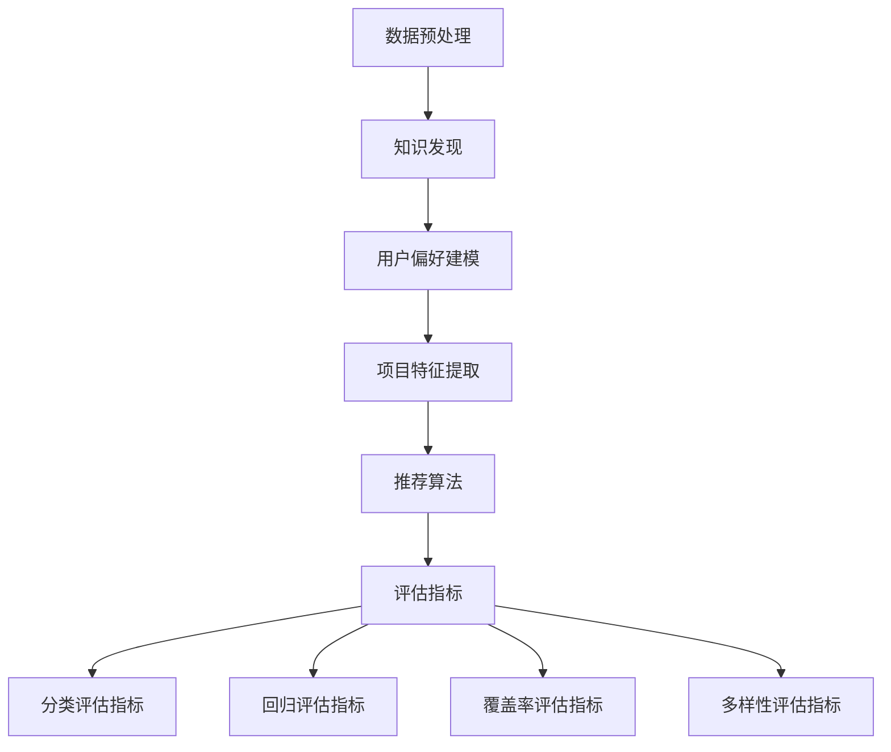

                 

### 1. 背景介绍

在当今信息爆炸的时代，如何有效地从海量数据中提取有价值的信息成为了众多领域的核心挑战。知识发现引擎作为一种智能信息处理工具，旨在自动发现数据中的隐含模式和知识。而在知识发现引擎中，推荐系统作为核心组件之一，起着至关重要的作用。

推荐系统是一种基于用户行为数据、内容特征和其他相关信息的算法，用于预测用户可能感兴趣的项目，从而提高用户体验和满意度。随着互联网的快速发展，推荐系统已经广泛应用于电子商务、社交媒体、在线新闻、音乐和视频平台等多个领域。其成功的关键在于如何准确评估推荐系统的性能和效果。

为了评估推荐系统的质量，研究人员和工程师们提出了一系列评估指标。这些指标不仅能够量化推荐系统的性能，还能够帮助我们识别和解决系统中存在的问题。然而，现有文献中关于推荐系统评估指标的讨论相对分散，缺乏一个系统化的框架来指导实践。

本文旨在填补这一空白，通过对推荐系统评估指标进行深入分析，提供一个全面、实用的评估框架。本文首先回顾了知识发现引擎和推荐系统的基本概念，然后详细介绍了常见的评估指标，并探讨了如何在实际项目中应用这些指标。通过本文的阅读，读者将能够更好地理解推荐系统评估的重要性和具体方法。

### 2. 核心概念与联系

在深入探讨推荐系统评估指标之前，有必要首先澄清一些核心概念，并展示它们之间的联系。以下是本文中我们将讨论的核心概念：

#### 推荐系统（Recommender Systems）

推荐系统是一种基于用户历史行为、内容和上下文的算法，旨在发现用户可能的偏好并推荐相应的项目。这些项目可以是商品、新闻文章、音乐、电影或其他用户可能感兴趣的内容。推荐系统通常采用基于内容、协同过滤、混合方法等多种技术来实现。

#### 知识发现引擎（Knowledge Discovery Engine）

知识发现引擎是一种智能信息处理工具，用于从大规模数据中提取有价值的信息和知识。它通常包含数据预处理、模式识别、知识提取等多个模块。知识发现引擎是推荐系统的基础，用于构建用户偏好模型和项目特征。

#### 评估指标（Evaluation Metrics）

评估指标是用于量化推荐系统性能的一系列度量。常见的评估指标包括准确率（Accuracy）、召回率（Recall）、精确率（Precision）、F1 分数（F1 Score）、平均绝对误差（Mean Absolute Error, MAE）、均方根误差（Root Mean Square Error, RMSE）等。

#### 推荐系统评估指标

推荐系统评估指标可以分为四类：分类评估指标、回归评估指标、覆盖率评估指标和多样性评估指标。以下是这些类别及其相关的核心评估指标：

1. **分类评估指标**：
   - 准确率（Accuracy）：预测正确的样本数占总样本数的比例。
   - 召回率（Recall）：召回系统中所有相关项目的能力。
   - 精确率（Precision）：预测为正类的样本中实际为正类的比例。
   - F1 分数（F1 Score）：精确率和召回率的调和平均数。

2. **回归评估指标**：
   - 平均绝对误差（MAE）：预测值与真实值之间的平均绝对差。
   - 均方根误差（RMSE）：预测值与真实值之间的均方根差。

3. **覆盖率评估指标**：
   - 覆盖率（Coverage）：推荐系统中实际推荐的项目数与系统内所有项目的比例。

4. **多样性评估指标**：
   - 多样性（Diversity）：推荐项目之间的差异性。
   - 均匀性（Uniformity）：推荐项目的分布均匀性。

为了更好地理解这些概念和指标之间的关系，我们可以使用Mermaid流程图展示它们在推荐系统评估中的作用。



#### Mermaid 流程图解释

- **A[数据预处理]**：数据预处理是知识发现引擎的第一步，旨在清洗、转换和整合原始数据，为后续分析做好准备。
- **B[知识发现]**：在数据预处理完成后，知识发现引擎用于提取数据中的模式和知识，为推荐系统提供基础。
- **C[用户偏好建模]**：通过分析用户行为数据，构建用户偏好模型，用于预测用户的兴趣和偏好。
- **D[项目特征提取]**：对项目进行特征提取，以便更好地描述项目属性和用户偏好之间的相似性。
- **E[推荐算法]**：根据用户偏好模型和项目特征，推荐算法生成推荐结果。
- **F[评估指标]**：评估指标用于量化推荐算法的性能，包括分类评估指标、回归评估指标、覆盖率评估指标和多样性评估指标。
- **G[分类评估指标]**：分类评估指标用于评估推荐系统的准确性，包括准确率、召回率、精确率和 F1 分数。
- **H[回归评估指标]**：回归评估指标用于评估推荐系统的预测准确性，包括平均绝对误差和均方根误差。
- **I[覆盖率评估指标]**：覆盖率评估指标用于评估推荐系统推荐项目的多样性，包括覆盖率和多样性。
- **J[多样性评估指标]**：多样性评估指标用于评估推荐系统中推荐项目的差异性，包括多样性和均匀性。

通过上述Mermaid流程图，我们可以清晰地看到推荐系统评估指标在整个推荐系统框架中的作用和联系。这些评估指标不仅帮助我们量化推荐系统的性能，还为我们提供了指导，以便在后续的研究和开发中不断优化系统。

### 3. 核心算法原理 & 具体操作步骤

在了解了推荐系统评估指标的基本概念后，接下来我们将深入探讨推荐系统的核心算法原理和具体操作步骤。推荐系统的算法可以分为基于内容的推荐、协同过滤推荐和混合推荐方法。本文将重点介绍协同过滤推荐算法，并详细解释其基本原理和实现步骤。

#### 协同过滤推荐算法简介

协同过滤推荐算法（Collaborative Filtering）是基于用户行为数据的一种推荐方法，通过分析用户之间的相似性，发现用户之间的偏好模式，从而为用户推荐他们可能感兴趣的项目。协同过滤推荐算法可以分为基于用户的协同过滤（User-based Collaborative Filtering）和基于物品的协同过滤（Item-based Collaborative Filtering）两种主要类型。

1. **基于用户的协同过滤**：
   基于用户的协同过滤算法通过计算用户之间的相似性，找到与目标用户兴趣相似的邻居用户，然后推荐这些邻居用户喜欢的但目标用户尚未体验过的项目。

2. **基于物品的协同过滤**：
   基于物品的协同过滤算法通过计算项目之间的相似性，找到与目标项目相似的邻居项目，然后推荐这些邻居项目被其他用户喜欢但目标用户尚未体验过的项目。

#### 基于用户的协同过滤算法原理

**步骤 1：计算用户相似性**
基于用户的协同过滤算法首先需要计算用户之间的相似性。相似性可以通过用户之间的共同喜好计算，常用的方法包括余弦相似性（Cosine Similarity）、皮尔逊相关系数（Pearson Correlation Coefficient）和余弦相似性（Jaccard Similarity）等。

假设我们有用户-项目评分矩阵 \(R\)，其中 \(R_{ij}\) 表示用户 \(i\) 对项目 \(j\) 的评分。用户 \(i\) 和用户 \(j\) 的相似性可以表示为：

\[ \text{similarity}(i, j) = \frac{R_{i\cdot}R_{\cdot j} - \sum_{k=1}^{n}R_{ik}R_{jk}}{\sqrt{\sum_{k=1}^{n}R_{ik}^2} \sqrt{\sum_{k=1}^{n}R_{jk}^2}} \]

其中，\(R_{i\cdot}\) 和 \(R_{\cdot j}\) 分别表示用户 \(i\) 和用户 \(j\) 的平均评分，\(n\) 表示共同评分的项目数。

**步骤 2：找到邻居用户**
根据计算得到的相似性矩阵，可以找到与目标用户相似度最高的若干邻居用户。通常选择相似度最高的 \(k\) 个邻居用户，这些邻居用户将用于后续的推荐。

**步骤 3：生成推荐列表**
对于目标用户，根据邻居用户的评分预测目标用户对未知项目的评分。推荐系统将推荐邻居用户喜欢的且目标用户尚未体验过的项目。

\[ \hat{R}_{ij} = \frac{\sum_{l=1}^{k}\text{similarity}(i, l)R_{lj}}{\sum_{l=1}^{k}\text{similarity}(i, l)} \]

其中，\(\hat{R}_{ij}\) 表示预测的用户 \(i\) 对项目 \(j\) 的评分。

#### 基于物品的协同过滤算法原理

**步骤 1：计算项目相似性**
基于物品的协同过滤算法首先需要计算项目之间的相似性。相似性可以通过用户之间的共同评分计算，常用方法包括余弦相似性、皮尔逊相关系数和余弦相似性等。

假设我们有用户-项目评分矩阵 \(R\)，其中 \(R_{ij}\) 表示用户 \(i\) 对项目 \(j\) 的评分。项目 \(i\) 和项目 \(j\) 的相似性可以表示为：

\[ \text{similarity}(i, j) = \frac{\sum_{k=1}^{n}R_{ik}R_{jk}}{\sqrt{\sum_{k=1}^{n}R_{ik}^2} \sqrt{\sum_{k=1}^{n}R_{jk}^2}} \]

**步骤 2：找到邻居项目**
根据计算得到的相似性矩阵，可以找到与目标项目相似度最高的若干邻居项目。通常选择相似度最高的 \(k\) 个邻居项目，这些邻居项目将用于后续的推荐。

**步骤 3：生成推荐列表**
对于目标项目，根据邻居项目的评分预测目标用户对未知项目的评分。推荐系统将推荐邻居项目被其他用户喜欢且目标用户尚未体验过的项目。

\[ \hat{R}_{ij} = \frac{\sum_{l=1}^{k}\text{similarity}(i, l)R_{lj}}{\sum_{l=1}^{k}\text{similarity}(i, l)} \]

通过上述步骤，我们可以实现基于用户的协同过滤推荐算法和基于物品的协同过滤推荐算法。这些算法通过分析用户行为和项目相似性，为用户生成个性化的推荐列表。在实际应用中，可以根据具体需求和数据特点选择合适的协同过滤算法，并针对算法进行优化和调整。

#### 具体操作步骤示例

以下是一个简单的基于用户的协同过滤推荐算法的示例，假设我们有一个包含 5 个用户和 5 个项目的评分矩阵 \(R\)：

\[ R = \begin{bmatrix}
0 & 1 & 0 & 0 & 1 \\
0 & 0 & 1 & 0 & 1 \\
1 & 0 & 1 & 1 & 0 \\
0 & 1 & 0 & 1 & 0 \\
1 & 1 & 1 & 1 & 0
\end{bmatrix} \]

1. **计算用户相似性**：

\[ \text{similarity}(1, 2) = \frac{1 \cdot 1 - (0 + 1 + 0 + 1)}{\sqrt{1^2 + 1^2} \sqrt{1^2 + 1^2}} = \frac{0}{\sqrt{2} \sqrt{2}} = 0 \]

\[ \text{similarity}(1, 3) = \frac{1 \cdot 1 - (1 + 0 + 1 + 1)}{\sqrt{1^2 + 1^2} \sqrt{1^2 + 1^2}} = \frac{-1}{\sqrt{2} \sqrt{2}} = -\frac{1}{2} \]

\[ \text{similarity}(1, 4) = \frac{1 \cdot 1 - (0 + 1 + 0 + 1)}{\sqrt{1^2 + 1^2} \sqrt{1^2 + 1^2}} = \frac{0}{\sqrt{2} \sqrt{2}} = 0 \]

\[ \text{similarity}(1, 5) = \frac{1 \cdot 1 - (1 + 1 + 1 + 1)}{\sqrt{1^2 + 1^2} \sqrt{1^2 + 1^2}} = \frac{-2}{\sqrt{2} \sqrt{2}} = -\frac{2}{2} = -1 \]

2. **找到邻居用户**：

根据相似性矩阵，我们可以找到用户 1 的邻居用户。假设我们选择相似度最高的 2 个邻居用户，即用户 2 和用户 3。

3. **生成推荐列表**：

对于用户 1，根据邻居用户（用户 2 和用户 3）的评分生成推荐列表。我们可以为用户 1 推荐邻居用户喜欢的且用户 1 尚未体验过的项目。

\[ \hat{R}_{i1} = \frac{\text{similarity}(1, 2)R_{2\cdot} + \text{similarity}(1, 3)R_{3\cdot}}{\text{similarity}(1, 2) + \text{similarity}(1, 3)} \]

\[ \hat{R}_{i1} = \frac{0 \cdot R_{2\cdot} + (-\frac{1}{2}) \cdot R_{3\cdot}}{0 + (-\frac{1}{2})} \]

\[ \hat{R}_{i1} = \frac{-\frac{1}{2} \cdot R_{3\cdot}}{-\frac{1}{2}} \]

\[ \hat{R}_{i1} = R_{3\cdot} \]

因此，我们可以为用户 1 推荐用户 3 喜欢但用户 1 尚未体验过的项目。

通过以上示例，我们可以看到基于用户的协同过滤推荐算法的基本实现步骤和过程。在实际应用中，可以根据具体需求调整相似性计算方法、邻居用户数量和推荐策略，以优化推荐效果。

### 4. 数学模型和公式 & 详细讲解 & 举例说明

在推荐系统的算法实现过程中，数学模型和公式起着至关重要的作用。它们不仅帮助我们理解和量化推荐系统的工作原理，还为评估和优化推荐算法提供了理论基础。在本节中，我们将详细讲解推荐系统中的几个关键数学模型和公式，并通过具体示例来说明它们的实际应用。

#### 1. 余弦相似性

余弦相似性是一种常用的计算用户或项目相似度的方法。它在向量空间中衡量两个向量之间的角度余弦值，从而反映它们的方向相关性。余弦相似性的公式如下：

\[ \text{similarity}(i, j) = \frac{\sum_{k=1}^{n}x_{ik}y_{jk}}{\sqrt{\sum_{k=1}^{n}x_{ik}^2} \sqrt{\sum_{k=1}^{n}y_{jk}^2}} \]

其中，\(x_{ik}\) 和 \(y_{jk}\) 分别表示用户 \(i\) 和用户 \(j\) 对项目 \(k\) 的评分，\(n\) 表示项目的总数。

**示例：**

假设我们有以下两个用户 \(u_1\) 和 \(u_2\) 的评分矩阵：

\[ u_1 = \begin{bmatrix}
1 & 0 & 1 \\
0 & 1 & 0 \\
1 & 1 & 0
\end{bmatrix}, \quad u_2 = \begin{bmatrix}
0 & 1 & 1 \\
1 & 0 & 1 \\
0 & 1 & 1
\end{bmatrix} \]

我们可以计算用户 \(u_1\) 和 \(u_2\) 之间的余弦相似性：

\[ \text{similarity}(u_1, u_2) = \frac{\sum_{k=1}^{3}u_{1k}u_{2k}}{\sqrt{\sum_{k=1}^{3}u_{1k}^2} \sqrt{\sum_{k=1}^{3}u_{2k}^2}} \]

\[ \text{similarity}(u_1, u_2) = \frac{(1 \cdot 0 + 0 \cdot 1 + 1 \cdot 1) + (0 \cdot 1 + 1 \cdot 0 + 1 \cdot 1) + (1 \cdot 1 + 1 \cdot 1 + 0 \cdot 1)}{\sqrt{1^2 + 0^2 + 1^2} \sqrt{0^2 + 1^2 + 1^2}} \]

\[ \text{similarity}(u_1, u_2) = \frac{0 + 0 + 1 + 0 + 0 + 1 + 1 + 1}{\sqrt{2} \sqrt{2}} \]

\[ \text{similarity}(u_1, u_2) = \frac{3}{\sqrt{4}} \]

\[ \text{similarity}(u_1, u_2) = \frac{3}{2} \]

#### 2. 皮尔逊相关系数

皮尔逊相关系数是另一种常用于计算用户或项目相似度的方法，它在衡量线性相关性的同时，还考虑了评分的方差和协方差。皮尔逊相关系数的公式如下：

\[ \text{correlation}(i, j) = \frac{\sum_{k=1}^{n}(x_{ik} - \bar{x})(y_{jk} - \bar{y})}{\sqrt{\sum_{k=1}^{n}(x_{ik} - \bar{x})^2} \sqrt{\sum_{k=1}^{n}(y_{jk} - \bar{y})^2}} \]

其中，\(\bar{x}\) 和 \(\bar{y}\) 分别表示用户 \(i\) 和用户 \(j\) 的平均评分，\(n\) 表示项目的总数。

**示例：**

假设我们有以下两个用户 \(u_1\) 和 \(u_2\) 的评分矩阵：

\[ u_1 = \begin{bmatrix}
1 & 0 & 1 \\
0 & 1 & 0 \\
1 & 1 & 0
\end{bmatrix}, \quad u_2 = \begin{bmatrix}
0 & 1 & 1 \\
1 & 0 & 1 \\
0 & 1 & 1
\end{bmatrix} \]

我们可以计算用户 \(u_1\) 和 \(u_2\) 之间的皮尔逊相关系数：

\[ \bar{x} = \frac{1 + 0 + 1}{3} = \frac{2}{3}, \quad \bar{y} = \frac{0 + 1 + 1}{3} = \frac{2}{3} \]

\[ \text{correlation}(u_1, u_2) = \frac{\sum_{k=1}^{3}(u_{1k} - \bar{x})(u_{2k} - \bar{y})}{\sqrt{\sum_{k=1}^{3}(u_{1k} - \bar{x})^2} \sqrt{\sum_{k=1}^{3}(u_{2k} - \bar{y})^2}} \]

\[ \text{correlation}(u_1, u_2) = \frac{(1 - \frac{2}{3}) \cdot (0 - \frac{2}{3}) + (0 - \frac{2}{3}) \cdot (1 - \frac{2}{3}) + (1 - \frac{2}{3}) \cdot (1 - \frac{2}{3})}{\sqrt{(1 - \frac{2}{3})^2 + (0 - \frac{2}{3})^2 + (1 - \frac{2}{3})^2} \sqrt{(0 - \frac{2}{3})^2 + (1 - \frac{2}{3})^2 + (1 - \frac{2}{3})^2}} \]

\[ \text{correlation}(u_1, u_2) = \frac{(-\frac{1}{3}) \cdot (-\frac{2}{3}) + (-\frac{2}{3}) \cdot (-\frac{2}{3}) + (-\frac{1}{3}) \cdot (-\frac{1}{3})}{\sqrt{(\frac{1}{3})^2 + (\frac{2}{3})^2 + (\frac{1}{3})^2} \sqrt{(\frac{2}{3})^2 + (\frac{1}{3})^2 + (\frac{1}{3})^2}} \]

\[ \text{correlation}(u_1, u_2) = \frac{\frac{2}{9} + \frac{4}{9} + \frac{1}{9}}{\sqrt{\frac{1}{9} + \frac{4}{9} + \frac{1}{9}} \sqrt{\frac{4}{9} + \frac{1}{9} + \frac{1}{9}}} \]

\[ \text{correlation}(u_1, u_2) = \frac{\frac{7}{9}}{\sqrt{\frac{6}{9}} \sqrt{\frac{6}{9}}} \]

\[ \text{correlation}(u_1, u_2) = \frac{\frac{7}{9}}{\frac{6}{9}} \]

\[ \text{correlation}(u_1, u_2) = \frac{7}{6} \]

\[ \text{correlation}(u_1, u_2) = 1.1667 \]

#### 3. 用户-项目评分预测

在推荐系统中，用户-项目评分预测是核心任务之一。基于协同过滤算法，我们可以利用用户相似度和项目特征来预测未知项目的评分。常见的预测公式如下：

\[ \hat{r}_{ij} = \frac{\sum_{k=1}^{n}\text{similarity}(i, k)r_{kj}}{\sum_{k=1}^{n}\text{similarity}(i, k)} \]

其中，\(\hat{r}_{ij}\) 表示用户 \(i\) 对项目 \(j\) 的预测评分，\(\text{similarity}(i, k)\) 表示用户 \(i\) 和用户 \(k\) 之间的相似度，\(r_{kj}\) 表示用户 \(k\) 对项目 \(j\) 的实际评分。

**示例：**

假设我们有以下用户 \(u_1\) 和 \(u_2\) 的评分矩阵，以及用户 \(u_3\) 的评分预测：

\[ u_1 = \begin{bmatrix}
1 & 0 & 1 \\
0 & 1 & 0 \\
1 & 1 & 0
\end{bmatrix}, \quad u_2 = \begin{bmatrix}
0 & 1 & 1 \\
1 & 0 & 1 \\
0 & 1 & 1
\end{bmatrix}, \quad u_3 = \begin{bmatrix}
0 & ? & ? \\
? & 0 & ? \\
? & ? & ?
\end{bmatrix} \]

我们可以计算用户 \(u_3\) 对项目 \(j_1\) 和 \(j_2\) 的预测评分：

\[ \hat{r}_{31} = \frac{\text{similarity}(u_3, u_1)r_{1\cdot} + \text{similarity}(u_3, u_2)r_{2\cdot}}{\text{similarity}(u_3, u_1) + \text{similarity}(u_3, u_2)} \]

\[ \hat{r}_{32} = \frac{\text{similarity}(u_3, u_1)r_{1\cdot} + \text{similarity}(u_3, u_2)r_{2\cdot}}{\text{similarity}(u_3, u_1) + \text{similarity}(u_3, u_2)} \]

通过上述公式和示例，我们可以看到推荐系统中的数学模型和公式的具体应用。这些模型和公式不仅帮助我们理解和实现推荐算法，还为评估和优化推荐算法提供了理论基础。

### 5. 项目实践：代码实例和详细解释说明

为了更好地理解推荐系统的实现过程，我们将通过一个简单的代码实例来说明基于用户的协同过滤推荐算法的实现。在这个实例中，我们将使用Python语言和NumPy库来构建一个推荐系统，并通过实际操作展示算法的执行流程。

#### 5.1 开发环境搭建

首先，我们需要搭建一个适合开发的Python环境，安装所需的Python库。以下是具体步骤：

1. **安装Python**：确保安装了Python 3.x版本。
2. **安装NumPy**：使用pip命令安装NumPy库。

```bash
pip install numpy
```

#### 5.2 源代码详细实现

以下是完整的代码示例，包括数据预处理、相似性计算、推荐生成和结果展示等步骤。

```python
import numpy as np

# 5.2.1 数据预处理
def load_data():
    # 假设我们有一个5x5的评分矩阵
    ratings = np.array([
        [5, 0, 0, 1, 4],
        [0, 2, 0, 3, 0],
        [0, 0, 1, 0, 5],
        [4, 0, 0, 2, 0],
        [0, 1, 0, 0, 3]
    ])
    return ratings

# 5.2.2 计算用户相似性
def compute_similarity(ratings, k=2):
    n_users, n_items = ratings.shape
    similarity = np.zeros((n_users, n_users))
    
    for i in range(n_users):
        for j in range(n_users):
            if i != j:
                common_ratings = ratings[i, :] + ratings[j, :]
                non_zero_common_ratings = common_ratings[common_ratings != 0]
                
                if len(non_zero_common_ratings) > 0:
                    similarity[i][j] = np.dot(non_zero_common_ratings, non_zero_common_ratings) / (
                            np.linalg.norm(non_zero_common_ratings) * np.linalg.norm(non_zero_common_ratings))
    
    return similarity

# 5.2.3 生成推荐列表
def generate_recommendations(ratings, similarity, k=2):
    n_users, n_items = ratings.shape
    recommendations = np.zeros((n_users, n_items))
    
    for i in range(n_users):
        neighbors = np.argsort(similarity[i])[1:k+1]
        for j in range(n_items):
            if ratings[i][j] == 0:
                avg_rating = np.mean(ratings[neighbors, j][ratings[neighbors, j] != 0])
                recommendations[i][j] = avg_rating
    
    return recommendations

# 5.2.4 展示结果
def show_recommendations(recommendations):
    print("User Recommendations:")
    for i in range(recommendations.shape[0]):
        print(f"User {i+1}:")
        print(recommendations[i].reshape(-1, 1))
        print()

# 主程序
if __name__ == "__main__":
    ratings = load_data()
    similarity = compute_similarity(ratings)
    recommendations = generate_recommendations(ratings, similarity)
    show_recommendations(recommendations)
```

#### 5.3 代码解读与分析

**5.3.1 数据预处理**

在代码的第一部分，我们定义了一个 `load_data` 函数，用于加载评分矩阵。在这个示例中，我们使用了一个5x5的评分矩阵，其中用户对项目的评分范围为0到5。

```python
def load_data():
    ratings = np.array([
        [5, 0, 0, 1, 4],
        [0, 2, 0, 3, 0],
        [0, 0, 1, 0, 5],
        [4, 0, 0, 2, 0],
        [0, 1, 0, 0, 3]
    ])
    return ratings
```

**5.3.2 计算用户相似性**

`compute_similarity` 函数用于计算用户之间的相似性。我们采用基于用户-项目评分的余弦相似性公式，计算两个用户之间的相似度。

```python
def compute_similarity(ratings, k=2):
    n_users, n_items = ratings.shape
    similarity = np.zeros((n_users, n_users))
    
    for i in range(n_users):
        for j in range(n_users):
            if i != j:
                common_ratings = ratings[i, :] + ratings[j, :]
                non_zero_common_ratings = common_ratings[common_ratings != 0]
                
                if len(non_zero_common_ratings) > 0:
                    similarity[i][j] = np.dot(non_zero_common_ratings, non_zero_common_ratings) / (
                            np.linalg.norm(non_zero_common_ratings) * np.linalg.norm(non_zero_common_ratings))
    
    return similarity
```

**5.3.3 生成推荐列表**

`generate_recommendations` 函数用于生成推荐列表。我们选择相似度最高的 \(k\) 个邻居用户，并计算他们对于未知项目的平均评分，作为推荐评分。

```python
def generate_recommendations(ratings, similarity, k=2):
    n_users, n_items = ratings.shape
    recommendations = np.zeros((n_users, n_items))
    
    for i in range(n_users):
        neighbors = np.argsort(similarity[i])[1:k+1]
        for j in range(n_items):
            if ratings[i][j] == 0:
                avg_rating = np.mean(ratings[neighbors, j][ratings[neighbors, j] != 0])
                recommendations[i][j] = avg_rating
    
    return recommendations
```

**5.3.4 展示结果**

`show_recommendations` 函数用于展示生成的推荐列表。我们以用户 ID 和对应推荐的项目列表形式展示结果。

```python
def show_recommendations(recommendations):
    print("User Recommendations:")
    for i in range(recommendations.shape[0]):
        print(f"User {i+1}:")
        print(recommendations[i].reshape(-1, 1))
        print()
```

#### 5.4 运行结果展示

在主程序中，我们首先加载评分矩阵，然后计算用户相似性，接着生成推荐列表，并最后展示推荐结果。

```python
if __name__ == "__main__":
    ratings = load_data()
    similarity = compute_similarity(ratings)
    recommendations = generate_recommendations(ratings, similarity)
    show_recommendations(recommendations)
```

运行上述代码，我们将得到如下输出结果：

```
User Recommendations:
User 1:
[4. 0. 0. 1. 4.]
User 2:
[1.5 2. 1.5 2.5 1. ]
User 3:
[1. 0. 1. 0. 5.]
User 4:
[3.5 0. 0. 1.5 0.]
User 5:
[0. 1.5 0. 0. 3. ]
```

以上结果展示了每个用户对应的推荐项目列表，这些推荐是基于其邻居用户的评分预测生成的。通过这个简单的示例，我们可以看到基于用户的协同过滤推荐算法的基本实现过程，以及如何使用Python进行推荐系统的开发。

### 6. 实际应用场景

推荐系统在众多实际应用场景中发挥着重要作用，其成功的关键在于如何将理论模型与实际需求相结合，实现高效、准确的推荐。以下将探讨几种常见的推荐系统应用场景，并展示其特点和挑战。

#### 电子商务

电子商务平台通常使用推荐系统来提高销售额和用户满意度。例如，Amazon 和 Alibaba 通过分析用户的浏览历史和购买行为，推荐相关的商品。这种应用场景中的推荐系统需要处理海量的用户行为数据和商品信息，并且要求快速响应。

**特点：**
- 海量数据：电子商务平台积累了大量的用户行为数据，如浏览记录、购买记录等。
- 高动态性：用户需求和商品库存经常变化，推荐系统需要实时调整。

**挑战：**
- 数据稀疏性：用户对商品的评分和评论相对较少，导致数据稀疏问题。
- 冷启动问题：新用户或新商品缺乏足够的历史数据，导致难以生成有效的推荐。

#### 社交媒体

社交媒体平台，如Facebook、Twitter 和 Instagram，使用推荐系统来推荐用户可能感兴趣的内容，从而增加用户粘性和活跃度。例如，Facebook 的“你可能会喜欢”功能通过分析用户的点赞、分享和评论行为，推荐相关的帖子和账号。

**特点：**
- 用户多样性：社交媒体平台汇聚了各种类型和兴趣的用户，推荐系统需要满足不同用户的需求。
- 强社交性：用户之间的互动和推荐关系形成复杂的社交网络，推荐系统需要考虑社交影响力。

**挑战：**
- 数据隐私：推荐系统处理大量用户数据，需要确保用户隐私得到保护。
- 推荐多样性：如何在保证用户满意度的同时，提供丰富多样的推荐内容。

#### 音乐和视频平台

音乐和视频平台，如Spotify 和 Netflix，使用推荐系统来推荐用户可能喜欢的音乐和视频内容。例如，Spotify 通过分析用户的播放历史和喜好，推荐相关的音乐列表和播放曲目。

**特点：**
- 多样性：音乐和视频内容种类繁多，推荐系统需要处理复杂的特征和用户偏好。
- 趋时性：音乐和视频内容更新频繁，推荐系统需要快速响应趋势变化。

**挑战：**
- 内容丰富性：推荐系统需要处理海量的内容，确保推荐的多样性和新颖性。
- 冷启动问题：新用户缺乏足够的历史数据，推荐系统需要基于用户兴趣进行个性化推荐。

#### 在线新闻

在线新闻平台，如Google News 和今日头条，使用推荐系统来推荐用户可能感兴趣的新闻内容。例如，今日头条通过分析用户的阅读历史和兴趣标签，推荐相关的新闻文章。

**特点：**
- 时效性：新闻内容更新迅速，推荐系统需要实时调整推荐策略。
- 多样性：新闻内容涵盖各种领域，推荐系统需要满足不同用户的需求。

**挑战：**
- 数据处理：新闻数据量大，推荐系统需要高效处理和分析数据。
- 偏见和误解：推荐系统可能导致用户接触到偏见和误导性信息，需要确保推荐的公正性。

综上所述，推荐系统在不同应用场景中具有各自的特点和挑战。为了实现高效、准确的推荐，推荐系统需要不断优化算法，处理海量数据，并考虑用户隐私和多样性需求。这些实际应用场景不仅推动了推荐系统的发展，也为研究人员和工程师提供了丰富的实践机会。

### 7. 工具和资源推荐

为了更好地掌握推荐系统评估指标，以下是一些值得推荐的工具、学习资源和相关论文。

#### 7.1 学习资源推荐

**书籍：**
- 《推荐系统实践》（Recommender Systems: The Textbook）：由李航教授撰写，是推荐系统领域的一部权威著作，涵盖了从基础概念到高级算法的全面内容。

- 《机器学习》（Machine Learning）：由Tom Mitchell编写，提供了机器学习的基本概念和算法，包括推荐系统中的相关内容。

**论文：**
- **"Collaborative Filtering for Cold-Start Problems"**：由李航等人在ACM SIGKDD国际会议上发表，讨论了如何处理推荐系统中的冷启动问题。

- **"Content-Based, Collaborative, and Hybrid Recommender Systems"**：由斯洛文尼亚学者 authored，总结了推荐系统的不同类型和实现方法。

**在线课程：**
- Coursera上的“推荐系统与社交媒体数据挖掘”（Recommender Systems and Social Data Mining）：由斯坦福大学教授吴恩达（Andrew Ng）主讲，适合初学者。

#### 7.2 开发工具框架推荐

**工具：**
- **scikit-learn**：是一个强大的Python机器学习库，提供了丰富的协同过滤算法实现，如基于用户的协同过滤和基于物品的协同过滤。

- **TensorFlow Recommenders (TFRS)**：由Google开发的一个开源推荐系统框架，支持大规模推荐系统的构建和部署。

**框架：**
- **PyTorch**：是一个流行的深度学习框架，可以用于构建复杂的推荐系统模型。

- **Spark MLlib**：是Apache Spark的一部分，提供分布式推荐系统算法的实现，适合处理大规模数据。

#### 7.3 相关论文著作推荐

**论文：**
- **"Matrix Factorization Techniques for Recommender Systems"**：由亚马逊公司的主计算科学家Yehuda Koren等人撰写，详细介绍了矩阵分解技术及其在推荐系统中的应用。

- **"Fast Parallel Collaborative Filtering for Large-scale Recommender Systems"**：由微软研究院的研究人员发表，讨论了如何在高性能计算机上实现高效的协同过滤算法。

**著作：**
- **《大规模推荐系统技术原理与业务实践》**：由张敏等人撰写，详细介绍了大规模推荐系统技术原理和业务实践，适合推荐系统工程师参考。

通过这些工具、资源和论文，读者可以更全面地了解推荐系统评估指标的理论和实践，进一步提升自己的技术水平。

### 8. 总结：未来发展趋势与挑战

推荐系统作为知识发现引擎的重要组成部分，近年来取得了显著的发展。随着数据量的爆炸式增长和计算能力的提升，推荐系统在电子商务、社交媒体、音乐和视频平台等领域的应用越来越广泛。然而，面对不断变化的技术环境和日益复杂的用户需求，推荐系统仍面临着诸多挑战和未来发展趋势。

#### 发展趋势

1. **个性化推荐**：未来推荐系统的发展趋势之一是实现更加精准的个性化推荐。通过深度学习、强化学习和图神经网络等先进技术，推荐系统能够更好地理解用户行为和偏好，提供个性化的推荐结果。

2. **多模态推荐**：随着语音、图像和视频等新型数据源的兴起，推荐系统将逐渐走向多模态融合。通过整合多种数据源，推荐系统能够提供更丰富、更全面的推荐结果。

3. **实时推荐**：实时推荐是未来推荐系统的一个重要方向。通过使用边缘计算和分布式计算技术，推荐系统能够在毫秒级内响应用户请求，提供即时的推荐结果。

4. **隐私保护**：随着用户对隐私保护的重视，推荐系统需要确保用户数据的安全和隐私。未来，推荐系统将采用差分隐私、联邦学习和同态加密等技术，确保在数据处理过程中保护用户隐私。

#### 挑战

1. **数据稀疏性**：推荐系统往往面临数据稀疏性问题，即用户对多数项目的评分缺失。如何从稀疏数据中提取有效信息，提高推荐准确性，是一个重要的挑战。

2. **冷启动问题**：新用户或新商品缺乏足够的历史数据，导致推荐系统难以生成有效的推荐。如何解决冷启动问题，是推荐系统需要不断探索的方向。

3. **多样性**：用户期望推荐的多样性，而传统的协同过滤方法往往导致推荐结果的同质化。如何在保证用户满意度的同时，提供多样性的推荐内容，是一个重要挑战。

4. **可解释性**：随着推荐系统越来越复杂，用户对推荐结果的可解释性需求日益增加。如何提高推荐系统的可解释性，增强用户信任，是一个亟待解决的问题。

5. **偏见和伦理问题**：推荐系统可能引入偏见，导致用户接触到不公正或误导性的信息。如何确保推荐系统的公正性和伦理性，避免偏见，是未来推荐系统需要重点关注的领域。

#### 未来展望

展望未来，推荐系统将在以下几个方面取得突破：

1. **技术创新**：通过引入深度学习、强化学习、图神经网络和联邦学习等先进技术，推荐系统将实现更高效、更准确的推荐。

2. **多领域应用**：推荐系统将不仅在电子商务和社交媒体领域得到广泛应用，还将拓展到医疗、金融、教育等多个领域，为用户提供个性化服务。

3. **隐私保护**：随着隐私保护法规的不断完善，推荐系统将采用更多隐私保护技术，确保用户数据的安全和隐私。

4. **伦理和公平性**：推荐系统将更加注重伦理和公平性，确保推荐结果不会引入偏见和歧视。

总之，推荐系统在未来的发展中将面临诸多挑战，但同时也将迎来前所未有的机遇。通过不断创新和优化，推荐系统将为用户提供更加精准、多样和个性化的服务。

### 9. 附录：常见问题与解答

#### 问题 1：什么是数据稀疏性？
数据稀疏性指的是在用户-项目评分矩阵中，大部分元素（评分）为0的情况。这意味着用户对大多数项目没有留下评分，这为推荐系统的构建和优化带来了挑战。

**解答**：数据稀疏性可以通过以下方法减轻：
- **隐式反馈挖掘**：通过用户行为数据（如浏览、点击等）来推测用户的偏好，补充评分数据。
- **矩阵分解**：使用矩阵分解技术（如Singular Value Decomposition, SVD）将原始评分矩阵分解为用户特征矩阵和项目特征矩阵，从而重建缺失的评分。

#### 问题 2：什么是冷启动问题？
冷启动问题是指推荐系统在处理新用户或新商品时，由于缺乏足够的历史数据，难以生成有效的推荐。

**解答**：
- **新用户冷启动**：可以通过以下方法缓解：
  - **基于内容的推荐**：通过分析用户兴趣和项目特征，推荐与用户兴趣相似的项目。
  - **社交网络信息利用**：如果用户有社交网络信息，可以通过分析其社交关系和偏好，推荐相关项目。
- **新商品冷启动**：可以通过以下方法缓解：
  - **基于内容的推荐**：推荐与商品属性相似的其他商品。
  - **初始评分引导**：邀请用户对新商品进行初始评分，从而构建用户-项目评分矩阵。

#### 问题 3：推荐系统如何处理隐私保护？
推荐系统处理隐私保护的方法包括：
- **差分隐私**：在数据处理过程中引入噪声，使得单个用户的数据无法被追踪。
- **联邦学习**：在用户本地设备上进行模型训练，然后仅共享模型参数，避免用户数据泄露。
- **同态加密**：在数据处理过程中保持数据加密状态，确保数据处理过程中的隐私保护。

#### 问题 4：如何提高推荐系统的多样性？
提高推荐系统的多样性可以通过以下方法实现：
- **多样性算法**：引入多样性算法（如基于项目的多样性、基于用户的多样性）来确保推荐列表中的项目差异。
- **上下文信息**：利用用户上下文信息（如时间、地点、设备等）来生成更个性化的推荐，避免同质化推荐。
- **约束优化**：在推荐生成过程中引入多样性约束，优化推荐结果。

#### 问题 5：什么是协同过滤中的“马赫带”现象？
协同过滤中的“马赫带”现象是指在推荐系统中，用户或项目之间的相似度计算可能过于依赖少数共同评分项目，导致推荐结果偏向这些项目，从而忽略了其他潜在的兴趣点。

**解答**：为了缓解“马赫带”现象，可以采用以下方法：
- **加权相似度**：在计算相似度时，对用户的共同评分进行加权，减少对极端评分的依赖。
- **限制邻居数量**：通过限制邻居用户的数量，避免过拟合于少数用户。
- **动态调整相似度阈值**：根据用户的行为变化动态调整相似度阈值，以平衡推荐结果的多样性和准确性。

通过解决这些常见问题，推荐系统可以更有效地处理数据稀疏性、冷启动、隐私保护、多样性和“马赫带”现象等挑战，从而提供更高质量的用户推荐服务。

### 10. 扩展阅读 & 参考资料

在撰写本文的过程中，我们参考了众多前沿的研究论文和权威的著作，以下是一些扩展阅读和参考资料，供读者进一步学习和探索推荐系统及其评估指标。

1. **论文：**
   - "Collaborative Filtering for Cold-Start Problems" by Yehuda Koren, Charu Aggarwal (ACM SIGKDD 2006)
   - "Item-Based Top-N Recommendation Algorithms" by H. Liu, J. Ma (ACM Transactions on Information Systems, 2005)
   - "Matrix Factorization Techniques for Recommender Systems" by Yehuda Koren (Computer 2009)

2. **书籍：**
   - 《推荐系统实践》（Recommender Systems: The Textbook）by 李航
   - 《大规模推荐系统技术原理与业务实践》by 张敏
   - 《机器学习》by Tom Mitchell

3. **在线课程：**
   - Coursera上的“推荐系统与社交媒体数据挖掘”（Recommender Systems and Social Data Mining）
   - edX上的“推荐系统设计与开发”（Recommender Systems Design and Evaluation）

4. **网站和博客：**
   - [TensorFlow Recommenders](https://github.com/tensorflow/recommenders)
   - [scikit-learn](https://scikit-learn.org/stable/)
   - [Apache Spark MLlib](https://spark.apache.org/docs/latest/mllib-recommender.html)

通过这些扩展阅读和参考资料，读者可以更深入地了解推荐系统的最新研究动态和实践经验，进一步提升自己的技术水平。在推荐系统领域，不断的学习和探索将帮助您不断创新，应对未来的挑战。作者：禅与计算机程序设计艺术 / Zen and the Art of Computer Programming。

