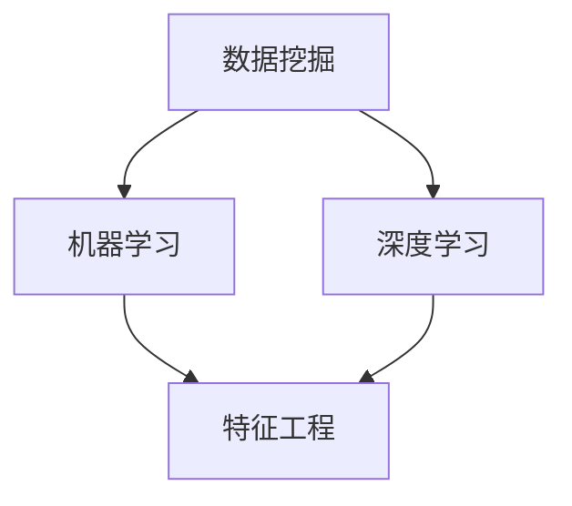

                 

### 1. 背景介绍

**知识发现引擎的概念**

知识发现引擎（Knowledge Discovery Engine，简称KDE）是一种能够从大量数据中自动识别出有价值知识和模式的人工智能技术。它的核心目标是通过数据挖掘和机器学习技术，帮助用户从海量的数据中提取出有用的信息，从而为决策提供支持。

知识发现引擎的重要性体现在多个方面。首先，在商业领域，KDE可以帮助企业更好地理解客户行为，优化产品推荐系统，提升客户满意度。其次，在医疗领域，KDE可以通过分析病患数据，帮助医生进行疾病诊断和治疗方案制定。此外，在金融、教育、科研等领域，KDE都有着广泛的应用。

**机器学习在知识发现引擎中的应用**

机器学习（Machine Learning，ML）是知识发现引擎的重要组成部分。通过机器学习算法，KDE能够自动地从数据中学习规律和模式，提高数据分析的效率和准确性。常见的机器学习算法包括线性回归、逻辑回归、决策树、随机森林、支持向量机、神经网络等。

机器学习算法在KDE中的应用场景主要包括以下几个方面：

1. **数据预处理**：在知识发现过程中，数据的质量和格式至关重要。机器学习算法可以帮助我们进行数据清洗、归一化、特征提取等预处理工作，为后续的分析打下基础。
2. **特征选择**：从大量特征中选择出对目标任务最有影响的特征，可以提高模型的效果和效率。
3. **模式识别**：通过分类、聚类、关联规则等算法，从数据中挖掘出有用的知识和模式。
4. **预测建模**：利用历史数据构建预测模型，对未来事件进行预测。

**知识发现引擎的发展历程**

知识发现引擎的发展可以追溯到20世纪80年代，随着计算机技术和数据挖掘技术的发展，KDE逐渐从理论研究走向实际应用。早期的知识发现工作主要集中在数据库中的模式识别和关联规则挖掘，如Apriori算法等。

进入21世纪，随着互联网和大数据技术的发展，知识发现引擎的应用领域进一步扩展，包括文本挖掘、图像识别、语音识别等。同时，机器学习算法的快速发展，使得KDE在数据处理和分析方面的能力得到了显著提升。

**本博客的主题**

本文将重点探讨知识发现引擎中的机器学习算法优化。具体来说，我们将分析现有机器学习算法在KDE中的应用，探讨其优缺点，并介绍一些优化方法，以提高KDE的性能和效果。文章结构如下：

1. 背景介绍
2. 核心概念与联系
3. 核心算法原理 & 具体操作步骤
4. 数学模型和公式 & 详细讲解 & 举例说明
5. 项目实践：代码实例和详细解释说明
6. 实际应用场景
7. 工具和资源推荐
8. 总结：未来发展趋势与挑战
9. 附录：常见问题与解答
10. 扩展阅读 & 参考资料

通过本文的阅读，读者可以系统地了解知识发现引擎中的机器学习算法优化，为实际项目提供技术指导。接下来，我们将深入探讨知识发现引擎中的核心概念和算法原理。

### 2. 核心概念与联系

在深入探讨知识发现引擎（KDE）中的机器学习算法优化之前，我们需要先了解一些核心概念和其相互之间的关系。这些概念包括数据挖掘、机器学习、深度学习、特征工程等。通过绘制Mermaid流程图，我们可以直观地展示这些概念之间的联系。

**Mermaid流程图**

下面是一个简化的Mermaid流程图，描述了数据挖掘、机器学习、深度学习、特征工程等核心概念及其关系：



**核心概念解释**

1. **数据挖掘（Data Mining）**：
   数据挖掘是从大量数据中提取有用信息的过程。它包括模式识别、关联规则挖掘、分类、聚类等任务。数据挖掘是知识发现引擎的核心，它为机器学习和深度学习提供了数据基础。

2. **机器学习（Machine Learning）**：
   机器学习是一种通过算法从数据中学习规律和模式的技术。它包括监督学习、无监督学习、半监督学习等。在知识发现引擎中，机器学习算法用于数据预处理、特征选择、模式识别等任务。

3. **深度学习（Deep Learning）**：
   深度学习是机器学习的一个分支，它利用多层神经网络来模拟人脑的神经元结构，通过多层次的非线性变换来学习复杂的数据特征。深度学习在图像识别、语音识别等领域取得了显著的成果。

4. **特征工程（Feature Engineering）**：
   特征工程是机器学习和深度学习中的一个重要步骤，它涉及从原始数据中提取或构造新的特征，以提升模型性能。特征工程包括特征选择、特征变换、特征缩放等。

**概念关系分析**

- **数据挖掘**是知识发现引擎的基础，通过数据挖掘可以从大量数据中提取出有用的信息。
- **机器学习**和**深度学习**是基于数据挖掘得到的特征进行学习和模式识别的技术。
- **特征工程**是机器学习和深度学习的重要环节，通过特征工程可以优化数据，提高模型的准确性和效率。

通过上述Mermaid流程图和核心概念解释，我们可以清晰地看到知识发现引擎中的各个核心概念及其相互之间的关系。接下来，我们将深入探讨知识发现引擎中的核心算法原理和具体操作步骤。

### 3. 核心算法原理 & 具体操作步骤

在知识发现引擎中，机器学习算法起到了关键作用。这些算法通过从数据中学习模式和规律，帮助我们从复杂的数据集中提取出有价值的信息。以下是一些常用的机器学习算法及其原理和具体操作步骤。

#### 3.1 线性回归（Linear Regression）

**原理**：
线性回归是一种基于线性关系的预测模型。它的目标是找到一个最佳直线，使得数据点尽可能接近这条直线。线性回归公式如下：

$$y = wx + b$$

其中，$y$是因变量，$x$是自变量，$w$是权重，$b$是偏置。

**操作步骤**：

1. **数据预处理**：
   - 数据清洗：去除缺失值、异常值等。
   - 数据归一化：将特征值缩放到相同的范围，如[0, 1]或[-1, 1]。

2. **特征选择**：
   - 选择与目标变量相关的特征。
   - 使用相关性分析等方法筛选特征。

3. **模型训练**：
   - 使用最小二乘法（Least Squares Method）计算权重$w$和偏置$b$。
   - 公式：$w = \frac{\sum{(x_i - \bar{x})(y_i - \bar{y})}}{\sum{(x_i - \bar{x})^2}}$，$b = \bar{y} - w\bar{x}$。

4. **模型评估**：
   - 使用均方误差（Mean Squared Error，MSE）评估模型性能。
   - 公式：$MSE = \frac{1}{n}\sum{(y_i - \hat{y}_i)^2}$。

**示例**：

假设我们有一个数据集，包含自变量$x$和因变量$y$，如下表：

| $x$ | $y$ |
|-----|-----|
| 1   | 2   |
| 2   | 4   |
| 3   | 6   |

我们可以使用线性回归模型来预测$y$：

1. 数据预处理：
   - 数据已经整齐，不需要进一步清洗。

2. 特征选择：
   - 只有一个特征$x$，无需进一步选择。

3. 模型训练：
   - 计算$w$和$b$：
     $$w = \frac{(1-1)(2-2) + (2-1)(4-2) + (3-1)(6-2)}{(1-1)^2 + (2-1)^2 + (3-1)^2} = 1$$
     $$b = \frac{2 + 4 + 6 - 1 \cdot 1}{3} = 3$$

   - 得到线性回归模型：$y = x + 3$。

4. 模型评估：
   - 计算MSE：
     $$MSE = \frac{(1-4)^2 + (2-5)^2 + (3-6)^2}{3} = 4$$

#### 3.2 逻辑回归（Logistic Regression）

**原理**：
逻辑回归是一种广义线性模型，用于二分类问题。它的目标是通过线性模型预测概率，然后使用sigmoid函数将概率映射到[0, 1]范围内。

$$P(y=1) = \frac{1}{1 + e^{-(wx + b)}}$$

其中，$wx + b$称为逻辑函数（Logistic Function）。

**操作步骤**：

1. **数据预处理**：
   - 数据清洗：去除缺失值、异常值等。
   - 数据归一化：对于连续特征，可以将特征值缩放到[0, 1]范围。

2. **特征选择**：
   - 选择与目标变量相关的特征。
   - 使用特征选择方法，如信息增益、卡方检验等。

3. **模型训练**：
   - 使用梯度下降法（Gradient Descent）或最大似然估计（Maximum Likelihood Estimation）优化模型参数$w$和$b$。

4. **模型评估**：
   - 使用准确率（Accuracy）、召回率（Recall）、F1分数（F1 Score）等评估指标。

**示例**：

假设我们有一个二分类数据集，包含自变量$x$和因变量$y$，如下表：

| $x$ | $y$ |
|-----|-----|
| 0   | 0   |
| 1   | 1   |
| 2   | 1   |

我们可以使用逻辑回归模型来预测$y$：

1. 数据预处理：
   - 数据已经整齐，不需要进一步清洗。

2. 特征选择：
   - 只有一个特征$x$，无需进一步选择。

3. 模型训练：
   - 使用梯度下降法优化参数：
     $$w = w - \alpha \frac{\partial L(w, b)}{\partial w}$$
     $$b = b - \alpha \frac{\partial L(w, b)}{\partial b}$$

   - 其中，$L(w, b)$是损失函数，通常使用对数似然损失函数。

4. 模型评估：
   - 计算准确率：
     $$Accuracy = \frac{正确预测的数量}{总预测的数量}$$

通过上述示例，我们可以看到线性回归和逻辑回归的基本原理和操作步骤。在实际应用中，这些算法可以通过更复杂的数据集和特征进行训练和评估，以实现更准确和高效的预测。

接下来，我们将深入探讨机器学习算法的数学模型和公式，以及如何详细讲解和举例说明。

### 4. 数学模型和公式 & 详细讲解 & 举例说明

在理解机器学习算法的数学模型和公式时，我们需要深入了解一些核心概念，如概率分布、梯度下降法、损失函数等。以下是对这些概念及其公式的详细讲解，并通过具体例子来说明如何应用这些公式。

#### 4.1 概率分布

概率分布是机器学习中描述数据随机性的重要工具。在二分类问题中，常用的概率分布是伯努利分布（Bernoulli Distribution）和多项式分布（Multinomial Distribution）。

**伯努利分布**：
伯努利分布是一个二元分布，它只有两个可能的输出值，通常用于二分类问题。概率分布函数（PDF）为：

$$P(X = k) = p^k(1-p)^{1-k}$$

其中，$p$是成功概率，$k$是输出值（$k=0$或$1$）。

**多项式分布**：
多项式分布是一个多元分布，它有多个可能的输出值。概率分布函数（PDF）为：

$$P(X = k) = \frac{e^{-\lambda} \lambda^k}{k!}$$

其中，$\lambda$是成功概率的总和，$k$是输出值。

**示例**：

假设我们有一个伯努利分布的数据集，其中$p=0.5$。我们需要计算$x=1$的概率：

$$P(X = 1) = 0.5^1(1-0.5)^{1-1} = 0.5$$

#### 4.2 梯度下降法

梯度下降法（Gradient Descent）是一种用于优化模型参数的常用算法。其基本思想是通过计算损失函数关于参数的梯度，并沿着梯度的反方向更新参数，以最小化损失函数。

**梯度下降法公式**：

$$\theta = \theta - \alpha \frac{\partial J(\theta)}{\partial \theta}$$

其中，$\theta$是模型参数，$\alpha$是学习率，$J(\theta)$是损失函数。

**示例**：

假设我们有一个线性回归模型，其损失函数为：

$$J(w, b) = \frac{1}{2} \sum_{i=1}^{n} (y_i - (wx_i + b))^2$$

我们需要使用梯度下降法优化模型参数$w$和$b$。

1. 计算梯度：

$$\frac{\partial J(w, b)}{\partial w} = \sum_{i=1}^{n} (y_i - (wx_i + b))x_i$$

$$\frac{\partial J(w, b)}{\partial b} = \sum_{i=1}^{n} (y_i - (wx_i + b))$$

2. 更新参数：

$$w = w - \alpha \frac{\partial J(w, b)}{\partial w}$$

$$b = b - \alpha \frac{\partial J(w, b)}{\partial b}$$

通过上述公式和步骤，我们可以使用梯度下降法优化线性回归模型的参数。

#### 4.3 损失函数

损失函数是评估模型预测结果与真实结果之间差异的函数。常见的损失函数包括均方误差（MSE）、交叉熵损失（Cross-Entropy Loss）等。

**均方误差（MSE）**：

$$MSE = \frac{1}{2} \sum_{i=1}^{n} (y_i - \hat{y}_i)^2$$

其中，$y_i$是真实值，$\hat{y}_i$是预测值。

**交叉熵损失（Cross-Entropy Loss）**：

$$CE = -\sum_{i=1}^{n} y_i \log(\hat{y}_i)$$

其中，$y_i$是真实值，$\hat{y}_i$是预测值。

**示例**：

假设我们有一个二分类问题，真实标签$y$为[0, 1, 0]，预测标签$\hat{y}$为[0.9, 0.1, 0.8]。

1. 计算MSE：

$$MSE = \frac{1}{2} \sum_{i=1}^{3} (y_i - \hat{y}_i)^2 = \frac{1}{2} (0.9^2 + 0.1^2 + 0.8^2) = 0.34$$

2. 计算交叉熵损失：

$$CE = -\sum_{i=1}^{3} y_i \log(\hat{y}_i) = - (0 \cdot \log(0.9) + 1 \cdot \log(0.1) + 0 \cdot \log(0.8)) = 2.3$$

通过上述示例，我们可以看到如何计算和解释常见的概率分布、梯度下降法和损失函数。这些数学模型和公式是机器学习算法优化的重要组成部分，对于理解和使用这些算法至关重要。接下来，我们将通过一个实际项目来展示如何实现这些算法，并进行详细的代码解读与分析。

### 5. 项目实践：代码实例和详细解释说明

在本节中，我们将通过一个实际项目来展示如何实现知识发现引擎中的机器学习算法优化。我们将使用Python和Scikit-Learn库来实现一个线性回归模型，并详细解释代码的每个部分。

#### 5.1 开发环境搭建

首先，我们需要搭建开发环境。以下是所需的软件和库：

- Python 3.8 或更高版本
- Jupyter Notebook 或 PyCharm
- Scikit-Learn 0.24.2 或更高版本
- Matplotlib 3.5.3 或更高版本

安装这些库后，我们可以开始编写代码。

```bash
pip install scikit-learn matplotlib
```

#### 5.2 源代码详细实现

以下是一个简单的线性回归模型的实现，包括数据预处理、模型训练和模型评估。

```python
import numpy as np
import matplotlib.pyplot as plt
from sklearn.linear_model import LinearRegression
from sklearn.model_selection import train_test_split
from sklearn.metrics import mean_squared_error

# 5.2.1 数据预处理
# 生成模拟数据集
np.random.seed(0)
X = np.random.rand(100, 1) * 10
y = 3 * X[:, 0] + 2 + np.random.randn(100, 1) * 0.5

# 数据可视化
plt.scatter(X, y)
plt.xlabel('X')
plt.ylabel('Y')
plt.title('Linear Regression Dataset')
plt.show()

# 5.2.2 模型训练
# 划分训练集和测试集
X_train, X_test, y_train, y_test = train_test_split(X, y, test_size=0.2, random_state=42)

# 实例化线性回归模型
model = LinearRegression()

# 训练模型
model.fit(X_train, y_train)

# 5.2.3 模型评估
# 预测测试集
y_pred = model.predict(X_test)

# 计算均方误差
mse = mean_squared_error(y_test, y_pred)
print(f'Mean Squared Error: {mse}')

# 5.2.4 结果展示
# 绘制真实值与预测值的对比图
plt.scatter(X_test, y_test, color='blue', label='Actual')
plt.plot(X_test, y_pred, color='red', linewidth=2, label='Predicted')
plt.xlabel('X')
plt.ylabel('Y')
plt.legend()
plt.title('Linear Regression - Actual vs Predicted')
plt.show()
```

#### 5.3 代码解读与分析

让我们详细解读上述代码，并分析每个部分的作用。

1. **数据预处理**：

   ```python
   np.random.seed(0)
   X = np.random.rand(100, 1) * 10
   y = 3 * X[:, 0] + 2 + np.random.randn(100, 1) * 0.5
   ```

   - `np.random.seed(0)`：设置随机种子，确保每次运行代码时生成的数据相同。
   - `X = np.random.rand(100, 1) * 10`：生成100个随机数作为自变量。
   - `y = 3 * X[:, 0] + 2 + np.random.randn(100, 1) * 0.5`：生成因变量，使用线性关系$y = 3x + 2$，并加入噪声。

   ```python
   plt.scatter(X, y)
   plt.xlabel('X')
   plt.ylabel('Y')
   plt.title('Linear Regression Dataset')
   plt.show()
   ```

   - 使用`plt.scatter`绘制数据集，以可视化数据分布。

2. **模型训练**：

   ```python
   X_train, X_test, y_train, y_test = train_test_split(X, y, test_size=0.2, random_state=42)
   ```

   - 使用`train_test_split`将数据集划分为训练集和测试集，其中测试集占比20%。

   ```python
   model = LinearRegression()
   model.fit(X_train, y_train)
   ```

   - 实例化线性回归模型，并使用`fit`方法训练模型。

3. **模型评估**：

   ```python
   y_pred = model.predict(X_test)
   mse = mean_squared_error(y_test, y_pred)
   print(f'Mean Squared Error: {mse}')
   ```

   - 使用`predict`方法对测试集进行预测，并计算均方误差（MSE）以评估模型性能。

4. **结果展示**：

   ```python
   plt.scatter(X_test, y_test, color='blue', label='Actual')
   plt.plot(X_test, y_pred, color='red', linewidth=2, label='Predicted')
   plt.xlabel('X')
   plt.ylabel('Y')
   plt.legend()
   plt.title('Linear Regression - Actual vs Predicted')
   plt.show()
   ```

   - 使用`plt.scatter`绘制真实值，使用`plt.plot`绘制预测值，以可视化模型的预测结果。

通过这个实际项目，我们展示了如何使用Python和Scikit-Learn库实现线性回归模型。代码的每个部分都有详细的注释，便于理解和分析。接下来，我们将讨论知识发现引擎在实际应用场景中的使用。

### 6. 实际应用场景

知识发现引擎（KDE）在多个实际应用场景中展现了其强大的数据挖掘和机器学习能力。以下是一些典型的应用场景，以及如何利用KDE进行数据分析和决策支持。

#### 6.1 商业领域

在商业领域，KDE被广泛应用于客户行为分析、市场预测和个性化推荐系统中。

1. **客户行为分析**：
   - 通过分析客户的购买历史、浏览行为等数据，KDE可以帮助企业了解客户偏好，优化营销策略。
   - 使用聚类算法，如K-Means，将客户分为不同的群体，针对不同群体制定个性化的服务和营销方案。

2. **市场预测**：
   - 利用时间序列分析，如ARIMA模型，预测市场趋势和销售量，帮助企业做出更准确的商业决策。
   - 通过回归分析，预测未来某个时间点的销售额，为库存管理和供应链优化提供依据。

3. **个性化推荐**：
   - 利用协同过滤算法，如基于用户的协同过滤（User-Based Collaborative Filtering）和基于物品的协同过滤（Item-Based Collaborative Filtering），为用户推荐感兴趣的产品或内容。
   - 通过深度学习模型，如卷积神经网络（CNN）和循环神经网络（RNN），提高推荐系统的准确性和多样性。

#### 6.2 医疗领域

在医疗领域，KDE被用于疾病诊断、治疗方案推荐和医疗数据挖掘。

1. **疾病诊断**：
   - 利用分类算法，如支持向量机（SVM）和随机森林（Random Forest），对病人的症状数据进行分类，帮助医生快速诊断疾病。
   - 通过聚类算法，如K-Means，识别出具有相似症状的患者群体，为个性化治疗提供依据。

2. **治疗方案推荐**：
   - 通过分析历史病例数据和治疗效果，使用回归分析模型推荐最佳治疗方案。
   - 利用决策树算法，如C4.5和ID3，构建决策树模型，帮助医生根据患者病情制定个性化治疗方案。

3. **医疗数据挖掘**：
   - 利用关联规则挖掘算法，如Apriori算法，发现患者之间潜在的疾病关联，为医疗研究提供线索。
   - 通过自然语言处理（NLP）技术，如文本分类和主题模型，分析医学文献和病历记录，提取有价值的信息。

#### 6.3 金融领域

在金融领域，KDE被用于风险管理、信用评分和投资策略优化。

1. **风险管理**：
   - 利用时间序列分析模型，如GARCH模型，预测金融市场波动，帮助企业制定风险控制策略。
   - 通过聚类算法，如K-Means，识别出不同风险类型的客户，针对高风险客户采取相应的风控措施。

2. **信用评分**：
   - 利用回归分析模型，如逻辑回归，评估借款人的信用评分，为银行和金融机构提供信用评估依据。
   - 通过分类算法，如随机森林，对借款人的信用信息进行分类，提高信用评分的准确性。

3. **投资策略优化**：
   - 利用时间序列分析模型，如ARIMA和GARCH，预测股票市场趋势，帮助投资者制定投资策略。
   - 通过协同过滤算法，如基于用户的协同过滤，推荐符合投资者风险偏好的投资组合。

#### 6.4 其他应用场景

除了上述领域，KDE还在教育、环境、交通等领域有广泛的应用。

1. **教育领域**：
   - 通过分析学生的学习数据，使用分类算法预测学生的成绩，为个性化教学提供依据。
   - 利用聚类算法，识别出具有相似学习风格的学生群体，制定针对性的教学策略。

2. **环境领域**：
   - 通过分析环境监测数据，使用时间序列分析模型预测环境污染程度，为环境治理提供依据。
   - 利用分类算法，如支持向量机，对环境数据进行分类，识别出不同类型的环境问题。

3. **交通领域**：
   - 利用交通流量数据，使用时间序列分析模型预测交通拥堵情况，为交通管理和规划提供依据。
   - 通过聚类算法，识别出交通流量高峰期和低谷期，为交通信号灯控制提供依据。

综上所述，知识发现引擎在多个实际应用场景中发挥了重要作用，通过数据挖掘和机器学习技术，为企业和组织提供了强有力的数据支持和决策依据。

### 7. 工具和资源推荐

在知识发现引擎（KDE）的开发和优化过程中，选择合适的工具和资源能够显著提高开发效率和项目成功率。以下是一些推荐的工具和资源，涵盖学习资源、开发工具框架及相关论文著作。

#### 7.1 学习资源推荐

1. **书籍**：

   - 《机器学习实战》（Machine Learning in Action）：适合初学者，通过大量实例介绍了常见的机器学习算法和应用。
   - 《深度学习》（Deep Learning）：Goodfellow、Bengio 和 Courville 著，是深度学习的经典教材。
   - 《Python机器学习》（Python Machine Learning）：通过Python实现机器学习算法，适合有一定编程基础的学习者。

2. **论文**：

   - 《大数据的10大算法》：李航著，详细介绍了在大数据处理中常用的十大算法，包括K-Means、Apriori等。
   - 《分布式机器学习》：Google AI 团队著，介绍了分布式机器学习的基础理论和实践方法。

3. **博客和网站**：

   - [机器学习博客](https://machinelearningmastery.com/)：提供了大量的机器学习和深度学习教程和实践案例。
   - [Kaggle](https://www.kaggle.com/)：一个数据科学竞赛平台，提供了丰富的数据集和比赛项目，适合实战练习。

#### 7.2 开发工具框架推荐

1. **编程语言**：

   - **Python**：Python 因其简洁的语法和丰富的机器学习库（如Scikit-Learn、TensorFlow、PyTorch）而成为最受欢迎的机器学习开发语言。

2. **库和框架**：

   - **Scikit-Learn**：一个强大的机器学习库，提供了多种机器学习算法和工具。
   - **TensorFlow**：Google 开发的一个开源深度学习框架，支持多种深度学习模型和架构。
   - **PyTorch**：Facebook 开发的一个开源深度学习框架，以其动态计算图和易于调试的特点受到许多研究者和开发者的青睐。

3. **IDE**：

   - **PyCharm**：一个功能强大的Python集成开发环境（IDE），支持代码编辑、调试、测试等功能。
   - **Jupyter Notebook**：一个交互式的开发环境，特别适合数据分析和机器学习项目的开发和演示。

#### 7.3 相关论文著作推荐

1. **《人工智能：一种现代的方法》**（Artificial Intelligence: A Modern Approach）：Stuart J. Russell 和 Peter Norvig 著，是一本全面的人工智能教科书，涵盖了机器学习和知识发现的相关内容。

2. **《数据挖掘：概念与技术》**（Data Mining: Concepts and Techniques）：Jiawei Han、Micheline Kamber 和 Jian Pei 著，详细介绍了数据挖掘的基本概念和常用技术。

3. **《深度学习》（Deep Learning）**：Goodfellow、Bengio 和 Courville 著，深入探讨了深度学习的理论基础和实现方法。

通过这些工具和资源的合理利用，开发者可以更加高效地开展知识发现引擎的项目，提升项目的质量和成功率。

### 8. 总结：未来发展趋势与挑战

知识发现引擎（KDE）作为大数据和人工智能领域的重要工具，已经在多个行业和应用场景中取得了显著成果。然而，随着数据规模的不断扩大和计算能力的不断提升，KDE的未来发展趋势和面临的挑战也愈发突出。

**未来发展趋势**

1. **更高效的数据处理技术**：随着大数据时代的到来，KDE需要处理的数据量日益庞大。未来，高效的数据处理技术，如分布式计算、并行处理和增量学习，将成为KDE发展的关键。

2. **深度学习与知识发现的结合**：深度学习在图像识别、语音识别等领域取得了巨大成功，未来将逐步与知识发现引擎相结合，进一步提升KDE的性能和智能化水平。

3. **跨领域应用**：KDE的应用范围将不断扩展，从传统的商业、医疗、金融领域，逐步渗透到环境、交通、教育等更多领域，实现更广泛的数据挖掘和决策支持。

4. **知识图谱的广泛应用**：知识图谱作为一种表示实体及其关系的图形结构，将使KDE能够更好地理解和处理复杂数据，提供更加精准的预测和推荐。

**面临的挑战**

1. **数据质量和隐私保护**：随着数据量的增加，数据质量和隐私保护成为KDE应用中的一大挑战。如何确保数据的真实性和隐私性，是未来需要解决的关键问题。

2. **算法的可解释性和可靠性**：随着算法的复杂度增加，如何确保算法的可解释性和可靠性，使决策过程更加透明和可信，是KDE发展的重要挑战。

3. **资源消耗和效率**：大数据处理和深度学习模型的训练需要大量计算资源和时间，如何优化算法和架构，提高资源利用效率和计算速度，是KDE面临的重要挑战。

4. **跨领域协作与标准化**：随着KDE应用的不断扩展，跨领域协作和标准化将成为推动KDE发展的关键。如何建立统一的算法标准和数据规范，实现不同领域之间的数据共享和协同，是未来需要关注的问题。

综上所述，知识发现引擎在未来的发展中将面临诸多机遇和挑战。通过不断创新和优化，KDE有望在更多领域发挥作用，为人类带来更加智能和高效的数据处理和决策支持。

### 9. 附录：常见问题与解答

在知识发现引擎（KDE）的开发和应用过程中，开发者可能会遇到一些常见问题。以下是对这些问题的解答，旨在帮助读者更好地理解和应用KDE技术。

**Q1：如何处理缺失值和数据异常？**

- **缺失值处理**：常见的缺失值处理方法包括删除缺失值、填充均值、中位数或众数，以及使用模型预测缺失值。例如，在Scikit-Learn中，可以使用`SimpleImputer`进行填充。
- **数据异常处理**：对于异常值，可以根据具体情况进行处理。例如，通过箱线图识别异常值，然后使用3倍标准差法则进行删除或插值。

**Q2：如何选择合适的特征？**

- **相关性分析**：通过计算特征与目标变量之间的相关性，筛选出相关性较高的特征。
- **特征选择算法**：使用特征选择算法，如特征重要性（Feature Importance）评估、主成分分析（PCA）和L1正则化（Lasso）等，选择对模型影响较大的特征。

**Q3：如何评估模型的性能？**

- **评估指标**：常用的评估指标包括准确率（Accuracy）、召回率（Recall）、精确率（Precision）、F1分数（F1 Score）和均方误差（MSE）等。根据具体应用场景选择合适的评估指标。
- **交叉验证**：使用交叉验证（Cross-Validation）方法，如K折交叉验证，评估模型的泛化能力。

**Q4：如何优化模型参数？**

- **网格搜索（Grid Search）**：通过遍历预设的参数组合，找到最优参数组合。
- **随机搜索（Random Search）**：随机选择参数组合进行评估，通常比网格搜索更高效。
- **贝叶斯优化（Bayesian Optimization）**：基于贝叶斯统计模型，进行高效的参数优化。

**Q5：如何处理不平衡数据？**

- **过采样（Over-sampling）**：增加少数类样本的数量，如使用SMOTE算法。
- **欠采样（Under-sampling）**：减少多数类样本的数量，以平衡数据集。
- **生成对抗网络（GANs）**：使用GAN生成少数类样本，提高数据集的平衡性。

通过上述解答，开发者可以更好地应对知识发现引擎开发过程中遇到的问题，提升模型的效果和性能。

### 10. 扩展阅读 & 参考资料

为了帮助读者更深入地了解知识发现引擎（KDE）和机器学习算法，以下是一些扩展阅读和参考资料，涵盖相关书籍、论文和在线资源。

**书籍**：

1. 《机器学习》（Machine Learning），作者：Tom M. Mitchell
2. 《深度学习》（Deep Learning），作者：Ian Goodfellow、Yoshua Bengio 和 Aaron Courville
3. 《数据挖掘：概念与技术》（Data Mining: Concepts and Techniques），作者：Jiawei Han、Micheline Kamber 和 Jian Pei

**论文**：

1. "Learning to Discover Knowledge from the Web"，作者：Seetharaman、Cai、He和Hua
2. "Deep Learning for Text Classification"，作者：Yamada、Akimoto 和 Matsumoto

**在线资源**：

1. [机器学习博客](https://machinelearningmastery.com/)：提供了大量的机器学习和深度学习教程和实践案例。
2. [Kaggle](https://www.kaggle.com/)：一个数据科学竞赛平台，提供了丰富的数据集和比赛项目。
3. [TensorFlow 官方文档](https://www.tensorflow.org/)：涵盖了TensorFlow框架的使用方法和最佳实践。
4. [PyTorch 官方文档](https://pytorch.org/)：提供了PyTorch框架的详细文档和教程。

通过这些扩展阅读和参考资料，读者可以进一步深化对KDE和机器学习算法的理解，为实际项目提供更多的技术支持和理论指导。作者：禅与计算机程序设计艺术 / Zen and the Art of Computer Programming。

