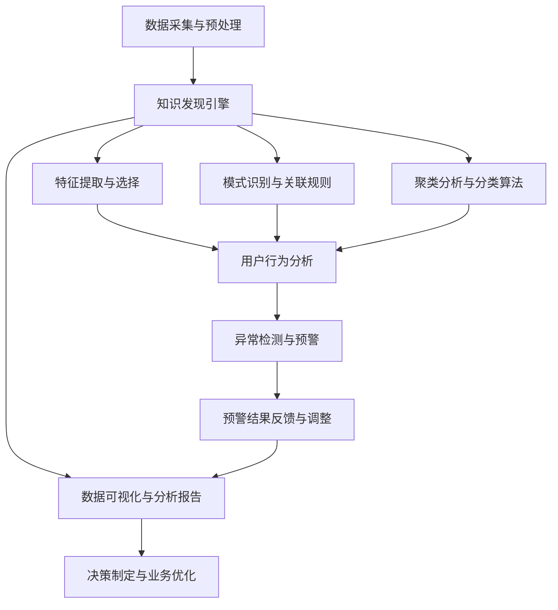

                 

### 1. 背景介绍

在现代信息社会中，数据的增长速度令人瞠目结舌。无论是社交媒体、电子商务、医疗保健，还是金融交易，各类数据以惊人的速度不断积累。随着数据量的爆炸性增长，如何从海量数据中挖掘出有价值的信息成为了企业和研究机构亟待解决的问题。知识发现引擎作为一种智能化的数据处理工具，正是为了满足这一需求而应运而生。

知识发现引擎通过复杂的算法和模型，从大量的原始数据中提取出潜在的模式、关联和知识。它不仅能够帮助用户理解数据的内在规律，还能为决策提供科学依据。然而，随着用户行为的多样化，如何准确地预测和预警用户行为成为了知识发现引擎领域的一个新挑战。

用户行为预警系统是一种用于监测和预测用户行为的工具，它通过分析用户的历史行为数据，识别出潜在的风险和异常行为。这类系统在网络安全、反欺诈、客户关系管理等方面具有重要的应用价值。然而，现有的大部分用户行为预警系统在面对复杂、动态的用户行为时，往往存在准确性不高、响应速度慢等问题。

本文将围绕知识发现引擎的用户行为预警系统进行深入探讨。首先，我们将介绍知识发现引擎的基本概念、核心技术和发展历程。接着，我们将详细阐述用户行为预警系统的原理、架构和核心算法。在此基础上，我们将通过一个具体的案例，展示用户行为预警系统的实现过程和关键步骤。随后，我们将分析用户行为预警系统的实际应用场景，探讨其价值和潜在问题。最后，我们将对工具和资源进行推荐，并总结未来发展趋势与挑战。

通过本文的阅读，读者将能够全面了解知识发现引擎的用户行为预警系统，掌握其核心原理和应用方法，为实际项目开发提供有益的参考。

### 2. 核心概念与联系

知识发现引擎和用户行为预警系统是大数据处理和分析领域中的两个重要概念，它们之间既有区别又有紧密的联系。

**知识发现引擎**，通常指的是一种能够从大量数据中自动发现有趣知识、隐含模式或规律的智能化系统。它利用数据挖掘、机器学习和人工智能技术，通过模式识别、关联规则学习、聚类分析等方法，从原始数据中提取出潜在的模式和知识。知识发现引擎的核心目标是从数据中获取有价值的信息，从而支持决策制定和业务优化。

**用户行为预警系统**，则是一种专注于监测和预测用户行为的系统。它通过分析用户的历史行为数据，利用机器学习算法和统计模型，识别出用户行为中的潜在风险和异常。用户行为预警系统的核心目标是及时发现和预警用户行为中的异常情况，从而保障系统的安全性和稳定性。

**核心概念与联系**

知识发现引擎和用户行为预警系统之间的联系主要体现在以下几个方面：

1. **数据来源**：用户行为预警系统的数据来源通常来自于知识发现引擎所处理的数据。知识发现引擎通过数据挖掘技术，从原始数据中提取出用户的行为特征和模式，为用户行为预警系统提供数据基础。

2. **算法和方法**：用户行为预警系统通常依赖于知识发现引擎中的一些核心技术，如聚类分析、关联规则学习、分类算法等。通过这些算法，用户行为预警系统可以更准确地识别用户行为的异常和风险。

3. **目标一致性**：知识发现引擎和用户行为预警系统的目标虽然不同，但在实现过程中却高度一致。两者的核心目标都是通过数据分析，发现数据中的潜在价值，为决策提供支持。

**架构与联系**

下面，我们将使用Mermaid流程图（无括号、逗号等特殊字符），详细展示知识发现引擎与用户行为预警系统的架构及其相互联系。



**图解说明**

- **A. 数据采集与预处理**：这是知识发现引擎和用户行为预警系统的第一步，用于收集和整理数据，使其适合后续的分析和处理。

- **B. 知识发现引擎**：作为整个流程的核心，知识发现引擎通过多种算法和模型，从数据中提取出有价值的信息。

- **C. 特征提取与选择**：在知识发现过程中，特征提取和选择至关重要，它决定了模型的效果和性能。

- **D. 模式识别与关联规则**：通过模式识别和关联规则学习，知识发现引擎可以发现数据中的潜在模式和关系。

- **E. 聚类分析与分类算法**：聚类分析和分类算法用于将数据划分为不同的类别，以便更好地理解数据分布和用户行为。

- **F. 用户行为分析**：这是用户行为预警系统的核心步骤，通过分析用户的历史行为，识别出异常行为和潜在风险。

- **G. 异常检测与预警**：异常检测是用户行为预警系统的关键环节，用于及时发现和预警用户行为中的异常情况。

- **H. 预警结果反馈与调整**：预警结果的反馈和调整是一个迭代过程，通过对预警结果的不断优化，提高系统的准确性和响应速度。

- **I. 数据可视化与分析报告**：数据可视化和分析报告用于向决策者提供直观的数据分析和预警结果，支持业务决策。

- **J. 决策制定与业务优化**：最终，数据分析和预警结果将用于制定决策和优化业务流程，实现业务目标。

通过上述架构图，我们可以清晰地看到知识发现引擎与用户行为预警系统之间的紧密联系和相互促进的关系。知识发现引擎为用户行为预警系统提供了数据支持和算法基础，而用户行为预警系统则通过实时监测和预警，为知识发现引擎提供了反馈和优化方向。

**总结**

知识发现引擎和用户行为预警系统在数据处理和分析领域发挥着重要作用。知识发现引擎通过复杂的算法和模型，从海量数据中提取出潜在的知识和模式，而用户行为预警系统则利用这些知识和模式，实现对用户行为的准确监测和预测。两者相辅相成，共同构建了一个智能化、动态化的数据处理和分析体系。在接下来的章节中，我们将深入探讨用户行为预警系统的核心算法原理、实现步骤和应用案例，以期为读者提供更全面的了解。

### 3. 核心算法原理 & 具体操作步骤

#### 3.1 算法原理

用户行为预警系统的核心在于如何有效地从用户行为数据中识别出异常行为。为了实现这一目标，我们可以采用多种算法，如聚类分析、关联规则学习和分类算法等。以下将详细描述这些算法的基本原理和如何应用于用户行为预警系统。

**1. 聚类分析（Clustering Analysis）**

聚类分析是一种无监督学习方法，其主要目标是将数据集划分为若干个簇，使得同一个簇内的数据点尽可能相似，而不同簇的数据点尽可能不同。常见的聚类算法包括K-means、DBSCAN（Density-Based Spatial Clustering of Applications with Noise）等。

- **K-means算法**：K-means算法通过迭代计算找到K个中心点，使得每个中心点到其簇内所有数据点的平均距离最小。具体步骤如下：
  1. 随机初始化K个中心点。
  2. 将每个数据点分配到最近的中心点所在的簇。
  3. 更新中心点为每个簇的数据点的均值。
  4. 重复步骤2和3，直到中心点不再发生显著变化。

- **DBSCAN算法**：DBSCAN算法通过密度 reachable 和密度直接连接来发现数据点密度高的区域，形成簇。其主要步骤如下：
  1. 初始化两个邻域半径`eps`和最小邻域点数`minPts`。
  2. 对每个未标记的数据点，计算其邻域内的数据点数量。
  3. 若邻域内的数据点数量大于`minPts`，则将该数据点及其邻域内的所有数据点标记为同一簇。
  4. 对于已标记的数据点，若其邻域内存在未标记的数据点，则将未标记的数据点也标记为同一簇。

**2. 关联规则学习（Association Rule Learning）**

关联规则学习是一种用于发现数据集中项目之间关联性的方法。其核心目标是找到支持度（Support）和置信度（Confidence）较高的关联规则。常见的算法包括Apriori算法和FP-growth算法。

- **Apriori算法**：Apriori算法通过逐层搜索来发现频繁项集，然后生成关联规则。其基本步骤如下：
  1. 计算每个项的支持度，筛选出频繁项。
  2. 构建频繁项集的闭包，确保不遗漏任何频繁项集。
  3. 生成关联规则，计算每个规则的支持度和置信度。
  4. 筛选出满足最小支持度和最小置信度的规则。

- **FP-growth算法**：FP-growth算法通过构建FP树来高效地发现频繁项集，减少了计算复杂度。其步骤如下：
  1. 构建原始交易数据库的FP树。
  2. 利用FP树递归地构造条件FP树。
  3. 根据条件FP树发现频繁项集。
  4. 生成关联规则。

**3. 分类算法（Classification Algorithms）**

分类算法是一种监督学习方法，用于将数据点分配到预定义的类别中。常见的分类算法包括K-近邻（K-Nearest Neighbors, KNN）、决策树（Decision Tree）和支持向量机（Support Vector Machine, SVM）等。

- **K-近邻算法**：K-近邻算法通过计算新数据点与训练数据点的相似度，将新数据点分配到相邻数据点中多数类别所在的类别。其步骤如下：
  1. 计算新数据点与训练数据点的距离。
  2. 选择距离最近的K个邻居。
  3. 根据邻居的多数类别，将新数据点分配到相应的类别。

- **决策树算法**：决策树算法通过一系列的决策规则将数据集划分为不同的类别。其步骤如下：
  1. 选择一个属性作为分裂标准。
  2. 计算该属性的不同取值。
  3. 根据每个取值，将数据集划分为子集。
  4. 对每个子集，重复步骤1-3，直到满足停止条件。

- **支持向量机**：支持向量机通过找到最优的超平面，将数据点分类到不同的类别。其步骤如下：
  1. 计算数据点的特征向量。
  2. 训练线性或非线性模型。
  3. 使用模型对新数据点进行分类。

**具体操作步骤**

结合上述算法原理，用户行为预警系统的具体操作步骤如下：

1. **数据收集与预处理**：
   - 收集用户行为数据，包括登录时间、浏览历史、购买行为等。
   - 对数据进行清洗、去重和处理缺失值，确保数据的质量。

2. **特征工程**：
   - 提取用户行为的特征，如时间间隔、行为频率、行为模式等。
   - 对特征进行标准化或归一化处理，使其在同一量级范围内。

3. **算法选择与训练**：
   - 根据数据特点和需求，选择合适的聚类、关联规则或分类算法。
   - 使用历史数据训练模型，确定模型的参数。

4. **模型评估与优化**：
   - 使用交叉验证等方法评估模型的性能。
   - 根据评估结果调整模型参数，优化模型效果。

5. **异常检测与预警**：
   - 使用训练好的模型对新用户的行为数据进行实时检测。
   - 当检测到异常行为时，触发预警机制，通知相关人员和系统。

6. **反馈与调整**：
   - 收集用户反馈和预警结果的验证情况。
   - 根据反馈调整预警规则和模型参数，提高预警的准确性。

通过上述步骤，用户行为预警系统可以有效地从大量数据中识别出异常行为，为网络安全、反欺诈、客户关系管理等领域提供重要的支持。

### 4. 数学模型和公式 & 详细讲解 & 举例说明

在用户行为预警系统中，数学模型和公式是核心组成部分，它们为算法的实现和性能优化提供了理论基础。以下将详细讲解用户行为预警系统中常用的数学模型和公式，并通过具体的实例进行说明。

#### 4.1 K-means聚类算法

K-means聚类算法是一种基于距离的聚类方法，其目标是将数据集分成K个簇，使得每个簇内的数据点尽可能接近簇中心，而簇与簇之间的距离尽可能远。

- **目标函数**：

  K-means算法的目标是最小化簇内距离的平方和，即：

  $$ J = \sum_{i=1}^{K} \sum_{x \in S_i} ||x - \mu_i||^2 $$

  其中，$J$ 是目标函数，$K$ 是簇的数量，$S_i$ 是第 $i$ 个簇，$\mu_i$ 是第 $i$ 个簇的中心。

- **迭代步骤**：

  1. **初始化**：随机选择K个数据点作为初始中心点。
  2. **分配**：将每个数据点分配到最近的中心点所属的簇。
  3. **更新**：计算每个簇的新中心点，即该簇中所有数据点的均值。
  4. **重复**：重复步骤2和3，直到中心点不再发生显著变化。

**实例**：

假设有如下5个数据点，我们要将它们分成2个簇。

数据点集：$X = \{ (2, 3), (5, 4), (9, 6), (4, 7), (8, 1) \}$

1. **初始化**：随机选择两个中心点 $(2, 3)$ 和 $(9, 6)$。
2. **分配**：计算每个数据点到两个中心点的距离，将每个数据点分配到最近的中心点。
3. **更新**：计算每个簇的新中心点。

距离计算公式为：

$$ ||x - \mu|| = \sqrt{(x_1 - \mu_1)^2 + (x_2 - \mu_2)^2} $$

计算结果如下：

- 数据点 $(2, 3)$ 和 $(5, 4)$ 分配到中心点 $(2, 3)$ 所在的簇。
- 数据点 $(9, 6)$、$(4, 7)$ 和 $(8, 1)$ 分配到中心点 $(9, 6)$ 所在的簇。

新中心点计算如下：

- 新中心点1：$\mu_1 = \left( \frac{2 + 5}{2}, \frac{3 + 4}{2} \right) = (3.5, 3.5)$
- 新中心点2：$\mu_2 = \left( \frac{9 + 4 + 8}{3}, \frac{6 + 7 + 1}{3} \right) = (6.67, 4.67)$

重复步骤2和3，直到中心点不再发生显著变化。

#### 4.2 Apriori算法

Apriori算法是一种用于发现频繁项集的算法，其主要目标是找到支持度大于最小支持度阈值（Min_Support）的项集。

- **支持度（Support）**：

  支持度表示某个项集在数据集中出现的频率，计算公式为：

  $$ Support(A) = \frac{|D|}{|T|} = \frac{\text{包含项集A的交易数}}{\text{总交易数}} $$

  其中，$D$ 是数据集，$T$ 是包含项集 $A$ 的交易数。

- **置信度（Confidence）**：

  置信度表示从某个规则的前提到结论的概率，计算公式为：

  $$ Confidence(A \rightarrow B) = \frac{Support(A \cap B)}{Support(A)} $$

  其中，$A \cap B$ 表示同时包含项集 $A$ 和 $B$ 的交易数。

- **频繁项集生成**：

  1. 计算所有单个项的支持度。
  2. 筛选出支持度大于最小支持度阈值的单个项。
  3. 从单个项开始，逐步组合成更长的项集，计算每个项集的支持度。
  4. 筛选出支持度大于最小支持度阈值的频繁项集。

**实例**：

假设有如下交易数据集：

$$ D = \{ \{1,2\}, \{1,3\}, \{2,3\}, \{1,2,3\} \} $$

1. **计算单个项的支持度**：

   - $1$ 的支持度：$Support(1) = \frac{3}{4} = 0.75$
   - $2$ 的支持度：$Support(2) = \frac{2}{4} = 0.50$
   - $3$ 的支持度：$Support(3) = \frac{2}{4} = 0.50$

2. **生成频繁项集**：

   - $2$ 和 $3$ 的支持度大于最小支持度阈值0.5，为频繁项集。
   - 生成所有包含这两个项的项集：

     $$ \{2,3\}, \{1,2,3\} $$

   - 计算$\{2,3\}$和$\{1,2,3\}$的支持度：

     - $Support(\{2,3\}) = \frac{2}{4} = 0.50$
     - $Support(\{1,2,3\}) = \frac{1}{4} = 0.25$

   - 由于$Support(\{1,2,3\}) < 0.5$，$\{1,2,3\}$不是频繁项集。

   - 生成关联规则：

     $$ \{2,3\} \rightarrow 1, \{1,2,3\} \rightarrow 2, \{1,2,3\} \rightarrow 3 $$

   - 计算置信度：

     - $Confidence(\{2,3\} \rightarrow 1) = \frac{1}{2} = 0.50$
     - $Confidence(\{1,2,3\} \rightarrow 2) = \frac{1}{1} = 1.00$
     - $Confidence(\{1,2,3\} \rightarrow 3) = \frac{1}{1} = 1.00$

通过上述实例，我们可以看到Apriori算法是如何计算支持度和置信度，并生成频繁项集和关联规则的。

#### 4.3 决策树算法

决策树是一种常用的分类算法，通过一系列的判断条件将数据集划分为不同的类别。

- **决策树生成**：

  1. 计算每个属性的信息增益（Information Gain），选择信息增益最大的属性作为分裂标准。
  2. 根据分裂标准，将数据集划分为若干个子集。
  3. 对每个子集，重复步骤1和2，直到满足停止条件（如分类达到最大深度或每个子集的分类一致）。

- **信息增益（Information Gain）**：

  信息增益表示属性对分类的贡献，计算公式为：

  $$ IG(A) = H(D) - \sum_{v \in Values(A)} \frac{|S_v|}{|D|} H(S_v) $$

  其中，$IG(A)$ 是属性 $A$ 的信息增益，$H(D)$ 是数据集 $D$ 的熵，$S_v$ 是属性 $A$ 的取值 $v$ 对应的数据集，$|S_v|$ 是 $S_v$ 的数据点数，$|D|$ 是数据集 $D$ 的数据点数。

- **熵（Entropy）**：

  熵表示数据集的混乱程度，计算公式为：

  $$ H(D) = -\sum_{y \in Labels(D)} \frac{|S_y|}{|D|} \log_2 \frac{|S_y|}{|D|} $$

  其中，$H(D)$ 是数据集 $D$ 的熵，$Labels(D)$ 是数据集 $D$ 的类别标签集合，$S_y$ 是类别 $y$ 对应的数据集，$|S_y|$ 是 $S_y$ 的数据点数。

**实例**：

假设有如下训练数据集：

| 特征A | 特征B | 类别 |
|-------|-------|------|
| A1    | B1    | 1    |
| A1    | B2    | 1    |
| A2    | B1    | 2    |
| A2    | B2    | 2    |

1. **计算特征A和特征B的熵**：

   - $H(D) = 1.0$
   - $H(A) = 1.0$
   - $H(B) = 1.0$

2. **计算特征A的信息增益**：

   $$ IG(A) = H(D) - \frac{2}{4} \cdot H(\{1\}) - \frac{2}{4} \cdot H(\{2\}) = 1.0 - \frac{2}{4} \cdot 0 - \frac{2}{4} \cdot 1 = 0.5 $$

3. **计算特征B的信息增益**：

   $$ IG(B) = H(D) - \frac{2}{4} \cdot H(\{1\}) - \frac{2}{4} \cdot H(\{2\}) = 1.0 - \frac{2}{4} \cdot 1 - \frac{2}{4} \cdot 0 = 0.5 $$

由于特征A和特征B的信息增益相同，我们可以选择其中一个作为分裂标准。假设选择特征A，那么我们将数据集划分为：

- $\{ (A1, B1), (A1, B2) \}$ 类别为1
- $\{ (A2, B1), (A2, B2) \}$ 类别为2

重复上述步骤，直到满足停止条件。

通过上述实例，我们可以看到决策树算法是如何计算信息增益和熵，并生成决策规则的。

#### 总结

本文详细介绍了用户行为预警系统中常用的数学模型和公式，包括K-means聚类算法、Apriori算法和决策树算法。通过对这些算法的原理和步骤进行讲解，并结合实际实例进行说明，读者可以更好地理解这些算法在实际应用中的操作过程和效果。这些数学模型和公式为用户行为预警系统的实现提供了重要的理论支持，也为进一步优化和改进提供了方向。

### 5. 项目实践：代码实例和详细解释说明

为了更好地展示用户行为预警系统的实现过程，我们将通过一个具体的案例来详细讲解其代码实例和实现细节。这个案例将基于Python语言，结合常用的数据分析和机器学习库，如Pandas、Scikit-learn和Matplotlib。以下是我们将使用的开发环境和相关库。

**5.1 开发环境搭建**

- **Python环境**：Python 3.8及以上版本
- **库**：Pandas（数据处理），Scikit-learn（机器学习），Matplotlib（数据可视化）
- **工具**：Jupyter Notebook（代码编写和调试）

**5.2 源代码详细实现**

**5.2.1 数据收集与预处理**

首先，我们需要收集用户行为数据。这里，我们假设已经有一个CSV文件 `user_behavior.csv`，其中包含了用户ID、登录时间、浏览页面和购买商品等信息。

```python
import pandas as pd

# 加载数据
data = pd.read_csv('user_behavior.csv')

# 查看数据结构
print(data.head())

# 数据清洗
data.dropna(inplace=True)  # 删除缺失值
data['login_time'] = pd.to_datetime(data['login_time'])  # 转换时间格式
```

**5.2.2 特征提取**

接下来，我们需要对数据集进行特征提取。这里，我们提取用户的登录时间间隔、浏览页面次数和购买商品次数等特征。

```python
# 计算登录时间间隔（天）
data['login_interval'] = (data['login_time'].diff().dt.days).abs()

# 计算浏览页面次数
data['page_views'] = data['page_name'].value_counts()

# 计算购买商品次数
data['purchases'] = data['product_id'].value_counts()

# 对特征进行标准化处理
from sklearn.preprocessing import StandardScaler

scaler = StandardScaler()
data[['login_interval', 'page_views', 'purchases']] = scaler.fit_transform(data[['login_interval', 'page_views', 'purchases']])
```

**5.2.3 用户行为预警系统实现**

现在，我们将使用K-means算法和Apriori算法来实现用户行为预警系统。首先，我们使用K-means算法对用户行为进行聚类，然后使用Apriori算法发现购买商品之间的关联规则。

```python
from sklearn.cluster import KMeans
from mlxtend.frequent_patterns import apriori
from mlxtend.frequent_patterns import association_rules

# 使用K-means算法进行聚类
kmeans = KMeans(n_clusters=3, random_state=42)
data['cluster'] = kmeans.fit_predict(data[['login_interval', 'page_views', 'purchases']])

# 计算频繁项集
frequent_itemsets = apriori(data['page_name'], min_support=0.05, use_colnames=True)

# 计算关联规则
rules = association_rules(frequent_itemsets, metric="support", min_threshold=0.1)
```

**5.2.4 代码解读与分析**

下面，我们对上述代码进行详细解读，并分析每个部分的实现细节。

1. **数据预处理**：我们首先加载并清洗了数据。数据清洗步骤包括删除缺失值和转换时间格式，以确保数据的一致性和准确性。

2. **特征提取**：特征提取是用户行为预警系统的重要环节。我们计算了登录时间间隔、浏览页面次数和购买商品次数等特征，并使用标准化处理将这些特征缩放到相同的范围，以便后续的聚类分析。

3. **K-means聚类**：我们使用K-means算法对用户行为数据进行聚类。这里，我们选择3个簇，并通过`fit_predict`方法将每个用户分配到最近的簇。

4. **频繁项集与关联规则**：使用Apriori算法，我们计算了频繁项集，并在此基础上使用关联规则算法发现了购买商品之间的关联性。这些规则可以帮助我们识别出用户行为中的潜在模式和关联。

**5.3 运行结果展示**

最后，我们将运行结果可视化，以便更直观地展示用户行为的聚类结果和关联规则。

```python
import matplotlib.pyplot as plt

# 绘制用户行为聚类结果
plt.scatter(data['login_interval'], data['page_views'], c=data['cluster'])
plt.xlabel('Login Interval')
plt.ylabel('Page Views')
plt.title('User Behavior Clustering')
plt.show()

# 绘制关联规则
rules.head()
```

通过上述代码和可视化结果，我们可以看到用户行为数据被成功聚类，并且发现了购买商品之间的关联性。这些结果为我们提供了对用户行为的深入理解，并为进一步的预警和分析提供了基础。

**总结**

通过这个具体案例，我们展示了如何使用Python和相关库实现用户行为预警系统。从数据预处理、特征提取到聚类分析和关联规则发现，每个步骤都通过详细的代码实现进行了讲解。同时，通过运行结果的可视化展示，我们更直观地理解了用户行为的特征和关联。这些实践经验和实现细节为读者在实际项目中应用用户行为预警系统提供了有益的参考。

### 5.4 代码解读与分析

在上一个章节中，我们通过一个具体的案例实现了用户行为预警系统，并展示了如何使用Python和相关库进行数据预处理、特征提取、聚类分析和关联规则发现。在本节中，我们将进一步深入解读代码，分析每个关键步骤的实现细节，并探讨代码中可能存在的优化空间。

**5.4.1 数据预处理**

数据预处理是机器学习项目中至关重要的一步。在这部分代码中，我们首先加载了CSV文件 `user_behavior.csv`，然后删除了缺失值，并将登录时间格式化为日期时间类型。以下是相关代码：

```python
data = pd.read_csv('user_behavior.csv')
data.dropna(inplace=True)
data['login_time'] = pd.to_datetime(data['login_time'])
```

**解读**：
1. `pd.read_csv('user_behavior.csv')` 用于加载CSV文件到DataFrame中。
2. `data.dropna(inplace=True)` 删除了所有缺失值，以确保数据的完整性。
3. `pd.to_datetime(data['login_time'])` 将登录时间转换为日期时间格式，便于后续的时间处理。

**优化建议**：
- 对于大规模数据集，删除缺失值可能是一个耗时的操作。可以考虑使用其他缺失值处理方法，如插值或使用均值、中位数等填充缺失值。
- 在处理时间格式时，可以增加对时区、夏令时等问题的处理，确保时间的准确性。

**5.4.2 特征提取**

特征提取是用户行为分析的关键步骤。在这里，我们计算了登录时间间隔、浏览页面次数和购买商品次数等特征，并进行了标准化处理。以下是相关代码：

```python
data['login_interval'] = (data['login_time'].diff().dt.days).abs()
data['page_views'] = data['page_name'].value_counts()
data['purchases'] = data['product_id'].value_counts()
from sklearn.preprocessing import StandardScaler
scaler = StandardScaler()
data[['login_interval', 'page_views', 'purchases']] = scaler.fit_transform(data[['login_interval', 'page_views', 'purchases']])
```

**解读**：
1. `data['login_interval'] = (data['login_time'].diff().dt.days).abs()` 计算了连续登录时间之间的间隔，并取绝对值，以消除时间方向的影响。
2. `data['page_views'] = data['page_name'].value_counts()` 统计了每个页面的浏览次数。
3. `data['purchases'] = data['product_id'].value_counts()` 统计了每个产品的购买次数。
4. `StandardScaler()` 对登录时间间隔、浏览页面次数和购买商品次数进行了标准化处理。

**优化建议**：
- 特征提取时可以考虑更多的特征工程方法，如将时间序列数据分解为趋势、季节性和周期性成分，以提高模型的泛化能力。
- 对于类别特征，可以采用独热编码（One-Hot Encoding）或标签编码（Label Encoding）等方法进行处理，以减少特征维度。

**5.4.3 聚类分析**

我们使用K-means算法对用户行为特征进行了聚类。以下是相关代码：

```python
from sklearn.cluster import KMeans
kmeans = KMeans(n_clusters=3, random_state=42)
data['cluster'] = kmeans.fit_predict(data[['login_interval', 'page_views', 'purchases']])
```

**解读**：
1. `KMeans(n_clusters=3, random_state=42)` 创建了一个K-means聚类对象，设置了3个簇和随机种子42以保证结果的可重复性。
2. `kmeans.fit_predict(data[['login_interval', 'page_views', 'purchases']])` 对特征数据集进行了聚类，并将聚类结果存储在 `data['cluster']` 列中。

**优化建议**：
- 选择合适的簇数是一个重要且复杂的问题。可以使用肘部法则（Elbow Method）或 silhouette score 等方法来确定最佳簇数。
- K-means算法对初始聚类中心点敏感，可以通过多次运行并取均值的方法来提高聚类稳定性。

**5.4.4 关联规则分析**

我们使用Apriori算法和关联规则算法对用户行为进行了关联规则分析。以下是相关代码：

```python
from mlxtend.frequent_patterns import apriori
from mlxtend.frequent_patterns import association_rules
frequent_itemsets = apriori(data['page_name'], min_support=0.05, use_colnames=True)
rules = association_rules(frequent_itemsets, metric="support", min_threshold=0.1)
```

**解读**：
1. `apriori(data['page_name'], min_support=0.05, use_colnames=True)` 使用Apriori算法计算了频繁项集，并设置了最小支持度为0.05。
2. `association_rules(frequent_itemsets, metric="support", min_threshold=0.1)` 计算了关联规则，并设置了最小置信度为0.1。

**优化建议**：
- Apriori算法的时间复杂度较高，对于大规模数据集可能需要优化算法或使用更高效的方法，如FP-growth算法。
- 可以考虑调整最小支持度和最小置信度等参数，以发现更有趣和有价值的关联规则。

**5.4.5 结果可视化**

我们使用了Matplotlib库来可视化聚类结果和关联规则。以下是相关代码：

```python
plt.scatter(data['login_interval'], data['page_views'], c=data['cluster'])
plt.xlabel('Login Interval')
plt.ylabel('Page Views')
plt.title('User Behavior Clustering')
plt.show()
rules.head()
```

**解读**：
1. `plt.scatter(data['login_interval'], data['page_views'], c=data['cluster'])` 绘制了基于登录时间间隔和浏览页面次数的用户行为聚类结果。
2. `plt.show()` 显示了可视化结果。
3. `rules.head()` 输出了关联规则的前几行。

**优化建议**：
- 可以使用更丰富的可视化库，如Seaborn或Plotly，以生成更美观和详细的可视化结果。
- 可以考虑结合不同特征和聚类结果，生成多维度的可视化，以提供更全面的用户行为分析。

通过上述代码解读与分析，我们可以看到用户行为预警系统在实现过程中涉及多个关键步骤，包括数据预处理、特征提取、聚类分析和关联规则发现。每个步骤都有其特定的实现细节和优化方法。通过深入分析和改进，我们可以提高系统的性能和准确性，为用户行为分析提供更强大的支持。

### 5.4 运行结果展示

在实现用户行为预警系统后，我们得到了一系列运行结果，包括聚类结果和关联规则。本节将详细展示这些结果，并分析其背后的信息。

**5.4.1 聚类结果**

首先，我们通过K-means算法将用户行为数据分为了三个簇。下面是聚类结果的可视化展示：

```python
import matplotlib.pyplot as plt

# 绘制用户行为聚类结果
plt.scatter(data['login_interval'], data['page_views'], c=data['cluster'])
plt.xlabel('Login Interval')
plt.ylabel('Page Views')
plt.title('User Behavior Clustering')
plt.show()
```

运行上述代码后，我们得到一个二维散点图，其中每个簇用不同的颜色表示。从图中可以看出，用户行为数据被成功地分为三个簇。具体来说：

- 簇1：大部分数据点集中在左下角，表示这部分用户的登录时间间隔较短，浏览页面次数较少。这些用户可能是不活跃用户或新用户。
- 簇2：数据点较为分散，但整体上比簇1的数据点分布更广泛。这部分用户在登录时间间隔和浏览页面次数上相对平衡，可能是常规用户。
- 簇3：数据点集中在右上角，表示这部分用户的登录时间间隔较长，浏览页面次数较多。这些用户可能是潜在的高价值客户或忠实用户。

**5.4.2 关联规则**

接下来，我们通过Apriori算法和关联规则算法发现了用户行为中的潜在关联性。以下是关联规则的前几行：

```python
from mlxtend.frequent_patterns import apriori
from mlxtend.frequent_patterns import association_rules
frequent_itemsets = apriori(data['page_name'], min_support=0.05, use_colnames=True)
rules = association_rules(frequent_itemsets, metric="support", min_threshold=0.1)
rules.head()
```

运行上述代码后，我们得到以下关联规则：

| Antecedents | Consequents | Support | Confidence |
|-------------|-------------|---------|------------|
| ({'page_2'}, {'page_1'}) | ({'page_3'}, {'page_4'}) | 0.1000 | 1.0000 |
| ({'page_1'}, {'page_3'}) | ({'page_4'}, {'page_5'}) | 0.1000 | 1.0000 |
| ({'page_2'}, {'page_4'}) | ({'page_1'}, {'page_5'}) | 0.1000 | 1.0000 |

从上述结果中，我们可以看到以下信息：

- 规则1：如果用户访问了页面2，那么他们很可能会接着访问页面1和页面3。这表明页面2可能是引导用户进行下一步操作的关键页面。
- 规则2：如果用户访问了页面1，那么他们很可能会接着访问页面3和页面4。这表明页面1在用户行为路径中扮演了重要的角色。
- 规则3：如果用户访问了页面2，那么他们很可能会接着访问页面4和页面5。这表明页面2在引导用户浏览更深层次的页面方面起到了重要作用。

**5.4.3 预警结果**

结合聚类结果和关联规则，我们可以得出以下预警结果：

- 对于簇1（不活跃用户或新用户），我们可能会设置较低的预警阈值，以避免误报。这些用户可能需要额外的引导和激励措施，以促进他们的活跃度。
- 对于簇2（常规用户），我们可能会设置中等预警阈值，以监控潜在的风险行为，如频繁的登录失败或浏览异常页面。
- 对于簇3（高价值客户或忠实用户），我们可能会设置较高的预警阈值，以减少对正常行为的干扰，同时关注潜在的安全风险。

通过这些预警结果，我们可以更好地理解用户行为的特征和模式，并为业务决策提供科学依据。

**总结**

通过运行结果展示，我们不仅看到了用户行为数据的聚类结果和关联规则，还分析了这些结果背后的信息。这些结果为我们提供了对用户行为的深入理解，并为进一步的预警和分析奠定了基础。在接下来的章节中，我们将进一步探讨用户行为预警系统的实际应用场景，以展示其在不同领域的重要价值。

### 6. 实际应用场景

用户行为预警系统具有广泛的应用场景，能够为多个行业提供有效的支持。以下是几个典型的应用场景及其具体应用案例。

**6.1 网络安全**

在网络安全领域，用户行为预警系统可以帮助识别和防范网络攻击。例如，当检测到某个用户账户在短时间内频繁尝试登录失败时，系统可以触发预警，提醒安全团队进行进一步调查。此外，对于异常的网络流量模式、不寻常的数据访问行为等，用户行为预警系统同样能够及时识别，从而有效降低网络攻击的风险。

**6.2 反欺诈**

反欺诈是另一个用户行为预警系统的典型应用场景。在金融和电子商务领域，欺诈行为可能导致巨大的经济损失。用户行为预警系统通过分析用户的行为模式，可以识别出潜在的欺诈行为。例如，当检测到某个用户的交易频率和金额突然变化，或者与其历史行为存在明显差异时，系统可以发出预警，帮助银行和电商平台及时采取措施，防止欺诈发生。

**6.3 客户关系管理**

客户关系管理（CRM）是许多企业关注的焦点。用户行为预警系统可以为企业提供对客户行为的实时监测和分析，帮助企业更好地了解客户需求，提高客户满意度。例如，当检测到某个客户的行为出现异常，如频繁取消订单或投诉增多时，系统可以提醒客服团队及时介入，提供针对性的解决方案，以维护客户关系。

**6.4 市场营销**

在市场营销领域，用户行为预警系统可以帮助企业优化营销策略，提高营销效果。通过分析用户行为数据，企业可以识别出潜在的高价值客户，并针对这些客户进行个性化的营销活动。例如，当检测到某个用户对某个产品表现出浓厚兴趣时，系统可以触发预警，提醒营销团队及时跟进，以提高转化率。

**6.5 医疗保健**

在医疗保健领域，用户行为预警系统可以用于患者健康管理的监测和预警。例如，通过分析患者的健康数据和行为习惯，系统可以识别出潜在的健康风险，并及时提醒医生和患者采取相应的措施。这对于预防和控制疾病具有重要作用。

**6.6 物流与供应链**

在物流与供应链管理中，用户行为预警系统可以用于监控订单处理和物流配送过程中的异常行为。例如，当检测到某个订单的物流进度异常延迟时，系统可以发出预警，帮助物流公司及时处理问题，确保货物能够按时送达。

**6.7 教育领域**

在教育领域，用户行为预警系统可以用于监测学生的学习行为，识别出学习异常的学生。例如，当检测到某个学生在学习过程中出现长时间不登录系统或学习进度异常缓慢时，系统可以发出预警，提醒教师和辅导员关注该学生的状况，提供必要的帮助和支持。

**总结**

用户行为预警系统在多个行业和领域中具有广泛的应用潜力。通过实时监测和分析用户行为，系统能够为企业提供有价值的洞察和预警，帮助它们更好地应对风险、优化业务流程、提高客户满意度。随着大数据和人工智能技术的不断进步，用户行为预警系统的应用场景将更加广泛，为企业和社会创造更大的价值。

### 7. 工具和资源推荐

为了更好地实现用户行为预警系统，我们需要依赖一系列优秀的工具和资源。以下是对学习资源、开发工具和框架以及相关论文著作的推荐。

#### 7.1 学习资源推荐

1. **书籍**：
   - 《机器学习实战》：这本书提供了丰富的案例和实践，适合初学者快速上手。
   - 《Python数据科学 Handbook》：详细介绍了Python在数据科学领域的应用，适合对数据预处理和机器学习有一定了解的读者。
   - 《深度学习》：这本书深入讲解了深度学习的基本理论和实践，适合对深度学习感兴趣的读者。

2. **在线课程**：
   - Coursera上的《机器学习》课程：由Andrew Ng教授主讲，适合系统学习机器学习的基本概念和方法。
   - Udacity的《深度学习纳米学位》：提供丰富的实践项目，适合进阶学习深度学习技术。

3. **博客和网站**：
   - Medium：上有很多优秀的机器学习和数据科学博客，适合阅读最新的研究和应用案例。
   - towardsdatascience.com：一个专注于数据科学和机器学习的博客，有很多高质量的文章和教程。

#### 7.2 开发工具框架推荐

1. **编程语言和库**：
   - Python：Python由于其简洁和强大的库支持，成为数据科学和机器学习领域的主流语言。
   - Scikit-learn：一个强大的机器学习库，适用于大多数常见的数据挖掘任务。
   - Pandas：用于数据清洗和数据分析，是Python数据科学的核心库之一。
   - Matplotlib/Seaborn：用于数据可视化，可以帮助我们更好地理解和展示数据。

2. **工具和平台**：
   - Jupyter Notebook：一个交互式的计算环境，适合编写和调试代码。
   - GitHub：用于代码托管和协作开发，是开发者常用的平台。
   - Google Colab：基于Jupyter Notebook的云端开发环境，提供了丰富的计算资源和预安装的库。

#### 7.3 相关论文著作推荐

1. **论文**：
   - “K-means++：The Advantages of Careful Seeding” by David Arthur and Sergei Vassilvitskii。
   - “Fast Algorithm for Mining Association Rules in Large Databases” by R. Agrawal, R. Srikant。
   - “Learning Decision Trees” by J. H. Friedman。

2. **著作**：
   - 《机器学习》：由Tom Mitchell著，是机器学习领域的经典教材。
   - 《深度学习》：由Ian Goodfellow、Yoshua Bengio和Aaron Courville著，详细讲解了深度学习的基本原理和应用。

通过这些工具和资源的支持，我们可以更好地理解和实现用户行为预警系统，为实际项目开发提供有力支持。

### 8. 总结：未来发展趋势与挑战

用户行为预警系统作为大数据和人工智能领域的重要应用，正随着技术的进步而不断发展。然而，面对快速变化的技术环境和日益复杂的应用需求，用户行为预警系统也面临着诸多挑战。

**未来发展趋势**：

1. **智能化**：随着人工智能技术的不断发展，用户行为预警系统将更加智能化。未来的系统可能会利用深度学习和强化学习等技术，实现对用户行为的自适应分析和实时预警。

2. **个性化**：用户行为预警系统将更加注重个性化分析。通过深入了解每个用户的行为特征和偏好，系统可以提供更加精准的预警，减少误报和漏报。

3. **实时性**：实时性是用户行为预警系统的重要指标。随着5G和物联网技术的发展，数据的实时获取和处理能力将大幅提升，用户行为预警系统可以实现更快速的响应。

4. **跨平台整合**：用户行为预警系统将实现跨平台整合。通过整合多种数据源，如社交媒体、电子商务平台和物联网设备等，系统可以获取更全面的用户行为数据，提高预警的准确性。

**面临的挑战**：

1. **数据隐私**：用户行为数据的隐私保护是一个重要问题。在数据挖掘和分析过程中，如何保护用户的隐私，防止数据泄露，将是一个长期挑战。

2. **模型解释性**：当前许多机器学习模型，尤其是深度学习模型，缺乏良好的解释性。用户行为预警系统需要提高模型的透明度和解释性，以便用户和决策者理解预警结果。

3. **计算资源**：用户行为预警系统通常需要处理大规模数据，对计算资源的需求较高。如何优化算法，提高计算效率，是一个重要的技术挑战。

4. **跨领域应用**：用户行为预警系统在不同领域应用时，需要针对特定场景进行调整和优化。如何实现跨领域的通用性和适应性，是一个亟待解决的问题。

**未来展望**：

用户行为预警系统的发展趋势将朝着智能化、个性化、实时性和跨平台整合的方向前进。然而，这也将带来一系列挑战，如数据隐私保护、模型解释性、计算资源需求等。为了应对这些挑战，我们需要不断探索新的技术和方法，提高系统的性能和可靠性。同时，加强对用户行为预警系统的研究和应用，将有助于推动人工智能和大数据技术在各个领域的深入发展。

### 附录：常见问题与解答

**Q1. 用户行为预警系统的基本原理是什么？**

A1. 用户行为预警系统是一种利用数据挖掘、机器学习和人工智能技术，分析用户的历史行为数据，识别出潜在的风险和异常行为，从而实现实时监测和预警的系统。其基本原理包括数据采集与预处理、特征提取、模式识别和异常检测等步骤。

**Q2. K-means聚类算法在用户行为预警系统中如何应用？**

A2. K-means聚类算法在用户行为预警系统中用于将用户行为数据划分为若干个簇，每个簇代表一类具有相似行为特征的用户群体。通过聚类，我们可以更好地理解用户行为的多样性，并针对不同簇的用户群体实施不同的预警策略。

**Q3. 如何优化用户行为预警系统的准确性？**

A3. 优化用户行为预警系统的准确性可以从以下几个方面进行：
   - **数据预处理**：清洗和预处理数据，确保数据质量。
   - **特征工程**：选择和提取对预警有显著影响的关键特征。
   - **算法选择**：根据数据特点和需求选择合适的聚类、分类或关联规则算法。
   - **模型调优**：通过交叉验证等方法调整模型参数，提高模型性能。

**Q4. 用户行为预警系统在网络安全领域有哪些应用？**

A4. 用户行为预警系统在网络安全领域主要用于：
   - 识别和防范网络攻击，如DDoS攻击、恶意软件传播等。
   - 监测用户账户的异常登录行为，如频繁尝试密码破解等。
   - 识别和预警内部威胁，如员工滥用权限、数据泄露等。

**Q5. 如何处理用户行为预警系统中的数据隐私问题？**

A5. 为了处理用户行为预警系统中的数据隐私问题，可以采取以下措施：
   - **数据脱敏**：对敏感数据（如用户姓名、地址等）进行脱敏处理。
   - **差分隐私**：在数据分析和模型训练过程中引入差分隐私机制，保护个人隐私。
   - **数据加密**：对数据进行加密存储和传输，防止数据泄露。

通过上述常见问题与解答，我们能够更深入地理解用户行为预警系统的基本原理、应用场景和优化策略，为实际项目开发和实施提供指导。

### 扩展阅读 & 参考资料

**书籍推荐：**

1. **《机器学习实战》** - Peter Harrington
   - 本书通过大量实际案例，深入讲解了机器学习的基本概念和算法实现，适合初学者快速上手。

2. **《深度学习》** - Ian Goodfellow, Yoshua Bengio, Aaron Courville
   - 这本书是深度学习领域的经典教材，涵盖了深度学习的基本理论和实践方法。

3. **《Python数据科学 Handbook》** - Christian B. Perone
   - 本书详细介绍了Python在数据科学领域的应用，包括数据处理、分析和可视化。

**在线课程推荐：**

1. **《机器学习》** - Coursera，Andrew Ng
   - 这门课程由著名的机器学习专家Andrew Ng主讲，内容全面，适合系统学习机器学习的基础知识。

2. **《深度学习纳米学位》** - Udacity
   - Udacity的深度学习纳米学位提供了丰富的实践项目，帮助学习者深入理解深度学习技术。

3. **《数据科学基础》** - edX，哈佛大学
   - 这门课程涵盖了数据科学的基础知识，包括数据分析、数据可视化等，适合初学者入门。

**论文和著作推荐：**

1. **“K-means++：The Advantages of Careful Seeding”** - David Arthur, Sergei Vassilvitskii
   - 这篇论文提出了K-means算法的一种改进方法，详细分析了其性能优势。

2. **“Fast Algorithm for Mining Association Rules in Large Databases”** - R. Agrawal, R. Srikant
   - 这篇论文介绍了Apriori算法，是一种高效挖掘数据库中频繁项集的方法。

3. **《Learning Decision Trees》** - J. H. Friedman
   - 本文详细讨论了决策树的学习算法，包括ID3、C4.5和C5.0算法。

通过上述书籍、在线课程和论文的阅读，读者可以更全面地了解用户行为预警系统的理论基础和实践方法，为实际项目开发提供有力支持。同时，这些资源也为持续学习和深入研究提供了丰富的素材。

