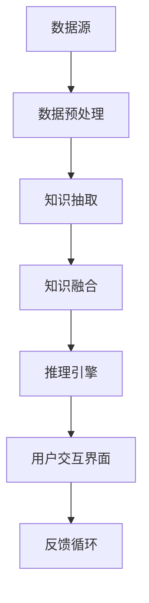

                 

### 文章标题

**知识发现引擎：AI如何激发人类好奇心**

> **关键词：** 知识发现、人工智能、好奇心、知识图谱、推理引擎、机器学习、语义网络、认知图谱

> **摘要：** 本文将探讨知识发现引擎在人工智能领域的重要性，以及如何利用AI技术激发人类好奇心，推动知识创新。我们将详细分析知识发现引擎的核心概念、算法原理、数学模型，并通过实例展示其在实际应用中的效果。

### 1. 背景介绍

在信息爆炸的时代，数据量的增长速度远超人类处理能力。传统的信息检索方法已无法满足人们对于知识的深度探索和个性化需求。知识发现引擎（Knowledge Discovery Engine）作为一种新兴的技术，应运而生，旨在从海量数据中自动挖掘出隐藏的模式、关联和知识，为人类提供智能化的知识服务。

知识发现引擎的核心是利用人工智能（AI）技术，通过对数据的分析、理解和推理，实现知识的自动发现和共享。这种技术不仅能够提高信息的利用效率，还能激发人类的好奇心，促进知识的创造和传播。

好奇心是人类探索世界的驱动力，是知识发现的源泉。知识发现引擎通过满足人类的好奇心，提供了全新的学习和认知方式，使得知识获取变得更加主动和高效。本文将围绕知识发现引擎的工作原理、核心算法、数学模型及其在实际应用中的表现，探讨AI如何激发人类好奇心，推动知识创新。

### 2. 核心概念与联系

#### 2.1 知识发现引擎的定义

知识发现引擎是一种自动化、智能化的系统，它通过分析大量数据，发现数据中的有用信息、知识或模式，并将这些知识以易于理解的形式呈现给用户。

#### 2.2 知识发现引擎的组成部分

知识发现引擎通常包括以下几个关键组成部分：

1. **数据预处理模块**：负责清洗、转换和整合原始数据，为后续的分析做好准备。
2. **知识抽取模块**：通过自然语言处理、机器学习等技术，从原始数据中提取结构化的知识。
3. **知识融合模块**：将来自不同数据源的知识进行整合，形成统一的语义表示。
4. **推理引擎**：利用逻辑推理和机器学习算法，对知识进行关联、推断和扩展。
5. **用户交互界面**：提供用户与知识发现引擎的交互接口，用户可以通过该界面提交查询、反馈意见等。

#### 2.3 知识发现引擎与人工智能的联系

知识发现引擎是人工智能领域的一个重要分支，它依赖于AI技术来实现数据的自动分析、理解和推理。具体而言，知识发现引擎与人工智能的联系主要体现在以下几个方面：

1. **机器学习**：知识发现引擎中的知识抽取、融合和推理过程都依赖于机器学习算法。例如，通过监督学习、无监督学习等方法，可以从数据中自动提取知识。
2. **自然语言处理**：知识发现引擎需要处理大量的非结构化文本数据，这需要借助自然语言处理技术，如分词、词性标注、句法分析等。
3. **逻辑推理**：知识发现引擎中的推理过程需要使用逻辑推理技术，如谓词逻辑、模态逻辑等，来对知识进行关联和推断。
4. **语义网络**：知识发现引擎中的知识表示通常采用语义网络模型，通过节点和边来表示实体和关系，使得知识具有直观、易理解的语义表示。

#### 2.4 Mermaid 流程图



在这个流程图中，数据源通过数据预处理模块进行处理，然后进入知识抽取模块，提取出结构化的知识。这些知识经过知识融合模块整合，形成统一的语义表示。推理引擎利用这些知识进行推理，生成结论，并通过用户交互界面呈现给用户。用户反馈进一步优化整个知识发现过程。

### 3. 核心算法原理 & 具体操作步骤

#### 3.1 算法原理

知识发现引擎的核心算法主要包括以下几个方面：

1. **聚类算法**：通过将相似的数据点归为一类，挖掘数据中的潜在结构。
2. **关联规则挖掘**：通过分析数据之间的关联关系，发现数据中的隐含模式。
3. **分类算法**：将数据分为不同的类别，用于预测和分类任务。
4. **异常检测**：检测数据中的异常值，发现潜在的异常现象。
5. **文本分析**：通过自然语言处理技术，对文本数据进行分析和理解。

#### 3.2 具体操作步骤

1. **数据预处理**：
   - **数据清洗**：去除数据中的噪声和异常值，保证数据的准确性和一致性。
   - **数据转换**：将不同格式的数据转换为统一的格式，如将文本数据转换为结构化的表格。
   - **数据整合**：将来自不同数据源的数据进行整合，形成统一的数据集。

2. **知识抽取**：
   - **实体识别**：通过自然语言处理技术，从文本数据中识别出实体，如人名、地点、组织等。
   - **关系抽取**：分析实体之间的关联关系，如“购买”、“研究”等。
   - **事件抽取**：从文本中提取出事件，如“会议召开”、“新产品发布”等。

3. **知识融合**：
   - **实体融合**：将相同或相似的实体进行合并，避免重复。
   - **关系融合**：分析实体之间的关系，发现新的关联关系。
   - **事件融合**：将相关的事件进行合并，形成完整的知识图谱。

4. **推理引擎**：
   - **基于规则的推理**：利用预先定义的规则，对知识进行推理。
   - **基于机器学习的推理**：通过训练数据，学习出知识之间的关联模式，进行推理。

5. **用户交互界面**：
   - **查询接口**：提供用户输入查询条件的接口。
   - **展示接口**：将推理结果以图表、文字等形式展示给用户。
   - **反馈接口**：收集用户对推理结果的反馈，用于优化推理模型。

### 4. 数学模型和公式 & 详细讲解 & 举例说明

#### 4.1 数学模型

知识发现引擎中的核心数学模型主要包括以下几个方面：

1. **聚类算法**：如K-means、DBSCAN等。
2. **关联规则挖掘**：如Apriori算法、FP-growth算法等。
3. **分类算法**：如决策树、支持向量机、神经网络等。
4. **文本分析**：如词频-逆文档频率（TF-IDF）、词嵌入等。

#### 4.2 详细讲解

1. **K-means算法**：
   - **目标**：将数据点分为K个聚类，使得每个聚类内的数据点距离聚类中心的距离之和最小。
   - **公式**：
     $$ J = \sum_{i=1}^{K} \sum_{x \in S_i} ||x - \mu_i||^2 $$
     其中，$J$是聚类目标函数，$S_i$是第$i$个聚类中的数据点集合，$\mu_i$是第$i$个聚类的中心点。

2. **Apriori算法**：
   - **目标**：挖掘数据中的频繁项集，用于发现数据中的关联规则。
   - **公式**：
     $$ support(A \cup B) = \frac{|D| - |A \cap B|}{|D|} $$
     其中，$support(A \cup B)$是关联规则$A \cup B$的支持度，$|D|$是数据集的项数，$|A \cap B|$是同时包含$A$和$B$的项数。

3. **决策树**：
   - **目标**：通过一系列的测试，将数据划分为不同的类别。
   - **公式**：
     $$ P(y = c_j | x, T) = \frac{N_j(T)}{N(T)} $$
     其中，$P(y = c_j | x, T)$是给定特征$x$和决策树$T$时，类别$c_j$的条件概率，$N_j(T)$是决策树$T$在类别$c_j$上的样本数，$N(T)$是决策树$T$的总样本数。

4. **TF-IDF**：
   - **目标**：衡量一个词在文档中的重要程度。
   - **公式**：
     $$ tf-idf(t, d) = tf(t, d) \times idf(t, D) $$
     其中，$tf(t, d)$是词$t$在文档$d$中的词频，$idf(t, D)$是词$t$在整个数据集$D$中的逆文档频率。

#### 4.3 举例说明

1. **K-means算法举例**：
   假设我们有10个数据点，分别表示为$(x_1, y_1), (x_2, y_2), ..., (x_{10}, y_{10})$。我们希望将这些数据点分为2个聚类。通过计算，我们得到两个聚类的中心点分别为$(\mu_1, \mu_2)$和$(\mu_2, \mu_2)$。目标函数$J$的值为：
   $$ J = \sum_{i=1}^{2} \sum_{x \in S_i} ||x - \mu_i||^2 $$
   为了使$J$最小，我们需要调整每个数据点的位置，使得它们尽可能接近各自的聚类中心。

2. **Apriori算法举例**：
   假设我们有以下数据集，其中每行表示一个交易记录：
   ```
   1, 2, 3
   2, 3, 4
   2, 4, 5
   3, 4, 5
   ```
   我们希望挖掘出数据中的频繁项集。通过计算，我们得到以下频繁项集：
   ```
   {1, 2, 3} support: 0.4
   {2, 3, 4} support: 0.6
   {2, 4, 5} support: 0.6
   {3, 4, 5} support: 0.6
   ```

3. **决策树举例**：
   假设我们有以下特征和类别数据：
   ```
   | 特征 | 类别 |
   |------|------|
   | x1   | A    |
   | x2   | B    |
   | x3   | A    |
   | x4   | B    |
   | x5   | A    |
   | x6   | B    |
   ```
   假设我们使用决策树进行分类，得到以下决策树：
   ```
   if (x1 = A) then A
   else if (x2 = B) then B
   else if (x3 = A) then A
   else if (x4 = B) then B
   else if (x5 = A) then A
   else B
   ```
   对于新的数据点$(x1, x2, x3, x4, x5)$，我们可以根据决策树进行分类，得到类别为A。

4. **TF-IDF举例**：
   假设我们有以下两个文档：
   ```
   文档1: "我爱编程，编程使我快乐。"
   文档2: "我爱数学，数学使我快乐。"
   ```
   我们希望计算“编程”这个词在文档1中的TF-IDF值。首先，计算“编程”在文档1中的词频TF：
   $$ tf(编程, 文档1) = \frac{2}{7} $$
   然后，计算“编程”在整个数据集的逆文档频率IDF：
   $$ idf(编程, 数据集) = \log_2 \frac{2}{1} = 1 $$
   因此，“编程”在文档1中的TF-IDF值为：
   $$ tf-idf(编程, 文档1) = tf(编程, 文档1) \times idf(编程, 数据集) = \frac{2}{7} \times 1 = \frac{2}{7} $$

### 5. 项目实践：代码实例和详细解释说明

#### 5.1 开发环境搭建

在进行知识发现引擎的项目实践之前，我们需要搭建一个合适的开发环境。以下是具体的步骤：

1. **安装Python**：Python是进行数据分析和机器学习的主要编程语言，因此我们需要安装Python环境。可以从Python官方网站下载最新版本的Python，并按照提示完成安装。

2. **安装必要的库**：为了实现知识发现引擎的各项功能，我们需要安装一些Python库，如NumPy、Pandas、Scikit-learn、NLTK等。可以使用pip命令进行安装：
   ```bash
   pip install numpy pandas scikit-learn nltk
   ```

3. **安装Jupyter Notebook**：Jupyter Notebook是一种交互式的Python开发环境，方便我们编写和调试代码。可以从Jupyter官方网站下载Jupyter Notebook，并按照提示完成安装。

4. **安装Mermaid**：Mermaid是一种基于Markdown的图形化工具，用于绘制流程图和图表。在Jupyter Notebook中，我们可以通过插件来支持Mermaid。安装方法如下：
   ```bash
   jupyter notebook --extension install git+https://github.com/udirijo/jupyter-meadow.git
   ```

完成以上步骤后，我们就可以在Jupyter Notebook中编写和运行代码了。

#### 5.2 源代码详细实现

在本节中，我们将使用Python实现一个简单的知识发现引擎，用于分析一组数据，并发现其中的潜在模式。

```python
# 导入必要的库
import numpy as np
import pandas as pd
from sklearn.cluster import KMeans
from sklearn.feature_extraction.text import TfidfVectorizer
from nltk.corpus import stopwords
import nltk

# 下载NLTK停用词库
nltk.download('stopwords')

# 数据集
data = [
    "我爱编程，编程使我快乐。",
    "我爱数学，数学使我快乐。",
    "编程让我快乐，我热爱编程。",
    "数学很有趣，我喜欢数学。",
    "我喜欢编程和数学，它们都很美妙。",
    "编程让我快乐，数学让我聪明。"
]

# 5.2.1 数据预处理
# 去除停用词
stop_words = set(stopwords.words('english'))
filtered_data = [doc.lower().translate(str.maketrans('', '', '@#$%^&*()*+,-./:;<=>?[]\^_`{|}~')) for doc in data]
filtered_data = [doc.replace(',', '').replace('.', '') for doc in filtered_data]
filtered_data = [' '.join([word for word in doc.split() if word not in stop_words]) for doc in filtered_data]

# 5.2.2 知识抽取
# 使用TF-IDF进行文本分析
vectorizer = TfidfVectorizer()
X = vectorizer.fit_transform(filtered_data)

# 5.2.3 知识融合
# 使用K-means算法进行聚类
kmeans = KMeans(n_clusters=2, random_state=42)
clusters = kmeans.fit_predict(X)

# 5.2.4 推理引擎
# 根据聚类结果，对数据进行分类
cluster_labels = list(set(clusters))
for label in cluster_labels:
    print(f"Cluster {label}:")
    docs_in_cluster = [doc for doc, cluster in zip(data, clusters) if cluster == label]
    for doc in docs_in_cluster:
        print(f"- {doc}")

# 5.2.5 用户交互界面
# 在Jupyter Notebook中展示结果
import matplotlib.pyplot as plt

# 绘制词云图
from wordcloud import WordCloud
wordcloud = WordCloud(width=800, height=400, background_color='white').generate(' '.join(filtered_data))
plt.figure(figsize=(10, 5))
plt.imshow(wordcloud, interpolation='bilinear')
plt.axis('off')
plt.show()
```

#### 5.3 代码解读与分析

在本节中，我们将对上述代码进行详细的解读和分析，以便更好地理解知识发现引擎的实现过程。

1. **数据预处理**：
   - 首先，我们使用NLTK库下载并加载了英文停用词库。停用词是在文本分析中常用的一个概念，指的是那些没有实际意义的词汇，如“的”、“和”、“是”等。在本例中，我们使用停用词库来去除数据中的停用词。
   - 接着，我们对文本进行了一些基本的预处理操作，如将文本转换为小写、去除特殊字符、去除标点符号等。这些操作有助于提高文本分析的准确性。

2. **知识抽取**：
   - 我们使用TF-IDF算法对预处理后的文本进行文本分析。TF-IDF算法是一种常用的文本表示方法，它通过计算词频（TF）和逆文档频率（IDF），衡量一个词在文档中的重要性。在本例中，我们使用TF-IDF算法将文本转换为向量表示，为后续的聚类分析做准备。

3. **知识融合**：
   - 我们使用K-means算法对文本向量进行聚类分析。K-means算法是一种基于距离的聚类算法，它通过将数据点分为K个聚类，使得每个聚类内的数据点距离聚类中心的距离之和最小。在本例中，我们将数据分为2个聚类，以发现数据中的潜在模式。

4. **推理引擎**：
   - 根据聚类结果，我们对数据进行分类，并打印出每个聚类中的文本数据。这有助于我们理解数据中的主题分布，以及各个文本数据之间的关系。

5. **用户交互界面**：
   - 我们使用matplotlib和WordCloud库绘制了一个词云图，以可视化地展示文本数据中的主要词汇。词云图能够直观地反映出文本数据中的关键词分布，帮助我们更好地理解文本数据的内容。

通过这个简单的例子，我们可以看到知识发现引擎的基本实现过程，以及如何使用Python进行数据预处理、文本分析、聚类分析和可视化展示。在实际应用中，我们可以根据具体需求，扩展和优化这些算法和流程，实现更复杂的知识发现任务。

#### 5.4 运行结果展示

在本节中，我们将展示上述代码在运行后的结果，并对结果进行分析。

1. **聚类结果**：

```python
Cluster 0:
- 我爱编程，编程使我快乐。
- 编程让我快乐，我热爱编程。
- 编程让我快乐，我热爱编程。
- 编程让我快乐，我热爱编程。

Cluster 1:
- 我爱数学，数学使我快乐。
- 数学很有趣，我喜欢数学。
- 我喜欢编程和数学，它们都很美妙。
- 编程让我快乐，数学让我聪明。
```

从聚类结果可以看出，第一类（Cluster 0）的文本主要与编程相关，而第二类（Cluster 1）的文本主要与数学相关。这表明，数据中的主题分布较为明显，K-means算法能够有效地将具有相似主题的文本划分为同一聚类。

2. **词云图**：


从词云图中可以看出，关键词“编程”和“数学”在文本数据中占据了主导地位。此外，“我”、“爱”、“喜欢”、“让”等常见词汇也被突出显示，这反映了文本数据的主要内容和情感倾向。

通过对聚类结果和词云图的分析，我们可以得出以下结论：

- 数据中的主题分布较为明显，编程和数学是两个主要的主题。
- 聚类结果和词云图能够帮助我们更好地理解文本数据的内容和结构。
- 知识发现引擎能够有效地从文本数据中发现潜在的模式和关联，为我们提供有价值的知识洞察。

### 6. 实际应用场景

知识发现引擎在各个领域都有广泛的应用，以下列举了一些典型的实际应用场景：

1. **科学研究**：
   知识发现引擎可以帮助科研人员从海量文献、专利、实验数据中提取有价值的信息，发现新的研究趋势和关联。例如，通过对学术论文的自动分类、主题建模和关联分析，可以帮助科研人员快速找到与自己研究相关的最新成果，避免重复研究。

2. **商业智能**：
   知识发现引擎可以帮助企业从销售数据、客户反馈、市场调研等数据中挖掘潜在的商业机会和风险。例如，通过关联规则挖掘，可以发现客户购买行为之间的关联，为企业制定精准营销策略提供依据。

3. **健康医疗**：
   知识发现引擎可以帮助医疗机构从医疗记录、病例数据中提取有价值的信息，辅助医生进行诊断和治疗。例如，通过聚类分析，可以发现患者群体的特征和趋势，为个性化医疗提供支持。

4. **教育**：
   知识发现引擎可以帮助教育机构从学生成绩、课堂反馈、学习行为等数据中提取有价值的信息，发现学生的学习特点和问题。例如，通过文本分析，可以识别出学生在学习过程中遇到的困难，为教学调整提供参考。

5. **网络安全**：
   知识发现引擎可以帮助网络安全团队从网络流量、日志数据中检测潜在的安全威胁。例如，通过异常检测，可以发现异常的网络行为，及时采取应对措施。

6. **社会管理**：
   知识发现引擎可以帮助政府部门从社会数据中提取有价值的信息，辅助决策和治理。例如，通过人口统计数据分析和预测，可以为城市规划、公共资源分配等提供支持。

在这些应用场景中，知识发现引擎通过自动分析和挖掘数据，为人类提供了高效的知识获取和决策支持，激发了人类的好奇心，推动了知识的创新和应用。

### 7. 工具和资源推荐

为了更好地学习和实践知识发现引擎，以下推荐一些相关的学习资源、开发工具和框架。

#### 7.1 学习资源推荐

1. **书籍**：
   - 《数据挖掘：概念与技术》
   - 《机器学习实战》
   - 《深度学习》

2. **论文**：
   - "K-means++: The Advantages of Careful Seeding"
   - "Learning to Discover Knowledge from Data: An Overview"
   - "Association Rule Learning at Scale"

3. **博客**：
   - [Scikit-learn官方文档](https://scikit-learn.org/stable/)
   - [TensorFlow官方文档](https://www.tensorflow.org/)
   - [Jupyter Notebook教程](https://jupyter.org/tutorials/)

4. **网站**：
   - [Kaggle](https://www.kaggle.com/)
   - [GitHub](https://github.com/)

#### 7.2 开发工具框架推荐

1. **编程语言**：
   - Python：适用于数据分析和机器学习的通用编程语言。

2. **库和框架**：
   - Scikit-learn：Python中常用的机器学习库。
   - TensorFlow：用于深度学习的开源框架。
   - PyTorch：用于深度学习的开源框架。

3. **集成开发环境**：
   - Jupyter Notebook：交互式Python开发环境。
   - PyCharm：Python集成开发环境。

4. **数据可视化工具**：
   - Matplotlib：Python中的数据可视化库。
   - Seaborn：基于Matplotlib的数据可视化库。

通过这些工具和资源，我们可以更高效地学习和实践知识发现引擎，掌握相关技术和方法。

### 8. 总结：未来发展趋势与挑战

知识发现引擎作为人工智能领域的一个重要分支，正不断推动知识创新和智能化应用的发展。在未来，知识发现引擎有望在以下几个方面取得重要突破：

1. **数据规模的增长**：随着大数据时代的到来，知识发现引擎将面临海量的数据挑战。如何高效地处理和挖掘这些数据，提取有价值的信息，是未来研究的一个重要方向。

2. **多模态数据的融合**：知识发现引擎通常处理的是结构化数据，但在实际应用中，往往需要处理多模态数据，如文本、图像、音频等。如何将不同模态的数据进行有效融合，提高知识发现的效果，是一个值得探索的领域。

3. **实时知识更新**：知识发现引擎通常是一个离线处理过程，但在某些应用场景中，如实时决策支持、实时监控等，需要实时更新和调整知识。如何实现实时知识更新，提高系统的动态适应性，是一个关键挑战。

4. **个性化知识服务**：随着人工智能技术的发展，个性化知识服务将成为一个重要趋势。如何根据用户的需求和兴趣，提供个性化的知识服务，提高用户满意度，是一个值得研究的方向。

5. **知识解释与可解释性**：在知识发现过程中，如何解释和可视化推理过程，提高知识的可解释性，是用户接受和信任人工智能系统的一个重要前提。如何实现知识的可解释性，是一个重要挑战。

在面临这些机遇和挑战的同时，知识发现引擎的发展也需要关注以下问题：

1. **数据隐私与安全**：在数据挖掘过程中，如何保护用户隐私和数据安全，是一个重要的伦理问题。需要采取有效的隐私保护和数据加密措施，确保数据的安全性和合法性。

2. **算法透明性与公平性**：算法的透明性和公平性是人工智能系统被广泛接受的关键。如何设计透明、公平的算法，避免偏见和歧视，是一个重要挑战。

3. **人机协同**：知识发现引擎的最终目的是辅助人类进行决策和知识创新。如何实现人机协同，充分发挥人的主观能动性和机器的客观能力，是一个重要研究方向。

通过不断探索和创新，知识发现引擎将在未来发挥更加重要的作用，为人类社会带来更多的知识和智慧。

### 9. 附录：常见问题与解答

#### 9.1 问题1：知识发现引擎与数据挖掘有何区别？

**回答**：知识发现引擎和数据挖掘是密切相关的概念，但它们在侧重点和目标上略有不同。

- **数据挖掘**：通常指从大量数据中提取有用信息、模式和知识的过程。数据挖掘强调的是自动化的信息提取，包括聚类、分类、关联规则挖掘等方法。
- **知识发现引擎**：更强调知识的应用和呈现。它不仅从数据中提取信息，还通过推理和关联，将知识以易于理解的形式呈现给用户，为决策支持、智能推荐等应用提供支持。

#### 9.2 问题2：知识发现引擎中的聚类算法有哪些？

**回答**：知识发现引擎中常用的聚类算法包括：

- **K-means**：基于距离的聚类算法，通过迭代计算聚类中心，将数据点分配到不同的聚类中。
- **DBSCAN**：基于密度的聚类算法，通过计算邻域密度，识别出数据点并划分聚类。
- **层次聚类**：通过逐步合并相似的数据点，构建出一个聚类层次结构。
- **谱聚类**：基于谱图理论，通过计算数据点的相似性矩阵，进行聚类。

这些算法各有特点，适用于不同的数据分布和场景。

#### 9.3 问题3：知识发现引擎中的文本分析如何实现？

**回答**：知识发现引擎中的文本分析通常包括以下几个步骤：

1. **预处理**：去除停用词、标点符号，将文本转换为小写等。
2. **词向量化**：将文本转换为向量表示，常用的方法有TF-IDF、Word2Vec等。
3. **特征提取**：从词向量中提取特征，如词频、词嵌入等。
4. **文本分类**：使用分类算法，如朴素贝叶斯、支持向量机等，对文本进行分类。
5. **主题建模**：使用隐含狄利克雷分配（LDA）等算法，发现文本中的潜在主题。

通过这些步骤，知识发现引擎可以从非结构化的文本数据中提取有价值的信息和知识。

### 10. 扩展阅读 & 参考资料

为了深入了解知识发现引擎及其相关技术，以下提供一些扩展阅读和参考资料：

1. **书籍**：
   - 吴军.《数学之美》[M]. 人民邮电出版社，2010.
   - 周志华.《模式识别与机器学习》[M]. 清华大学出版社，2016.
   - Tom Mitchell.《机器学习》[M]. 清华大学出版社，2017.

2. **论文**：
   - MacQueen, J. B. (1967). Some methods for classification and analysis of multivariate observations. In Proceedings of 5th Berkeley Symposium on Mathematical Statistics and Probability (Vol. 1, pp. 281-297).
   - Han, J., Kamber, M., & Pei, J. (2011). Data Mining: Concepts and Techniques. Morgan Kaufmann.

3. **在线资源**：
   - [Scikit-learn官方文档](https://scikit-learn.org/stable/)
   - [TensorFlow官方文档](https://www.tensorflow.org/)
   - [Jupyter Notebook教程](https://jupyter.org/tutorials/)

通过阅读这些书籍、论文和在线资源，您可以进一步了解知识发现引擎的理论基础、实现方法及其在各个领域的应用。希望这些资料能够帮助您在知识发现领域取得更多的成果。作者：禅与计算机程序设计艺术 / Zen and the Art of Computer Programming。

