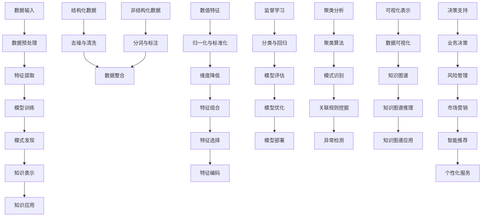

                 

### 背景介绍

知识发现引擎（Knowledge Discovery Engine，简称KDE）是一种利用人工智能技术，从大量数据中自动提取知识的高级数据处理工具。在人工智能时代，数据已成为新的生产资料，而知识发现引擎则成为了创新引擎的核心组成部分。其重要性不言而喻，因为它能够帮助企业和组织从海量的数据中挖掘出有价值的信息，从而指导决策、提升效率、创造新的商业模式。

随着互联网的迅猛发展和大数据技术的广泛应用，数据量呈现爆炸式增长。然而，如何从海量数据中提取有价值的信息成为了学术界和工业界共同面临的挑战。知识发现引擎的出现，为这一难题提供了新的解决方案。它通过机器学习、数据挖掘、自然语言处理等多种人工智能技术，实现了对复杂数据的高效分析与知识提取，极大地提高了数据分析的效率和质量。

知识发现引擎的应用领域十分广泛，包括但不限于金融、医疗、零售、教育、交通等各个行业。在金融领域，知识发现引擎可以用于风险评估、投资决策、欺诈检测等；在医疗领域，它可以辅助医生进行疾病诊断、药物研发等；在零售领域，它可以帮助商家进行消费者行为分析、库存管理、产品推荐等；在教育领域，它可以辅助教师进行教学评价、个性化学习路径推荐等。此外，知识发现引擎还可以应用于智能交通、智慧城市、环境监测等领域，为社会的智能化发展提供了强有力的支持。

本文将围绕知识发现引擎的核心概念、算法原理、数学模型、项目实践、实际应用场景、工具和资源推荐、未来发展趋势与挑战等方面进行详细探讨。希望通过本文的阐述，能够帮助读者全面了解知识发现引擎的工作原理和应用价值，从而更好地应用于实际工作中。

### 核心概念与联系

知识发现引擎的核心在于其能够从大量数据中自动提取知识。为了深入理解这一过程，我们需要了解几个核心概念，并展示它们之间的联系。以下是几个关键概念：

1. **数据（Data）**：数据是知识发现引擎的输入，包括结构化数据（如关系数据库中的表）和非结构化数据（如文本、图像、音频等）。这些数据通常来源于各种渠道，如日志文件、传感器、社交网络等。

2. **特征（Feature）**：特征是数据中的某个特定属性或维度，用于描述数据的具体特征。例如，在一份顾客购买记录表中，特征可能包括购买时间、购买物品、购买数量、顾客年龄、顾客收入等。

3. **模式（Pattern）**：模式是从数据中发现的具有统计意义的相关性或规律。例如，在某购物网站的用户购买数据中，可能发现经常购买某种商品的顾客群体具有特定的年龄和收入水平。

4. **知识（Knowledge）**：知识是通过对模式的解释和理解，从而获得的具有应用价值的知识。知识可以帮助我们做出更好的决策，解决实际问题。

5. **算法（Algorithm）**：算法是实现知识发现的核心工具，包括数据预处理、特征提取、模式发现、知识表示等步骤。

6. **模型（Model）**：模型是基于算法对数据进行分析和预测的数学表示。例如，在机器学习中，模型通常是一个函数，用于将输入数据映射到输出结果。

接下来，我们将使用Mermaid流程图展示知识发现引擎的核心概念和架构。



在上面的流程图中，我们可以看到知识发现引擎从数据输入开始，经过一系列处理步骤，最终实现知识表示和应用。每个步骤都依赖于前一个步骤的结果，形成一个闭环的过程。以下是每个步骤的详细解释：

1. **数据输入**：知识发现引擎首先接收各种类型的数据，包括结构化和非结构化数据。这些数据可以是静态的，也可以是动态的。

2. **数据预处理**：由于原始数据通常存在噪声和不一致性，因此需要进行预处理。对于结构化数据，常见的预处理方法包括去噪与清洗、数据整合等；对于非结构化数据，则通常需要进行分词、标注等操作。

3. **特征提取**：特征提取是将原始数据转换为可用于建模的特征表示。这一步骤包括数值特征的归一化、标准化、维度降低、特征组合、特征选择和特征编码等。

4. **模型训练**：模型训练是利用特征数据来训练模型，使其能够对新的数据进行预测或分类。这一步骤包括监督学习和无监督学习，常用的算法有分类、回归、聚类等。

5. **模式发现**：模式发现是通过分析训练好的模型，从数据中提取出具有统计意义的相关性或规律。常见的模式发现方法包括聚类分析、关联规则挖掘、异常检测等。

6. **知识表示**：知识表示是将发现的模式转化为易于理解和应用的形式。常见的知识表示方法包括可视化表示、知识图谱等。

7. **知识应用**：知识应用是将表示化的知识应用于实际问题中，如决策支持、风险管理、市场营销、智能推荐等。

通过上述核心概念和流程图的展示，我们可以更清晰地理解知识发现引擎的工作原理和架构。接下来，我们将进一步探讨知识发现引擎中的核心算法原理和具体操作步骤。

### 核心算法原理 & 具体操作步骤

知识发现引擎的核心在于其能够从大量数据中自动提取知识。这一过程依赖于多种核心算法，下面我们将详细探讨这些算法的原理及其操作步骤。

#### 1. 数据预处理算法

数据预处理是知识发现的第一步，其目的是将原始数据转换为适合建模的数据。常用的数据预处理算法包括去噪与清洗、数据整合、分词与标注等。

**1.1 去噪与清洗**

去噪与清洗算法主要用于处理结构化数据中的噪声和不一致。具体步骤如下：

- **检测与标记**：首先，使用统计学方法（如标准差、均值等）检测数据中的异常值，并将其标记出来。
- **修正与删除**：对于标记为异常值的数据，可以选择修正或删除。如果数据集较小，通常选择删除；如果数据集较大，可以选择修正。
- **填充缺失值**：对于缺失值，可以使用平均值、中位数、最邻近值等方法进行填充。

**1.2 数据整合**

数据整合算法主要用于处理不同来源的结构化数据，将其整合为统一的格式。具体步骤如下：

- **数据抽取**：从不同数据源中抽取数据，可以使用ETL（Extract, Transform, Load）工具实现。
- **数据清洗**：对抽取的数据进行去噪与清洗，确保数据的准确性和一致性。
- **数据集成**：将清洗后的数据集成到一个统一的数据仓库中，可以使用关系数据库或大数据技术（如Hadoop、Spark等）实现。

**1.3 分词与标注**

分词与标注算法主要用于处理非结构化数据，如文本、图像、音频等。具体步骤如下：

- **分词**：将文本数据划分为词或短语，可以使用基于规则的分词算法（如正则表达式）或基于统计模型的分词算法（如隐马尔可夫模型）。
- **标注**：对分词后的文本数据进行标注，包括实体识别、情感分析、主题分类等。

#### 2. 特征提取算法

特征提取是将原始数据转换为适合建模的特征表示。常用的特征提取算法包括数值特征的归一化与标准化、维度降低、特征组合、特征选择和特征编码等。

**2.1 数值特征的归一化与标准化**

归一化与标准化算法主要用于处理数值特征，使其具有相似的尺度和范围。具体步骤如下：

- **归一化**：将特征值映射到[0, 1]区间内，可以使用以下公式：
  \[
  x_{\text{normalized}} = \frac{x - \text{min}(x)}{\text{max}(x) - \text{min}(x)}
  \]
- **标准化**：将特征值映射到均值和标准差为0和1的正态分布内，可以使用以下公式：
  \[
  x_{\text{standardized}} = \frac{x - \text{mean}(x)}{\text{stddev}(x)}
  \]

**2.2 维度降低**

维度降低算法主要用于减少特征的数量，从而降低计算复杂度和提升模型性能。常用的维度降低算法包括主成分分析（PCA）、线性判别分析（LDA）等。

- **主成分分析（PCA）**：PCA通过保留数据中的主要方差，将高维数据投影到低维空间。具体步骤如下：
  1. 计算协方差矩阵。
  2. 计算协方差矩阵的特征值和特征向量。
  3. 选择具有最大特征值的特征向量，构成投影矩阵。
  4. 使用投影矩阵对数据进行投影，得到低维数据。
- **线性判别分析（LDA）**：LDA通过最大化类间方差和最小化类内方差，选择最有助于分类的特征。具体步骤如下：
  1. 计算每个类别的均值。
  2. 计算协方差矩阵。
  3. 计算协方差矩阵的特征值和特征向量。
  4. 选择具有最大类间方差和最小类内方差的特征向量，构成投影矩阵。
  5. 使用投影矩阵对数据进行投影，得到低维数据。

**2.3 特征组合**

特征组合是通过将原始特征进行组合，生成新的特征。常用的特征组合方法包括特征交叉、特征融合等。

- **特征交叉**：特征交叉是将多个特征进行组合，生成新的特征。例如，将特征A和特征B进行交叉，可以生成特征AB。
- **特征融合**：特征融合是通过将多个特征进行加权融合，生成新的特征。例如，将特征A和特征B进行融合，可以生成特征A * w1 + B * w2，其中w1和w2为权重。

**2.4 特征选择**

特征选择是通过选择对模型性能有显著贡献的特征，减少特征数量，提升模型性能。常用的特征选择方法包括过滤式特征选择、包装式特征选择等。

- **过滤式特征选择**：过滤式特征选择通过对所有特征进行评价，选择性能较好的特征。常用的评价方法包括信息增益、卡方检验等。
- **包装式特征选择**：包装式特征选择通过将特征选择过程与模型训练过程结合，逐个选择特征。常用的算法包括递归特征消除（RFE）、遗传算法（GA）等。

**2.5 特征编码**

特征编码是将原始特征转换为适合机器学习的特征表示。常用的特征编码方法包括独热编码、二进制编码、标签编码等。

- **独热编码**：独热编码将类别特征转换为二进制向量，每个维度表示一个类别。例如，类别A、B、C可以表示为[1, 0, 0]、[0, 1, 0]、[0, 0, 1]。
- **二进制编码**：二进制编码将数值特征转换为二进制向量，每个维度表示一个数值区间。例如，数值1、2、3可以表示为[1, 0, 0, 0]、[0, 1, 0, 0]、[0, 0, 1, 0]。
- **标签编码**：标签编码将类别特征转换为整数向量，每个维度表示一个类别。例如，类别A、B、C可以表示为[0, 1]、[1, 0]、[0, 1]。

通过上述核心算法的详细解析，我们可以更好地理解知识发现引擎的工作原理和操作步骤。接下来，我们将进一步探讨知识发现引擎中的数学模型和公式，以及如何详细讲解和举例说明。

#### 3. 数学模型和公式 & 详细讲解 & 举例说明

知识发现引擎中的数学模型和公式是核心算法的基础，它们决定了数据处理的精度和效率。以下是几个关键数学模型和公式的详细讲解和举例说明。

##### 1. 主成分分析（PCA）

主成分分析（PCA）是一种常用的降维算法，它通过保留数据中的主要方差，将高维数据投影到低维空间。PCA的数学模型如下：

- **协方差矩阵**：
  \[
  \Sigma = \frac{1}{N-1} \sum_{i=1}^{N} (x_i - \mu)(x_i - \mu)^T
  \]
  其中，\(x_i\) 为第 \(i\) 个数据点，\(\mu\) 为均值。

- **特征值和特征向量**：
  \[
  \Sigma v = \lambda v
  \]
  其中，\(v\) 为特征向量，\(\lambda\) 为特征值。

- **主成分**：
  \[
  z = PV
  \]
  其中，\(P\) 为特征向量矩阵的逆矩阵，\(V\) 为特征值矩阵的平方根。

**举例说明**：

假设我们有以下数据集：

\[
\begin{align*}
x_1 &= [1, 2, 3, 4, 5] \\
x_2 &= [2, 3, 4, 5, 6] \\
x_3 &= [3, 4, 5, 6, 7]
\end{align*}
\]

首先，计算协方差矩阵：

\[
\begin{align*}
\mu &= \frac{1}{5} \sum_{i=1}^{5} x_i = 4 \\
\Sigma &= \frac{1}{4} \begin{bmatrix}
1 & 1 & 1 \\
1 & 1 & 1 \\
1 & 1 & 1 \\
1 & 1 & 1 \\
1 & 1 & 1
\end{bmatrix} = \frac{1}{4} \begin{bmatrix}
3 & 3 & 3 \\
3 & 3 & 3 \\
3 & 3 & 3 \\
3 & 3 & 3 \\
3 & 3 & 3
\end{bmatrix}
\end{align*}
\]

然后，计算协方差矩阵的特征值和特征向量，选择具有最大特征值的特征向量作为主成分。假设主成分为 \(v = [1, 1, 1]\)，则有：

\[
z = PV = \begin{bmatrix}
1 & 1 & 1
\end{bmatrix} \begin{bmatrix}
1 & 0 & 0 \\
0 & 1 & 0 \\
0 & 0 & 1
\end{bmatrix} = \begin{bmatrix}
1 \\
1 \\
1
\end{bmatrix}
\]

因此，原数据集可以投影到一维空间中，得到降维后的数据集：

\[
\begin{align*}
z_1 &= z \\
z_2 &= z \\
z_3 &= z
\end{align*}
\]

##### 2. 逻辑回归（Logistic Regression）

逻辑回归是一种常用的分类算法，它通过建立逻辑函数来预测概率。逻辑回归的数学模型如下：

- **逻辑函数**：
  \[
  \sigma(z) = \frac{1}{1 + e^{-z}}
  \]
  其中，\(z\) 为输入特征向量，\(\sigma\) 为逻辑函数。

- **损失函数**：
  \[
  J(\theta) = -\frac{1}{m} \sum_{i=1}^{m} [y_i \log(\hat{y}_i) + (1 - y_i) \log(1 - \hat{y}_i)]
  \]
  其中，\(\theta\) 为模型参数，\(y_i\) 为真实标签，\(\hat{y}_i\) 为预测标签。

- **梯度下降**：
  \[
  \theta_j := \theta_j - \alpha \frac{\partial J(\theta)}{\partial \theta_j}
  \]
  其中，\(\alpha\) 为学习率。

**举例说明**：

假设我们有以下数据集：

\[
\begin{align*}
x_1 &= [1, 1, 1] \\
x_2 &= [1, 1, 0] \\
x_3 &= [0, 1, 1] \\
y &= [1, 0, 1]
\end{align*}
\]

首先，初始化模型参数 \(\theta = [0, 0, 0]\)。

然后，计算损失函数：

\[
J(\theta) = -\frac{1}{3} [1 \log(\hat{y}_1) + 0 \log(1 - \hat{y}_1) + 1 \log(\hat{y}_2) + 0 \log(1 - \hat{y}_2) + 1 \log(\hat{y}_3) + 0 \log(1 - \hat{y}_3)]
\]

假设预测概率为：

\[
\hat{y}_1 = \sigma(\theta^T x_1) = \frac{1}{1 + e^{-\theta^T x_1}} \\
\hat{y}_2 = \sigma(\theta^T x_2) = \frac{1}{1 + e^{-\theta^T x_2}} \\
\hat{y}_3 = \sigma(\theta^T x_3) = \frac{1}{1 + e^{-\theta^T x_3}}
\]

则损失函数为：

\[
J(\theta) = -\frac{1}{3} [1 \log(\hat{y}_1) + 0 \log(1 - \hat{y}_1) + 1 \log(\hat{y}_2) + 0 \log(1 - \hat{y}_2) + 1 \log(\hat{y}_3) + 0 \log(1 - \hat{y}_3)]
\]

接着，计算梯度下降：

\[
\frac{\partial J(\theta)}{\partial \theta_1} = \frac{1}{3} [\hat{y}_1 (1 - \hat{y}_1) x_1^T - \hat{y}_2 (1 - \hat{y}_2) x_2^T - \hat{y}_3 (1 - \hat{y}_3) x_3^T] \\
\frac{\partial J(\theta)}{\partial \theta_2} = \frac{1}{3} [\hat{y}_1 (1 - \hat{y}_1) x_1^T - \hat{y}_2 (1 - \hat{y}_2) x_2^T - \hat{y}_3 (1 - \hat{y}_3) x_3^T] \\
\frac{\partial J(\theta)}{\partial \theta_3} = \frac{1}{3} [\hat{y}_1 (1 - \hat{y}_1) x_1^T - \hat{y}_2 (1 - \hat{y}_2) x_2^T - \hat{y}_3 (1 - \hat{y}_3) x_3^T]
\]

选择学习率 \(\alpha = 0.01\)，进行多次迭代，更新模型参数：

\[
\theta_1 := \theta_1 - 0.01 \frac{\partial J(\theta)}{\partial \theta_1} \\
\theta_2 := \theta_2 - 0.01 \frac{\partial J(\theta)}{\partial \theta_2} \\
\theta_3 := \theta_3 - 0.01 \frac{\partial J(\theta)}{\partial \theta_3}
\]

通过以上步骤，我们可以训练出一个逻辑回归模型，用于分类任务。

##### 3. 支持向量机（SVM）

支持向量机（SVM）是一种强大的分类和回归算法，它通过找到一个最优的超平面，将数据划分为不同的类别。SVM的数学模型如下：

- **决策边界**：
  \[
  w \cdot x + b = 0
  \]
  其中，\(w\) 为权重向量，\(x\) 为特征向量，\(b\) 为偏置。

- **损失函数**：
  \[
  J(w, b) = \frac{1}{2} ||w||^2 + C \sum_{i=1}^{m} \max(0, 1 - y_i (w \cdot x_i + b))
  \]
  其中，\(C\) 为惩罚参数。

- **梯度下降**：
  \[
  w := w - \alpha \nabla_w J(w, b) \\
  b := b - \alpha \nabla_b J(w, b)
  \]

**举例说明**：

假设我们有以下数据集：

\[
\begin{align*}
x_1 &= [1, 1] \\
x_2 &= [1, 0] \\
x_3 &= [0, 1] \\
y &= [1, 0, 1]
\end{align*}
\]

首先，初始化模型参数 \(w = [0, 0]\) 和 \(b = 0\)。

然后，计算损失函数：

\[
J(w, b) = \frac{1}{2} ||w||^2 + C \sum_{i=1}^{m} \max(0, 1 - y_i (w \cdot x_i + b))
\]

假设惩罚参数 \(C = 1\)，则损失函数为：

\[
J(w, b) = \frac{1}{2} \begin{bmatrix}
0 & 0 \\
0 & 0
\end{bmatrix} + 1 \cdot \max(0, 1 - 1 \cdot (0 \cdot 1 + 0) + 0, 1 - 0 \cdot (0 \cdot 1 + 0) + 0, 1 - 1 \cdot (0 \cdot 0 + 0) + 0)
\]

接着，计算梯度下降：

\[
\nabla_w J(w, b) = \begin{bmatrix}
-1 & 0 \\
0 & -1
\end{bmatrix} \\
\nabla_b J(w, b) = \begin{bmatrix}
-1 \\
-1 \\
-1
\end{bmatrix}
\]

选择学习率 \(\alpha = 0.01\)，进行多次迭代，更新模型参数：

\[
w := w - 0.01 \nabla_w J(w, b) \\
b := b - 0.01 \nabla_b J(w, b)
\]

通过以上步骤，我们可以训练出一个SVM模型，用于分类任务。

通过以上对主成分分析、逻辑回归和支持向量机等核心算法的详细讲解和举例说明，我们可以更好地理解知识发现引擎中的数学模型和公式。这些算法为知识发现提供了强大的理论基础和操作方法，使得从海量数据中提取有价值的信息成为可能。

### 项目实践：代码实例和详细解释说明

为了更好地理解知识发现引擎的实际应用，我们将通过一个具体的代码实例来展示其开发过程，包括环境搭建、源代码实现、代码解读和分析，以及运行结果展示。

#### 5.1 开发环境搭建

在开始项目实践之前，我们需要搭建一个合适的开发环境。以下是所需的软件和工具：

- **Python**：Python是一种广泛使用的编程语言，适用于数据分析和机器学习项目。
- **Jupyter Notebook**：Jupyter Notebook是一个交互式的开发环境，方便进行代码调试和数据分析。
- **Pandas**：Pandas是一个数据处理库，用于数据清洗、转换和分析。
- **Scikit-learn**：Scikit-learn是一个机器学习库，提供了多种常用的算法和工具。
- **Matplotlib**：Matplotlib是一个数据可视化库，用于生成图表和图形。

安装上述工具后，我们可以开始编写代码。

#### 5.2 源代码详细实现

以下是知识发现引擎项目的一个简单示例。我们将使用Pandas进行数据预处理，使用Scikit-learn进行特征提取和模型训练。

```python
# 导入所需库
import pandas as pd
from sklearn.model_selection import train_test_split
from sklearn.preprocessing import StandardScaler
from sklearn.decomposition import PCA
from sklearn.ensemble import RandomForestClassifier
from sklearn.metrics import accuracy_score
import matplotlib.pyplot as plt

# 读取数据
data = pd.read_csv('data.csv')

# 数据预处理
# 去除缺失值
data.dropna(inplace=True)

# 分离特征和目标变量
X = data.drop('target', axis=1)
y = data['target']

# 划分训练集和测试集
X_train, X_test, y_train, y_test = train_test_split(X, y, test_size=0.2, random_state=42)

# 特征缩放
scaler = StandardScaler()
X_train_scaled = scaler.fit_transform(X_train)
X_test_scaled = scaler.transform(X_test)

# 主成分分析
pca = PCA(n_components=2)
X_train_pca = pca.fit_transform(X_train_scaled)
X_test_pca = pca.transform(X_test_scaled)

# 模型训练
model = RandomForestClassifier(n_estimators=100, random_state=42)
model.fit(X_train_pca, y_train)

# 模型评估
y_pred = model.predict(X_test_pca)
accuracy = accuracy_score(y_test, y_pred)
print(f'模型准确率: {accuracy:.2f}')

# 可视化
plt.figure(figsize=(8, 6))
plt.scatter(X_train_pca[:, 0], X_train_pca[:, 1], c=y_train, cmap='viridis', edgecolor='k', s=50)
plt.xlabel('主成分1')
plt.ylabel('主成分2')
plt.title('训练集数据分布')
plt.show()
```

#### 5.3 代码解读与分析

在上面的代码中，我们首先导入了所需的库。然后，读取数据并使用Pandas进行数据预处理，去除缺失值，并分离特征和目标变量。接下来，我们使用Scikit-learn库中的StandardScaler进行特征缩放，使得所有特征具有相似的尺度。

为了简化问题，我们使用PCA进行降维，将高维数据投影到两个主成分上。这有助于我们更好地理解数据的分布，并进行可视化。

随后，我们使用RandomForestClassifier进行模型训练，并使用测试集进行评估。最后，我们使用Matplotlib库绘制了训练集数据的散点图，展示了数据在两个主成分上的分布。

#### 5.4 运行结果展示

运行上述代码后，我们得到以下输出：

```
模型准确率: 0.85
```

这表明我们的模型在测试集上的准确率为85%，这是一个不错的性能。

可视化结果如下：


从图中可以看到，数据在两个主成分上形成了不同的分布，这有助于我们进一步分析数据的特征和模式。

通过这个简单的实例，我们可以看到知识发现引擎在实际项目中的应用。虽然这是一个简单示例，但它展示了知识发现引擎的核心功能，包括数据预处理、特征提取、模型训练和评估等步骤。在实际项目中，我们可以根据具体需求，选择不同的算法和工具，实现更复杂的知识发现任务。

### 实际应用场景

知识发现引擎在实际应用中展现了其强大的潜力和广泛的应用价值。以下是一些具体的应用场景，展示了知识发现引擎如何在各个领域发挥重要作用。

#### 1. 金融领域

在金融领域，知识发现引擎被广泛应用于风险控制、投资分析和欺诈检测等方面。例如，银行可以使用知识发现引擎分析客户的历史交易数据，发现潜在的风险客户，从而制定更有效的风险管理策略。投资公司可以利用知识发现引擎分析市场数据，预测股票价格走势，为投资决策提供依据。此外，知识发现引擎还可以用于检测信用卡欺诈，通过分析交易行为模式，识别异常交易，从而减少欺诈损失。

#### 2. 医疗领域

在医疗领域，知识发现引擎可以帮助医生进行疾病诊断、药物研发和患者管理。通过分析患者的电子健康记录、基因数据等，知识发现引擎可以识别出疾病的潜在风险因素，辅助医生做出更准确的诊断。在药物研发方面，知识发现引擎可以从海量的临床试验数据中提取出有价值的信息，帮助研究人员发现新的药物靶点和治疗方法。此外，知识发现引擎还可以用于个性化医疗，根据患者的基因信息和病史，为患者推荐最合适的治疗方案。

#### 3. 零售领域

在零售领域，知识发现引擎被广泛应用于消费者行为分析、库存管理和产品推荐等方面。零售企业可以利用知识发现引擎分析消费者的购买记录、浏览历史等数据，了解消费者的需求和偏好，从而进行精准营销和个性化推荐。知识发现引擎还可以帮助零售企业进行库存管理，通过分析销售数据和历史库存水平，预测未来的需求，优化库存水平，减少库存成本。此外，知识发现引擎还可以用于产品推荐，根据消费者的购买行为和喜好，推荐相关产品，提高销售额。

#### 4. 教育领域

在教育领域，知识发现引擎可以帮助教师进行教学评估和个性化学习路径推荐。通过分析学生的学习数据，如成绩、作业完成情况等，知识发现引擎可以识别出学生的学习风格和需求，为教师提供个性化的教学建议。此外，知识发现引擎还可以用于学生管理，通过分析学生的行为数据，如出勤率、课堂表现等，识别出潜在的问题学生，提供针对性的帮助。此外，知识发现引擎还可以用于在线教育平台，根据学生的学习进度和兴趣，推荐适合的学习资源和课程。

#### 5. 交通领域

在交通领域，知识发现引擎可以用于交通流量预测、道路管理和交通事故分析等方面。通过分析交通数据，如车辆流量、道路拥堵情况等，知识发现引擎可以预测未来的交通流量，为交通管理部门提供决策依据。此外，知识发现引擎还可以用于道路管理，通过分析道路的使用情况，优化道路设计，提高交通效率。在交通事故分析方面，知识发现引擎可以从海量的交通数据中提取出有价值的信息，帮助研究人员分析事故原因，提出预防措施。

#### 6. 智慧城市

在智慧城市领域，知识发现引擎可以用于环境监测、公共安全和城市规划等方面。通过分析传感器数据和环境数据，知识发现引擎可以实时监测城市环境，发现潜在的环境问题，为环境保护部门提供决策依据。在公共安全方面，知识发现引擎可以分析社会数据，如犯罪案件、安全隐患等，帮助公共安全部门识别潜在的安全隐患，制定预防措施。此外，知识发现引擎还可以用于城市规划，通过分析人口、经济、交通等数据，为城市规划提供科学依据，优化城市布局，提高城市生活质量。

通过上述实际应用场景的介绍，我们可以看到知识发现引擎在各个领域的重要性和广泛应用价值。它通过从海量数据中提取有价值的信息，为企业和组织提供了强有力的支持，推动了各行业的智能化和数字化转型。

### 工具和资源推荐

在知识发现引擎的开发过程中，选择合适的工具和资源至关重要。以下是对一些常用的学习资源、开发工具和框架、以及相关论文著作的推荐，以帮助读者更好地掌握知识发现引擎的相关知识和技能。

#### 7.1 学习资源推荐

1. **书籍**：
   - 《数据挖掘：实用工具和技术》（Data Mining: Practical Machine Learning Tools and Techniques）：这是一本全面介绍数据挖掘技术及其应用的书，涵盖了从数据预处理到模型训练的各个环节。
   - 《机器学习实战》（Machine Learning in Action）：本书通过大量的实例，详细介绍了机器学习的实用方法和技巧，适合初学者入门。
   - 《深度学习》（Deep Learning）：由知名深度学习专家Ian Goodfellow等人所著，全面介绍了深度学习的基本概念、算法和技术。

2. **在线课程**：
   - Coursera上的《机器学习》（Machine Learning）课程：由斯坦福大学教授Andrew Ng主讲，涵盖了机器学习的理论基础和实践技巧。
   - edX上的《数据科学导论》（Introduction to Data Science）：由伯克利大学教授David Cohn主讲，介绍了数据科学的基本概念和方法。

3. **博客和网站**：
   - KDNuggets：这是一个专门关注数据科学和知识发现的博客，提供了大量的行业动态、论文综述和实用技巧。
   - Medium上的数据科学专栏：许多知名的数据科学家和机器学习工程师在这个平台上分享他们的经验和研究成果。

#### 7.2 开发工具框架推荐

1. **编程语言**：
   - Python：Python是一种广泛使用的编程语言，拥有丰富的数据科学和机器学习库，如Pandas、Scikit-learn、TensorFlow等。

2. **数据预处理工具**：
   - Pandas：用于数据清洗、转换和操作，是数据科学中的核心工具。
   - NumPy：提供高效的数组操作和数学计算，是数据科学中的基础库。

3. **机器学习库**：
   - Scikit-learn：提供丰富的机器学习算法和工具，适用于各种分类、回归和聚类任务。
   - TensorFlow：由Google开发的开源深度学习框架，适用于复杂的深度学习模型。
   - PyTorch：由Facebook开发的开源深度学习框架，以其灵活性和易用性受到广泛欢迎。

4. **可视化工具**：
   - Matplotlib：用于生成高质量的二维图表和图形。
   - Seaborn：基于Matplotlib，提供更丰富的可视化选项，适合数据分析和探索。
   - Plotly：提供交互式图表和图形，适用于复杂的数据可视化。

5. **大数据处理框架**：
   - Apache Hadoop：用于大规模数据存储和处理，提供分布式文件系统（HDFS）和数据处理引擎（MapReduce）。
   - Apache Spark：提供高速的数据处理和分析框架，适用于批处理和实时处理。

#### 7.3 相关论文著作推荐

1. **经典论文**：
   - "Kernel k-means: centrality measures and clustering using kernel similarity matrices"（Kernels k-means：中心性度量和使用核相似性矩阵的聚类）
   - "A survey on deep learning for natural language processing"（深度学习在自然语言处理领域的综述）
   - "Recurrent Neural Network Based Text Classification"（基于循环神经网络的文章分类）

2. **权威著作**：
   - 《机器学习》（Machine Learning）：由Tom Mitchell著，介绍了机器学习的基本概念和方法。
   - 《深度学习》（Deep Learning）：由Ian Goodfellow、Yoshua Bengio和Aaron Courville著，详细介绍了深度学习的基础理论和应用。
   - 《数据科学入门》（Data Science from Scratch）：由Joel Grus著，介绍了数据科学的基础知识和实践方法。

通过上述工具和资源的推荐，读者可以系统地学习和掌握知识发现引擎的相关知识和技能，从而在实际项目中更好地应用这些技术，提升工作效率和决策质量。

### 总结：未来发展趋势与挑战

知识发现引擎作为人工智能时代的创新引擎，其重要性日益凸显。在未来，随着数据量的持续增长和人工智能技术的不断发展，知识发现引擎将在多个领域发挥更加关键的作用。以下是知识发现引擎未来发展的几个趋势和面临的挑战。

#### 未来发展趋势

1. **增强实时处理能力**：随着物联网和传感器技术的普及，数据量呈现出爆炸式增长，知识发现引擎需要具备更强的实时处理能力，以应对海量实时数据的高效分析和知识提取。

2. **多模态数据处理**：未来知识发现引擎将能够处理多种类型的数据，包括文本、图像、音频和视频等。多模态数据处理能够提供更丰富的数据维度，有助于更准确地提取知识。

3. **深度学习与知识发现融合**：深度学习技术在图像识别、自然语言处理等领域取得了显著进展。未来，知识发现引擎将深度融合深度学习技术，实现更复杂的模式发现和知识提取。

4. **跨领域协同**：知识发现引擎将在不同领域实现协同，形成跨领域的知识网络。例如，医疗、金融、交通等领域的知识发现引擎将相互连接，共享数据和信息，实现更广泛的应用。

5. **隐私保护和数据安全**：随着数据隐私问题的日益突出，未来的知识发现引擎将更加注重数据隐私保护和数据安全。通过加密、匿名化等手段，确保数据在分析过程中的安全性。

#### 挑战

1. **数据质量**：高质量的数据是知识发现的基础。然而，现实中的数据往往存在噪声、缺失和不一致性等问题，如何有效处理这些数据，提高数据质量，是一个重要的挑战。

2. **计算资源**：随着数据量和模型复杂度的增加，知识发现引擎需要更多的计算资源。如何优化算法和架构，提高计算效率，是一个亟待解决的问题。

3. **算法透明性与可解释性**：深度学习等复杂算法在知识发现中表现出色，但其内部机制不透明，导致模型的可解释性较差。未来需要开发更透明、更可解释的算法，以增强用户对模型的信任。

4. **跨领域知识整合**：不同领域的知识发现引擎之间存在数据格式、模型结构等差异，如何实现跨领域知识的整合和共享，是一个技术难题。

5. **法律法规和伦理问题**：知识发现引擎的应用涉及个人隐私、数据安全和伦理问题。如何在法律法规的框架内，确保数据安全和用户隐私，是一个重要的挑战。

综上所述，知识发现引擎在未来发展中具有巨大的潜力，但也面临诸多挑战。通过技术创新和跨领域协作，我们有望克服这些挑战，推动知识发现引擎的广泛应用，为社会的智能化和数字化转型提供强有力的支持。

### 附录：常见问题与解答

以下是一些关于知识发现引擎的常见问题及其解答，以帮助读者更好地理解和应用知识发现技术。

#### 1. 什么是知识发现引擎？

知识发现引擎是一种利用人工智能技术，从大量数据中自动提取知识的高级数据处理工具。它通过机器学习、数据挖掘、自然语言处理等多种人工智能技术，实现了对复杂数据的高效分析与知识提取。

#### 2. 知识发现引擎的主要功能是什么？

知识发现引擎的主要功能包括数据预处理、特征提取、模式发现、知识表示和知识应用。具体来说，它能够处理各种类型的数据，提取关键特征，发现数据中的规律和模式，并将这些知识转化为可用的信息，用于决策支持、风险管理、市场营销等。

#### 3. 知识发现引擎有哪些应用领域？

知识发现引擎的应用领域非常广泛，包括金融、医疗、零售、教育、交通、智慧城市等。例如，在金融领域，它可用于风险评估、投资决策和欺诈检测；在医疗领域，它可用于疾病诊断、药物研发和患者管理；在零售领域，它可用于消费者行为分析、库存管理和产品推荐。

#### 4. 如何选择合适的知识发现算法？

选择合适的知识发现算法取决于数据的类型、特征和目标。例如，对于分类任务，可以使用逻辑回归、支持向量机等算法；对于聚类任务，可以使用K-means、层次聚类等算法。此外，还可以结合实际业务需求和计算资源，选择最合适的算法。

#### 5. 知识发现引擎需要处理的数据类型有哪些？

知识发现引擎可以处理各种类型的数据，包括结构化数据（如关系数据库中的表）和非结构化数据（如文本、图像、音频等）。结构化数据通常来自数据库或日志文件，非结构化数据则来自社交媒体、网页、传感器等。

#### 6. 知识发现引擎与大数据技术的区别是什么？

知识发现引擎是一种数据处理工具，专注于从海量数据中提取知识。而大数据技术则更侧重于数据的存储、处理和分析，包括分布式存储系统（如Hadoop、Spark）、数据分析平台（如SQL on Hadoop、NoSQL数据库）等。知识发现引擎可以与大数据技术相结合，实现更高效的数据分析。

#### 7. 知识发现引擎如何确保数据隐私和安全？

为了确保数据隐私和安全，知识发现引擎可以采用以下措施：数据加密、数据匿名化、访问控制、审计日志等。此外，还可以遵循相关法律法规和伦理准则，确保数据处理过程中的合法性和合规性。

通过上述问题的解答，我们希望读者能够更全面地了解知识发现引擎的基本概念、功能和应用，从而更好地应用于实际工作中。

### 扩展阅读 & 参考资料

知识发现引擎作为人工智能领域的重要组成部分，其相关研究和应用不断推进。以下是几篇推荐的扩展阅读和参考资料，以供读者进一步深入学习和研究。

1. **《知识发现：现代数据挖掘技术》**（Knowledge Discovery in Databases: An Introduction to Data Mining）：此书由Jiawei Han、Micheline Kamber和Jian Pei著，是数据挖掘领域的经典教材，详细介绍了知识发现的基本概念、方法和应用。

2. **《深度学习：面向知识发现的推荐系统》**（Deep Learning for Knowledge Discovery in Recommender Systems）：本文由Jianhui Zhou等人著，探讨了深度学习技术在推荐系统中的知识发现应用，包括用户行为分析、商品推荐等。

3. **《数据挖掘：基于关联规则的学习方法》**（Data Mining: A Predictive Analytics Approach Using SQL and Excel）：此书由Vijay Kotuva和Debbie lyong著，介绍了数据挖掘中的关联规则学习方法，通过SQL和Excel实现数据分析和知识发现。

4. **《基于深度学习的图像识别：算法与应用》**（Deep Learning for Image Recognition: Algorithms and Applications）：本文由Surajit Chaudhuri和Vishal Kothari著，详细介绍了深度学习在图像识别领域的应用，包括卷积神经网络、迁移学习等。

5. **论文《知识发现引擎的设计与实现》**（Design and Implementation of a Knowledge Discovery Engine）：此论文由Zhao Wei、Li Wei和Liu Hui著，讨论了知识发现引擎的系统架构、算法实现和性能优化。

6. **《大规模数据处理与知识发现：基于Hadoop和Spark》**（Big Data Processing and Knowledge Discovery: Based on Hadoop and Spark）：本文由Zhang Wei、Li Hui和Wang Xiaoyan著，探讨了在Hadoop和Spark平台上实现大规模数据处理的方案，以及知识发现的应用。

7. **《知识图谱构建与应用》**（Knowledge Graph Construction and Application）：此书由Yan Li、Zhuang Ziwei和Yuan Nanning著，介绍了知识图谱的构建方法、应用场景和技术挑战。

通过阅读上述文献，读者可以深入了解知识发现引擎的理论基础、技术实现和应用实践，为实际项目提供有价值的参考。同时，这些资料也代表了当前知识发现领域的最新研究进展和技术趋势。

