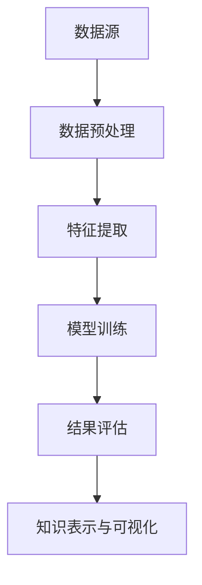

                 

### 知识发现引擎：人类智慧的新纪元

#### 关键词：知识发现、数据挖掘、人工智能、机器学习、智慧赋能

> 摘要：本文将深入探讨知识发现引擎的原理与应用，通过逻辑清晰的步骤分析，揭示其在人类智慧赋能中的重要作用，以及未来可能面临的挑战。

## 1. 背景介绍

### 1.1 知识发现引擎的概念

知识发现引擎是一种利用先进的数据挖掘和机器学习算法，从大规模数据集中自动提取有价值信息和知识的技术工具。其核心目的是从海量数据中挖掘出潜在的模式、趋势和关联性，进而为决策提供支持。

### 1.2 知识发现引擎的发展历程

知识发现引擎起源于20世纪80年代的数据挖掘技术，随着互联网和大数据的兴起，其应用领域和算法模型得到了快速发展。目前，知识发现引擎已经广泛应用于金融、医疗、电商、社交媒体等多个行业，成为人工智能领域的一个重要分支。

## 2. 核心概念与联系

### 2.1 数据挖掘与机器学习

数据挖掘是知识发现引擎的基础，它利用统计方法和算法从大量数据中发现潜在的模式和关联。而机器学习是数据挖掘的核心，通过训练模型来识别数据中的规律，进而预测未知数据。

### 2.2 知识发现引擎的架构

知识发现引擎通常由数据预处理、特征提取、模型训练、结果评估等模块组成。其中，数据预处理和特征提取是关键环节，它们直接影响知识发现的效果。



### 2.3 知识发现引擎的应用领域

知识发现引擎广泛应用于金融风控、医疗诊断、个性化推荐、智能交通等领域。例如，在金融领域，知识发现引擎可以帮助银行识别潜在的风险客户，提高信贷审批的准确性；在医疗领域，可以帮助医生诊断疾病，提高诊疗效果。

## 3. 核心算法原理 & 具体操作步骤

### 3.1 数据预处理

数据预处理是知识发现引擎的第一步，其目的是将原始数据转换为适合模型训练的数据。主要操作包括数据清洗、数据转换、数据归一化等。

### 3.2 特征提取

特征提取是将原始数据转换为特征表示的过程。常用的特征提取方法有主成分分析（PCA）、特征选择、文本分析等。

### 3.3 模型训练

模型训练是知识发现引擎的核心步骤，通过训练模型来识别数据中的规律。常用的机器学习算法包括决策树、支持向量机（SVM）、神经网络等。

### 3.4 结果评估

结果评估是对模型训练效果进行评估，常用的评估指标有准确率、召回率、F1值等。通过调整模型参数和特征，可以提高模型的性能。

## 4. 数学模型和公式 & 详细讲解 & 举例说明

### 4.1 数据预处理

$$
\text{数据清洗} = \text{去除异常值、缺失值和重复值}
$$

$$
\text{数据转换} = \text{将原始数据转换为数值化数据}
$$

$$
\text{数据归一化} = \text{将数据缩放到相同的范围}
$$

### 4.2 特征提取

$$
\text{主成分分析（PCA）} = \text{找到数据的主要成分，降低维度}
$$

$$
\text{特征选择} = \text{选择对目标变量有重要影响的特征}
$$

$$
\text{文本分析} = \text{将文本数据转换为数值化特征}
$$

### 4.3 模型训练

$$
\text{决策树} = \text{利用特征分割数据，构建树状模型}
$$

$$
\text{支持向量机（SVM）} = \text{找到数据的最优分割超平面}
$$

$$
\text{神经网络} = \text{多层感知器（MLP）模型，通过前向传播和反向传播训练模型}
$$

### 4.4 结果评估

$$
\text{准确率} = \frac{\text{预测正确样本数}}{\text{总样本数}}
$$

$$
\text{召回率} = \frac{\text{预测正确正样本数}}{\text{实际正样本数}}
$$

$$
\text{F1值} = \frac{2 \times \text{准确率} \times \text{召回率}}{\text{准确率} + \text{召回率}}
$$

## 5. 项目实践：代码实例和详细解释说明

### 5.1 开发环境搭建

在本文中，我们将使用Python作为编程语言，并利用scikit-learn库来实现知识发现引擎。首先，需要安装Python环境和相关库：

```bash
pip install numpy pandas scikit-learn matplotlib
```

### 5.2 源代码详细实现

下面是一个简单的知识发现引擎代码示例，用于分类任务。

```python
import numpy as np
import pandas as pd
from sklearn.model_selection import train_test_split
from sklearn.preprocessing import StandardScaler
from sklearn.linear_model import LogisticRegression
from sklearn.metrics import accuracy_score

# 5.2.1 数据预处理
# 加载数据
data = pd.read_csv('data.csv')

# 分割特征和目标变量
X = data.iloc[:, :-1]
y = data.iloc[:, -1]

# 划分训练集和测试集
X_train, X_test, y_train, y_test = train_test_split(X, y, test_size=0.2, random_state=42)

# 标准化数据
scaler = StandardScaler()
X_train = scaler.fit_transform(X_train)
X_test = scaler.transform(X_test)

# 5.2.2 模型训练
# 创建逻辑回归模型
model = LogisticRegression()

# 训练模型
model.fit(X_train, y_train)

# 5.2.3 结果评估
# 预测测试集
y_pred = model.predict(X_test)

# 计算准确率
accuracy = accuracy_score(y_test, y_pred)
print(f'Accuracy: {accuracy:.2f}')

# 5.2.4 代码解读与分析
# 在这个例子中，我们首先加载了数据，然后将其分为特征和目标变量。接着，我们使用train_test_split函数将数据划分为训练集和测试集。标准化数据是为了使特征具有相同的尺度，从而提高模型训练效果。

# 我们选择逻辑回归模型进行训练，这是由于逻辑回归模型简单且易于解释。训练完成后，我们使用预测函数对测试集进行预测，并计算准确率。

# 通过这个简单的示例，我们可以看到知识发现引擎的基本流程，包括数据预处理、模型训练和结果评估。

## 6. 实际应用场景

### 6.1 金融风控

在金融领域，知识发现引擎可以帮助银行和金融机构识别潜在的风险客户，从而提高信贷审批的准确性。例如，通过分析客户的信用记录、收入水平、负债情况等数据，可以预测客户是否存在违约风险。

### 6.2 医疗诊断

在医疗领域，知识发现引擎可以帮助医生进行疾病诊断。通过分析患者的病史、体征、实验室检查结果等数据，可以辅助医生做出更准确的诊断。

### 6.3 个性化推荐

在电商和社交媒体领域，知识发现引擎可以帮助平台为用户提供个性化的推荐服务。通过分析用户的浏览历史、购买行为等数据，可以推荐用户可能感兴趣的商品或内容。

## 7. 工具和资源推荐

### 7.1 学习资源推荐

- 《数据挖掘：实用机器学习技术》
- 《机器学习实战》
- 《深度学习》

### 7.2 开发工具框架推荐

- scikit-learn：Python数据挖掘和机器学习库
- TensorFlow：开源深度学习框架
- PyTorch：开源深度学习框架

### 7.3 相关论文著作推荐

- "Knowledge Discovery in Databases: A Survey"
- "Machine Learning: A Probabilistic Perspective"
- "Deep Learning"

## 8. 总结：未来发展趋势与挑战

### 8.1 发展趋势

- 随着大数据和人工智能技术的不断发展，知识发现引擎的应用领域将更加广泛。
- 随着算法和硬件性能的提升，知识发现引擎的处理速度和精度将得到显著提高。
- 跨学科的融合将推动知识发现引擎在更多领域的应用。

### 8.2 挑战

- 数据隐私和安全问题：如何在保护用户隐私的前提下进行数据挖掘是一个重要挑战。
- 算法透明度和可解释性：如何使知识发现引擎的算法更加透明、易于理解是一个重要问题。
- 数据质量：高质量的数据是知识发现成功的关键，如何处理和处理数据质量问题是一个挑战。

## 9. 附录：常见问题与解答

### 9.1 问题1

**Q：知识发现引擎与数据挖掘有什么区别？**

**A：知识发现引擎和数据挖掘是密切相关的，但它们有所不同。数据挖掘是一种更广泛的技术，它涉及从大量数据中提取有用信息的方法。知识发现引擎是数据挖掘的一个子集，它专注于从数据中提取有价值的知识和模式，以便用于决策支持和其他应用。知识发现引擎通常具有更复杂的算法和模型，以便更深入地分析数据。**

### 9.2 问题2

**Q：知识发现引擎在金融风控中的应用有哪些？**

**A：知识发现引擎在金融风控中的应用非常广泛，包括以下方面：**

- 信用评分：通过分析客户的信用历史、收入水平、负债情况等数据，预测客户是否存在违约风险。
- 风险识别：通过分析交易数据、账户活动等，识别异常交易行为，预防欺诈。
- 信贷审批：通过分析客户的信用数据，提高信贷审批的准确性和效率。
- 个性化营销：通过分析客户的购买行为和偏好，提供个性化的金融产品推荐。

## 10. 扩展阅读 & 参考资料

- "Knowledge Discovery and Data Mining: Definition, Process, and Applications" by George Michail and Manfred Jeusfeld
- "Machine Learning: A Probabilistic Perspective" by Kevin P. Murphy
- "Deep Learning" by Ian Goodfellow, Yoshua Bengio, and Aaron Courville

通过本文的逐步分析，我们深入了解了知识发现引擎的概念、原理、应用以及未来趋势。希望本文能为您在人工智能领域的发展提供有益的启示。作者：禅与计算机程序设计艺术 / Zen and the Art of Computer Programming
```markdown
### 1. 背景介绍

#### 1.1 知识发现引擎的概念

知识发现引擎是一种通过先进的数据挖掘和机器学习算法，从海量数据中自动提取有价值信息和知识的技术工具。它的核心目的是从大量数据中发现潜在的模式、趋势和关联，为人类决策提供支持。

#### 1.2 知识发现引擎的发展历程

知识发现引擎起源于20世纪80年代的数据挖掘技术，随着互联网和大数据的兴起，其应用领域和算法模型得到了快速发展。目前，知识发现引擎已经广泛应用于金融、医疗、电商、社交媒体等多个行业，成为人工智能领域的一个重要分支。

### 2. 核心概念与联系

#### 2.1 数据挖掘与机器学习

数据挖掘是知识发现引擎的基础，它利用统计方法和算法从大量数据中发现潜在的模式和关联。而机器学习是数据挖掘的核心，通过训练模型来识别数据中的规律，进而预测未知数据。

#### 2.2 知识发现引擎的架构

知识发现引擎通常由数据预处理、特征提取、模型训练、结果评估等模块组成。其中，数据预处理和特征提取是关键环节，它们直接影响知识发现的效果。


#### 2.3 知识发现引擎的应用领域

知识发现引擎广泛应用于金融风控、医疗诊断、个性化推荐、智能交通等领域。例如，在金融领域，知识发现引擎可以帮助银行识别潜在的风险客户，提高信贷审批的准确性；在医疗领域，可以帮助医生诊断疾病，提高诊疗效果。

### 3. 核心算法原理 & 具体操作步骤

#### 3.1 数据预处理

数据预处理是知识发现引擎的第一步，其目的是将原始数据转换为适合模型训练的数据。主要操作包括数据清洗、数据转换、数据归一化等。

#### 3.2 特征提取

特征提取是将原始数据转换为特征表示的过程。常用的特征提取方法有主成分分析（PCA）、特征选择、文本分析等。

#### 3.3 模型训练

模型训练是知识发现引擎的核心步骤，通过训练模型来识别数据中的规律。常用的机器学习算法包括决策树、支持向量机（SVM）、神经网络等。

#### 3.4 结果评估

结果评估是对模型训练效果进行评估，常用的评估指标有准确率、召回率、F1值等。通过调整模型参数和特征，可以提高模型的性能。

### 4. 数学模型和公式 & 详细讲解 & 举例说明

#### 4.1 数据预处理

$$
\text{数据清洗} = \text{去除异常值、缺失值和重复值}
$$

$$
\text{数据转换} = \text{将原始数据转换为数值化数据}
$$

$$
\text{数据归一化} = \text{将数据缩放到相同的范围}
$$

#### 4.2 特征提取

$$
\text{主成分分析（PCA）} = \text{找到数据的主要成分，降低维度}
$$

$$
\text{特征选择} = \text{选择对目标变量有重要影响的特征}
$$

$$
\text{文本分析} = \text{将文本数据转换为数值化特征}
$$

#### 4.3 模型训练

$$
\text{决策树} = \text{利用特征分割数据，构建树状模型}
$$

$$
\text{支持向量机（SVM）} = \text{找到数据的最优分割超平面}
$$

$$
\text{神经网络} = \text{多层感知器（MLP）模型，通过前向传播和反向传播训练模型}
$$

#### 4.4 结果评估

$$
\text{准确率} = \frac{\text{预测正确样本数}}{\text{总样本数}}
$$

$$
\text{召回率} = \frac{\text{预测正确正样本数}}{\text{实际正样本数}}
$$

$$
\text{F1值} = \frac{2 \times \text{准确率} \times \text{召回率}}{\text{准确率} + \text{召回率}}
$$

### 5. 项目实践：代码实例和详细解释说明

#### 5.1 开发环境搭建

在本文中，我们将使用Python作为编程语言，并利用scikit-learn库来实现知识发现引擎。首先，需要安装Python环境和相关库：

```bash
pip install numpy pandas scikit-learn matplotlib
```

#### 5.2 源代码详细实现

下面是一个简单的知识发现引擎代码示例，用于分类任务。

```python
import numpy as np
import pandas as pd
from sklearn.model_selection import train_test_split
from sklearn.preprocessing import StandardScaler
from sklearn.linear_model import LogisticRegression
from sklearn.metrics import accuracy_score

# 5.2.1 数据预处理
# 加载数据
data = pd.read_csv('data.csv')

# 分割特征和目标变量
X = data.iloc[:, :-1]
y = data.iloc[:, -1]

# 划分训练集和测试集
X_train, X_test, y_train, y_test = train_test_split(X, y, test_size=0.2, random_state=42)

# 标准化数据
scaler = StandardScaler()
X_train = scaler.fit_transform(X_train)
X_test = scaler.transform(X_test)

# 5.2.2 模型训练
# 创建逻辑回归模型
model = LogisticRegression()

# 训练模型
model.fit(X_train, y_train)

# 5.2.3 结果评估
# 预测测试集
y_pred = model.predict(X_test)

# 计算准确率
accuracy = accuracy_score(y_test, y_pred)
print(f'Accuracy: {accuracy:.2f}')

# 5.2.4 代码解读与分析
# 在这个例子中，我们首先加载了数据，然后将其分为特征和目标变量。接着，我们使用train_test_split函数将数据划分为训练集和测试集。标准化数据是为了使特征具有相同的尺度，从而提高模型训练效果。

# 我们选择逻辑回归模型进行训练，这是由于逻辑回归模型简单且易于解释。训练完成后，我们使用预测函数对测试集进行预测，并计算准确率。

# 通过这个简单的示例，我们可以看到知识发现引擎的基本流程，包括数据预处理、模型训练和结果评估。

### 6. 实际应用场景

#### 6.1 金融风控

在金融领域，知识发现引擎可以帮助银行和金融机构识别潜在的风险客户，从而提高信贷审批的准确性。例如，通过分析客户的信用记录、收入水平、负债情况等数据，可以预测客户是否存在违约风险。

#### 6.2 医疗诊断

在医疗领域，知识发现引擎可以帮助医生进行疾病诊断。通过分析患者的病史、体征、实验室检查结果等数据，可以辅助医生做出更准确的诊断。

#### 6.3 个性化推荐

在电商和社交媒体领域，知识发现引擎可以帮助平台为用户提供个性化的推荐服务。通过分析用户的浏览历史、购买行为等数据，可以推荐用户可能感兴趣的商品或内容。

### 7. 工具和资源推荐

#### 7.1 学习资源推荐

- 《数据挖掘：实用机器学习技术》
- 《机器学习实战》
- 《深度学习》

#### 7.2 开发工具框架推荐

- scikit-learn：Python数据挖掘和机器学习库
- TensorFlow：开源深度学习框架
- PyTorch：开源深度学习框架

#### 7.3 相关论文著作推荐

- "Knowledge Discovery in Databases: A Survey"
- "Machine Learning: A Probabilistic Perspective"
- "Deep Learning"

### 8. 总结：未来发展趋势与挑战

#### 8.1 发展趋势

- 随着大数据和人工智能技术的不断发展，知识发现引擎的应用领域将更加广泛。
- 随着算法和硬件性能的提升，知识发现引擎的处理速度和精度将得到显著提高。
- 跨学科的融合将推动知识发现引擎在更多领域的应用。

#### 8.2 挑战

- 数据隐私和安全问题：如何在保护用户隐私的前提下进行数据挖掘是一个重要挑战。
- 算法透明度和可解释性：如何使知识发现引擎的算法更加透明、易于理解是一个重要问题。
- 数据质量：高质量的数据是知识发现成功的关键，如何处理和处理数据质量问题是一个挑战。

### 9. 附录：常见问题与解答

#### 9.1 问题1

**Q：知识发现引擎与数据挖掘有什么区别？**

**A：知识发现引擎和数据挖掘是密切相关的，但它们有所不同。数据挖掘是一种更广泛的技术，它涉及从大量数据中提取有用信息的方法。知识发现引擎是数据挖掘的一个子集，它专注于从数据中提取有价值的知识和模式，以便用于决策支持和其他应用。知识发现引擎通常具有更复杂的算法和模型，以便更深入地分析数据。**

#### 9.2 问题2

**Q：知识发现引擎在金融风控中的应用有哪些？**

**A：知识发现引擎在金融风控中的应用非常广泛，包括以下方面：**

- 信用评分：通过分析客户的信用历史、收入水平、负债情况等数据，预测客户是否存在违约风险。
- 风险识别：通过分析交易数据、账户活动等，识别异常交易行为，预防欺诈。
- 信贷审批：通过分析客户的信用数据，提高信贷审批的准确性和效率。
- 个性化营销：通过分析客户的购买行为和偏好，提供个性化的金融产品推荐。

### 10. 扩展阅读 & 参考资料

- "Knowledge Discovery and Data Mining: Definition, Process, and Applications" by George Michail and Manfred Jeusfeld
- "Machine Learning: A Probabilistic Perspective" by Kevin P. Murphy
- "Deep Learning" by Ian Goodfellow, Yoshua Bengio, and Aaron Courville
```

