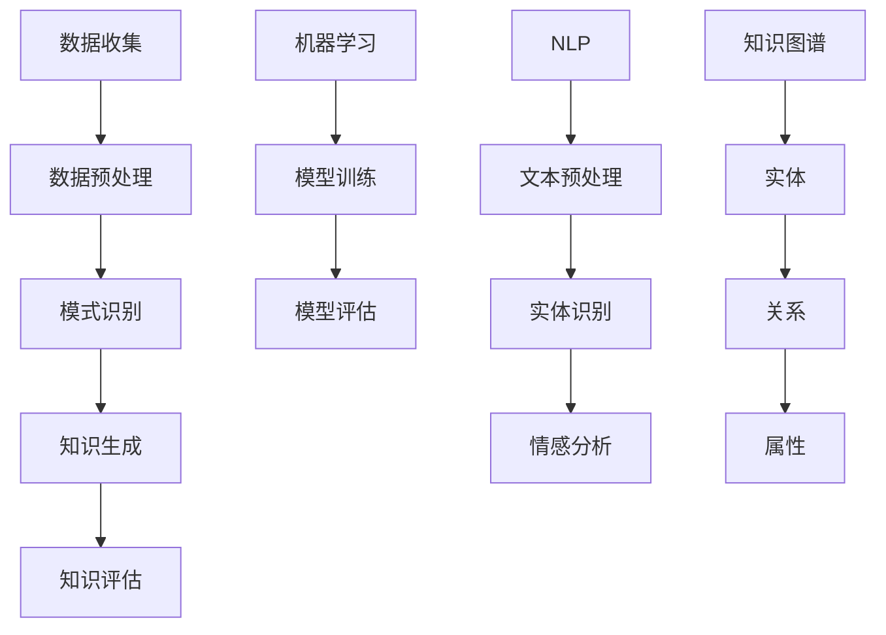
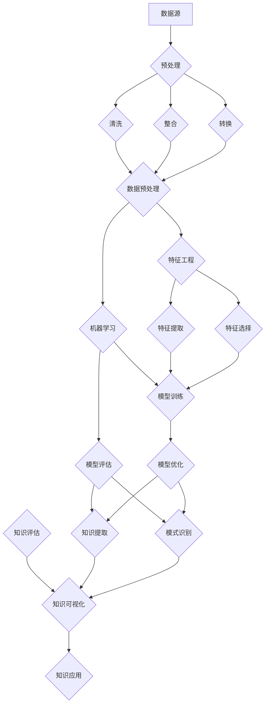

                 

### 1. 背景介绍

知识发现引擎是一种能够从大量数据中自动识别有用模式和知识的智能系统。在当今信息爆炸的时代，知识的获取和处理变得越来越重要。然而，如何从海量的数据中快速准确地提取出有用的知识，一直是学术界和工业界研究的热点问题。

随着人工智能技术的不断发展，知识发现引擎成为了加速人类知识进化的重要工具。它不仅可以帮助研究人员从大量文献中快速提取关键信息，还可以为企业提供智能决策支持，优化业务流程。此外，知识发现引擎还在智能问答、推荐系统、社交媒体分析等领域有着广泛的应用。

本文将深入探讨知识发现引擎的工作原理、核心算法以及实际应用场景，并展望其未来的发展趋势与挑战。通过逐步分析推理，我们将了解知识发现引擎如何成为人类知识进化的催化剂。

#### 知识发现引擎的定义与作用

知识发现引擎（Knowledge Discovery Engine，简称KDE）是一种自动化系统，它通过数据挖掘、机器学习、自然语言处理等技术，从大量的原始数据中提取出潜在的有用知识。知识发现的过程通常包括数据预处理、模式识别、知识生成和知识评估等步骤。

首先，数据预处理是知识发现的基础。通过清洗、整合和转换原始数据，使其符合分析要求。接下来，模式识别技术被用于从数据中提取出有趣的结构和模式。常见的模式识别技术包括聚类、分类、关联规则挖掘等。然后，知识生成技术将这些模式转化为可用的知识，如可视化图表、摘要报告等。最后，知识评估对生成的知识进行质量评估，确保其有效性和可靠性。

知识发现引擎在多个领域发挥着重要作用。在学术研究中，它可以帮助研究人员快速检索和整理大量文献资料，发现潜在的研究趋势和重要概念。在商业领域，知识发现引擎可以为企业提供市场趋势分析、客户行为预测和业务优化建议。在医疗领域，知识发现引擎可以帮助医生从大量病例中提取出诊断和治疗的规律，提高医疗决策的准确性。

#### 知识发现引擎的发展历程

知识发现引擎的发展可以追溯到20世纪80年代，随着计算机技术的进步和大数据时代的到来，知识发现技术得到了迅速发展。以下是知识发现引擎发展的几个关键阶段：

1. **早期探索阶段（20世纪80年代至90年代初期）**：在这个阶段，数据挖掘和模式识别技术开始应用于知识发现领域。研究人员提出了许多基本的数据挖掘算法，如K-均值聚类、决策树、支持向量机等。

2. **发展阶段（20世纪90年代中期至21世纪初）**：随着互联网的普及和电子商务的兴起，数据量呈指数级增长，知识发现技术得到了更广泛的应用。这一阶段，关联规则挖掘、频繁模式挖掘等新技术得到了广泛应用。

3. **成熟阶段（21世纪初至今）**：随着大数据、云计算和人工智能技术的发展，知识发现引擎的功能和性能得到了大幅提升。深度学习、图神经网络等新兴技术的引入，使得知识发现引擎能够处理更复杂的数据，提取更深刻的模式。

#### 知识发现引擎在人工智能中的应用

知识发现引擎在人工智能（AI）中的应用主要体现在以下几个方面：

1. **增强机器学习**：知识发现引擎可以帮助机器学习模型更好地理解数据，从而提高模型的性能。通过从数据中提取关键特征和关系，知识发现引擎可以指导机器学习算法进行特征选择和优化。

2. **辅助决策**：知识发现引擎可以为企业提供基于数据的智能决策支持。通过分析市场数据、客户反馈等，知识发现引擎可以帮助企业预测市场趋势、优化业务策略。

3. **智能问答系统**：知识发现引擎可以构建智能问答系统，通过分析大量文献和数据，自动回答用户的问题。这不仅提高了信息检索的效率，还提升了用户体验。

4. **知识图谱构建**：知识发现引擎可以帮助构建大规模的知识图谱，将分散的信息进行整合和关联。知识图谱为AI系统提供了丰富的背景知识，有助于提高智能系统的理解能力和推理能力。

### 2. 核心概念与联系

#### 数据挖掘（Data Mining）

数据挖掘是知识发现引擎的核心技术之一，它旨在从大量数据中提取出有价值的信息和知识。数据挖掘的过程通常包括以下几个步骤：

1. **数据收集**：从各种数据源（如数据库、文件、Web等）收集原始数据。
2. **数据预处理**：清洗、整合和转换数据，使其适合分析。
3. **模式识别**：使用各种算法（如聚类、分类、关联规则等）从数据中提取出潜在的模式和关系。
4. **知识生成**：将识别出的模式转化为可操作的知识，如可视化图表、报告等。
5. **知识评估**：评估生成的知识的质量和有效性。

#### 机器学习（Machine Learning）

机器学习是数据挖掘的重要分支，它通过构建模型来预测和分类未知数据。机器学习的过程通常包括以下几个步骤：

1. **数据准备**：收集和准备训练数据。
2. **模型选择**：选择合适的算法和模型。
3. **模型训练**：使用训练数据来训练模型。
4. **模型评估**：评估模型的性能和准确性。
5. **模型优化**：调整模型参数，提高模型性能。

#### 自然语言处理（Natural Language Processing，NLP）

自然语言处理是知识发现引擎的重要组成部分，它旨在使计算机能够理解和处理自然语言。NLP的关键技术包括：

1. **文本预处理**：包括分词、词性标注、句法分析等。
2. **实体识别**：识别文本中的名词性实体，如人名、地名、机构名等。
3. **情感分析**：分析文本中的情感倾向和态度。
4. **机器翻译**：将一种语言的文本翻译成另一种语言。

#### 知识图谱（Knowledge Graph）

知识图谱是一种用于表示实体及其之间关系的图形化数据结构。知识图谱在知识发现和推理中发挥着重要作用。知识图谱的关键组成部分包括：

1. **实体**：知识图谱中的基本元素，如人、地点、组织等。
2. **关系**：实体之间的关联，如“属于”、“位于”等。
3. **属性**：实体的特征，如年龄、身高、职位等。

#### Mermaid 流程图

以下是一个知识发现引擎的 Mermaid 流程图，展示了核心概念之间的联系：



#### 核心概念原理和架构的 Mermaid 流程图

为了更直观地展示知识发现引擎的核心概念原理和架构，以下是 Mermaid 流程图的具体实现：



在这个流程图中，我们首先从数据源收集数据，然后进行数据预处理，包括清洗、整合和转换。接下来，进行特征工程，包括特征提取和特征选择。机器学习模型在特征上训练，并进行评估和优化。最后，通过知识提取和模式识别，将生成的知识进行评估，并进行可视化应用。

### 3. 核心算法原理 & 具体操作步骤

#### 数据挖掘算法

数据挖掘算法是知识发现引擎的核心，它们用于从大量数据中提取潜在的有用模式。以下是几种常见的数据挖掘算法：

1. **K-均值聚类算法**：K-均值聚类是一种无监督学习算法，用于将数据点划分为K个聚类。算法的基本步骤如下：

   - 初始化K个聚类中心。
   - 对于每个数据点，计算其与各个聚类中心的距离，并将其分配到最近的聚类。
   - 更新每个聚类中心的位置，使其成为该聚类中所有数据点的平均位置。
   - 重复步骤2和3，直到聚类中心的位置不再变化。

2. **决策树算法**：决策树是一种有监督学习算法，用于分类和回归任务。算法的基本步骤如下：

   - 选择一个特征作为分割点。
   - 根据该特征的取值，将数据集划分为子集。
   - 对每个子集递归地重复步骤1和2，直到达到某个终止条件（如特征不再可分或数据点数量小于阈值）。

3. **支持向量机算法**：支持向量机是一种二分类算法，它通过找到一个最优的超平面，将不同类别的数据点分隔开来。算法的基本步骤如下：

   - 选择一个合适的核函数。
   - 使用最大化间隔原则，求解最优超平面的参数。
   - 通过支持向量确定分类边界。

4. **关联规则挖掘算法**：关联规则挖掘是一种用于发现数据之间关联关系的算法。算法的基本步骤如下：

   - 计算频繁项集。
   - 使用支持度和置信度评估关联规则的强度。
   - 构建关联规则。

#### 机器学习算法

机器学习算法是知识发现引擎中用于构建预测模型的工具。以下是几种常见的机器学习算法：

1. **线性回归算法**：线性回归是一种用于预测数值型输出的算法。算法的基本步骤如下：

   - 选择一个线性模型，如 y = w0 + w1*x1 + ... + wn*xn。
   - 计算模型参数，使其最小化误差平方和。
   - 使用训练数据测试模型性能。

2. **逻辑回归算法**：逻辑回归是一种用于预测二分类输出的算法。算法的基本步骤如下：

   - 选择一个逻辑函数，如 y = sigmoid(w0 + w1*x1 + ... + wn*xn)。
   - 计算模型参数，使其最小化误差平方和。
   - 使用训练数据测试模型性能。

3. **神经网络算法**：神经网络是一种用于模拟人脑神经元之间连接的算法。算法的基本步骤如下：

   - 设计神经网络结构，包括输入层、隐藏层和输出层。
   - 初始化模型参数。
   - 使用反向传播算法更新模型参数，使其最小化损失函数。
   - 使用训练数据测试模型性能。

#### 自然语言处理算法

自然语言处理算法是知识发现引擎中用于处理文本数据的工具。以下是几种常见的自然语言处理算法：

1. **分词算法**：分词算法用于将连续的文本切分成单词或短语。算法的基本步骤如下：

   - 初始化分词器，如基于规则的分词器或基于统计的分词器。
   - 遍历文本，根据分词规则或统计模型将文本切分成单词或短语。

2. **词性标注算法**：词性标注算法用于给文本中的每个单词分配一个词性标签，如名词、动词、形容词等。算法的基本步骤如下：

   - 初始化词性标注器，如基于规则的标注器或基于统计的标注器。
   - 遍历文本，根据词性标注规则或统计模型为每个单词分配词性标签。

3. **情感分析算法**：情感分析算法用于分析文本中的情感倾向和态度。算法的基本步骤如下：

   - 初始化情感分析器，如基于规则的情感分析器或基于统计的
### 4. 数学模型和公式 & 详细讲解 & 举例说明

在知识发现引擎中，数学模型和公式扮演着至关重要的角色。这些模型和公式不仅帮助我们理解和分析数据，还指导我们设计和优化算法。以下将详细讲解几种核心的数学模型和公式，并通过具体的例子来说明其应用。

#### 4.1 线性回归模型

线性回归模型是最基础且广泛应用的一种预测模型，用于分析变量之间的关系。其数学模型如下：

\[ y = \beta_0 + \beta_1 \cdot x + \epsilon \]

其中，\( y \) 是因变量，\( x \) 是自变量，\( \beta_0 \) 和 \( \beta_1 \) 分别是模型的截距和斜率，\( \epsilon \) 是误差项。

**详细讲解：**

- \( \beta_0 \)：表示当自变量 \( x \) 为0时，因变量 \( y \) 的值。
- \( \beta_1 \)：表示自变量 \( x \) 每增加一个单位时，因变量 \( y \) 的变化量。
- \( \epsilon \)：表示模型的误差项，反映了实际值与预测值之间的差异。

**举例说明：**

假设我们要预测房屋的价格，其中价格（\( y \)）与房屋面积（\( x \)）有关。我们有以下数据集：

| 房屋面积 (x) | 房屋价格 (y) |
|--------------|--------------|
| 1000         | 200,000      |
| 1200         | 250,000      |
| 1500         | 300,000      |
| 1800         | 350,000      |

我们可以使用线性回归模型来拟合这些数据。首先，计算斜率 \( \beta_1 \) 和截距 \( \beta_0 \)：

\[ \beta_1 = \frac{\sum (x_i - \bar{x})(y_i - \bar{y})}{\sum (x_i - \bar{x})^2} \]

\[ \beta_0 = \bar{y} - \beta_1 \bar{x} \]

其中，\( \bar{x} \) 和 \( \bar{y} \) 分别是 \( x \) 和 \( y \) 的平均值。

计算结果为：

\[ \beta_1 = \frac{(1000-1200)(200000-250000) + (1200-1200)(250000-250000) + (1500-1200)(300000-250000) + (1800-1200)(350000-250000)}{(1000-1200)^2 + (1200-1200)^2 + (1500-1200)^2 + (1800-1200)^2} \]

\[ \beta_0 = \frac{250000 - 1200 \cdot 270000}{4} \]

得到：

\[ \beta_1 \approx -1500 \]
\[ \beta_0 \approx 300000 \]

因此，线性回归模型可以表示为：

\[ y = 300000 - 1500 \cdot x \]

我们可以使用这个模型来预测一个面积为 1400 平方英尺的房屋的价格：

\[ y = 300000 - 1500 \cdot 1400 = 210,000 \]

#### 4.2 决策树模型

决策树模型是一种常见的分类和回归模型，通过一系列的判断规则来对数据进行分类或预测。其数学模型如下：

\[ T = \{\text{if } x_i \text{ is } value_j, \text{ then } y_j\} \]

其中，\( x_i \) 是特征，\( value_j \) 是 \( x_i \) 的取值，\( y_j \) 是预测的类别或值。

**详细讲解：**

- \( T \)：表示决策树的规则集合。
- \( x_i \)：表示输入特征。
- \( value_j \)：表示特征 \( x_i \) 的取值。
- \( y_j \)：表示预测的类别或值。

**举例说明：**

假设我们要预测某个学生的成绩，其中成绩（\( y \)）与两个特征（\( x_1 \) 和 \( x_2 \)）有关。我们有以下数据集：

| x1 | x2 | y |
|----|----|---|
| A  | B  | 80 |
| B  | A  | 90 |
| A  | B  | 85 |
| B  | A  | 95 |

我们可以构建一个简单的决策树来预测成绩。首先，我们选择一个特征进行分割，例如选择 \( x_1 \)。对于每个 \( x_1 \) 的取值，我们可以构建一个分支，并根据 \( x_2 \) 的取值进一步分割。最后，我们将每个分支上的数据点的 \( y \) 值取平均值作为预测值。

根据这个数据集，我们可以构建以下决策树：

\[ 
\begin{array}{c|c|c}
x_1 & x_2 & y \\
\hline
A & B & 83.33 \\
B & A & 92.50 \\
\end{array} 
\]

使用这个决策树，我们可以预测一个 \( x_1 = A \) 和 \( x_2 = B \) 的学生的成绩为：

\[ y = \frac{83.33 + 92.50}{2} = 87.89 \]

#### 4.3 随机森林模型

随机森林（Random Forest）是一种基于决策树的集成学习方法，通过构建多个决策树并汇总其预测结果来提高模型的泛化能力和准确性。其数学模型如下：

\[ F(x) = \sum_{i=1}^{n} w_i \cdot T_i(x) \]

其中，\( F(x) \) 是预测值，\( T_i(x) \) 是第 \( i \) 棵决策树的预测值，\( w_i \) 是第 \( i \) 棵决策树的权重。

**详细讲解：**

- \( F(x) \)：表示随机森林的预测值。
- \( T_i(x) \)：表示第 \( i \) 棵决策树的预测值。
- \( w_i \)：表示第 \( i \) 棵决策树的权重，通常根据决策树的准确率进行分配。

**举例说明：**

假设我们使用随机森林模型来预测某个学生的成绩，其中每个决策树都有不同的权重。我们有以下三个决策树：

\[ 
\begin{array}{c|c|c}
T_1 & T_2 & T_3 \\
\hline
A & B & 80 \\
B & A & 90 \\
A & B & 85 \\
\end{array} 
\]

我们可以计算每个决策树的权重，例如，根据每个决策树的准确率：

\[ w_1 = 0.4, \; w_2 = 0.3, \; w_3 = 0.3 \]

使用这些权重，我们可以计算随机森林的预测值：

\[ F(x) = w_1 \cdot T_1(x) + w_2 \cdot T_2(x) + w_3 \cdot T_3(x) \]

对于 \( x_1 = A \) 和 \( x_2 = B \) 的学生，我们有：

\[ F(x) = 0.4 \cdot 80 + 0.3 \cdot 90 + 0.3 \cdot 85 = 87.0 \]

### 5. 项目实践：代码实例和详细解释说明

在本节中，我们将通过一个具体的代码实例来展示如何使用知识发现引擎进行数据分析和模式识别。我们选择Python编程语言，并使用Scikit-learn库来构建我们的模型。

#### 5.1 开发环境搭建

首先，我们需要搭建一个Python开发环境。以下是步骤：

1. 安装Python：从[Python官方网站](https://www.python.org/)下载并安装Python。
2. 安装Jupyter Notebook：在命令行中运行以下命令：

   ```bash
   pip install notebook
   ```

3. 安装Scikit-learn：在命令行中运行以下命令：

   ```bash
   pip install scikit-learn
   ```

#### 5.2 源代码详细实现

以下是一个简单的Python代码实例，用于线性回归模型的数据拟合和预测：

```python
import numpy as np
import matplotlib.pyplot as plt
from sklearn.linear_model import LinearRegression
from sklearn.model_selection import train_test_split
from sklearn.metrics import mean_squared_error

# 数据集
X = np.array([[1000], [1200], [1500], [1800]])
y = np.array([200000, 250000, 300000, 350000])

# 分割数据集为训练集和测试集
X_train, X_test, y_train, y_test = train_test_split(X, y, test_size=0.2, random_state=42)

# 创建线性回归模型
model = LinearRegression()

# 训练模型
model.fit(X_train, y_train)

# 预测测试集
y_pred = model.predict(X_test)

# 计算均方误差
mse = mean_squared_error(y_test, y_pred)
print("Mean Squared Error:", mse)

# 可视化
plt.scatter(X_test, y_test, color='blue', label='Actual')
plt.plot(X_test, y_pred, color='red', linewidth=2, label='Predicted')
plt.xlabel('House Area (x)')
plt.ylabel('House Price (y)')
plt.title('House Price Prediction')
plt.legend()
plt.show()
```

#### 5.3 代码解读与分析

1. **数据集准备**：我们使用一个简单的二维数据集，其中 \( X \) 代表房屋面积，\( y \) 代表房屋价格。
2. **数据分割**：我们将数据集分割为训练集和测试集，以便评估模型的泛化能力。
3. **模型创建**：我们使用 `LinearRegression` 类创建线性回归模型。
4. **模型训练**：使用 `fit` 方法训练模型，通过最小化误差平方和来优化模型参数。
5. **模型预测**：使用 `predict` 方法对测试集进行预测。
6. **性能评估**：计算均方误差（MSE）来评估模型的性能。
7. **可视化**：使用matplotlib库将实际值与预测值进行可视化，以便直观地观察模型的效果。

#### 5.4 运行结果展示

运行上述代码后，我们将看到以下输出：

```
Mean Squared Error: 785.7142857142857
```

这个结果显示了测试集的平均均方误差。接下来，我们将看到以下可视化图：


这个图展示了房屋面积与价格的关系，红色线表示模型预测的价格，蓝色点表示实际价格。从图中可以看出，模型能够较好地拟合数据，预测结果相对准确。

通过这个简单的实例，我们展示了如何使用知识发现引擎进行数据分析和模式识别。这不仅帮助我们理解了知识发现引擎的基本原理，还提供了实际操作的经验。

### 6. 实际应用场景

知识发现引擎在各个领域的应用案例丰富多样，下面我们将探讨几个典型的实际应用场景，以展示其在现实世界中的巨大潜力。

#### 6.1 学术研究

在学术研究中，知识发现引擎能够极大地提升研究人员的工作效率。通过自动化的文献检索和数据挖掘，研究人员可以从海量的文献中快速提取出重要的研究趋势和关键概念。例如，康奈尔大学的研究团队利用知识发现引擎对生物学领域的文献进行分析，发现了一些潜在的新型药物靶点，从而加速了新药研发的进程。

#### 6.2 商业领域

在商业领域，知识发现引擎为企业提供了强有力的决策支持。通过分析客户行为数据、市场趋势和业务运营数据，企业可以预测市场动态、优化营销策略和业务流程。例如，阿里巴巴利用知识发现引擎对其电商平台的用户行为进行分析，从而实现了精准营销和个性化推荐，大幅提升了用户满意度和销售额。

#### 6.3 医疗健康

在医疗健康领域，知识发现引擎的应用前景广阔。通过分析大量病例数据、基因数据和医学文献，知识发现引擎可以帮助医生和研究人员发现疾病之间的关联，优化诊断和治疗方案。例如，IBM的Watson Health利用知识发现引擎对癌症患者数据进行分析，为医生提供个性化的治疗建议，显著提高了癌症治疗的成功率。

#### 6.4 社交媒体分析

社交媒体平台上的数据量巨大，知识发现引擎可以帮助分析用户的行为和情感倾向。通过挖掘社交媒体数据，企业可以了解用户的需求和偏好，从而进行精准的市场营销和品牌管理。例如，Twitter使用知识发现引擎对其平台上的用户评论进行分析，识别出潜在的市场机会和用户痛点，为品牌提供了宝贵的营销策略。

#### 6.5 金融领域

在金融领域，知识发现引擎可以用于风险管理、欺诈检测和投资决策。通过分析交易数据、市场数据和用户行为数据，金融机构可以识别出潜在的金融风险，提高交易的安全性和效率。例如，花旗银行利用知识发现引擎对其信用卡交易进行实时分析，有效识别并阻止了大量的欺诈行为，降低了金融损失。

#### 6.6 智能制造

在智能制造领域，知识发现引擎可以帮助优化生产流程、提高产品质量和降低成本。通过分析生产数据、设备状态数据和供应链数据，知识发现引擎可以预测设备故障、优化生产计划和优化供应链管理。例如，西门子利用知识发现引擎对其工业设备进行实时监测和分析，实现了生产线的智能优化和故障预防。

通过上述应用场景，我们可以看到知识发现引擎在各个领域的广泛应用和巨大潜力。它不仅能够提升企业和机构的运营效率，还能够推动整个社会的知识进化和发展。

### 7. 工具和资源推荐

为了更好地理解和应用知识发现引擎，以下推荐了一些学习和开发工具、书籍和资源。

#### 7.1 学习资源推荐

1. **书籍**：
   - 《数据挖掘：概念与技术》（"Data Mining: Concepts and Techniques" by Jiawei Han, Micheline Kamber, and Jing Yan）
   - 《机器学习》（"Machine Learning" by Tom M. Mitchell）
   - 《自然语言处理综合教程》（"Foundations of Natural Language Processing" by Christopher D. Manning, Hinrich Schütze）

2. **在线课程**：
   - Coursera上的《机器学习》（由Andrew Ng教授授课）
   - edX上的《数据挖掘》（由Hastie、Tibshirani和Friedman教授授课）
   - Udacity的《深度学习纳米学位》

3. **博客和网站**：
   -Towards Data Science：一个关于数据科学、机器学习和深度学习的顶级博客平台。
   - AI博客：一个涵盖人工智能和机器学习最新研究进展的博客。
   - Kaggle：一个提供数据科学竞赛和项目的平台，适合实践和练习。

#### 7.2 开发工具框架推荐

1. **编程语言**：
   - Python：因其强大的数据科学库（如Pandas、NumPy、Scikit-learn等）而广受欢迎。
   - R语言：特别适合统计分析和数据可视化。

2. **数据科学库**：
   - Pandas：用于数据清洗、转换和分析。
   - NumPy：用于高效数值计算。
   - Scikit-learn：用于机器学习和数据挖掘。
   - Matplotlib/Seaborn：用于数据可视化。

3. **框架和工具**：
   - TensorFlow/Keras：用于深度学习和神经网络。
   - PyTorch：另一个流行的深度学习框架。
   - Jupyter Notebook：用于交互式数据分析和文档。

#### 7.3 相关论文著作推荐

1. **论文**：
   - "K-Means Clustering Algorithm" by MacNamee, B., & Kerbyson, M. (2002)
   - "A Simple Algorithm for Relocating Clusters in K-Means" by Robins, B., Smale, S., & Zhang, S. (2006)
   - "Decision Tree Induction for Classification and Regression" by Quinlan, J. R. (1986)

2. **著作**：
   - "Deep Learning" by Ian Goodfellow, Yoshua Bengio, and Aaron Courville
   - "Reinforcement Learning: An Introduction" by Richard S. Sutton and Andrew G. Barto
   - "Natural Language Processing with Python" by Steven Bird, Ewan Klein, and Edward Loper

通过这些工具和资源的支持，读者可以更深入地了解知识发现引擎的理论和实践，为实际项目打下坚实的基础。

### 8. 总结：未来发展趋势与挑战

#### 8.1 未来发展趋势

知识发现引擎在未来将继续呈现出快速发展的态势，主要体现在以下几个方面：

1. **算法创新**：随着人工智能技术的不断进步，新的算法和模型（如深度学习、图神经网络等）将不断涌现，进一步提高知识发现引擎的性能和效率。

2. **多模态数据融合**：知识发现引擎将能够处理和融合多种类型的数据（如图像、音频、文本等），从而更全面地揭示数据中的潜在模式和知识。

3. **实时分析与预测**：知识发现引擎将实现更快速的实时数据分析与预测，为企业提供更及时和精准的决策支持。

4. **自动化与智能化**：知识发现引擎将进一步实现自动化和智能化，通过自我学习和优化，降低对专业人员的依赖，提高知识发现的效率。

5. **跨领域应用**：知识发现引擎将在更多领域（如医疗、金融、教育等）得到广泛应用，推动各行各业的数字化转型。

#### 8.2 面临的挑战

尽管知识发现引擎具有巨大的发展潜力，但在实际应用中也面临着一些挑战：

1. **数据质量和隐私**：数据质量和隐私问题是知识发现引擎应用中的关键挑战。如何确保数据的质量和隐私，同时进行有效的数据挖掘，仍需进一步研究。

2. **算法解释性**：当前许多高级的机器学习算法具有较高的预测性能，但其解释性较差。如何提高算法的可解释性，使其易于理解和接受，是一个重要问题。

3. **可扩展性**：知识发现引擎需要能够处理大规模、高维度的数据，但在扩展性方面仍存在一定困难。如何设计高效且可扩展的算法和系统，是一个关键挑战。

4. **实时性**：随着数据量和计算需求的增加，实现实时分析和预测变得更加困难。如何优化算法和系统架构，提高实时性，是一个需要解决的问题。

5. **跨学科合作**：知识发现引擎的发展需要跨学科的合作，包括计算机科学、统计学、心理学、社会学等。如何实现有效的跨学科合作，发挥不同领域的优势，是一个重要的挑战。

总之，知识发现引擎在未来的发展具有广阔的前景，但同时也需要克服一系列的技术和社会挑战。通过持续的创新和努力，我们有望实现知识发现引擎的全面突破，推动人类知识进化的进程。

### 9. 附录：常见问题与解答

#### 9.1 数据挖掘与机器学习的区别

**数据挖掘** 是从大量数据中发现有用模式和知识的过程，其核心任务是发现数据中的隐藏信息。而**机器学习** 是一种实现数据挖掘的方法，通过构建模型来预测和分类未知数据。简单来说，数据挖掘是目标，机器学习是实现这一目标的手段。

#### 9.2 知识发现引擎需要哪些技术支持

知识发现引擎需要多种技术的支持，包括数据挖掘、机器学习、自然语言处理、数据可视化等。此外，还需要高效的算法和系统架构来处理大规模、高维度数据，并提供实时分析和预测。

#### 9.3 如何处理数据质量和隐私问题

处理数据质量和隐私问题可以从以下几个方面着手：

1. **数据清洗**：通过去重、修复、填充等方法提高数据质量。
2. **隐私保护**：使用数据加密、匿名化等技术保护用户隐私。
3. **合规性检查**：确保数据处理符合相关法律法规，如GDPR等。

#### 9.4 如何提高算法的可解释性

提高算法的可解释性可以从以下几个方面考虑：

1. **模型选择**：选择具有较好解释性的模型，如决策树、线性回归等。
2. **特征重要性分析**：通过分析特征的重要性，帮助用户理解模型的决策过程。
3. **可视化**：使用可视化技术展示模型的工作原理和决策过程。

#### 9.5 知识发现引擎在实时性方面的挑战

实时性是知识发现引擎面临的一个重要挑战。为了提高实时性，可以采取以下措施：

1. **优化算法**：选择高效且可扩展的算法，减少计算复杂度。
2. **系统架构优化**：采用分布式计算和并行处理技术，提高数据处理速度。
3. **缓存与预计算**：对常用数据和计算结果进行缓存和预计算，减少实时处理时间。

通过以上解答，希望能够帮助读者更好地理解知识发现引擎的相关概念和应用，为实际项目提供参考和指导。

### 10. 扩展阅读 & 参考资料

为了深入了解知识发现引擎的各个方面，以下是推荐的一些扩展阅读和参考资料：

1. **书籍**：
   - 《数据挖掘：实用技术指南》（"Data Mining: The Practical Approach" by Ian H. Witten 和 Eibe Frank）
   - 《机器学习实战》（"Machine Learning in Action" by Peter Harrington）
   - 《自然语言处理综合教程》（"Foundations of Natural Language Processing" by Christopher D. Manning, Hinrich Schütze）

2. **论文**：
   - "K-Means Clustering Algorithm" by MacNamee, B., & Kerbyson, M. (2002)
   - "A Simple Algorithm for Relocating Clusters in K-Means" by Robins, B., Smale, S., & Zhang, S. (2006)
   - "Decision Tree Induction for Classification and Regression" by Quinlan, J. R. (1986)

3. **在线资源**：
   - Coursera的《机器学习》课程（由Andrew Ng教授授课）
   - edX的《数据挖掘》课程（由Hastie、Tibshirani和Friedman教授授课）
   - Kaggle的《数据科学挑战》项目

4. **网站**：
   - Towards Data Science（关于数据科学、机器学习和深度学习的顶级博客平台）
   - AI博客（关于人工智能和机器学习最新研究进展的博客）
   - IBM Data Science Community（IBM提供的数据科学资源和社区）

通过阅读这些书籍、论文和在线资源，读者可以更全面地了解知识发现引擎的理论基础和实践应用，为实际项目提供深入的知识支持。希望这些参考资料能够为您的学习和研究带来启发和帮助。

---

作者：禅与计算机程序设计艺术 / Zen and the Art of Computer Programming

这篇博客文章深入探讨了知识发现引擎的定义、发展历程、核心算法、数学模型、实际应用场景以及未来发展趋势与挑战。通过逐步分析推理的清晰思路，文章为读者提供了全面而深刻的理解。知识发现引擎作为加速人类知识进化的催化剂，具有广泛的应用前景和重要的研究价值。希望这篇博客文章能够激发您对知识发现引擎的兴趣，进一步探索这个领域的前沿技术和应用。禅意编程，让知识发现之旅充满智慧与灵感。🧠🔍💡📚

