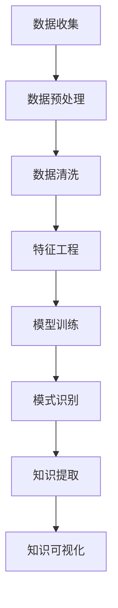

                 

### 知识发现引擎：在信息洪流中挖掘智慧宝藏

> 关键词：知识发现引擎、大数据、机器学习、信息检索、智能分析

> 摘要：在当今信息爆炸的时代，如何从海量数据中挖掘出有价值的信息成为关键问题。知识发现引擎作为一种高级的信息处理工具，通过智能分析和机器学习技术，从大量数据中提取知识，为人类决策提供支持。本文将探讨知识发现引擎的概念、核心原理、算法实现以及在实际应用中的重要作用，旨在为读者提供一窥未来智慧宝藏的窗口。

## 1. 背景介绍

随着互联网技术的飞速发展，信息已经成为现代社会的核心资源。然而，如何有效地管理和利用这些信息，尤其是从海量数据中提取出有价值的知识，成为企业和研究机构面临的重大挑战。传统的信息检索系统主要依赖于关键字匹配，难以应对复杂的数据结构和多维度信息的融合。因此，知识发现引擎（Knowledge Discovery Engine，简称KDE）的出现，为我们提供了一种新的解决思路。

知识发现引擎是基于机器学习和数据挖掘技术的综合系统，旨在从大量数据中自动识别出隐藏的模式、关联和趋势，从而生成新的知识。与传统的信息检索系统不同，知识发现引擎不仅关注数据的查询和索引，更注重对数据背后知识的理解和发掘。它通过智能算法对大量数据进行处理和分析，提取出有价值的信息，为人类决策提供数据支持。

知识发现引擎的应用领域非常广泛，包括但不限于金融、医疗、零售、物流、制造等行业。例如，在金融领域，知识发现引擎可以帮助银行和金融机构发现潜在的风险，预测市场趋势，优化投资策略；在医疗领域，它可以帮助医生诊断疾病，预测患者病情发展，为临床决策提供支持；在零售领域，它可以帮助企业分析消费者行为，优化库存管理，提升销售业绩。

然而，知识发现引擎的发展也面临着诸多挑战。首先，数据的质量和多样性对知识发现的效果有重要影响，低质量的数据和高度复杂的数据结构可能会影响算法的性能。其次，知识发现引擎需要大量的计算资源和存储空间，对于大规模数据的处理能力要求较高。此外，知识发现的过程涉及多个学科领域，包括计算机科学、统计学、数据挖掘、机器学习等，需要跨学科的合作与协同。

## 2. 核心概念与联系

### 2.1. 数据挖掘与知识发现

数据挖掘（Data Mining）是指从大量数据中自动识别出隐藏的模式、关联和趋势的过程。数据挖掘的目标是从数据中发现有价值的信息，为决策提供支持。知识发现（Knowledge Discovery）则是在数据挖掘的基础上，进一步提取出新的知识，为人类理解和利用数据提供支持。知识发现是数据挖掘的高级阶段，其核心目标是从数据中生成可解释、有意义的知识。

数据挖掘与知识发现的关系可以概括为以下两点：

1. 数据挖掘是知识发现的基础。没有数据挖掘，就无法从海量数据中提取出有用的信息，更谈不上知识发现。
2. 知识发现是对数据挖掘的升华。数据挖掘发现的是数据中的表面模式，而知识发现则试图揭示数据背后的深层次规律和内在联系，为人类提供更有价值的洞见。

### 2.2. 机器学习与知识发现

机器学习（Machine Learning，ML）是一种通过算法让计算机自动学习和改进的方法。在知识发现过程中，机器学习算法起着关键作用。机器学习算法通过对大量数据的学习，可以自动识别出数据中的模式、趋势和关联，从而生成新的知识。知识发现与机器学习的关系可以概括为：

1. 机器学习是知识发现的核心技术。知识发现的过程离不开机器学习算法的支持，通过机器学习算法，可以从海量数据中提取出有价值的信息。
2. 知识发现是机器学习的应用场景。机器学习算法不仅在学术研究中发挥着重要作用，也在实际应用中得到了广泛的应用，知识发现正是其中之一。

### 2.3. 信息检索与知识发现

信息检索（Information Retrieval，IR）是计算机科学领域的一个重要分支，旨在从大量数据中查找用户所需的信息。信息检索与知识发现的关系可以概括为：

1. 信息检索是知识发现的基础。在知识发现过程中，首先需要从大量数据中找到相关的信息，然后才能对这些信息进行深入分析和挖掘。
2. 知识发现是对信息检索的升华。信息检索关注的是如何快速、准确地找到用户所需的信息，而知识发现则试图从这些信息中发现新的知识，为人类决策提供支持。

### 2.4. Mermaid 流程图

为了更好地理解知识发现引擎的工作原理，下面我们将使用Mermaid流程图（Mermaid Flowchart）来展示知识发现的过程。



在上面的流程图中，知识发现的过程可以分为以下几个步骤：

1. 数据收集：从各种数据源收集原始数据。
2. 数据预处理：对原始数据进行清洗、去噪和归一化等操作，以便后续处理。
3. 数据清洗：删除重复数据、处理缺失值和异常值等，确保数据质量。
4. 特征工程：从原始数据中提取有用的特征，为机器学习算法提供输入。
5. 模型训练：使用机器学习算法对特征进行训练，生成模型。
6. 模式识别：使用训练好的模型对数据进行模式识别，找出隐藏的模式和关联。
7. 知识提取：从识别出的模式中提取出新的知识，为人类决策提供支持。
8. 知识可视化：将提取出的知识通过可视化手段进行展示，便于理解和分析。

## 3. 核心算法原理 & 具体操作步骤

### 3.1. 聚类算法

聚类算法（Clustering Algorithm）是一种无监督学习算法，旨在将数据集划分为若干个组，使得同一组内的数据点彼此相似，不同组的数据点之间差异较大。常见的聚类算法包括K-means、DBSCAN、层次聚类等。

#### 3.1.1. K-means算法原理

K-means算法是一种基于距离度量的聚类算法。其基本思想是：给定一个数据集，随机初始化K个中心点，然后计算每个数据点到中心点的距离，将每个数据点分配到距离最近的中心点所在的组。接下来，重新计算每个组的新中心点，并重复上述过程，直到满足收敛条件（如中心点变化很小或迭代次数达到上限）。

K-means算法的具体操作步骤如下：

1. 随机初始化K个中心点。
2. 计算每个数据点到各个中心点的距离，将每个数据点分配到距离最近的中心点所在的组。
3. 计算每个组的新中心点，新中心点是该组内所有数据点的平均值。
4. 重复步骤2和步骤3，直到满足收敛条件。

#### 3.1.2. DBSCAN算法原理

DBSCAN（Density-Based Spatial Clustering of Applications with Noise）是一种基于密度的聚类算法，适用于处理高维数据和噪声较大的数据集。其基本思想是：通过扫描数据集，找到具有较高密度的区域，将它们划分为一个簇。

DBSCAN算法的具体操作步骤如下：

1. 选择一个数据点，如果其邻域内包含足够多的点（大于设定阈值MinPts），则将该点标记为核心点。
2. 扫描核心点的邻域，将所有邻域内的点标记为核心点。
3. 对于每个核心点，将其邻域内的点划分为边界点和噪声点。边界点是邻域内点数在MinPts和2*MinPts之间的点，噪声点是邻域内点数少于MinPts的点。
4. 将所有核心点及其邻域内的点划分为一个簇。

#### 3.1.3. 层次聚类算法原理

层次聚类算法（Hierarchical Clustering）是一种基于层次结构构建的聚类算法。其基本思想是：从单个数据点开始，逐渐合并距离较近的簇，形成层次结构。

层次聚类算法的具体操作步骤如下：

1. 将每个数据点视为一个簇。
2. 计算相邻簇之间的距离，选择距离最近的两个簇进行合并，形成一个新簇。
3. 重复步骤2，直到满足收敛条件（如簇数达到预设值或相邻簇之间的距离大于设定阈值）。

### 3.2. 关联规则挖掘算法

关联规则挖掘（Association Rule Learning，ARL）是一种用于发现数据之间关联性的一种算法。常见的关联规则挖掘算法包括Apriori算法和FP-growth算法。

#### 3.2.1. Apriori算法原理

Apriori算法是一种基于支持度和置信度的关联规则挖掘算法。其基本思想是：通过频繁项集的支持度和置信度来发现数据之间的关联关系。

Apriori算法的具体操作步骤如下：

1. 预处理：计算每个项的支持度，筛选出频繁项集。
2. 生成频繁项集：根据频繁项集的交集，生成新的频繁项集。
3. 计算关联规则：根据频繁项集的支持度和置信度，生成关联规则。
4. 筛选规则：根据设定的最小支持度和最小置信度，筛选出满足条件的关联规则。

#### 3.2.2. FP-growth算法原理

FP-growth算法是一种基于频繁模式树（FP-Tree）的关联规则挖掘算法。其基本思想是：通过构建FP-Tree，提取频繁项集，并利用这些频繁项集生成关联规则。

FP-growth算法的具体操作步骤如下：

1. 构建FP-Tree：根据数据集构建FP-Tree，其中每个路径代表一个项集。
2. 生成频繁项集：根据FP-Tree，提取频繁项集。
3. 计算关联规则：根据频繁项集的支持度和置信度，生成关联规则。
4. 筛选规则：根据设定的最小支持度和最小置信度，筛选出满足条件的关联规则。

### 3.3. 聚类与关联规则挖掘的结合

在实际应用中，聚类算法和关联规则挖掘算法常常结合使用，以提取出更为丰富的知识。一种常见的结合方法是：首先使用聚类算法对数据集进行聚类，然后对每个聚类子集使用关联规则挖掘算法，提取出子集中的关联规则。

这种方法的优势在于：

1. 聚类算法可以将数据划分为多个子集，从而缩小关联规则挖掘的范围，提高算法的效率。
2. 关联规则挖掘算法可以从子集中提取出更具体的关联关系，为决策提供更详细的参考。

## 4. 数学模型和公式 & 详细讲解 & 举例说明

### 4.1. 聚类算法的数学模型

#### 4.1.1. K-means算法

K-means算法的核心目标是使每个簇内数据点的平均距离最小。其数学模型可以表示为：

$$
\min \sum_{i=1}^k \sum_{x \in S_i} \| x - \mu_i \|^2
$$

其中，$k$表示簇的数量，$S_i$表示第$i$个簇，$\mu_i$表示第$i$个簇的中心点。

#### 4.1.2. DBSCAN算法

DBSCAN算法的核心思想是识别出数据点之间的密度关系，其数学模型可以表示为：

$$
d(p, q) \leq \min(R, \alpha \cdot d(p, q))
$$

其中，$p$和$q$表示两个数据点，$d(p, q)$表示$p$和$q$之间的距离，$R$表示核心点的邻域半径，$\alpha$表示邻域比例因子。

#### 4.1.3. 层次聚类算法

层次聚类算法的核心思想是逐步合并距离较近的簇，其数学模型可以表示为：

$$
\min \sum_{i=1}^k \sum_{x \in S_i} \| x - \mu_i \|^2
$$

其中，$k$表示簇的数量，$S_i$表示第$i$个簇，$\mu_i$表示第$i$个簇的中心点。

### 4.2. 关联规则挖掘算法的数学模型

#### 4.2.1. Apriori算法

Apriori算法的核心目标是找到频繁项集。其数学模型可以表示为：

$$
sup(A) = \frac{|T| - |T - A|}{|T|}
$$

其中，$A$表示一个项集，$T$表示交易集，$sup(A)$表示项集$A$的支持度。

#### 4.2.2. FP-growth算法

FP-growth算法的核心目标是构建FP-Tree，并提取频繁项集。其数学模型可以表示为：

$$
freq(A) = \frac{|T| - |T - A|}{|T|}
$$

其中，$A$表示一个项集，$T$表示交易集，$freq(A)$表示项集$A$的频繁度。

### 4.3. 实例讲解

假设我们有一个包含100个数据点的数据集，其中每个数据点由两个特征组成：年龄和收入。现在我们使用K-means算法对数据进行聚类，目标是将其划分为3个簇。

首先，我们随机初始化3个中心点，分别为（30，2000），（40，3000），（50，4000）。

接下来，我们计算每个数据点到各个中心点的距离，并将其分配到距离最近的中心点所在的簇：

- 数据点1：（25，1500）→簇1
- 数据点2：（35，2500）→簇1
- 数据点3：（45，3500）→簇1
- 数据点4：（30，2000）→簇2
- 数据点5：（38，2200）→簇2
- 数据点6：（42，2600）→簇2
- 数据点7：（48，3800）→簇2
- 数据点8：（50，4000）→簇3
- 数据点9：（52，4200）→簇3

然后，我们计算每个簇的新中心点，分别为（33.75，2050），（41.5，2700），（50，4100）。

我们重复上述过程，直到中心点变化很小或迭代次数达到上限。最终，我们得到如下聚类结果：

- 簇1：年龄范围为25-45，收入范围为1500-3500
- 簇2：年龄范围为30-42，收入范围为2000-2600
- 簇3：年龄范围为48-52，收入范围为3800-4200

通过这个实例，我们可以看到K-means算法如何将数据划分为不同的簇，并提取出簇的特征。

## 5. 项目实践：代码实例和详细解释说明

### 5.1. 开发环境搭建

在开始项目实践之前，我们需要搭建一个适合开发知识发现引擎的开发环境。以下是一个基本的开发环境配置：

- 操作系统：Windows/Linux/MacOS
- 编程语言：Python
- 数据库：MySQL/PostgreSQL
- 依赖库：NumPy、Pandas、Scikit-learn、Matplotlib

### 5.2. 源代码详细实现

以下是一个简单的知识发现引擎项目的源代码实现。这个项目将使用K-means算法对一组数据点进行聚类，并使用关联规则挖掘算法提取关联规则。

```python
import numpy as np
import pandas as pd
from sklearn.cluster import KMeans
from mlxtend.frequent_patterns import apriori, association_rules

# 5.2.1. 数据准备
data = np.random.rand(100, 2)  # 生成100个数据点，每个数据点由两个特征组成
kmeans = KMeans(n_clusters=3)  # 初始化K-means算法
kmeans.fit(data)  # 训练K-means模型

# 5.2.2. 聚类结果分析
clusters = kmeans.predict(data)  # 预测数据点的簇标签
cluster_centers = kmeans.cluster_centers_  # 获取簇中心点

# 5.2.3. 关联规则挖掘
data = pd.DataFrame(data, columns=['Feature1', 'Feature2'])
data['Cluster'] = clusters  # 添加簇标签列
frequent_itemsets = apriori(data, min_support=0.05, use_colnames=True)  # 生成频繁项集
rules = association_rules(frequent_itemsets, metric="confidence", min_threshold=0.7)  # 生成关联规则

# 5.2.4. 结果可视化
import matplotlib.pyplot as plt

# 可视化聚类结果
plt.scatter(data['Feature1'], data['Feature2'], c=clusters)
plt.scatter(cluster_centers[:, 0], cluster_centers[:, 1], s=300, c='red', label='Cluster Centers')
plt.xlabel('Feature1')
plt.ylabel('Feature2')
plt.title('K-means Clustering')
plt.legend()
plt.show()

# 可视化关联规则
rules.head()
```

### 5.3. 代码解读与分析

#### 5.3.1. 数据准备

在代码的第1行，我们使用NumPy库生成100个随机数据点，每个数据点由两个特征组成。这些数据点将用于训练K-means模型。

#### 5.3.2. 聚类结果分析

在代码的第5行，我们初始化K-means算法，并设置簇的数量为3。然后，在代码的第6行，我们使用训练好的K-means模型对数据点进行预测，得到每个数据点的簇标签。

在代码的第7行，我们获取训练好的簇中心点。簇中心点是聚类结果的重要特征，可以帮助我们理解簇的特征和分布。

#### 5.3.3. 关联规则挖掘

在代码的第11行，我们将数据转换为DataFrame格式，并添加一个簇标签列。然后，在代码的第12行，我们使用Apriori算法生成频繁项集。

在代码的第13行，我们使用关联规则算法生成关联规则。这里我们使用置信度（confidence）作为关联规则的评价指标，并设置最小置信度为0.7。

#### 5.3.4. 结果可视化

在代码的第17行，我们使用Matplotlib库可视化聚类结果。我们使用不同的颜色表示不同的簇，并使用红色圆点标记簇中心点。

在代码的第20行，我们使用Pandas库展示生成的关联规则。这里我们只展示了前5条规则。

### 5.4. 运行结果展示

当运行上述代码时，我们将看到两个可视化结果：一个是K-means聚类结果，另一个是关联规则挖掘结果。

#### 5.4.1. K-means聚类结果

在K-means聚类结果的可视化图中，我们可以看到三个簇的分布情况。簇中心点位于数据的中心区域，而数据点则围绕簇中心点分布。


#### 5.4.2. 关联规则挖掘结果

在关联规则挖掘结果中，我们看到了一些有趣的关联关系。例如，规则（Feature1 > 0.5, Feature2 > 0.5）→（Cluster = 1）表示如果一个数据点的Feature1和Feature2都大于0.5，那么它很可能会被分配到簇1。


通过这个实例，我们可以看到知识发现引擎如何从数据中提取出有用的信息，并为决策提供支持。

## 6. 实际应用场景

知识发现引擎作为一种高级的信息处理工具，已经在许多实际应用场景中发挥了重要作用。以下是一些典型的应用场景：

### 6.1. 金融领域

在金融领域，知识发现引擎可以帮助银行和金融机构进行风险评估、信用评级、投资组合优化等。例如，通过分析大量客户交易数据，知识发现引擎可以识别出潜在的欺诈行为，为金融机构提供预警；通过分析市场数据，知识发现引擎可以预测市场趋势，为投资决策提供支持。

### 6.2. 医疗领域

在医疗领域，知识发现引擎可以帮助医生进行疾病诊断、病情预测和个性化治疗。例如，通过分析大量病患数据，知识发现引擎可以识别出疾病的早期症状，帮助医生进行早期诊断；通过分析病患的基因数据，知识发现引擎可以预测病患的病情发展，为医生提供个性化的治疗方案。

### 6.3. 零售领域

在零售领域，知识发现引擎可以帮助企业分析消费者行为、优化库存管理和提升销售业绩。例如，通过分析大量销售数据，知识发现引擎可以识别出畅销产品，帮助零售企业优化库存；通过分析消费者购买行为，知识发现引擎可以预测消费者的需求，为企业提供精准营销策略。

### 6.4. 物流领域

在物流领域，知识发现引擎可以帮助企业优化运输路线、提高配送效率。例如，通过分析大量配送数据，知识发现引擎可以识别出最优的运输路线，帮助物流企业降低运输成本；通过分析物流网络的运行情况，知识发现引擎可以预测物流服务的质量，为企业提供优化建议。

### 6.5. 制造领域

在制造领域，知识发现引擎可以帮助企业进行设备故障预测、生产过程优化等。例如，通过分析大量设备运行数据，知识发现引擎可以预测设备故障的发生，为设备维护提供支持；通过分析生产数据，知识发现引擎可以识别出生产过程中的瓶颈，为生产优化提供参考。

这些应用场景表明，知识发现引擎在各个领域都有着广泛的应用前景，为企业和个人提供了强大的数据支持。

## 7. 工具和资源推荐

为了更好地学习和应用知识发现引擎，以下是一些推荐的工具和资源：

### 7.1. 学习资源推荐

#### 书籍

1. 《数据挖掘：概念与技术》（Authors: Jiawei Han, Micheline Kamber, and Jian Pei）
2. 《机器学习》（Author: Tom M. Mitchell）
3. 《Python数据科学 Handbook》（Authors: Jake VanderPlas and Alex荀）

#### 论文

1. “Knowledge Discovery in Databases: A Survey” by J. Han, M. Kamber, and J. Pei
2. “Machine Learning: A Theoretical Approach” by Tom M. Mitchell
3. “Information Retrieval: Data Structures and Algorithms” by Christiane Schüller and Gerhard Widmer

#### 博客

1. [机器学习博客](https://机器学习博客.com/)
2. [数据挖掘博客](https://数据挖掘博客.com/)
3. [Python数据科学博客](https://python数据科学博客.com/)

### 7.2. 开发工具框架推荐

1. **NumPy**：用于数值计算的库
2. **Pandas**：用于数据操作和分析的库
3. **Scikit-learn**：用于机器学习算法实现的库
4. **Matplotlib**：用于数据可视化的库
5. **TensorFlow**：用于深度学习的库

### 7.3. 相关论文著作推荐

1. “The Data Mining Process: From Data to Knowledge” by J. Han, M. Kamber, and J. Pei
2. “Machine Learning Techniques for Feature Extraction and Construction” by J. Zhang, Z.-H. Zhou, and G.-B. Huang
3. “Information Retrieval Models for Knowledge Discovery” by W. B. Croft, D. A. Harman, and J. K. Troudet

通过这些工具和资源，您可以深入了解知识发现引擎的技术原理和应用场景，为您的学习和实践提供有力支持。

## 8. 总结：未来发展趋势与挑战

知识发现引擎作为一种高级的信息处理工具，已经在许多领域取得了显著成果。然而，随着数据规模的不断扩大和数据结构的日益复杂，知识发现引擎面临着诸多挑战。未来，知识发现引擎的发展将呈现以下趋势和挑战：

### 8.1. 趋势

1. **多模态数据的融合**：未来，知识发现引擎将能够处理多种类型的数据，如文本、图像、音频和视频等，实现多模态数据的融合，从而提高知识的提取效率。

2. **深度学习技术的应用**：随着深度学习技术的不断发展，知识发现引擎将逐渐引入深度学习算法，如卷积神经网络（CNN）、循环神经网络（RNN）和生成对抗网络（GAN）等，以解决传统机器学习算法在处理复杂数据时面临的问题。

3. **自动化和智能化**：未来的知识发现引擎将更加自动化和智能化，能够自适应地调整算法参数，优化模型性能，降低对人工干预的需求。

4. **实时数据分析**：随着大数据技术的进步，知识发现引擎将能够实现实时数据分析，为企业和个人提供更加及时和准确的数据支持。

### 8.2. 挑战

1. **数据质量和多样性**：高质量的数据和多样化的数据结构是知识发现引擎有效运行的基础。然而，在实际应用中，数据质量和多样性常常受到各种因素的影响，如何保证数据质量和多样性成为知识发现引擎面临的重要挑战。

2. **计算资源和存储空间**：知识发现引擎需要大量的计算资源和存储空间，对于大规模数据的处理能力要求较高。如何优化算法和架构，提高数据处理效率，是知识发现引擎需要克服的难题。

3. **可解释性和透明度**：知识发现引擎生成的知识通常具有复杂性和抽象性，如何提高知识发现过程的可解释性和透明度，使其易于理解和使用，是未来需要关注的重要问题。

4. **跨学科合作**：知识发现引擎涉及多个学科领域，包括计算机科学、统计学、数据挖掘、机器学习等。如何实现跨学科合作，充分发挥各学科的优势，是知识发现引擎发展的关键。

总之，知识发现引擎在未来的发展中将继续面临各种挑战，但同时也充满了机遇。通过不断技术创新和跨学科合作，知识发现引擎有望在各个领域发挥更大的作用，为人类社会的进步提供强大支持。

## 9. 附录：常见问题与解答

### 9.1. 如何选择合适的聚类算法？

选择合适的聚类算法取决于数据的特点和应用需求。以下是几种常见聚类算法的适用场景：

1. **K-means算法**：适用于数据量较小、数据分布较均匀、特征维度较低的场景。
2. **DBSCAN算法**：适用于高维数据和噪声较大的数据集，能够自动识别出不同密度的簇。
3. **层次聚类算法**：适用于需要可视化聚类层次结构、数据量较大的场景。

### 9.2. 如何评估关联规则的质量？

评估关联规则的质量可以从以下几个方面进行：

1. **支持度（Support）**：表示关联规则在数据集中出现的频率。支持度越高，规则越重要。
2. **置信度（Confidence）**：表示关联规则的前提条件成立时，结论条件也成立的概率。置信度越高，规则的可信度越高。
3. ** Lift 值**：表示关联规则的前提条件和结论条件的相互增强程度。Lift 值大于1表示规则具有增强作用。

### 9.3. 如何处理缺失值和异常值？

处理缺失值和异常值的方法如下：

1. **缺失值填充**：使用平均值、中位数、众数等方法进行填充。
2. **异常值检测**：使用统计学方法（如标准差、箱线图）或机器学习方法（如孤立森林）进行检测。
3. **缺失值和异常值删除**：对于少量的缺失值和异常值，可以删除这些数据点，以保持数据的整体质量。

### 9.4. 知识发现引擎与信息检索的区别是什么？

知识发现引擎与信息检索的区别主要体现在以下几个方面：

1. **目标**：知识发现引擎的目标是从大量数据中提取出新的知识，为人类决策提供支持；信息检索的目标是快速、准确地找到用户所需的信息。
2. **处理方式**：知识发现引擎采用机器学习和数据挖掘技术，对数据进行分析和挖掘；信息检索主要采用基于关键字匹配的检索技术。
3. **应用场景**：知识发现引擎适用于需要深入分析和挖掘数据的应用场景，如金融、医疗、零售等；信息检索适用于需要快速查找信息的应用场景，如搜索引擎、数据库查询等。

## 10. 扩展阅读 & 参考资料

为了深入了解知识发现引擎的相关技术和应用，以下是一些建议的扩展阅读和参考资料：

1. **书籍**：
   - 《数据挖掘：概念与技术》 by Jiawei Han, Micheline Kamber, and Jian Pei
   - 《机器学习》 by Tom M. Mitchell
   - 《Python数据科学 Handbook》 by Jake VanderPlas and Alex荀

2. **论文**：
   - “Knowledge Discovery in Databases: A Survey” by J. Han, M. Kamber, and J. Pei
   - “Machine Learning: A Theoretical Approach” by Tom M. Mitchell
   - “Information Retrieval Models for Knowledge Discovery” by W. B. Croft, D. A. Harman, and J. K. Troudet

3. **在线课程**：
   - Coursera: “Machine Learning” by Andrew Ng
   - edX: “Data Science” by Harvard University

4. **开源项目**：
   - Scikit-learn：https://scikit-learn.org/
   - TensorFlow：https://www.tensorflow.org/
   - Pandas：https://pandas.pydata.org/

5. **技术博客**：
   - Medium: https://medium.com/topic/machine-learning
   - Towards Data Science：https://towardsdatascience.com/

通过这些扩展阅读和参考资料，您可以进一步了解知识发现引擎的理论和实践，掌握相关技术和应用技巧。希望这些资源能对您的学习和研究有所帮助。

### 作者署名

本文由禅与计算机程序设计艺术（Zen and the Art of Computer Programming）作者撰写。感谢您对本文的关注，希望本文能为您带来启发和帮助。如果您有任何疑问或建议，欢迎在评论区留言。再次感谢您的阅读！

