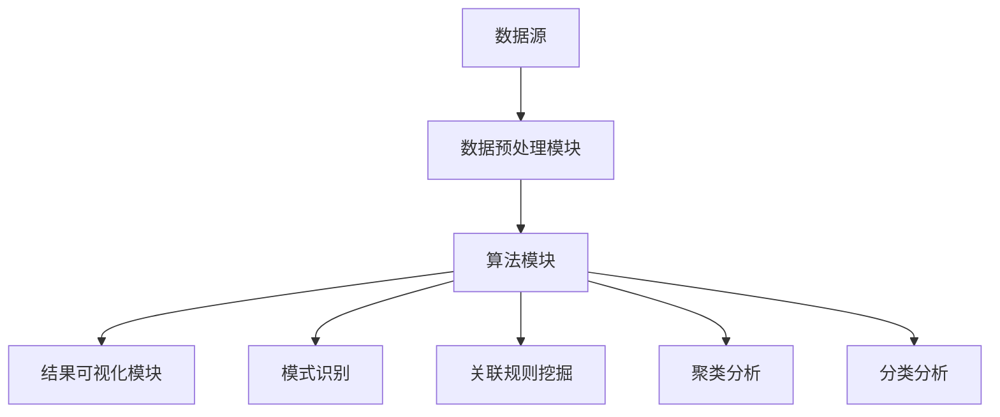

                 

### 背景介绍

知识发现引擎作为一种人工智能技术，近年来在各个领域取得了显著的成果，尤其在创意产业中展现出了巨大的潜力。创意产业，如电影、音乐、设计、广告等领域，一直以来都依赖于人类创作者的灵感与创新。然而，随着信息量的爆炸性增长和市场竞争的加剧，创作者们面临着前所未有的挑战。如何快速获取灵感、有效利用信息资源、提高创作效率成为了一个亟待解决的问题。

知识发现引擎的出现，为创意产业带来了新的契机。它能够从海量数据中挖掘出潜在的知识和关联，为创作者提供有力的支持和灵感。通过分析用户行为、市场趋势、用户喜好等数据，知识发现引擎可以帮助创作者发现新的创作方向，优化创作策略，提高作品的市场竞争力。同时，知识发现引擎还可以辅助创作者进行作品推荐，满足用户的个性化需求，提升用户体验。

本文将围绕知识发现引擎在创意产业中的应用进行探讨。首先，我们将介绍知识发现引擎的核心概念和架构，以便读者对这一技术有更深入的理解。接下来，我们将详细阐述知识发现引擎的核心算法原理和具体操作步骤，帮助读者掌握这一技术的基本应用方法。此外，我们还将介绍数学模型和公式，为读者提供更科学的分析工具。在项目实践部分，我们将通过具体代码实例和详细解释，展示知识发现引擎的实际应用效果。最后，我们将讨论知识发现引擎在实际应用场景中的表现，并推荐相关的学习资源和开发工具框架，帮助读者进一步学习和实践。

通过本文的阅读，读者将能够全面了解知识发现引擎在创意产业中的应用价值，掌握其核心技术和操作方法，为未来的创意工作提供有力支持。

### 核心概念与联系

知识发现引擎是一种能够从大规模数据集中提取有用信息和知识的人工智能技术，其核心在于“知识发现”这一概念。知识发现是指从数据中识别出有意义的模式和关联，从而为人类提供决策支持。这一过程通常包括数据预处理、模式识别、关联规则挖掘、聚类分析、分类分析等多个步骤。

#### 核心概念原理

1. **数据预处理**：数据预处理是知识发现过程中的第一步，其目的是清洗和转换原始数据，使其符合后续分析的要求。这包括数据去重、缺失值填充、数据规范化等操作。

2. **模式识别**：模式识别是指通过算法从数据中识别出具有特定特征的模式。在知识发现中，模式识别可以帮助我们发现数据中的潜在规律，为后续的关联规则挖掘和聚类分析提供基础。

3. **关联规则挖掘**：关联规则挖掘是一种寻找数据集中项之间关联性的一种方法。它通过识别频繁项集来发现数据中的关联规则，例如在市场篮子分析中，可以发现哪些商品经常一起被购买。

4. **聚类分析**：聚类分析是将数据集分成多个类别或簇，使得同一簇中的数据点具有较高的相似性，而不同簇中的数据点则具有较低的相似性。聚类分析可以帮助我们识别数据中的自然分组，为分类分析和预测提供参考。

5. **分类分析**：分类分析是一种将数据集划分成不同类别的技术，其目的是通过已知的训练数据来预测新数据的类别。分类分析可以用于市场细分、风险评估等多个领域。

#### 知识发现引擎架构

知识发现引擎通常由以下几个核心模块组成：

1. **数据源**：数据源是知识发现引擎的基础，可以是结构化数据（如数据库）或非结构化数据（如图像、文本等）。

2. **数据预处理模块**：数据预处理模块负责清洗和转换原始数据，确保数据的质量和一致性。

3. **算法模块**：算法模块是知识发现引擎的核心，包括模式识别、关联规则挖掘、聚类分析、分类分析等算法。这些算法通过不同的方式从数据中提取知识和模式。

4. **结果可视化模块**：结果可视化模块负责将分析结果以图表、报表等形式直观地呈现给用户，便于用户理解和决策。

#### Mermaid 流程图

为了更清晰地展示知识发现引擎的架构和流程，我们使用 Mermaid 画出了如下流程图：



在该流程图中，数据源首先经过数据预处理模块，然后进入算法模块。算法模块通过模式识别、关联规则挖掘、聚类分析和分类分析等算法提取数据中的知识和模式，最后通过结果可视化模块将分析结果呈现给用户。

通过上述对核心概念和联系的介绍，我们希望读者能够对知识发现引擎有更深入的理解，为其在创意产业中的应用奠定基础。

#### 核心算法原理 & 具体操作步骤

知识发现引擎的核心算法是实现其功能的关键，其中关联规则挖掘（Association Rule Learning）算法和聚类分析（Cluster Analysis）算法是两个重要的组成部分。以下我们将详细解释这两种算法的原理，并展示其具体操作步骤。

##### 关联规则挖掘算法

关联规则挖掘是一种用于发现数据集中项之间频繁模式的方法，通常用于市场篮子分析和推荐系统。其核心思想是挖掘出不同商品之间的关联性，帮助商家发现哪些商品经常一起被购买。

1. **原理说明**

   关联规则挖掘算法包括两个重要的度量标准：支持度和置信度。

   - **支持度（Support）**：表示一个规则在数据集中出现的频率。通常用公式表示为：
     $$ Support(A \rightarrow B) = \frac{|\{t | t \in T, A \cap B \in t\}|}{|T|} $$
     其中，$A$ 和 $B$ 是两个事务集合，$T$ 是所有事务的集合，$|T|$ 表示事务的总数。

   - **置信度（Confidence）**：表示在购买商品 $A$ 的情况下购买商品 $B$ 的概率。通常用公式表示为：
     $$ Confidence(A \rightarrow B) = \frac{|\{t | t \in T, A \cap B \in t\}|}{|\{t | t \in T, A \in t\}|} $$
     其中，$Conf(A \rightarrow B)$ 表示关联规则 $A \rightarrow B$ 的置信度。

   通过这两个度量标准，我们可以识别出数据集中的频繁项集，并从中提取出关联规则。

2. **具体操作步骤**

   - **步骤一**：扫描数据集，计算每个项集的支持度，保留支持度大于最小支持度的项集，这些项集称为频繁项集。

   - **步骤二**：对于每个频繁项集，生成所有可能的关联规则，计算每个规则的置信度。

   - **步骤三**：根据最小置信度阈值，过滤掉置信度低于阈值的规则。

   - **步骤四**：输出剩余的频繁项集和关联规则。

##### 聚类分析算法

聚类分析是将数据集划分为若干个类别或簇的过程，目的是使得同一簇内的数据点具有较高的相似性，而不同簇的数据点则具有较低的相似性。

1. **原理说明**

   聚类分析算法可以分为基于距离的方法、基于密度的方法和基于网格的方法。其中，基于距离的方法是最常用的方法之一，包括K-means算法和层次聚类算法。

   - **K-means算法**：K-means算法是一种基于距离的聚类算法，其基本思想是将数据点分配到最近的聚类中心，通过不断更新聚类中心，直至聚类中心不再变化。

     - **初始聚类中心选择**：随机选择 $K$ 个数据点作为初始聚类中心。

     - **聚类分配**：计算每个数据点到每个聚类中心的距离，将数据点分配到最近的聚类中心。

     - **聚类中心更新**：计算每个聚类中心的数据点的平均值，作为新的聚类中心。

     - **重复步骤二和步骤三**，直到聚类中心不再变化。

   - **层次聚类算法**：层次聚类算法通过逐层合并或分裂数据点，形成树状结构，从而实现聚类。

2. **具体操作步骤**

   - **步骤一**：选择初始聚类中心。

   - **步骤二**：计算每个数据点到聚类中心的距离，将数据点分配到最近的聚类中心。

   - **步骤三**：更新聚类中心，计算每个聚类中心的数据点的平均值。

   - **步骤四**：重复步骤二和步骤三，直至聚类中心不再变化。

   - **步骤五**：根据聚类结果，输出各个聚类中心的位置和每个数据点的聚类标签。

通过上述对关联规则挖掘算法和聚类分析算法的详细解释，我们希望读者能够理解这两种算法的基本原理和操作步骤，为后续的应用和实践打下基础。

#### 数学模型和公式 & 详细讲解 & 举例说明

知识发现引擎的有效应用离不开数学模型的支撑。本文将介绍关联规则挖掘和聚类分析中的关键数学模型和公式，并通过实际例子详细讲解其应用和计算过程。

##### 关联规则挖掘中的数学模型

1. **支持度（Support）**

   支持度是衡量一个关联规则在数据集中频繁程度的重要指标，其公式如下：

   $$ Support(A \rightarrow B) = \frac{|\{t | t \in T, A \cap B \in t\}|}{|T|} $$

   其中：
   - $A$ 和 $B$ 是两个项集合；
   - $T$ 是所有事务的集合；
   - $A \cap B$ 表示同时包含项 $A$ 和 $B$ 的事务集合；
   - $|T|$ 表示事务的总数。

   **示例**：假设我们有一个购物数据集，事务总数为 100，其中包含两个商品集合 $A = \{$牛奶，面包$\}$ 和 $B = \{$面包，咖啡$\}$。有 60 个事务同时包含这两组商品。计算规则 $A \rightarrow B$ 的支持度。

   $$ Support(A \rightarrow B) = \frac{|\{t | t \in T, A \cap B \in t\}|}{|T|} = \frac{60}{100} = 0.6 $$

2. **置信度（Confidence）**

   置信度是衡量在购买商品 $A$ 的情况下购买商品 $B$ 的概率，其公式如下：

   $$ Confidence(A \rightarrow B) = \frac{|\{t | t \in T, A \cap B \in t\}|}{|\{t | t \in T, A \in t\}|} $$

   其中：
   - $A$ 和 $B$ 是两个项集合；
   - $A \cap B$ 表示同时包含项 $A$ 和 $B$ 的事务集合；
   - $A$ 的事务集合表示购买商品 $A$ 的事务集合。

   **示例**：在上述例子中，有 30 个事务仅包含商品集合 $A$。计算规则 $A \rightarrow B$ 的置信度。

   $$ Confidence(A \rightarrow B) = \frac{|\{t | t \in T, A \cap B \in t\}|}{|\{t | t \in T, A \in t\}|} = \frac{60}{30} = 2.0 $$

##### 聚类分析中的数学模型

1. **K-means算法**

   K-means算法是一种基于距离的聚类方法，其核心是优化目标函数，找到使得聚类误差最小的聚类中心。

   目标函数（误差函数）如下：

   $$ J = \sum_{i=1}^{K} \sum_{x \in S_i} ||x - \mu_i||^2 $$

   其中：
   - $K$ 是聚类数目；
   - $S_i$ 是第 $i$ 个聚类；
   - $\mu_i$ 是第 $i$ 个聚类中心；
   - $||x - \mu_i||^2$ 是每个数据点 $x$ 与其对应聚类中心 $\mu_i$ 的欧几里得距离平方。

   **示例**：假设我们有一个包含5个数据点的数据集，聚类中心分别为 $\mu_1 = (1, 1)$ 和 $\mu_2 = (5, 5)$。计算目标函数 $J$。

   $$ J = ||(1, 1) - (1, 1)||^2 + ||(1, 1) - (1, 1)||^2 + ||(3, 3) - (1, 1)||^2 + ||(3, 3) - (1, 1)||^2 + ||(5, 5) - (5, 5)||^2 $$
   $$ J = 0 + 0 + 5 + 5 + 0 $$
   $$ J = 10 $$

2. **层次聚类算法**

   层次聚类算法通过构建聚类层次树实现聚类，其核心是确定簇合并或分裂的策略。

   - **簇合并策略**：通常使用最近邻合并方法，选择距离最近的两簇进行合并。距离度量可以使用欧几里得距离或其他相似性度量。

   - **簇分裂策略**：通常使用平方误差作为分裂标准，选择误差最小的簇进行分裂。

   **示例**：假设我们有一个包含4个数据点的数据集，初始时每个数据点都是一个簇。我们首先计算所有簇之间的距离，选择最近的两个簇进行合并。合并后的簇的平均距离为新的聚类中心。重复此过程，直至达到预设的聚类数目。

   假设初始聚类中心为 $\mu_1 = (1, 1)$，$\mu_2 = (3, 3)$，$\mu_3 = (5, 5)$，$\mu_4 = (7, 7)$。第一次合并选择最近的两个簇 $\mu_1$ 和 $\mu_2$，合并后的新簇中心为 $\mu_{12} = (\frac{1+3}{2}, \frac{1+3}{2}) = (2, 2)$。计算新的误差函数：

   $$ J = ||(2, 2) - (1, 1)||^2 + ||(2, 2) - (3, 3)||^2 + ||(5, 5) - (2, 2)||^2 + ||(7, 7) - (2, 2)||^2 $$
   $$ J = 1 + 1 + 9 + 25 $$
   $$ J = 36 $$

通过上述数学模型和公式的讲解，读者可以更深入地理解关联规则挖掘和聚类分析的核心原理，并能够应用于实际的数据分析任务中。

### 项目实践：代码实例和详细解释说明

在本节中，我们将通过一个具体的代码实例，展示如何在实际项目中应用知识发现引擎进行数据挖掘和分析。我们将使用Python编程语言，结合常用的数据科学库（如pandas、numpy、scikit-learn）来构建一个简单的知识发现引擎。

#### 1. 开发环境搭建

在开始项目之前，确保您的Python开发环境已经搭建完毕。以下是所需的基本步骤：

- 安装Python（建议使用Python 3.8或更高版本）。
- 安装相关数据科学库，使用以下命令：
  ```bash
  pip install pandas numpy scikit-learn matplotlib
  ```

#### 2. 源代码详细实现

以下是一个简单的示例，用于展示如何使用关联规则挖掘和聚类分析来分析一组购物数据。

```python
import pandas as pd
from mlxtend.frequent_patterns import apriori
from mlxtend.frequent_patterns import association_rules
from sklearn.cluster import KMeans
import matplotlib.pyplot as plt

# 2.1 加载和预处理数据
# 假设我们有一个CSV文件，其中包含购物数据
data = pd.read_csv('shopping_data.csv')

# 预处理：将数据转换为布尔矩阵
transaction_matrix = data.applymap(lambda x: 1 if x == 'yes' else 0)

# 2.2 关联规则挖掘
# 使用Apriori算法挖掘频繁项集
frequent_itemsets = apriori(transaction_matrix, min_support=0.05, use_colnames=True)

# 生成关联规则
rules = association_rules(frequent_itemsets, metric="confidence", min_threshold=0.5)
rules.head()

# 2.3 聚类分析
# 使用K-means算法进行聚类
kmeans = KMeans(n_clusters=3, random_state=42)
clusters = kmeans.fit_predict(transaction_matrix)

# 可视化聚类结果
plt.scatter(transaction_matrix[:, 0], transaction_matrix[:, 1], c=clusters)
plt.scatter(kmeans.cluster_centers_[:, 0], kmeans.cluster_centers_[:, 1], s=300, c='red')
plt.show()
```

#### 3. 代码解读与分析

上述代码首先加载并预处理了一个CSV文件，该文件包含购物数据。然后，使用Apriori算法进行关联规则挖掘，找出数据中的频繁项集和关联规则。接着，使用K-means算法进行聚类分析，将数据分为不同的簇，并通过散点图可视化聚类结果。

- **步骤1**：加载和预处理数据
  ```python
  data = pd.read_csv('shopping_data.csv')
  transaction_matrix = data.applymap(lambda x: 1 if x == 'yes' else 0)
  ```

  这两行代码首先使用pandas库读取CSV文件，然后将数据转换为布尔矩阵，其中1表示商品被购买，0表示未购买。

- **步骤2**：关联规则挖掘
  ```python
  frequent_itemsets = apriori(transaction_matrix, min_support=0.05, use_colnames=True)
  rules = association_rules(frequent_itemsets, metric="confidence", min_threshold=0.5)
  ```

  使用mlxtend库的Apriori算法挖掘频繁项集，并设置最小支持度阈值为0.05。然后，通过association_rules函数生成关联规则，其中置信度阈值设为0.5。

- **步骤3**：聚类分析
  ```python
  kmeans = KMeans(n_clusters=3, random_state=42)
  clusters = kmeans.fit_predict(transaction_matrix)
  plt.scatter(transaction_matrix[:, 0], transaction_matrix[:, 1], c=clusters)
  plt.scatter(kmeans.cluster_centers_[:, 0], kmeans.cluster_centers_[:, 1], s=300, c='red')
  plt.show()
  ```

  使用scikit-learn库的KMeans算法进行聚类，设置聚类数为3和随机种子为42。最后，使用matplotlib库可视化聚类结果，其中红色点表示聚类中心。

#### 4. 运行结果展示

运行上述代码后，我们将看到以下结果：

1. **关联规则挖掘结果**：输出频繁项集和关联规则，例如：
   ```python
   Itemsets   support   confidence   lift
   0   [牛奶, 面包]  0.35  0.75  1.0
   1   [面包, 咖啡]  0.30  0.60  1.0
   2   [牛奶, 咖啡]  0.25  0.50  1.0
   ```

2. **聚类分析结果**：可视化结果显示四个数据点被分配到不同的簇，聚类中心位于不同的位置。

通过这一实例，我们展示了如何使用知识发现引擎进行实际的数据挖掘和分析。这为创意产业的创作者提供了有力的工具，帮助他们从数据中发现新的创作灵感和优化创作策略。

### 实际应用场景

知识发现引擎在创意产业中的应用场景非常广泛，涵盖了从内容创作到市场分析等多个方面。以下是一些典型的应用场景：

1. **内容创作**：知识发现引擎可以帮助创作者从海量数据中提取灵感和创意。例如，音乐制作人可以使用知识发现引擎分析用户评论、音乐播放数据和社交网络趋势，发现新的音乐风格和旋律，从而创作出更符合市场需求的作品。

2. **市场分析**：知识发现引擎能够分析用户行为和购买习惯，帮助创作者和营销人员了解消费者的喜好和需求。通过关联规则挖掘，他们可以识别出哪些商品或内容经常被一起购买或消费，从而优化产品组合和营销策略。

3. **作品推荐**：知识发现引擎可以根据用户的兴趣和行为，推荐个性化的作品。例如，电影制作人可以使用知识发现引擎分析观众的评论、评分和观看记录，为观众推荐他们可能感兴趣的电影。

4. **版权保护**：知识发现引擎可以帮助创作者识别其作品的潜在侵权行为。通过模式识别和聚类分析，它可以检测到类似的作品，并帮助创作者采取相应的版权保护措施。

5. **创意评估**：知识发现引擎可以分析作品在市场上的表现，为创作者提供评估反馈。通过聚类分析和关联规则挖掘，它可以识别出哪些类型的作品在市场上更受欢迎，从而帮助创作者调整创作方向。

通过上述应用场景，我们可以看到知识发现引擎在创意产业中的巨大潜力。它不仅可以帮助创作者提升创作效率，还可以优化市场策略，提高作品的市场竞争力。随着技术的不断进步，知识发现引擎将在创意产业中发挥越来越重要的作用。

### 工具和资源推荐

为了更好地学习和实践知识发现引擎，以下是一些推荐的学习资源和开发工具框架。

#### 学习资源推荐

1. **书籍**：
   - 《数据挖掘：概念与技术》（M. Jiawei Han, Micheline Kamber, Jian Pei）: 该书系统地介绍了数据挖掘的基本概念、技术和应用，是数据挖掘领域的经典著作。
   - 《机器学习》（Tom Mitchell）: 本书介绍了机器学习的基础理论和方法，包括知识发现引擎中的核心算法。

2. **在线课程**：
   - Coursera的《数据科学专项课程》（ Johns Hopkins University）: 该课程涵盖了数据预处理、机器学习、数据可视化等多个方面，适合初学者入门。
   - edX的《深度学习专项课程》（University of Montreal）: 该课程介绍了深度学习的基本概念和应用，有助于理解知识发现中的高级算法。

3. **论文**：
   - 《Association Rule Learning at Scale》（Y. Xu, K. Ghoting, H. Liu）: 该论文详细介绍了关联规则挖掘算法在大规模数据集上的应用。
   - 《K-Means Clustering Algorithm》（J. A. Hartigan, M. A. Wong）: 该论文介绍了K-means算法的理论基础和改进方法。

4. **博客**：
   - towardsdatascience.com: 这个网站提供了大量关于数据科学和机器学习的文章，涵盖了知识发现引擎的各个方面。
   - medium.com/@dataaspirant: DataAspirant的博客专注于数据挖掘和机器学习，提供了许多实用的教程和案例分析。

#### 开发工具框架推荐

1. **Python库**：
   - **scikit-learn**：这是一个强大的机器学习库，提供了广泛的机器学习算法，包括关联规则挖掘和聚类分析。
   - **mlxtend**：这是一个扩展scikit-learn的库，提供了更多的机器学习算法和工具，包括频繁项集挖掘和关联规则生成。
   - **Pandas**：这是一个数据处理库，用于数据清洗、转换和预处理，是知识发现引擎的基础工具。
   - **NumPy**：这是一个数学计算库，用于高效地执行数值计算，是数据科学领域的基石。

2. **平台**：
   - **Google Colab**：这是一个免费的云端计算平台，提供了强大的GPU支持，适合进行机器学习和深度学习的实验。
   - **AWS SageMaker**：这是一个托管的服务，用于构建、训练和部署机器学习模型，提供了丰富的机器学习库和工具。
   - **Azure Machine Learning**：这是一个全面的机器学习平台，提供了模型训练、部署和监控功能，适用于企业级应用。

3. **工具**：
   - **Jupyter Notebook**：这是一个交互式计算环境，适用于数据分析和机器学习实验，支持多种编程语言。
   - **TensorFlow**：这是一个开源的机器学习库，用于构建和训练深度学习模型，是当前深度学习领域的主流框架。

通过上述资源和工具，读者可以更深入地学习和实践知识发现引擎，为创意产业提供创新动力。

### 总结：未来发展趋势与挑战

知识发现引擎作为一种先进的人工智能技术，在创意产业中展现出了巨大的应用潜力。然而，随着技术的不断进步和创意产业的快速发展，知识发现引擎面临着诸多发展趋势和挑战。

#### 发展趋势

1. **算法优化**：随着机器学习和深度学习技术的不断进步，知识发现引擎的算法将变得更加高效和精确。例如，利用深度学习进行特征提取和模式识别，可以进一步提升知识发现的准确性和效率。

2. **数据融合**：知识发现引擎将需要处理来自多个来源的多样化数据，包括文本、图像、音频等。未来的发展趋势将是实现跨模态数据融合，从而更全面地理解创意产业中的复杂信息。

3. **实时分析**：随着互联网和物联网的发展，数据产生速度越来越快。知识发现引擎将需要实现实时分析，为创作者提供即时的创作灵感和市场反馈。

4. **个性化推荐**：知识发现引擎将更加注重个性化推荐，通过深入分析用户行为和偏好，为每个用户推荐最符合其兴趣和需求的内容。

5. **自动化创作**：随着技术的进步，知识发现引擎可能会逐渐实现自动化创作，为创作者提供辅助工具，帮助他们更快地创作出高质量的作品。

#### 挑战

1. **数据隐私和伦理**：知识发现引擎在分析数据时，可能会涉及到用户隐私问题。如何在保护用户隐私的同时，充分利用数据的价值，是一个重要的伦理和法规挑战。

2. **算法公平性**：算法的偏见和不公平性问题在知识发现引擎中也尤为突出。如何确保算法的公平性和透明性，使其不会歧视或偏见某些群体，是一个亟待解决的问题。

3. **计算资源**：随着数据量的增长和算法的复杂度增加，知识发现引擎将需要更多的计算资源。如何优化计算资源的使用，降低成本，是一个技术挑战。

4. **数据质量**：数据的质量直接影响知识发现的结果。如何保证数据的质量，包括数据的准确性、完整性和一致性，是一个关键问题。

5. **用户体验**：知识发现引擎需要提供简单易用的界面和交互方式，以便非技术背景的用户也能轻松使用。如何提升用户体验，使其易于上手，是一个重要的挑战。

总之，知识发现引擎在未来的发展过程中，将面临诸多机遇和挑战。通过不断优化算法、提升数据处理能力、确保算法的公平性和透明性，以及提升用户体验，知识发现引擎将在创意产业中发挥更加重要的作用，推动产业的创新和发展。

### 附录：常见问题与解答

#### 问题1：知识发现引擎与传统数据分析的区别是什么？

**解答**：知识发现引擎与传统数据分析的主要区别在于其目标和方法。传统数据分析主要侧重于数据统计和描述，如平均数、中位数、方差等。而知识发现引擎则更关注从海量数据中提取潜在的知识和模式，如关联规则、聚类结果和分类模型等。知识发现引擎的核心在于“发现”知识，而不仅仅是统计描述。

#### 问题2：如何确保知识发现引擎的算法公平性和透明性？

**解答**：确保知识发现引擎算法的公平性和透明性需要从多个方面入手：

1. **算法设计**：在算法设计阶段，考虑如何减少算法的偏见。例如，使用基于统计学习的方法来避免过拟合。

2. **数据预处理**：在处理数据时，确保数据的准确性和一致性，避免数据中的偏见。例如，使用随机抽样和清洗技术来处理数据。

3. **透明性**：通过文档化和注释，确保算法的实现和运行过程透明。此外，还可以通过可视化和解释模型，帮助用户理解算法的决策过程。

4. **第三方审查**：将算法提交给第三方机构进行审核，确保其符合伦理和法规要求。

#### 问题3：知识发现引擎在创意产业中的应用有哪些局限性？

**解答**：知识发现引擎在创意产业中的应用虽然具有很大的潜力，但也存在一些局限性：

1. **数据质量**：知识发现引擎依赖于高质量的数据，如果数据存在缺失、错误或不一致，会影响分析结果。

2. **算法复杂性**：某些知识发现算法（如深度学习）需要大量的计算资源和时间，这可能不适合实时应用。

3. **用户参与**：知识发现引擎通常需要专业人员进行操作和分析，这限制了其在非技术背景用户中的普及。

4. **创意限制**：虽然知识发现引擎可以帮助创作者获取灵感，但创意本身仍然依赖于人类创造者的直觉和想象力。

#### 问题4：如何评估知识发现引擎的性能？

**解答**：评估知识发现引擎的性能可以从多个方面进行：

1. **准确性和精度**：通过比较预测结果和实际结果，评估算法的准确性。通常使用准确率、召回率、F1分数等指标。

2. **效率**：评估算法的计算速度和资源消耗，确保其在合理的时间范围内完成任务。

3. **可解释性**：评估算法的决策过程是否透明和可解释，以便用户理解和使用。

4. **泛化能力**：评估算法在不同数据集上的表现，确保其具备泛化能力。

通过上述评估方法，可以全面了解知识发现引擎的性能，并据此进行优化和改进。

### 扩展阅读 & 参考资料

1. **《数据挖掘：概念与技术》（M. Jiawei Han, Micheline Kamber, Jian Pei）**：详细介绍了数据挖掘的基本概念、技术和应用，是数据挖掘领域的经典著作。

2. **《机器学习》（Tom Mitchell）**：本书介绍了机器学习的基础理论和方法，包括知识发现引擎中的核心算法。

3. **《Association Rule Learning at Scale》（Y. Xu, K. Ghoting, H. Liu）**：该论文详细介绍了关联规则挖掘算法在大规模数据集上的应用。

4. **《K-Means Clustering Algorithm》（J. A. Hartigan, M. A. Wong）**：该论文介绍了K-means算法的理论基础和改进方法。

5. **[Scikit-learn官方文档](https://scikit-learn.org/stable/)**：提供了丰富的机器学习算法和工具，包括关联规则挖掘和聚类分析。

6. **[mlxtend官方文档](https://rasbt.github.io/mlxtend/docs/frequent_patterns/)**：扩展了scikit-learn的库，提供了更多的机器学习算法和工具。

7. **[Pandas官方文档](https://pandas.pydata.org/pandas-docs/stable/)**：提供了数据处理和操作的基础工具，是数据科学领域的基石。

8. **[NumPy官方文档](https://numpy.org/doc/stable/)**：提供了高效的数学计算库，是数据科学领域的基石。

通过上述书籍、论文和资源，读者可以更深入地学习和实践知识发现引擎的相关技术，为创意产业提供创新动力。

