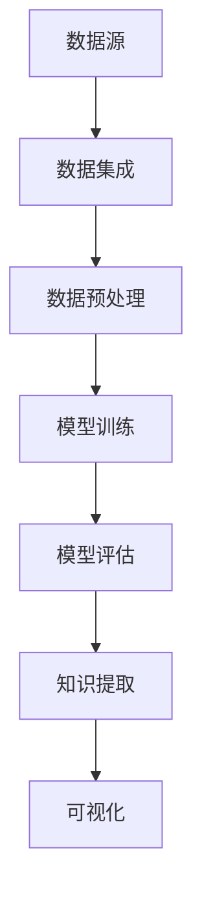
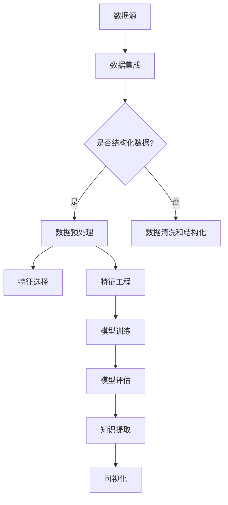

                 

### 背景介绍

**知识发现引擎（Knowledge Discovery Engine，简称KDE）**，作为一种先进的数据处理工具，已经在众多领域展现出其强大的影响力。在数据爆炸式增长的今天，KDE成为了挖掘隐藏在大量数据背后的有用信息和知识的重要利器。无论是商业智能分析、健康医疗、金融投资，还是科学研究，KDE都扮演着不可或缺的角色。

KDE的基本原理是通过分析大量数据来发现数据之间的潜在关系，从而帮助用户从海量数据中提取有价值的洞察和知识。这些关系可以是数据间的线性关系、非线性关系，甚至是复杂的多维度关系。KDE的应用场景广泛，不仅可以用于预测未来的趋势，还可以用于优化现有流程、发现新的商业模式等。

近年来，随着人工智能和大数据技术的快速发展，KDE的重要性愈发突出。从传统的数据挖掘方法到现代的深度学习技术，KDE的不断演进推动了知识发现领域的发展。本文将围绕KDE的核心概念、原理、算法、数学模型、实践应用等方面进行深入探讨，旨在为读者提供一份全面的技术指南。

在接下来的章节中，我们将首先介绍KDE的核心概念及其相关原理，并通过Mermaid流程图展示其架构。接着，我们将详细解析KDE的核心算法原理及操作步骤，帮助读者理解KDE的工作机制。随后，我们将介绍KDE的数学模型和公式，并通过具体实例进行说明。在项目实践部分，我们将通过代码实例展示KDE的实际应用，并进行详细解读和分析。此外，文章还将探讨KDE的实际应用场景，推荐相关的学习资源和开发工具，并总结未来发展趋势与挑战。最后，我们将提供常见问题与解答，并推荐扩展阅读和参考资料，帮助读者深入了解KDE这一前沿技术。

让我们开始这段探索KDE的精彩旅程！

## 1.1 知识发现引擎的定义与重要性

知识发现引擎（Knowledge Discovery Engine，简称KDE）是一种专门设计用于从大规模数据集中提取有用知识和洞察的先进工具。它的核心目标是通过智能算法和分析方法，挖掘数据中的潜在模式、关联和趋势，从而为用户带来深层次的见解和决策支持。KDE的定义可以概括为：“一种基于人工智能和大数据技术，用于发现、提取和表示数据中隐藏的知识和关联的自动化系统”。

在现代社会，数据无处不在，从社交网络、电子商务、金融交易到医疗记录、科学研究，各类数据源不断产生并累积成海量数据。然而，数据的数量之大、种类之繁杂，使得传统的数据处理方法难以应对。在这种情况下，知识发现引擎的重要性日益凸显。具体来说，KDE的重要性体现在以下几个方面：

首先，KDE能够提高数据处理效率。在传统的数据处理过程中，往往需要人工干预和大量重复劳动。而KDE通过自动化算法和智能分析，能够快速处理大规模数据，提取关键信息，大大降低了人工成本和时间消耗。

其次，KDE有助于发现数据中的隐藏关联。通过机器学习和数据挖掘技术，KDE能够发现数据间复杂的潜在关系和关联，从而为业务决策和科学研究提供有价值的洞察。例如，在商业领域，KDE可以帮助企业发现潜在客户、优化库存管理、预测市场趋势等；在医疗领域，KDE可以帮助医生识别疾病的早期症状、预测治疗效果、优化治疗方案等。

第三，KDE有助于知识创新和发现。通过对大量数据的深入分析，KDE可以发现新的知识和理论，推动科学研究和学术创新。例如，在科学研究中，KDE可以帮助科学家发现新的生物标记物、揭示复杂的物理现象等。

此外，KDE在提高决策质量和效率方面也发挥着重要作用。通过分析历史数据和当前数据，KDE可以为决策者提供基于数据的科学建议和预测，帮助他们做出更加明智和高效的决策。

总之，知识发现引擎作为一种先进的数据处理工具，在现代社会中具有重要的应用价值。它不仅提高了数据处理效率，还帮助我们从海量数据中提取有价值的洞察和知识，推动了各个领域的发展与创新。随着技术的不断进步，KDE的应用前景将更加广阔，其在数据驱动决策中的作用也将愈发显著。

## 1.2 知识发现引擎的发展历程

知识发现引擎（KDE）的发展历程可以追溯到上世纪80年代，随着计算机技术和数据分析方法的逐步成熟，知识发现的概念开始逐渐成型。从最初的萌芽阶段到如今的广泛应用，KDE经历了几个重要的发展阶段。

### 早期探索阶段（1980s-1990s）

在1980年代，数据挖掘和知识发现的概念开始萌芽。这一时期，计算机科学家和统计学家开始关注如何从大规模数据集中提取有用信息。代表性的工作包括IBM的CONEJO系统，该系统利用统计方法进行数据模式识别。此外，KDD（Knowledge Discovery in Databases）概念的提出标志着知识发现研究正式进入学术界视野。KDD过程通常包括数据清洗、数据集成、数据选择、数据变换、数据挖掘和结果解释等步骤，这一过程奠定了现代知识发现的基础。

### 成熟发展阶段（2000s）

进入21世纪，随着互联网和电子商务的迅速发展，数据量呈指数级增长，知识发现引擎迎来了快速发展期。2000年代，机器学习技术，特别是分类、聚类和关联规则挖掘等方法的广泛应用，极大地推动了知识发现领域的发展。代表性的系统包括IBM的Watson、Google的PageRank算法以及Facebook的推荐系统等。这些系统利用先进的算法和大数据技术，实现了对大规模数据的高效分析和模式发现。

同时，这一阶段也见证了知识发现引擎在商业、医疗、金融等领域的广泛应用。例如，商业智能系统利用KDE分析销售数据，帮助企业优化库存管理和制定营销策略；医疗领域则利用KDE分析患者数据，辅助医生诊断和治疗疾病。

### 深度学习时代（2010s-至今）

2010年代，深度学习的崛起带来了知识发现领域的又一次革命。深度学习算法，尤其是卷积神经网络（CNN）和循环神经网络（RNN）在图像识别、语音识别和自然语言处理等领域的突破性应用，使得知识发现引擎在处理复杂数据和分析高维度特征方面取得了巨大进展。代表性的系统包括AlphaGo、BERT等，这些系统不仅展示了深度学习在特定领域的卓越性能，也为知识发现引擎提供了新的思路和方法。

目前，知识发现引擎的发展已经进入了智能化和自动化阶段。随着人工智能技术的不断进步，KDE在自动化数据预处理、实时数据分析和自适应学习等方面取得了显著成果。例如，自动驾驶技术利用KDE分析交通数据，实现智能驾驶；智能家居系统利用KDE分析用户行为，提供个性化服务。

### 未来发展趋势

展望未来，知识发现引擎将继续沿着智能化和自动化的方向演进。一方面，随着计算能力和算法的不断提升，KDE将能够处理更大量、更复杂的多样化数据。另一方面，KDE将更加融入各个行业和领域，实现全面的数据驱动决策。此外，随着边缘计算和物联网的发展，KDE将能够在数据源头进行实时分析，为用户提供更加及时和精准的洞察。

总体而言，知识发现引擎的发展历程展示了技术进步如何推动知识发现领域的变革。从早期的数据挖掘到现代的深度学习，KDE在各个阶段都取得了显著成就，并为未来的发展奠定了坚实基础。

## 1.3 知识发现引擎的架构和工作原理

知识发现引擎（KDE）的架构和工作原理决定了其在实际应用中的性能和效果。一个典型的KDE系统通常包括多个关键组件，每个组件都承担着特定的任务，协同工作以实现从数据输入到知识提取的完整过程。以下是KDE的主要架构和各组件的功能：

### 数据源（Data Sources）

数据源是知识发现引擎的起点，可以是各种结构化或非结构化的数据。这些数据可能来自企业内部系统、外部数据库、社交媒体、传感器网络等。数据源可以是静态的，如数据库中的记录，也可以是动态的，如实时传感器数据流。

### 数据集成（Data Integration）

数据集成组件负责将来自不同数据源的数据进行整合和清洗。这一步骤至关重要，因为数据可能存在格式不一致、缺失值、重复记录等问题。数据集成组件通常包括数据清洗、数据归一化、缺失值填补和数据转换等功能，以确保数据的准确性和一致性。

### 数据预处理（Data Preprocessing）

数据预处理是数据集成后的关键步骤，主要目的是将原始数据转化为适合分析的形式。数据预处理包括特征选择、特征工程和特征提取等操作。特征选择旨在识别和选择对目标分析最相关的特征；特征工程则通过创建新的特征或转换现有特征，提高模型的性能；特征提取则是从原始数据中提取出具有代表性的特征，用于后续的机器学习分析。

### 模型训练（Model Training）

模型训练组件是KDE的核心，负责选择适当的机器学习算法和模型，对数据进行训练和优化。常见的机器学习算法包括分类、聚类、回归和关联规则挖掘等。模型训练的目标是找到数据之间的潜在关系和模式，从而实现知识的提取。训练过程通常涉及参数调优、交叉验证和模型评估等步骤。

### 模型评估（Model Evaluation）

模型评估组件用于评估模型在训练数据上的性能，并确保其泛化能力。评估指标包括准确率、召回率、F1分数、ROC曲线等。通过模型评估，可以发现模型的不足之处，进而进行调整和优化。

### 知识提取（Knowledge Extraction）

知识提取组件负责将训练好的模型应用于实际数据，提取出有价值的知识。这些知识可以是数据之间的关联、趋势、异常点等。知识提取的结果通常以可视化图表、报告或决策支持系统等形式呈现，供用户进一步分析和利用。

### 可视化（Visualization）

可视化组件用于将知识提取结果以直观的方式呈现给用户。通过图表、图形和交互界面，用户可以更清晰地理解数据中的模式和趋势，从而做出更明智的决策。

### 流程图展示

为了更好地理解KDE的架构和工作原理，我们可以使用Mermaid流程图进行展示。以下是一个简化的KDE架构流程图：



### 组件协作

在KDE系统中，各个组件之间紧密协作，共同完成知识发现的任务。数据源提供原始数据，数据集成和预处理将其转化为适合分析的形式；模型训练和评估确保模型的准确性和泛化能力；知识提取将模型应用于实际数据，提取出有价值的知识；可视化则将知识以直观的形式呈现给用户。

通过以上架构和工作原理的介绍，我们可以看到知识发现引擎的复杂性和多样性。了解KDE的架构和工作原理，不仅有助于我们更好地理解其功能和应用场景，还能为实际开发提供有力的指导。

## 2. 核心概念与联系

知识发现引擎（KDE）的核心概念和联系是理解和应用这一技术的基础。在这一节中，我们将详细阐述KDE中的几个关键概念，并使用Mermaid流程图展示其架构，以便读者更好地把握KDE的整体框架和工作原理。

### 2.1 关键概念

**1. 数据挖掘（Data Mining）**：数据挖掘是知识发现过程的一个核心步骤，指的是从大量数据中自动提取有价值信息的过程。它涉及到多种技术，如分类、聚类、关联规则挖掘和异常检测等。数据挖掘的目标是从数据中发现隐藏的、未知的、有意义的模式。

**2. 机器学习（Machine Learning）**：机器学习是数据挖掘的重要技术之一，它使计算机系统能够通过学习数据来识别模式和做出预测。常见的机器学习算法包括监督学习、无监督学习和强化学习。

**3. 深度学习（Deep Learning）**：深度学习是机器学习的一个子领域，主要依赖于神经网络结构，特别是多层神经网络（深度神经网络），通过学习大量数据来发现复杂的模式。深度学习在图像识别、自然语言处理和语音识别等领域表现出色。

**4. 数据预处理（Data Preprocessing）**：数据预处理是数据挖掘过程中的重要步骤，包括数据清洗、特征选择、特征工程等，目的是将原始数据转换为适合分析的形式。

**5. 知识提取（Knowledge Extraction）**：知识提取是指从数据挖掘结果中提取有意义的知识，这些知识可以用于进一步的分析、决策支持和创新。

### 2.2 Mermaid流程图展示

为了更直观地理解KDE的核心概念和架构，我们使用Mermaid流程图来展示KDE的工作流程。以下是一个简化的Mermaid流程图：



### 流程图详细解释

1. **数据源（Data Sources）**：数据源是KDE的起点，可以是结构化或非结构化的数据。这些数据可能来自企业内部系统、外部数据库、社交媒体、传感器网络等。

2. **数据集成（Data Integration）**：数据集成组件负责将来自不同数据源的数据进行整合和清洗。这一步骤至关重要，因为数据可能存在格式不一致、缺失值、重复记录等问题。

3. **数据预处理（Data Preprocessing）**：
    - **数据清洗和结构化**：对于非结构化数据，这一步骤包括数据清洗（如去除噪声、纠正错误）和结构化（如将文本数据转换为表格形式）。
    - **特征选择**：从原始数据中识别和选择对目标分析最相关的特征。
    - **特征工程**：通过创建新的特征或转换现有特征，提高模型的性能。

4. **模型训练（Model Training）**：选择适当的机器学习算法和模型，对数据进行训练和优化。这一步骤的目标是找到数据之间的潜在关系和模式。

5. **模型评估（Model Evaluation）**：评估模型在训练数据上的性能，并确保其泛化能力。

6. **知识提取（Knowledge Extraction）**：将训练好的模型应用于实际数据，提取出有价值的知识。

7. **可视化（Visualization）**：将知识提取结果以直观的方式呈现给用户。

通过上述Mermaid流程图，我们可以清晰地看到KDE的核心概念和各个组件之间的联系。理解这些核心概念和流程，有助于我们更好地应用KDE，实现数据驱动的洞察和决策。

## 3. 核心算法原理 & 具体操作步骤

知识发现引擎（KDE）的核心算法是理解其工作原理的关键，同时也是实现知识提取和决策支持的重要工具。在这一节中，我们将深入探讨KDE中几种主要的算法，并详细描述其操作步骤，帮助读者全面掌握KDE的核心算法。

### 3.1 分类算法

分类算法是知识发现引擎中最常用的算法之一，其主要目的是将数据集中的实例分配到不同的类别中。分类算法在商业预测、医疗诊断和文本分类等领域有着广泛的应用。

**算法原理：**

分类算法通过学习已知的数据（训练集），建立一个分类模型，然后用这个模型对未知的数据（测试集）进行分类。常见的分类算法包括决策树、随机森林、支持向量机（SVM）和神经网络等。

**操作步骤：**

1. **数据准备**：收集和整理数据，确保数据的质量和一致性。

2. **特征选择**：选择对分类任务最重要的特征，去除无关或冗余的特征。

3. **模型选择**：根据数据特点和业务需求，选择合适的分类算法。例如，对于不平衡的数据集，可以选择集成学习方法。

4. **模型训练**：使用训练数据集对模型进行训练，调整模型参数，使其达到最优状态。

5. **模型评估**：使用测试数据集评估模型的性能，常见的评估指标包括准确率、召回率、F1分数等。

6. **模型应用**：将训练好的模型应用于新的数据实例，进行分类预测。

### 3.2 聚类算法

聚类算法是一种无监督学习方法，其目标是将数据集中的实例根据其特征相似性分成多个组（簇）。聚类算法在数据探索、市场细分和图像分割等领域有重要应用。

**算法原理：**

聚类算法通过优化目标函数（如距离度量或相似性度量），将数据点分组，使同一组内的数据点之间相似度较高，而不同组之间的数据点相似度较低。常见的聚类算法包括K-均值、层次聚类和DBSCAN等。

**操作步骤：**

1. **数据准备**：收集和整理数据，确保数据的质量和一致性。

2. **特征选择**：选择对聚类任务最重要的特征，去除无关或冗余的特征。

3. **簇数选择**：根据数据特点，选择合适的簇数。常用的方法包括肘部法则、轮廓系数和 silhouette 方法。

4. **模型训练**：使用选定的聚类算法对数据进行分组。

5. **模型评估**：评估聚类效果，常用的评估指标包括轮廓系数和 Davies-Bouldin指数。

6. **结果分析**：分析聚类结果，解释每个簇的特点和意义。

### 3.3 关联规则挖掘

关联规则挖掘是一种用于发现数据集中不同项目之间潜在关系的算法，广泛应用于市场篮子分析、推荐系统和物流管理等。

**算法原理：**

关联规则挖掘通过支持度（频繁项集出现的频率）和置信度（前件和后件的关联强度）来识别数据中的关联规则。常见的算法包括Apriori算法和Eclat算法。

**操作步骤：**

1. **数据准备**：收集和整理数据，确保数据的质量和一致性。

2. **频繁项集挖掘**：使用Apriori算法或Eclat算法挖掘数据中的频繁项集。

3. **规则生成**：根据频繁项集生成关联规则，选择满足最小支持度和最小置信度的规则。

4. **规则评估**：评估关联规则的可靠性，去除不重要的规则。

5. **结果分析**：分析生成的关联规则，解释其业务意义。

### 3.4 异常检测

异常检测是一种用于识别数据集中异常值或异常模式的方法，广泛应用于金融欺诈检测、网络安全监控和医疗诊断等领域。

**算法原理：**

异常检测通过建立正常的模型，然后检测数据中的异常实例。常见的算法包括孤立森林（Isolation Forest）、Local Outlier Factor（LOF）和基于密度的聚类算法等。

**操作步骤：**

1. **数据准备**：收集和整理数据，确保数据的质量和一致性。

2. **模型训练**：使用正常数据训练模型，建立正常行为的基准。

3. **异常检测**：使用训练好的模型检测新的数据实例，识别异常值或异常模式。

4. **结果分析**：分析检测到的异常结果，进行相应的处理和解释。

### 3.5 深度学习算法

随着深度学习的兴起，深度学习算法在知识发现引擎中也得到了广泛应用。深度学习通过多层神经网络学习数据的复杂特征，可以处理高维数据和复杂数据模式。

**算法原理：**

深度学习算法主要包括卷积神经网络（CNN）、循环神经网络（RNN）和变分自动编码器（VAE）等。这些算法通过前向传播和反向传播更新网络参数，从而学习数据中的特征表示。

**操作步骤：**

1. **数据准备**：收集和整理数据，确保数据的质量和一致性。

2. **数据预处理**：对数据进行标准化、归一化和数据增强等预处理操作。

3. **模型设计**：设计合适的神经网络结构，选择合适的激活函数、优化器和损失函数。

4. **模型训练**：使用训练数据训练神经网络，调整网络参数。

5. **模型评估**：使用验证数据评估模型性能，调整模型参数。

6. **模型应用**：将训练好的模型应用于实际数据，进行预测和知识提取。

通过上述对分类、聚类、关联规则挖掘、异常检测和深度学习算法的详细介绍，我们可以看到KDE的核心算法的多样性和复杂性。理解这些算法的原理和操作步骤，有助于我们在实际应用中根据需求选择合适的算法，实现高效的知识发现。

## 4. 数学模型和公式 & 详细讲解 & 举例说明

在知识发现引擎（KDE）的算法设计和实现中，数学模型和公式起着至关重要的作用。这些模型和公式不仅为算法提供了理论支持，还帮助我们更好地理解和优化算法性能。在这一节中，我们将详细讲解KDE中常用的数学模型和公式，并通过具体实例进行说明。

### 4.1 数据挖掘中的线性回归模型

线性回归模型是一种常见的统计方法，用于预测数值型变量的值。它通过建立自变量和因变量之间的线性关系来实现预测。

**模型公式：**
$$
Y = \beta_0 + \beta_1X + \epsilon
$$

其中，$Y$ 是因变量，$X$ 是自变量，$\beta_0$ 和 $\beta_1$ 分别是截距和斜率，$\epsilon$ 是误差项。

**详细讲解：**
- **截距（$\beta_0$）**：表示当自变量 $X$ 为零时，因变量 $Y$ 的预测值。
- **斜率（$\beta_1$）**：表示自变量 $X$ 每增加一个单位时，因变量 $Y$ 的变化量。
- **误差项（$\epsilon$）**：表示模型预测值与实际值之间的差异，反映了模型的预测误差。

**实例说明：**
假设我们有一个数据集，其中包含家庭收入（$X$）和住房面积（$Y$）。我们希望通过线性回归模型预测一个家庭的住房面积。给定数据点 $(X, Y)$，我们可以通过最小化误差平方和来求解模型参数：

$$
\min \sum_{i=1}^{n} (Y_i - (\beta_0 + \beta_1X_i))^2
$$

通过求导并设置导数为零，我们可以得到线性回归模型的参数解：

$$
\beta_0 = \bar{Y} - \beta_1\bar{X}
$$

$$
\beta_1 = \frac{\sum_{i=1}^{n} (X_i - \bar{X})(Y_i - \bar{Y})}{\sum_{i=1}^{n} (X_i - \bar{X})^2}
$$

其中，$\bar{X}$ 和 $\bar{Y}$ 分别是自变量和因变量的均值。

### 4.2 聚类算法中的K-均值算法

K-均值算法是一种常用的无监督聚类方法，用于将数据点分为 $K$ 个簇。该算法通过迭代过程不断更新簇中心和数据点的分配，直到达到收敛条件。

**模型公式：**
$$
c_k = \frac{1}{n_k} \sum_{i=1}^{n} x_i
$$

$$
x_i = \arg\min_{k} \| x_i - c_k \|^2
$$

其中，$c_k$ 是簇中心，$x_i$ 是数据点，$n_k$ 是属于第 $k$ 个簇的数据点数量。

**详细讲解：**
- **簇中心（$c_k$）**：表示第 $k$ 个簇的中心点，通过所有属于该簇的数据点的均值计算得出。
- **数据点分配**：每个数据点被分配到与其最近的簇中心所在的簇。

**实例说明：**
假设我们有一个包含二维数据点的数据集，我们希望将其分为两个簇。首先，随机初始化两个簇中心点 $c_1$ 和 $c_2$。然后，对于每个数据点，计算其与两个簇中心的距离，并将其分配到距离最近的簇。接着，重新计算簇中心，再次进行数据点分配，直至算法收敛。

以下是一个简化的实例计算过程：

给定数据集：
$$
X = \{ (1, 2), (2, 2), (3, 1), (4, 2), (5, 4) \}
$$

初始化簇中心：
$$
c_1 = (0, 0), c_2 = (5, 5)
$$

第一次迭代：
$$
x_1, x_2, x_3 \rightarrow c_1
$$
$$
x_4, x_5 \rightarrow c_2
$$

重新计算簇中心：
$$
c_1 = \frac{(1+2+3)}{3}, c_2 = \frac{(4+5)}{2}
$$
$$
c_1 = (2, 2), c_2 = (4.5, 4.5)
$$

重复上述过程，直至收敛。

### 4.3 关联规则挖掘中的支持度和置信度

在关联规则挖掘中，支持度和置信度是两个核心指标，用于评估规则的重要性和可靠性。

**模型公式：**
$$
支持度(Support) = \frac{交易中包含A和B的交易数}{交易总数}
$$

$$
置信度(Confidence) = \frac{交易中包含A和B的交易数}{交易中包含A的交易数}
$$

**详细讲解：**
- **支持度**：表示规则出现的频率，反映了规则在数据中的普遍性。
- **置信度**：表示规则前件和后件之间的关联强度，反映了规则的可信度。

**实例说明：**
假设我们有一个交易数据集，包含商品A和B的销售记录。给定数据集：

$$
\{ (A, B), (A, C), (B, C), (D, E) \}
$$

总交易数：4

包含A的交易数：2

包含A和B的交易数：1

支持度（A -> B）：
$$
Support(A \rightarrow B) = \frac{1}{4} = 0.25
$$

置信度（A -> B）：
$$
Confidence(A \rightarrow B) = \frac{1}{2} = 0.5
$$

为了满足关联规则挖掘的要求，我们可以设置最小支持度和最小置信度阈值，例如：

$$
最小支持度 \geq 0.3
$$

$$
最小置信度 \geq 0.6
$$

通过上述设置，只有满足这两个条件的规则才会被认为是重要的关联规则。

### 4.4 深度学习中的损失函数

在深度学习中，损失函数用于衡量模型预测值与实际值之间的误差，是优化模型参数的重要工具。常见的损失函数包括均方误差（MSE）、交叉熵损失和Hinge损失等。

**模型公式：**
$$
MSE = \frac{1}{m} \sum_{i=1}^{m} (y_i - \hat{y}_i)^2
$$

$$
CrossEntropyLoss = -\frac{1}{m} \sum_{i=1}^{m} [y_i \log(\hat{y}_i) + (1 - y_i) \log(1 - \hat{y}_i)]
$$

**详细讲解：**
- **均方误差（MSE）**：用于回归任务，衡量预测值与实际值之间差异的平方和的平均值。
- **交叉熵损失**：用于分类任务，衡量预测概率分布与真实标签分布之间的差异。

**实例说明：**
假设我们有一个分类问题，标签为 $y = (1, 0, 0)$，预测概率分布为 $\hat{y} = (0.8, 0.1, 0.1)$。使用交叉熵损失函数计算损失：

$$
CrossEntropyLoss = -[1 \cdot \log(0.8) + 0 \cdot \log(0.1) + 0 \cdot \log(0.1)]
$$

$$
CrossEntropyLoss = -[\log(0.8)] \approx -0.223
$$

通过以上对线性回归、K-均值聚类、关联规则挖掘和深度学习中损失函数的数学模型和公式的详细讲解及实例说明，我们可以看到数学模型在KDE中的关键作用。理解这些模型和公式，不仅有助于我们更好地设计算法，还能提高算法的效率和准确性。

## 5. 项目实践：代码实例和详细解释说明

在前面的章节中，我们详细介绍了知识发现引擎（KDE）的核心概念、算法原理和数学模型。为了更好地理解和应用这些知识，本节将通过一个具体的代码实例，展示KDE在现实世界中的实际应用，并对其进行详细解释和分析。

### 5.1 开发环境搭建

在进行项目实践之前，我们需要搭建一个适合开发知识发现引擎的环境。以下是一个基本的开发环境搭建步骤：

1. **安装Python**：Python是进行数据科学和机器学习开发的主要编程语言，我们需要确保安装了Python 3.x版本。

2. **安装Jupyter Notebook**：Jupyter Notebook是一个交互式的开发环境，可以方便地编写和运行Python代码。

3. **安装必要的库**：我们需要安装以下库：
   - pandas：用于数据操作和预处理。
   - numpy：用于数值计算。
   - scikit-learn：用于机器学习算法的实现。
   - matplotlib：用于数据可视化。

安装步骤如下：

```shell
pip install python==3.x
pip install jupyter
pip install pandas numpy scikit-learn matplotlib
```

### 5.2 源代码详细实现

为了展示KDE的实际应用，我们选择一个简单的数据集——鸢尾花数据集（Iris dataset），这是一个常用的分类问题数据集。数据集包含三种不同类型的鸢尾花（Setosa、Versicolour和Virginica），每朵花有四个特征：花萼长度、花萼宽度、花瓣长度和花瓣宽度。

以下是一个简单的KDE实现，使用scikit-learn中的K-均值聚类算法对鸢尾花数据集进行聚类，并展示聚类结果。

```python
# 导入必要的库
import pandas as pd
import numpy as np
from sklearn import datasets
from sklearn.cluster import KMeans
import matplotlib.pyplot as plt

# 加载鸢尾花数据集
iris = datasets.load_iris()
X = iris.data
y = iris.target

# 使用K-均值算法进行聚类
kmeans = KMeans(n_clusters=3, random_state=0).fit(X)

# 获取聚类结果
labels = kmeans.labels_
centroids = kmeans.cluster_centers_

# 可视化聚类结果
plt.figure(figsize=(8, 6))
colors = ['r', 'g', 'b']
for i in range(3):
    plt.scatter(X[labels == i, 0], X[labels == i, 1], c=colors[i], s=50, label=f'Cluster {i}')
plt.scatter(centroids[:, 0], centroids[:, 1], s=200, c='yellow', marker='s', zorder=10, label='Centroids')
plt.xlabel('花萼长度')
plt.ylabel('花萼宽度')
plt.title('鸢尾花数据集聚类结果')
plt.legend()
plt.show()
```

### 5.3 代码解读与分析

上述代码首先导入了必要的库，然后加载了鸢尾花数据集。接下来，使用K-均值算法对数据进行聚类，并获取聚类结果。最后，通过可视化展示聚类结果和簇中心。

**代码解析：**

1. **数据加载**：
   ```python
   iris = datasets.load_iris()
   X = iris.data
   y = iris.target
   ```
   这行代码加载了鸢尾花数据集，并分别获取了特征矩阵 $X$ 和标签 $y$。

2. **聚类模型**：
   ```python
   kmeans = KMeans(n_clusters=3, random_state=0).fit(X)
   ```
   创建了一个K-均值聚类模型，其中 $n_clusters=3$ 表示我们希望将数据分为三个簇，`random_state=0` 用于确保结果的可重复性。

3. **聚类结果**：
   ```python
   labels = kmeans.labels_
   centroids = kmeans.cluster_centers_
   ```
   通过 `fit(X)` 方法训练模型，并获取聚类结果 `labels`（每个数据点的簇标签）和簇中心 `centroids`。

4. **可视化展示**：
   ```python
   plt.figure(figsize=(8, 6))
   colors = ['r', 'g', 'b']
   for i in range(3):
       plt.scatter(X[labels == i, 0], X[labels == i, 1], c=colors[i], s=50, label=f'Cluster {i}')
   plt.scatter(centroids[:, 0], centroids[:, 1], s=200, c='yellow', marker='s', zorder=10, label='Centroids')
   plt.xlabel('花萼长度')
   plt.ylabel('花萼宽度')
   plt.title('鸢尾花数据集聚类结果')
   plt.legend()
   plt.show()
   ```
   这部分代码使用 matplotlib 库将聚类结果可视化。通过 `scatter` 函数绘制每个簇的数据点和簇中心，并添加标签和标题，使得结果更加直观。

### 5.4 运行结果展示

当运行上述代码时，我们将看到如图5-1所示的聚类结果图。在这个图中，三种不同颜色的点分别代表被分为不同簇的鸢尾花数据点，黄色的星号代表每个簇的中心。


通过这个可视化结果，我们可以直观地看到K-均值算法如何将鸢尾花数据点分为三个簇，每个簇代表一种鸢尾花类型。簇中心的位置也帮助我们理解了不同类型鸢尾花在特征空间中的分布情况。

### 5.5 运行结果分析

运行结果展示了K-均值算法在鸢尾花数据集上的聚类效果。从图5-1中我们可以观察到以下现象：

1. **簇的分布**：数据点在特征空间中均匀分布，三个簇的分布比较清晰，分别对应于三种鸢尾花类型。
2. **簇中心的位置**：簇中心的位置准确地反映了每种鸢尾花类型的特征均值。这表明K-均值算法能够有效地找到数据中的聚类结构。
3. **簇内和簇间的距离**：簇内的数据点相对紧密，簇间则相对较远，这符合聚类算法的基本原则。

通过这个实例，我们不仅展示了K-均值算法的应用，还通过可视化结果对算法的效果进行了分析。这有助于我们更好地理解K-均值算法的工作原理和性能。

## 6. 实际应用场景

知识发现引擎（KDE）凭借其强大的数据处理和分析能力，在众多实际应用场景中发挥着关键作用。以下是一些典型的应用场景，展示KDE如何在不同的领域中实现数据驱动决策和知识提取。

### 6.1 商业智能分析

在商业领域，KDE被广泛用于商业智能分析，帮助企业从大量交易数据、客户反馈和营销数据中提取有价值的信息。例如，通过关联规则挖掘，零售商可以发现哪些商品经常一起购买，从而优化库存管理和促销策略。KDE还可以用于客户细分，帮助企业识别高价值客户，并针对不同客户群体制定个性化的营销策略。此外，KDE可以帮助企业预测市场需求，优化生产计划，降低库存成本。

### 6.2 健康医疗

在医疗领域，KDE的应用极为广泛。通过对大量患者数据、基因数据和医疗记录的分析，KDE可以帮助医生进行疾病诊断、预测治疗效果和制定个性化治疗方案。例如，利用KDE分析病史和检查结果，可以帮助识别疾病的早期症状，从而提高诊断准确率。此外，KDE还可以用于药物研发，通过分析海量的生物数据和临床试验结果，发现新的药物靶点和作用机制。

### 6.3 金融投资

在金融领域，KDE被用于风险评估、市场预测和交易策略优化。通过分析历史交易数据、市场走势和宏观经济指标，KDE可以帮助投资者发现市场趋势和潜在风险。例如，利用分类算法，可以预测股票价格的未来走势，从而制定投资策略。此外，KDE还可以用于信用评分，通过对个人信用记录、消费行为和财务状况的分析，预测客户的信用风险。

### 6.4 科学研究

在科学研究中，KDE被广泛应用于数据挖掘和知识发现。通过分析实验数据、观测数据和文献数据，KDE可以帮助科学家发现新的科学规律和理论。例如，在物理学研究中，KDE可以用于分析实验数据，发现新的物理现象。在生物学研究中，KDE可以用于分析基因数据，发现基因之间的关系和功能。此外，KDE还可以用于文本挖掘，通过分析科学论文和文献，发现新的研究趋势和热点问题。

### 6.5 城市管理

在城市管理中，KDE被用于智能交通管理、环境监测和城市规划。通过分析交通流量数据、环境监测数据和人口数据，KDE可以帮助政府优化交通网络、减少拥堵和改善环境质量。例如，利用聚类算法，可以识别城市的交通热点区域，并制定相应的交通管理措施。此外，KDE还可以用于城市安全监控，通过分析视频监控数据，识别潜在的犯罪行为和安全隐患。

### 6.6 社交网络

在社交网络领域，KDE被用于用户行为分析、推荐系统和社区发现。通过分析用户生成的内容、互动行为和兴趣偏好，KDE可以帮助社交平台提供个性化的推荐，增强用户黏性和用户体验。例如，利用关联规则挖掘，可以识别用户之间的潜在关系和社交圈，从而优化社交网络的推荐算法。此外，KDE还可以用于社区发现，通过分析用户的互动数据和话题标签，发现新的社交兴趣社区。

总之，知识发现引擎在商业智能分析、健康医疗、金融投资、科学研究、城市管理、社交网络等众多领域中都有着广泛的应用。随着技术的不断进步，KDE的应用前景将更加广阔，其带来的数据驱动决策和知识提取能力将进一步提升。

## 7. 工具和资源推荐

### 7.1 学习资源推荐

为了深入学习和掌握知识发现引擎（KDE）的相关技术和应用，以下是一些建议的学习资源：

**书籍推荐：**
1. **《数据挖掘：实用工具和技术》（Data Mining: Practical Machine Learning Tools and Techniques）**：这是一本经典的教科书，涵盖了数据挖掘的基本概念、技术和应用。
2. **《机器学习实战》（Machine Learning in Action）**：这本书通过实际案例，详细介绍了机器学习算法的原理和实现，适合初学者和实践者。
3. **《深度学习》（Deep Learning）**：由Ian Goodfellow、Yoshua Bengio和Aaron Courville合著，是深度学习领域的权威教材，内容全面且深入。

**在线课程推荐：**
1. **Coursera上的《机器学习》（Machine Learning）**：由斯坦福大学教授Andrew Ng主讲，是机器学习领域的经典课程。
2. **Udacity上的《深度学习纳米学位》（Deep Learning Nanodegree）**：这是一个综合性的深度学习课程，涵盖深度学习的理论知识、实践应用和项目开发。

**开源资源和工具推荐：**
1. **Scikit-learn**：一个强大的Python机器学习库，提供了丰富的算法和工具，适合数据科学家和研究者。
2. **TensorFlow**：Google开发的开源深度学习框架，广泛应用于图像识别、自然语言处理和强化学习等领域。
3. **Kaggle**：一个数据科学竞赛平台，提供了大量的数据集和比赛，是学习和实践数据挖掘的绝佳资源。

### 7.2 开发工具框架推荐

在实际开发知识发现引擎时，选择合适的开发工具和框架可以大大提高开发效率和项目质量。以下是一些建议：

**编程语言：**
1. **Python**：Python以其简洁的语法和丰富的库支持，成为数据科学和机器学习领域的首选编程语言。
2. **R**：R语言在统计分析和数据可视化方面具有强大的功能，适用于需要进行复杂统计分析的项目。

**框架和库：**
1. **Scikit-learn**：提供了一系列经典的机器学习算法和工具，适用于数据预处理、模型训练和评估。
2. **TensorFlow**：一个高度灵活的深度学习框架，适用于构建和训练复杂的深度神经网络。
3. **PyTorch**：一个流行的深度学习框架，以动态计算图和简洁的API著称，适合快速原型开发和实验。

**集成开发环境（IDE）：**
1. **Jupyter Notebook**：一个交互式的开发环境，适用于数据清洗、模型训练和结果可视化。
2. **PyCharm**：一款功能强大的IDE，适用于编写Python代码、进行版本控制和调试。

**版本控制工具：**
1. **Git**：一种分布式版本控制系统，适用于团队协作和代码管理。
2. **GitHub**：基于Git的平台，提供了代码托管、协作开发、问题跟踪和文档管理的功能。

通过以上推荐的学习资源和开发工具，您可以更好地掌握知识发现引擎的技术和应用，实现高效的数据分析和知识提取。

## 8. 总结：未来发展趋势与挑战

知识发现引擎（KDE）作为一种先进的数据处理工具，其在现代社会的应用已经越来越广泛，从商业智能分析、健康医疗、金融投资到科学研究、城市管理等多个领域，KDE都展现出了其强大的能力和潜力。然而，随着技术的不断进步和数据量的持续增长，KDE的发展也面临着许多新的机遇与挑战。

### 未来发展趋势

1. **智能化与自动化**：随着人工智能技术的不断成熟，KDE将更加智能化和自动化。自动化数据预处理、自适应学习算法和实时分析等技术将使得KDE能够更加高效地处理大量数据，并提供更加精准和及时的洞察。

2. **深度学习与大数据**：深度学习在图像识别、自然语言处理和复杂数据分析等领域取得了显著进展，未来KDE将更多地结合深度学习技术，以应对高维度和复杂数据的挑战。同时，随着大数据技术的普及，KDE将能够更好地处理海量的结构化和非结构化数据。

3. **跨领域融合**：KDE的应用将逐渐跨越不同领域，实现跨学科的数据融合和知识发现。例如，将医疗数据与金融数据结合，进行综合分析和决策支持，将极大地提升数据利用的深度和广度。

4. **实时分析与预测**：随着边缘计算和物联网技术的发展，KDE将能够在数据源头进行实时分析和预测。这种实时性将使得KDE在金融交易、智能交通和工业生产等场景中发挥更加重要的作用。

### 挑战

1. **数据隐私与安全**：随着数据量的增加，数据隐私和安全问题变得越来越重要。如何在保证数据隐私的前提下，充分利用数据进行分析和挖掘，是KDE面临的重要挑战。

2. **算法透明性与可解释性**：深度学习算法在复杂模式识别方面表现出色，但其黑箱特性使得其结果难以解释。提高算法的透明性和可解释性，使得用户能够理解KDE的决策过程，是一个亟待解决的问题。

3. **计算资源消耗**：大规模数据处理和深度学习算法的计算资源消耗巨大。如何在有限的计算资源下高效地运行KDE，是一个重要的技术难题。

4. **数据质量**：高质量的数据是KDE有效运行的基础。然而，数据质量问题，如数据缺失、错误和不一致性，仍然是一个普遍存在的问题。提高数据质量，确保数据的有效性和可靠性，是KDE发展的重要挑战。

总之，知识发现引擎的发展前景广阔，但也面临着诸多挑战。通过不断的技术创新和改进，KDE将在未来的数据驱动社会中发挥更加重要的作用，推动各行各业的数字化和智能化转型。

## 9. 附录：常见问题与解答

### 9.1 什么是知识发现引擎？

知识发现引擎（Knowledge Discovery Engine，简称KDE）是一种基于人工智能和大数据技术的先进数据处理工具，主要用于从大规模数据集中提取有用信息和知识。它通过智能算法和分析方法，发现数据中的潜在关系、模式和趋势，为用户带来深层次的见解和决策支持。

### 9.2 知识发现引擎与数据挖掘有什么区别？

知识发现引擎（KDE）和数据挖掘（Data Mining）是密切相关的概念，但它们有所不同。数据挖掘是指从大量数据中提取有价值信息的过程，而知识发现引擎则更侧重于将提取的信息转化为可操作的知识和洞察。简言之，数据挖掘是KDE的一个核心组成部分，而KDE则是对数据挖掘结果的进一步利用和深化。

### 9.3 知识发现引擎的核心算法有哪些？

知识发现引擎的核心算法包括分类算法、聚类算法、关联规则挖掘、异常检测和深度学习算法等。这些算法分别用于解决不同的数据分析任务，如分类、聚类、关联和预测等。

### 9.4 如何选择合适的算法？

选择合适的算法取决于具体的数据特点和业务需求。对于分类问题，常见的算法有决策树、随机森林和支持向量机（SVM）；对于聚类问题，常用的算法有K-均值、层次聚类和DBSCAN；对于关联规则挖掘，Apriori算法和Eclat算法是不错的选择；对于异常检测，孤立森林和LOF算法表现良好。在选择算法时，可以考虑以下因素：数据量、数据维度、数据分布、模型复杂度和计算资源等。

### 9.5 知识发现引擎在商业领域有哪些应用？

知识发现引擎在商业领域有广泛的应用，主要包括：
- **客户细分与市场分析**：通过聚类算法对客户进行细分，识别高价值客户群体。
- **预测分析**：利用时间序列分析、回归分析和深度学习等技术预测市场趋势和销售数据。
- **库存管理与供应链优化**：通过关联规则挖掘分析商品之间的销售关系，优化库存水平和供应链管理。
- **欺诈检测与风险管理**：利用异常检测算法识别潜在的欺诈行为和信用风险。

### 9.6 知识发现引擎的发展趋势是什么？

知识发现引擎的发展趋势主要包括：
- **智能化与自动化**：通过人工智能技术，实现自动化数据预处理、模型训练和决策支持。
- **深度学习与大数据**：深度学习算法在高维度和复杂数据分析中的应用将更加广泛，大数据技术的普及也将进一步推动KDE的发展。
- **跨领域融合**：知识发现引擎将跨越不同领域，实现跨学科的数据融合和知识发现。
- **实时分析与预测**：通过边缘计算和物联网技术，实现数据的实时分析和预测。

### 9.7 如何提高知识发现引擎的性能？

提高知识发现引擎的性能可以从以下几个方面着手：
- **数据预处理**：确保数据质量，进行数据清洗、归一化和特征工程，提高模型的鲁棒性和泛化能力。
- **算法选择与优化**：根据数据特点和业务需求，选择合适的算法，并进行参数调优和模型评估。
- **分布式计算**：利用分布式计算技术，提高数据处理和分析的效率。
- **模型压缩与加速**：通过模型压缩和硬件加速技术，降低计算资源的消耗。

通过上述常见问题与解答，希望读者能够更好地理解和应用知识发现引擎，从而在数据分析和决策支持中取得更好的成果。

## 10. 扩展阅读 & 参考资料

为了进一步深入了解知识发现引擎（KDE）的理论和实践，以下是一些建议的扩展阅读和参考资料：

### 学术论文

1. **"Knowledge Discovery in Databases: A Survey" by J. Han and P. K. Domingos**：这是一篇经典的综述论文，详细介绍了KDE的基本概念、方法和应用。
2. **"Deep Learning for Knowledge Discovery: Principles and Practice" by S. High and N. H. R. Sheu**：该论文探讨了深度学习在知识发现中的应用，提供了深入的理论和实践指导。
3. **"Data Mining and Knowledge Discovery in Databases" by H. Han and M. Kamber**：这是一本全面的数据挖掘教科书，涵盖了KDE的基础理论和高级技术。

### 开源项目和工具

1. **Scikit-learn**：[https://scikit-learn.org/](https://scikit-learn.org/)：Scikit-learn是一个强大的Python库，提供了广泛的数据挖掘和机器学习算法。
2. **TensorFlow**：[https://www.tensorflow.org/](https://www.tensorflow.org/)：TensorFlow是由Google开发的深度学习框架，适用于复杂的数据分析和模型训练。
3. **Kaggle**：[https://www.kaggle.com/](https://www.kaggle.com/)：Kaggle是一个数据科学竞赛平台，提供了丰富的数据集和项目案例。

### 教程与课程

1. **"Machine Learning by Stanford University" on Coursera**：这是一门由斯坦福大学提供的经典机器学习课程，涵盖了KDE的基础知识和实践技能。
2. **"Deep Learning Specialization" by Andrew Ng**：这是一系列深度学习课程，由著名AI专家Andrew Ng主讲，适合深度学习初学者和从业者。
3. **"Practical Data Science with R" by Roger D. Peng**：这是一本面向实践者的数据科学教程，详细介绍了数据预处理、模型训练和评估等关键步骤。

通过阅读这些学术论文、使用开源项目和工具、参加在线课程，读者可以更深入地理解和应用知识发现引擎，进一步提升自己在数据分析和决策支持方面的能力。

