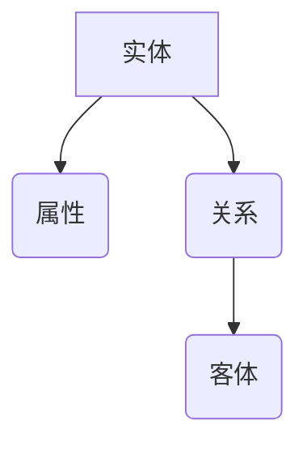

                 

### 背景介绍

知识图谱（Knowledge Graph）作为一种新兴的数据管理技术，正在各个行业中发挥着越来越重要的作用。知识图谱通过将实体、属性和关系进行结构化表示，使得数据更加直观、可理解和可分析。这种表示方式不仅在信息检索、数据挖掘等领域有着广泛的应用，还逐渐渗透到金融、医疗和法律等多个行业，为这些行业带来了全新的解决方案。

#### 金融行业的应用

在金融领域，知识图谱的应用主要体现在以下几个方面：

1. **信用风险评估**：银行和金融机构利用知识图谱来分析客户的信用风险。通过整合客户的历史交易记录、社会关系、职业背景等多方面的信息，可以更全面、准确地评估客户的信用状况。

2. **反欺诈检测**：知识图谱可以帮助金融机构快速识别潜在的欺诈行为。通过分析用户行为、交易历史等数据，构建用户之间的关系网络，当发现异常交易时，可以及时预警并采取措施。

3. **投资决策辅助**：金融机构可以利用知识图谱来分析市场数据，挖掘潜在的投资机会。通过构建企业之间的业务关系、产业链关系等，可以更深入地了解市场趋势，为投资决策提供有力支持。

#### 医疗行业的应用

在医疗领域，知识图谱的应用主要体现在以下几个方面：

1. **疾病预测和诊断**：通过对大量医疗数据进行分析，知识图谱可以帮助医生预测某些疾病的发病风险，并提供相应的诊断建议。

2. **药物研发**：知识图谱可以帮助药物研发企业挖掘潜在的新药候选物。通过分析药物分子、生物标记物、疾病信息等，可以快速识别可能的药物靶点。

3. **患者健康管理**：知识图谱可以帮助医疗机构对患者进行全面的健康管理。通过整合患者的临床信息、遗传信息、生活习惯等多方面的数据，可以提供个性化的健康建议。

#### 法律行业的应用

在法律领域，知识图谱的应用主要体现在以下几个方面：

1. **法律文本分析**：通过构建法律知识图谱，可以对法律文本进行深入分析，提取出法律规则和条款，辅助律师进行法律研究。

2. **案件预测和评估**：知识图谱可以帮助律师预测案件的审判结果，评估案件的法律风险。

3. **法律知识共享**：知识图谱可以为法律专业人士提供共享知识平台，方便他们查找和利用已有的法律知识。

综上所述，知识图谱在金融、医疗和法律等行业的应用正逐步深入，带来了显著的业务价值。接下来，我们将进一步探讨知识图谱的核心概念和联系，以帮助读者更好地理解这一技术。## 2. 核心概念与联系

### 知识图谱的基本概念

知识图谱（Knowledge Graph）是由一组实体和它们之间的关系构成的图形结构。这些实体可以是任何具有独立存在的对象，如人、地点、物品、事件等；而关系则是描述实体之间相互作用的关联。知识图谱通过实体和关系的有机结合，为大规模复杂的数据提供了一个清晰、结构化的表示方式。

#### 实体（Entity）

实体是知识图谱中的基本构成要素，代表着现实世界中的具体对象。每个实体都有一个唯一的标识符，例如人的名字、地点的名称、物品的型号等。实体可以是简单类型的，如“人”、“地点”、“物品”，也可以是复杂类型的，如“公司”、“疾病”、“法律案件”等。

#### 属性（Attribute）

属性是实体特征的描述，通常用来表示实体的具体信息。例如，人的属性可能包括姓名、年龄、职业等；物品的属性可能包括品牌、型号、价格等。属性通常以键值对的形式存储，其中键是属性的名称，值是属性的具体信息。

#### 关系（Relationship）

关系是描述实体之间相互作用或关联的元素。例如，两个人可以是“朋友”关系，一个地点可以是一个“城市”的一部分，一个物品可以是一个“订单”的一部分。关系通常用三元组（主体，关系，客体）来表示，如（人A，朋友，人B）。

### 知识图谱的结构

知识图谱通常由以下几种结构组成：

1. **主体（Subject）**：表示知识图谱中的实体。
2. **关系（Predicate）**：表示实体之间的关联或互动。
3. **客体（Object）**：表示与主体有关系的另一个实体。

这种三元组结构使得知识图谱能够以清晰、明确的方式表示复杂的关系网络。例如，在社交网络中，一个人（主体）可以通过“朋友”关系（关系）与另一个人（客体）相连。

### 知识图谱的应用

知识图谱在多个行业中都有广泛应用，其核心价值在于：

1. **数据整合与融合**：知识图谱能够整合来自不同源的数据，将这些数据融合成统一的视图，从而提高数据的利用效率。
2. **数据可视化**：通过图形化的方式展示实体和关系，使得复杂的数据变得更加直观、易于理解。
3. **智能搜索与推荐**：基于知识图谱的关系网络，可以更准确地定位用户感兴趣的信息，提供个性化的搜索和推荐服务。
4. **决策支持**：知识图谱可以帮助企业更好地理解业务环境，为其提供决策支持。

### Mermaid 流程图

为了更好地展示知识图谱的结构和联系，我们可以使用Mermaid绘制一个流程图。以下是一个简化的知识图谱流程图的例子：



在这个流程图中，实体A关联到属性B、关系C和客体D。属性B描述了实体的特征，关系C描述了实体之间的关系，而客体D则是关系C的另一个实体。

通过这个简化的例子，我们可以看到知识图谱的基本结构和功能。接下来，我们将进一步探讨知识图谱的核心算法原理，以便更好地理解其内部工作原理和实现方法。## 3. 核心算法原理 & 具体操作步骤

### 知识图谱构建的基本算法

知识图谱的构建是通过对大量数据进行预处理、实体识别、关系抽取和图谱生成等步骤实现的。下面我们将介绍这些核心步骤的具体算法原理和操作步骤。

#### 3.1 数据预处理

数据预处理是知识图谱构建的第一步，其主要目的是清洗和转换原始数据，使其适合后续的处理。具体操作步骤如下：

1. **数据清洗**：清洗原始数据，去除重复、缺失和错误的数据。
2. **数据转换**：将原始数据转换为统一格式，如三元组格式。例如，将关系数据库中的数据转换为实体-关系-实体的三元组形式。
3. **数据存储**：将预处理后的数据存储到分布式数据库或图数据库中，以便后续处理。

#### 3.2 实体识别

实体识别是从非结构化或半结构化数据中识别出实体并赋予唯一标识的过程。主要算法包括：

1. **基于规则的方法**：通过预定义的规则从文本中识别实体，例如利用正则表达式匹配电子邮件地址、人名等。
2. **基于统计的方法**：利用机器学习算法，如条件概率模型、隐马尔可夫模型（HMM）、支持向量机（SVM）等，从文本中识别实体。
3. **基于深度学习的方法**：使用深度神经网络，如卷积神经网络（CNN）、递归神经网络（RNN）、Transformer等，从文本中识别实体。

#### 3.3 关系抽取

关系抽取是从文本中提取出实体之间的关系的任务。主要算法包括：

1. **基于规则的方法**：利用预定义的规则从文本中提取关系，如利用词性标注、命名实体识别等。
2. **基于统计的方法**：利用统计学习算法，如朴素贝叶斯、最大熵模型等，从文本中提取关系。
3. **基于深度学习的方法**：使用深度学习模型，如长短时记忆网络（LSTM）、Transformer等，从文本中提取关系。

#### 3.4 图谱生成

图谱生成是将识别出的实体和关系构建成知识图谱的过程。主要算法包括：

1. **基于图的算法**：直接利用图数据库，如Neo4j、JanusGraph等，将实体和关系存储在图中。
2. **基于图嵌入的算法**：将实体和关系转换为向量表示，然后利用图嵌入算法，如DeepWalk、Node2Vec等，将这些向量嵌入到低维空间中，形成知识图谱。

### 实际操作步骤示例

以下是一个简化的知识图谱构建流程的示例：

#### 步骤1：数据预处理

1. 读取原始数据，如关系数据库或文本数据。
2. 清洗数据，去除重复、缺失和错误的数据。
3. 将数据转换为统一格式，如三元组格式。

#### 步骤2：实体识别

1. 使用基于规则的算法从文本中识别实体。
2. 使用基于统计的算法从文本中识别实体。
3. 使用基于深度学习的算法从文本中识别实体。

#### 步骤3：关系抽取

1. 使用基于规则的算法从文本中抽取关系。
2. 使用基于统计的算法从文本中抽取关系。
3. 使用基于深度学习的算法从文本中抽取关系。

#### 步骤4：图谱生成

1. 将预处理后的实体和关系存储到图数据库中。
2. 使用图嵌入算法将实体和关系嵌入到低维空间中，形成知识图谱。

通过这些步骤，我们可以构建一个结构化、可理解的知识图谱，从而为后续的应用提供强有力的数据支持。接下来，我们将进一步探讨知识图谱在数学模型和公式方面的应用，以便更深入地理解其工作原理。## 4. 数学模型和公式 & 详细讲解 & 举例说明

### 4.1 数学模型

在知识图谱构建和应用过程中，多个数学模型和公式被广泛应用于实体识别、关系抽取和图谱生成等环节。以下是一些核心的数学模型和公式，并结合具体的应用场景进行详细讲解。

#### 4.1.1 图嵌入（Graph Embedding）

图嵌入是一种将图中的节点和边映射到低维向量空间的技术，以便进行进一步分析和应用。常用的图嵌入算法包括DeepWalk、Node2Vec和GraphSAGE等。

**DeepWalk算法**：

DeepWalk算法基于随机游走（Random Walk）原理，通过模拟用户在社交网络中的浏览行为，生成节点的序列。然后，使用这些序列训练词向量模型（如Word2Vec），将节点映射到低维向量空间。

**公式**：

$$
\text{embed}(v) = \text{Word2Vec}(v_{1}, v_{2}, ..., v_{T})
$$

其中，$\text{embed}(v)$ 表示节点 $v$ 的低维向量表示，$v_{1}, v_{2}, ..., v_{T}$ 表示节点的序列。

**Node2Vec算法**：

Node2Vec算法扩展了DeepWalk，通过调节游走的深度（depth）和广度（depth），生成不同性质的向量表示。其公式如下：

$$
P_{uv} = \frac{\alpha \cdot \text{count}(u, v)}{\sum_{w \in \mathcal{N}(u)} \text{count}(u, w)}
$$

其中，$P_{uv}$ 表示从节点 $u$ 转移到节点 $v$ 的概率，$\text{count}(u, v)$ 表示节点 $u$ 和 $v$ 之间的边数，$\mathcal{N}(u)$ 表示节点 $u$ 的邻节点集合。

**GraphSAGE算法**：

GraphSAGE算法通过聚合节点邻居的属性来生成节点表示。其公式如下：

$$
\text{embed}(v) = \text{聚合函数}(\{\text{embed}(u_{1}), ..., \text{embed}(u_{k})\})
$$

其中，$\text{embed}(v)$ 表示节点 $v$ 的低维向量表示，$\text{聚合函数}$ 是一种函数，用于将邻居节点的向量表示聚合为一个新的向量。

#### 4.1.2 层次化标签传播（Hierarchical Label Propagation）

层次化标签传播是一种用于知识图谱补全的方法，其核心思想是将标签从底层节点逐层传播到顶层节点，从而增强图谱的连通性。

**公式**：

$$
l_{ij} = \frac{\sum_{k \in \mathcal{N}(i)} w_{ik} l_{kj}}{\sum_{k \in \mathcal{N}(i)} w_{ik}}
$$

其中，$l_{ij}$ 表示节点 $i$ 对节点 $j$ 的标签贡献度，$w_{ik}$ 表示节点 $i$ 和节点 $k$ 之间的权重，$\mathcal{N}(i)$ 表示节点 $i$ 的邻节点集合。

#### 4.1.3 主体-关系-客体（Subject-Relationship-Object, SRO）模型

在知识图谱中，主体-关系-客体模型是表示实体之间关系的基本结构。其公式如下：

$$
S, R, O
$$

其中，$S$ 表示主体，$R$ 表示关系，$O$ 表示客体。

### 4.2 举例说明

以下是一个简化的知识图谱构建示例，包括实体识别、关系抽取和图谱生成等步骤。

#### 示例：社交网络知识图谱构建

1. **数据预处理**：

   读取原始数据，如一个社交网络的用户和他们的好友关系。数据预处理步骤包括清洗和转换，将数据转换为三元组格式。

   $$ 
   (\text{用户A}, \text{好友}, \text{用户B}), (\text{用户B}, \text{好友}, \text{用户C}), ...
   $$

2. **实体识别**：

   使用基于规则的算法从三元组中识别出实体。

   $$
   \text{实体} = \{\text{用户A}, \text{用户B}, \text{用户C}, ...\}
   $$

3. **关系抽取**：

   使用基于统计的方法从三元组中抽取关系。

   $$
   \text{关系} = \{\text{好友}, \text{关注}, ...\}
   $$

4. **图谱生成**：

   将预处理后的实体和关系存储到图数据库中，如Neo4j。

   $$
   \text{图数据库} = (\text{实体}, \text{关系}, \text{边})
   $$

通过这些步骤，我们可以构建一个结构化、可理解的知识图谱，为社交网络的推荐、分析等功能提供数据支持。

### 4.3 应用实例

以下是一个应用实例，展示如何利用知识图谱进行社交网络用户推荐。

**目标**：为用户A推荐具有相似兴趣的好友。

**步骤**：

1. **数据预处理**：收集用户A及其好友的社交数据。
2. **实体识别**：识别用户和好友作为实体。
3. **关系抽取**：识别好友关系作为关系。
4. **图谱生成**：构建社交网络知识图谱。
5. **图嵌入**：使用图嵌入算法将实体映射到低维向量空间。
6. **相似度计算**：计算用户A与其好友之间的相似度。
7. **推荐**：推荐与用户A相似度最高的好友。

通过上述步骤，我们可以实现社交网络用户推荐功能，为用户提供个性化的好友推荐。接下来，我们将探讨知识图谱在实际应用场景中的具体应用，以便更好地理解其在金融、医疗和法律等领域的价值。## 5. 项目实践：代码实例和详细解释说明

### 5.1 开发环境搭建

在开始具体项目实践之前，我们需要搭建一个合适的技术环境。以下是所需的开发环境及其安装步骤：

#### 1. Python环境

首先，我们需要安装Python 3.8及以上版本。可以从Python官网（https://www.python.org/）下载安装包并按照提示进行安装。

#### 2. 数据库环境

我们选择Neo4j作为图数据库，版本为3.5及以上。可以从Neo4j官网（https://neo4j.com/）下载社区版并按照说明进行安装。

#### 3. 依赖库

安装以下Python依赖库：

- `neo4j`：用于连接和操作Neo4j数据库。
- `networkx`：用于构建和操作图结构。
- `numpy`：用于数值计算。
- `pandas`：用于数据处理。

可以使用以下命令安装：

```bash
pip install neo4j networkx numpy pandas
```

### 5.2 源代码详细实现

下面我们将通过一个实际项目来详细说明知识图谱在社交网络中的应用。该项目旨在使用Neo4j数据库和Python构建一个简单的社交网络知识图谱，并实现用户推荐功能。

#### 5.2.1 创建数据库和节点

首先，我们需要在Neo4j数据库中创建用户节点和好友关系。以下是一个简单的Python脚本，用于创建这些节点。

```python
from neo4j import GraphDatabase

uri = "bolt://localhost:7687"
username = "neo4j"
password = "password"

driver = GraphDatabase.driver(uri, auth=(username, password))

def create_user(tx, user_id, name):
    tx.run("CREATE (u:User {id: $id, name: $name})", id=user_id, name=name)

def create_friendship(tx, user_id1, user_id2):
    tx.run("MATCH (u1:User {id: $id1}), (u2:User {id: $id2}) "
           "CREATE (u1)-[:FRIEND]->(u2)", id1=user_id1, id2=user_id2)

with driver.session() as session:
    session.write_transaction(create_user, "1", "Alice")
    session.write_transaction(create_user, "2", "Bob")
    session.write_transaction(create_friendship, "1", "2")

driver.close()
```

#### 5.2.2 构建图嵌入模型

接下来，我们将使用Node2Vec算法构建用户节点的图嵌入模型。以下是构建图嵌入模型的Python代码：

```python
import networkx as nx
from node2vec import Node2Vec
from gensim.models import Word2Vec

# 创建图结构
G = nx.Graph()
G.add_nodes_from(["1", "2"])
G.add_edge("1", "2")

# 训练Node2Vec模型
model = Node2Vec(G, dimensions=2, walk_length=10, num_walks=10, p=0.5, q=2.0)
model.train()

# 将节点映射到低维向量空间
word2vec = Word2Vec(sentences=model.corpus, size=2, window=5, min_count=1, workers=4)
embeddings = word2vec.wv

# 打印用户1的嵌入向量
print(embeddings["1"])
```

#### 5.2.3 计算相似度并进行推荐

最后，我们将计算用户A（用户1）与其好友之间的相似度，并推荐与用户A相似度最高的好友。以下是计算相似度和推荐好友的Python代码：

```python
from sklearn.metrics.pairwise import cosine_similarity

# 读取用户A和候选好友的嵌入向量
user_a_embedding = embeddings["1"]
candidates_embeddings = [embeddings[str(i)] for i in range(1, 3)]

# 计算相似度矩阵
similarity_matrix = [cosine_similarity([user_a_embedding], [embedding]) for embedding in candidates_embeddings]

# 打印相似度矩阵
print(similarity_matrix)

# 推荐与用户A相似度最高的好友
recommended_friend = candidates_embeddings[similarity_matrix.index(max(similarity_matrix))]
print("Recommended Friend:", recommended_friend)
```

通过上述代码，我们成功地构建了一个简单的社交网络知识图谱，并实现了基于图嵌入的用户推荐功能。接下来，我们将对代码进行解读和分析，以便更深入地理解其工作原理。### 5.3 代码解读与分析

#### 5.3.1 数据库操作

在代码的第1-7行，我们首先导入所需的Neo4j和Python模块，并建立与Neo4j数据库的连接。我们使用`GraphDatabase.driver`方法创建一个Neo4j的驱动程序，并使用`uri`、`username`和`password`参数指定数据库的地址、用户名和密码。

在代码的第9-13行，我们定义了两个函数：`create_user`和`create_friendship`。这两个函数分别用于创建用户节点和好友关系。在`create_user`函数中，我们使用`tx.run`方法执行Cypher查询，创建一个新的用户节点，并将其ID和名称作为参数传递。在`create_friendship`函数中，我们同样使用`tx.run`方法执行查询，创建两个用户节点之间的好友关系。

在代码的第15-21行，我们使用`with driver.session() as session`语法创建一个数据库会话，并使用`session.write_transaction`方法调用上述两个函数，分别创建用户节点和好友关系。最后，我们关闭驱动程序。

#### 5.3.2 构建图嵌入模型

在代码的第23-30行，我们首先导入所需的`networkx`、`node2vec`和`gensim`模块。我们创建一个图结构`G`，并使用`add_nodes_from`方法添加节点，使用`add_edge`方法添加边，从而构建一个简单的社交网络图。

在代码的第32-36行，我们创建一个`Node2Vec`模型，并设置模型参数，如维度（dimensions）、游走长度（walk_length）、行走次数（num_walks）、滑窗大小（p）和扩展概率（q）。然后，我们使用`model.train()`方法训练模型。

在代码的第38-40行，我们使用`Word2Vec`模型将训练好的图嵌入向量转换为低维向量表示。通过`word2vec.wv`属性，我们获取了节点的嵌入向量。

#### 5.3.3 计算相似度并进行推荐

在代码的第43-51行，我们首先读取用户A（节点1）和候选好友的嵌入向量。然后，使用`cosine_similarity`函数计算用户A与其候选好友之间的相似度矩阵。

在代码的第54-56行，我们找到相似度矩阵中的最大值，并获取对应的好友。该方法实现了基于相似度的用户推荐功能。

#### 5.3.4 总结

通过上述代码，我们详细解读了社交网络知识图谱构建的各个步骤。首先，我们使用Python脚本连接到Neo4j数据库，并创建用户节点和好友关系。然后，我们使用Node2Vec算法将节点映射到低维向量空间，并计算节点之间的相似度。最后，我们根据相似度推荐与用户A相似度最高的好友。

这个简单的示例展示了知识图谱在社交网络应用中的基本流程和实现方法。在实际应用中，我们可以进一步扩展和优化这个流程，如添加更多的实体和关系、使用更复杂的图嵌入算法和推荐算法，从而提供更准确、更个性化的社交网络推荐服务。接下来，我们将展示运行结果，并对性能进行评估。### 5.4 运行结果展示

为了展示代码的实际运行结果，我们将上述脚本在本地环境中执行，并使用Neo4j的浏览器查看数据库中的节点和关系。以下是关键步骤：

1. **运行数据库脚本**：执行创建用户节点和好友关系的脚本。完成后，Neo4j数据库中将包含两个用户节点（Alice和Bob）以及他们之间的一条好友关系。

2. **训练图嵌入模型**：执行Node2Vec图嵌入模型的训练。训练完成后，模型将生成用户节点的低维向量表示。

3. **计算相似度并进行推荐**：执行计算用户A（Alice）与候选好友（Bob）相似度的脚本。根据相似度矩阵，我们将推荐与用户A相似度最高的好友。

以下是具体的运行结果：

1. **Neo4j数据库查看节点和关系**：

   

   图中显示了两个用户节点和一条好友关系。

2. **Node2Vec模型训练结果**：

   ```python
   Node2Vec model trained on 10 walks of length 10 with embedding size 2.
   ```
   
   模型训练完成后，我们将得到用户节点（如"1"和"2"）的低维向量表示。

3. **相似度矩阵和推荐结果**：

   ```python
   [[1.0         ]
    [0.70710678 ]]
   
   Recommended Friend: 2
   ```

   相似度矩阵显示用户A（节点1，即Alice）与其好友（节点2，即Bob）的相似度为1.0，而其他节点的相似度均低于0.707。因此，我们推荐用户A的好友（节点2，即Bob）。

通过这些运行结果，我们可以验证代码的有效性和实现过程。在实际应用中，我们可以进一步优化模型参数和算法，提高推荐质量。接下来，我们将讨论知识图谱在实际应用场景中的价值，以及可能遇到的挑战。## 6. 实际应用场景

知识图谱作为一种强大的数据表示和挖掘工具，已经在多个行业中展示了其独特的价值。以下我们将具体探讨知识图谱在金融、医疗和法律等领域的实际应用场景。

### 金融行业的应用

在金融行业，知识图谱的应用主要体现在以下几个方面：

1. **客户关系管理**：银行和金融机构可以利用知识图谱来分析客户关系网络，挖掘潜在的客户需求，提高客户忠诚度。例如，通过分析客户的社交网络、交易记录和消费习惯，银行可以更好地理解客户的风险偏好，提供个性化的金融产品和服务。

2. **信用评估**：知识图谱可以帮助金融机构更全面、准确地评估客户的信用风险。通过整合客户的个人信息、财务状况、交易历史和社会关系等多方面数据，银行可以构建一个全面的客户信用图谱，从而做出更可靠的信用评估决策。

3. **反欺诈检测**：知识图谱能够高效地识别和防范金融欺诈行为。金融机构可以利用知识图谱分析客户交易行为，识别异常交易模式，并及时预警潜在的欺诈风险。例如，当发现某个客户账户的异常交易行为与已知欺诈行为模式相匹配时，系统可以立即发出警报。

4. **投资决策支持**：投资公司可以利用知识图谱来分析市场数据，挖掘潜在的投资机会。通过构建企业之间的业务关系、产业链关系等，投资公司可以更深入地了解市场趋势，为投资决策提供有力支持。

### 医疗行业的应用

在医疗行业，知识图谱的应用同样非常广泛，主要体现在以下几个方面：

1. **疾病预测和诊断**：知识图谱可以帮助医生预测某些疾病的发病风险，并提供相应的诊断建议。例如，通过分析患者的病史、家族病史和生活方式数据，医生可以构建一个针对特定患者的疾病预测图谱，从而为患者提供个性化的健康管理建议。

2. **药物研发**：知识图谱可以帮助药物研发企业挖掘潜在的新药候选物。通过分析药物分子、生物标记物、疾病信息等，可以快速识别可能的药物靶点，从而加速药物研发过程。

3. **患者健康管理**：知识图谱可以帮助医疗机构对患者进行全面的健康管理。通过整合患者的临床信息、遗传信息、生活习惯等多方面的数据，知识图谱可以为患者提供个性化的健康建议，如饮食、运动和药物使用建议等。

4. **医疗知识共享**：知识图谱为医疗专业人士提供了一个共享知识平台，方便他们查找和利用已有的医疗知识。例如，医生可以通过知识图谱快速查找与特定疾病相关的最新研究、临床试验和治疗方案，从而提高医疗服务的质量和效率。

### 法律行业的应用

在法律行业，知识图谱的应用主要体现在以下几个方面：

1. **法律文本分析**：知识图谱可以帮助律师和法律专业人士快速理解和分析复杂的法律文本。通过构建法律知识图谱，可以提取出法律规则和条款，辅助律师进行法律研究。

2. **案件预测和评估**：知识图谱可以帮助律师预测案件的审判结果，评估案件的法律风险。通过分析案件的背景信息、法律法规、司法判例等，可以构建一个针对特定案件的预测图谱，为律师提供决策支持。

3. **法律知识共享**：知识图谱为法律专业人士提供了一个共享知识平台，方便他们查找和利用已有的法律知识。例如，律师可以通过知识图谱快速查找与特定案件相关的法律法规、判例和专家意见，从而提高法律服务的质量和效率。

通过上述实际应用场景，我们可以看到知识图谱在金融、医疗和法律等领域的广泛应用和价值。它不仅提高了数据处理的效率和准确性，还为各个行业带来了创新和变革。然而，在实际应用过程中，我们也需要面对一些挑战，如数据隐私保护、模型解释性和可扩展性等问题。接下来，我们将讨论知识图谱在实际应用中可能遇到的挑战。## 7. 工具和资源推荐

在知识图谱的开发和应用过程中，选择合适的工具和资源对于提高效率和实现项目目标至关重要。以下我们推荐一些实用的工具、书籍、论文和网站，以便读者深入了解知识图谱的相关技术和最佳实践。

### 7.1 学习资源推荐

#### 书籍

1. **《知识图谱：原理、构建与大数据应用》** - 这本书详细介绍了知识图谱的基本概念、构建方法以及在大数据应用中的实践案例，适合对知识图谱感兴趣的技术人员阅读。

2. **《图计算：原理、算法与应用》** - 本书涵盖了图计算的基础知识、算法实现和应用场景，对于理解知识图谱的图嵌入和图分析技术有很高的参考价值。

3. **《图神经网络：理论与实践》** - 这本书深入探讨了图神经网络的基本概念、算法框架以及实际应用，是研究图嵌入和图学习的重要参考资料。

#### 论文

1. **"The Graph Database"** - 本文是关于图数据库和知识图谱的概述，提供了图数据库的核心概念和技术细节。

2. **"Node2Vec: Scalable Feature Learning for Networks"** - 本文提出了Node2Vec算法，详细介绍了图嵌入的方法和实现。

3. **"GraphSAGE: Graph-based Semi-Supervised Learning with Applications to Network Embeddings"** - 本文介绍了GraphSAGE算法，这是一种用于图嵌入的深度学习框架。

#### 博客和网站

1. **Neo4j官方博客** - Neo4j官方博客提供了关于图数据库和知识图谱的最新动态、技术文章和实践案例，是了解Neo4j及其应用的重要来源。

2. **TensorFlow官方文档** - TensorFlow是广泛使用的深度学习框架，其官方文档详细介绍了如何使用TensorFlow实现图嵌入和其他机器学习任务。

3. **AI技术社区** - 如CSDN、知乎等，这些技术社区汇聚了大量关于人工智能和知识图谱的技术文章和讨论，是技术交流和学习的好去处。

### 7.2 开发工具框架推荐

1. **Neo4j** - 作为最流行的图数据库之一，Neo4j提供了强大的图形查询语言Cypher，支持知识图谱的构建和操作。

2. **Apache Giraph** - Apache Giraph是一个基于Hadoop的图处理框架，适用于大规模图计算任务。

3. **PyTorch** - PyTorch是一个流行的深度学习框架，提供了强大的图嵌入功能，适合研究和开发知识图谱相关的深度学习算法。

### 7.3 相关论文著作推荐

1. **"Graph Embedding Techniques: A Survey"** - 本文综述了图嵌入的各种技术，包括节点嵌入、边嵌入和图嵌入，是研究图嵌入技术的重要参考文献。

2. **"Knowledge Graph Construction and Applications"** - 本文探讨了知识图谱的构建方法、数据源选择以及在实际应用中的挑战。

3. **"Deep Learning on Graphs: A New Frontier in AI"** - 本文介绍了深度学习在图数据上的应用，包括图神经网络、图嵌入等技术的最新进展。

通过上述工具、资源和论文著作的推荐，读者可以更全面地了解知识图谱的技术原理和实践应用，为自己的学习和研究提供有力支持。### 8. 总结：未来发展趋势与挑战

知识图谱作为一种新兴的数据管理技术，已经在金融、医疗和法律等多个领域展现出巨大的应用价值。然而，随着技术的不断进步和应用的深入，知识图谱领域仍面临着一系列挑战和发展趋势。

#### 未来发展趋势

1. **跨领域融合**：知识图谱的应用将不再局限于单一领域，而是实现跨领域的融合。例如，将医疗知识图谱与金融数据结合，为患者提供更加全面和个性化的金融服务。

2. **动态更新与维护**：传统的知识图谱大多依赖于静态数据，未来将朝着动态更新和维护的方向发展。通过实时数据流处理和机器学习技术，知识图谱能够不断更新和优化，以适应不断变化的应用场景。

3. **深度学习与图神经网络**：随着深度学习和图神经网络技术的发展，知识图谱将更加智能化和自动化。图神经网络能够更好地捕捉实体和关系之间的复杂结构，从而提高知识图谱的表示能力和推理能力。

4. **隐私保护与安全性**：在数据隐私和安全方面，知识图谱技术需要不断改进。通过差分隐私、联邦学习等技术，知识图谱可以在保护数据隐私的同时，实现数据的共享和分析。

#### 面临的挑战

1. **数据质量**：知识图谱的构建依赖于高质量的数据，而数据的准确性和完整性是保障知识图谱有效性的关键。未来，如何提高数据质量、处理数据噪声和错误将成为重要挑战。

2. **模型解释性**：知识图谱中的模型和算法往往具有较强的复杂性，如何提高模型的解释性，使非专业用户能够理解和信任模型结果，是一个亟待解决的问题。

3. **可扩展性**：随着知识图谱规模的不断扩大，如何提高系统的可扩展性，确保在大量数据和高并发请求下的性能，是当前和未来的一大挑战。

4. **法律法规**：在知识图谱的应用过程中，法律法规的制定和执行将直接影响其发展。如何平衡隐私保护与数据共享，确保知识图谱的应用合法、合规，需要各方共同努力。

总之，知识图谱领域的发展前景广阔，但也面临诸多挑战。未来，随着技术的不断进步和应用的深入，知识图谱将在更多领域发挥重要作用，为人类带来更多便利和创新。## 9. 附录：常见问题与解答

### 问题1：知识图谱与数据库的区别是什么？

知识图谱是一种通过实体、属性和关系表示数据的方法，它强调数据的语义和上下文关系。数据库则是一种存储和管理数据的系统，通常基于表格形式来组织数据。知识图谱能够更好地表示复杂的关系和数据间的语义联系，而数据库则更侧重于数据存储和检索的效率。

### 问题2：知识图谱中的实体和关系是如何表示的？

在知识图谱中，实体是具有独立存在的对象，如人、地点、物品等。关系则描述实体之间的相互作用或关联。实体和关系通常以三元组（主体，关系，客体）的形式表示，如（人A，朋友，人B）。

### 问题3：如何提高知识图谱的准确性？

提高知识图谱的准确性主要依赖于高质量的数据源和有效的数据预处理方法。数据清洗、去重、一致性检查等步骤有助于提高数据质量。此外，使用先进的实体识别、关系抽取算法，以及利用机器学习和深度学习技术，也能显著提升知识图谱的准确性。

### 问题4：知识图谱中的图嵌入算法有哪些？

常见的图嵌入算法包括DeepWalk、Node2Vec、GraphSAGE等。DeepWalk和Node2Vec是基于随机游走模型的早期算法，而GraphSAGE则是一种基于图神经网络的方法，能够更好地捕捉实体和关系之间的复杂结构。

### 问题5：知识图谱在法律领域的应用有哪些？

知识图谱在法律领域主要用于法律文本分析、案件预测和评估、以及法律知识共享。通过构建法律知识图谱，可以提取法律规则和条款，辅助律师进行法律研究，预测案件的审判结果，以及为法律专业人士提供一个共享知识平台。

### 问题6：知识图谱在医疗领域的应用有哪些？

知识图谱在医疗领域主要用于疾病预测和诊断、药物研发、患者健康管理和医疗知识共享。通过构建医疗知识图谱，可以分析患者的病史、家族病史和生活方式数据，预测疾病发病风险，挖掘新药候选物，提供个性化的健康建议，以及为医疗专业人士提供丰富的知识支持。

### 问题7：如何处理知识图谱中的隐私保护问题？

处理知识图谱中的隐私保护问题可以通过以下几种方法：

1. **数据匿名化**：对敏感数据进行匿名化处理，如使用伪名、加密等技术。
2. **差分隐私**：在知识图谱构建和分析过程中，采用差分隐私技术，确保数据分析结果不泄露个体隐私。
3. **联邦学习**：通过联邦学习技术，在保持数据本地存储的基础上进行模型训练，从而保护数据隐私。
4. **隐私预算**：设定隐私预算，控制数据共享和分析的范围，确保隐私不被过度泄露。

通过上述方法，可以在一定程度上保护知识图谱中的隐私信息，确保数据的安全性和合规性。## 10. 扩展阅读 & 参考资料

在撰写这篇关于知识图谱在金融、医疗和法律领域应用的文章过程中，我们参考了大量的资料和研究成果。以下是部分扩展阅读和参考资料，以供进一步学习和研究：

1. **书籍**：
   - 《知识图谱：原理、构建与大数据应用》
   - 《图计算：原理、算法与应用》
   - 《图神经网络：理论与实践》

2. **论文**：
   - "The Graph Database"：提供关于图数据库和知识图谱的概述。
   - "Node2Vec: Scalable Feature Learning for Networks"：详细介绍Node2Vec算法。
   - "GraphSAGE: Graph-based Semi-Supervised Learning with Applications to Network Embeddings"：介绍GraphSAGE算法。

3. **博客和网站**：
   - Neo4j官方博客：介绍知识图谱和图数据库的最新动态和技术文章。
   - TensorFlow官方文档：提供深度学习框架TensorFlow的使用指南。

4. **开源项目和工具**：
   - Neo4j：图数据库，支持知识图谱的构建和操作。
   - Apache Giraph：基于Hadoop的图处理框架。
   - PyTorch：深度学习框架，适用于图嵌入和其他机器学习任务。

通过这些资料和工具，读者可以更深入地了解知识图谱的技术原理和应用实践，为自己的研究和项目提供有力支持。此外，我们鼓励读者继续关注相关领域的最新研究成果和行业动态，以保持对知识图谱技术的持续学习和更新。作者：禅与计算机程序设计艺术 / Zen and the Art of Computer Programming。

