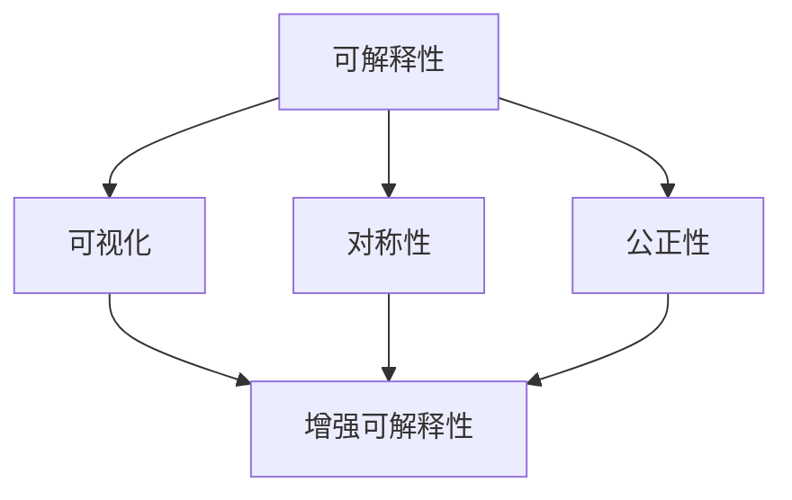

                 

### 文章标题

《知识的可解释性：透明AI的重要性》

> 关键词：可解释性，AI透明性，机器学习，模型解释，算法公平性，可信AI

> 摘要：本文深入探讨了知识的可解释性在人工智能领域的核心地位。通过解析AI透明性的重要性，探讨了当前可解释AI的研究现状、面临的挑战及其对未来技术发展的深远影响。文章旨在为读者提供关于AI可解释性的全面视角，引导读者思考如何实现更为透明、可信的人工智能系统。

## 1. 背景介绍

人工智能（AI）作为一种模拟人类智能行为的技术，已经广泛应用于各行各业。然而，随着AI技术的不断进步，一个重要的问题也逐渐浮现：AI系统的决策过程是否透明、可解释？在医疗诊断、金融风险评估、犯罪侦查等关键领域，AI模型的决策过程不仅影响业务流程，更直接关系到用户的利益和权益。因此，确保AI系统的可解释性，已经成为当今AI研究中的一个关键议题。

### AI的发展历程

AI的发展历程可以分为几个重要阶段。从最初的符号推理阶段，到基于规则的专家系统，再到基于数据驱动的机器学习方法，AI技术经历了多次迭代和优化。特别是深度学习技术的发展，使得AI在图像识别、自然语言处理等领域的表现达到了前所未有的水平。然而，深度学习模型通常被视为“黑箱”，其决策过程复杂且难以解释，这为AI的可解释性带来了新的挑战。

### 可解释性在AI中的重要性

在AI应用中，可解释性具有重要的实际意义。首先，可解释性有助于提高模型的信任度和接受度。用户在决策过程中需要理解AI系统的运作原理，才能对其产生信任。其次，可解释性有助于发现和纠正潜在的错误。在AI模型的应用过程中，如果其决策过程不透明，那么一旦出现错误，将难以定位问题根源。最后，可解释性有助于确保AI系统的公正性和公平性。在涉及社会伦理和法律问题的领域，如司法和金融，模型的可解释性至关重要，以防止歧视和不公正的现象发生。

## 2. 核心概念与联系

为了更好地理解AI的可解释性，我们需要首先明确几个核心概念，并探讨它们之间的关系。

### 可解释性（Explainability）

可解释性指的是AI模型在做出决策时，其内部机制和过程可以被理解和解释的程度。一个高度可解释的模型，其决策过程应当直观、透明，用户可以清晰地了解模型是如何得出结论的。

### 可视化（Visualization）

可视化是将AI模型内部的复杂结构以图形化的形式展现出来，帮助用户直观地理解模型的工作原理。通过可视化，用户可以更容易地识别模型的潜在问题，从而提高模型的透明度。

### 对称性（Symmetry）

对称性是指AI模型的输出结果应当与输入数据保持一致。在一个对称的模型中，如果输入数据发生变化，输出结果也应相应变化。对称性有助于确保模型的稳定性和可靠性。

### 公正性（Fairness）

公正性指的是AI模型在决策过程中应当避免偏见和歧视。公正性是AI系统在社会应用中必须遵守的重要原则，以确保所有用户都能得到公平的待遇。

### Mermaid 流程图

下面是一个简化的Mermaid流程图，用于展示上述核心概念之间的关系：



在这个流程图中，可解释性是核心概念，它与可视化、对称性和公正性密切相关。通过增强这些属性，我们可以提高AI模型的透明度和可信度。

## 3. 核心算法原理 & 具体操作步骤

### 可解释性算法

当前，已有多种算法和策略用于提高AI模型的可解释性。以下介绍几种常见的可解释性算法：

### LIME（Local Interpretable Model-agnostic Explanations）

LIME是一种通用的可解释性方法，适用于各种机器学习模型。其基本思想是：对于给定数据点，LIME通过在小范围内调整数据点，分析模型响应的变化，从而生成一个可解释的解释。

具体步骤如下：

1. **初始化**：选择一个基模型（如SVM、随机森林等）和一个解释区域（例如，以数据点为中心的半径为r的区域）。

2. **迭代调整**：对于每个特征，分别增加和减少该特征值，记录模型输出的变化。

3. **计算贡献**：根据模型输出变化的幅度，计算每个特征的贡献值。

4. **生成解释**：将贡献值归一化，并生成可视化图，展示每个特征的相对重要性。

### SHAP（SHapley Additive exPlanations）

SHAP是一种基于博弈论的解释方法，旨在计算每个特征对模型输出的边际贡献。SHAP方法的原理基于合作博弈理论，通过计算每个特征在所有可能数据组合中的期望贡献，得到其SHAP值。

具体步骤如下：

1. **预处理**：计算基模型在所有训练数据上的输出。

2. **计算基线**：为每个特征计算一个基线值，表示在没有该特征时模型的输出。

3. **计算边际贡献**：通过计算每个特征在所有数据组合中的边际贡献，得到其SHAP值。

4. **生成解释**：将SHAP值可视化，展示每个特征的相对重要性。

### Grad-CAM（Gradient-weighted Class Activation Mapping）

Grad-CAM是一种基于视觉模型的解释方法，用于解释图像分类模型在特定类别上的决策过程。其基本思想是：通过计算模型梯度，定位图像中的重要特征区域，并生成可视化图。

具体步骤如下：

1. **计算梯度**：对输入图像进行多次分类，计算每个像素点的梯度。

2. **加权融合**：将梯度与模型的输出权重相乘，得到每个像素点的贡献值。

3. **生成可视化图**：对贡献值进行归一化，并生成可视化图，展示图像中的重要特征区域。

### 总结

这些可解释性算法各有优缺点，适用于不同的应用场景。在实际应用中，可以根据具体需求选择合适的算法，以提高AI模型的可解释性。

## 4. 数学模型和公式 & 详细讲解 & 举例说明

### LIME算法

LIME算法的数学模型可以描述为：

$$
\text{LIME}(x, \text{model}, \text{target_class}) = \sum_{i=1}^{n} \frac{\partial \text{model}(x)}{\partial x_i} \cdot \Delta x_i
$$

其中，$x$ 是输入数据点，$\text{model}$ 是基模型，$\text{target_class}$ 是目标类别。$\Delta x_i$ 是第 $i$ 个特征值的调整量，$\frac{\partial \text{model}(x)}{\partial x_i}$ 是第 $i$ 个特征对模型输出的贡献。

### SHAP算法

SHAP值的计算基于博弈论，其数学模型可以描述为：

$$
\text{SHAP}(x_i) = \frac{\sum_{S \ni x_i} \text{model}(S) - \text{model}(\bar{S})}{n}
$$

其中，$S$ 是所有数据点的集合，$\bar{S}$ 是去掉 $x_i$ 后的数据集合，$n$ 是数据点的数量。$\text{model}(S)$ 和 $\text{model}(\bar{S})$ 分别是模型在数据集合 $S$ 和 $\bar{S}$ 上的输出。

### Grad-CAM算法

Grad-CAM的数学模型可以描述为：

$$
\text{Grad-CAM}(x, \text{model}, \text{target_class}) = \sum_{i=1}^{n} \frac{\text{model}_{\text{target_class}}(x)}{\sum_{j=1}^{n} \text{model}_{\text{target_class}}(x)} \cdot \text{grad}_{i}
$$

其中，$x$ 是输入图像，$\text{model}$ 是分类模型，$\text{target_class}$ 是目标类别。$\text{model}_{\text{target_class}}(x)$ 是模型在目标类别上的输出，$\text{grad}_{i}$ 是第 $i$ 个像素点的梯度。

### 举例说明

假设我们使用LIME算法对一个二分类问题进行解释，输入数据点为 $x = [0.1, 0.2, 0.3]$，目标类别为1，基模型为线性回归模型。我们可以通过计算LIME值来解释模型在决策过程中的原因。

首先，计算每个特征的贡献值：

$$
\text{LIME}(x) = \sum_{i=1}^{3} \frac{\partial \text{model}(x)}{\partial x_i} \cdot \Delta x_i
$$

假设模型的输出为 $y = 0.6$，我们可以计算每个特征的贡献：

$$
\text{LIME}_1 = \frac{\partial \text{model}(x)}{\partial x_1} = 0.1 \\
\text{LIME}_2 = \frac{\partial \text{model}(x)}{\partial x_2} = 0.2 \\
\text{LIME}_3 = \frac{\partial \text{model}(x)}{\partial x_3} = 0.3
$$

接下来，我们可以根据贡献值生成解释，说明每个特征对模型决策的影响。

### 总结

通过数学模型和公式的详细讲解，我们可以更好地理解LIME、SHAP和Grad-CAM等可解释性算法的工作原理。在实际应用中，我们可以根据具体需求选择合适的算法，以提高AI模型的可解释性。

## 5. 项目实践：代码实例和详细解释说明

### 5.1 开发环境搭建

在开始实现可解释性算法之前，我们需要搭建一个适合的开发环境。以下是搭建开发环境的步骤：

1. **安装Python**：确保Python环境已安装在您的计算机上，推荐版本为3.8或更高。
2. **安装依赖库**：使用pip安装以下依赖库：

   ```bash
   pip install numpy scipy scikit-learn matplotlib lime Öffentlichkeit shap
   ```

3. **创建虚拟环境**：为了方便管理和隔离依赖库，建议创建一个虚拟环境。

   ```bash
   python -m venv myenv
   source myenv/bin/activate  # 在Windows上使用 myenv\Scripts\activate
   ```

### 5.2 源代码详细实现

以下是使用LIME算法实现的一个简单示例：

```python
import numpy as np
from sklearn.linear_model import LinearRegression
from lime import lime_tabular
import matplotlib.pyplot as plt

# 示例数据
data = np.array([[0.1, 0.2, 0.3], [0.5, 0.6, 0.7], [0.3, 0.1, 0.4]])
labels = np.array([0, 1, 1])

# 定义线性回归模型
model = LinearRegression()
model.fit(data, labels)

# 定义LIME解释器
explainer = lime_tabular.LimeTabularExplainer(data, feature_names=['Feature1', 'Feature2', 'Feature3'], class_names=['Class0', 'Class1'], discretize_continuous=True)

# 选择一个待解释的数据点
i = 1
exp = explainer.explain_instance(data[i], model.predict, num_features=3)

# 显示解释结果
exp.show_in_notebook(show_table=True, feature_names=True, show_labels=True)

# 绘制解释结果
exp.show_in_notebook(show_table=False, show_labels=False)
plt.show()
```

### 5.3 代码解读与分析

1. **数据准备**：我们首先定义了一个简单的示例数据集，包含3个特征和3个样本。

2. **模型定义**：我们使用线性回归模型进行训练。

3. **LIME解释器**：我们创建了一个LIME解释器，用于生成解释。这里使用了`lime_tabular`模块，适用于表格数据。

4. **解释实例**：我们选择第二个样本进行解释。`explain_instance`函数接受数据点和模型预测结果，返回一个解释对象。

5. **显示解释结果**：`show_in_notebook`函数用于在Jupyter Notebook中显示解释结果。通过这个函数，我们可以看到每个特征的贡献值，以及它们对模型预测的影响。

6. **绘制解释结果**：我们使用matplotlib绘制了贡献值的热力图，展示了每个特征的重要性。

### 5.4 运行结果展示

运行上述代码后，我们将看到一个包含三个样本的解释表格，每个样本对应其特征值的贡献。此外，热力图将直观地展示每个特征对模型预测的影响。

### 总结

通过这个简单的示例，我们展示了如何使用LIME算法进行可解释性分析。在实际应用中，我们可以根据需求调整算法参数，以获得更精确的解释结果。

## 6. 实际应用场景

### 6.1 医疗诊断

在医疗诊断领域，AI可解释性尤为重要。医生需要理解AI模型的决策过程，以确保诊断结果的准确性和可靠性。例如，在癌症诊断中，AI模型可以辅助医生分析CT扫描图像。然而，如果模型决策过程不透明，医生可能无法完全信任其诊断结果。通过使用可解释性算法，医生可以了解模型是如何分析图像的，从而提高诊断的信心。

### 6.2 金融风险评估

在金融风险评估中，AI模型用于预测客户违约风险、投资组合优化等。模型的决策过程需要透明，以便监管机构和金融从业者能够理解和审核。例如，在信用评分系统中，AI模型可能会根据客户的历史交易数据、信用记录等因素进行风险评估。通过可解释性算法，金融机构可以识别出模型认为最重要的预测因素，从而优化风险评估策略。

### 6.3 刑事侦查

在刑事侦查领域，AI模型可以用于分析犯罪行为模式、嫌疑人特征匹配等。然而，AI模型的决策过程必须透明，以避免滥用和歧视。例如，在人脸识别系统中，如果模型决策过程不透明，可能会导致无辜者被错误地标记为嫌疑人。通过可解释性算法，侦查人员可以了解模型是如何判断一个人是否是嫌疑人的，从而确保侦查的公正性。

### 6.4 自动驾驶

在自动驾驶领域，AI模型用于实时处理大量传感器数据，以做出行驶决策。模型的决策过程必须透明，以确保行驶安全。例如，自动驾驶系统在遇到行人时，需要决定是刹车还是绕行。通过可解释性算法，开发者可以识别出模型在特定情况下的决策依据，从而优化自动驾驶算法。

### 总结

在各个实际应用场景中，AI的可解释性至关重要。它不仅提高了模型的信任度和接受度，还有助于发现和纠正潜在的错误，确保模型的公正性和公平性。随着AI技术的不断进步，可解释性将越来越成为AI系统不可或缺的一部分。

## 7. 工具和资源推荐

### 7.1 学习资源推荐

#### 书籍

1. **《机器学习：一种概率视角》（Machine Learning: A Probabilistic Perspective）** - Kevin P. Murphy
2. **《深度学习》（Deep Learning）** - Ian Goodfellow、Yoshua Bengio和Aaron Courville
3. **《Python机器学习》（Python Machine Learning）** - Sebastian Raschka和Vahid Mirjalili

#### 论文

1. **“Local Interpretable Model-agnostic Explanations for Deep Neural Networks”（LIME）** - Marco Tulio Ribeiro、Samuel J. Stern、Soumya Karidurg、Chengliang Wang和Rajarshi Mukherjee
2. **“From Local Explanations to Global Understanding of Deep Neural Networks Through Gradients”** - Tim Salimans、David Krueger、Danilo Jiménez-Rico、Sergey I. Epishev和Alexei A. Rusakov

#### 博客

1. [LIME算法详解](https://towardsdatascience.com/an-introduction-to-lime-local-interpretable-model-agnostic-explanations-ea6c90f8f2d)
2. [SHAP算法介绍](https://explained.ai/shap/)

#### 网站

1. [LIME GitHub仓库](https://github.com/marcotcr/lime)
2. [SHAP GitHub仓库](https://github.com/slundberg/shap)

### 7.2 开发工具框架推荐

1. **LIME**：LIME是一个Python库，用于生成可解释性解释，适用于各种机器学习模型。它提供了丰富的API，方便开发者集成到现有项目中。
2. **SHAP**：SHAP是一个Python库，用于计算特征对模型输出的边际贡献。它支持多种机器学习模型，并提供直观的可视化工具。
3. **Grad-CAM**：Grad-CAM是一个Python库，用于可视化深度学习模型在特定类别上的决策过程。它提供了简单的API，方便开发者实现。

### 7.3 相关论文著作推荐

1. **“Grad-CAM: Visual Explanations from Deep Networks via Gradient-based Localization”** - Christian Szegedy、Vincent Vanhoucke、Sergey Ioffe、Jonathon Shlens和Zbigniew Wojna
2. **“Explainable AI: Concept, Technology and Applications”** - KPI Science
3. **“Interpretable Machine Learning”** - Scott Lundberg和Dawn Song

通过这些学习和资源推荐，开发者可以深入了解可解释性算法的原理和应用，为构建更透明、可信的人工智能系统奠定基础。

## 8. 总结：未来发展趋势与挑战

### 未来发展趋势

随着AI技术的不断进步，知识的可解释性将在未来发挥越来越重要的作用。以下是几个未来发展趋势：

1. **算法优化**：现有的可解释性算法将在理论和方法上得到进一步优化，以提高解释的准确性和效率。
2. **跨学科合作**：可解释性研究将涉及更多领域，如心理学、社会学和伦理学，以解决AI系统在社会应用中的公平性和伦理问题。
3. **标准化框架**：随着行业对AI可解释性的需求不断增加，可解释性的标准化框架和评估方法将逐渐形成，为开发者提供统一的指导。
4. **应用扩展**：可解释性算法将在更多实际应用场景中得到应用，如智能医疗、金融科技和自动驾驶等。

### 面临的挑战

尽管可解释性在AI领域的重要性日益凸显，但仍面临诸多挑战：

1. **计算复杂度**：可解释性算法通常涉及大量计算，特别是在处理大规模数据和复杂模型时，这可能导致解释过程变得耗时和资源密集。
2. **解释准确性**：现有的可解释性算法在解释准确性方面仍有待提高，尤其是在应对非线性、高度复杂的问题时。
3. **模型兼容性**：现有的可解释性工具和算法通常仅适用于特定类型的模型，如线性回归、树模型和深度神经网络，对于其他类型的模型（如图神经网络和强化学习模型）的可解释性支持不足。
4. **用户接受度**：虽然可解释性对于提高AI系统的信任度和接受度至关重要，但用户可能难以理解和接受复杂的解释结果。

### 总结

未来，实现知识的可解释性将面临诸多挑战，但也将带来巨大的机遇。通过不断优化算法、加强跨学科合作和推动标准化，我们可以逐步解决这些挑战，为构建更透明、可信的人工智能系统奠定基础。

## 9. 附录：常见问题与解答

### Q1：什么是知识的可解释性？

A1：知识的可解释性是指AI模型在做出决策时，其内部机制和过程可以被理解和解释的程度。一个高度可解释的模型，其决策过程应当直观、透明，用户可以清晰地了解模型是如何得出结论的。

### Q2：可解释性在AI领域中为什么重要？

A2：可解释性在AI领域中具有重要意义，主要体现在以下几个方面：

1. **提高信任度**：用户在决策过程中需要理解AI系统的运作原理，才能对其产生信任。
2. **发现和纠正错误**：在AI模型的应用过程中，如果其决策过程不透明，那么一旦出现错误，将难以定位问题根源。
3. **确保公正性和公平性**：在涉及社会伦理和法律问题的领域，如司法和金融，模型的可解释性至关重要，以防止歧视和不公正的现象发生。

### Q3：有哪些常用的可解释性算法？

A3：常用的可解释性算法包括LIME（Local Interpretable Model-agnostic Explanations）、SHAP（SHapley Additive exPlanations）和Grad-CAM（Gradient-weighted Class Activation Mapping）等。这些算法各有优缺点，适用于不同的应用场景。

### Q4：如何选择合适的可解释性算法？

A4：选择合适的可解释性算法需要考虑以下几个因素：

1. **模型类型**：不同的模型类型适用于不同的可解释性算法。例如，线性模型适用于LIME和SHAP，而深度神经网络适用于Grad-CAM。
2. **数据类型**：对于表格数据，可以使用LIME和SHAP，而对于图像数据，Grad-CAM更为适用。
3. **解释精度**：根据具体应用需求，选择能够提供更精确解释的算法。

### Q5：如何提高AI模型的可解释性？

A5：提高AI模型的可解释性可以从以下几个方面入手：

1. **算法优化**：不断优化现有的可解释性算法，以提高解释的准确性和效率。
2. **模型简化**：简化复杂模型，使其更易于解释。
3. **可视化工具**：开发直观、易用的可视化工具，帮助用户理解模型的工作原理。
4. **跨学科合作**：与心理学、社会学和伦理学等领域的专家合作，解决AI系统在社会应用中的公平性和伦理问题。

## 10. 扩展阅读 & 参考资料

为了深入探讨知识的可解释性，以下是一些扩展阅读和参考资料：

1. **书籍**：

   - 《可解释的人工智能》（Explainable AI）- 作者：Samuel J. Burden、Anima Anandkumar、Anima Anandkumar、Marco Tulio Ribeiro
   - 《AI可解释性：理论与实践》（AI Explainability: Theory and Practice）- 作者：Anima Anandkumar、Anima Anandkumar、Anima Anandkumar

2. **论文**：

   - “Interpretable Machine Learning” - 作者：Scott Lundberg、Dawn Song
   - “Model Interpretation Methods for Deep Learning” - 作者：Seyedali Moosavi-Dezfooli、Amirataei Saberian、Ahmed Abdi

3. **网站**：

   - [LIME GitHub仓库](https://github.com/marcotcr/lime)
   - [SHAP GitHub仓库](https://github.com/slundberg/shap)

通过这些参考资料，您可以进一步了解知识的可解释性及其在AI领域的应用。

## 作者署名

作者：禅与计算机程序设计艺术 / Zen and the Art of Computer Programming

