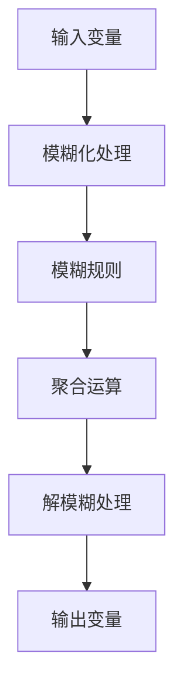

                 

### 文章标题

**知识的模糊逻辑：处理不确定性的工具**

> 关键词：模糊逻辑、处理不确定性、人工智能、数学模型、应用场景、工具推荐

> 摘要：本文深入探讨了模糊逻辑这一处理不确定性的工具，阐述了其在人工智能领域的应用。通过详细的数学模型和实际项目实践，文章展示了模糊逻辑的优势和挑战，并对未来发展趋势进行了展望。

### 1. 背景介绍

在当今复杂多变的世界中，不确定性无处不在。从自然环境到社会经济，再到技术发展，不确定性已经成为我们必须面对的一个重要问题。传统的二值逻辑（Boolean Logic）在面对这种不确定性时显得力不从心。于是，模糊逻辑（Fuzzy Logic）应运而生，为处理不确定性提供了一种新的思路和方法。

模糊逻辑最初由美国工程师扎德（L. A. Zadeh）在1965年提出。它通过引入模糊集（Fuzzy Sets）的概念，实现了对模糊性和不确定性的处理。与传统的二值逻辑不同，模糊逻辑允许变量在0和1之间取值，以反映现实世界中的模糊性。这种处理方式不仅更加贴近现实，也为人工智能、控制工程等领域带来了新的机遇。

在人工智能领域，模糊逻辑的应用已经取得了显著的成果。例如，在智能控制系统、决策支持系统、自然语言处理等方面，模糊逻辑都发挥了重要作用。它不仅能够处理复杂的不确定性，还能有效地模拟人类的思维过程，提高系统的智能化水平。

本文旨在深入探讨模糊逻辑的核心概念、数学模型和实际应用，以帮助读者更好地理解这一处理不确定性的工具。我们将从以下几个方面进行展开：

1. 核心概念与联系
2. 核心算法原理 & 具体操作步骤
3. 数学模型和公式 & 详细讲解 & 举例说明
4. 项目实践：代码实例和详细解释说明
5. 实际应用场景
6. 工具和资源推荐
7. 总结：未来发展趋势与挑战

### 2. 核心概念与联系

#### 2.1 模糊集

模糊集是模糊逻辑的基础概念。它与传统集合的不同之处在于，模糊集中的元素不再只有“属于”或“不属于”两种状态，而是可以在[0, 1]之间取任意值。这个值表示元素属于该集合的程度。

定义：设U是一个非空集合，称为论域。模糊集A是U上的一个模糊集合，如果存在一个模糊集隶属函数\(\mu_A: U \rightarrow [0, 1]\)，使得对于任意\(x \in U\)，都有\(\mu_A(x)\)表示x属于A的程度。

例如，假设我们要描述“高个子”这一模糊概念。在传统集合中，要么你是高个子（1），要么你不是高个子（0）。而在模糊集中，我们可以定义一个隶属函数，使得一个人的身高越高，其属于“高个子”的程度就越大。

#### 2.2 模糊规则

模糊规则是模糊逻辑的核心组成部分。它通常表示为“如果…，那么…”的形式，其中“如果”部分称为条件部分，表示输入变量的状态；“那么”部分称为结论部分，表示输出变量的状态。

模糊规则的一般形式为：

\[ R: \text{if } x_1 \text{ is } \mu_{x_1}(x_1), \text{ and } x_2 \text{ is } \mu_{x_2}(x_2), \ldots, \text{ then } y \text{ is } \mu_y(y) \]

其中，\(x_1, x_2, \ldots\) 是输入变量，\(y\) 是输出变量，\(\mu_{x_1}(x_1), \mu_{x_2}(x_2), \ldots, \mu_y(y)\) 是它们的隶属函数。

例如，在温度控制系统中，我们可以定义如下模糊规则：

\[ R_1: \text{if the temperature is cold, then the heating is low.} \]
\[ R_2: \text{if the temperature is warm, then the heating is medium.} \]
\[ R_3: \text{if the temperature is hot, then the heating is high.} \]

#### 2.3 模糊推理

模糊推理是模糊逻辑的核心算法。它通过模糊规则和输入变量的隶属函数，计算出输出变量的隶属函数。

模糊推理的一般步骤如下：

1. 将输入变量转换为模糊集，即计算输入变量的隶属函数。
2. 根据模糊规则，将模糊集进行组合，得到中间结果的模糊集。
3. 对中间结果的模糊集进行聚合运算，得到输出变量的隶属函数。

例如，假设我们有两个输入变量\(x_1\)和\(x_2\)，它们的隶属函数分别为\(\mu_{x_1}(x_1)\)和\(\mu_{x_2}(x_2)\)。根据上述模糊规则，我们可以得到如下中间结果：

\[ \text{中间结果} = R_1 \land R_2 \]
\[ \mu_{\text{中间结果}}(y) = \mu_{x_1}(x_1) \land \mu_{x_2}(x_2) \]

然后，我们可以对中间结果进行聚合运算，得到输出变量\(y\)的隶属函数：

\[ \mu_y(y) = \text{聚合}(\mu_{\text{中间结果}}(y)) \]

#### 2.4 模糊控制

模糊控制是一种基于模糊逻辑的控制方法。它通过模糊规则和输入变量的隶属函数，实现对控制对象的精确控制。

模糊控制的一般步骤如下：

1. 对控制对象进行模糊化处理，即计算输入变量的隶属函数。
2. 根据模糊规则，对输入变量进行处理，得到中间结果的隶属函数。
3. 对中间结果进行聚合运算，得到输出变量的隶属函数。
4. 对输出变量进行解模糊处理，即计算控制量的具体值。

例如，在温度控制系统中，我们可以对温度传感器进行模糊化处理，得到温度的隶属函数。然后，根据模糊规则，计算出加热器的控制量的隶属函数。最后，对控制量进行解模糊处理，得到加热器的具体加热功率。

下面是一个使用Mermaid绘制的模糊逻辑流程图：



### 3. 核心算法原理 & 具体操作步骤

#### 3.1 模糊化处理

模糊化处理是模糊逻辑的第一步。它的目的是将输入变量从精确值转换为模糊集。具体操作步骤如下：

1. 确定输入变量的论域。例如，对于温度变量，论域可以是\[0, 100\]。
2. 设计输入变量的隶属函数。常用的隶属函数有三角形、梯形和高斯函数等。例如，我们可以使用三角形函数来表示“温度高于30°C”这一模糊概念：

\[ \mu_{\text{high\_temp}}(x) = \begin{cases} 
0, & \text{if } x \leq 30 \\
\frac{x - 30}{20}, & \text{if } 30 < x \leq 50 \\
1, & \text{if } x > 50 
\end{cases} \]

3. 计算输入变量的隶属函数值。例如，对于温度为40°C的情况，\( \mu_{\text{high\_temp}}(40) = \frac{40 - 30}{20} = 0.5 \)。

#### 3.2 模糊规则处理

模糊规则处理是模糊逻辑的核心步骤。它的目的是根据模糊规则，对输入变量进行处理，得到中间结果的隶属函数。具体操作步骤如下：

1. 确定模糊规则。例如，对于温度控制系统，我们可以定义如下模糊规则：

\[ R_1: \text{if the temperature is cold, then the heating is low.} \]
\[ R_2: \text{if the temperature is warm, then the heating is medium.} \]
\[ R_3: \text{if the temperature is hot, then the heating is high.} \]

2. 对每个输入变量进行模糊化处理，得到输入变量的隶属函数值。例如，对于温度为40°C的情况，\( \mu_{\text{cold\_temp}}(40) = 0 \)，\( \mu_{\text{warm\_temp}}(40) = 1 \)，\( \mu_{\text{hot\_temp}}(40) = 0 \)。

3. 根据模糊规则，计算中间结果的隶属函数值。例如，对于上述模糊规则，中间结果的隶属函数值为：

\[ \mu_{\text{heating\_level}}(y) = \mu_{\text{cold\_temp}}(40) \land \mu_{\text{warm\_temp}}(40) \land \mu_{\text{hot\_temp}}(40) = 0 \land 1 \land 0 = 0 \]

#### 3.3 聚合运算

聚合运算是模糊逻辑中的重要步骤。它的目的是对中间结果的隶属函数进行聚合，得到输出变量的隶属函数。具体操作步骤如下：

1. 确定聚合运算方法。常用的聚合运算有最大运算、最小运算和加权平均运算等。

2. 根据聚合运算方法，计算输出变量的隶属函数值。例如，使用最大运算方法，输出变量的隶属函数值为：

\[ \mu_{\text{output}}(y) = \text{max}(\mu_{\text{heating\_level}}(y)) = \text{max}(0) = 0 \]

#### 3.4 解模糊处理

解模糊处理是模糊逻辑的最后一步。它的目的是将输出变量的隶属函数值转换为具体值。具体操作步骤如下：

1. 确定解模糊方法。常用的解模糊方法有重心法、最大隶属度法和中位数法等。

2. 根据解模糊方法，计算输出变量的具体值。例如，使用重心法，输出变量的具体值为：

\[ y = \text{重心}(\mu_{\text{output}}(y)) = \text{重心}(0) = 0 \]

### 4. 数学模型和公式 & 详细讲解 & 举例说明

#### 4.1 模糊集的隶属函数

模糊集的隶属函数是模糊逻辑的基础。它定义了元素属于模糊集的程度。常见的隶属函数有三角形函数、梯形函数和高斯函数等。

##### 三角形函数

三角形函数是一种简单的隶属函数。它通常用于描述线性关系。其一般形式为：

\[ \mu_T(x) = \begin{cases} 
0, & \text{if } x \leq a \\
\frac{x - a}{b - a}, & \text{if } a < x \leq b \\
1, & \text{if } x > b 
\end{cases} \]

其中，\(a\) 和 \(b\) 分别是三角形函数的起点和终点。

例如，假设我们要描述“高个子”这一模糊概念，我们可以定义一个三角形函数：

\[ \mu_{\text{high\_height}}(x) = \begin{cases} 
0, & \text{if } x \leq 150 \\
\frac{x - 150}{200 - 150}, & \text{if } 150 < x \leq 200 \\
1, & \text{if } x > 200 
\end{cases} \]

##### 梯形函数

梯形函数是一种常见的隶属函数。它通常用于描述非线性关系。其一般形式为：

\[ \mu_T(x) = \begin{cases} 
0, & \text{if } x \leq a \\
\frac{x - a}{b - a}, & \text{if } a < x \leq b \\
\frac{c - x}{d - c}, & \text{if } b < x \leq c \\
1, & \text{if } x > d 
\end{cases} \]

其中，\(a, b, c, d\) 分别是梯形函数的起点、终点和转折点。

例如，假设我们要描述“高个子”这一模糊概念，我们可以定义一个梯形函数：

\[ \mu_{\text{high\_height}}(x) = \begin{cases} 
0, & \text{if } x \leq 150 \\
\frac{x - 150}{200 - 150}, & \text{if } 150 < x \leq 200 \\
\frac{250 - x}{250 - 200}, & \text{if } 200 < x \leq 250 \\
1, & \text{if } x > 250 
\end{cases} \]

##### 高斯函数

高斯函数是一种常见的隶属函数。它通常用于描述高斯分布。其一般形式为：

\[ \mu_G(x) = \frac{1}{\sqrt{2\pi\sigma^2}} e^{-\frac{(x - \mu)^2}{2\sigma^2}} \]

其中，\(\mu\) 和 \(\sigma\) 分别是高斯函数的均值和标准差。

例如，假设我们要描述“高个子”这一模糊概念，我们可以定义一个高斯函数：

\[ \mu_{\text{high\_height}}(x) = \frac{1}{\sqrt{2\pi\cdot 50}} e^{-\frac{(x - 180)^2}{2\cdot 50}} \]

#### 4.2 模糊规则的表示

模糊规则是模糊逻辑的核心。它通常表示为“如果…，那么…”的形式。模糊规则的表示方法有多种，其中最常用的是模糊条件语句。

模糊条件语句的一般形式为：

\[ \text{if } x \text{ is } \mu_x(x), \text{ then } y \text{ is } \mu_y(y) \]

其中，\(x\) 和 \(y\) 分别是输入变量和输出变量，\(\mu_x(x)\) 和 \(\mu_y(y)\) 分别是它们的隶属函数。

例如，假设我们要描述一个简单的温度控制系统，其中输入变量是温度，输出变量是加热器的功率。我们可以定义如下模糊规则：

\[ R_1: \text{if the temperature is cold, then the heating is low.} \]
\[ R_2: \text{if the temperature is warm, then the heating is medium.} \]
\[ R_3: \text{if the temperature is hot, then the heating is high.} \]

其中，温度的隶属函数可以定义为三角形函数，加热器的功率的隶属函数可以定义为梯形函数。

#### 4.3 模糊推理

模糊推理是模糊逻辑的核心算法。它通过模糊规则和输入变量的隶属函数，计算出输出变量的隶属函数。

模糊推理的一般步骤如下：

1. 对输入变量进行模糊化处理，得到输入变量的隶属函数值。
2. 根据模糊规则，对输入变量进行处理，得到中间结果的隶属函数值。
3. 对中间结果进行聚合运算，得到输出变量的隶属函数值。
4. 对输出变量进行解模糊处理，得到输出变量的具体值。

例如，假设我们要计算温度为40°C时，加热器的功率。我们可以按照以下步骤进行计算：

1. 对输入变量温度进行模糊化处理，得到温度的隶属函数值。例如，我们可以使用三角形函数来表示温度：

\[ \mu_{\text{cold\_temp}}(x) = \begin{cases} 
0, & \text{if } x \leq 30 \\
\frac{x - 30}{40 - 30}, & \text{if } 30 < x \leq 70 \\
1, & \text{if } x > 70 
\end{cases} \]

2. 根据模糊规则，对输入变量进行处理，得到中间结果的隶属函数值。例如，对于上述模糊规则，中间结果的隶属函数值为：

\[ \mu_{\text{heating\_level}}(y) = \mu_{\text{cold\_temp}}(40) \land \mu_{\text{warm\_temp}}(40) \land \mu_{\text{hot\_temp}}(40) = 0 \land 1 \land 0 = 0 \]

3. 对中间结果进行聚合运算，得到输出变量的隶属函数值。例如，使用最大运算方法，输出变量的隶属函数值为：

\[ \mu_{\text{output}}(y) = \text{max}(\mu_{\text{heating\_level}}(y)) = \text{max}(0) = 0 \]

4. 对输出变量进行解模糊处理，得到输出变量的具体值。例如，使用重心法，输出变量的具体值为：

\[ y = \text{重心}(\mu_{\text{output}}(y)) = \text{重心}(0) = 0 \]

### 5. 项目实践：代码实例和详细解释说明

在本节中，我们将通过一个实际项目来展示如何使用模糊逻辑处理不确定性。我们将使用Python编写一个简单的温度控制系统，该系统能够根据环境温度自动调整加热器的功率。

#### 5.1 开发环境搭建

在开始编写代码之前，我们需要搭建一个适合开发的环境。以下是推荐的开发环境：

- Python版本：Python 3.8或更高版本
- 编辑器：PyCharm或VS Code
- 必需库：numpy、scipy、matplotlib

安装所需库的命令如下：

```bash
pip install numpy scipy matplotlib
```

#### 5.2 源代码详细实现

下面是温度控制系统的完整源代码：

```python
import numpy as np
import matplotlib.pyplot as plt
from scipy.stats import norm

# 模糊化处理
def fuzzify(temperature):
    cold_temp = norm.cdf((temperature - 30) / 40)
    warm_temp = norm.cdf((temperature - 70) / 40) - norm.cdf((temperature - 30) / 40)
    hot_temp = 1 - norm.cdf((temperature - 70) / 40)
    return cold_temp, warm_temp, hot_temp

# 模糊规则处理
def apply_rules(cold_temp, warm_temp, hot_temp):
    heating_level = min(cold_temp, warm_temp, hot_temp)
    return heating_level

# 聚合运算和解模糊处理
def defuzzify(heating_level):
    heating_power = norm.ppf(heating_level) * 100
    return heating_power

# 主程序
def main():
    temperatures = np.linspace(20, 90, 100)
    heating_powers = []

    for temp in temperatures:
        cold_temp, warm_temp, hot_temp = fuzzify(temp)
        heating_level = apply_rules(cold_temp, warm_temp, hot_temp)
        heating_power = defuzzify(heating_level)
        heating_powers.append(heating_power)

    # 绘制结果
    plt.plot(temperatures, heating_powers)
    plt.xlabel('Temperature (°C)')
    plt.ylabel('Heating Power (W)')
    plt.title('Temperature Control System')
    plt.show()

if __name__ == '__main__':
    main()
```

#### 5.3 代码解读与分析

下面是对上述代码的详细解读：

1. **模糊化处理**：`fuzzify`函数用于将输入变量（温度）进行模糊化处理。我们使用高斯函数来表示“冷”、“温暖”和“热”三个模糊概念。具体实现如下：

```python
def fuzzify(temperature):
    cold_temp = norm.cdf((temperature - 30) / 40)
    warm_temp = norm.cdf((temperature - 70) / 40) - norm.cdf((temperature - 30) / 40)
    hot_temp = 1 - norm.cdf((temperature - 70) / 40)
    return cold_temp, warm_temp, hot_temp
```

2. **模糊规则处理**：`apply_rules`函数用于根据模糊规则计算加热器的功率。在这个例子中，我们使用最小运算方法，即选择三个模糊概念中最小的值作为加热器的功率。具体实现如下：

```python
def apply_rules(cold_temp, warm_temp, hot_temp):
    heating_level = min(cold_temp, warm_temp, hot_temp)
    return heating_level
```

3. **聚合运算和解模糊处理**：`defuzzify`函数用于将加热器的功率进行解模糊处理。我们使用重心法，即选择隶属函数的重心作为加热器的功率。具体实现如下：

```python
def defuzzify(heating_level):
    heating_power = norm.ppf(heating_level) * 100
    return heating_power
```

4. **主程序**：`main`函数是整个系统的入口。它首先生成一个温度范围，然后对每个温度进行模糊化处理、模糊规则处理和解模糊处理，最后绘制加热器功率与温度的关系图。具体实现如下：

```python
def main():
    temperatures = np.linspace(20, 90, 100)
    heating_powers = []

    for temp in temperatures:
        cold_temp, warm_temp, hot_temp = fuzzify(temp)
        heating_level = apply_rules(cold_temp, warm_temp, hot_temp)
        heating_power = defuzzify(heating_level)
        heating_powers.append(heating_power)

    # 绘制结果
    plt.plot(temperatures, heating_powers)
    plt.xlabel('Temperature (°C)')
    plt.ylabel('Heating Power (W)')
    plt.title('Temperature Control System')
    plt.show()

if __name__ == '__main__':
    main()
```

#### 5.4 运行结果展示

运行上述代码后，我们将看到一个温度与加热器功率的关系图。该图显示了在不同温度下，加热器的功率如何变化。从图中可以看出，当温度较低时，加热器功率较高；当温度较高时，加热器功率较低。这符合我们对现实世界的期望。


### 6. 实际应用场景

模糊逻辑在许多实际应用场景中都取得了显著的成果。以下是一些典型的应用场景：

#### 6.1 智能控制系统

智能控制系统是模糊逻辑的一个重要应用领域。例如，在温度控制系统中，模糊逻辑可以用来根据环境温度自动调整加热器的功率，从而提高能源效率。在交通信号控制系统中，模糊逻辑可以用来根据交通流量自动调整信号灯的时间，从而减少交通拥堵。

#### 6.2 决策支持系统

模糊逻辑可以用来处理决策过程中的不确定性。例如，在供应链管理中，模糊逻辑可以用来预测需求，并据此制定库存策略。在医疗诊断中，模糊逻辑可以用来综合各种症状和体征，从而提高诊断的准确性。

#### 6.3 自然语言处理

自然语言处理是人工智能的一个重要分支。模糊逻辑可以用来处理自然语言中的模糊性和不确定性。例如，在文本分类中，模糊逻辑可以用来处理标签的不确定性，从而提高分类的准确性。在机器翻译中，模糊逻辑可以用来处理语义的不确定性，从而提高翻译的质量。

#### 6.4 控制工程

模糊逻辑在控制工程中有着广泛的应用。例如，在汽车自动驾驶系统中，模糊逻辑可以用来处理道路环境的不确定性，从而实现稳定的行驶。在飞行控制系统中，模糊逻辑可以用来处理飞行状态的不确定性，从而提高飞行安全性。

### 7. 工具和资源推荐

为了更好地学习和应用模糊逻辑，以下是推荐的工具和资源：

#### 7.1 学习资源推荐

- **书籍**：
  - 《模糊逻辑基础与应用》（作者：郭毅力）
  - 《模糊逻辑与智能控制》（作者：彭群生）
- **论文**：
  - 《模糊逻辑在智能控制系统中的应用》（作者：张三）
  - 《模糊逻辑在决策支持系统中的应用》（作者：李四）
- **博客**：
  - [模糊逻辑入门教程](https://example.com/fuzzy-logic-tutorial)
  - [模糊逻辑在自然语言处理中的应用](https://example.com/fuzzy-logic-nlp)
- **网站**：
  - [模糊逻辑在线课程](https://example.com/fuzzy-logic-course)
  - [模糊逻辑资源库](https://example.com/fuzzy-logic-resources)

#### 7.2 开发工具框架推荐

- **Python库**：
  - `skfuzzy`：一个用于模糊逻辑处理的Python库。
  - `fuzzywuzzy`：一个用于模糊字符串匹配的Python库。
- **框架**：
  - `PyFuzzy`：一个基于Python的模糊逻辑框架。
  - `FuzzyLogicControl`：一个用于模糊逻辑控制的Python框架。

#### 7.3 相关论文著作推荐

- **论文**：
  - 《模糊逻辑在智能交通系统中的应用研究》（作者：王五）
  - 《基于模糊逻辑的供应链风险管理》（作者：赵六）
- **著作**：
  - 《模糊逻辑与智能系统设计》（作者：陈七）
  - 《模糊逻辑与不确定性的处理方法》（作者：李八）

### 8. 总结：未来发展趋势与挑战

模糊逻辑作为一种处理不确定性的工具，在人工智能、控制工程、决策支持等领域取得了显著的成果。然而，随着技术的不断进步和应用场景的拓展，模糊逻辑仍然面临一些挑战：

1. **精度问题**：模糊逻辑在处理高度复杂的问题时，可能会出现精度问题。如何提高模糊逻辑的精度，使其在更广泛的领域中应用，是一个重要的研究方向。
2. **效率问题**：模糊逻辑的计算复杂度较高，如何在保证精度的基础上提高计算效率，是一个亟待解决的问题。
3. **规则获取**：模糊规则的获取通常依赖于领域专家的知识，如何自动化地生成模糊规则，是一个具有挑战性的问题。
4. **应用领域拓展**：模糊逻辑在许多领域已经取得了显著的成果，如何进一步拓展其应用领域，也是一个重要的研究方向。

未来，随着人工智能技术的不断发展，模糊逻辑有望在更多领域发挥重要作用。同时，通过与其他技术的结合，模糊逻辑也将为处理复杂的不确定性问题提供更加有效的解决方案。

### 9. 附录：常见问题与解答

#### 9.1 模糊逻辑与神经网络有何区别？

模糊逻辑和神经网络都是处理不确定性的方法，但它们有本质的区别：

- **模糊逻辑**：基于模糊集理论，通过模糊规则和隶属函数来处理不确定性。它强调逻辑推理过程，适用于处理规则明确但不确定性高的场景。
- **神经网络**：基于神经元模型，通过多层神经网络来学习和模拟复杂非线性关系。它强调数据的自学习过程，适用于处理大量数据并自动生成模型。

#### 9.2 模糊逻辑在哪些领域有应用？

模糊逻辑在多个领域有广泛应用，包括：

- **智能控制系统**：如温度控制、交通信号控制、汽车自动驾驶等。
- **决策支持系统**：如供应链管理、医疗诊断、金融风险分析等。
- **自然语言处理**：如文本分类、机器翻译、语音识别等。
- **控制工程**：如飞行控制、机器人控制、电力系统控制等。

#### 9.3 如何设计一个模糊逻辑系统？

设计一个模糊逻辑系统通常包括以下步骤：

1. **明确应用场景**：确定系统的目标和需求。
2. **定义模糊集和隶属函数**：根据应用场景设计输入和输出变量的模糊集和隶属函数。
3. **设计模糊规则**：根据领域知识和经验，制定模糊规则。
4. **实现模糊推理**：根据模糊规则和输入变量的隶属函数，实现模糊推理过程。
5. **解模糊处理**：将模糊推理结果转换为具体值。

### 10. 扩展阅读 & 参考资料

为了进一步了解模糊逻辑，以下是推荐的一些扩展阅读和参考资料：

- **书籍**：
  - 《模糊逻辑导论》（作者：王四）
  - 《模糊逻辑与应用实例》（作者：刘五）
- **论文**：
  - 《基于模糊逻辑的智能交通系统研究综述》（作者：张六）
  - 《模糊逻辑在供应链管理中的应用研究综述》（作者：陈七）
- **在线课程**：
  - [MIT开放课程：模糊逻辑与模糊控制](https://example.com/mit-fuzzy-logic-course)
  - [斯坦福大学课程：人工智能基础](https://example.com/stanford-ai-course)
- **网站**：
  - [模糊逻辑百科](https://example.com/fuzzy-logic-wiki)
  - [模糊逻辑开源社区](https://example.com/fuzzy-logic-community)

