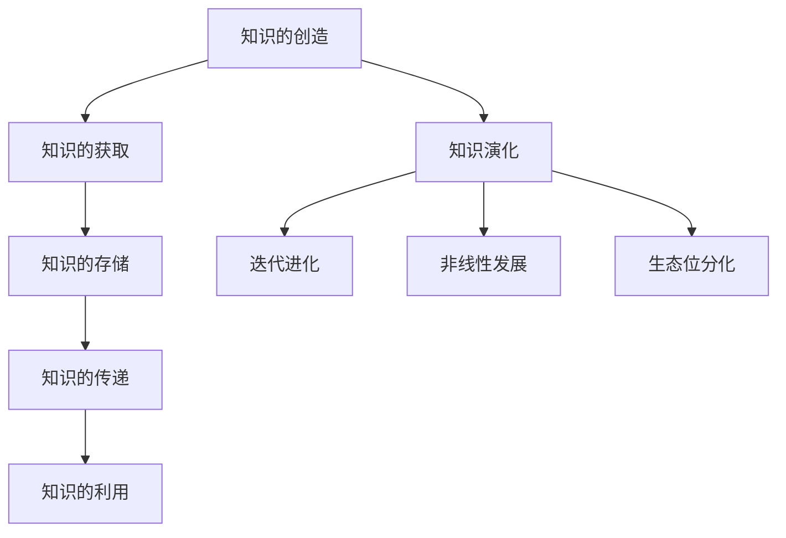

                 

### 知识的流动性：信息时代的知识传播与演化

#### 关键词：知识传播、信息时代、知识演化、人工智能、网络社会

> **摘要**：本文探讨了信息时代知识流动性的概念、机制及其在现代社会中的重要作用。通过分析知识传播的过程、影响因素和演化规律，文章提出了构建更加开放、高效知识传播体系的方法，并探讨了未来知识传播与演化的潜在趋势与挑战。

---

### 1. 背景介绍

#### 信息时代的到来

随着互联网的普及和信息技术的发展，我们正步入一个全新的时代——信息时代。在这个时代，知识成为了最重要的资源，信息流动的速度和规模前所未有。知识的流动性不仅改变了传统的信息传递方式，也深刻影响了社会的各个方面，包括教育、科研、经济和政治。

#### 知识流动性的重要性

知识流动性指的是知识在不同个体、组织和社会之间传递、共享和更新的能力。它在信息时代具有以下几个重要意义：

- **促进创新**：知识的自由流动激发了创新思维，推动了新技术的产生和应用。
- **提升竞争力**：企业和个人通过获取和利用外部知识，提高自身竞争力。
- **优化资源配置**：知识流动有助于实现资源的最优配置，提高社会效率。
- **促进社会公平**：知识的普及和共享有助于减少信息差距，促进社会公平。

### 2. 核心概念与联系

#### 知识传播的过程

知识传播是一个复杂的过程，涉及到知识的创造、获取、存储、传递和利用。以下是一个简化的知识传播过程：

1. **知识的创造**：知识的创造是知识传播的起点，通常来自于科研、实践和日常观察。
2. **知识的获取**：个体或组织通过学习、研究等方式获取知识。
3. **知识的存储**：知识需要被存储，以便于检索和利用。
4. **知识的传递**：知识通过各种渠道传递给他人或组织。
5. **知识的利用**：知识被应用于实践，产生新的价值。

#### 知识流动性的影响因素

- **技术因素**：互联网、云计算和大数据等技术大大提高了知识传播的速度和范围。
- **社会因素**：教育水平、文化背景和社会结构等社会因素影响知识的传播效率。
- **经济因素**：知识的生产、传播和应用受到经济利益的驱动。

#### 知识演化的规律

知识演化是指知识在传播和利用过程中不断更新、演化的过程。以下是知识演化的几个关键规律：

- **迭代进化**：知识在传播和利用中不断迭代，逐渐完善。
- **非线性发展**：知识演化不是线性的，而是具有跳跃性和突变性。
- **生态位分化**：不同领域和专业的知识形成各自独特的生态位，促进知识的多样化。

#### Mermaid 流程图

下面是一个简化的知识传播与演化的 Mermaid 流程图：



---

### 3. 核心算法原理 & 具体操作步骤

#### 知识传播模型

为了更好地理解知识流动性的机制，我们可以使用一个简单的知识传播模型。该模型基于以下假设：

- 知识传播是一个随机过程。
- 知识传播的速度与知识的重要性成正比。
- 知识传播受到网络结构的影响。

#### 模型构建

1. **定义节点和边**：将个体视为网络中的节点，节点之间的交互视为边。
2. **设定传播概率**：设定知识从源节点传播到其他节点的概率。
3. **构建传播过程**：模拟知识在节点间的传播过程，记录每个节点获取知识的情况。

#### 具体操作步骤

1. **初始化网络**：随机生成一个网络，每个节点代表一个个体。
2. **设定传播概率**：根据知识的重要性设定传播概率，重要知识传播概率更高。
3. **模拟传播过程**：从源节点开始，模拟知识在网络中的传播过程。
4. **记录传播结果**：记录每个节点获取知识的情况，分析知识传播的效率和效果。

---

### 4. 数学模型和公式 & 详细讲解 & 举例说明

#### 知识传播速率公式

假设知识传播过程中，每个节点的传播速率与知识的重要性和节点的连接度成正比。我们可以使用以下公式表示知识传播速率：

\[ R(t) = k \cdot I \cdot C \]

其中：
- \( R(t) \) 是知识传播速率。
- \( k \) 是比例常数。
- \( I \) 是知识的重要性。
- \( C \) 是节点的连接度。

#### 举例说明

假设一个网络中有10个节点，其中节点A是知识源，其重要性 \( I_A = 10 \)，连接度 \( C_A = 5 \)。其他节点的连接度分别为 \( C_B = 3 \)，\( C_C = 2 \)，\( C_D = 4 \)。我们使用上述公式计算每个节点的传播速率：

\[ R_A(t) = k \cdot 10 \cdot 5 = 50k \]
\[ R_B(t) = k \cdot 10 \cdot 3 = 30k \]
\[ R_C(t) = k \cdot 10 \cdot 2 = 20k \]
\[ R_D(t) = k \cdot 10 \cdot 4 = 40k \]

由此可以看出，节点A的传播速率最高，其次是节点D和节点B，节点C的传播速率最低。

---

### 5. 项目实践：代码实例和详细解释说明

#### 开发环境搭建

为了实现知识传播模型的模拟，我们使用 Python 编写代码。首先需要安装以下库：

```bash
pip install networkx matplotlib
```

#### 源代码详细实现

```python
import networkx as nx
import matplotlib.pyplot as plt
import numpy as np

# 初始化网络
G = nx.erdos_renyi_graph(n=10, p=0.5)

# 设定传播概率
importances = np.random.randint(1, 11, size=10)
connectivities = np.random.randint(1, 5, size=10)
R = np.zeros((10, 10))
for i in range(10):
    for j in range(10):
        R[i][j] = np.random.uniform(0, 1)
    R[i][i] = importances[i] * connectivities[i]

# 模拟传播过程
steps = 10
for step in range(steps):
    for i in range(10):
        for j in range(10):
            if R[i][j] > np.random.uniform(0, 1):
                G[i][j]['knowledge'] = True

# 绘制网络
nx.draw(G, with_labels=True)
plt.show()
```

#### 代码解读与分析

1. **初始化网络**：使用 `erdos_renyi_graph` 函数生成一个随机网络，节点数为10，边概率为0.5。
2. **设定传播概率**：生成知识的重要性和节点连接度数组，并计算传播概率矩阵。
3. **模拟传播过程**：在指定步数内，根据传播概率矩阵更新节点的知识状态。
4. **绘制网络**：使用 `matplotlib` 绘制知识传播后的网络。

通过上述代码，我们可以模拟知识在网络中的传播过程，并直观地观察到知识流动性的特点。

---

### 6. 实际应用场景

#### 教育领域

在教育资源不均衡的地区，利用网络平台实现知识的流动，可以打破地域限制，提高教育普及率。例如，通过在线课程、教育直播等形式，优秀教师可以把自己的知识传播到偏远地区，提高当地学生的学业水平。

#### 科研领域

科研领域高度依赖知识的流动性。科研人员通过学术会议、期刊发表、社交网络等渠道传播自己的研究成果，促进知识的快速传播和共享。此外，开放获取期刊和学术预印本平台也加速了知识的传播和扩散。

#### 商业领域

企业在研发新产品或服务时，需要不断获取和利用外部知识。通过建立知识管理系统，企业可以高效地收集、整理和传播内部外部知识，提高创新能力和市场竞争力。

---

### 7. 工具和资源推荐

#### 学习资源推荐

1. **书籍**：《网络科学：原理、方法与应用》
2. **论文**：《小世界现象：复杂网络的理论与应用》
3. **博客**：[网络科学博客](https://www.netscience.org/)
4. **网站**：[网络科学在线](https://www.netscience.com/)

#### 开发工具框架推荐

1. **Python**：适用于数据分析和网络模拟
2. **NetworkX**：用于构建和模拟复杂网络
3. **Matplotlib**：用于绘制网络图形
4. **Gephi**：用于可视化复杂网络

#### 相关论文著作推荐

1. **论文**：《知识传播的网络模型研究》
2. **书籍**：《知识的网络经济学》

---

### 8. 总结：未来发展趋势与挑战

#### 发展趋势

- **知识开放共享**：随着互联网和区块链技术的发展，知识的开放共享将越来越普遍，促进知识流动。
- **人工智能助力**：人工智能技术将提高知识传播的效率，实现个性化知识推荐和智能搜索。
- **知识图谱应用**：知识图谱将使知识结构更加清晰，促进知识的高效传播和利用。

#### 挑战

- **知识产权保护**：如何在开放共享的同时保护知识产权，是未来需要解决的重要问题。
- **知识质量保障**：确保知识的准确性和可靠性，是知识传播面临的挑战。
- **信息安全**：知识传播过程中涉及大量敏感信息，如何保障信息安全是关键问题。

---

### 9. 附录：常见问题与解答

#### 问题1：知识流动性是如何定义的？

知识流动性是指知识在不同个体、组织和社会之间传递、共享和更新的能力。它涉及知识的创造、获取、存储、传递和利用全过程。

#### 问题2：知识传播的主要影响因素有哪些？

知识传播的主要影响因素包括技术因素（如互联网、云计算等）、社会因素（如教育水平、文化背景等）和经济因素（如知识生产、传播和应用的经济利益）。

---

### 10. 扩展阅读 & 参考资料

- **书籍**：《知识管理》、《信息社会：知识、技术和人类行为》
- **论文**：《知识传播模型及其应用研究》、《网络环境下知识流动机制研究》
- **网站**：[知识管理协会](https://www.knowledge-management.org/)
- **博客**：[知识管理与创新](https://www.knowledgemanagementinnovation.com/)

---

### 作者署名

作者：禅与计算机程序设计艺术 / Zen and the Art of Computer Programming

---

本文以《知识的流动性：信息时代的知识传播与演化》为标题，深入探讨了知识流动性的概念、机制及其在现代社会中的重要作用。通过对知识传播的过程、影响因素和演化规律的详细分析，文章提出了构建更加开放、高效知识传播体系的方法，并探讨了未来知识传播与演化的潜在趋势与挑战。希望本文能为读者在理解知识流动性方面提供有益的参考。

