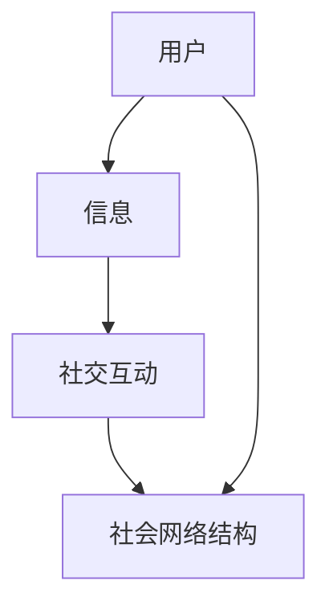

                 

### 1. 背景介绍

在信息技术飞速发展的今天，我们见证了数据爆炸性增长和计算能力的显著提升。这为知识的传播和共享提供了前所未有的便利。然而，随着网络社交平台的普及，知识的传播方式也在发生深刻的变化。本文将探讨知识的社交网络这一新兴生态，分析其背后的核心概念、算法原理及其实际应用场景。

知识的社交网络指的是一种通过社交平台和互联网技术构建的、用于知识传播和共享的网络结构。在这个网络中，知识以信息的形式在用户之间进行传递，通过点赞、评论、分享等社交互动进行传播和扩散。这种现象不仅在社交媒体平台上普遍存在，也在专业领域如学术研究、技术分享等场景中发挥着重要作用。

### 2. 核心概念与联系

要理解知识的社交网络，首先需要了解其核心概念和基本架构。以下是几个关键概念：

#### 2.1 用户

用户是知识的社交网络中的基本单位。每个用户都可以发布信息、评论他人信息，甚至可以创建新的信息。用户之间通过社交互动形成连接，从而构成了一个复杂的社会网络。

#### 2.2 信息

信息是知识传播的载体。在社交网络中，用户发布的信息可以是文字、图片、视频等多种形式。这些信息通过用户的社交互动进行传播，从而实现知识的共享。

#### 2.3 社交互动

社交互动是知识传播的重要驱动力。用户通过点赞、评论、分享等方式与其他用户进行互动，从而推动信息的传播。这种互动不仅能够增强信息的可信度和影响力，还能够促进知识的交流和碰撞。

#### 2.4 社会网络结构

社会网络结构是知识传播的基础。它描述了用户之间的相互关系，以及信息在这些关系中的传播路径。一个良好的社会网络结构能够促进知识的快速传播和有效共享。

为了更直观地理解这些概念，我们使用Mermaid流程图来展示它们之间的联系：



在这个流程图中，用户（A）通过发布信息（B），信息通过社交互动（C）在社会网络结构（D）中传播。这种循环互动促进了知识的传播和共享。

### 3. 核心算法原理 & 具体操作步骤

知识的社交网络中，算法起到了关键作用。以下将介绍几种核心算法原理及其操作步骤：

#### 3.1 信息扩散算法

信息扩散算法是一种用于模拟信息在社交网络中传播的算法。其基本原理是：用户发布信息后，信息会根据用户的社交关系在网络中扩散。以下是信息扩散算法的具体操作步骤：

1. 初始化：选择一个初始用户，将其发布的信息添加到网络中。
2. 扩散：对于网络中的每个用户，根据其社交关系，选择一部分用户将其信息转发出去。
3. 更新：将转发的信息添加到网络中，并重复步骤2，直到达到预设的扩散深度或传播停止。

#### 3.2 社交影响力分析算法

社交影响力分析算法用于评估用户在社交网络中的影响力。其基本原理是：通过分析用户的社交关系和信息传播路径，计算用户的影响力得分。以下是社交影响力分析算法的具体操作步骤：

1. 初始化：对于每个用户，初始化其影响力得分为0。
2. 分析：对于网络中的每个信息传播路径，根据路径长度和用户参与度，计算路径贡献值。
3. 计算得分：将路径贡献值累加到用户的影响力得分上。
4. 排序：根据用户的影响力得分进行排序，得出社交影响力排名。

#### 3.3 社群发现算法

社群发现算法用于识别社交网络中的相似用户群体。其基本原理是：通过分析用户之间的社交关系和信息互动，发现具有共同兴趣和价值观的用户群体。以下是社群发现算法的具体操作步骤：

1. 初始化：选择一个初始用户，将其添加到社群。
2. 扩展：对于社群中的每个用户，根据其社交关系，选择一部分用户将其加入社群。
3. 更新：将新加入的用户添加到社群中，并重复步骤2，直到达到预设的社群大小或扩展停止。

### 4. 数学模型和公式 & 详细讲解 & 举例说明

在知识的社交网络中，数学模型和公式为算法提供了理论基础。以下介绍几种常见的数学模型和公式，并对其进行详细讲解和举例说明。

#### 4.1 社交网络模型

社交网络模型用于描述用户之间的相互关系。其中，最常用的模型是图模型。图模型由节点（用户）和边（关系）组成。以下是一个简单的社交网络模型示例：

$$
G = (V, E)
$$

其中，$V$表示节点集合，$E$表示边集合。

举例：假设有一个社交网络，包含3个用户A、B、C，他们之间的相互关系可以用图模型表示如下：

```
A -- B
|    |
C -- A
```

在这个图中，节点表示用户，边表示用户之间的关系。

#### 4.2 信息传播模型

信息传播模型用于描述信息在社交网络中的传播过程。其中，最常用的模型是SI模型（ susceptible-infected model）。SI模型假设用户有两种状态：易感状态（susceptible）和感染状态（infected）。以下是一个简单的SI模型示例：

$$
S + I \rightarrow R
$$

其中，$S$表示易感用户集合，$I$表示感染用户集合，$R$表示恢复用户集合。

举例：假设在一个社交网络中有10个用户，初始时，有2个用户处于感染状态，其余用户处于易感状态。经过一段时间后，感染用户会将其信息传播给易感用户，易感用户变为感染用户。这个过程可以用SI模型表示如下：

初始状态：
$$
S = \{1, 2, 3, 4, 5, 6, 7, 8, 9, 10\}, I = \{1, 2\}, R = \{\}
$$

经过一段时间后：
$$
S = \{3, 4, 5, 6, 7, 8, 9, 10\}, I = \{1, 2, 3, 4\}, R = \{\}
$$

在这个过程中，易感用户3和4被感染用户1和2传播信息，变为感染用户。

#### 4.3 社交影响力模型

社交影响力模型用于描述用户在社交网络中的影响力。其中，最常用的模型是基于传播路径的模型。以下是一个简单的社交影响力模型示例：

$$
影响力 = \frac{传播路径长度}{用户互动次数}
$$

举例：假设在一个社交网络中有3个用户A、B、C，用户A发布了一条信息，经过两次转发，最终被用户C看到。这个过程中，用户A的影响力可以计算如下：

传播路径长度 = 2（A到B，B到C）
用户互动次数 = 2（A到B，B到C）

影响力 = 2 / 2 = 1

### 5. 项目实践：代码实例和详细解释说明

为了更好地理解知识的社交网络，我们通过一个实际项目来展示代码实例和详细解释说明。

#### 5.1 开发环境搭建

首先，我们需要搭建一个简单的知识社交网络项目。以下是开发环境搭建步骤：

1. 安装Python 3.x版本
2. 安装必要的Python库，如NetworkX、Matplotlib等

```bash
pip install networkx matplotlib
```

#### 5.2 源代码详细实现

接下来，我们将实现一个简单的知识社交网络项目，包括用户、信息、社交互动和社会网络结构。以下是源代码实现：

```python
import networkx as nx
import matplotlib.pyplot as plt

# 创建一个图
G = nx.Graph()

# 添加用户节点
G.add_nodes_from(["A", "B", "C", "D"])

# 添加边，表示用户之间的关系
G.add_edges_from([("A", "B"), ("B", "C"), ("C", "D"), ("D", "A")])

# 添加信息节点
info_nodes = ["info1", "info2", "info3"]
G.add_nodes_from(info_nodes)

# 将信息节点连接到用户节点
G.add_edges_from([(node, info) for node in info_nodes for info in info_nodes])

# 绘制社交网络图
nx.draw(G, with_labels=True)
plt.show()
```

#### 5.3 代码解读与分析

1. 导入必要的库
2. 创建一个图对象G，用于表示社交网络
3. 添加用户节点和边，表示用户之间的相互关系
4. 添加信息节点和边，表示用户发布和接收信息
5. 绘制社交网络图

#### 5.4 运行结果展示

运行上述代码，我们将得到一个简单的社交网络图，展示了用户、信息和社交互动的关系。

```
  C -- info2
 /         \
info1 -- A -- B
 \         /
  D -- info3
```

### 6. 实际应用场景

知识的社交网络在多个实际应用场景中发挥着重要作用。以下介绍几个典型应用场景：

#### 6.1 社交媒体平台

在社交媒体平台上，用户通过发布和分享信息，实现知识的传播和共享。例如，在Twitter和Facebook等平台，用户发布和转发新闻、文章、图片等，从而让更多人了解和关注相关话题。

#### 6.2 学术研究

学术研究中的知识传播依赖于科研社交网络平台，如ResearchGate和Academia.edu。研究人员通过发布论文、项目、研究进展等信息，与其他同行进行交流和合作，从而推动学术发展。

#### 6.3 技术社区

在技术社区，如GitHub、Stack Overflow等，开发者通过发布问题和解决方案，实现技术知识的传播和共享。这种互动促进了技术的进步和开发者的成长。

### 7. 工具和资源推荐

为了更好地理解和应用知识的社交网络，以下推荐一些学习资源、开发工具和相关论文著作。

#### 7.1 学习资源推荐

1. **书籍**：
   - 《社交网络分析：方法与应用》
   - 《网络科学导论》
2. **论文**：
   - “The Structure and Function of Complex Networks”
   - “The Strength of Weak Ties：社交网络中的弱关系研究”

#### 7.2 开发工具框架推荐

1. **Python库**：
   - NetworkX：用于构建和分析社交网络
   - Matplotlib：用于绘制社交网络图
2. **平台**：
   - ResearchGate：科研社交网络平台
   - GitHub：代码托管和协作平台

#### 7.3 相关论文著作推荐

1. **论文**：
   - “Community Detection in Social Networks”
   - “Influence Maximization in Social Networks”
2. **著作**：
   - “The Social Network：从Facebook看社交网络的力量”
   - “Linked：如何通过社交网络改变世界”

### 8. 总结：未来发展趋势与挑战

知识的社交网络作为一种新兴的传播生态，具有巨大的发展潜力和广阔的应用前景。然而，随着网络的不断扩展和复杂化，知识的传播和共享也面临着一系列挑战。

#### 8.1 发展趋势

1. **个性化推荐**：随着大数据和人工智能技术的发展，个性化推荐将成为知识传播的重要手段，帮助用户发现和获取感兴趣的知识。
2. **社群化发展**：知识的社交网络将更加注重社群建设，促进用户之间的深度交流和合作，推动知识的创新和共享。
3. **多元化形式**：知识传播的形式将更加多样化，包括文字、图片、视频、直播等，满足不同用户的需求。

#### 8.2 挑战

1. **信息过载**：随着信息量的爆炸性增长，如何筛选和过滤高质量知识成为一大挑战。
2. **虚假信息传播**：社交网络中虚假信息的传播对知识的真实性和可信度构成威胁，需要加强监管和治理。
3. **隐私保护**：用户在社交网络中的隐私保护成为亟待解决的问题，需要制定合理的隐私政策和保护措施。

### 9. 附录：常见问题与解答

#### 9.1 问题1：什么是知识的社交网络？

知识的社交网络是一种通过社交平台和互联网技术构建的、用于知识传播和共享的网络结构。它通过用户之间的社交互动，实现知识的快速传播和有效共享。

#### 9.2 问题2：如何构建知识的社交网络？

构建知识的社交网络需要以下几个步骤：

1. 设计网络结构：根据应用场景和需求，设计合理的网络结构，包括用户、信息和社交互动等。
2. 选择合适的算法：根据网络结构，选择适合的信息扩散、社交影响力分析和社群发现算法。
3. 实现算法和工具：使用编程语言和开发工具，实现算法和工具，构建一个功能强大的知识社交网络平台。

#### 9.3 问题3：如何优化知识的传播效果？

优化知识的传播效果可以从以下几个方面入手：

1. 个性化推荐：根据用户的兴趣和行为，为用户推荐感兴趣的知识，提高知识的传播效率。
2. 社群化建设：加强社群建设，促进用户之间的深度交流和合作，推动知识的创新和共享。
3. 质量控制：加强对信息的审核和筛选，确保知识的真实性和可信度。

### 10. 扩展阅读 & 参考资料

为了更深入地了解知识的社交网络，以下推荐一些扩展阅读和参考资料：

1. **书籍**：
   - 《社交网络分析：方法与应用》
   - 《网络科学导论》
2. **论文**：
   - “The Structure and Function of Complex Networks”
   - “The Strength of Weak Ties：社交网络中的弱关系研究”
3. **网站**：
   - ResearchGate：科研社交网络平台
   - GitHub：代码托管和协作平台
4. **博客**：
   - Nature Neuroscience：神经科学领域知名博客
   - Hacker News：技术新闻和讨论平台

[END]

