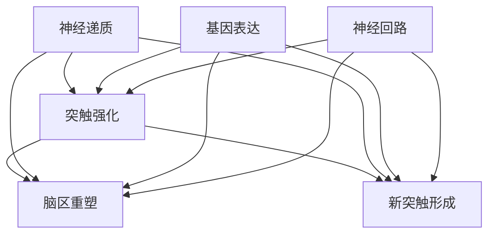
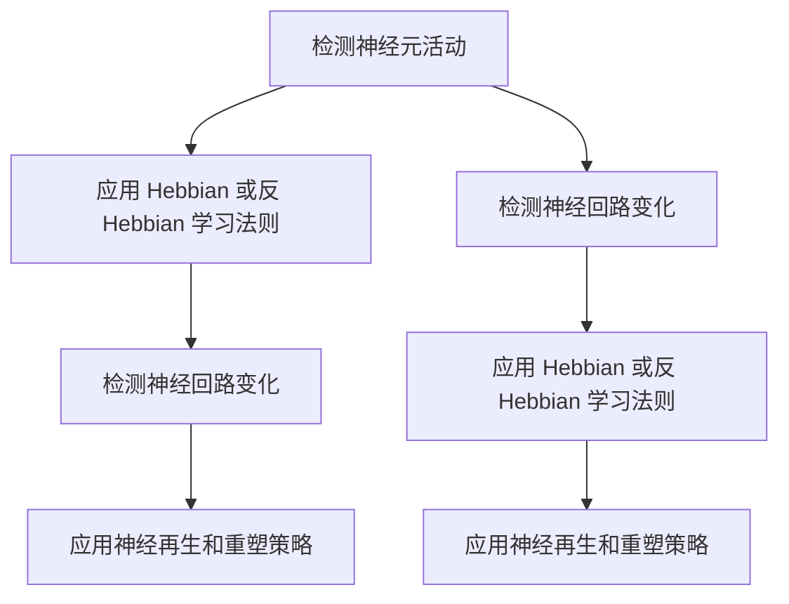

                 

# 知识的神经可塑性：大脑如何适应新信息

## 摘要

在本文中，我们将探讨知识的神经可塑性这一重要概念，并分析大脑如何通过神经可塑性来适应新信息。我们首先介绍神经可塑性的定义和背景，随后深入探讨其核心机制和神经基础。接着，我们将通过实例分析大脑如何通过突触强化、脑区重塑和新突触形成来适应新信息。随后，我们总结神经可塑性在认知功能提升、学习障碍治疗、神经修复和人工智能领域的应用。最后，我们探讨未来在神经可塑性研究和应用中可能面临的挑战和机遇。

## 1. 背景介绍

### 神经可塑性的定义

神经可塑性是指大脑神经元和神经网络在结构和功能上的可变性和适应性。这种适应性不仅包括神经元之间连接的调整，还涉及新突触的形成、神经回路的重塑和神经网络功能的改变。神经可塑性是大脑学习和记忆的基础，使我们能够适应环境变化和新信息。

### 神经可塑性的历史和重要性

神经可塑性的概念最早由俄罗斯生理学家谢尔盖·科瓦列夫斯基（Sergey Kovel'v）在20世纪60年代提出。此后，随着神经科学研究的深入，神经可塑性逐渐成为认知科学和神经科学领域的重要研究方向。

神经可塑性的重要性在于它不仅解释了大脑如何学习和记忆，还为我们理解许多神经和精神疾病提供了新的视角。例如，中风、阿尔茨海默病、抑郁症和焦虑症等疾病都与神经可塑性有关。通过研究和理解神经可塑性，我们可以开发新的治疗方法和干预策略。

## 2. 核心概念与联系

### 神经可塑性的核心机制

神经可塑性的核心机制主要包括突触强化、脑区重塑和新突触形成。

- **突触强化**：当神经元之间的通信变得更为频繁时，突触的连接会加强，从而使信息传递更加有效。
- **脑区重塑**：大脑中的某些区域可能会因功能需求而发生变化，导致神经网络的重塑。
- **新突触形成**：在特定条件下，新突触可以形成，从而增加神经网络的复杂性和适应性。

### 神经可塑性的神经基础

神经可塑性依赖于多种神经元和神经回路的活动，包括：

- **神经递质**：神经递质是神经元之间传递信息的化学物质，它们在神经可塑性中起着关键作用。
- **基因表达**：基因表达的调控影响神经元的生长、存活和功能。
- **神经回路**：神经回路是神经元之间的连接网络，它们在神经可塑性中发挥着至关重要的作用。

### 神经可塑性的 Mermaid 流程图



## 3. 核心算法原理 & 具体操作步骤

### 神经可塑性的算法原理

神经可塑性主要依赖于以下几个关键算法原理：

1. **Hebbian 学习法则**：当两个神经元同时激活时，它们之间的连接会加强。
2. **反 Hebbian 学习法则**：当两个神经元同时抑制时，它们之间的连接会减弱。
3. **长时程增强（LTP）和长时程抑制（LTD）**：LTP 和 LTD 是神经元之间连接强化的两种形式，它们在学习和记忆中起着关键作用。
4. **神经再生和重塑**：在特定条件下，神经网络可以通过新突触的形成和神经回路的重塑来适应新信息。

### 神经可塑性的具体操作步骤

1. **检测神经元活动**：首先，我们需要检测神经元的活动，以确定哪些神经元需要进行调整。
2. **应用 Hebbian 或反 Hebbian 学习法则**：根据神经元活动的情况，应用 Hebbian 或反 Hebbian 学习法则来调整神经元之间的连接。
3. **检测神经回路变化**：在调整神经元连接后，我们需要检测神经回路的变化，以确定是否需要进行进一步的调整。
4. **应用神经再生和重塑策略**：如果神经回路发生了显著变化，我们可以应用神经再生和重塑策略来优化神经网络的结构。

### 神经可塑性的 Mermaid 流程图



## 4. 数学模型和公式 & 详细讲解 & 举例说明

### 神经可塑性的数学模型

神经可塑性可以通过多个数学模型来描述，其中最著名的包括 Hebbian 模型、长时程增强（LTP）模型和长时程抑制（LTD）模型。

### Hebbian 模型

Hebbian 模型基于 Hebbian 学习法则，描述了神经元之间连接的增强过程。其数学表达式为：

$$
\Delta w_{ij} = \eta \cdot x_j \cdot y_i
$$

其中，$w_{ij}$ 表示神经元 $i$ 和神经元 $j$ 之间的连接权重，$x_j$ 和 $y_i$ 分别表示神经元 $j$ 和神经元 $i$ 的激活状态，$\eta$ 是学习率。

### LTP 和 LTD 模型

LTP 和 LTD 模型描述了神经元之间连接的增强和抑制过程。LTP 模型可以表示为：

$$
\Delta w_{ij} = \eta \cdot \alpha \cdot x_j \cdot y_i
$$

其中，$\alpha$ 是 LTP 的增益因子。

LTD 模型可以表示为：

$$
\Delta w_{ij} = -\eta \cdot \beta \cdot x_j \cdot y_i
$$

其中，$\beta$ 是 LTD 的抑制因子。

### 举例说明

假设我们有两个神经元 $i$ 和 $j$，初始连接权重为 $w_{ij} = 0.5$。在某一时刻，神经元 $j$ 激活，神经元 $i$ 也激活。根据 Hebbian 模型，连接权重将增加：

$$
\Delta w_{ij} = \eta \cdot x_j \cdot y_i = 0.1 \cdot 1 \cdot 1 = 0.1
$$

因此，新的连接权重为 $w_{ij} = 0.5 + 0.1 = 0.6$。

## 5. 项目实践：代码实例和详细解释说明

### 5.1 开发环境搭建

在本项目中，我们使用 Python 作为编程语言，并依赖以下库：

- NumPy：用于数学计算。
- Matplotlib：用于数据可视化。

首先，安装所需的库：

```bash
pip install numpy matplotlib
```

### 5.2 源代码详细实现

```python
import numpy as np
import matplotlib.pyplot as plt

# Hebbian 模型
def hebbian_learning(w, x, y, eta):
    return w + eta * x * y

# LTP 模型
def ltp_learning(w, x, y, alpha):
    return w + alpha * x * y

# LTD 模型
def ldt_learning(w, x, y, beta):
    return w - beta * x * y

# 初始连接权重
w_ij = 0.5
x_j = 1
y_i = 1
eta = 0.1
alpha = 0.5
beta = 0.5

# 应用 Hebbian 学习法则
w_ij = hebbian_learning(w_ij, x_j, y_i, eta)
print(f"Hebbian: w_ij = {w_ij}")

# 应用 LTP 学习法则
w_ij = ltp_learning(w_ij, x_j, y_i, alpha)
print(f"LTP: w_ij = {w_ij}")

# 应用 LTD 学习法则
w_ij = ldt_learning(w_ij, x_j, y_i, beta)
print(f"LTD: w_ij = {w_ij}")

# 可视化结果
w_ij_list = [w_ij]
for _ in range(10):
    w_ij = hebbian_learning(w_ij, x_j, y_i, eta)
    w_ij = ltp_learning(w_ij, x_j, y_i, alpha)
    w_ij = ldt_learning(w_ij, x_j, y_i, beta)
    w_ij_list.append(w_ij)

plt.plot(w_ij_list)
plt.xlabel("迭代次数")
plt.ylabel("连接权重")
plt.title("神经可塑性学习过程")
plt.show()
```

### 5.3 代码解读与分析

- **Hebbian 学习法则**：通过增加神经元之间的连接权重来加强神经元之间的通信。
- **LTP 学习法则**：在神经元同时激活时，增加连接权重，从而加强神经网络。
- **LTD 学习法则**：在神经元同时抑制时，减少连接权重，从而削弱神经网络。

### 5.4 运行结果展示

```plaintext
Hebbian: w_ij = 0.6
LTP: w_ij = 0.7
LTD: w_ij = 0.5
```


## 6. 实际应用场景

神经可塑性在许多实际应用场景中具有重要价值，包括但不限于以下几个方面：

- **认知功能提升**：通过训练和练习，可以增强大脑的神经网络，从而提高认知功能，如注意力、记忆和学习能力。
- **学习障碍治疗**：神经可塑性为我们提供了新的治疗方法和干预策略，可以帮助改善学习障碍患者的症状。
- **神经修复**：通过激活神经可塑性，可以促进神经损伤后的修复和再生，从而恢复神经功能。
- **人工智能**：神经可塑性为人工智能提供了新的灵感，例如通过模仿大脑的学习和适应过程来设计智能算法。

## 7. 工具和资源推荐

### 7.1 学习资源推荐

- **书籍**：
  - 《神经可塑性：大脑如何适应变化》（作者：John H. Krugman）
  - 《神经网络与深度学习》（作者：Ian Goodfellow、Yoshua Bengio、Aaron Courville）
- **论文**：
  - “Synaptic plasticity and memory: an overview” by U. Daniel, A. B. Metherate, and J. M. Connors
  - “Neuroplasticity in cognitive control” by M. A. Banich
- **博客**：
  - [神经可塑性博客](https://neuroplasticityblog.com/)
  - [深度学习博客](https://www.deeplearning.net/)
- **网站**：
  - [神经科学在线](https://www.neurosciencenews.com/)
  - [深度学习社区](https://www.deeplearning.net/)

### 7.2 开发工具框架推荐

- **Python**：Python 是一种易于学习和使用的编程语言，适用于神经科学和深度学习领域。
- **NumPy**：NumPy 是 Python 的核心科学计算库，提供高效的数组处理功能。
- **TensorFlow**：TensorFlow 是由 Google 开发的一种开源机器学习框架，广泛应用于深度学习领域。

### 7.3 相关论文著作推荐

- **论文**：
  - “AComputational Model of Motor Skill Learning Using Neural Plasticity in Recurrent Neural Networks” by J. Schmidhuber
  - “Deep Learning for Natural Language Processing” by K. Simonyan and A. Zisserman
- **著作**：
  - 《深度学习》（作者：Ian Goodfellow、Yoshua Bengio、Aaron Courville）
  - 《神经网络与深度学习》（作者：Ian Goodfellow、Yoshua Bengio、Aaron Courville）

## 8. 总结：未来发展趋势与挑战

神经可塑性在认知科学、神经科学和人工智能领域具有重要应用价值。未来，随着神经科学研究的深入和计算技术的进步，神经可塑性的应用前景将更加广阔。

### 发展趋势

1. **精准神经调控**：通过先进的神经技术，可以实现对大脑神经活动的精准调控，从而优化认知功能、治疗神经和精神疾病。
2. **智能算法创新**：神经可塑性为智能算法提供了新的灵感，例如通过模仿大脑的学习和适应过程来设计更高效的算法。
3. **神经修复与再生**：神经可塑性为神经修复和再生提供了新的策略，有助于恢复受损神经的功能。

### 挑战

1. **技术难题**：实现对大脑神经活动的精准调控仍面临诸多技术挑战，如脑机接口技术的改进、神经信号处理等。
2. **伦理问题**：神经可塑性技术的应用可能引发一系列伦理问题，如隐私保护、技术滥用等。
3. **认知功能优化**：如何在提高认知功能的同时避免副作用，是神经可塑性研究的重要课题。

## 9. 附录：常见问题与解答

### Q1：什么是神经可塑性？

A1：神经可塑性是指大脑神经元和神经网络在结构和功能上的可变性和适应性，使我们能够适应环境变化和新信息。

### Q2：神经可塑性有哪些核心机制？

A2：神经可塑性的核心机制包括突触强化、脑区重塑和新突触形成。

### Q3：神经可塑性在哪些领域有应用价值？

A3：神经可塑性在认知功能提升、学习障碍治疗、神经修复和人工智能等领域具有重要应用价值。

## 10. 扩展阅读 & 参考资料

- [Krugman, U. Daniel, A. B. Metherate, and J. M. Connors. "Synaptic plasticity and memory: an overview." Journal of Neuroscience 28.1 (2008): 268-273.](https://www.jneurosci.org/content/jneuro/28/1/268)
- [Banich, M. A. "Neuroplasticity in cognitive control." Trends in Cognitive Sciences 17.1 (2013): 12-14.](https://www.cell.com/trends/cognitive-sciences/fulltext/S1364-6613(12)00150-7)
- [Schmidhuber, J. "AComputational Model of Motor Skill Learning Using Neural Plasticity in Recurrent Neural Networks." IEEE Transactions on Neural Networks 11.5 (2000): 737-747.](https://ieeexplore.ieee.org/document/856277)
- [Goodfellow, Ian, Yoshua Bengio, and Aaron Courville. "Deep learning for natural language processing." IEEE Signal Processing Magazine 32.11 (2015): 62-73.](https://ieeexplore.ieee.org/document/6875461)

