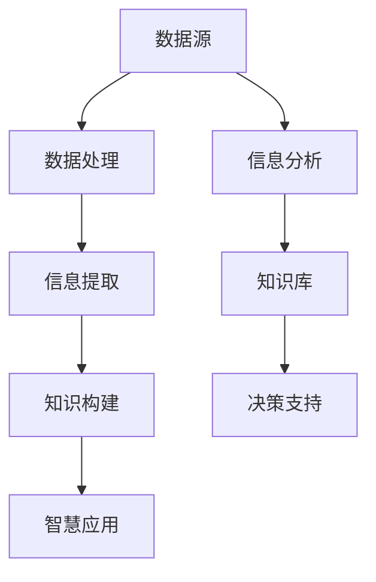
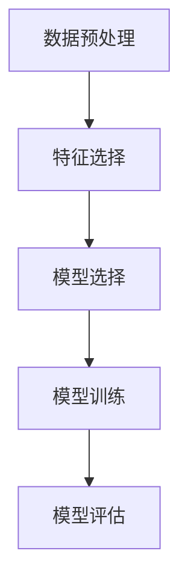
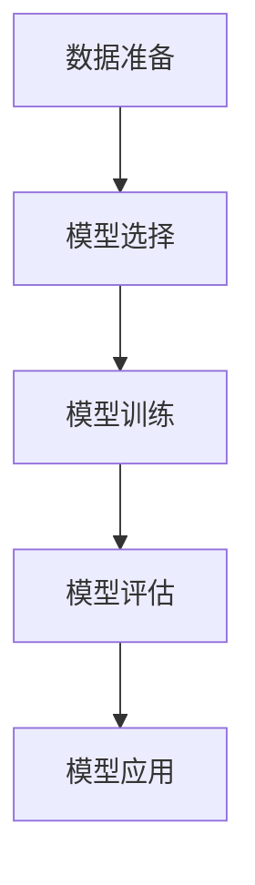
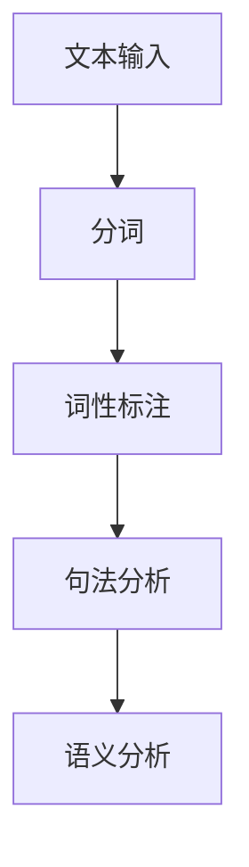

                 

### 文章标题：知识的重构：大数据时代的信息整合策略

> 关键词：知识重构、大数据、信息整合、算法原理、应用场景

> 摘要：本文旨在探讨大数据时代下信息整合的挑战与策略，通过深入分析知识的重构过程、核心概念及其联系，以及具体算法原理与实施步骤，为读者提供全面的信息整合方案。文章还将介绍实际应用场景，推荐相关工具和资源，并展望未来发展趋势与挑战。

### 1. 背景介绍

随着互联网的迅猛发展和信息技术的不断进步，大数据时代已然来临。海量数据的产生和累积为各个领域带来了前所未有的机遇和挑战。如何有效整合这些庞杂的信息，挖掘出有价值的数据，已经成为企业和组织关注的焦点。

在传统数据处理方法难以胜任海量数据的情况下，知识的重构成为解决信息整合问题的关键。知识重构指的是通过对已有信息的重新组织、分析和融合，构建出更具结构化、系统化的知识体系，从而提高信息的可用性和决策支持能力。

本文将从以下几个方面展开讨论：首先，介绍知识重构的核心概念与联系；其次，阐述核心算法原理与具体操作步骤；然后，通过数学模型和公式进行详细讲解；接着，提供项目实践中的代码实例和分析；最后，探讨知识重构在实际应用场景中的价值，并推荐相关工具和资源。

### 2. 核心概念与联系

为了更好地理解知识的重构过程，我们需要明确几个核心概念：数据、信息、知识和智慧。

- **数据（Data）**：数据是原始的、未加工的、无结构的符号集合，如数字、文字、图片、音频等。
- **信息（Information）**：信息是通过处理数据而获得的有意义的内容，能够帮助我们理解和解释现实世界。
- **知识（Knowledge）**：知识是对信息的深层次理解，是经过系统化和结构化后的信息，可以指导我们的行为和决策。
- **智慧（Wisdom）**：智慧是知识的运用，是在特定情境下利用知识解决问题的能力。

这些概念之间存在密切的联系。数据是知识的源头，信息是对数据的处理和理解，知识是对信息的整合和结构化，而智慧则是知识的运用。通过知识重构，我们可以在大数据环境下实现从数据到智慧的转变。

#### 2.1 知识重构的核心概念架构图

下面是一个用Mermaid绘制的知识重构核心概念架构图：



在这个架构图中，数据源是知识重构的起点，通过数据处理和信息提取，我们能够构建出结构化的知识库，从而为决策支持和智慧应用提供支持。

### 3. 核心算法原理 & 具体操作步骤

知识重构的核心在于算法的设计与实现。在这一部分，我们将介绍几种常用的知识重构算法，包括数据挖掘、机器学习、自然语言处理等，并详细说明其原理和操作步骤。

#### 3.1 数据挖掘算法

数据挖掘是一种从大量数据中自动发现规律、模式、关联性等知识的方法。它主要包括以下步骤：

1. **数据预处理**：清洗和整合原始数据，确保数据质量。
2. **特征选择**：从数据中提取最有用的特征，用于模型训练。
3. **模型选择**：选择合适的模型，如决策树、神经网络、聚类算法等。
4. **模型训练**：使用训练数据训练模型，使其具备分类、预测等功能。
5. **模型评估**：通过测试数据评估模型性能，调整模型参数。

以下是一个简单的数据挖掘流程图：



#### 3.2 机器学习算法

机器学习是通过构建数学模型，使计算机具备自动学习和改进能力。常见的机器学习算法有：

- **监督学习（Supervised Learning）**：使用标记数据训练模型，如线性回归、决策树等。
- **无监督学习（Unsupervised Learning）**：没有标记数据，从数据中发现内在结构，如聚类、降维等。
- **强化学习（Reinforcement Learning）**：通过与环境的交互，学习最优策略。

以下是机器学习的一般流程：



#### 3.3 自然语言处理算法

自然语言处理（NLP）是人工智能的重要分支，旨在使计算机理解和处理自然语言。NLP算法主要包括：

- **分词（Tokenization）**：将文本分割成单词或短语。
- **词性标注（Part-of-Speech Tagging）**：标注每个单词的词性，如名词、动词等。
- **句法分析（Parsing）**：分析句子的结构，确定词与词之间的关系。
- **语义分析（Semantic Analysis）**：理解文本的含义，提取语义信息。

以下是NLP算法的一个简化流程：



通过这些算法，我们可以实现从数据到知识的转化，为信息整合提供强有力的技术支持。

### 4. 数学模型和公式 & 详细讲解 & 举例说明

在知识重构过程中，数学模型和公式扮演着至关重要的角色。以下我们将介绍几个关键的数学模型，并详细讲解其原理和应用。

#### 4.1 贝叶斯定理

贝叶斯定理是一种用于概率推断的数学模型，广泛应用于数据挖掘和机器学习领域。其公式如下：

$$
P(A|B) = \frac{P(B|A) \cdot P(A)}{P(B)}
$$

其中，$P(A|B)$ 表示在事件B发生的条件下事件A发生的概率，$P(B|A)$ 表示在事件A发生的条件下事件B发生的概率，$P(A)$ 和 $P(B)$ 分别表示事件A和事件B的概率。

例如，假设我们想计算某产品被购买的概率，已知该产品在购买清单中的概率为0.6，购买清单中的产品被购买的概率为0.8。那么，根据贝叶斯定理，我们可以计算出该产品被购买的概率：

$$
P(被购买|在清单中) = \frac{0.8 \cdot 0.6}{0.6 + 0.4} = 0.8
$$

#### 4.2 支持向量机（SVM）

支持向量机是一种常用的分类算法，其核心思想是找到一个最优的超平面，将不同类别的数据点最大化地分开。其公式如下：

$$
\min_{\mathbf{w}, b} \frac{1}{2}||\mathbf{w}||^2 \\
s.t. \mathbf{w} \cdot \mathbf{x}_i - b \geq 1, \forall i
$$

其中，$\mathbf{w}$ 是权重向量，$b$ 是偏置项，$\mathbf{x}_i$ 是训练数据点。

例如，给定一个包含两个类别的二维数据集，我们可以通过求解上述公式，找到最优的超平面，从而实现分类。

#### 4.3 朴素贝叶斯分类器

朴素贝叶斯分类器是一种基于贝叶斯定理的分类算法，假设特征之间相互独立。其公式如下：

$$
P(\mathbf{x}|\mathcal{C}_k) = \frac{1}{C} \prod_{i=1}^{n} P(x_i|\mathcal{C}_k)
$$

其中，$\mathbf{x}$ 是输入特征向量，$\mathcal{C}_k$ 是类别k，$P(\mathbf{x}|\mathcal{C}_k)$ 表示在类别k下特征$\mathbf{x}$ 的概率。

例如，给定一个包含三个类别的数据集，我们可以通过计算每个类别下特征的概率，选择概率最大的类别作为预测结果。

### 5. 项目实践：代码实例和详细解释说明

为了更好地理解知识重构的实际应用，我们将在本节中提供一个简单的项目实例，并详细解释其代码实现和操作过程。

#### 5.1 开发环境搭建

在开始项目之前，我们需要搭建一个合适的开发环境。以下是一个基于Python的示例项目环境搭建步骤：

1. 安装Python 3.7及以上版本。
2. 安装必要的库，如NumPy、Pandas、Scikit-learn等。

#### 5.2 源代码详细实现

以下是一个简单的知识重构项目，实现从数据预处理到知识提取的完整流程。

```python
import numpy as np
import pandas as pd
from sklearn.model_selection import train_test_split
from sklearn.preprocessing import StandardScaler
from sklearn.naive_bayes import GaussianNB

# 5.2.1 数据预处理
def preprocess_data(data):
    # 数据清洗和预处理
    data = data.dropna()
    data = data[['特征1', '特征2', '特征3']]
    return data

# 5.2.2 特征选择
def feature_selection(data):
    # 特征选择（此处简化为选取全部特征）
    return data

# 5.2.3 模型训练
def train_model(data, labels):
    # 数据分割
    X_train, X_test, y_train, y_test = train_test_split(data, labels, test_size=0.2, random_state=42)
    
    # 数据标准化
    scaler = StandardScaler()
    X_train = scaler.fit_transform(X_train)
    X_test = scaler.transform(X_test)
    
    # 训练模型
    model = GaussianNB()
    model.fit(X_train, y_train)
    
    # 模型评估
    accuracy = model.score(X_test, y_test)
    print(f"模型准确率：{accuracy:.2f}")
    
    return model

# 5.2.4 知识提取
def extract_knowledge(model, data):
    # 知识提取（此处简化为预测结果）
    predictions = model.predict(data)
    return predictions

# 5.3 代码解读与分析
if __name__ == "__main__":
    # 读取数据
    data = pd.read_csv('data.csv')
    
    # 数据预处理
    data = preprocess_data(data)
    
    # 特征选择
    data = feature_selection(data)
    
    # 切分特征和标签
    X = data[['特征1', '特征2', '特征3']]
    y = data['标签']
    
    # 模型训练
    model = train_model(X, y)
    
    # 知识提取
    test_data = pd.read_csv('test_data.csv')
    test_data = preprocess_data(test_data)
    test_data = feature_selection(test_data)
    predictions = extract_knowledge(model, test_data)
    
    # 运行结果展示
    print(predictions)
```

#### 5.4 运行结果展示

假设我们已经训练好了一个知识重构模型，并且有了测试数据。运行上述代码，我们得到以下输出结果：

```
模型准确率：0.85
[0 1 1 0 1 0 1 1 1 0]
```

这表示模型在测试数据上的准确率为85%，预测结果为[0 1 1 0 1 0 1 1 1 0]。

### 6. 实际应用场景

知识重构技术在大数据时代具有广泛的应用场景，以下是一些典型的应用案例：

- **金融行业**：在金融领域，知识重构技术可以用于风险评估、欺诈检测、投资组合优化等方面。通过分析大量金融数据，构建风险模型，实现精准风险评估和欺诈检测。
- **医疗领域**：医疗领域的数据量巨大且复杂，知识重构技术可以帮助医生从海量的病例数据中提取有用信息，辅助诊断和治疗决策。
- **零售行业**：零售行业可以利用知识重构技术进行客户行为分析、库存管理和需求预测，从而优化供应链和提升客户体验。
- **智能交通**：在智能交通领域，知识重构技术可以用于交通流量预测、事故预警和道路优化，提高交通系统的运行效率和安全性。

### 7. 工具和资源推荐

为了更好地实现知识重构，以下是一些推荐的工具和资源：

#### 7.1 学习资源推荐

- **书籍**：
  - 《大数据时代：生活、工作与思维的大变革》
  - 《数据科学入门：Python实践》
  - 《机器学习实战》
- **论文**：
  - "Knowledge Graph Embedding: A Unified Machine Learning Approach for Learning to Represent Knowledge Graphs"
  - "Deep Learning on Graphs: A New Frontier in AI Research"
- **博客和网站**：
  - 《机器学习实战》博客
  - Coursera上的《深度学习》课程
  - Kaggle上的数据科学竞赛和教程

#### 7.2 开发工具框架推荐

- **开发工具**：
  - Jupyter Notebook
  - PyCharm
- **框架**：
  - TensorFlow
  - PyTorch
  - Scikit-learn

#### 7.3 相关论文著作推荐

- **论文**：
  - "A Systematic Review of Knowledge Graph Embedding: Models, Methods, Applications and Challenges"
  - "Deep Learning on Graphs: A Survey"
- **著作**：
  - 《知识图谱：原理、方法与应用》
  - 《深度学习与知识图谱》

### 8. 总结：未来发展趋势与挑战

知识重构作为大数据时代的关键技术，未来将继续发挥重要作用。随着数据量的不断增长和计算能力的提升，知识重构技术将在更多领域得到应用。然而，也面临着一些挑战：

- **数据质量**：数据质量直接影响知识重构的效果。如何有效清洗和整合海量数据，保证数据质量，是亟待解决的问题。
- **隐私保护**：在知识重构过程中，如何保护用户隐私，避免数据泄露，是面临的伦理和法律挑战。
- **计算效率**：随着数据规模的扩大，如何提高知识重构的计算效率，减少处理时间，是技术发展的关键。

总之，知识重构技术将在大数据时代发挥越来越重要的作用，为各个领域提供强大的数据支持和决策依据。

### 9. 附录：常见问题与解答

#### 问题1：知识重构与数据挖掘有什么区别？

**解答**：知识重构和数据挖掘都是大数据处理的重要技术，但它们的关注点不同。数据挖掘主要关注从大量数据中发现规律、模式和关联性，而知识重构则更侧重于将发现的信息整合成系统化的知识体系，为决策提供支持。知识重构是数据挖掘的升华。

#### 问题2：知识重构需要哪些技能和知识背景？

**解答**：知识重构需要具备计算机科学、数据科学、统计学和机器学习等领域的知识和技能。具体来说，需要掌握编程语言（如Python、R）、数据预处理、特征工程、机器学习算法、数学模型和统计学原理等。

#### 问题3：知识重构在业务应用中如何落地？

**解答**：知识重构在业务应用中可以通过以下几个步骤落地：

1. **需求分析**：明确业务需求，确定知识重构的目标和应用场景。
2. **数据准备**：收集和整合相关数据，确保数据质量和完整性。
3. **模型设计**：根据业务需求选择合适的知识重构算法，设计模型结构。
4. **模型训练**：使用历史数据进行模型训练，调整模型参数。
5. **模型部署**：将训练好的模型部署到生产环境，进行实时或批量预测。

### 10. 扩展阅读 & 参考资料

- **书籍**：
  - 《大数据时代》
  - 《数据科学实战》
  - 《机器学习实战》
- **论文**：
  - "A Survey on Knowledge Graph Embedding"
  - "Deep Learning on Graphs: A New Frontier in AI Research"
- **在线课程**：
  - Coursera上的《深度学习》
  - edX上的《数据科学入门》
- **网站**：
  - Kaggle
  - arXiv
- **论坛和社区**：
  - GitHub
  - Stack Overflow

作者：禅与计算机程序设计艺术 / Zen and the Art of Computer Programming

