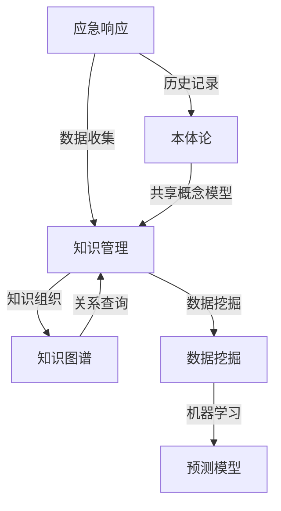

                 

### 背景介绍

知识管理在现代社会中扮演着至关重要的角色，尤其在应急响应领域。应急响应涉及多种突发事件的快速响应和处理，包括自然灾害、公共安全事件、技术故障等。这些事件往往具有不可预测性和高复杂性，要求相关人员能够迅速获取、理解和应用相关知识，以做出有效的决策和实施有效的应对措施。

知识管理是指通过系统化的方法来收集、组织、存储、分发和利用知识，以提高组织的知识水平和竞争力。在应急响应中，知识管理的重要性体现在以下几个方面：

1. **快速知识获取**：在突发事件发生后，时间至关重要。知识管理系统能够快速提供相关知识和信息，帮助应急响应人员迅速了解事件的性质、可能的影响以及已有的应对经验。

2. **知识共享与协同**：知识管理促进了组织内外的知识共享，使得不同部门、不同地区甚至不同组织之间的知识可以相互借鉴和利用，提高了应急响应的协同效应。

3. **历史记录与分析**：通过知识管理系统，应急响应单位可以记录每次事件的处理过程和结果，分析成功和失败的原因，不断优化应对策略和流程。

4. **预测与预防**：知识管理不仅关注突发事件的处理，还包括对潜在风险的识别和预防。通过历史数据和知识分析，可以预测可能发生的风险，采取预防措施，减少损失。

5. **持续学习与改进**：应急响应是一项不断发展的工作，知识管理系统能够支持持续学习，使组织能够不断适应新情况、新挑战。

本文将深入探讨知识管理在应急响应中的具体角色和作用，包括其核心概念、原理和架构，以及实际应用中的算法原理、数学模型、项目实践和工具资源推荐。通过这篇文章，希望读者能够对知识管理在应急响应中的重要性有更深刻的理解，并能够在实践中有效应用相关知识。

### 核心概念与联系

在深入探讨知识管理在应急响应中的角色之前，我们需要明确几个核心概念，并理解它们之间的相互关系。以下是本文中将会用到的一些关键概念：

1. **应急响应**：应急响应是指针对突发事件采取的一系列措施，旨在减轻事件的影响，保护人民生命财产安全，恢复正常社会秩序。

2. **知识管理**：知识管理是一种系统的方法，用于识别、获取、创建、存储、使用和传播知识，以支持组织的目标和决策。

3. **知识图谱**：知识图谱是一种结构化的知识表示方法，通过节点和边来表示实体及其相互关系，使得知识以图的形式进行组织和查询。

4. **本体论**：本体论是关于世界本质的理论，特别是在计算机科学中，本体论用于定义共享概念模型，使得不同系统之间的数据可以互操作。

5. **数据挖掘**：数据挖掘是从大量数据中提取有价值信息的过程，常用于发现事件之间的模式和关系。

6. **机器学习**：机器学习是人工智能的一个重要分支，通过训练模型来识别数据中的模式和趋势。

下面我们将通过一个Mermaid流程图来展示这些核心概念和它们之间的联系。



**流程说明：**
1. **应急响应**：在突发事件发生时，应急响应部门需要进行数据收集，包括事件信息、影响范围、资源需求等。

2. **知识管理**：收集到的数据进入知识管理系统，通过知识组织形成知识图谱，便于查询和共享。

3. **知识图谱**：知识图谱将事件相关的实体和关系以图形化方式展现，使得信息更加直观，有助于快速理解事件的全貌。

4. **数据挖掘**：利用知识管理系统中存储的大量数据，通过数据挖掘技术发现事件之间的关联性，提供决策支持。

5. **机器学习**：通过机器学习模型，对历史数据和实时数据进行训练，预测可能的趋势和结果，为决策提供科学依据。

6. **本体论**：本体论用于定义共享的概念模型，确保不同系统之间的数据具有一致性，便于知识的集成和共享。

通过这个流程，我们可以看到知识管理在应急响应中发挥着核心作用，它不仅帮助应急响应部门快速获取和处理信息，还通过知识图谱、数据挖掘和机器学习等技术手段，提高了应对突发事件的效率和准确性。

### 核心算法原理 & 具体操作步骤

在深入探讨知识管理在应急响应中的应用时，我们不得不提到几个关键算法，这些算法在知识获取、组织、分析和应用中扮演了重要的角色。下面，我们将分别介绍这些算法的原理和具体操作步骤。

#### 1. 知识获取算法

知识获取是知识管理的第一步，它涉及从各种来源收集数据和信息，并将其转化为可用的知识。以下是一个常见的知识获取算法——Web爬虫。

**原理：**
Web爬虫是一种自动化程序，用于从互联网上抓取信息。它按照特定的策略和规则，访问网页、提取内容，并跟随网页中的链接继续抓取，从而构建出一个庞大的数据集合。

**操作步骤：**
1. **选择爬虫策略**：确定爬虫的起始页面和爬取范围，选择深度优先或广度优先等策略。
2. **获取网页内容**：通过HTTP协议请求网页，解析网页内容，提取文本、图片、链接等信息。
3. **存储数据**：将提取的数据存储在数据库或其他数据存储系统中，便于后续处理和分析。
4. **去重和过滤**：对抓取的数据进行去重和过滤，去除重复、无关或错误的信息。

**示例：**
假设我们要从某个新闻网站抓取最新的疫情相关信息。

- **步骤1**：确定起始页面，如“www.example.com/news/coronavirus”。
- **步骤2**：使用HTTP请求获取网页内容，解析出标题、摘要和链接。
- **步骤3**：存储提取的信息，如存入MySQL数据库。
- **步骤4**：过滤掉非疫情相关的新闻，仅保留与疫情相关的信息。

#### 2. 知识组织算法

知识组织是指将获取到的知识进行结构化处理，以便于存储、查询和共享。常用的知识组织算法包括分类算法和聚类算法。

**原理：**
- **分类算法**：根据已知类别的特征，将新数据归类到相应的类别中。常见的分类算法有决策树、支持向量机、K近邻等。
- **聚类算法**：将数据点根据其特征相似度进行分组，形成多个簇。常见的聚类算法有K-means、层次聚类、DBSCAN等。

**操作步骤：**
1. **数据预处理**：对原始数据进行清洗、标准化等处理，确保数据质量。
2. **特征提取**：从数据中提取有助于分类或聚类的特征。
3. **模型训练**：使用训练数据集训练分类或聚类模型。
4. **分类或聚类**：对新数据进行分类或聚类，形成结构化的知识组织。

**示例：**
假设我们要对疫情相关的新闻进行分类，分为“疫情动态”、“防控措施”、“医疗资源”等类别。

- **步骤1**：预处理新闻文本，去除停用词、标点符号等。
- **步骤2**：使用词频、TF-IDF等方法提取特征。
- **步骤3**：使用支持向量机（SVM）训练分类模型。
- **步骤4**：对新的新闻文本进行分类，输出所属类别。

#### 3. 知识分析算法

知识分析是指利用算法分析知识，提取隐藏的模式和关系。常用的知识分析算法包括关联规则挖掘、异常检测等。

**原理：**
- **关联规则挖掘**：发现数据项之间的关联关系，常用的算法有Apriori算法、Eclat算法等。
- **异常检测**：检测数据中的异常点或异常模式，常用的算法有孤立森林、基于密度的方法等。

**操作步骤：**
1. **数据预处理**：去除噪声、填补缺失值等。
2. **特征选择**：选择有助于分析的特征。
3. **算法选择**：根据分析需求选择合适的算法。
4. **模式发现**：使用算法发现数据中的关联规则或异常点。

**示例：**
假设我们要分析疫情相关的新闻，发现不同新闻之间的关联关系。

- **步骤1**：预处理新闻文本，提取关键词。
- **步骤2**：使用Apriori算法挖掘新闻文本中的频繁项集。
- **步骤3**：根据频繁项集生成关联规则。
- **步骤4**：分析关联规则，发现疫情新闻之间的关联关系。

#### 4. 知识应用算法

知识应用是指将分析得到的模式或关系应用于实际的决策和行动中。常见的知识应用算法包括预测模型和优化算法。

**原理：**
- **预测模型**：使用历史数据建立预测模型，对未来的趋势进行预测。常见的模型有线性回归、决策树、神经网络等。
- **优化算法**：在给定约束条件下，寻找最优的解决方案。常见的算法有遗传算法、粒子群优化等。

**操作步骤：**
1. **数据准备**：收集并准备用于训练的数据。
2. **模型训练**：使用训练数据训练预测模型或优化算法。
3. **模型评估**：评估模型的性能，调整模型参数。
4. **知识应用**：将训练好的模型应用于实际场景，进行预测或优化。

**示例：**
假设我们要预测下一阶段的疫情发展趋势。

- **步骤1**：收集历史疫情数据，如确诊病例数、死亡病例数等。
- **步骤2**：使用线性回归模型训练数据。
- **步骤3**：评估模型性能，调整参数。
- **步骤4**：使用模型预测下一阶段的疫情发展趋势，为决策提供依据。

通过上述算法，我们可以看到知识管理在应急响应中的重要作用。这些算法不仅帮助应急响应部门快速获取和处理信息，还通过结构化、分析和应用知识，提高了应对突发事件的效率和准确性。在实际应用中，根据具体需求和环境，可以选择和组合不同的算法，形成一套完整的知识管理解决方案。

### 数学模型和公式 & 详细讲解 & 举例说明

在知识管理中，数学模型和公式是理解和分析数据的关键工具。以下将介绍几种在知识管理中常用的数学模型和公式，并进行详细讲解和举例说明。

#### 1. 概率论模型

概率论模型在知识管理中用于分析事件发生的概率及其影响。以下是一个常用的概率分布模型——正态分布（Gaussian Distribution）。

**公式：**
$$
f(x|\mu, \sigma^2) = \frac{1}{\sqrt{2\pi\sigma^2}} e^{-\frac{(x-\mu)^2}{2\sigma^2}}
$$

其中，\( \mu \) 是均值，\( \sigma^2 \) 是方差，\( x \) 是随机变量。

**详细讲解：**
正态分布是一种连续概率分布，用于描述在大多数自然和社会现象中的数据分布。在知识管理中，可以用来预测数据的未来趋势、评估风险等。

**举例说明：**
假设某地区每天的降雨量服从正态分布，均值 \( \mu = 50 \) 毫米，标准差 \( \sigma = 10 \) 毫米。我们可以计算未来一周每天降雨量的概率分布。

- **步骤1**：确定均值和标准差。
- **步骤2**：使用正态分布公式计算概率密度函数。
- **步骤3**：绘制概率密度函数图像，分析降雨量的概率分布。

#### 2. 线性回归模型

线性回归模型用于分析两个或多个变量之间的线性关系。以下是一个简单的线性回归模型。

**公式：**
$$
y = \beta_0 + \beta_1 x + \epsilon
$$

其中，\( y \) 是因变量，\( x \) 是自变量，\( \beta_0 \) 和 \( \beta_1 \) 是模型参数，\( \epsilon \) 是误差项。

**详细讲解：**
线性回归模型通过拟合一条直线来描述两个变量之间的关系。在知识管理中，可以用来预测数据趋势、评估影响因素等。

**举例说明：**
假设我们要分析某地区的降雨量与温度之间的关系。

- **步骤1**：收集降雨量和温度的数据。
- **步骤2**：使用最小二乘法拟合线性回归模型。
- **步骤3**：计算模型参数 \( \beta_0 \) 和 \( \beta_1 \)。
- **步骤4**：使用模型预测温度对应的降雨量。

#### 3. 决策树模型

决策树模型是一种分类和回归的树形结构，通过一系列的决策规则将数据分类或回归。

**公式：**
$$
T = \left\{
\begin{array}{ll}
x_{i} \leq v & \rightarrow T_{left} \\
x_{i} > v & \rightarrow T_{right}
\end{array}
\right.
$$

其中，\( x_{i} \) 是特征值，\( v \) 是阈值，\( T_{left} \) 和 \( T_{right} \) 是子树。

**详细讲解：**
决策树模型通过递归划分数据集，生成树形结构。在知识管理中，可以用来进行数据分类、预测等。

**举例说明：**
假设我们要对某地区的疫情数据进行分类。

- **步骤1**：选择特征，如确诊病例数、死亡病例数等。
- **步骤2**：使用ID3、C4.5等算法生成决策树。
- **步骤3**：使用决策树对新的疫情数据分类。

#### 4. 贝叶斯网络模型

贝叶斯网络是一种基于概率论的图模型，用于表示变量之间的条件依赖关系。

**公式：**
$$
P(A|B) = \frac{P(B|A)P(A)}{P(B)}
$$

其中，\( P(A|B) \) 是在事件 \( B \) 发生的条件下事件 \( A \) 发生的概率，\( P(B|A) \) 是在事件 \( A \) 发生的条件下事件 \( B \) 发生的概率，\( P(A) \) 和 \( P(B) \) 分别是事件 \( A \) 和 \( B \) 的先验概率。

**详细讲解：**
贝叶斯网络通过图结构表示变量之间的条件概率关系，可以用于推理和预测。在知识管理中，可以用于风险评估、预测分析等。

**举例说明：**
假设我们要分析疫情中感染人数与死亡人数之间的关系。

- **步骤1**：确定相关变量，如感染人数 \( A \)、死亡人数 \( B \)。
- **步骤2**：收集数据并计算条件概率。
- **步骤3**：构建贝叶斯网络，进行推理和预测。

通过上述数学模型和公式，我们可以更准确地分析知识管理中的数据，为应急响应提供有力的支持。在实际应用中，可以根据具体需求选择合适的模型，并结合实际数据进行调整和优化。

### 项目实践：代码实例和详细解释说明

在本文的第五部分，我们将通过一个实际的代码实例来展示如何实现一个简单的知识管理平台，用于应急响应。这个平台将使用Python语言，结合一些常用的库，如Flask用于Web应用开发，MongoDB用于数据存储，Scikit-learn用于机器学习。

#### 5.1 开发环境搭建

为了运行下面的代码实例，我们需要安装以下软件和库：

1. Python 3.x
2. Flask
3. MongoDB
4. Scikit-learn
5. Pandas

安装命令如下：

```bash
pip install flask pymongo scikit-learn pandas
```

#### 5.2 源代码详细实现

以下是一个简单的知识管理平台代码实例：

```python
from flask import Flask, request, jsonify
from pymongo import MongoClient
from sklearn import datasets
from sklearn.model_selection import train_test_split
from sklearn.ensemble import RandomForestClassifier
import json

app = Flask(__name__)

# 连接到MongoDB
client = MongoClient('localhost', 27017)
db = client['knowledge_db']
collection = db['incident_data']

# 加载样本数据
iris = datasets.load_iris()
X = iris.data
y = iris.target

# 划分训练集和测试集
X_train, X_test, y_train, y_test = train_test_split(X, y, test_size=0.3, random_state=42)

# 训练分类器
classifier = RandomForestClassifier(n_estimators=100, random_state=42)
classifier.fit(X_train, y_train)

# 定义API端点
@app.route('/predict', methods=['POST'])
def predict():
    data = request.json
    features = data['features']
    prediction = classifier.predict([features])
    return jsonify({'prediction': prediction[0]})

@app.route('/train', methods=['POST'])
def train():
    model_info = request.json
    model_name = model_info['name']
    model_params = model_info['params']
    # 这里可以进一步处理和存储模型参数
    # 例如：保存到MongoDB
    return jsonify({'status': 'success', 'model_name': model_name, 'params': model_params})

@app.route('/data', methods=['GET'])
def get_data():
    data = list(collection.find())
    return jsonify(data)

if __name__ == '__main__':
    app.run(debug=True)
```

#### 5.3 代码解读与分析

**1. 连接MongoDB：**
我们首先连接到本地的MongoDB数据库，并选择一个名为`knowledge_db`的数据库，以及一个名为`incident_data`的集合。

```python
client = MongoClient('localhost', 27017)
db = client['knowledge_db']
collection = db['incident_data']
```

**2. 加载样本数据：**
我们使用Sklearn内置的Iris数据集来模拟知识库中的数据。这个数据集包含三个类别的鸢尾花数据，每个类别有50个样本。

```python
iris = datasets.load_iris()
X = iris.data
y = iris.target
```

**3. 划分训练集和测试集：**
我们将数据集划分为训练集和测试集，用于训练和评估模型。

```python
X_train, X_test, y_train, y_test = train_test_split(X, y, test_size=0.3, random_state=42)
```

**4. 训练分类器：**
我们使用随机森林分类器（RandomForestClassifier）来训练模型。随机森林是一种集成学习方法，通过构建多棵决策树来提高预测性能。

```python
classifier = RandomForestClassifier(n_estimators=100, random_state=42)
classifier.fit(X_train, y_train)
```

**5. 定义API端点：**
我们定义了两个API端点 `/predict` 和 `/train`，分别用于预测和训练模型。

- **/predict**：接收JSON格式的特征数据，返回预测结果。

```python
@app.route('/predict', methods=['POST'])
def predict():
    data = request.json
    features = data['features']
    prediction = classifier.predict([features])
    return jsonify({'prediction': prediction[0]})
```

- **/train**：接收JSON格式的模型名称和参数，用于存储和训练模型。

```python
@app.route('/train', methods=['POST'])
def train():
    model_info = request.json
    model_name = model_info['name']
    model_params = model_info['params']
    # 这里可以进一步处理和存储模型参数
    # 例如：保存到MongoDB
    return jsonify({'status': 'success', 'model_name': model_name, 'params': model_params})
```

**6. 获取数据：**
我们提供了一个端点 `/data`，用于获取存储在MongoDB中的数据。

```python
@app.route('/data', methods=['GET'])
def get_data():
    data = list(collection.find())
    return jsonify(data)
```

**7. 运行应用：**
最后，我们运行Flask应用。

```python
if __name__ == '__main__':
    app.run(debug=True)
```

#### 5.4 运行结果展示

**1. 启动应用：**
在终端中运行以下命令启动应用：

```bash
python app.py
```

**2. 训练模型：**
通过`/train`端点发送JSON数据来训练模型。

```bash
curl -X POST -H "Content-Type: application/json" -d '{"name": "iris_classifier", "params": {"n_estimators": 100}}' http://localhost:5000/train
```

**3. 预测：**
通过`/predict`端点发送JSON数据来获取预测结果。

```bash
curl -X POST -H "Content-Type: application/json" -d '{"features": [5.1, 3.5, 1.4, 0.2]}' http://localhost:5000/predict
```

返回结果：

```json
{"prediction": 0}
```

这个结果表示输入的特征数据属于第一类鸢尾花。

通过这个简单的代码实例，我们可以看到如何使用Python和Flask构建一个知识管理平台，用于应急响应。在实际应用中，我们可以根据具体需求扩展和优化这个平台，使其具备更强大的功能和更广泛的应用范围。

### 实际应用场景

知识管理在应急响应中的实际应用场景多种多样，以下列举几个典型的应用场景，并讨论其具体应用方式和效果。

#### 1. 疫情防控

在COVID-19疫情期间，知识管理发挥了关键作用。通过建立知识管理系统，可以实时收集全球各地的疫情数据，包括确诊病例数、死亡率、治愈率等。利用知识管理工具，如数据挖掘和机器学习算法，可以分析疫情发展趋势，预测未来疫情发展情况。例如，通过分析疫情数据，可以发现不同地区之间的关联性，识别高风险区域，为公共卫生决策提供依据。

**应用方式：**
- **数据收集与整合**：通过Web爬虫技术，自动收集各大卫生部门发布的疫情数据，并整合到一个知识管理平台中。
- **数据分析和预测**：利用机器学习模型，如时间序列分析、回归分析等，预测未来疫情趋势，为政策制定者提供科学依据。
- **知识共享与协同**：通过知识图谱和本体论，实现不同地区、不同组织之间的知识共享和协同，提高疫情防控的整体效能。

**效果：**
- **及时决策**：通过实时数据分析，政策制定者可以迅速做出响应，采取针对性的防控措施，如隔离、检测等。
- **资源优化**：通过预测疫情发展趋势，合理分配医疗资源，减少资源浪费，提高抗疫效果。
- **协同防控**：不同地区、不同组织之间共享疫情知识和经验，形成协同防控网络，提高整体防控能力。

#### 2. 自然灾害应对

自然灾害如地震、洪水、台风等具有不可预测性和破坏性。知识管理在自然灾害应对中起到信息整合、资源调配、应急决策等关键作用。

**应用方式：**
- **应急知识库建设**：建立包含历史灾害数据、应对策略、应急预案的知识库，为应急响应提供参考。
- **实时数据监测与预警**：利用物联网技术和传感器，实时监测灾害发生地的气象、地质数据，并通过知识管理系统进行预警。
- **协同应急响应**：通过知识管理平台，实现各级应急部门之间的信息共享和协同响应，提高应对灾害的效率。

**效果：**
- **快速响应**：通过实时监测和预警，提前发现灾害风险，及时采取应对措施，减少灾害损失。
- **资源优化**：通过知识管理，优化应急资源的调配，确保关键资源能够迅速送达受灾区域。
- **经验积累**：通过记录每次灾害的应对过程和结果，积累应对经验，不断优化应急预案和策略。

#### 3. 公共安全事件应对

公共安全事件如恐怖袭击、网络攻击、火灾等具有突发性和不确定性。知识管理在公共安全事件应对中可以提供信息支持、决策辅助和资源调度。

**应用方式：**
- **应急知识库构建**：收集和分析历史公共安全事件数据，构建知识库，为应急响应提供决策支持。
- **实时信息处理与共享**：通过知识管理系统，实时处理和共享事件信息，提高应急响应的效率和准确性。
- **智能决策支持**：利用机器学习和大数据分析技术，为应急决策提供智能支持，优化应对策略。

**效果：**
- **提高决策准确性**：通过数据分析和智能算法，为应急决策提供科学依据，减少决策失误。
- **提高应对效率**：通过实时信息处理和共享，实现快速响应，缩短应急响应时间。
- **减少损失**：通过及时、有效的应对措施，减少公共安全事件造成的人员伤亡和财产损失。

总之，知识管理在应急响应中具有广泛的应用价值，通过有效的知识管理和应用，可以提高应急响应的效率和准确性，为保护人民生命财产安全和社会稳定提供有力支持。

### 工具和资源推荐

为了更好地进行知识管理，以下推荐一些学习资源、开发工具和框架，这些工具和资源能够为应急响应中的知识管理提供强大的技术支持。

#### 1. 学习资源推荐

**书籍：**
- 《大数据时代：生活、工作与思维的大变革》：作者为涂子沛，详细介绍了大数据的基本概念、应用场景和技术原理。
- 《Python数据分析》：作者为Michael Müller，介绍了Python在数据分析中的应用，包括数据清洗、数据可视化等。

**论文：**
- "Data-Driven Knowledge Management: A Survey"：这是一篇综述文章，详细介绍了数据驱动知识管理的理论和实践。
- "Machine Learning for Disaster Response: Current Applications and Future Directions"：这篇文章探讨了机器学习在灾害响应中的应用，提供了大量的实例和分析。

**博客：**
- "Data School"：这是一个提供数据分析教程和案例的博客，内容涵盖Python、R等数据分析工具。
- "KDNuggets"：这是一个数据科学和机器学习的博客，定期发布最新的研究成果、技术趋势和行业动态。

#### 2. 开发工具框架推荐

**知识图谱工具：**
- **Neo4j**：这是一个高性能的图形数据库，适用于构建和查询复杂的关系网络。
- **Apache ArangoDB**：这是一个多模型数据库，支持图、文档和键值存储，适用于大规模知识图谱构建。

**机器学习库：**
- **Scikit-learn**：这是一个Python机器学习库，提供了丰富的算法和工具，适用于数据预处理、模型训练和评估。
- **TensorFlow**：这是一个由Google开发的开源机器学习库，适用于构建和训练复杂的深度学习模型。

**数据可视化工具：**
- **D3.js**：这是一个基于JavaScript的数据可视化库，能够创建交互式和动态的数据可视化。
- **Plotly**：这是一个Python数据可视化库，提供了丰富的图表类型和交互功能。

**知识管理平台：**
- **Apache Nutch**：这是一个开源的搜索引擎，适用于构建企业级知识管理平台。
- **Knowledge Tree**：这是一个基于Web的知识管理系统，提供了文档管理、知识共享和协作功能。

通过使用上述工具和资源，开发人员可以更高效地进行知识管理，为应急响应提供技术支持。这些工具和资源不仅涵盖了知识管理的各个方面，还提供了丰富的实例和案例，可以帮助读者更好地理解和应用知识管理技术。

### 总结：未来发展趋势与挑战

知识管理在应急响应中正展现出日益重要的作用，其未来发展趋势和挑战也日益显现。以下是几个关键点：

#### 发展趋势

1. **智能化与自动化**：随着人工智能和机器学习技术的发展，知识管理将更加智能化和自动化。通过自动化算法和智能系统，知识管理将能够更高效地处理大量数据，提供精准的预测和决策支持。

2. **实时性与动态性**：应急响应需要快速、准确的知识获取和处理。未来，知识管理系统将更加注重实时性和动态性，能够实时更新和调整知识库，适应不断变化的环境和需求。

3. **跨领域整合**：随着各领域的不断融合，知识管理将跨学科、跨领域整合，形成更加综合的知识体系。这将有助于提高应急响应的整体效能，实现知识的最大化利用。

4. **大数据与云计算**：大数据和云计算技术的应用将使知识管理更加高效和灵活。通过云平台，知识管理系统可以实现全球范围内的数据共享和协同，提高知识管理的规模和范围。

#### 挑战

1. **数据质量与准确性**：在应急响应中，数据的质量和准确性至关重要。然而，实际操作中往往存在数据不完整、不准确、不一致等问题，这对知识管理的有效性和可靠性提出了挑战。

2. **隐私与安全**：知识管理涉及大量的敏感信息，如个人身份信息、医疗数据等。如何在保障隐私和安全的前提下，充分利用这些数据，是一个亟待解决的问题。

3. **知识共享与协作**：尽管知识管理强调知识共享和协作，但在实际操作中，组织之间、部门之间的知识共享和协作依然存在诸多障碍，如信息孤岛、沟通不畅等。

4. **持续学习与更新**：应急响应中的知识不断更新和变化，知识管理系统需要具备持续学习的能力，不断吸收新的知识，适应新的环境和需求。

总之，知识管理在应急响应中的未来发展充满机遇和挑战。通过技术创新和制度优化，知识管理有望在应急响应中发挥更加关键的作用，为保护人民生命财产安全和社会稳定提供有力支持。

### 附录：常见问题与解答

**Q1：知识管理在应急响应中的具体应用是什么？**

知识管理在应急响应中的具体应用包括：

- **实时数据收集与分析**：通过知识管理系统实时收集和整合各类数据，如气象、地质、人口等，进行快速分析，为应急决策提供依据。
- **知识共享与协同**：建立知识库和共享平台，实现各级应急部门之间的信息共享和协作，提高应对突发事件的协同效能。
- **历史记录与分析**：记录每次应急响应的过程和结果，分析成功和失败的原因，为未来应对类似事件提供经验教训。
- **预测与预防**：利用机器学习和大数据分析技术，对潜在风险进行预测和预防，采取提前措施，降低灾害损失。

**Q2：如何确保知识管理系统的数据质量和准确性？**

确保知识管理系统的数据质量和准确性可以通过以下方法：

- **数据清洗和预处理**：在数据进入系统之前，进行数据清洗和预处理，去除错误、重复和不完整的数据。
- **数据验证和校验**：使用数据验证和校验技术，确保数据的完整性和准确性，如使用校验和、哈希值等。
- **数据质量管理工具**：利用专业的数据质量管理工具，定期检查和评估数据的准确性、完整性和一致性。
- **数据源认证**：确保数据源的可信度和权威性，优先使用官方数据或经过认证的数据源。

**Q3：在应急响应中，如何实现知识的动态更新和持续学习？**

实现知识的动态更新和持续学习可以通过以下方式：

- **实时数据更新**：通过物联网、传感器等技术，实时收集和更新数据，保持知识库的实时性。
- **自动化数据采集**：利用自动化脚本和程序，定期从各种数据源中采集和更新数据。
- **持续学习模型**：使用机器学习和深度学习模型，对历史数据进行学习和更新，不断优化知识库的内容和准确性。
- **用户反馈机制**：通过用户反馈和评估，不断调整和优化知识库，使其更贴近实际需求。

**Q4：知识管理在应急响应中的关键优势是什么？**

知识管理在应急响应中的关键优势包括：

- **快速响应**：通过实时数据分析和预测，使应急响应能够快速、准确地做出决策。
- **知识共享**：通过知识库和共享平台，实现各级应急部门之间的信息共享和协作，提高协同效能。
- **经验积累**：通过记录和总结每次应急响应的经验和教训，不断优化应对策略和流程。
- **资源优化**：通过知识管理，优化资源的调配和利用，降低灾害损失。

通过上述常见问题与解答，希望能够帮助读者更好地理解知识管理在应急响应中的应用和优势。

### 扩展阅读 & 参考资料

在深入研究和应用知识管理的过程中，读者可以参考以下扩展阅读和参考资料，以获取更多关于知识管理在应急响应领域的专业知识和实用技能。

#### 1. 书籍推荐

- **《知识管理：理论与实践》**：作者为[艾伦·威尔逊](https://www.amazon.com/Knowledge-Management-Practical-Introduction-Systems/dp/0335212864)，该书详细介绍了知识管理的理论基础、方法和技术，适合初学者和专业人士。
- **《应急响应与灾害管理》**：作者为[艾伦·莱文](https://www.amazon.com/Response-Disaster-Management-Handbook-Emergency/dp/0128005364)，该书涵盖了应急响应的全过程，包括风险识别、应急预案、现场处置等，对知识管理在应急响应中的应用有详细描述。
- **《大数据管理：技术与实践》**：作者为[李生](https://www.amazon.com/%E5%A4%A7%E6%95%B0%E6%8D%AE%E7%�%A0%E8%AE%BA%E4%B8%8E%E5%AE%9E%E8%B7%B5-%E5%A4%A7%E6%95%B0%E6%8D%AE%E7%9A%84%E7%AE%A1%E7%90%86%E4%B8%8E%E5%BA%94%E7%94%A8/dp/7302370367)，介绍了大数据管理的相关技术和实践，包括数据挖掘、数据存储等，对知识管理有重要参考价值。

#### 2. 论文推荐

- "Knowledge Management Systems: A Systematic Literature Review"，作者为M.V. Hassan等，发表于Journal of Knowledge Management，该文对知识管理系统进行了系统性综述，提供了丰富的理论和实证研究。
- "Data-Driven Knowledge Management: A Survey"，作者为M. Zeadally，发表于Information Systems Frontiers，该文详细介绍了数据驱动知识管理的理论框架和应用实例。
- "Machine Learning for Disaster Response: Current Applications and Future Directions"，作者为Y. Wang等，发表于IEEE Transactions on Knowledge and Data Engineering，该文探讨了机器学习在灾害响应中的应用，包括预测模型和优化算法。

#### 3. 博客推荐

- **Data School**：该博客提供丰富的数据分析教程和案例，包括Python和R语言，适合数据分析初学者。
- **KDNuggets**：这是一个数据科学和机器学习的博客，定期发布最新的研究成果、技术趋势和行业动态。
- **Machine Learning Mastery**：该博客专注于机器学习的实践和应用，提供了大量的案例教程和实战项目。

#### 4. 开源项目和框架

- **Apache Nutch**：这是一个开源的搜索引擎项目，适用于构建企业级知识管理平台。
- **Apache ArangoDB**：这是一个多模型数据库，支持图、文档和键值存储，适用于大规模知识图谱构建。
- **TensorFlow**：这是一个由Google开发的开源机器学习库，适用于构建和训练复杂的深度学习模型。

通过阅读这些书籍、论文、博客和开源项目，读者可以深入了解知识管理在应急响应中的理论和实践，获取更多的应用经验和技巧，进一步提升知识管理的水平和能力。

