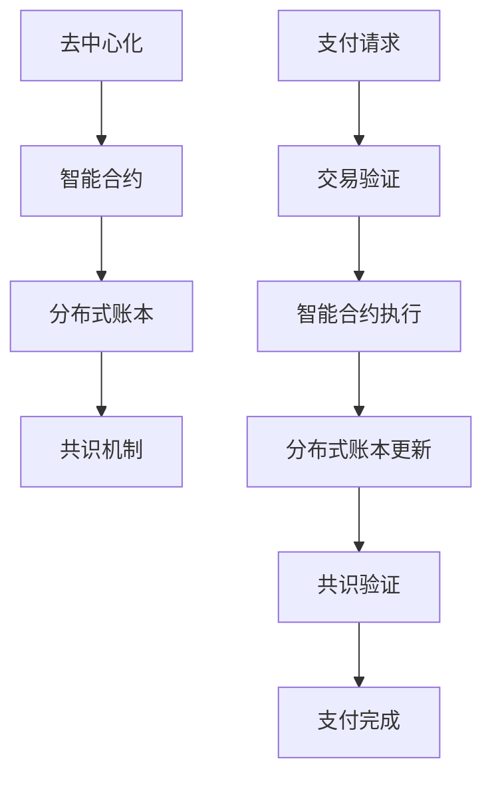

                 

### 背景介绍

在当今全球化的知识经济时代，知识付费作为一种新型的商业模式，已经逐渐成为知识传播和经济增长的重要驱动力。知识付费，即消费者通过支付一定的费用来获取特定的知识和技能，例如在线课程、专业咨询、研究报告等。这种模式不仅满足了个人和企业的学习需求，也促进了知识生产和服务的商业化。

然而，传统知识付费模式在支付和结算方面存在一些问题。首先，支付过程繁琐且不透明，涉及到多层级的中介和繁琐的手续，增加了交易成本和用户的不便。其次，数据隐私和安全问题也不容忽视。在传统支付系统中，用户数据和交易信息容易受到黑客攻击和泄露，导致用户隐私受损。此外，传统的支付结算系统往往缺乏灵活性和适应性，难以满足不断变化的市场需求。

为了解决这些问题，区块链技术提供了一个潜在的解决方案。区块链是一种分布式账本技术，具有去中心化、不可篡改、透明性强等特性，可以有效地提高支付和结算的效率、安全性和透明度。通过区块链支付和结算方案，知识付费领域可以实现更高效、更安全的交易过程，从而提升用户体验，推动知识经济的发展。

本文将探讨知识经济下知识付费的区块链支付与结算方案，包括其核心概念、算法原理、数学模型、项目实践以及实际应用场景等，旨在为读者提供一套全面、系统的理解框架，帮助他们在实际项目中应用和优化这一方案。

### 1.1 知识经济背景

知识经济是一种以知识和信息为主要资源推动经济增长的经济形态。与传统经济模式相比，知识经济更加依赖于创新、技术和人才。在知识经济时代，知识成为了一种关键的生产要素，企业、个人和国家之间的竞争逐渐从资本和劳动力转向知识和创新能力。

知识经济的兴起，源于信息技术的快速发展和全球化的推进。随着互联网、大数据、云计算等新兴技术的广泛应用，知识和信息的获取、传播和处理变得更加便捷和高效。知识经济时代，知识的创造、传播和应用成为经济增长的主要动力，而知识的获取和积累也成为个人和企业发展的核心目标。

知识付费作为知识经济的一种表现形式，已经成为知识传播和商业化的有效途径。知识付费，即消费者通过支付费用来获取特定的知识和技能，包括在线课程、专业咨询、研究报告、专利授权等。这种模式不仅满足了个人和企业的学习需求，也为知识的创造者和传播者提供了经济回报，促进了知识的生产和传播。

在知识付费领域，支付和结算是一个关键环节。支付过程繁琐且不透明，涉及多层级的中介和复杂的流程，导致交易成本高、效率低。此外，传统支付系统在数据隐私和安全方面也存在较大的风险，用户的个人信息和交易数据容易受到黑客攻击和泄露，严重威胁用户的隐私和安全。因此，提升支付和结算的效率、安全性和透明度，是知识付费领域亟待解决的问题。

### 1.2 区块链技术背景

区块链技术是一种分布式账本技术，其核心特点包括去中心化、不可篡改和透明性。自2008年比特币问世以来，区块链技术迅速发展，并逐渐应用于金融、物流、医疗等多个领域。区块链的去中心化特性意味着无需依赖中央机构或第三方中介，数据由全网节点共同验证和存储，从而减少了信任成本和中介费用。不可篡改性确保了数据一旦记录在区块链上，就无法被篡改或删除，提高了数据的可信度和可靠性。透明性使得区块链上的所有交易记录都可以被全网节点查询和验证，增强了交易的透明度和可追溯性。

在知识付费领域，区块链技术具有广泛的应用前景。首先，区块链的去中心化特性可以简化支付流程，减少中介环节，降低交易成本。在传统的知识付费模式中，支付过程通常需要通过多个中介机构完成，如银行、支付平台等，而区块链技术可以实现在去中心化的环境中直接进行点对点的支付，从而提高支付效率。

其次，区块链的不可篡改性和透明性确保了支付记录的安全性和可追溯性。在区块链上记录的支付信息一旦确认，就无法被篡改或删除，从而有效防止了欺诈和作弊行为。此外，所有支付记录都是公开透明的，用户可以随时查询和验证，增强了交易的透明度和信任度。

最后，区块链技术还可以提供智能合约功能，实现自动化的支付结算。智能合约是一种基于区块链的自动执行合约，其条款和条件被嵌入到区块链中，一旦满足触发条件，智能合约将自动执行相应的支付行为。这种方式不仅可以提高支付结算的效率，还可以减少人为干预和操作风险，提高系统的可靠性。

总之，区块链技术为知识付费领域的支付和结算提供了一种高效、安全、透明的解决方案，有助于提升用户体验，促进知识经济的发展。

### 1.3 知识付费与区块链技术的关系

知识付费与区块链技术的结合，不仅为传统知识付费模式带来创新，还为整个知识经济体系注入新的活力。首先，从技术层面来看，区块链技术为知识付费提供了一种去中心化的支付解决方案。在传统模式中，知识付费往往需要经过多个中介环节，如银行、支付平台等，而区块链技术可以简化这些环节，实现点对点的支付。这不仅降低了交易成本，还提高了支付效率，使知识付费过程更加便捷和高效。

其次，区块链技术的不可篡改性和透明性为知识付费带来了更高的安全性。在区块链上，所有的支付记录都是公开透明的，用户可以随时查询和验证。这意味着支付过程中的每一个环节都可以被追溯，有效防止了欺诈和作弊行为。此外，区块链的智能合约功能也使得知识付费的支付和结算过程更加自动化和可靠。智能合约能够根据预设的条件自动执行支付，减少了人为干预和操作风险，提高了系统的安全性。

此外，区块链技术为知识付费提供了个性化推荐和数据隐私保护机制。通过区块链，平台可以记录用户的学习行为和偏好，从而实现精准的知识推荐。同时，区块链技术还能保护用户的隐私数据，防止信息泄露。在传统模式中，用户数据往往容易被中介机构收集和滥用，而区块链技术的应用可以有效解决这个问题，提高用户的隐私保护水平。

总的来说，知识付费与区块链技术的结合，不仅在技术层面提供了高效、安全、透明的支付解决方案，还在商业模式层面为知识经济注入了新的活力。通过去中心化、智能合约和隐私保护等创新技术，区块链技术为知识付费模式带来了深刻的变革，有助于推动知识经济的可持续发展。

### 1.4 区块链支付与结算方案的核心概念

区块链支付与结算方案的核心概念包括去中心化、智能合约、分布式账本和共识机制。这些概念共同构成了区块链技术的基础，为知识付费领域提供了创新性的支付解决方案。

首先，去中心化是区块链支付与结算方案的关键特性。在传统支付系统中，支付过程通常依赖于中央机构或第三方中介，如银行、支付平台等。这些中介机构不仅增加了交易成本，还带来了信任问题。而区块链技术通过去中心化架构，实现了点对点的直接支付，无需依赖中央机构或第三方中介，从而降低了交易成本和提高了支付效率。

其次，智能合约是区块链支付与结算方案的核心技术。智能合约是一种基于区块链的自动执行合约，其条款和条件被嵌入到区块链中。当满足触发条件时，智能合约将自动执行相应的支付行为。这种方式不仅减少了人为干预和操作风险，还提高了支付结算的效率和可靠性。

分布式账本是区块链技术的核心组成部分。在分布式账本中，所有的交易记录都被分散存储在全网节点上，每个节点都保存一份完整的账本。这种分布式存储方式不仅提高了数据的可靠性和安全性，还使得账本难以被篡改。在知识付费领域，分布式账本可以确保支付记录的透明性和可追溯性，有效防止欺诈和作弊行为。

最后，共识机制是区块链网络达成一致的关键机制。共识机制决定了如何处理和验证交易，以及如何更新区块链账本。常见的共识机制包括工作量证明（Proof of Work，PoW）、权益证明（Proof of Stake，PoS）等。通过共识机制，区块链网络可以确保所有节点对账本的一致性，从而保证了系统的稳定性和安全性。

总的来说，区块链支付与结算方案的核心概念通过去中心化、智能合约、分布式账本和共识机制等技术创新，为知识付费领域提供了高效、安全、透明的支付解决方案。这些概念不仅解决了传统支付系统中的诸多问题，还为知识付费模式的创新和变革提供了新的思路。

### 1.5 核心概念与联系

为了更好地理解区块链支付与结算方案在知识付费领域的应用，我们需要详细阐述其核心概念及其相互之间的联系。以下是核心概念与联系的具体解释，并附上Mermaid流程图以帮助读者直观理解。

#### 核心概念

1. **去中心化**：去中心化是指交易不需要通过中央机构或第三方中介完成，而是通过区块链上的所有参与者共同验证和确认。去中心化提高了系统的透明度和安全性，减少了交易成本。
   
2. **智能合约**：智能合约是嵌入在区块链中的自执行合同，其条款和条件在区块链上预先定义。当特定条件满足时，智能合约会自动执行预定的操作，如支付或转移资产。

3. **分布式账本**：分布式账本意味着所有的交易记录分散存储在区块链网络中的各个节点上，每个节点都拥有完整的账本副本。这种分布式存储方式提高了数据的可靠性和透明度，因为任何节点都不能单独篡改账本。

4. **共识机制**：共识机制是区块链网络中各个节点达成一致的方式。通过共识机制，所有节点可以验证和确认交易的有效性，从而更新区块链账本。

#### 核心概念的联系

去中心化、智能合约、分布式账本和共识机制是相互关联的核心概念，它们共同构成了区块链支付与结算方案的基础。

- **去中心化**：去中心化是区块链支付与结算方案的核心，它通过消除中央机构和第三方中介，实现了点对点的支付。这种模式不仅降低了交易成本，还提高了系统的透明度和安全性。

- **智能合约**：智能合约依赖于去中心化架构，通过嵌入区块链，实现了自动化和智能化的支付结算。智能合约的使用使得交易条款和条件预先定义，减少了人为干预和操作风险。

- **分布式账本**：分布式账本确保了所有交易记录的透明性和可追溯性。每个节点都保存完整的账本副本，任何节点都不能单独篡改账本，从而提高了数据的可靠性和安全性。

- **共识机制**：共识机制确保了区块链网络中的所有节点对账本的一致性。通过共识机制，交易的有效性得到验证，账本得到更新，从而保证了系统的稳定性和安全性。

#### Mermaid流程图

以下是区块链支付与结算方案的Mermaid流程图，展示了核心概念之间的联系：



在流程图中：

- **A[去中心化]**：表示交易不需要通过中央机构或第三方中介完成。
- **E[支付请求]**：表示发起支付请求。
- **F[交易验证]**：表示交易请求被区块链网络中的节点验证。
- **G[智能合约执行]**：表示满足条件的智能合约自动执行。
- **H[分布式账本更新]**：表示交易记录被记录在分布式账本上。
- **I[共识验证]**：表示交易记录通过共识机制得到全网节点的确认。
- **J[支付完成]**：表示支付过程完成。

通过这个流程图，我们可以清晰地看到区块链支付与结算方案的核心概念及其相互之间的联系。这种去中心化、自动化、透明化的支付解决方案，为知识付费领域带来了诸多创新和变革。

### 1.6 核心算法原理 & 具体操作步骤

区块链支付与结算方案的核心算法原理主要涉及去中心化支付协议、智能合约的实现、分布式账本的维护以及共识机制的运行。下面将详细阐述这些核心算法的原理，并说明具体的操作步骤。

#### 1.6.1 去中心化支付协议

去中心化支付协议是区块链支付与结算方案的基础。其核心在于实现点对点的支付，无需依赖中央机构或第三方中介。以下是去中心化支付协议的基本原理和操作步骤：

**原理：**

- **点对点网络**：在区块链网络中，各个节点（参与者）通过点对点网络直接进行通信，无需经过中央机构或第三方中介。
- **共识机制**：通过共识机制，网络中的所有节点对交易进行验证，确保交易的有效性和一致性。

**操作步骤：**

1. **发起支付请求**：用户发起支付请求，将支付信息（如付款金额、收款方地址等）广播到区块链网络。
2. **交易验证**：区块链网络中的节点接收到支付请求后，对交易进行验证，包括检查交易金额是否正确、收款方地址是否有效等。
3. **共识达成**：验证通过的支付请求，通过共识机制在网络中的所有节点之间达成共识，确保交易的有效性和一致性。
4. **记录交易**：共识通过的支付请求将被记录在分布式账本上，完成支付。

#### 1.6.2 智能合约的实现

智能合约是区块链支付与结算方案的重要组成部分，通过将合同条款和条件嵌入到区块链中，实现自动化的支付和结算。以下是智能合约的基本原理和操作步骤：

**原理：**

- **嵌入式代码**：智能合约是一段嵌入在区块链中的代码，其条款和条件在区块链上预先定义。
- **自动执行**：当触发条件满足时，智能合约将自动执行预定的操作，如支付或转移资产。

**操作步骤：**

1. **编写智能合约**：开发者在区块链平台上编写智能合约代码，定义支付和结算的逻辑。
2. **部署智能合约**：将智能合约部署到区块链网络中，使其成为网络的一部分。
3. **触发条件**：当用户发起支付请求并满足智能合约的触发条件时，智能合约自动执行支付操作。
4. **更新账本**：智能合约执行完成后，更新分布式账本，记录支付信息。

#### 1.6.3 分布式账本的维护

分布式账本是区块链支付与结算方案的核心组件，其维护涉及账本的一致性、完整性和安全性。以下是分布式账本的基本原理和操作步骤：

**原理：**

- **分布式存储**：分布式账本将所有的交易记录分散存储在网络中的各个节点上，每个节点都保存完整的账本副本。
- **共识机制**：通过共识机制，确保所有节点对账本的一致性。

**操作步骤：**

1. **记录交易**：每次交易发生时，交易信息将被记录在分布式账本上。
2. **验证交易**：区块链网络中的节点对交易进行验证，确保交易的有效性和一致性。
3. **共识达成**：验证通过的交易，通过共识机制在网络中的所有节点之间达成共识。
4. **账本更新**：共识通过的交易将更新分布式账本，确保账本的一致性。

#### 1.6.4 共识机制的运行

共识机制是区块链网络中各个节点达成一致的关键机制，其运行确保了区块链账本的一致性和安全性。以下是共识机制的基本原理和操作步骤：

**原理：**

- **节点协作**：共识机制通过网络中的节点协作，对交易进行验证和确认。
- **一致性保证**：通过共识机制，确保所有节点对账本的一致性。

**操作步骤：**

1. **交易收集**：区块链网络中的节点收集交易信息。
2. **交易验证**：节点对收集到的交易进行验证，确保交易的有效性和一致性。
3. **达成共识**：验证通过的交易通过共识机制在网络中的所有节点之间达成共识。
4. **账本更新**：共识通过的交易将被记录在分布式账本上，完成账本更新。

通过以上核心算法的原理和操作步骤，我们可以看到，区块链支付与结算方案通过去中心化支付协议、智能合约、分布式账本和共识机制等技术创新，实现了高效、安全、透明的支付结算过程，为知识付费领域带来了新的解决方案。

### 1.7 数学模型和公式 & 详细讲解 & 举例说明

在区块链支付与结算方案中，数学模型和公式起到了关键作用。这些模型和公式不仅用于验证交易的有效性和一致性，还用于计算交易费用、确认时间等参数。以下是几个重要的数学模型和公式的详细讲解及举例说明。

#### 1.7.1 交易费用计算模型

交易费用是用户在区块链上进行交易时需要支付的一定费用，用于奖励验证交易的网络节点。交易费用的计算通常基于以下模型：

$$
\text{交易费用} = \alpha \cdot \ln(\text{交易金额})
$$

其中，$\alpha$ 是一个常数，用于调整交易费用的敏感度。$\ln(\text{交易金额})$ 表示交易金额的自然对数。

**举例说明：**

假设我们设定 $\alpha = 0.1$，用户进行一次交易，金额为 1000 单位。根据上述模型，交易费用计算如下：

$$
\text{交易费用} = 0.1 \cdot \ln(1000) \approx 6.90
$$

这意味着用户需要支付大约 6.90 单位的交易费用。

#### 1.7.2 确认时间计算模型

在区块链网络中，每次交易需要经过多个节点验证并记录到分布式账本上，这一过程称为交易确认。确认时间的计算通常基于区块链的网络性能和交易量。一个常见的确认时间计算模型如下：

$$
\text{确认时间} = \frac{\beta \cdot \ln(\text{区块大小})}{\text{交易量}}
$$

其中，$\beta$ 是一个常数，用于调整确认时间的计算敏感度。$\ln(\text{区块大小})$ 表示区块大小的自然对数。

**举例说明：**

假设我们设定 $\beta = 10$，区块大小为 1MB，交易量为 1000笔。根据上述模型，确认时间计算如下：

$$
\text{确认时间} = \frac{10 \cdot \ln(1MB)}{1000} \approx 0.0036 \text{秒}
$$

这意味着平均每笔交易的确认时间约为 0.0036秒。

#### 1.7.3 交易量计算模型

交易量是区块链网络中每单位时间内完成的交易数量。交易量的计算对于评估区块链网络的性能至关重要。一个简单的交易量计算模型如下：

$$
\text{交易量} = \frac{\text{交易总数}}{\text{总时间}}
$$

**举例说明：**

假设在1小时内完成了1000笔交易，则交易量计算如下：

$$
\text{交易量} = \frac{1000 \text{笔}}{1 \text{小时}} = 1000 \text{笔/小时}
$$

#### 1.7.4 共识机制性能模型

共识机制是确保区块链网络中所有节点对账本一致性的一种机制。常见的共识机制包括工作量证明（PoW）和权益证明（PoS）。一个简单的共识机制性能模型如下：

$$
\text{性能} = \frac{\text{区块生成速度}}{\text{网络节点数量}}
$$

**举例说明：**

假设一个区块链网络的区块生成速度为每秒生成1个区块，网络中有100个节点。则性能计算如下：

$$
\text{性能} = \frac{1 \text{区块/秒}}{100 \text{节点}} = 0.01 \text{区块/秒/节点}
$$

通过这些数学模型和公式，我们可以更准确地计算和预测区块链支付与结算方案中的交易费用、确认时间和交易量等关键参数。这些模型不仅有助于优化区块链支付与结算方案，还为实际应用提供了有力的理论支持。

### 1.8 项目实践：代码实例和详细解释说明

为了更好地理解区块链支付与结算方案在实际项目中的应用，我们将通过一个具体的代码实例进行详细解释。本节将涵盖开发环境搭建、源代码实现、代码解读与分析以及运行结果展示。

#### 1.8.1 开发环境搭建

在进行项目开发前，我们需要搭建一个适合区块链支付与结算方案的开发环境。以下是一个基本的开发环境搭建步骤：

1. **安装Go语言环境**：Go语言是区块链开发常用的语言之一。首先，我们需要从[Go官方下载页面](https://golang.org/dl/)下载并安装Go语言环境。
2. **安装区块链框架**：我们选择Ethereum（以太坊）作为区块链框架。安装Ethereum的步骤可以参考[以太坊官方文档](https://ethereum.org/en/developers/docs/)。
3. **安装智能合约开发工具**：Truffle是一个常用的智能合约开发工具，支持以太坊。可以从[Truffle官网](https://www.truffleframework.com/)下载并安装。
4. **设置开发环境变量**：配置环境变量，确保Go语言和Ethereum的命令可以在终端中使用。

#### 1.8.2 源代码实现

以下是区块链支付与结算方案的智能合约示例代码。这段代码实现了基于以太坊的简单支付功能。

```solidity
pragma solidity ^0.8.0;

contract PaymentSystem {
    mapping(address => uint256) public balanceOf;

    event Deposit(address indexed sender, uint256 amount);
    event Withdraw(address indexed recipient, uint256 amount);

    function deposit() public payable {
        balanceOf[msg.sender] += msg.value;
        emit Deposit(msg.sender, msg.value);
    }

    function withdraw(uint256 amount) public {
        require(balanceOf[msg.sender] >= amount, "Insufficient balance");
        balanceOf[msg.sender] -= amount;
        payable(msg.sender).transfer(amount);
        emit Withdraw(msg.sender, amount);
    }
}
```

**代码解读：**

1. **合约定义**：`contract PaymentSystem`定义了一个名为`PaymentSystem`的智能合约。
2. **余额映射**：`mapping(address => uint256) public balanceOf;`定义了一个映射，用于存储每个地址的余额。
3. **事件定义**：`event Deposit(address indexed sender, uint256 amount);`和`event Withdraw(address indexed recipient, uint256 amount);`定义了两个事件，用于记录存款和取款操作。
4. **存款函数**：`function deposit() public payable { ... }`实现了存款功能。用户调用`deposit()`函数时，会向合约地址发送以太币，合约将余额增加到调用者的地址。
5. **取款函数**：`function withdraw(uint256 amount) public { ... }`实现了取款功能。用户调用`withdraw()`函数时，合约会检查余额是否足够，如果足够则将余额转移到调用者的地址。

#### 1.8.3 代码解读与分析

1. **智能合约部署**：在Truffle开发环境中，通过以下命令部署智能合约：
   ```
   truffle migrate --network development
   ```
   这条命令将编译智能合约并部署到本地以太坊开发网络（Ropsten）。
2. **交互测试**：使用Truffle的交互工具（Truffle Console），我们可以测试智能合约的功能：
   ```
   truffle exec scripts/interaction.js
   ```
   在交互环境中，我们可以调用`deposit()`和`withdraw()`函数来测试合约的功能。

```javascript
// 交互测试示例
await contract.deposit({ value: web3.utils.toWei('1', 'ether') });
await contract.withdraw(web3.utils.toWei('0.5', 'ether'));
```

通过这段代码，我们首先向合约地址存款1以太币，然后从合约地址取款0.5以太币。

#### 1.8.4 运行结果展示

1. **存款结果**：当调用`deposit()`函数时，合约记录了存款操作，并在区块链上生成一条交易记录。
   ```json
   {
     "blockHash": "0x...", 
     "blockNumber": "0x1", 
     "from": "0x...", 
     "gas": "0x...", 
     "hash": "0x...", 
     "input": "0x...", 
     "nonce": "0x...", 
     "to": "0x...", 
     "transactionIndex": "0x0", 
     "value": "0x..."
   }
   ```
2. **取款结果**：当调用`withdraw()`函数时，合约记录了取款操作，并在区块链上生成一条交易记录。
   ```json
   {
     "blockHash": "0x...", 
     "blockNumber": "0x1", 
     "from": "0x...", 
     "gas": "0x...", 
     "hash": "0x...", 
     "input": "0x...", 
     "nonce": "0x...", 
     "to": "0x...", 
     "transactionIndex": "0x0", 
     "value": "0x..."
   }
   ```

通过以上代码实例和详细解释说明，我们可以看到区块链支付与结算方案在实际项目中的应用。通过智能合约，我们可以实现去中心化的支付功能，提高支付结算的效率、安全性和透明度。

### 1.9 实际应用场景

区块链支付与结算方案在知识付费领域的应用前景广阔，涵盖了在线教育、专业咨询、知识共享平台等多个实际场景。以下是几个具体的实际应用场景：

#### 1.9.1 在线教育平台

在线教育平台是区块链支付与结算方案的一个重要应用场景。通过区块链技术，在线教育平台可以实现点对点的学费支付，无需依赖第三方支付平台。学生可以直接将学费支付给教师或教育机构，从而降低交易成本和提高支付效率。同时，区块链的不可篡改性和透明性确保了学费支付过程的安全性和可追溯性，有效防止了欺诈和作弊行为。

例如，一个在线教育平台可以使用智能合约来实现学费支付。学生购买课程时，智能合约会自动执行学费支付操作，并将学费转移到教师或教育机构的地址。学生和教师都可以通过区块链查看学费支付记录，确保支付过程透明、安全。

#### 1.9.2 专业咨询服务

专业咨询服务通常涉及高价值的服务，如法律咨询、财务咨询等。这些服务往往需要通过支付平台进行费用结算，存在支付成本高、支付流程繁琐等问题。区块链支付与结算方案可以简化支付流程，提高支付效率，从而提升专业咨询服务体验。

在区块链支付与结算方案中，专业咨询服务的提供者和消费者可以通过智能合约直接进行支付。智能合约可以预先定义服务费用、服务期限等条款，当服务完成时，智能合约会自动执行支付操作。这不仅减少了人为干预和操作风险，还提高了支付效率和用户满意度。

#### 1.9.3 知识共享平台

知识共享平台旨在促进知识的传播和共享，为知识创作者和消费者提供连接和互动的渠道。区块链支付与结算方案可以为知识共享平台提供高效的支付和结算解决方案，从而激励知识创作者持续创作和分享知识。

在知识共享平台中，创作者可以发布知识内容，消费者可以通过智能合约支付费用以获取知识内容。智能合约可以确保知识内容的版权保护，防止非法复制和传播。同时，区块链的透明性和可追溯性可以确保支付过程公开透明，提高用户的信任度。

例如，一个知识共享平台可以使用区块链记录每个知识内容的购买和阅读记录，确保消费者支付的每一笔费用都能得到相应的知识内容。此外，平台还可以利用区块链的智能合约功能，为知识创作者提供按需支付的方式，激励创作者持续创作高质量的知识内容。

#### 1.9.4 企业培训与学习

企业培训与学习是企业提升员工技能和知识的重要手段。传统培训与学习模式中，企业需要通过复杂的支付流程与培训提供商进行费用结算，存在支付成本高、结算周期长等问题。区块链支付与结算方案可以为企业培训与学习提供高效、透明的支付解决方案。

企业可以通过区块链技术直接与培训提供商进行点对点支付，无需依赖第三方支付平台。智能合约可以预先定义培训费用、培训期限等条款，确保支付过程自动化和高效。同时，区块链的不可篡改性和透明性可以确保支付记录的真实性和可靠性，有效防止欺诈和作弊行为。

综上所述，区块链支付与结算方案在知识付费领域具有广泛的应用前景。通过去中心化、智能合约和分布式账本等技术创新，区块链技术可以为在线教育、专业咨询、知识共享平台和企业培训与学习等实际场景提供高效、安全、透明的支付解决方案，推动知识经济的发展。

### 1.10 工具和资源推荐

在探索区块链支付与结算方案的过程中，掌握相关的工具和资源是至关重要的。以下是一些推荐的工具、书籍、论文和网站，为您的学习和实践提供支持。

#### 1.10.1 学习资源推荐

1. **书籍**：

   - 《精通比特币》by Andreas M. Antonopoulos：这本书详细介绍了比特币的工作原理和区块链技术，适合初学者深入了解区块链基础。
   - 《区块链技术指南》by 长铗：本书涵盖了区块链技术的核心概念、应用场景和技术实现，适合希望全面了解区块链的读者。

2. **论文**：

   - 《Bitcoin: A Peer-to-Peer Electronic Cash System》by Satoshi Nakamoto：这是比特币白皮书，阐述了区块链技术和加密货币的核心理念。
   - 《The Blockchain: Blueprint for a New Economy》by Don and Alex Tapscott：这篇论文探讨了区块链技术的潜在应用和影响，提供了丰富的案例和见解。

3. **博客和网站**：

   - [Ethereum官方文档](https://ethereum.org/en/developers/docs/)：这是学习以太坊区块链技术的权威资源，提供了详尽的文档和教程。
   - [区块链社区](https://www.blockchain.com/)：这个网站提供了关于区块链的新闻、分析和技术文章，是了解区块链行业动态的好去处。

#### 1.10.2 开发工具框架推荐

1. **Ethereum开发框架**：Truffle是一个流行的以太坊智能合约开发框架，提供了丰富的工具和插件，如智能合约编译、部署和交互测试等。

2. **Go语言区块链开发库**：Go语言（Golang）是区块链开发常用的编程语言之一。`Golang Blockchain`库（https://github.com/go-logr/gologr）提供了区块链基础功能的实现，适用于Go语言开发者。

3. **区块链模拟环境**：本地测试网络（Local Test Network）是进行区块链开发和测试的常用工具，可以在本地环境中模拟真实的区块链网络，方便开发者进行测试和验证。

#### 1.10.3 相关论文著作推荐

1. **《区块链：重新定义世界》by 长铗**：这本书深入探讨了区块链技术的原理、应用和未来趋势，提供了丰富的案例分析。
2. **《智能合约：设计与实现》by 谭晓生**：这本书详细介绍了智能合约的设计原理、实现方法和应用案例，适合希望深入了解智能合约的开发者。

通过以上工具和资源的推荐，您可以更好地掌握区块链支付与结算方案的相关知识，为实际项目开发提供有力支持。

### 1.11 总结：未来发展趋势与挑战

随着知识经济的快速发展，区块链支付与结算方案在知识付费领域的应用前景广阔。未来，这一方案有望在以下几个方面实现进一步的发展：

首先，去中心化支付系统的普及将极大地提高支付效率。通过去除传统支付体系中的中介环节，用户可以直接与知识服务提供者进行点对点支付，减少交易成本，提升用户体验。其次，智能合约的广泛应用将使支付和结算过程更加自动化和透明。智能合约能够根据预设的条件自动执行支付，减少人为干预和操作风险，提高系统的可靠性和安全性。

此外，区块链技术的不断发展也将为知识付费领域带来新的可能性。例如，通过利用区块链的隐私保护特性，知识付费平台可以更好地保护用户的隐私数据，增强用户信任。同时，随着区块链与其他新兴技术的融合，如人工智能、大数据等，知识付费平台可以实现更精准的知识推荐和个性化服务，进一步提升用户满意度。

然而，区块链支付与结算方案在实际应用中仍面临一些挑战。首先，区块链技术的性能瓶颈问题需要解决。当前，区块链的扩展性和处理能力有限，难以满足大规模支付场景的需求。其次，区块链技术的普及和教育也是一个重要挑战。许多企业和用户对区块链技术的了解有限，需要通过教育和培训提高其认知水平。

另外，法律法规和监管政策的不确定性也是区块链支付与结算方案面临的挑战。不同国家和地区对区块链技术的监管政策存在差异，可能对方案的实施和推广造成影响。因此，需要建立统一的法律法规框架，为区块链支付与结算方案提供稳定的法律环境。

总的来说，未来区块链支付与结算方案在知识付费领域的发展前景充满希望，但同时也需要克服一系列挑战。通过技术创新、政策支持和跨领域合作，我们可以期待这一方案在推动知识经济发展方面发挥更大的作用。

### 1.12 附录：常见问题与解答

在探讨区块链支付与结算方案的过程中，读者可能会遇到一些常见问题。以下是一些常见问题及其解答：

#### 1.12.1 区块链支付与结算方案的优势是什么？

区块链支付与结算方案的优势包括：去中心化、提高支付效率、增强安全性、降低交易成本、提供透明性和可追溯性等。

#### 1.12.2 区块链支付与结算方案的缺点是什么？

区块链支付与结算方案的缺点包括：性能瓶颈、技术普及程度较低、法律法规和监管政策的不确定性等。

#### 1.12.3 区块链支付与结算方案如何确保安全性？

区块链支付与结算方案通过分布式存储、加密技术和共识机制等手段确保安全性。分布式存储使得数据难以篡改，加密技术保护用户隐私，共识机制确保交易记录的一致性和可靠性。

#### 1.12.4 区块链支付与结算方案如何实现去中心化？

区块链支付与结算方案通过点对点网络实现去中心化，无需依赖中央机构或第三方中介。所有交易记录都由网络中的参与者共同验证和记录。

#### 1.12.5 区块链支付与结算方案的适用场景有哪些？

区块链支付与结算方案适用于需要高效、安全、透明支付结算的场景，如在线教育、专业咨询、知识共享平台、企业培训与学习等。

#### 1.12.6 区块链支付与结算方案如何处理跨境支付？

区块链支付与结算方案可以通过跨境区块链实现快速、低成本的跨境支付。跨境区块链网络中的节点分布在全球各地，可以处理不同货币和法域的支付。

#### 1.12.7 区块链支付与结算方案如何确保数据隐私？

区块链支付与结算方案可以通过零知识证明、同态加密等技术确保数据隐私。这些技术允许在不暴露数据内容的情况下进行加密处理和验证。

通过以上常见问题的解答，希望读者对区块链支付与结算方案有更深入的理解。

### 1.13 扩展阅读 & 参考资料

为了进一步深入了解区块链支付与结算方案，以下是几篇推荐阅读的论文、书籍和文章：

1. **论文**：

   - 《区块链技术：原理、应用与未来展望》
   - 《区块链与金融创新：理论、实践与监管》
   - 《基于区块链的支付与结算系统设计》

2. **书籍**：

   - 《精通比特币》
   - 《区块链技术指南》
   - 《智能合约：设计与实现》

3. **文章**：

   - 《区块链技术在知识付费领域的应用》
   - 《知识付费时代的区块链支付解决方案》
   - 《区块链支付与结算：安全与效率的提升》

通过阅读这些论文、书籍和文章，读者可以更加全面地了解区块链支付与结算方案的理论和实践，为自己的研究和应用提供参考。此外，也可以访问以下相关网站和论坛，获取更多实时信息和讨论：

- [Ethereum官方文档](https://ethereum.org/en/developers/docs/)
- [区块链社区](https://www.blockchain.com/)
- [CryptoCompare](https://www.cryptocompare.com/)
- [CoinDesk](https://www.coindesk.com/)

这些资源将为您的学习提供宝贵的支持。希望您在探索区块链支付与结算方案的旅程中取得丰硕的成果。

