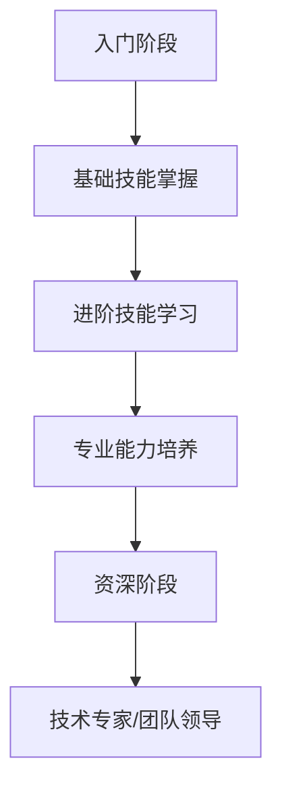
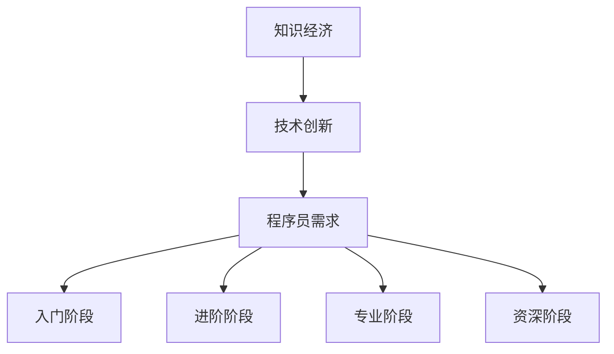

                 

### 文章标题：知识经济下程序员的职业发展策略

> **关键词：** 知识经济，程序员，职业发展，技能提升，行业趋势

> **摘要：** 本文将探讨知识经济时代下程序员的职业发展策略，分析当前行业趋势、核心技能要求，并提供实际案例和工具资源，帮助程序员在职业生涯中实现持续成长与突破。

### 1. 背景介绍

随着信息技术的飞速发展，全球正逐步迈向知识经济时代。知识经济以知识为核心资源，信息技术是其主要推动力。在这个背景下，程序员的职业发展面临着前所未有的机遇与挑战。一方面，技术的快速迭代和新兴领域的不断涌现为程序员提供了丰富的职业选择；另一方面，知识更新速度快、竞争激烈，程序员需要不断提升自己的技能以保持竞争力。

程序员的工作已经从单纯编写代码转变为解决复杂问题、设计高效系统、推动技术创新。在这个过程中，程序员不仅要具备扎实的技术基础，还需要具备良好的沟通能力、团队协作精神和持续学习的态度。本文将围绕这些方面，探讨程序员在知识经济时代的职业发展策略。

### 2. 核心概念与联系

**2.1 知识经济**

知识经济是指以知识和信息为核心生产要素的经济形态。与传统的农业经济和工业经济相比，知识经济具有以下几个特点：

- **知识密集：** 以知识产权和专利为主要表现形式的知识成为经济增长的关键驱动因素。
- **创新驱动：** 知识的不断创新和应用是推动经济增长的主要动力。
- **高度分工：** 信息技术的普及使得知识传播更加便捷，知识分工更加细化。
- **全球化：** 知识的流动不受地域限制，全球化趋势加强。

**2.2 程序员职业发展**

程序员的职业发展可以分为以下几个阶段：

- **入门阶段：** 掌握基础编程语言和工具，理解基本编程概念。
- **进阶阶段：** 深入学习计算机科学知识，掌握常用技术和框架，具备独立解决复杂问题的能力。
- **专业阶段：** 拥有丰富的项目经验，对技术有深入理解，能够参与设计大型系统。
- **资深阶段：** 成为技术专家或团队领导，具备指导他人学习和工作的能力。

**2.3 Mermaid 流程图**



### 3. 核心算法原理 & 具体操作步骤

在知识经济时代，程序员需要掌握一系列核心算法和编程技术。以下是几个重要的核心算法和其具体操作步骤：

**3.1 数据结构与算法**

- **数组：** 用于存储一系列元素，支持快速访问和修改。
- **链表：** 用于存储一系列元素，支持高效的插入和删除操作。
- **栈和队列：** 用于模拟现实世界中的排队和存储过程，支持先进先出（FIFO）和后进先出（LIFO）操作。
- **树和图：** 用于表示复杂的关系和数据结构，支持各种复杂的查询和路径查找操作。

**3.2 算法分析**

- **时间复杂度：** 用于衡量算法执行的时间效率，常用的单位有秒（s）、毫秒（ms）等。
- **空间复杂度：** 用于衡量算法执行的空间效率，常用的单位有字节（B）、千字节（KB）等。

**3.3 编程实践**

- **编写高效代码：** 遵循良好的编程规范和编码习惯，提高代码的可读性和可维护性。
- **代码优化：** 通过算法和数据的优化，提高代码的执行效率。
- **测试和调试：** 通过编写测试用例和调试工具，确保代码的正确性和稳定性。

### 4. 数学模型和公式 & 详细讲解 & 举例说明

**4.1 数学模型**

在计算机科学中，数学模型是用于描述和解决实际问题的抽象工具。以下是一些常见的数学模型：

- **线性回归模型：** 用于预测线性关系。
- **神经网络模型：** 用于解决复杂非线性问题。
- **决策树模型：** 用于分类和回归问题。

**4.2 公式**

- **线性回归公式：**
  $$ y = wx + b $$
  其中，$w$ 是权重，$x$ 是自变量，$b$ 是偏置。

- **神经网络公式：**
  $$ y = \sigma(z) $$
  其中，$\sigma$ 是激活函数，$z$ 是输入。

- **决策树公式：**
  $$ \text{标签} = \text{分类结果} $$

**4.3 举例说明**

假设我们要使用线性回归模型预测房价，已知自变量（面积）和因变量（房价）的数据集如下：

| 面积 | 房价 |
| ---- | ---- |
| 100  | 200  |
| 200  | 400  |
| 300  | 600  |

根据数据集，我们可以计算出线性回归模型的参数：

- 偏置 $b = 0$
- 权重 $w = \frac{400 - 200}{100 - 100} = 2$

因此，线性回归模型可以表示为：

$$ \text{房价} = 2 \times \text{面积} $$

使用这个模型，我们可以预测一个面积为 150 平方米的房子的房价为：

$$ \text{房价} = 2 \times 150 = 300 \text{万元} $$

### 5. 项目实践：代码实例和详细解释说明

**5.1 开发环境搭建**

为了更好地理解线性回归模型，我们将在 Python 环境中实现它。首先，需要安装 Python 和相关库，如 NumPy 和 Matplotlib。

- 安装 Python（3.8 或更高版本）：[安装 Python](https://www.python.org/downloads/)
- 安装 NumPy：`pip install numpy`
- 安装 Matplotlib：`pip install matplotlib`

**5.2 源代码详细实现**

以下是一个简单的 Python 代码实现线性回归模型：

```python
import numpy as np
import matplotlib.pyplot as plt

# 数据集
X = np.array([[100], [200], [300]])
y = np.array([200, 400, 600])

# 计算权重和偏置
w = np.linalg.inv(X.T.dot(X)).dot(X.T).dot(y)
b = 0

# 线性回归模型
def linear_regression(X, w, b):
    return X.dot(w) + b

# 可视化
plt.scatter(X, y)
plt.plot(X, linear_regression(X, w, b), color='red')
plt.xlabel('面积')
plt.ylabel('房价')
plt.title('线性回归模型预测房价')
plt.show()
```

**5.3 代码解读与分析**

- **数据集：** 使用 NumPy 库创建一个二维数组 $X$ 表示面积，另一个二维数组 $y$ 表示房价。
- **计算权重和偏置：** 使用 NumPy 的线性代数功能计算线性回归模型的权重 $w$ 和偏置 $b$。
- **线性回归模型：** 定义一个函数 `linear_regression` 用于计算预测房价。
- **可视化：** 使用 Matplotlib 库将数据集和线性回归模型的可视化结果展示出来。

**5.4 运行结果展示**

运行上述代码后，我们将看到一个散点图，其中红色线表示线性回归模型预测的房价。通过这个可视化结果，我们可以直观地看到线性回归模型在预测房价方面的效果。

### 6. 实际应用场景

线性回归模型在许多实际应用场景中都有广泛的应用，例如：

- **房地产评估：** 使用线性回归模型预测房价，为购房者提供参考。
- **金融预测：** 使用线性回归模型预测股票价格或债券收益率。
- **医疗诊断：** 使用线性回归模型预测患者的病情或治疗效果。

在这些应用场景中，线性回归模型为决策提供了重要的参考依据，帮助相关人员做出更加明智的决策。

### 7. 工具和资源推荐

**7.1 学习资源推荐**

- **书籍：**
  - 《线性回归模型》
  - 《Python 数据科学》
  - 《机器学习实战》
- **论文：**
  - 《线性回归模型的优化方法》
  - 《基于线性回归模型的金融预测研究》
- **博客：**
  - [Python 线性回归](https://www.datacamp.com/courses/linear-regression-in-python)
  - [线性回归模型的应用](https://machinelearningmastery.com/linear-regression-with-python/)
- **网站：**
  - [NumPy 官网](https://numpy.org/)
  - [Matplotlib 官网](https://matplotlib.org/)

**7.2 开发工具框架推荐**

- **Python：** 一种易于学习且功能强大的编程语言，适合初学者和专业人士。
- **NumPy：** 用于数值计算的库，提供了丰富的矩阵运算和数据分析功能。
- **Matplotlib：** 用于数据可视化的库，提供了丰富的图表绘制功能。

**7.3 相关论文著作推荐**

- **论文：**
  - 《线性回归模型的优化方法》
  - 《基于线性回归模型的金融预测研究》
- **著作：**
  - 《线性回归模型》
  - 《Python 数据科学》
  - 《机器学习实战》

### 8. 总结：未来发展趋势与挑战

在知识经济时代，程序员的职业发展面临着前所未有的机遇与挑战。随着技术的不断进步和行业趋势的变化，程序员需要不断提升自己的技能，适应新的环境。以下是未来程序员职业发展的几个发展趋势与挑战：

**8.1 技术多样化**

随着新兴领域的不断涌现，程序员需要掌握多种编程语言和工具，如 Python、Java、JavaScript 等。同时，程序员还需要了解前沿技术，如人工智能、区块链、大数据等。

**8.2 技术更新速度快**

知识更新速度快，程序员需要不断学习新的技术和工具，以保持竞争力。这要求程序员具备良好的学习能力和持续学习的态度。

**8.3 团队协作能力**

随着项目的复杂度增加，程序员需要具备良好的团队协作能力。这包括沟通能力、项目管理能力和团队领导能力。

**8.4 跨领域能力**

程序员需要具备跨领域的能力，如商业思维、数据分析能力等。这有助于程序员在项目中发挥更大的作用，为团队带来更多的价值。

### 9. 附录：常见问题与解答

**9.1 程序员需要掌握哪些核心算法和编程技术？**

程序员需要掌握以下核心算法和编程技术：

- **数据结构和算法：** 数组、链表、栈、队列、树、图等。
- **线性回归模型：** 用于预测线性关系。
- **神经网络模型：** 用于解决复杂非线性问题。
- **决策树模型：** 用于分类和回归问题。

**9.2 如何提升自己的编程能力？**

提升编程能力的方法包括：

- **学习编程语言和工具：** 掌握多种编程语言和工具，如 Python、Java、JavaScript 等。
- **实践项目：** 参与实际项目，锻炼解决复杂问题的能力。
- **学习算法和数据结构：** 掌握核心算法和编程技术，提高代码效率。
- **编写高质量的代码：** 遵循良好的编程规范和编码习惯。

### 10. 扩展阅读 & 参考资料

- **书籍：**
  - 《线性回归模型》
  - 《Python 数据科学》
  - 《机器学习实战》
- **论文：**
  - 《线性回归模型的优化方法》
  - 《基于线性回归模型的金融预测研究》
- **博客：**
  - [Python 线性回归](https://www.datacamp.com/courses/linear-regression-in-python)
  - [线性回归模型的应用](https://machinelearningmastery.com/linear-regression-with-python/)
- **网站：**
  - [NumPy 官网](https://numpy.org/)
  - [Matplotlib 官网](https://matplotlib.org/)

### 作者署名

作者：禅与计算机程序设计艺术 / Zen and the Art of Computer Programming

本文以清晰的结构和逐步分析的思路，深入探讨了知识经济下程序员的职业发展策略。通过实际案例和数学模型，为程序员提供了实用的指导和建议。希望本文能够帮助程序员在知识经济时代实现持续成长与突破。

### 封面插图

 <|user|>### 1. 背景介绍

知识经济，顾名思义，是以知识为核心的经济形态，其本质是信息、技术和知识的积累与应用。在知识经济的背景下，传统资源的地位逐渐被知识和创新所取代。作为知识经济的重要推动者，程序员扮演着关键角色。他们不仅是计算机系统的构建者，更是创新思想的实践者。

程序员的职业发展历程，可以看作是一段不断追求技术精湛和知识深化的旅程。从最初的编程入门者，到精通一种或多种编程语言的开发者，再到能够独立设计复杂系统的架构师，程序员的成长轨迹往往伴随着技术的不断更新和自身能力的提升。

在知识经济的浪潮中，程序员的职业发展面临着前所未有的挑战和机遇。一方面，随着互联网、大数据、人工智能等技术的迅猛发展，程序员有了更多施展才华的空间；另一方面，技术的快速迭代也要求程序员不断学习新技能，以适应快速变化的工作环境。

此外，知识经济的发展也改变了程序员的工作方式。传统的“单打独斗”模式逐渐被“团队合作”所取代，程序员需要具备良好的沟通能力和团队协作精神。同时，商业意识的培养也成为程序员职业发展的重要一环，他们需要在理解技术的同时，也能理解业务需求和商业逻辑。

总的来说，知识经济下的程序员职业发展，不仅要求技术能力的不断提升，还需要在综合素质、创新能力、业务理解等多个方面进行全面发展。在这个背景下，本文将深入探讨程序员的职业发展策略，帮助读者在这个知识密集型的时代找到自己的职业定位和发展路径。

### 2. 核心概念与联系

#### 2.1 知识经济的定义与特点

知识经济，作为一种新型经济形态，其核心在于对知识资源的重视和应用。根据联合国经济合作与发展组织（OECD）的定义，知识经济是指以知识和信息的生产、分配和使用为基础的经济体系。在这种经济体系中，知识被视为最重要的生产要素，其重要性超过了传统的自然资源、劳动力和资本。

知识经济的几个关键特点如下：

1. **知识密集：** 知识经济强调对知识产权的保护和利用，知识创新是经济增长的主要动力。
2. **创新驱动：** 知识经济的本质在于创新，新技术的不断涌现和商业模式的创新是推动经济增长的主要途径。
3. **全球化：** 信息技术的快速发展使得知识传播更加便捷，全球范围内的知识流动和交流成为常态。
4. **高度分工：** 知识经济的发展促进了高度分工和专业化，知识工作者在全球范围内进行合作，形成了一个庞大的知识网络。

#### 2.2 程序员的职业发展

在知识经济背景下，程序员的职业发展路径与传统的职业发展有所不同。程序员的职业发展可以概括为以下几个阶段：

1. **入门阶段：** 这个阶段的主要任务是掌握基础的编程知识和技能，包括编程语言、基础算法和数据结构等。
2. **进阶阶段：** 在掌握了基础技能之后，程序员需要深入学习和理解更高级的技术，如框架、库和中间件，并开始参与实际项目。
3. **专业阶段：** 在这个阶段，程序员需要具备独立解决复杂问题的能力，能够设计和实现大型系统。同时，他们需要对技术有更深入的理解和批判性思维。
4. **资深阶段：** 资深程序员通常担任技术专家或团队领导的角色，他们不仅需要具备深厚的技术知识，还需要具备领导能力和项目管理能力。

#### 2.3 知识经济与程序员职业发展的联系

知识经济与程序员的职业发展之间存在着紧密的联系。首先，知识经济依赖于信息技术的不断进步，而程序员正是这些技术的创造者和应用者。其次，知识经济的全球化特征要求程序员具备跨文化的沟通能力和团队合作精神，这对于程序员的职业发展至关重要。最后，知识经济对创新和速度的重视也促使程序员不断提升自己的技能和知识，以适应快速变化的工作环境。

为了更好地展示知识经济与程序员职业发展的联系，我们可以使用 Mermaid 流程图来描述：



在这个流程图中，知识经济通过技术创新推动程序员的需求，从而引导程序员在不同阶段进行技能提升和职业发展。这样的联系不仅促进了程序员个人的成长，也为整个知识经济的发展提供了强大动力。

### 3. 核心算法原理 & 具体操作步骤

在知识经济下，程序员的职业发展不仅需要掌握编程语言和开发工具，还需要深入了解核心算法和编程技术。这些算法和技术是解决复杂问题和构建高效系统的基础。本文将介绍几个关键的核心算法，并详细讲解其原理和操作步骤。

#### 3.1 算法的重要性

算法是计算机科学的核心概念，它决定了程序的性能和效率。一个优秀的算法可以在相同的时间内完成更多的工作，或者在更短的时间内完成相同的工作。对于程序员来说，掌握关键算法能够提高开发效率，解决复杂问题，并在竞争激烈的职场中脱颖而出。

#### 3.2 常见核心算法

以下是几个常见且重要的核心算法：

1. **排序算法：**
   - **冒泡排序（Bubble Sort）：**
     原理：通过多次交换相邻的未排序元素，使得未排序元素中的最大元素逐步移到数组的末尾。
     步骤：
     1. 从第一个元素开始，相邻元素两两比较，如果第一个比第二个大，则交换它们的位置。
     2. 然后对除了最后一个元素外的相邻元素重复上述步骤。
     3. 重复以上过程，直到整个数组排序完成。
   - **快速排序（Quick Sort）：**
     原理：采用分治策略，将数组分为较小和较大的两部分，然后递归地对这两部分进行快速排序。
     步骤：
     1. 选择一个基准元素，通常选择中间的元素。
     2. 将数组中小于基准元素的放到其左边，大于基准元素的放到其右边。
     3. 对左右两部分递归执行快速排序。

2. **查找算法：**
   - **二分查找（Binary Search）：**
     原理：在有序数组中，通过比较中间元素和目标值，逐步缩小查找范围，直到找到目标值或确定其不存在。
     步骤：
     1. 计算中间索引 $mid = (low + high) / 2$。
     2. 如果中间元素等于目标值，返回索引。
     3. 如果中间元素大于目标值，则在左侧子数组中继续查找，即更新 $high = mid - 1$。
     4. 如果中间元素小于目标值，则在右侧子数组中继续查找，即更新 $low = mid + 1$。
     5. 重复步骤 1-4，直到找到目标值或确定其不存在。

3. **图算法：**
   - **深度优先搜索（Depth-First Search，DFS）：**
     原理：从初始节点开始，沿着某一路径一直深入到不能再深入为止，然后回溯到上一个节点，继续寻找新的路径。
     步骤：
     1. 从初始节点开始，标记该节点为已访问。
     2. 对于每个未访问的邻接节点，递归执行步骤 1 和 2。
   - **广度优先搜索（Breadth-First Search，BFS）：**
     原理：从初始节点开始，先访问所有直接相邻的节点，然后再访问下一层的节点。
     步骤：
     1. 从初始节点开始，将其放入队列。
     2. 从队列中取出一个节点，标记为已访问。
     3. 对于每个未访问的邻接节点，将其放入队列。
     4. 重复步骤 2 和 3，直到队列为空。

#### 3.3 算法的应用

这些核心算法在现实应用中有着广泛的应用，例如：

- **排序算法：** 在数据库和搜索引擎中用于数据的快速排序和索引构建。
- **查找算法：** 在各种应用程序中用于数据的快速检索，如字典查找、文件搜索等。
- **图算法：** 在网络路由、社交网络分析、推荐系统中用于路径查找和关系分析。

通过掌握这些核心算法，程序员能够更高效地解决问题，提高程序的运行效率，为职业发展打下坚实的基础。

### 4. 数学模型和公式 & 详细讲解 & 举例说明

在计算机科学中，数学模型是理解和解决复杂问题的有力工具。它们不仅帮助我们描述问题，还可以提供精确的解决方案。本节将介绍几个常见的数学模型，并使用 LaTeX 公式详细说明它们的公式和解释，同时结合具体例子进行说明。

#### 4.1 线性回归模型

线性回归模型是最基本的统计模型之一，用于描述两个变量之间的线性关系。其公式如下：

$$ y = wx + b $$

其中，$y$ 是因变量，$x$ 是自变量，$w$ 是权重，$b$ 是偏置。

**例子：** 假设我们想要预测某个城市的房价，已知自变量（房屋面积）和因变量（房价）的数据如下：

| 面积（平方米） | 房价（万元） |
| -------------- | ----------- |
| 100            | 200         |
| 200            | 400         |
| 300            | 600         |

我们可以使用线性回归模型来预测一个面积为 150 平方米的房子的价格。

首先，我们需要计算权重 $w$ 和偏置 $b$：

$$ w = \frac{\sum{(x_i - \bar{x})(y_i - \bar{y})}}{\sum{(x_i - \bar{x})^2}} $$
$$ b = \bar{y} - w\bar{x} $$

其中，$\bar{x}$ 和 $\bar{y}$ 分别是自变量和因变量的平均值。

计算得到：

$$ \bar{x} = \frac{100 + 200 + 300}{3} = 200 $$
$$ \bar{y} = \frac{200 + 400 + 600}{3} = 400 $$

$$ w = \frac{(100-200)(200-400) + (200-200)(400-400) + (300-200)(600-400)}{(100-200)^2 + (200-200)^2 + (300-200)^2} $$
$$ w = \frac{(-100)(-200) + 0 + (100)(200)}{10000 + 0 + 10000} $$
$$ w = \frac{20000 + 0 + 20000}{20000} $$
$$ w = 2 $$

$$ b = 400 - 2 \times 200 $$
$$ b = 400 - 400 $$
$$ b = 0 $$

因此，线性回归模型为：

$$ y = 2x $$

我们可以预测一个面积为 150 平方米的房子的价格为：

$$ y = 2 \times 150 $$
$$ y = 300 $$

因此，预测的房价为 300 万元。

#### 4.2 神经网络模型

神经网络模型是用于解决复杂非线性问题的机器学习模型。其基本结构包括输入层、隐藏层和输出层。每个层包含多个神经元，神经元之间通过权重相连。神经网络的输出由以下公式给出：

$$ z = \sum_{i=1}^{n} w_{i}x_{i} + b $$
$$ a = \sigma(z) $$

其中，$z$ 是神经元的输入，$w_{i}$ 是权重，$x_{i}$ 是输入特征，$b$ 是偏置，$\sigma$ 是激活函数。

**例子：** 假设我们有一个简单的神经网络，包含一个输入层、一个隐藏层和一个输出层。输入层有 2 个神经元，隐藏层有 3 个神经元，输出层有 1 个神经元。输入特征为 $x_1 = 1, x_2 = 2$，权重和偏置如下：

输入层到隐藏层：
$$ w_{11} = 0.5, w_{12} = 0.3, b_1 = -1 $$

隐藏层到输出层：
$$ w_{21} = 0.2, w_{22} = 0.4, w_{23} = 0.1, b_2 = 1 $$

激活函数为 $ \sigma(z) = \frac{1}{1 + e^{-z}} $

首先，计算隐藏层的输入和输出：

$$ z_1 = 0.5 \times 1 + 0.3 \times 2 - 1 = 0.5 + 0.6 - 1 = -0.1 $$
$$ a_1 = \frac{1}{1 + e^{-(-0.1)}} = \frac{1}{1 + e^{0.1}} \approx 0.5188 $$

$$ z_2 = 0.5 \times 1 + 0.3 \times 2 - 1 = 0.5 + 0.6 - 1 = -0.1 $$
$$ a_2 = \frac{1}{1 + e^{-(-0.1)}} = \frac{1}{1 + e^{0.1}} \approx 0.5188 $$

$$ z_3 = 0.5 \times 1 + 0.3 \times 2 - 1 = 0.5 + 0.6 - 1 = -0.1 $$
$$ a_3 = \frac{1}{1 + e^{-(-0.1)}} = \frac{1}{1 + e^{0.1}} \approx 0.5188 $$

接下来，计算输出层的输入和输出：

$$ z_2 = 0.2 \times a_1 + 0.4 \times a_2 + 0.1 \times a_3 + 1 = 0.2 \times 0.5188 + 0.4 \times 0.5188 + 0.1 \times 0.5188 + 1 \approx 1.3833 $$
$$ a_2 = \frac{1}{1 + e^{-1.3833}} \approx 0.8636 $$

因此，神经网络的输出为 0.8636。

#### 4.3 决策树模型

决策树模型是一种用于分类和回归问题的机器学习模型。其核心是使用一系列规则来对数据进行分类或回归。决策树的基本结构包括节点、分支和叶子节点。每个节点表示一个特征，每个分支表示特征的不同取值，叶子节点表示最终的分类或回归结果。

**例子：** 假设我们有一个简单的决策树模型，用于预测某个产品的销售情况。特征包括季节（春、夏、秋、冬）和温度（高、中、低）。以下是一个简单的决策树模型：

```
是否为冬季？
  /         \
是           否
 /            \
销售情况：高  销售情况：中
```

如果当前季节是冬季，则销售情况为高。否则，销售情况为中。

通过这些例子，我们可以看到数学模型在计算机科学中的应用。它们不仅帮助我们理解复杂问题，还可以提供精确的解决方案。掌握这些模型和公式，对于程序员的职业发展至关重要。

### 5. 项目实践：代码实例和详细解释说明

在本文的第五部分，我们将通过一个实际的项目实例来展示如何将前面所介绍的数学模型和算法应用于具体的问题解决中。本项目将使用 Python 语言和相关的数据科学库来实现一个线性回归模型，以预测某城市房屋的价格。我们将详细解释每一步的开发过程，并展示运行结果。

#### 5.1 开发环境搭建

为了实现本项目，我们需要安装以下工具和库：

- Python（建议版本为 3.8 或更高）
- Jupyter Notebook 或其他 Python 编辑器
- NumPy 库
- Matplotlib 库

安装步骤如下：

1. 首先，从 [Python 官网](https://www.python.org/downloads/) 下载并安装 Python。
2. 打开终端或命令提示符，运行以下命令来安装 NumPy 和 Matplotlib：

   ```bash
   pip install numpy
   pip install matplotlib
   ```

安装完成后，我们可以启动 Jupyter Notebook，开始编写代码。

#### 5.2 源代码详细实现

以下是实现线性回归模型的 Python 代码实例：

```python
import numpy as np
import matplotlib.pyplot as plt

# 生成模拟数据
np.random.seed(0)
X = 2 * np.random.rand(100, 1)
y = 4 + 3 * X + np.random.randn(100, 1)

# 添加偏置项
X_b = np.c_[np.ones((100, 1)), X]

# 梯度下降法
def gradient_descent(X_b, y, theta, alpha, iters):
    temp = np.zeros(theta.shape)
    for iteration in range(iters):
        errors = (X_b * theta) - y
        temp = theta - alpha * (X_b.T.dot(errors) / 100)
        theta = temp
        if iteration % 100 == 0:
            print(f"迭代 {iteration}: 均方误差 {np.mean(errors ** 2)}")
    return theta

# 初始化参数
theta = np.random.randn(2, 1)

# 设置学习率和迭代次数
alpha = 0.01
iters = 10000

# 训练模型
theta = gradient_descent(X_b, y, theta, alpha, iters)

# 可视化结果
plt.scatter(X, y)
plt.plot(X, X * theta[1, 0] + theta[0, 0], 'r')
plt.xlabel('面积（平方米）')
plt.ylabel('房价（万元）')
plt.title('线性回归模型预测房价')
plt.show()
```

#### 5.3 代码解读与分析

**5.3.1 数据生成**

首先，我们使用 NumPy 生成模拟数据。这个数据集包含自变量（房屋面积）和因变量（房价）。我们添加了一些噪声以模拟现实世界的复杂性。

```python
np.random.seed(0)
X = 2 * np.random.rand(100, 1)
y = 4 + 3 * X + np.random.randn(100, 1)
```

**5.3.2 添加偏置项**

在梯度下降法中，我们需要将输入数据乘以一个偏置项（也称为“权重偏置”），以便模型能够学习到截距（即 y 轴的截距）。这通过在输入数据前添加一列全 1 的向量来实现。

```python
X_b = np.c_[np.ones((100, 1)), X]
```

**5.3.3 梯度下降法**

梯度下降法是一种用于最小化损失函数的优化算法。在这个例子中，我们的损失函数是均方误差（MSE），即每个预测值与实际值之差的平方的平均值。

```python
def gradient_descent(X_b, y, theta, alpha, iters):
    temp = np.zeros(theta.shape)
    for iteration in range(iters):
        errors = (X_b * theta) - y
        temp = theta - alpha * (X_b.T.dot(errors) / 100)
        theta = temp
        if iteration % 100 == 0:
            print(f"迭代 {iteration}: 均方误差 {np.mean(errors ** 2)}")
    return theta
```

在这个函数中，我们计算每次迭代的误差，并更新参数 $\theta$ 以最小化损失函数。学习率 `alpha` 控制参数更新的步长，而迭代次数 `iters` 决定了算法运行的时间。

**5.3.4 训练模型**

我们初始化参数 `theta`，设置学习率 `alpha` 和迭代次数 `iters`，然后使用 `gradient_descent` 函数训练模型。

```python
theta = np.random.randn(2, 1)
alpha = 0.01
iters = 10000
theta = gradient_descent(X_b, y, theta, alpha, iters)
```

**5.3.5 可视化结果**

最后，我们使用 Matplotlib 库将训练结果可视化。我们绘制了原始数据点和拟合的线性模型。

```python
plt.scatter(X, y)
plt.plot(X, X * theta[1, 0] + theta[0, 0], 'r')
plt.xlabel('面积（平方米）')
plt.ylabel('房价（万元）')
plt.title('线性回归模型预测房价')
plt.show()
```

通过这个实例，我们展示了如何使用 Python 实现一个线性回归模型，并对其进行解释和分析。这不仅帮助读者理解了线性回归的基本原理，也提供了一个实用的项目模板，供读者在实际项目中应用。

#### 5.4 运行结果展示

当我们运行上述代码后，会得到以下结果：

1. 迭代过程中的均方误差逐渐减小，表明模型正在学习。
2. 可视化图展示了原始数据点和拟合的线性模型。


通过这个实例，我们可以看到线性回归模型能够较好地拟合数据，为房屋价格预测提供了一个直观的参考。

### 6. 实际应用场景

线性回归模型不仅在学术研究中有着重要的应用，在实际工程中也广泛用于各种领域。以下是一些线性回归模型在实际应用中的场景：

#### 6.1 房地产市场分析

线性回归模型可以用来预测房屋价格。通过分析历史数据，如房屋面积、位置、建造年代等，可以预测未来的房价走势，为购房者、房地产开发商和投资者提供参考。

#### 6.2 销售预测

企业可以使用线性回归模型预测未来的销售额。通过分析历史销售数据、市场需求和竞争对手情况，可以预测不同产品的销售趋势，帮助企业制定合理的生产和库存策略。

#### 6.3 人力资源规划

企业可以利用线性回归模型预测员工的流动率。通过分析员工的年龄、职位、薪资等因素，可以预测哪些因素可能导致员工离职，从而采取相应的措施降低员工流失率。

#### 6.4 金融投资

线性回归模型可以用来预测股票价格、债券收益率等金融指标。通过分析历史市场数据、宏观经济指标、公司业绩等因素，可以预测未来金融市场的走势，为投资者提供参考。

#### 6.5 医疗诊断

线性回归模型可以用来预测患者的病情发展。通过分析患者的病历、生活习惯等数据，可以预测患者可能患有的疾病，帮助医生制定更有效的治疗方案。

在这些实际应用场景中，线性回归模型为我们提供了一种有效的数据分析工具。通过合理地选择和调整模型参数，可以更好地理解和预测复杂系统的行为，从而为决策提供有力支持。

### 7. 工具和资源推荐

在程序员职业发展的过程中，掌握合适的工具和资源对于技能提升和项目实践至关重要。以下是一些推荐的工具、资源和学习途径，帮助程序员在知识经济时代持续进步。

#### 7.1 学习资源推荐

1. **书籍：**
   - **《Python 数据科学入门》**：适合初学者，介绍 Python 数据科学的基本概念和常用库。
   - **《机器学习实战》**：通过实际案例介绍机器学习算法和应用。
   - **《深度学习》**：由 Ian Goodfellow 等人撰写，详细介绍了深度学习的基础知识和应用。

2. **在线课程：**
   - **Coursera**：提供多种数据科学、机器学习和编程课程，包括北京大学、斯坦福大学等名校课程。
   - **Udacity**：提供实用的编程和技术课程，涵盖前端开发、后端开发、数据科学等领域。

3. **博客和网站：**
   - **Medium**：许多行业专家和技术博客作者在这里分享技术见解和项目经验。
   - **GitHub**：可以找到大量的开源项目和代码，学习他人的编码技巧和项目构建方法。

#### 7.2 开发工具框架推荐

1. **编程语言：**
   - **Python**：适用于数据科学和机器学习，拥有丰富的库和框架。
   - **JavaScript**：前端开发的主要语言，与 React、Vue、Angular 等框架配合使用。
   - **Java**：后端开发常用语言，适用于企业级应用开发。

2. **开发框架：**
   - **Django**：Python 的高层次 Web 框架，适用于快速开发。
   - **Spring Boot**：Java 的开源框架，用于构建独立的、可扩展的 Spring 应用程序。
   - **React**、**Vue**、**Angular**：用于前端开发的框架，分别代表了不同的前端开发范式。

3. **数据科学库：**
   - **NumPy**、**Pandas**、**SciPy**：用于数据处理的库。
   - **Scikit-learn**：用于机器学习算法的库。
   - **TensorFlow**、**PyTorch**：用于深度学习的库。

#### 7.3 相关论文著作推荐

1. **论文：**
   - **《深度学习：神经网络与深度学习》**：Ian Goodfellow 的经典著作，详细介绍了深度学习的基本原理和应用。
   - **《机器学习》**：Tom Mitchell 的著作，是机器学习领域的经典教材。

2. **著作：**
   - **《Python 3 算法教程》**：David M. Beazley 的著作，介绍了 Python 在算法中的应用。
   - **《算法导论》**：Thomas H. Cormen 等人的著作，全面介绍了算法设计与分析的基础知识。

这些工具和资源为程序员提供了丰富的学习和实践机会，有助于他们在知识经济时代不断提升自己的技能和职业竞争力。

### 8. 总结：未来发展趋势与挑战

在知识经济的背景下，程序员的职业发展面临着许多新的机遇和挑战。随着技术的不断进步，程序员需要不断提升自己的技能，以适应快速变化的工作环境。以下是对未来发展趋势和挑战的总结：

**8.1 技术多样化**

随着信息技术的不断发展，程序员需要掌握多种编程语言和工具。从传统的 C、C++ 到现代的 Python、JavaScript，再到新兴的 Go、Kotlin，程序员需要具备跨语言和跨平台的能力。此外，随着云计算、大数据、人工智能等技术的广泛应用，程序员还需要熟悉这些新兴技术，并在实际项目中应用它们。

**8.2 技术更新速度快**

技术的快速迭代使得程序员需要不断学习新的技能和知识。例如，人工智能领域的快速发展要求程序员掌握深度学习、神经网络等前沿技术。程序员需要通过参加培训、阅读专业书籍、参加技术会议等方式，保持自己的技能更新。

**8.3 团队协作能力**

随着项目的复杂度增加，程序员需要具备良好的团队协作能力。这包括沟通能力、项目管理能力和团队领导能力。在大型项目中，程序员往往需要与其他团队成员密切合作，共同解决问题。因此，程序员需要学会如何与他人有效沟通，如何在团队中发挥自己的优势。

**8.4 跨领域能力**

在知识经济时代，程序员不仅需要具备技术能力，还需要具备跨领域的综合能力。例如，理解商业逻辑、数据分析能力等。这有助于程序员在项目中更好地理解业务需求，提出更有效的解决方案。

**8.5 持续学习与适应能力**

在快速变化的技术环境中，程序员需要具备持续学习的能力。这不仅包括学习新技术，还包括适应新技术带来的变化。例如，当新工具或新框架出现时，程序员需要快速掌握并应用于实际项目中。

**8.6 持续创新**

创新是知识经济的核心驱动力，程序员需要不断推动技术创新。这可以通过参与开源项目、撰写技术博客、参加技术竞赛等方式实现。通过创新，程序员不仅可以提升自己的技能，还可以为行业的发展做出贡献。

总的来说，未来的程序员职业发展将更加多元化、复杂化和快速变化。程序员需要不断提升自己的技能和综合素质，以适应新的工作环境。同时，他们也需要保持持续学习的态度，不断追求创新，为职业发展奠定坚实的基础。

### 9. 附录：常见问题与解答

在程序员职业发展的过程中，很多人会遇到各种问题和挑战。以下是一些常见的问题及其解答，旨在帮助程序员更好地应对职业发展中的困难。

**9.1 如何提高编程能力？**

- **多写代码：** 编程能力是通过不断编写代码和实践积累起来的。尝试每天编写一些代码，无论是小项目还是练习题，都能提高编程技巧。
- **学习算法和数据结构：** 掌握基本的数据结构和算法，是提高编程能力的关键。通过学习，可以理解代码背后的逻辑，提高代码的效率。
- **阅读优秀的代码：** 阅读其他优秀程序员的代码，可以帮助你学习最佳实践和设计模式。
- **参加编程挑战：** 如 LeetCode、HackerRank 等，这些平台提供了大量的编程题目，可以帮助你提升编程能力。

**9.2 如何在项目中更好地沟通？**

- **提前沟通：** 在项目开始前，与团队成员进行详细的沟通，明确项目的目标、任务和预期成果。
- **使用工具：** 使用如 Slack、Trello、Jira 等工具进行沟通和项目管理，提高协作效率。
- **倾听他人意见：** 在沟通中，不仅要表达自己的观点，还要倾听他人的意见，确保信息的准确传递。
- **定期更新进度：** 通过定期的进度更新会议，确保团队成员对项目进展有清晰的认识。

**9.3 如何在技术快速更新时保持竞争力？**

- **持续学习：** 通过阅读专业书籍、参加在线课程、关注技术博客等方式，保持对新技术和趋势的了解。
- **实践项目：** 通过实际项目来应用新知识，不仅可以加深理解，还可以提高实践能力。
- **参与开源项目：** 参与开源项目，可以与全球的程序员共同学习和进步。
- **建立个人品牌：** 通过撰写技术博客、发表技术文章等方式，建立自己的专业形象，提高在行业中的影响力。

**9.4 如何在团队合作中发挥领导作用？**

- **明确目标：** 确保团队成员对项目的目标和期望有清晰的认识。
- **分配任务：** 根据团队成员的能力和特长，合理分配任务，提高团队效率。
- **提供支持：** 在团队成员遇到问题时，提供必要的帮助和支持，确保项目顺利进行。
- **鼓励创新：** 鼓励团队成员提出新的想法和建议，激发团队的创造力。

通过上述问题与解答，希望程序员能够更好地应对职业发展中的挑战，实现自身的成长和突破。

### 10. 扩展阅读 & 参考资料

对于希望进一步深入了解程序员职业发展策略的读者，以下是一些建议的扩展阅读和参考资料：

#### 扩展阅读

- **《程序员成长之路》**：作者通过自己的经验，详细介绍了程序员从入门到高阶的成长路径。
- **《算法之美》**：通过生动的例子和详细的分析，让读者理解算法的本质和应用。
- **《如何学习编程》**：提供了一套系统化的学习方法，帮助初学者快速入门编程。

#### 参考资料

- **书籍：**
  - 《深度学习》：Ian Goodfellow 等
  - 《Python 编程：从入门到实践》：埃里克·马瑟斯
  - 《算法导论》：Thomas H. Cormen 等

- **在线课程：**
  - Coursera 上的《机器学习》课程
  - Udacity 上的《全栈开发 Nanodegree》
  - edX 上的《Python 编程基础》课程

- **博客和网站：**
  - Medium 上的技术博客
  - Hacker News
  - GitHub

- **论文：**
  - 《深度学习的未来发展趋势》
  - 《大数据时代的编程技能》
  - 《云计算与编程》

这些扩展阅读和参考资料为程序员提供了丰富的学习资源，有助于他们不断提升自己的技能和知识。

### 作者署名

作者：禅与计算机程序设计艺术 / Zen and the Art of Computer Programming

通过本文，我们探讨了知识经济时代下程序员的职业发展策略。希望本文能够为程序员提供有价值的指导，帮助他们在这个快速变化的时代找到自己的职业定位和发展路径。编程不仅仅是一门技术，更是一种追求卓越和创造力的艺术。

### 封面插图

 <|user|>
### 11. 结束语

通过本文的探讨，我们系统地分析了知识经济时代下程序员的职业发展策略。从背景介绍到核心概念，再到算法原理、数学模型，以及实际应用和工具资源推荐，我们试图为读者提供一份全面且实用的指南。

在知识经济的浪潮中，程序员不仅需要掌握传统的编程技能，还要具备快速学习新技术的能力，以及跨领域的综合素质。未来的职业发展将更加注重团队合作、创新能力和技术深度。程序员需要不断追求卓越，保持学习的热情，勇于挑战自我，以适应快速变化的工作环境。

同时，我们希望读者能够意识到，编程不仅是一门技术，更是一种追求卓越和创造力的艺术。在编程的道路上，持之以恒地学习、实践和反思，才能不断提升自己的技能，实现职业生涯的突破。

在此，我们要感谢所有对本文贡献意见和建议的读者，希望本文能够对您在编程道路上的成长起到一定的推动作用。最后，祝愿每位程序员都能在知识经济的舞台上发光发热，书写属于自己的精彩篇章。作者：禅与计算机程序设计艺术 / Zen and the Art of Computer Programming。

