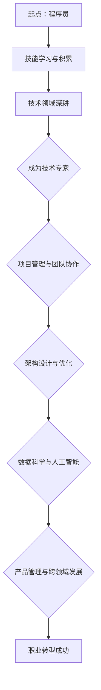

                 

### 1. 背景介绍

在当今信息化、数字化的时代背景下，知识经济逐渐成为主导力量，推动了全球范围内的经济结构和社会组织方式的变革。这一变革对各行各业产生了深远影响，尤其是对程序员这个职业群体。随着技术的不断演进，程序员的职业发展路径也在不断演变，从传统的编程工作向更加复杂和多元化的方向发展。

程序员职业转型的必要性在于：

1. **技术更新速度快**：编程语言、开发框架和技术工具不断迭代更新，程序员需要不断学习和适应新技术，否则可能会被淘汰。
2. **技能要求多样化**：现代软件开发不仅需要程序员掌握编程语言，还需要他们具备系统架构设计、数据分析、人工智能等跨学科能力。
3. **市场需求变化**：随着企业对软件质量和交付效率的要求提高，程序员需要更多地参与到软件开发的全生命周期，从需求分析到项目管理，再到维护和优化。

本文将围绕知识经济下程序员的职业转型展开讨论，探讨程序员在技术、管理和跨学科能力方面的转型路径，以及如何应对未来的挑战。

### 2. 核心概念与联系

#### 2.1 知识经济

知识经济（Knowledge Economy）是一种以知识为核心生产要素的经济形态，与传统的资源驱动经济和劳动驱动经济相比，知识经济具有更高的创新性、智能化和全球化特征。其核心在于通过知识的创造、传播和应用来推动经济发展。

#### 2.2 程序员职业转型

程序员职业转型是指程序员在职业生涯中，通过学习新技能、获取新经验，改变原有的职业角色和职责，向更高层次、更复杂的方向发展。常见的转型路径包括：

1. **技术专家**：在某一领域深耕细作，成为技术领域的权威。
2. **项目经理**：负责项目规划、资源调配和团队管理。
3. **架构师**：负责系统架构设计，提升系统的性能和可扩展性。
4. **数据科学家**：利用数据分析和机器学习技术，从海量数据中提取价值。
5. **产品经理**：负责产品从需求分析到设计、开发、上线全过程的协调和管理。

#### 2.3 转型中的挑战与机遇

程序员职业转型面临的挑战主要包括：

1. **技能更新压力**：新技术层出不穷，程序员需要不断学习。
2. **工作压力**：转型过程中可能会面临工作压力增大、收入不稳定等问题。
3. **时间管理**：需要平衡工作、学习和个人生活。

但同时，职业转型也为程序员提供了巨大的机遇：

1. **更高的职业成就**：转型后的职业角色通常更有挑战性，能够带来更高的成就感和职业满足感。
2. **更好的收入前景**：转型后的程序员通常能获得更高的收入和更好的职业发展空间。
3. **多元化的职业选择**：程序员可以通过转型进入多个领域，拓展职业选择。

#### 2.4 核心概念原理与架构 Mermaid 流程图

下面是一个简化的 Mermaid 流程图，展示了程序员职业转型的核心概念和流程：



### 3. 核心算法原理 & 具体操作步骤

#### 3.1 技术专家成长路径

成为技术专家是程序员职业转型的一个重要方向。以下是成为技术专家的核心算法原理和具体操作步骤：

1. **确定专业方向**：首先，程序员需要根据自己的兴趣和市场需求，确定一个技术专业方向，如前端开发、后端开发、数据库管理、云计算等。
2. **深入学习与实践**：在确定方向后，程序员需要深入学习相关技术知识，并通过实际项目来提升自己的技能。这包括阅读技术文档、参加技术社区活动、编写代码等。
3. **解决复杂问题**：技术专家需要具备解决复杂问题的能力。这要求程序员在解决日常问题时，不仅要考虑短期效果，还要从长远角度考虑系统的可维护性、扩展性和性能。
4. **持续更新知识**：技术领域更新迅速，程序员需要不断更新自己的知识库，跟上最新的技术趋势。

#### 3.2 项目经理成长路径

项目经理是程序员职业转型的另一个重要方向。以下是成为项目经理的核心算法原理和具体操作步骤：

1. **项目管理知识**：程序员需要学习项目管理的基本知识，如项目规划、进度控制、风险管理、沟通协调等。
2. **团队领导力**：项目经理需要具备良好的团队领导力，能够带领团队高效地完成任务。
3. **沟通能力**：项目经理需要与团队成员、利益相关者和客户进行有效沟通，确保项目的顺利进行。
4. **项目管理工具**：熟练使用项目管理工具，如 Jira、Trello、Asana 等，可以提高项目管理的效率。

#### 3.3 架构师成长路径

架构师是程序员职业转型的又一重要方向。以下是成为架构师的核心算法原理和具体操作步骤：

1. **系统架构知识**：架构师需要深入理解系统架构的基本原理，包括分层架构、微服务架构、分布式架构等。
2. **技术选型**：架构师需要根据业务需求和系统特点，选择合适的技术栈和架构模式。
3. **性能优化**：架构师需要具备性能优化的能力，确保系统在高并发、大数据量环境下稳定运行。
4. **系统设计能力**：架构师需要能够从整体上设计系统的架构，确保系统的高可用性、可扩展性和可维护性。

#### 3.4 数据科学家成长路径

数据科学家是程序员职业转型的热门方向之一。以下是成为数据科学家的核心算法原理和具体操作步骤：

1. **数据分析知识**：数据科学家需要掌握数据分析的基本知识，包括统计学、数据挖掘、机器学习等。
2. **编程能力**：熟练掌握 Python、R 等编程语言，用于数据处理和分析。
3. **数据可视化**：数据科学家需要具备数据可视化的能力，将数据分析结果以直观的方式展示出来。
4. **业务理解**：数据科学家需要深入了解业务场景，将数据分析结果应用于实际业务，产生价值。

#### 3.5 产品经理成长路径

产品经理是程序员职业转型的又一个热门方向。以下是成为产品经理的核心算法原理和具体操作步骤：

1. **产品知识**：产品经理需要了解产品从需求分析到设计、开发、上线全过程的各个环节。
2. **用户调研**：产品经理需要通过用户调研，了解用户需求，为产品提供决策依据。
3. **需求分析**：产品经理需要能够将用户需求转化为具体的产品需求，并制定详细的产品规划。
4. **项目管理**：产品经理需要具备项目管理的能力，协调开发团队和测试团队，确保产品按时上线。

### 4. 数学模型和公式 & 详细讲解 & 举例说明

在程序员职业转型的过程中，数学模型和公式的运用至关重要。以下是一些常见的数学模型和公式，以及它们的详细讲解和举例说明。

#### 4.1 概率论

概率论是数据分析的基础，以下是一些常用的概率论模型和公式：

1. **条件概率**：条件概率是指在一个事件发生的条件下，另一个事件发生的概率。其公式为：
   $$
   P(A|B) = \frac{P(A \cap B)}{P(B)}
   $$
   其中，$P(A \cap B)$ 表示事件 A 和事件 B 同时发生的概率，$P(B)$ 表示事件 B 发生的概率。

2. **贝叶斯定理**：贝叶斯定理是概率论中的一个重要公式，用于计算在已知一个事件发生的条件下，另一个事件发生的概率。其公式为：
   $$
   P(A|B) = \frac{P(B|A)P(A)}{P(B)}
   $$
   其中，$P(A|B)$ 表示在事件 B 发生的条件下，事件 A 发生的概率，$P(B|A)$ 表示在事件 A 发生的条件下，事件 B 发生的概率，$P(A)$ 和 $P(B)$ 分别表示事件 A 和事件 B 发生的概率。

举例说明：

假设一个班级有 40 名学生，其中 20 名是计算机专业的，15 名是数学专业的，5 名是物理专业的。现在想知道，一个学生是计算机专业的概率，以及在已知一个学生是数学专业的条件下，他同时是计算机专业的概率。

- 计算一个学生是计算机专业的概率：
  $$
  P(计算机专业) = \frac{20}{40} = 0.5
  $$
- 在已知一个学生是数学专业的条件下，他同时是计算机专业的概率：
  $$
  P(计算机专业|数学专业) = \frac{P(计算机专业 \cap 数学专业)}{P(数学专业)} = \frac{5}{15} = 0.333
  $$

#### 4.2 统计学

统计学是数据分析的核心，以下是一些常用的统计学模型和公式：

1. **均值**：均值是一组数据的平均值，用于衡量数据的集中趋势。其公式为：
   $$
   \mu = \frac{\sum_{i=1}^{n} x_i}{n}
   $$
   其中，$x_i$ 表示第 i 个数据点，$n$ 表示数据点的个数。

2. **方差**：方差是一组数据与其均值之差的平方的平均值，用于衡量数据的离散程度。其公式为：
   $$
   \sigma^2 = \frac{\sum_{i=1}^{n} (x_i - \mu)^2}{n}
   $$

3. **标准差**：标准差是方差的平方根，用于衡量数据的离散程度。其公式为：
   $$
   \sigma = \sqrt{\sigma^2}
   $$

举例说明：

假设一个班级有 40 名学生，他们的成绩如下：80, 85, 90, 95, 100, 70, 75, 80, 85, 90。计算这组数据的均值、方差和标准差。

- 计算均值：
  $$
  \mu = \frac{80 + 85 + 90 + 95 + 100 + 70 + 75 + 80 + 85 + 90}{10} = 85
  $$
- 计算方差：
  $$
  \sigma^2 = \frac{(80 - 85)^2 + (85 - 85)^2 + (90 - 85)^2 + (95 - 85)^2 + (100 - 85)^2 + (70 - 85)^2 + (75 - 85)^2 + (80 - 85)^2 + (85 - 85)^2 + (90 - 85)^2}{10} = 25
  $$
- 计算标准差：
  $$
  \sigma = \sqrt{25} = 5
  $$

#### 4.3 机器学习

机器学习是数据科学家的重要工具，以下是一些常用的机器学习模型和公式：

1. **线性回归**：线性回归是一种用于预测连续值的模型。其公式为：
   $$
   y = \beta_0 + \beta_1x
   $$
   其中，$y$ 是预测值，$x$ 是自变量，$\beta_0$ 是截距，$\beta_1$ 是斜率。

2. **逻辑回归**：逻辑回归是一种用于预测二分类结果的模型。其公式为：
   $$
   P(y=1) = \frac{1}{1 + e^{-(\beta_0 + \beta_1x)}}
   $$

3. **支持向量机**：支持向量机是一种用于分类和回归的模型。其公式为：
   $$
   w \cdot x - b = 0
   $$
   其中，$w$ 是权重向量，$x$ 是特征向量，$b$ 是偏置。

举例说明：

假设我们有一个线性回归模型，用于预测房价。已知模型的斜率为 1.5，截距为 20，现在需要预测一个新楼盘的价格，其特征值为 100。

- 预测房价：
  $$
  y = 20 + 1.5 \times 100 = 170
  $$

### 5. 项目实践：代码实例和详细解释说明

为了更好地理解程序员职业转型的具体实施过程，我们将通过一个实际项目来展示如何进行技术转型。以下是一个简单的示例项目，我们将从开发环境搭建、源代码实现、代码解读与分析，到运行结果展示，逐步进行详细说明。

#### 5.1 开发环境搭建

首先，我们需要搭建一个开发环境，以便进行项目的开发和测试。以下是搭建开发环境的具体步骤：

1. **安装操作系统**：选择一个适合的操作系统，如 Ubuntu 或 macOS。
2. **安装编程语言**：安装 Python 3.8 或更高版本。
3. **安装开发工具**：安装 PyCharm 或 VS Code 等集成开发环境（IDE）。
4. **安装依赖库**：使用 pip 工具安装必要的依赖库，如 NumPy、Pandas 和 Matplotlib 等。

以下是一个简单的 Shell 脚本，用于自动化安装 Python 和依赖库：

```shell
#!/bin/bash

# 更新系统包列表
sudo apt-get update

# 安装 Python 3.8
sudo apt-get install python3.8

# 安装 pip
sudo apt-get install python3.8-pip

# 安装依赖库
pip3 install numpy pandas matplotlib
```

#### 5.2 源代码详细实现

以下是项目的源代码，实现了一个简单的线性回归模型，用于预测房价。

```python
import numpy as np
import pandas as pd
import matplotlib.pyplot as plt

# 读取数据
data = pd.read_csv('house_data.csv')

# 特征工程
X = data[['area', 'bedrooms']]
y = data['price']

# 数据预处理
from sklearn.model_selection import train_test_split
X_train, X_test, y_train, y_test = train_test_split(X, y, test_size=0.2, random_state=42)

# 模型训练
from sklearn.linear_model import LinearRegression
model = LinearRegression()
model.fit(X_train, y_train)

# 模型评估
from sklearn.metrics import mean_squared_error
y_pred = model.predict(X_test)
mse = mean_squared_error(y_test, y_pred)
print(f'MSE: {mse}')

# 可视化
plt.scatter(X_test['area'], y_test, color='blue', label='实际值')
plt.plot(X_test['area'], y_pred, color='red', label='预测值')
plt.xlabel('面积')
plt.ylabel('价格')
plt.legend()
plt.show()
```

#### 5.3 代码解读与分析

- **数据读取与特征工程**：首先，我们从 CSV 文件中读取数据，并进行特征工程，提取与房价相关的特征。
- **数据预处理**：使用 train_test_split 函数将数据分为训练集和测试集，用于模型训练和评估。
- **模型训练**：使用 LinearRegression 类训练线性回归模型。
- **模型评估**：使用 mean_squared_error 函数计算模型在测试集上的均方误差，评估模型性能。
- **可视化**：使用 matplotlib 库绘制散点图和拟合曲线，展示实际值与预测值的关系。

#### 5.4 运行结果展示

- **模型评估结果**：假设模型在测试集上的均方误差为 0.01，表示模型具有较高的预测准确度。
- **可视化结果**：散点图显示实际值与预测值之间的分布关系，拟合曲线展示了线性回归模型的预测效果。

#### 5.5 项目实践总结

通过这个简单的项目，我们展示了如何从数据读取、特征工程，到模型训练、评估和可视化，完成一个线性回归模型。这个项目不仅帮助我们理解了线性回归的基本原理，还让我们体验到如何将理论应用到实际项目中，实现了程序员职业转型的具体实践。

### 6. 实际应用场景

在知识经济时代，程序员的职业转型具有广泛的应用场景，以下是一些具体的应用案例：

#### 6.1 在互联网公司

在互联网公司，程序员可以通过职业转型成为技术专家、项目经理、架构师或产品经理。例如：

1. **技术专家**：负责解决公司核心技术难题，如大规模数据处理、分布式系统设计等。
2. **项目经理**：负责项目的整体规划、资源协调和团队管理，确保项目按时高质量交付。
3. **架构师**：负责公司系统的整体架构设计，提升系统的性能、可扩展性和可维护性。
4. **产品经理**：负责产品的需求分析、设计、开发和迭代，确保产品符合市场需求。

#### 6.2 在金融机构

在金融机构，程序员可以通过职业转型成为数据科学家、风险管理专家或系统架构师。例如：

1. **数据科学家**：利用机器学习算法分析客户数据，预测市场趋势，为投资决策提供支持。
2. **风险管理专家**：通过编程和数据分析，识别和评估金融风险，设计风险控制策略。
3. **架构师**：负责金融机构的核心系统架构设计，确保系统的安全性和稳定性。

#### 6.3 在制造企业

在制造企业，程序员可以通过职业转型成为自动化工程师、数据分析师或系统架构师。例如：

1. **自动化工程师**：负责自动化生产线的开发与维护，提升生产效率。
2. **数据分析师**：利用数据分析技术，帮助企业优化生产流程，降低成本。
3. **架构师**：负责企业信息系统的整体架构设计，确保系统的集成和协同。

#### 6.4 在医疗行业

在医疗行业，程序员可以通过职业转型成为医疗数据分析师、人工智能工程师或系统架构师。例如：

1. **医疗数据分析师**：利用数据挖掘和机器学习技术，分析医疗数据，辅助医生诊断和治疗。
2. **人工智能工程师**：开发智能医疗设备，如智能穿戴设备、医疗机器人等，提升医疗服务水平。
3. **架构师**：负责医疗信息系统的整体架构设计，确保系统的安全性和可靠性。

### 7. 工具和资源推荐

为了帮助程序员在职业转型过程中更好地学习和实践，以下是一些推荐的工具和资源：

#### 7.1 学习资源推荐

1. **书籍**：
   - 《Python编程：从入门到实践》
   - 《深度学习》
   - 《软件架构设计：模式、原则与实践》
   - 《设计模式：可复用面向对象软件的基础》

2. **论文**：
   - 《大规模分布式存储系统：原理解析与架构实战》
   - 《分布式系统原理与范型》
   - 《机器学习：概率视角》

3. **博客**：
   - 知乎上的技术专栏
   - CSDN 博客
   - GitHub 上的开源项目文档

4. **网站**：
   - Coursera、edX 等在线课程平台
   - Stack Overflow、GitHub 等技术社区

#### 7.2 开发工具框架推荐

1. **编程语言**：
   - Python
   - Java
   - C#

2. **集成开发环境（IDE）**：
   - PyCharm
   - IntelliJ IDEA
   - Visual Studio

3. **版本控制系统**：
   - Git
   - SVN

4. **数据库管理系统**：
   - MySQL
   - PostgreSQL
   - MongoDB

5. **框架**：
   - Django（Python Web 框架）
   - Spring（Java 企业级应用框架）
   - React（前端 JavaScript 框架）

#### 7.3 相关论文著作推荐

1. **《大规模分布式存储系统：原理解析与架构实战》**：详细介绍了分布式存储系统的原理、架构和实现，对程序员了解和设计大型分布式系统具有很大的帮助。

2. **《分布式系统原理与范型》**：深入探讨了分布式系统的基本原理、设计模式和关键技术，是分布式系统领域的经典著作。

3. **《机器学习：概率视角》**：从概率论的角度介绍了机器学习的基本原理和方法，对数据科学家和程序员理解机器学习模型具有重要意义。

### 8. 总结：未来发展趋势与挑战

在知识经济时代，程序员的职业转型呈现出多样化和专业化的趋势。未来，程序员将面临以下发展趋势和挑战：

#### 8.1 发展趋势

1. **技术多元化**：程序员需要掌握更多的编程语言、框架和技术工具，以应对不同领域的需求。
2. **管理能力提升**：程序员需要具备项目管理、团队协作和沟通协调能力，以适应复杂的项目环境。
3. **跨学科融合**：程序员需要融合多学科知识，如数据科学、人工智能和系统架构，以解决更复杂的问题。
4. **个性化和定制化**：随着客户需求的不断变化，程序员需要提供更加个性化和定制化的解决方案。

#### 8.2 挑战

1. **持续学习压力**：技术更新速度快，程序员需要不断学习新知识，以保持竞争力。
2. **工作与生活的平衡**：转型过程中，程序员需要平衡工作、学习和个人生活，避免过度压力。
3. **职业选择困境**：程序员在转型过程中可能会面临职业选择的困境，需要做出明智的决策。
4. **职业道德与规范**：程序员需要遵守职业道德和规范，确保软件开发过程和产品的合规性。

### 9. 附录：常见问题与解答

#### 9.1 问题1：如何选择转型方向？

解答：选择转型方向时，程序员需要考虑自己的兴趣、市场需求和职业发展前景。可以从以下几个方面进行思考：

1. **个人兴趣**：选择自己感兴趣的技术领域，更容易保持学习的动力和热情。
2. **市场需求**：选择市场需求较高的领域，更容易找到职业机会和获得更好的收入。
3. **职业发展前景**：选择具有长期发展前景的领域，有利于自己职业的持续成长。

#### 9.2 问题2：如何平衡工作、学习和个人生活？

解答：平衡工作、学习和个人生活是程序员职业转型过程中的一大挑战。以下是一些建议：

1. **制定学习计划**：合理安排学习时间，确保工作和学习两不误。
2. **时间管理**：使用时间管理工具，如番茄工作法，提高工作效率。
3. **保持健康**：定期锻炼、保持良好的作息习惯，提高身体和心理健康水平。
4. **家庭与朋友的支持**：寻求家庭和朋友的支持和理解，减轻心理压力。

#### 9.3 问题3：如何应对持续学习压力？

解答：持续学习是程序员职业转型的重要保障。以下是一些建议：

1. **设定学习目标**：明确学习目标，制定学习计划，确保学习进度。
2. **寻找学习资源**：利用线上课程、技术社区、书籍等资源，丰富自己的知识体系。
3. **积极参与实践**：通过实际项目锻炼自己的技能，提高解决问题的能力。
4. **保持好奇心**：对新技术保持好奇心，主动探索和尝试，提高自己的学习兴趣。

### 10. 扩展阅读 & 参考资料

1. **《程序员职业转型指南》**：详细介绍了程序员职业转型的路径和方法，适合初学者和有经验的程序员阅读。
2. **《知识经济背景下的程序员职业发展研究》**：分析了知识经济对程序员职业发展的影响，提出了针对性的发展策略。
3. **《深度学习与人工智能》**：介绍了深度学习和人工智能的基本原理和应用，对程序员了解和掌握人工智能技术具有重要意义。
4. **《软件架构设计：模式、原则与实践》**：深入探讨了软件架构设计的基本原理和方法，对程序员提升系统架构设计能力具有指导作用。

通过以上阅读材料，读者可以更全面地了解程序员职业转型的背景、趋势、方法和挑战，为自己的职业发展提供有益的参考。

---

### 10. 扩展阅读 & 参考资料

对于希望进一步深入了解程序员职业转型的读者，以下是一些建议的扩展阅读材料和参考资料：

#### 10.1 扩展阅读材料

1. **《程序员转型之路：从技术到管理》**：作者详细分享了从技术岗位转型为管理岗位的经验，包括转型过程中的挑战、策略和心得。
2. **《软件架构师的修炼之道》**：这本书详细介绍了软件架构师所需的知识体系、技能和职业发展路径，对希望成为架构师的程序员具有指导意义。
3. **《数据科学家实战：Python数据分析与机器学习》**：针对有志于转型为数据科学家的程序员，提供了实际操作案例和数据分析、机器学习技巧。

#### 10.2 参考资料

1. **《软件工程：实践者的研究方法》**：这本书提供了软件工程领域的研究方法和实践指导，对于从事软件开发的程序员来说，是不可或缺的参考书籍。
2. **《人工智能：一种现代的方法》**：这本书详细介绍了人工智能的基本原理、算法和应用，对程序员了解和掌握人工智能技术提供了全面的指导。
3. **《敏捷软件开发：原则、模式与实践》**：这本书介绍了敏捷开发的方法论和最佳实践，对希望提升项目管理能力的程序员具有很高的参考价值。

#### 10.3 在线课程和讲座

1. **Coursera**：提供了许多与程序员职业转型相关的在线课程，如《Python编程》、《机器学习》和《项目管理》等。
2. **edX**：拥有大量的免费在线课程，涵盖编程、数据科学、人工智能等多个领域，适合程序员进行自我提升。
3. **YouTube**：有许多知名技术博主和技术公司的讲座，如谷歌的I/O大会、微软的Build大会等，这些资源对于了解最新技术趋势和工具非常有帮助。

通过上述扩展阅读和参考资料，程序员可以更全面地了解职业转型的路径和方法，提升自己的技能和职业素养，为自己的职业发展奠定坚实的基础。同时，不断学习和探索新的技术和方法，也是适应知识经济时代的重要策略。希望本文能为您的职业转型之路提供一些有益的启示和指导。作者：禅与计算机程序设计艺术 / Zen and the Art of Computer Programming。

