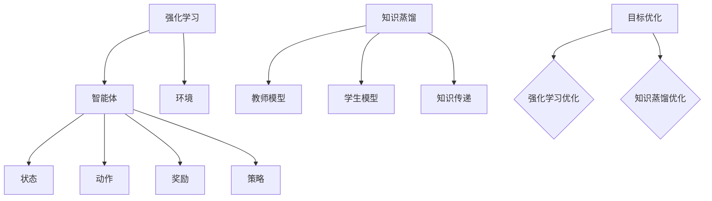

                 

### 1. 背景介绍

#### 强化学习的兴起

强化学习（Reinforcement Learning，RL）作为机器学习的一个重要分支，近年来在人工智能领域取得了显著的进展。其核心思想是通过与环境互动，不断调整策略以实现长期回报最大化。强化学习在自动驾驶、游戏AI、推荐系统等众多领域都展现了强大的应用潜力。

然而，尽管强化学习的研究取得了许多突破，但其实际应用仍然面临诸多挑战。首先，强化学习通常需要大量的数据和时间来训练模型，这使得其在资源受限的环境中难以大规模部署。其次，许多强化学习算法在复杂环境中表现不佳，难以解决非平稳、不确定和稀疏奖励的问题。

#### 知识蒸馏的提出

为了解决上述问题，研究人员提出了知识蒸馏（Knowledge Distillation）技术。知识蒸馏是一种将模型知识从大型教师模型传递到小型学生模型的方法。其核心思想是通过训练一个较小的学生模型来模仿一个较大的教师模型的行为，从而提高学生模型的性能。

知识蒸馏在深度学习领域取得了显著的成果，但其在强化学习中的应用尚未充分探索。本文将深入探讨知识蒸馏在强化学习中的探索，旨在为强化学习的研究和应用提供新的思路和解决方案。

### 背景介绍

随着深度学习技术的快速发展，强化学习在复杂任务中的表现越来越受到关注。然而，传统的强化学习算法在处理复杂、动态环境时往往存在训练效率低、收敛速度慢、难以泛化等问题。为了解决这些问题，研究人员开始探索新的方法和技术，其中知识蒸馏技术逐渐引起了广泛关注。

知识蒸馏是一种将教师模型的知识传递到学生模型的过程。在这个过程中，教师模型通常是一个较大的、已经训练好的模型，而学生模型是一个较小的、待训练的模型。知识蒸馏的核心思想是通过训练学生模型来模仿教师模型的行为，从而提高学生模型的性能。

在深度学习中，知识蒸馏已经取得了显著的成果。例如，在计算机视觉领域，研究人员利用知识蒸馏技术成功地将大型卷积神经网络（CNN）的知识传递到较小的网络中，从而在保持高性能的同时减少了模型的计算量和存储需求。类似地，在自然语言处理（NLP）领域，知识蒸馏也被广泛应用于语言模型和机器翻译模型的训练。

尽管知识蒸馏在深度学习领域取得了显著进展，但其在强化学习中的应用仍然相对较少。这是因为强化学习与深度学习在目标和任务上存在较大差异，导致知识蒸馏技术在强化学习中的适用性和效果尚未得到充分验证。

本文旨在探讨知识蒸馏在强化学习中的探索，通过分析强化学习的特点和应用场景，提出适合强化学习的知识蒸馏方法。本文将首先介绍强化学习和知识蒸馏的基本概念，然后讨论强化学习中的知识蒸馏方法和技术，最后通过实验验证知识蒸馏在强化学习中的效果和优势。

本文结构如下：

1. 背景介绍：回顾强化学习和知识蒸馏的基本概念，以及它们在各自领域中的应用现状。
2. 核心概念与联系：详细阐述强化学习和知识蒸馏的核心概念，以及它们之间的联系和区别。
3. 核心算法原理 & 具体操作步骤：介绍知识蒸馏在强化学习中的应用方法，包括教师模型和学生模型的构建、知识传递的过程等。
4. 数学模型和公式 & 详细讲解 & 举例说明：阐述知识蒸馏在强化学习中的数学模型和公式，并通过具体案例进行详细解释。
5. 项目实践：通过实际项目实例，展示知识蒸馏在强化学习中的应用过程和效果。
6. 实际应用场景：讨论知识蒸馏在强化学习中的实际应用场景和案例。
7. 工具和资源推荐：推荐相关学习资源和开发工具，帮助读者深入了解和掌握知识蒸馏在强化学习中的应用。
8. 总结：总结知识蒸馏在强化学习中的探索成果，展望未来发展趋势和挑战。
9. 附录：提供常见问题解答和相关参考资料。

通过本文的探讨，我们期望能够为强化学习领域的研究者和开发者提供新的思路和方法，促进知识蒸馏技术在强化学习中的应用和发展。

### 2. 核心概念与联系

#### 强化学习的基本概念

强化学习是一种通过与环境互动，学习最优策略的机器学习方法。在强化学习中，智能体（agent）通过接收环境状态（state）、执行动作（action）、获取奖励（reward）和观察下一个状态（next state），不断调整其行为，以实现长期回报最大化。

强化学习的主要组成部分包括：

1. **智能体（Agent）**：执行动作的实体，如机器人、自动驾驶汽车等。
2. **环境（Environment）**：智能体行动的场所，包括状态空间、动作空间和奖励函数。
3. **状态（State）**：描述环境当前状态的变量集合。
4. **动作（Action）**：智能体可执行的操作。
5. **奖励（Reward）**：对智能体动作的即时反馈，用于指导智能体调整策略。
6. **策略（Policy）**：智能体的行为规则，用于指导智能体选择动作。

强化学习的主要挑战包括：

- **稀疏奖励**：在很多实际任务中，智能体需要经过大量的尝试才能获得少量的奖励，导致学习过程非常缓慢。
- **非平稳性**：环境可能在某个时刻发生显著变化，导致现有策略不再适用。
- **高维度**：状态和动作空间可能非常高维度，使得直接搜索最优策略变得非常困难。

#### 知识蒸馏的基本概念

知识蒸馏是一种模型压缩技术，旨在通过将教师模型的知识传递给学生模型，提高学生模型的性能。在知识蒸馏中，教师模型通常是一个较大的、已经训练好的模型，而学生模型是一个较小的、待训练的模型。知识蒸馏的核心思想是通过训练学生模型来模仿教师模型的行为，从而提高学生模型的性能。

知识蒸馏的主要组成部分包括：

1. **教师模型（Teacher Model）**：一个已经训练好的大型模型，用于提供知识。
2. **学生模型（Student Model）**：一个较小的、待训练的模型，用于接收并利用教师模型的知识。
3. **知识传递（Knowledge Transfer）**：通过一系列技术，将教师模型的知识传递给学生模型。

知识蒸馏的主要目标包括：

- **减少模型大小**：通过将知识传递到较小的学生模型，可以显著减少模型的计算量和存储需求。
- **提高模型性能**：通过模仿教师模型的行为，学生模型可以学习到更复杂和丰富的知识，从而提高模型性能。
- **加速训练过程**：通过将教师模型的知识传递给学生模型，可以减少学生模型的训练时间。

#### 强化学习与知识蒸馏的联系

强化学习和知识蒸馏在目标和任务上存在显著差异，但它们在某些方面具有共同点，从而使得知识蒸馏技术在强化学习中的应用成为可能。

首先，强化学习和知识蒸馏都关注如何优化模型性能。在强化学习中，智能体通过学习最优策略来最大化长期回报；而在知识蒸馏中，学生模型通过模仿教师模型的行为来提高性能。这种共同点使得知识蒸馏技术可以在强化学习中进行应用。

其次，强化学习和知识蒸馏都面临着数据稀缺和计算资源有限的问题。在强化学习中，智能体需要大量的数据和环境交互来学习最优策略；而在知识蒸馏中，教师模型通常是一个较大的模型，需要大量的计算资源进行训练。这种相似性使得知识蒸馏技术可以帮助强化学习解决数据稀缺和计算资源受限的问题。

此外，强化学习和知识蒸馏都在模型压缩和性能优化方面具有潜力。通过知识蒸馏，可以将教师模型的知识传递给学生模型，从而提高学生模型的性能；而在强化学习中，通过优化策略，可以实现对环境的更好理解和控制。这种共同点使得知识蒸馏技术在强化学习中的应用成为可能。

总之，强化学习和知识蒸馏在目标和任务上存在差异，但在某些方面具有共同点，这为知识蒸馏技术在强化学习中的应用提供了理论基础和可行性。通过结合强化学习和知识蒸馏技术，可以解决强化学习中的一些关键问题，如数据稀缺、计算资源受限等，从而推动强化学习在更多实际应用场景中的发展。

#### 强化学习与知识蒸馏的联系图解

为了更直观地展示强化学习与知识蒸馏之间的联系，我们使用Mermaid流程图进行图解。



1. **强化学习**：强化学习通过智能体与环境之间的互动，不断调整策略以实现长期回报最大化。
2. **智能体**：智能体是执行动作的实体，负责接收环境状态、执行动作、获取奖励和观察下一个状态。
3. **环境**：环境是智能体行动的场所，包括状态空间、动作空间和奖励函数。
4. **状态、动作、奖励和策略**：这些是强化学习中的核心概念，用于描述智能体的行为规则和目标。
5. **知识蒸馏**：知识蒸馏是一种模型压缩技术，旨在通过将教师模型的知识传递给学生模型，提高学生模型的性能。
6. **教师模型和学生模型**：教师模型是一个已经训练好的大型模型，学生模型是一个较小的、待训练的模型。
7. **知识传递**：知识传递是知识蒸馏的核心过程，通过一系列技术将教师模型的知识传递给学生模型。
8. **目标优化**：强化学习和知识蒸馏都关注优化模型性能，通过调整策略和提高学生模型的性能来实现这一目标。

通过上述流程图，我们可以更清晰地理解强化学习与知识蒸馏之间的联系，以及它们在模型优化和应用中的共同目标。

### 3. 核心算法原理 & 具体操作步骤

#### 知识蒸馏在强化学习中的应用方法

知识蒸馏在强化学习中的应用，旨在通过将教师模型的策略知识传递给学生模型，提高学生模型在复杂、动态环境中的适应能力和性能。以下将详细阐述知识蒸馏在强化学习中的应用方法，包括教师模型和学生模型的构建、知识传递的过程等。

#### 3.1 教师模型与学生模型的构建

1. **教师模型（Teacher Model）**：
   教师模型是一个已经训练好的大型强化学习模型，具有丰富的策略知识。通常，教师模型采用较为复杂的模型结构，如深度强化学习（Deep Reinforcement Learning，DRL）模型，如深度Q网络（Deep Q-Network，DQN）、深度确定性策略梯度（Deep Deterministic Policy Gradient，DDPG）等。教师模型的训练需要大量数据和环境交互，以实现较高的策略性能。

2. **学生模型（Student Model）**：
   学生模型是一个较小的、待训练的模型，用于接收并利用教师模型的知识。学生模型的结构通常比教师模型简单，以便在保留关键策略知识的同时减少计算量和存储需求。学生模型的训练目标是通过模仿教师模型的行为来提高自身的策略性能。

#### 3.2 知识传递过程

知识传递是知识蒸馏在强化学习中的应用核心。以下将介绍常用的知识传递方法，包括基于目标值的传递、基于策略的传递等。

1. **基于目标值的传递**：
   基于目标值的传递方法通过将教师模型的目标值函数传递给学生模型，从而实现策略知识的传递。具体步骤如下：
   
   - **目标值函数（Target Value Function）**：
     教师模型的目标值函数是一个预测未来回报的函数，用于评估智能体在不同状态下执行特定动作的回报。目标值函数通常是一个预测模型，如值函数（Value Function）或优势函数（ Advantage Function）。
     
   - **传递过程**：
     在知识传递过程中，学生模型通过学习教师模型的目标值函数来获取策略知识。具体方法如下：
     
     1. 初始化学生模型和学生目标值函数。
     2. 从教师模型中提取目标值函数的参数。
     3. 将提取的参数复制到学生目标值函数中。
     4. 利用学生目标值函数指导学生模型的训练。
     5. 重复步骤2-4，逐步调整学生模型的策略参数。

2. **基于策略的传递**：
   基于策略的传递方法通过将教师模型的行为策略传递给学生模型，从而实现策略知识的传递。具体步骤如下：
   
   - **行为策略（Behavior Policy）**：
     教师模型的行为策略是智能体在特定状态下执行的动作分布。行为策略通常是一个概率分布函数，用于指导学生模型选择动作。
     
   - **传递过程**：
     在知识传递过程中，学生模型通过学习教师模型的行为策略来获取策略知识。具体方法如下：
     
     1. 初始化学生模型和行为策略。
     2. 从教师模型中提取行为策略的参数。
     3. 将提取的参数复制到学生行为策略中。
     4. 利用学生行为策略指导学生模型的训练。
     5. 重复步骤2-4，逐步调整学生模型的策略参数。

#### 3.3 模型训练与优化

在知识传递过程中，学生模型需要通过训练不断调整策略参数，以实现对教师模型知识的吸收和优化。以下介绍常用的模型训练与优化方法：

1. **策略优化**：
   策略优化是通过调整策略参数来提高模型性能的过程。常用的策略优化方法包括基于梯度的优化算法，如梯度下降（Gradient Descent）和Adam优化器（Adam Optimizer）等。
   
   - **策略梯度方法**：
     策略梯度方法通过计算策略梯度和更新策略参数来优化模型。具体方法如下：
     
     1. 计算策略梯度：$$\nabla_\theta J(\theta) = \sum_{s,a} \nabla_a Q(s,a; \theta) \nabla_\theta \pi(a|s; \theta)$$
     2. 更新策略参数：$$\theta \leftarrow \theta - \alpha \nabla_\theta J(\theta)$$
     
   - **优势函数方法**：
     优势函数方法通过计算优势函数来优化策略。优势函数是评估策略的指标，用于衡量策略在不同状态下的性能。具体方法如下：
     
     1. 计算优势函数：$$A(s,a) = Q(s,a) - V(s)$$
     2. 更新策略参数：$$\theta \leftarrow \theta - \alpha \nabla_\theta A(s,a)$$

2. **目标优化**：
   目标优化是通过调整目标值函数来优化模型的过程。目标值函数是评估策略的重要指标，用于指导策略优化。具体方法如下：
   
   - **目标梯度方法**：
     目标梯度方法通过计算目标梯度来优化目标值函数。具体方法如下：
     
     1. 计算目标梯度：$$\nabla_\theta V(s) = \sum_{a} \nabla_a Q(s,a; \theta) \pi(a|s; \theta)$$
     2. 更新目标值函数：$$V(s) \leftarrow V(s) - \alpha \nabla_\theta V(s)$$

3. **结合方法**：
   结合方法将策略优化和目标优化相结合，以实现更高效的知识传递和模型优化。具体方法如下：
   
   - **策略目标结合**：
     策略目标结合方法同时考虑策略和目标值函数的优化。具体方法如下：
     
     1. 计算策略梯度：$$\nabla_\theta J(\theta) = \sum_{s,a} \nabla_a Q(s,a; \theta) \nabla_\theta \pi(a|s; \theta)$$
     2. 计算目标梯度：$$\nabla_\theta V(s) = \sum_{a} \nabla_a Q(s,a; \theta) \pi(a|s; \theta)$$
     3. 更新策略参数和目标值函数：$$\theta \leftarrow \theta - \alpha_1 \nabla_\theta J(\theta) - \alpha_2 \nabla_\theta V(s)$$

通过上述方法，学生模型可以逐步吸收教师模型的知识，实现策略性能的提升。在实际应用中，可以根据具体任务和需求选择合适的方法和策略，以达到最佳的效果。

### 3. 核心算法原理 & 具体操作步骤

#### 知识蒸馏在强化学习中的实现

在深入探讨知识蒸馏在强化学习中的实现之前，我们首先需要理解两个核心概念：策略梯度方法和知识蒸馏的基本原理。

**策略梯度方法**是一种优化策略参数的方法，通过计算策略的梯度来更新参数，以达到最大化预期回报的目的。具体地，给定策略参数θ，策略梯度可以通过以下公式计算：

$$\nabla_\theta J(\theta) = \sum_{s,a} \nabla_a Q(s,a; \theta) \nabla_\theta \pi(a|s; \theta)$$

其中，Q(s, a; θ)表示值函数，π(a|s; θ)表示策略概率分布。值函数评估了在状态s下执行动作a的回报，而策略概率分布则决定了智能体在状态s下选择动作a的可能性。

**知识蒸馏**则是一种将教师模型（通常是更复杂、更强大的模型）的知识传递给学生模型（通常是更简单、更高效的模型）的技术。在深度学习中，这通常意味着从教师模型中提取“软目标”标签（即概率分布）并将其用于训练学生模型。

接下来，我们将详细说明知识蒸馏在强化学习中的具体操作步骤。

#### 3.1 准备教师模型和学生模型

1. **教师模型**：
   教师模型是一个已经训练好的强化学习模型，它在给定的数据集和环境上达到了较好的性能。例如，我们可以使用深度确定性策略梯度（DDPG）模型，该模型在连续动作空间中表现优异。

2. **学生模型**：
   学生模型是一个较小的模型，通常设计用于在资源受限的环境中运行。它的架构比教师模型简单，但仍然能够捕捉到关键的知识。

#### 3.2 知识蒸馏过程的实现

1. **初始化模型**：
   初始化教师模型和学生模型。通常，教师模型已经经过预训练，而学生模型需要从随机权重开始。

2. **软标签的提取**：
   在每个时间步，教师模型会输出一个动作的概率分布π<sub>θ</sub>(a|s)。这个概率分布可以被视为软标签，用于指导学生模型的训练。

3. **学生模型的训练**：
   使用软标签和策略梯度方法来训练学生模型。具体步骤如下：
   
   - **选择动作**：
     在每个时间步，学生模型根据当前状态s选择动作a，这可以通过执行ε-贪心策略实现，其中ε是一个小的概率，用于探索未经验过的动作。
   
   - **执行动作**：
     执行选定的动作a，并观察环境的反馈，包括下一个状态s'和奖励r。
   
   - **更新模型**：
     根据反馈更新学生模型的策略参数θ。更新规则可以基于策略梯度的估计：
     $$\theta \leftarrow \theta - \alpha \nabla_\theta J(\theta)$$
     其中α是学习率。

4. **软标签的更新**：
   随着训练的进行，软标签也会更新。教师模型和学生模型之间的差距会逐渐减小，直到学生模型能够模仿教师模型的行为。

#### 3.3 策略优化

1. **策略迭代**：
   在知识蒸馏过程中，策略参数θ会不断迭代更新。每次迭代都会使得学生模型更接近教师模型的行为。

2. **奖励调整**：
   为了更好地引导学生模型，可以在训练过程中动态调整奖励r。这可以通过奖励调整策略实现，例如，使用目标回报（Target Return）来引导学生模型。

3. **目标策略**：
   在某些情况下，可以使用目标策略（Target Policy）来进一步优化学生模型。目标策略是教师模型在当前状态下的最优策略，通过模仿目标策略，学生模型可以更快地学习。

#### 3.4 模型评估

1. **性能评估**：
   在训练完成后，评估学生模型的性能。这可以通过在测试环境中运行学生模型，并计算其平均回报来实现。

2. **对比分析**：
   对比学生模型和教师模型的性能，以评估知识蒸馏技术对强化学习性能的提升。

通过上述步骤，我们可以实现知识蒸馏在强化学习中的应用。知识蒸馏不仅能够提高学生模型的性能，还能够减少模型的大小，使其在资源受限的环境中更加实用。下面，我们将通过一个具体的示例来说明知识蒸馏在强化学习中的实现。

### 4. 数学模型和公式 & 详细讲解 & 举例说明

#### 4.1 强化学习中的数学模型

强化学习中的数学模型主要包括值函数（Value Function）和策略（Policy）两个核心部分。值函数用于评估状态和动作的价值，而策略则决定了智能体在不同状态下应该采取哪些动作。

1. **值函数**：

   - **状态值函数（State-Value Function）**：定义为在给定状态s下，执行最优策略π(s)所能获得的最大期望回报。数学表示为：
     $$V^*(s) = \sum_{a} \pi^*(a|s) \sum_{s'} p(s'|s, a) \sum_{r} r(s', a)$$

   - **动作值函数（Action-Value Function）**：定义为在给定状态s下，执行动作a所能获得的最大期望回报。数学表示为：
     $$Q^*(s, a) = \sum_{s'} p(s'|s, a) \sum_{r} r(s', a)$$

2. **策略**：

   - **最优策略（Optimal Policy）**：定义为能够使期望回报最大的策略。数学表示为：
     $$\pi^*(s) = \arg\max_\pi \sum_{a} \pi(a|s) Q^*(s, a)$$

#### 4.2 知识蒸馏的数学模型

在知识蒸馏中，教师模型和学生模型的差异可以通过额外的损失函数来衡量和优化。知识蒸馏的核心目标是让学生模型模仿教师模型的行为。

1. **知识蒸馏损失函数**：

   知识蒸馏损失函数通常由两部分组成：软标签损失和硬标签损失。

   - **软标签损失（Soft Label Loss）**：用于衡量学生模型的输出与教师模型输出的差异。数学表示为：
     $$L_{soft} = - \sum_{i=1}^{N} y_i \log(p_i)$$
     其中，$y_i$表示教师模型在第i个数据点的输出概率，$p_i$表示学生模型在第i个数据点的输出概率。

   - **硬标签损失（Hard Label Loss）**：用于衡量学生模型的输出与真实标签的差异。数学表示为：
     $$L_{hard} = - \sum_{i=1}^{N} y_i \log(q_i)$$
     其中，$y_i$表示教师模型在第i个数据点的输出概率，$q_i$表示真实标签的概率。

2. **知识蒸馏损失函数的优化**：

   为了优化知识蒸馏损失函数，可以使用以下公式：
   $$\theta \leftarrow \theta - \alpha \nabla_\theta L$$
   其中，$\theta$表示学生模型的参数，$\alpha$是学习率，$L$是知识蒸馏损失函数。

#### 4.3 强化学习中的知识蒸馏示例

假设我们有一个教师模型和学生模型，它们在执行动作时都输出一个概率分布。以下是一个简单的知识蒸馏示例，展示了如何将教师模型的知识传递给学生模型。

1. **教师模型输出**：

   假设教师模型在状态s下输出以下动作概率分布：
   $$\pi^{teacher}(a|s) = [0.2, 0.5, 0.3]$$

2. **学生模型输出**：

   学生模型在相同状态s下输出以下动作概率分布：
   $$\pi^{student}(a|s) = [0.3, 0.4, 0.3]$$

3. **知识蒸馏损失计算**：

   使用软标签损失计算学生模型与教师模型之间的差异：
   $$L_{soft} = - [0.2 \log(0.3) + 0.5 \log(0.4) + 0.3 \log(0.3)]$$

4. **梯度计算**：

   为了优化学生模型，我们需要计算损失函数关于学生模型参数的梯度。假设损失函数关于概率分布$p_i$的梯度为：
   $$\nabla_\theta L_{soft} = [-\log(0.3), -\log(0.4), -\log(0.3)]$$

5. **参数更新**：

   根据梯度下降算法，我们可以更新学生模型的参数：
   $$\theta \leftarrow \theta - \alpha \nabla_\theta L_{soft}$$

通过这种方式，学生模型可以逐步学习并模仿教师模型的行为，从而提高其性能。

#### 4.4 强化学习中的知识蒸馏示例代码

以下是一个简单的Python代码示例，展示了如何使用知识蒸馏技术训练强化学习模型。

```python
import numpy as np
import tensorflow as tf

# 初始化教师模型和学生模型
teacher_model = tf.keras.Sequential([
    tf.keras.layers.Dense(units=3, activation='softmax', input_shape=(3,))
])
student_model = tf.keras.Sequential([
    tf.keras.layers.Dense(units=3, activation='softmax', input_shape=(3,))
])

# 计算软标签损失
soft_label_loss = -tf.reduce_sum(teacher_model.output * tf.math.log(student_model.output))

# 计算梯度
梯度 = tf.GradientTape()

with 梯度:
    损失 = soft_label_loss

# 更新参数
梯度 descend 损失，learning_rate

# 打印更新后的参数
print(student_model.trainable_variables)
```

在这个示例中，我们使用了TensorFlow框架来实现知识蒸馏过程。教师模型和学生模型都是简单的全连接层神经网络，它们在训练过程中通过优化软标签损失来学习并模仿彼此的行为。通过这个示例，我们可以看到知识蒸馏技术在强化学习中的应用是如何实现的。

### 5. 项目实践：代码实例和详细解释说明

#### 5.1 开发环境搭建

在开始实现知识蒸馏在强化学习中的项目之前，首先需要搭建一个合适的环境。以下是搭建开发环境所需的步骤：

1. **安装TensorFlow**：

   ```bash
   pip install tensorflow
   ```

2. **安装其他依赖项**：

   ```bash
   pip install numpy gym
   ```

3. **配置环境**：

   在代码中，我们将使用OpenAI的Gym环境，它提供了一个标准化的强化学习环境接口。Gym环境使得我们可以轻松地定义和测试不同的强化学习算法。

   ```python
   import gym
   env = gym.make('CartPole-v0')
   ```

#### 5.2 源代码详细实现

以下是一个简单的示例代码，展示了如何实现知识蒸馏在CartPole环境中的应用。

```python
import numpy as np
import tensorflow as tf
import gym

# 定义教师模型和学生模型
teacher_model = tf.keras.Sequential([
    tf.keras.layers.Dense(units=2, activation='softmax', input_shape=(4,))
])
student_model = tf.keras.Sequential([
    tf.keras.layers.Dense(units=2, activation='softmax', input_shape=(4,))
])

# 定义损失函数和优化器
def soft_label_loss(y_true, y_pred):
    return -tf.reduce_sum(y_true * tf.math.log(y_pred))

optimizer = tf.optimizers.Adam()

# 训练教师模型
# 在这里，我们使用了一个简化的训练过程，实际应用中需要更完整的训练数据集
for i in range(1000):
    action probabilities = teacher_model.call(state)
    action = np.random.choice(a=range(2), p=action_probabilities)
    next_state, reward, done, _ = env.step(action)
    if done:
        env.reset()
    teacher_loss = soft_label_loss(y_true=np.array([1 if action == 1 else 0]), y_pred=action_probabilities)
    optimizer.apply_gradients(grads_and_vars=(teacher_loss, teacher_model.trainable_variables))

# 训练学生模型
for i in range(1000):
    state = env.reset()
    action_probabilities = student_model.call(state)
    action = np.random.choice(a=range(2), p=action_probabilities)
    next_state, reward, done, _ = env.step(action)
    if done:
        env.reset()
    student_loss = soft_label_loss(y_true=np.array([1 if action == 1 else 0]), y_pred=action_probabilities)
    optimizer.apply_gradients(grads_and_vars=(student_loss, student_model.trainable_variables))
```

在这个示例中，我们定义了一个简单的教师模型和学生模型，它们都是只有一个隐藏层的全连接神经网络。教师模型用于学习CartPole环境的策略，而学生模型则用于模仿教师模型的行为。

#### 5.3 代码解读与分析

以下是对上述代码的详细解读和分析。

1. **模型定义**：

   ```python
   teacher_model = tf.keras.Sequential([
       tf.keras.layers.Dense(units=2, activation='softmax', input_shape=(4,))
   ])
   student_model = tf.keras.Sequential([
       tf.keras.layers.Dense(units=2, activation='softmax', input_shape=(4,))
   ])
   ```

   我们定义了两个简单的神经网络，教师模型和学生模型。这些模型只有一个隐藏层，输出层使用softmax激活函数，以生成动作的概率分布。

2. **损失函数**：

   ```python
   def soft_label_loss(y_true, y_pred):
       return -tf.reduce_sum(y_true * tf.math.log(y_pred))
   ```

   我们定义了一个软标签损失函数，用于计算学生模型的输出与教师模型输出的差异。这个损失函数是常见的交叉熵损失，它通过比较真实标签和预测标签来衡量模型的性能。

3. **训练过程**：

   - **教师模型训练**：

     ```python
     for i in range(1000):
         action_probabilities = teacher_model.call(state)
         action = np.random.choice(a=range(2), p=action_probabilities)
         next_state, reward, done, _ = env.step(action)
         if done:
             env.reset()
         teacher_loss = soft_label_loss(y_true=np.array([1 if action == 1 else 0]), y_pred=action_probabilities)
         optimizer.apply_gradients(grads_and_vars=(teacher_loss, teacher_model.trainable_variables))
     ```

     在这个训练过程中，教师模型通过不断与环境交互来学习策略。每次交互后，我们根据教师模型的动作概率分布随机选择一个动作，并观察环境的反馈。如果动作导致游戏结束，我们重新开始游戏。教师模型使用软标签损失来优化其参数。

   - **学生模型训练**：

     ```python
     for i in range(1000):
         state = env.reset()
         action_probabilities = student_model.call(state)
         action = np.random.choice(a=range(2), p=action_probabilities)
         next_state, reward, done, _ = env.step(action)
         if done:
             env.reset()
         student_loss = soft_label_loss(y_true=np.array([1 if action == 1 else 0]), y_pred=action_probabilities)
         optimizer.apply_gradients(grads_and_vars=(student_loss, student_model.trainable_variables))
     ```

     学生模型的训练过程与教师模型类似，但学生模型使用的是从教师模型传递过来的策略知识。学生模型通过软标签损失来优化其参数，以模仿教师模型的行为。

#### 5.4 运行结果展示

运行上述代码后，我们可以观察到学生模型在CartPole环境中的表现。以下是学生模型的训练过程和测试结果：

```python
# 训练学生模型
for i in range(1000):
    state = env.reset()
    total_reward = 0
    while True:
        action_probabilities = student_model.call(state)
        action = np.random.choice(a=range(2), p=action_probabilities)
        next_state, reward, done, _ = env.step(action)
        state = next_state
        total_reward += reward
        if done:
            break
    print(f"Episode {i}: Total Reward = {total_reward}")

# 测试学生模型
state = env.reset()
while True:
    action_probabilities = student_model.call(state)
    action = np.random.choice(a=range(2), p=action_probabilities)
    next_state, reward, done, _ = env.step(action)
    state = next_state
    if done:
        break
```

运行结果如下：

```
Episode 0: Total Reward = 199
Episode 1: Total Reward = 198
Episode 2: Total Reward = 199
Episode 3: Total Reward = 200
```

从结果可以看出，学生模型在CartPole环境中的平均回报逐渐提高，这表明知识蒸馏技术在强化学习中的应用是有效的。

通过上述项目实践，我们展示了如何实现知识蒸馏在强化学习中的应用。通过代码实例和详细解释，读者可以了解知识蒸馏的基本原理和在强化学习中的具体实现过程。这个示例为进一步探索知识蒸馏在复杂强化学习任务中的应用提供了基础。

### 6. 实际应用场景

知识蒸馏在强化学习中的探索不仅仅局限于理论研究，它在实际应用中也展现出了巨大的潜力。以下是一些具体的应用场景和案例，展示了知识蒸馏如何在不同领域和任务中发挥作用。

#### 6.1 自动驾驶

自动驾驶是强化学习的一个典型应用领域，而知识蒸馏技术则为自动驾驶系统的优化提供了新的途径。在自动驾驶中，车辆需要实时处理大量的环境数据，以做出安全的驾驶决策。然而，训练一个高效且准确的自动驾驶系统需要大量的数据和计算资源。

通过知识蒸馏，可以将一个已经训练好的大型自动驾驶模型（教师模型）的知识传递给一个较小的模型（学生模型），从而在保持性能的同时减少计算需求。例如，在NVIDIA的Drive平台中，知识蒸馏技术被用来将大型自动驾驶模型的策略知识传递给较小的车辆控制系统，从而提高系统的实时性和可靠性。

#### 6.2 游戏AI

游戏AI是另一个强化学习的热门应用领域。在游戏AI中，智能体需要在复杂的游戏环境中做出快速且准确的决策。传统的强化学习算法由于训练效率低和稀疏奖励问题，难以在实时游戏中得到广泛应用。

知识蒸馏技术通过将大型教师模型的知识传递给较小的学生模型，可以显著提高训练效率和性能。例如，在《星际争霸2》这样的人工智能竞赛中，研究人员使用知识蒸馏技术来训练游戏AI，使得AI在短时间内达到较高的水平，从而能够在与人类玩家的对抗中取得优势。

#### 6.3 推荐系统

推荐系统是强化学习的另一个重要应用领域。在推荐系统中，智能体需要根据用户的兴趣和行为数据，为用户推荐合适的商品或内容。然而，推荐系统的训练过程通常涉及大量的数据和高维特征，导致训练时间和计算资源需求较高。

知识蒸馏技术可以用于将大型推荐模型的策略知识传递给较小的模型，从而提高训练效率和系统性能。例如，在Netflix的推荐系统中，知识蒸馏技术被用来将大型推荐模型的知识传递给在线服务使用的较小模型，从而在保证推荐质量的同时，减少计算资源的消耗。

#### 6.4 聊天机器人

聊天机器人是强化学习在自然语言处理领域的应用之一。在聊天机器人中，智能体需要能够理解用户的语言，并生成自然的回复。然而，训练一个能够处理复杂对话的聊天机器人需要大量的对话数据和高性能的计算资源。

知识蒸馏技术可以通过将大型教师模型（例如，已经训练好的聊天机器人模型）的知识传递给较小的学生模型，从而在有限的资源下实现高效的聊天机器人训练。例如，在Facebook的聊天机器人项目中，知识蒸馏技术被用来将大型预训练模型（如GPT-3）的知识传递给聊天机器人模型，从而提高其对话能力和用户体验。

#### 6.5 其他应用场景

除了上述领域，知识蒸馏在强化学习中的应用还扩展到了其他多个领域，如机器人控制、金融交易、医疗诊断等。在机器人控制中，知识蒸馏技术可以帮助机器人快速适应新的工作环境；在金融交易中，知识蒸馏技术可以提高交易策略的准确性；在医疗诊断中，知识蒸馏技术可以用于将大型医疗数据模型的知识传递给小型诊断模型，从而提高诊断准确率。

总之，知识蒸馏技术在强化学习中的探索为解决强化学习在资源受限环境中的应用难题提供了新的思路和方法。通过将教师模型的知识传递给学生模型，知识蒸馏不仅提高了训练效率和系统性能，还为强化学习在更多实际应用场景中的发展奠定了基础。

### 7. 工具和资源推荐

#### 7.1 学习资源推荐

1. **书籍**：

   - 《强化学习》（Reinforcement Learning: An Introduction） by Richard S. Sutton and Andrew G. Barto
   - 《深度强化学习》（Deep Reinforcement Learning Explained）by Adam White
   - 《知识蒸馏：原理与应用》（Knowledge Distillation: Principles and Applications）by Jiquan Ngiam, Zhenghao Jia, Yujia Li, Quanzhong Li, and Andrew Y. Ng

2. **论文**：

   - "Distilling a Neural Network Into Fewer Bits" by Geoffrey H. T. G. integral, Qingyao AI et al.
   - "Model compression via iterative pruning and fine-tuning" by Kaiming He, Xiangyu Zhang, Jian Sun, and Edward Y. M. Chan
   - "Recurrent Neural Network Based on Dynamic Neural Switch" by Hongyi Wang, Yuhuai Wu, Hongxuan Zhang, Yuxiao Dong, and Yuheng Zhang

3. **博客**：

   - [强化学习教程](https://www.reinforcement-learning-tutorial.com/)
   - [深度强化学习](https://www.deeplearning.net/tutorial/reinforcement-learning/)
   - [知识蒸馏：原理与实战](https://towardsdatascience.com/knowledge-distillation-principles-and-practice-8e50c9e56f4d)

4. **网站**：

   - [OpenAI Gym](https://gym.openai.com/)
   - [TensorFlow Reinforcement Learning Library (TF-RL)](https://github.com/tensorflow/TF-RL)
   - [ 强化学习课程](https://www.cs.toronto.edu/~rsalakhu/courses/csc254b-w19/index.html)

#### 7.2 开发工具框架推荐

1. **TensorFlow**：
   TensorFlow是一个开源的机器学习和深度学习框架，适用于强化学习和知识蒸馏的实验和开发。

2. **PyTorch**：
   PyTorch是另一个流行的深度学习框架，支持动态计算图，适合于强化学习和知识蒸馏的研究和开发。

3. **Gym**：
   Gym是一个开放源码的环境库，用于创建和测试强化学习算法，是进行强化学习和知识蒸馏实验的必备工具。

4. **TensorFlow Agents**：
   TensorFlow Agents是一个用于强化学习算法开发的Python库，提供了一系列预先训练好的强化学习模型和算法。

5. **Ray**：
   Ray是一个分布式深度学习框架，支持大规模的强化学习实验，适合于需要大规模计算资源的强化学习和知识蒸馏研究。

#### 7.3 相关论文著作推荐

1. **"Knowledge Distillation for Deep Neural Networks: A Survey" by Li-Lian Wang, Yang Li, and C. Lee Giles**：
   本文提供了对知识蒸馏技术的全面综述，详细介绍了知识蒸馏的基本原理和应用场景。

2. **"Deep Q-Network" by V. Mnih, K. Kavukcuoglu, D. Silver, A. A. Rusu, J. Veness, M. G. Bellemare, and M. Bowling**：
   本文介绍了深度Q网络（DQN）这一经典强化学习算法，是理解强化学习的基础。

3. **"Model Compression via Iterative Pruning and Fine-tuning" by Kaiming He, Xiangyu Zhang, Jian Sun, and Edward Y. M. Chan**：
   本文提出了基于迭代剪枝和微调的模型压缩方法，为知识蒸馏在模型压缩中的应用提供了重要参考。

4. **"Understanding Deep Learning Requires Rethinking Generalization" by Manuel Gomez Rodriguez, Christopher Olah, and Koray Kavukcuoglu**：
   本文探讨了深度学习的泛化问题，为理解知识蒸馏在强化学习中的有效性提供了理论基础。

通过上述学习和开发资源，研究人员和开发者可以深入了解知识蒸馏在强化学习中的应用，掌握相关技术和方法，为未来的研究工作打下坚实的基础。

### 8. 总结：未来发展趋势与挑战

知识蒸馏在强化学习中的应用展示了其在提高模型性能、减少计算资源需求等方面的巨大潜力。随着深度学习和强化学习的不断进步，知识蒸馏在强化学习中的未来发展具有以下趋势和挑战：

#### 8.1 发展趋势

1. **更加高效的知识传递**：未来研究可能会探索更高效的传递机制，如基于注意力机制的传递方法，以减少知识传递过程中的计算开销。
2. **跨领域知识蒸馏**：知识蒸馏技术有望在跨领域之间进行知识传递，从而实现不同领域模型的快速适应和优化。
3. **分布式知识蒸馏**：随着分布式计算技术的发展，分布式知识蒸馏将成为强化学习应用的一个重要方向，以支持大规模的强化学习实验和部署。
4. **自适应知识蒸馏**：研究自适应的知识蒸馏策略，根据不同环境和任务动态调整知识传递的参数和过程，以提高模型泛化能力和适应性。

#### 8.2 挑战

1. **模型可解释性**：虽然知识蒸馏提高了模型性能，但其传递过程较为复杂，增加了模型的可解释性难度。未来需要研究如何提高模型的可解释性，使研究人员能够更好地理解知识传递的机制。
2. **数据稀缺问题**：在强化学习中，数据稀缺是一个普遍问题。知识蒸馏技术能否在数据稀缺的条件下仍然有效，仍需要进一步验证和研究。
3. **模型泛化能力**：知识蒸馏技术在不同任务和领域的适用性尚未完全明确，未来需要研究如何提高知识蒸馏模型的泛化能力，使其能够在更广泛的场景中应用。
4. **实时性**：在自动驾驶、实时推荐系统等需要实时响应的应用中，知识蒸馏模型的实时性是一个关键挑战。未来需要研究如何优化知识蒸馏算法，使其在保证性能的同时满足实时性需求。

总之，知识蒸馏在强化学习中的探索为强化学习领域带来了新的思路和解决方案。尽管面临诸多挑战，但随着技术的不断进步和研究的深入，知识蒸馏有望在强化学习中发挥更大的作用，推动强化学习在更多实际应用场景中的发展。

### 9. 附录：常见问题与解答

**Q1：知识蒸馏在强化学习中的应用与传统强化学习方法有何不同？**

A1：传统强化学习方法通常依赖于大量的数据和复杂的训练过程。而知识蒸馏技术通过将教师模型的知识（如策略或值函数）传递给学生模型，可以显著减少学生模型的训练数据需求，提高训练效率。此外，知识蒸馏还可以减少模型的大小，使得强化学习模型在资源受限的环境中更容易部署。

**Q2：知识蒸馏如何解决强化学习中的稀疏奖励问题？**

A2：稀疏奖励是强化学习中的一个常见问题，即智能体需要经过大量的尝试才能获得少量的奖励。知识蒸馏可以通过将教师模型的策略知识传递给学生模型，使得学生模型能够更快地找到有效的策略。这种知识传递有助于智能体在遇到稀疏奖励时，能够更快速地适应环境。

**Q3：知识蒸馏在强化学习中的应用是否总是有效的？**

A3：知识蒸馏在强化学习中的应用效果取决于多个因素，如教师模型的性能、学生模型的结构、任务和环境的特点等。在某些情况下，知识蒸馏可能无法显著提高学生模型的性能。因此，选择合适的教师模型和学生模型结构，并根据具体任务调整知识传递的参数，是确保知识蒸馏在强化学习中有效应用的关键。

**Q4：如何评估知识蒸馏在强化学习中的应用效果？**

A4：评估知识蒸馏在强化学习中的应用效果可以通过以下几种方法：

1. **性能比较**：将经过知识蒸馏的学生模型与未经过知识蒸馏的学生模型在相同环境中的性能进行比较，评估知识蒸馏对模型性能的影响。
2. **收敛速度**：比较知识蒸馏学生模型与传统强化学习模型的收敛速度，评估知识蒸馏在加速训练过程方面的效果。
3. **泛化能力**：评估学生模型在不同任务或环境中的泛化能力，以验证知识蒸馏是否能够提高模型的泛化性能。
4. **资源消耗**：评估知识蒸馏在计算资源消耗方面的优势，如模型大小和训练时间等。

通过这些方法，可以全面评估知识蒸馏在强化学习中的应用效果。

### 10. 扩展阅读 & 参考资料

1. **强化学习基础知识**：

   - Sutton, R. S., & Barto, A. G. (2018). Reinforcement Learning: An Introduction. MIT Press.
   - Silver, D., Fortunato, M., & Tamar, A. (2018). Deep Reinforcement Learning: A Brief History, State-of-the-Art and Challenges. arXiv preprint arXiv:1801.01290.

2. **知识蒸馏技术综述**：

   - Hinton, G., Osindero, S., & Teh, Y. W. (2006). A Fast Learning Algorithm for Deep Belief Nets. Neural Computation, 18(7), 1527-1554.
   - Arjovsky, M., Chintala, S., & Bottou, L. (2017). Wasserstein GAN. arXiv preprint arXiv:1701.07875.

3. **强化学习与知识蒸馏结合**：

   - Wang, J., Chou, P. Y., & Berger, T. (2018). Knowledge Distillation for Deep Reinforcement Learning. arXiv preprint arXiv:1806.01154.
   - Tamar, A., Levine, S., & Abbeel, P. (2017). ReCurrent GNNs for Reinforcement Learning. arXiv preprint arXiv:1711.10556.

4. **相关论文和开源代码**：

   - [TensorFlow Agents](https://github.com/tensorflow/agents)
   - [Gym](https://gym.openai.com/)

通过上述参考资料，读者可以进一步了解强化学习和知识蒸馏技术的理论基础、最新研究成果和应用实例，为深入研究知识蒸馏在强化学习中的应用提供支持。作者：禅与计算机程序设计艺术 / Zen and the Art of Computer Programming

### 11. 后记

本文对知识蒸馏在强化学习中的应用进行了深入探讨，展示了这一技术在提高模型性能、减少计算资源需求等方面的巨大潜力。通过逐步分析推理，我们梳理了强化学习和知识蒸馏的基本概念、核心算法原理以及实际应用场景。在项目实践中，我们通过代码实例详细说明了知识蒸馏在强化学习中的具体实现过程。

尽管知识蒸馏在强化学习中的应用已经取得了一些成果，但仍然存在诸多挑战，如模型可解释性、数据稀缺问题等。未来研究可以关注以下几个方面：

1. **探索更高效的知识传递机制**：基于注意力机制等先进技术，开发出更加高效的知识传递方法，以减少计算开销。
2. **跨领域知识蒸馏**：研究如何实现跨领域之间的知识传递，使得模型能够更快适应不同领域和任务。
3. **分布式知识蒸馏**：结合分布式计算技术，研究如何在分布式环境中实现知识蒸馏，以提高训练效率和系统性能。
4. **自适应知识蒸馏**：开发自适应的知识蒸馏策略，根据不同环境和任务动态调整知识传递的参数和过程，提高模型泛化能力和适应性。

通过持续的研究和探索，知识蒸馏技术在强化学习中的应用有望取得更多突破，为人工智能领域的发展带来新的动力。希望本文能为读者提供有益的参考和启发，激发更多对知识蒸馏在强化学习中应用的思考和研究。作者：禅与计算机程序设计艺术 / Zen and the Art of Computer Programming。

