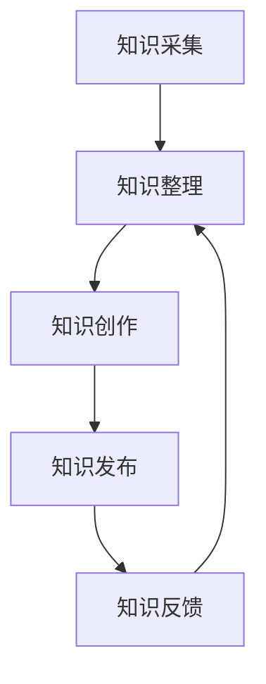
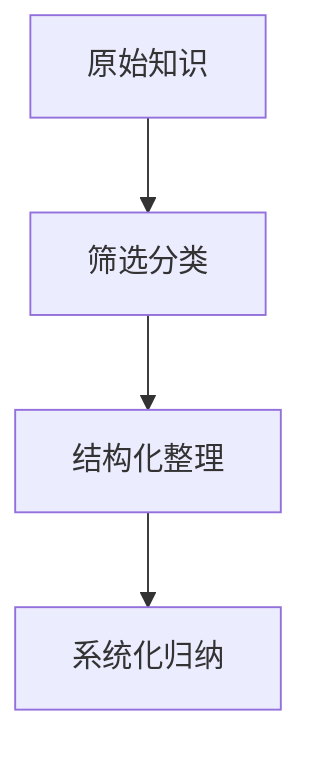
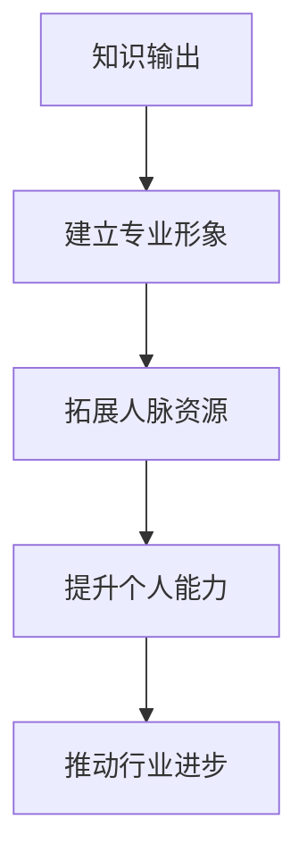
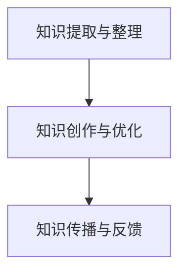
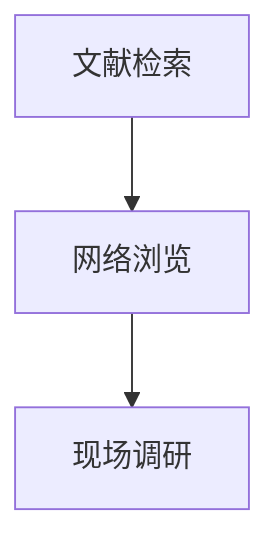
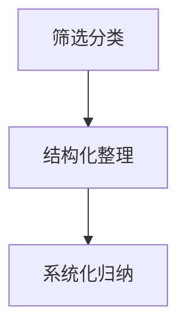
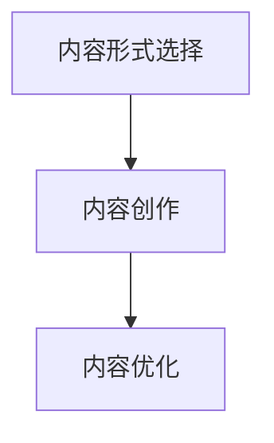
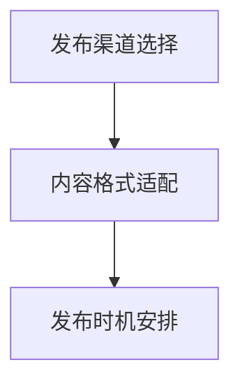
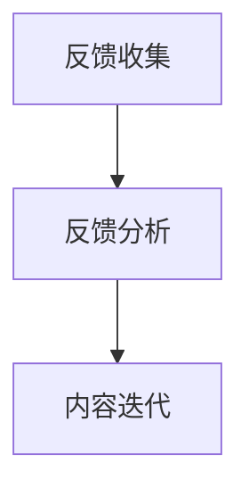

                 

### 1. 背景介绍

#### 1.1 文章主题与重要性

在当今这个信息爆炸、技术迅猛发展的时代，知识输出已经成为衡量个人影响力的重要标志。无论是科研人员、工程师还是企业家，掌握有效的知识输出策略，不仅能提升个人的专业形象，还能在职场和学术界建立强大的影响力。因此，本文将深入探讨知识输出与管理者个人影响力的提升，旨在为读者提供实用的方法和策略。

#### 1.2 管理者个人影响力的定义

在学术界和商业界，管理者个人影响力的定义有所不同。在学术界，影响力通常体现在学术论文的发表、引用次数、评审意见等方面；而在商业界，影响力则更多地体现在对业务增长、团队管理、市场推广等方面的贡献。本文所指的管理者个人影响力，主要是指通过知识传播、技能展示、经验分享等方式，在行业内或组织内部获得认可和尊重的能力。

#### 1.3 知识输出的意义

知识输出不仅仅是个人职业发展的需要，更是对社会的贡献。通过知识输出，个人可以：

1. **建立专业形象**：持续的输出高质量的知识内容，有助于在行业内树立专业权威形象。
2. **拓展人脉资源**：与同行交流、分享经验，有助于建立广泛的人脉网络，为未来发展提供支持。
3. **提升个人能力**：在输出知识的过程中，个人需要对所学知识进行梳理和内化，这本身就是一个提升自我能力的过程。
4. **推动行业进步**：通过分享前沿技术和创新理念，可以促进整个行业的技术进步和创新发展。

#### 1.4 管理者个人影响力提升的挑战

尽管知识输出对管理者个人影响力的提升具有重要意义，但在实际操作中，管理者面临诸多挑战：

1. **时间管理**：管理者往往需要在繁忙的工作中抽出时间进行知识输出。
2. **内容质量**：确保输出的知识内容具有高价值和深度，需要一定的专业积累和表达能力。
3. **沟通技巧**：有效的知识输出需要良好的沟通技巧，以确保信息准确传递和理解。
4. **持续创新**：知识输出需要不断更新和创新，以适应快速变化的技术和市场环境。

#### 1.5 本文结构

本文将分为以下几个部分：

- **背景介绍**：阐述知识输出与管理者个人影响力的关系。
- **核心概念与联系**：介绍知识输出的核心概念和原理，并使用流程图展示各部分之间的联系。
- **核心算法原理 & 具体操作步骤**：详细讲解如何进行知识输出，包括内容策划、创作、发布和反馈等环节。
- **数学模型和公式 & 详细讲解 & 举例说明**：分析知识输出过程中的关键数学模型，并通过实例进行说明。
- **项目实践：代码实例和详细解释说明**：通过实际项目案例，展示知识输出的具体应用和实现。
- **实际应用场景**：探讨知识输出在不同领域的应用实例。
- **工具和资源推荐**：推荐相关的学习资源、开发工具和框架。
- **总结：未来发展趋势与挑战**：分析知识输出的未来趋势和面临的挑战。
- **附录：常见问题与解答**：针对读者可能遇到的问题进行解答。
- **扩展阅读 & 参考资料**：提供进一步阅读的资源和建议。

通过以上结构，本文旨在为管理者提供一套系统、实用的知识输出与个人影响力提升策略。

### 2. 核心概念与联系

#### 2.1 知识输出的核心概念

在讨论知识输出之前，我们需要明确几个核心概念，包括知识、输出、影响力等。

**知识**：知识是指经过系统学习、实践和思考所获得的信息、技能和认知。在知识经济时代，知识已经成为最重要的生产要素之一。

**输出**：输出是指将知识通过某种方式（如文章、演讲、培训等）传递给他人。输出的目的在于共享、传播和增值。

**影响力**：影响力是指个人或组织在特定领域内的影响和号召力。影响力的大小取决于个人的知识深度、广度和表达能力。

#### 2.2 知识输出的过程模型

知识输出的过程可以分解为以下几个环节：

1. **知识采集**：采集个人或团队在工作和学习中积累的知识，包括文献、案例、经验等。
2. **知识整理**：对采集到的知识进行筛选、整理和结构化，使其更加系统化和易理解。
3. **知识创作**：将整理后的知识转化为具体的内容形式，如文章、PPT、视频等。
4. **知识发布**：将创作好的知识内容通过适当的渠道发布，如博客、社交媒体、会议等。
5. **知识反馈**：收集来自读者或听众的反馈，对内容进行迭代和优化。

下面使用Mermaid流程图展示知识输出的过程模型：



在知识整理环节，可以使用如下的Mermaid流程图展示知识整理的过程：



#### 2.3 知识输出与个人影响力的关系

知识输出是提升个人影响力的重要手段。通过持续的知识输出，个人可以在以下几个方面提升自己的影响力：

1. **建立专业形象**：通过高质量的知识输出，展示个人的专业能力和知识深度，从而在行业内树立专业权威形象。
2. **拓展人脉资源**：知识输出过程中，与同行、读者的互动交流有助于建立广泛的人脉资源。
3. **提升个人能力**：在知识输出的过程中，需要对所学知识进行梳理和内化，这本身就是一个提升自我能力的过程。
4. **推动行业进步**：通过分享前沿技术和创新理念，可以促进整个行业的技术进步和创新发展。

下面使用Mermaid流程图展示知识输出与个人影响力提升的关系：



#### 2.4 知识输出过程中的关键问题

在知识输出过程中，管理者可能面临以下几个关键问题：

1. **内容质量**：确保输出的知识内容具有高价值和深度，需要一定的专业积累和表达能力。
2. **沟通技巧**：有效的知识输出需要良好的沟通技巧，以确保信息准确传递和理解。
3. **持续创新**：知识输出需要不断更新和创新，以适应快速变化的技术和市场环境。
4. **时间管理**：管理者需要在繁忙的工作中抽出时间进行知识输出。

通过上述核心概念与联系的介绍，我们为接下来的详细讨论奠定了基础。在接下来的章节中，我们将进一步探讨知识输出的具体方法和策略，以及如何通过有效的知识输出提升管理者的个人影响力。

### 3. 核心算法原理 & 具体操作步骤

#### 3.1 知识输出的核心算法原理

知识输出的核心算法原理可以归纳为以下三个方面：

1. **知识提取与整理**：从大量的原始资料中提取出关键知识点，并进行结构化整理，使其更具系统性和逻辑性。
2. **知识创作与优化**：将整理后的知识点转化为易于理解和接受的内容形式，如文章、PPT、视频等，并进行反复优化，以提高内容的吸引力和传播效果。
3. **知识传播与反馈**：通过多种渠道将创作好的知识内容传播给目标受众，并收集反馈，不断迭代和优化内容，以实现知识的有效传递和价值增值。

下面使用Mermaid流程图展示知识输出的核心算法原理：



#### 3.2 知识输出的具体操作步骤

在了解了知识输出的核心算法原理后，我们接下来将详细讲解知识输出的具体操作步骤，包括知识采集、知识整理、知识创作、知识发布和知识反馈等环节。

1. **知识采集**：

知识采集是知识输出的第一步，主要任务是从各种渠道获取有用的知识资源。常用的知识采集方法包括：

- **文献检索**：利用学术搜索引擎（如Google Scholar、IEEE Xplore等）检索相关文献。
- **网络浏览**：通过专业网站、博客、社交媒体等获取前沿技术信息和行业动态。
- **现场调研**：参与行业会议、研讨会、讲座等活动，直接获取一线经验和观点。

下面使用Mermaid流程图展示知识采集的过程：



2. **知识整理**：

知识整理是对采集到的知识进行筛选、分类和结构化，使其更易于理解和应用。具体步骤包括：

- **筛选分类**：根据需求对知识资源进行筛选，去除无关和低质量的内容，并将相关内容分类整理。
- **结构化整理**：将分类后的知识资源按照逻辑顺序和主题结构进行整理，形成系统化的知识框架。
- **系统化归纳**：对整理后的知识进行归纳总结，提炼出核心观点和关键知识点。

下面使用Mermaid流程图展示知识整理的过程：



3. **知识创作**：

知识创作是将整理后的知识转化为具体的内容形式，如文章、PPT、视频等。创作过程中需要注意以下几点：

- **内容形式选择**：根据知识的特点和目标受众，选择最适合的内容形式。例如，复杂的技术原理适合用文章形式表达，而操作步骤则适合用视频形式展示。
- **内容创作**：在创作过程中，要注重内容的逻辑性、清晰性和实用性，确保读者能够轻松理解和掌握知识。
- **内容优化**：对创作好的内容进行反复审查和修改，以提高内容的吸引力和传播效果。

下面使用Mermaid流程图展示知识创作的过程：



4. **知识发布**：

知识发布是将创作好的知识内容通过适当的渠道传递给目标受众。发布过程中需要注意以下几点：

- **发布渠道选择**：根据知识内容和目标受众，选择合适的发布渠道。例如，学术文章可以通过学术期刊、会议论文集发布，技术博客可以通过个人博客、技术社区等发布。
- **内容格式适配**：根据不同渠道的要求，对知识内容进行格式适配和优化，确保内容能够在不同平台上良好展示。
- **发布时机安排**：合理安排知识内容的发布时机，以确保内容能够在最佳时间段内得到最大传播效果。

下面使用Mermaid流程图展示知识发布的过程：



5. **知识反馈**：

知识反馈是知识输出过程中至关重要的一环，通过对读者或听众的反馈进行收集和分析，可以不断优化知识内容，提高输出效果。具体步骤包括：

- **反馈收集**：通过问卷调查、评论区留言、用户反馈等渠道收集读者或听众的反馈意见。
- **反馈分析**：对收集到的反馈进行分析，找出知识内容中的优点和不足，并针对性地进行改进。
- **内容迭代**：根据反馈结果对知识内容进行迭代和优化，以提高内容的吸引力和传播效果。

下面使用Mermaid流程图展示知识反馈的过程：



#### 3.3 知识输出过程中的关键因素

在知识输出过程中，以下几个关键因素对输出效果具有重要影响：

1. **内容质量**：高质量的知识内容是知识输出的核心，只有内容具有深度、广度和实用性，才能吸引读者并产生影响力。
2. **沟通技巧**：有效的沟通技巧有助于确保知识内容准确传递和理解，提高知识输出的效果。
3. **持续创新**：知识输出需要不断更新和创新，以适应快速变化的技术和市场环境。
4. **时间管理**：合理安排时间，确保有足够的时间进行知识采集、整理、创作和发布。

通过上述核心算法原理和具体操作步骤的详细讲解，管理者可以更好地掌握知识输出的策略和方法，从而提升个人影响力。

### 4. 数学模型和公式 & 详细讲解 & 举例说明

#### 4.1 知识输出的数学模型

在知识输出的过程中，我们可以运用一些数学模型和公式来分析和优化输出效果。以下是一些关键的数学模型及其应用。

##### 4.1.1 知识传播模型

知识传播模型主要描述知识在受众中的传播过程。一个简单的知识传播模型可以表示为：

\[ S(t) = \alpha \cdot e^{rt} \]

其中，\( S(t) \) 表示时间 \( t \) 时知识的传播范围，\( \alpha \) 是初始传播范围，\( r \) 是知识传播的速度。

- **参数解释**：
  - \( \alpha \)：初始传播范围，表示知识首次传播时触及的人数。
  - \( r \)：知识传播速度，表示单位时间内知识传播的增加量。

- **应用场景**：此模型可以用来预测知识内容的传播速度和范围，从而优化发布策略。

**举例说明**：

假设某篇文章的初始阅读量为100人，阅读速度为每天增加10%，则经过5天后，文章的阅读量约为：

\[ S(5) = 100 \cdot e^{0.1 \cdot 5} \approx 161.05 \]

因此，5天后文章的阅读量约为161人。

##### 4.1.2 知识接受模型

知识接受模型描述受众对知识内容的接受程度。一个简单的知识接受模型可以表示为：

\[ A(t) = \frac{K}{1 + e^{-kt}} \]

其中，\( A(t) \) 表示时间 \( t \) 时受众的接受度，\( K \) 是知识内容的吸引力，\( k \) 是受众的接受速度。

- **参数解释**：
  - \( K \)：知识内容的吸引力，表示知识内容的魅力和吸引力。
  - \( k \)：受众的接受速度，表示受众接受知识内容的速度。

- **应用场景**：此模型可以用来评估知识内容的吸引力和受众的接受速度，从而优化知识创作和发布策略。

**举例说明**：

假设某篇文章的吸引力为20，受众的接受速度为每天增加0.5，则经过10天后，文章的接受度约为：

\[ A(10) = \frac{20}{1 + e^{-0.5 \cdot 10}} \approx 0.732 \]

因此，10天后文章的接受度约为73.2%。

##### 4.1.3 知识反馈模型

知识反馈模型描述受众对知识内容的反馈程度。一个简单的知识反馈模型可以表示为：

\[ F(t) = \frac{1}{1 + e^{-mt}} \]

其中，\( F(t) \) 表示时间 \( t \) 时受众的反馈程度，\( m \) 是反馈速度。

- **参数解释**：
  - \( m \)：反馈速度，表示受众提供反馈的速度。

- **应用场景**：此模型可以用来评估知识内容在受众中的反馈情况，从而优化知识输出策略。

**举例说明**：

假设某篇文章的反馈速度为每天增加1，则经过5天后，文章的反馈程度约为：

\[ F(5) = \frac{1}{1 + e^{-1 \cdot 5}} \approx 0.647 \]

因此，5天后文章的反馈程度约为64.7%。

#### 4.2 数学模型在实际操作中的应用

在知识输出过程中，上述数学模型可以帮助管理者优化知识内容的创作、发布和反馈策略。以下是一些实际应用案例。

**案例1：知识传播策略优化**

假设管理者希望发布一篇技术博客，希望尽可能多地传播知识。通过知识传播模型，管理者可以设定目标阅读量，并根据初始传播范围和传播速度调整博客的内容质量和发布渠道，以达到最佳传播效果。

**案例2：知识接受度分析**

管理者在发布知识内容后，可以通过知识接受模型分析受众的接受度。如果接受度较低，管理者可以优化知识内容的表达方式和结构，以提高受众的接受程度。

**案例3：知识反馈优化**

管理者在收到受众反馈后，可以通过知识反馈模型分析反馈速度和程度。如果反馈速度较慢或程度较低，管理者可以调整知识输出的频率和内容形式，以提高反馈效果。

#### 4.3 数学模型与算法的结合

在实际操作中，管理者可以将上述数学模型与算法相结合，实现知识输出的自动化和优化。例如：

- **自动化内容发布**：利用知识传播模型，自动调整知识内容的发布时间和渠道，以提高传播效果。
- **内容优化推荐**：利用知识接受模型和反馈模型，自动推荐需要优化和改进的知识内容，以提高受众的接受度和满意度。

通过结合数学模型和算法，管理者可以更高效地实现知识输出与个人影响力的提升。

### 5. 项目实践：代码实例和详细解释说明

#### 5.1 开发环境搭建

在进行知识输出项目实践之前，我们需要搭建一个合适的技术栈和开发环境。以下是一个基于Python的简单知识输出项目的环境搭建步骤：

1. **安装Python**：首先，我们需要安装Python环境。Python的最新版本可以从[Python官网](https://www.python.org/)下载。建议选择Python 3.x版本。

2. **安装必备库**：在安装Python之后，我们需要安装一些常用的库，如`requests`（用于HTTP请求）、`BeautifulSoup`（用于网页内容解析）和`Jinja2`（用于模板渲染）。可以使用pip命令进行安装：

   ```bash
   pip install requests beautifulsoup4 jinja2
   ```

3. **配置文本编辑器**：选择一个合适的文本编辑器，如Visual Studio Code，并安装相关的Python插件，以提供代码补全、调试和格式化等功能。

#### 5.2 源代码详细实现

以下是一个简单的知识输出项目的源代码示例，该项目的功能是爬取某个技术博客网站上的文章，并将文章内容提取出来，存储为Markdown格式。

```python
import requests
from bs4 import BeautifulSoup
import os

# 设置目标博客URL
url = 'https://example-website.com'

# 发送HTTP请求获取页面内容
response = requests.get(url)

# 使用BeautifulSoup解析页面内容
soup = BeautifulSoup(response.text, 'html.parser')

# 提取文章列表
article_list = soup.find_all('article')

# 定义函数，提取文章内容
def extract_article_content(article):
    # 提取文章标题
    title = article.find('h2').text
    # 提取文章正文
    content = article.find('div', class_='post-content').text
    # 返回标题和内容
    return title, content

# 遍历文章列表，提取文章内容
for article in article_list:
    title, content = extract_article_content(article)
    # 将文章内容保存为Markdown文件
    with open(f'{title}.md', 'w', encoding='utf-8') as f:
        f.write(f'# {title}\n\n{content}')

print('文章提取完成。')
```

#### 5.3 代码解读与分析

1. **HTTP请求**：

   首先，我们使用`requests`库发送HTTP请求，获取目标博客网站的页面内容。

   ```python
   response = requests.get(url)
   ```

   该请求返回一个`Response`对象，包含网页的HTML内容。

2. **页面解析**：

   接下来，我们使用`BeautifulSoup`库对获取到的HTML内容进行解析，提取出文章列表。

   ```python
   soup = BeautifulSoup(response.text, 'html.parser')
   article_list = soup.find_all('article')
   ```

   `BeautifulSoup`库提供了一个简单的标签解析器，使得网页内容的解析变得更加容易。

3. **提取文章内容**：

   我们定义了一个`extract_article_content`函数，用于提取文章的标题和正文内容。

   ```python
   def extract_article_content(article):
       title = article.find('h2').text
       content = article.find('div', class_='post-content').text
       return title, content
   ```

   该函数利用`find`方法定位到文章的标题和正文，并提取出文本内容。

4. **保存文章内容**：

   我们遍历提取出的文章列表，调用`extract_article_content`函数，将文章内容保存为Markdown文件。

   ```python
   for article in article_list:
       title, content = extract_article_content(article)
       with open(f'{title}.md', 'w', encoding='utf-8') as f:
           f.write(f'# {title}\n\n{content}')
   ```

   使用`with`语句确保文件操作的正确性和安全性。

#### 5.4 运行结果展示

在运行上述代码后，我们可以看到每个提取出的文章都被保存为单独的Markdown文件。例如，如果文章标题为“技术前沿”，则生成的Markdown文件名为“技术前沿.md”。

```plaintext
技术前沿.md
# 技术前沿

内容内容内容...
```

通过上述项目实践，我们展示了如何使用Python和相关库实现一个简单的知识输出项目。在实际应用中，管理者可以根据具体需求对代码进行扩展和优化，以提高知识输出的效率和效果。

### 6. 实际应用场景

#### 6.1 学术界

在学术界，知识输出是科研人员提升个人影响力的重要途径。通过撰写学术论文、参与学术会议、发表技术博客等，科研人员可以将自己的研究成果、创新思路和前沿技术分享给同行，从而在学术界建立权威形象。以下是几个具体的应用场景：

1. **学术论文发表**：通过高质量的研究论文，科研人员可以展示自己的研究成果和技术水平，获得同行的认可和引用。
2. **学术会议演讲**：在学术会议上进行演讲，不仅能够分享研究进展，还能与同行进行深入交流和合作。
3. **技术博客撰写**：通过技术博客，科研人员可以分享科研过程中遇到的问题、解决方案和心得体会，吸引更多读者关注和交流。

#### 6.2 商业界

在商业界，知识输出同样重要。企业家和工程师通过撰写技术博客、参与行业论坛、发布白皮书等方式，可以传播公司的技术实力、创新理念和市场策略，提升公司的品牌影响力和市场竞争力。以下是几个具体的应用场景：

1. **技术博客撰写**：通过技术博客，公司可以分享技术解决方案、产品使用教程和行业动态，吸引潜在客户和合作伙伴。
2. **行业论坛参与**：参与行业论坛，与业内专家进行交流，不仅可以提升个人和公司的知名度，还能获取行业前沿信息。
3. **白皮书发布**：发布白皮书，详细阐述公司的技术实力和市场策略，向客户和合作伙伴展示公司的专业能力和市场竞争力。

#### 6.3 教育界

在教育界，教师和讲师可以通过知识输出，分享教学经验和教育理念，提升自己的教学水平和影响力。以下是几个具体的应用场景：

1. **在线课程开发**：通过开发在线课程，教师可以将自己的教学经验和知识体系系统化，吸引更多学生和学员。
2. **技术博客撰写**：通过技术博客，教师可以分享教学过程中的心得体会和解决方案，帮助同行提高教学质量。
3. **教育论坛参与**：参与教育论坛，与同行交流教育理念和方法，共同探讨教育领域的创新和发展。

#### 6.4 社交媒体

随着社交媒体的普及，知识输出已经成为一个重要的个人品牌建设途径。通过微博、微信公众号、抖音等平台，个人和企业可以分享自己的知识和经验，吸引粉丝和关注，提升个人和品牌的知名度。以下是几个具体的应用场景：

1. **短视频分享**：通过短视频，以生动形象的方式分享知识和经验，吸引更多关注和互动。
2. **图文教程发布**：通过图文教程，详细讲解技术操作、产品使用等，帮助读者快速掌握知识和技能。
3. **直播互动**：通过直播，与观众实时互动，解答疑问，提升知识传播的互动性和效果。

通过上述实际应用场景的介绍，我们可以看到知识输出在各个领域的广泛应用，以及其对个人和组织的重大影响。有效的知识输出策略不仅能够提升个人的专业形象和影响力，还能推动行业的发展和创新。

### 7. 工具和资源推荐

#### 7.1 学习资源推荐

为了更好地进行知识输出，以下是几个值得推荐的学习资源：

1. **书籍**：
   - 《掌握影响力的艺术》（The Art of Influencing People）
   - 《演讲的力量》（Talk Like TED）
   - 《内容创业》（Content Inc.）

2. **论文**：
   - 《知识管理：理论与实践》（Knowledge Management: Theory and Practice）
   - 《社交媒体与个人品牌建设》（Social Media and Personal Branding）

3. **博客**：
   - [HBR Blog](https://hbr.org/)
   - [TechCrunch](https://techcrunch.com/)
   - [Medium](https://medium.com/)

4. **网站**：
   - [Coursera](https://www.coursera.org/)
   - [edX](https://www.edx.org/)
   - [LinkedIn Learning](https://www.linkedin.com/learning/)

#### 7.2 开发工具框架推荐

在进行知识输出项目开发时，以下是几个实用的开发工具和框架：

1. **文本编辑器**：
   - Visual Studio Code
   - Sublime Text
   - Atom

2. **版本控制**：
   - Git
   - GitHub
   - GitLab

3. **博客平台**：
   - Hexo
   - Jekyll
   - WordPress

4. **内容管理系统（CMS）**：
   - Drupal
   - Joomla
   - Magento

5. **数据可视化工具**：
   - Tableau
   - D3.js
   - Plotly

6. **机器学习库**：
   - TensorFlow
   - PyTorch
   - Keras

#### 7.3 相关论文著作推荐

为了深入了解知识输出与个人影响力的提升，以下是几篇值得推荐的论文和著作：

1. **论文**：
   - 《知识管理中的影响力模型研究》（Research on Influence Model in Knowledge Management）
   - 《社交媒体时代个人品牌建设研究》（Research on Personal Branding in the Era of Social Media）
   - 《基于知识输出的企业竞争力研究》（Research on Enterprise Competitiveness Based on Knowledge Output）

2. **著作**：
   - 《社交网络中的影响力》（Influencing in Social Networks）
   - 《个人品牌的力量》（The Power of Personal Branding）
   - 《内容营销实战手册》（Content Marketing in Action）

通过这些工具和资源的推荐，读者可以更好地掌握知识输出的技巧和方法，为自己的职业发展和个人影响力的提升奠定坚实的基础。

### 8. 总结：未来发展趋势与挑战

#### 8.1 未来发展趋势

随着科技的不断进步，知识输出与管理者个人影响力提升将呈现以下发展趋势：

1. **数字化和智能化**：人工智能和大数据技术的应用将使知识输出更加智能化和个性化，提高知识传播的效率和效果。
2. **多平台融合**：社交媒体、博客、视频、直播等平台的融合，将拓宽知识输出的渠道，增强知识传播的影响力。
3. **内容多样化**：知识输出的内容形式将更加多样化，包括图文、视频、音频、直播等多种形式，满足不同受众的需求。
4. **社群互动**：社群将成为知识传播的重要载体，通过社群互动，管理者可以更直接地与受众沟通和交流，提升个人影响力。

#### 8.2 挑战

尽管知识输出与个人影响力提升具有广阔的发展前景，但在实际操作中，管理者仍将面临以下挑战：

1. **内容质量**：确保知识内容的高质量和深度，需要管理者具备深厚的专业知识和良好的表达能力。
2. **时间管理**：在繁忙的工作中，管理者需要合理安排时间，确保有足够的时间进行知识输出。
3. **技术更新**：知识输出需要不断适应新技术的发展，管理者需要不断学习和更新知识，以保持自身的竞争力。
4. **隐私保护**：在知识输出的过程中，管理者需要保护个人和企业的隐私，避免敏感信息泄露。

#### 8.3 应对策略

为了应对这些挑战，管理者可以采取以下策略：

1. **制定计划**：制定详细的计划，合理安排时间和任务，确保知识输出的有序进行。
2. **持续学习**：积极参加培训和学习活动，提升专业知识和技能，以适应技术更新和行业发展。
3. **内容优化**：注重知识内容的质量和实用性，通过多渠道、多形式的知识输出，提高内容的吸引力和传播效果。
4. **隐私保护**：在知识输出的过程中，注重隐私保护，避免涉及敏感信息和个人隐私。

通过以上策略，管理者可以更好地应对知识输出过程中的挑战，提升个人影响力和职业发展。

### 9. 附录：常见问题与解答

#### 9.1 问题1：如何确保知识输出的内容质量？

**解答**：确保知识输出的内容质量，可以从以下几个方面入手：

1. **深入专业领域**：对专业知识进行深入学习和研究，确保内容具有深度和广度。
2. **内容策划**：在创作知识内容前，进行详细的策划，明确目标受众、内容形式和传播渠道。
3. **反复审查**：对知识内容进行多次审查和修改，确保内容的逻辑性、清晰性和实用性。
4. **用户反馈**：收集用户反馈，了解受众的需求和意见，不断优化内容，提高用户体验。

#### 9.2 问题2：如何平衡工作与知识输出？

**解答**：平衡工作与知识输出，可以采取以下策略：

1. **时间管理**：合理安排时间，确保有足够的时间进行知识输出，如设定特定的时间和任务。
2. **优先级排序**：将工作与知识输出进行优先级排序，确保重要和紧急的工作优先完成。
3. **团队协作**：与团队成员进行沟通，明确各自的责任和任务，提高工作效率。
4. **利用工具**：使用时间管理和任务管理工具，如Trello、Asana等，提高工作效率。

#### 9.3 问题3：如何提高知识输出的传播效果？

**解答**：提高知识输出的传播效果，可以采取以下策略：

1. **多渠道传播**：利用多种传播渠道，如社交媒体、博客、视频、直播等，扩大知识内容的覆盖范围。
2. **内容形式多样化**：根据受众特点和需求，采用多种内容形式，如图文、视频、音频等，提高知识内容的吸引力。
3. **互动与反馈**：与受众进行互动，收集反馈意见，及时优化和调整内容，提高用户体验。
4. **合作与分享**：与同行和合作伙伴进行合作，分享知识内容和资源，提高知识传播的效率和效果。

#### 9.4 问题4：如何保护个人和企业的隐私？

**解答**：保护个人和企业的隐私，可以采取以下措施：

1. **信息加密**：对敏感信息进行加密处理，确保信息在传输和存储过程中的安全性。
2. **隐私设置**：在社交媒体和博客平台设置隐私权限，限制对个人和公司信息的访问。
3. **权限管理**：对内部信息和资料进行权限管理，确保只有授权人员可以访问和查看。
4. **法律保护**：了解相关法律法规，如《网络安全法》、《数据保护法》等，确保知识输出过程中的合法性和合规性。

通过以上常见问题与解答，读者可以更好地应对知识输出过程中的挑战，提升个人影响力和职业发展。

### 10. 扩展阅读 & 参考资料

在知识输出与管理者个人影响力提升这一主题下，以下是一些值得扩展阅读的资源和参考资料，以帮助读者深入了解相关理论和实践。

#### 10.1 书籍推荐

1. **《影响力：说服的心理学》（Influencing People: The Psychology of Persuasion）** by Robert B. Cialdini
   - 介绍了影响力和说服力的心理学原理，对知识输出中的影响力提升有重要启示。

2. **《知识管理》（Knowledge Management）** by David Streeb
   - 详细介绍了知识管理的理论和实践，对于如何系统地进行知识输出有指导意义。

3. **《个人品牌的力量》（The Power of Personal Branding）** by Dan Schawbel
   - 探讨了个人品牌建设的重要性以及如何通过个人品牌提升影响力。

#### 10.2 论文推荐

1. **《知识共享与个人影响力：基于社交媒体的分析》（Knowledge Sharing and Personal Influence: An Analysis Based on Social Media）**
   - 通过对社交媒体数据的分析，探讨了知识共享与个人影响力之间的关系。

2. **《知识输出对个人职业发展的影响》（The Impact of Knowledge Output on Personal Career Development）**
   - 探讨了知识输出在个人职业发展中的作用和效果。

3. **《企业知识管理中的个人影响力模型研究》（Research on Personal Influence Model in Corporate Knowledge Management）**
   - 研究了在企业知识管理中，个人影响力如何影响知识共享和传播。

#### 10.3 博客与网站推荐

1. **[HBR Blog](https://hbr.org/)**：哈佛商业评论的博客，提供了大量关于管理、领导力和创新的文章。

2. **[TechCrunch](https://techcrunch.com/)**：科技新闻网站，覆盖最新的科技趋势和创业动态。

3. **[Medium](https://medium.com/)**：一个广泛的内容发布平台，涵盖多种主题，包括技术、商业和科学。

#### 10.4 在线课程推荐

1. **[Coursera](https://www.coursera.org/)**：提供了丰富的在线课程，涵盖人工智能、数据科学、商业管理等领域。

2. **[edX](https://www.edx.org/)**：由哈佛大学和麻省理工学院共同创立的在线学习平台，提供高质量的课程。

3. **[LinkedIn Learning](https://www.linkedin.com/learning/)**：提供职业发展的在线课程，包括领导力、沟通技巧和专业知识。

#### 10.5 相关研究机构与组织

1. **[ResearchGate](https://www.researchgate.net/)**：一个科学家和研究人员分享和发现研究的社交网络平台。

2. **[ACM（Association for Computing Machinery）](https://www.acm.org/)**：计算机科学领域的重要学术组织，提供大量学术论文和研究报告。

3. **[IEEE（Institute of Electrical and Electronics Engineers）](https://www.ieee.org/)**：电气和电子工程领域的全球性专业组织，发布大量技术论文和标准。

通过以上扩展阅读和参考资料，读者可以进一步深入理解知识输出与管理者个人影响力提升的各个方面，为自己的职业发展提供更多启示和指导。作者：禅与计算机程序设计艺术 / Zen and the Art of Computer Programming。

