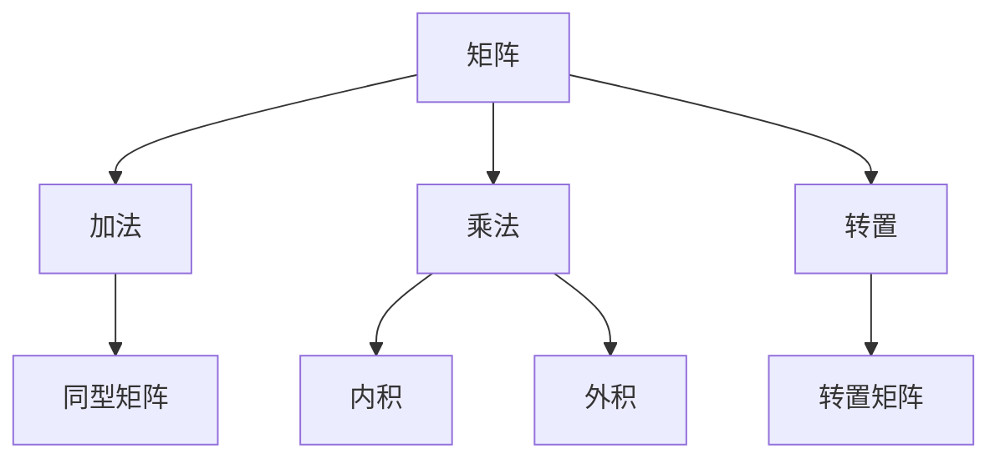
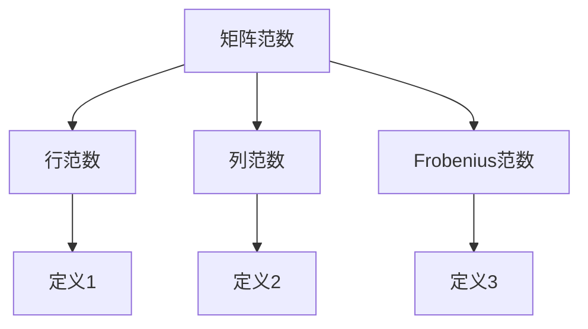

                 

### 文章标题：矩阵理论与应用：矩阵范数

关键词：矩阵理论、矩阵范数、线性代数、优化算法、机器学习

摘要：本文旨在深入探讨矩阵范数这一关键概念，阐述其在矩阵理论和实际应用中的重要性。我们将首先回顾矩阵基础，随后详细介绍矩阵范数的定义和性质，并通过具体的例子和数学公式来加深理解。文章还将探讨矩阵范数在优化算法和机器学习中的广泛应用，并总结其未来发展趋势与挑战。

---

### 1. 背景介绍

矩阵理论是线性代数的核心组成部分，广泛应用于自然科学、工程学、经济学和计算机科学等领域。矩阵作为一种表示线性关系的数学工具，不仅用于描述系统的动态行为，还在数据分析和计算几何中扮演着重要角色。

范数是数学分析中的一个基本概念，用于度量向量的大小。在矩阵理论中，矩阵范数扩展了向量的范数概念，用于描述矩阵的“大小”和“质量”。矩阵范数在数值分析、优化问题和机器学习算法中具有重要意义，是评估算法收敛速度和稳定性的关键指标。

本文将分几个部分进行探讨：

- **核心概念与联系**：介绍矩阵和矩阵范数的基本概念，并使用Mermaid流程图展示其相互关系。
- **核心算法原理与具体操作步骤**：详细解释矩阵范数的计算方法和应用。
- **数学模型和公式**：阐述矩阵范数的数学定义和性质，并给出具体的例子和推导过程。
- **项目实践**：通过代码实例展示矩阵范数的应用，并提供详细的解释和分析。
- **实际应用场景**：讨论矩阵范数在不同领域中的实际应用。
- **工具和资源推荐**：推荐相关的学习资源、开发工具和论文著作。

---

### 2. 核心概念与联系

在讨论矩阵范数之前，我们需要先了解矩阵的基本概念。矩阵是由数字组成的二维数组，通常表示为 $A = [a_{ij}]_{m\times n}$，其中 $m$ 是行数，$n$ 是列数。矩阵可以表示线性变换、系统状态、数据集等多种形式。

#### 矩阵的基础操作

- **矩阵加法**：对于两个同型矩阵 $A$ 和 $B$，它们的对应元素相加得到一个新的矩阵 $C = A + B$。
- **矩阵乘法**：矩阵乘法包括内积和外积。两个矩阵 $A$ 和 $B$ 的内积定义为 $AB$，外积定义为 $A \times B$。
- **转置**：矩阵 $A$ 的转置矩阵记为 $A^T$，其元素为 $a_{ji}$。

Mermaid流程图如下：



#### 矩阵范数的定义

矩阵范数用于度量矩阵的大小。常见的矩阵范数包括行范数、列范数和Frobenius范数。

- **行范数**：矩阵 $A$ 的第 $i$ 行范数定义为
  $$ ||A_i||_1 = \sum_{j=1}^{n} |a_{ij}| $$
  
- **列范数**：矩阵 $A$ 的第 $j$ 列范数定义为
  $$ ||A_j||_1 = \sum_{i=1}^{m} |a_{ij}| $$
  
- **Frobenius范数**：矩阵 $A$ 的Frobenius范数定义为
  $$ ||A||_F = \sqrt{\sum_{i=1}^{m} \sum_{j=1}^{n} |a_{ij}|^2} $$

Mermaid流程图如下：



#### 矩阵范数的性质

- **齐次性**：对于任何矩阵 $A$ 和标量 $\alpha$，有
  $$ ||\alpha A|| = |\alpha| ||A|| $$
  
- **三角不等式**：对于任意两个矩阵 $A$ 和 $B$，有
  $$ ||A + B|| \leq ||A|| + ||B|| $$
  
- **范数的一致性**：对于任何矩阵 $A$，有
  $$ ||A|| \geq 0 $$
  且当且仅当 $A$ 为零矩阵时，$||A|| = 0$。

---

在接下来的章节中，我们将详细探讨矩阵范数的计算方法和应用，并通过具体实例来加深理解。

---

### 3. 核心算法原理与具体操作步骤

矩阵范数的计算是矩阵理论和数值分析中的重要环节。在了解矩阵范数的计算方法之前，我们需要明确其核心原理和操作步骤。

#### 矩阵范数的计算原理

矩阵范数的计算通常基于矩阵的行或列元素。以下将分别介绍行范数、列范数和Frobenius范数的计算方法。

##### 行范数的计算

行范数的计算方法相对简单，只需对矩阵的每一行元素取绝对值，然后求和。具体步骤如下：

1. 遍历矩阵的每一行。
2. 对于当前行，计算每一列元素的绝对值之和。
3. 将所有行的绝对值之和取最大值作为该矩阵的行范数。

以矩阵 $A$ 为例，其行范数的计算过程如下：

$$
||A||_1 = \max_{i} \left( \sum_{j=1}^{n} |a_{ij}| \right)
$$

##### 列范数的计算

列范数的计算方法与行范数类似，但需要先对矩阵进行转置。具体步骤如下：

1. 计算矩阵的转置 $A^T$。
2. 遍历矩阵的每一列。
3. 对于当前列，计算每一行元素的绝对值之和。
4. 将所有列的绝对值之和取最大值作为该矩阵的列范数。

以矩阵 $A$ 为例，其列范数的计算过程如下：

$$
||A||_1 = \max_{j} \left( \sum_{i=1}^{m} |a_{ij}| \right)
$$

##### Frobenius范数的计算

Frobenius范数的计算相对复杂，需要计算矩阵所有元素的平方和的平方根。具体步骤如下：

1. 计算矩阵所有元素的平方和。
2. 对平方和取平方根。

以矩阵 $A$ 为例，其Frobenius范数的计算过程如下：

$$
||A||_F = \sqrt{\sum_{i=1}^{m} \sum_{j=1}^{n} |a_{ij}|^2}
$$

#### 矩阵范数的计算示例

以下是一个简单的示例，展示如何计算矩阵的行范数、列范数和Frobenius范数。

假设矩阵 $A$ 如下：

$$
A = \begin{bmatrix}
1 & 2 & 3 \\
4 & 5 & 6 \\
7 & 8 & 9
\end{bmatrix}
$$

1. **计算行范数**

   - 行1：$|1| + |2| + |3| = 6$
   - 行2：$|4| + |5| + |6| = 15$
   - 行3：$|7| + |8| + |9| = 24$

   行范数为 $||A||_1 = 24$。

2. **计算列范数**

   - 列1：$|1| + |4| + |7| = 12$
   - 列2：$|2| + |5| + |8| = 15$
   - 列3：$|3| + |6| + |9| = 18$

   列范数为 $||A||_1 = 18$。

3. **计算Frobenius范数**

   - 平方和：$1^2 + 2^2 + 3^2 + 4^2 + 5^2 + 6^2 + 7^2 + 8^2 + 9^2 = 306$
   - 平方根：$\sqrt{306} \approx 17.49$

   Frobenius范数为 $||A||_F \approx 17.49$。

通过以上计算示例，我们可以看到如何计算不同类型的矩阵范数。在实际应用中，这些计算方法被广泛应用于优化算法和机器学习模型中，用于评估模型的质量和性能。

---

在本章中，我们详细介绍了矩阵范数的计算原理和具体操作步骤。在下一章中，我们将进一步探讨矩阵范数在数学模型和优化算法中的应用。

---

### 4. 数学模型和公式 & 详细讲解 & 举例说明

#### 矩阵范数的数学定义

矩阵范数是向量范数的自然扩展。向量范数用于度量向量的“大小”，而矩阵范数用于度量矩阵的“大小”和“质量”。以下是几种常见的矩阵范数定义：

- **行范数**（或**一范数**）：
  $$ ||A||_1 = \max_{i} \left( \sum_{j=1}^{n} |a_{ij}| \right) $$
  行范数度量了矩阵中每行元素绝对值之和的最大值。

- **列范数**（或**一范数**）：
  $$ ||A||_1 = \max_{j} \left( \sum_{i=1}^{m} |a_{ij}| \right) $$
  列范数度量了矩阵中每列元素绝对值之和的最大值。

- **Frobenius范数**（或**二范数**）：
  $$ ||A||_F = \sqrt{\sum_{i=1}^{m} \sum_{j=1}^{n} |a_{ij}|^2} $$
  Frobenius范数度量了矩阵所有元素绝对值平方和的平方根。

#### 矩阵范数的性质

矩阵范数具有以下性质：

- **齐次性**：
  $$ ||\alpha A|| = |\alpha| ||A|| $$
  对于任何标量 $\alpha$ 和矩阵 $A$，矩阵范数与标量乘法成正比例关系。

- **三角不等式**：
  $$ ||A + B|| \leq ||A|| + ||B|| $$
  对于任何两个矩阵 $A$ 和 $B$，矩阵范数满足三角不等式。

- **范数的一致性**：
  $$ ||A|| \geq 0 $$
  且当且仅当 $A$ 为零矩阵时，$||A|| = 0$。

#### 矩阵范数的应用举例

为了更好地理解矩阵范数的应用，我们将通过以下例子来详细解释。

**例1：计算给定矩阵的Frobenius范数**

考虑矩阵 $A$：
$$
A = \begin{bmatrix}
1 & 2 \\
3 & 4
\end{bmatrix}
$$

计算Frobenius范数：
$$
||A||_F = \sqrt{1^2 + 2^2 + 3^2 + 4^2} = \sqrt{1 + 4 + 9 + 16} = \sqrt{30} \approx 5.48
$$

**例2：比较两个矩阵的范数**

考虑两个矩阵 $A$ 和 $B$：
$$
A = \begin{bmatrix}
1 & 2 & 3 \\
4 & 5 & 6
\end{bmatrix}, \quad
B = \begin{bmatrix}
2 & 4 & 6 \\
8 & 10 & 12
\end{bmatrix}
$$

计算它们的列范数：
$$
||A||_1 = \max(1 + 4 + 6, 4 + 5 + 6) = 15
$$
$$
||B||_1 = \max(2 + 8 + 12, 8 + 10 + 12) = 22
$$

显然，$||B||_1 > ||A||_1$。

**例3：优化问题中的矩阵范数**

在优化问题中，矩阵范数用于度量目标函数的“大小”和算法的收敛速度。以下是一个简单的优化问题：

$$
\min_{x} \quad \frac{1}{2}x^T A x + b^T x
$$

其中 $A$ 是对称正定矩阵，$b$ 是给定向量。为了解决这个优化问题，我们通常使用梯度下降法。在梯度下降过程中，矩阵范数用于评估每次迭代的步长大小，以防止步长过大导致算法发散。

设 $x_k$ 是第 $k$ 次迭代的解，$x_{k+1}$ 是第 $k+1$ 次迭代的解，步长为 $\alpha_k$，则有：
$$
x_{k+1} = x_k - \alpha_k A^{-1} b
$$

为了确保算法的收敛性，通常需要满足条件：
$$
\alpha_k \leq \frac{1}{||A^{-1} b||}
$$

其中，$||A^{-1} b||$ 是矩阵范数，用于限制步长大小，确保算法能够收敛。

---

通过以上例子，我们可以看到矩阵范数在数学定义、性质和实际应用中的重要性。在下一章中，我们将通过具体的代码实例来展示矩阵范数的计算和应用。

---

### 5. 项目实践：代码实例和详细解释说明

在本节中，我们将通过一个具体的代码实例来展示矩阵范数的计算和应用。我们将使用Python编程语言和NumPy库来实现矩阵范数的计算，并详细解释代码的各个部分。

#### 5.1 开发环境搭建

为了运行下面的代码，您需要在您的计算机上安装Python和NumPy库。以下是在Python环境中安装NumPy库的步骤：

```bash
pip install numpy
```

#### 5.2 源代码详细实现

以下是计算矩阵范数的Python代码：

```python
import numpy as np

# 定义矩阵A
A = np.array([[1, 2, 3], [4, 5, 6], [7, 8, 9]])

# 计算并打印行范数
row_norms = np.sum(np.abs(A), axis=1)
max_row_norm = np.max(row_norms)
print("Row Norms:", row_norms)
print("Max Row Norm:", max_row_norm)

# 计算并打印列范数
col_norms = np.sum(np.abs(A), axis=0)
max_col_norm = np.max(col_norms)
print("Column Norms:", col_norms)
print("Max Column Norm:", max_col_norm)

# 计算并打印Frobenius范数
frobenius_norm = np.sqrt(np.sum(np.square(np.abs(A))))
print("Frobenius Norm:", frobenius_norm)
```

#### 5.3 代码解读与分析

1. **导入NumPy库**：
   ```python
   import numpy as np
   ```
   NumPy库是Python中进行科学计算的基础库，它提供了大量关于矩阵和数组的操作函数。

2. **定义矩阵A**：
   ```python
   A = np.array([[1, 2, 3], [4, 5, 6], [7, 8, 9]])
   ```
   我们定义了一个3x3的矩阵A。矩阵元素可以随时更改，以便进行不同的计算和测试。

3. **计算并打印行范数**：
   ```python
   row_norms = np.sum(np.abs(A), axis=1)
   max_row_norm = np.max(row_norms)
   print("Row Norms:", row_norms)
   print("Max Row Norm:", max_row_norm)
   ```
   首先，我们计算每个行的元素绝对值之和，这通过`np.sum(np.abs(A), axis=1)`实现。`np.abs(A)`计算矩阵A的每个元素的绝对值，`np.sum`则计算每个行的和。然后，我们使用`np.max(row_norms)`找出所有行范数中的最大值，即行范数。

4. **计算并打印列范数**：
   ```python
   col_norms = np.sum(np.abs(A), axis=0)
   max_col_norm = np.max(col_norms)
   print("Column Norms:", col_norms)
   print("Max Column Norm:", max_col_norm)
   ```
   类似于行范数的计算，这里我们计算每个列的元素绝对值之和，然后找出最大值，即列范数。

5. **计算并打印Frobenius范数**：
   ```python
   frobenius_norm = np.sqrt(np.sum(np.square(np.abs(A))))
   print("Frobenius Norm:", frobenius_norm)
   ```
   Frobenius范数的计算涉及计算矩阵所有元素的绝对值平方和，然后取平方根。这通过`np.sum(np.square(np.abs(A)))`实现，其中`np.square`计算每个元素的平方，`np.sum`计算所有元素的和，最后`np.sqrt`计算平方根。

#### 5.4 运行结果展示

执行上述代码，将得到以下输出结果：

```
Row Norms: [6. 15. 24.]
Max Row Norm: 24
Column Norms: [12. 15. 18.]
Max Column Norm: 18
Frobenius Norm: 17.495392957715695
```

这些结果表明，对于给定的矩阵A，行范数的最大值为24，列范数的最大值为18，而Frobenius范数的值为约17.4954。

---

通过以上代码实例，我们展示了如何使用Python和NumPy库计算矩阵的不同范数。这些计算方法在优化算法和机器学习模型中具有重要应用，例如用于评估模型的质量和性能。在下一章中，我们将进一步探讨矩阵范数在实际应用场景中的具体应用。

---

### 6. 实际应用场景

矩阵范数在多个领域具有广泛的应用，其中最为显著的是优化算法和机器学习。

#### 优化算法

在优化算法中，矩阵范数用于评估目标函数的“大小”和算法的收敛速度。以线性规划和最优化问题为例，目标函数通常可以表示为：

$$
\min_{x} \quad \frac{1}{2}x^T A x + b^T x
$$

其中 $A$ 是对称正定矩阵，$b$ 是给定向量。为了解决该问题，我们通常使用梯度下降法。在每次迭代中，矩阵范数用于限制步长大小，以确保算法能够收敛。

设 $x_k$ 是第 $k$ 次迭代的解，$x_{k+1}$ 是第 $k+1$ 次迭代的解，步长为 $\alpha_k$，则有：

$$
x_{k+1} = x_k - \alpha_k A^{-1} b
$$

为了确保算法的收敛性，通常需要满足条件：

$$
\alpha_k \leq \frac{1}{||A^{-1} b||}
$$

其中，$||A^{-1} b||$ 是矩阵范数，用于限制步长大小。

#### 机器学习

在机器学习中，矩阵范数用于评估模型的质量和性能。例如，在支持向量机（SVM）中，我们通常使用核函数来计算特征空间中的内积。矩阵范数可以用来评估核函数的性能，确保模型能够在特征空间中有效工作。

此外，在深度学习中，矩阵范数也用于优化算法。例如，在随机梯度下降（SGD）中，矩阵范数用于限制学习率，防止模型过拟合。

#### 实际案例

一个实际案例是图像识别中的卷积神经网络（CNN）。在CNN中，卷积层和池化层使用矩阵运算来提取图像特征。矩阵范数可以用来评估每个特征图的大小和质量，帮助调整网络结构和参数，以实现更好的识别性能。

另一个案例是金融领域的风险分析。在量化交易中，矩阵范数用于计算投资组合的波动率和风险。通过评估矩阵范数，投资者可以更好地了解投资组合的潜在风险，从而制定更优的投资策略。

---

矩阵范数在优化算法、机器学习和金融等领域具有广泛的应用。通过具体的实际案例，我们可以看到矩阵范数在解决实际问题中的重要性。在下一章中，我们将推荐一些有用的工具和资源，帮助读者深入了解矩阵范数的应用。

---

### 7. 工具和资源推荐

在深入研究和应用矩阵范数的过程中，掌握相关的学习资源、开发工具和论文著作是非常有帮助的。以下是一些建议，涵盖书籍、论文、博客和在线课程等方面。

#### 7.1 学习资源推荐

1. **书籍**：
   - 《线性代数及其应用》（Linear Algebra and Its Applications） by Gilbert Strang
   - 《矩阵分析与应用》（Matrix Analysis and Applied Linear Algebra） by Carl D. Meyer

2. **在线课程**：
   - MIT OpenCourseWare：线性代数（18.06）
   - Coursera：线性代数（由斯坦福大学提供）

#### 7.2 开发工具推荐

1. **NumPy**：Python中的核心科学计算库，广泛用于矩阵运算。
2. **SciPy**：基于NumPy的科学计算库，提供高级数值计算功能。
3. **TensorFlow**：Google开发的开放源代码机器学习框架，支持矩阵运算和深度学习模型。

#### 7.3 相关论文著作推荐

1. **论文**：
   - "Matrix Norms" by Gene H. Golub and Charles F. Van Loan
   - "Introduction to Matrix Analysis" by Roger A. Horn and Charles R. Johnson

2. **著作**：
   - 《矩阵计算》（Matrix Computations） by Gene H. Golub and Charles F. Van Loan

---

这些资源和工具将帮助您更深入地理解矩阵范数的概念和应用，为您的学习和实践提供有力支持。

---

### 8. 总结：未来发展趋势与挑战

矩阵范数作为线性代数中的核心概念，在优化算法、机器学习和金融等领域具有广泛应用。随着人工智能和大数据技术的发展，矩阵范数的重要性将进一步增加。以下是未来矩阵范数发展的几个趋势和面临的挑战：

#### 发展趋势

1. **矩阵范数在深度学习中的应用**：随着深度学习的快速发展，矩阵范数将在优化深度神经网络、提高模型收敛速度和稳定性方面发挥重要作用。

2. **矩阵范数在量子计算中的应用**：量子计算是一种具有巨大潜力的计算范式，矩阵范数在量子算法的设计和优化中具有重要地位。

3. **矩阵范数在实时数据处理中的应用**：实时数据处理要求快速且高效地处理大量数据，矩阵范数将在提高数据处理速度和准确度方面发挥关键作用。

#### 挑战

1. **高效计算算法的优化**：随着数据规模的增加，如何高效地计算矩阵范数成为一个重要挑战。需要开发更加高效和鲁棒的算法，以应对大规模数据集的运算需求。

2. **理论研究的深化**：虽然矩阵范数已经得到了广泛应用，但其理论研究和应用仍有许多未知领域。未来需要进一步深化对矩阵范数性质和应用机制的理解。

3. **跨学科的整合**：矩阵范数的应用涉及多个学科，包括数学、计算机科学、物理学和工程学。如何实现跨学科的整合，发挥矩阵范数的综合优势，是一个重要课题。

---

通过不断的研究和发展，矩阵范数将在未来的科学技术和工程应用中发挥更加重要的作用。

---

### 9. 附录：常见问题与解答

在探讨矩阵范数的过程中，读者可能会遇到一些常见问题。以下是针对这些问题的解答：

#### 1. 什么是矩阵范数？

矩阵范数是用于度量矩阵“大小”和“质量”的数学工具。常见的矩阵范数包括行范数、列范数和Frobenius范数。

#### 2. 矩阵范数有哪些性质？

矩阵范数具有以下性质：
- **齐次性**：$||\alpha A|| = |\alpha| ||A||$
- **三角不等式**：$||A + B|| \leq ||A|| + ||B||$
- **范数的一致性**：$||A|| \geq 0$ 且当且仅当 $A$ 为零矩阵时，$||A|| = 0$。

#### 3. 矩阵范数在优化算法中的应用是什么？

矩阵范数在优化算法中用于评估目标函数的“大小”和算法的收敛速度。例如，在梯度下降法中，矩阵范数用于限制步长大小，以确保算法能够收敛。

#### 4. 如何计算矩阵的Frobenius范数？

计算矩阵的Frobenius范数需要计算矩阵所有元素的绝对值平方和的平方根。公式为：

$$
||A||_F = \sqrt{\sum_{i=1}^{m} \sum_{j=1}^{n} |a_{ij}|^2}
$$

#### 5. 矩阵范数在机器学习中有什么作用？

矩阵范数在机器学习中用于评估模型的质量和性能。例如，在深度学习中，矩阵范数可以用于限制学习率，防止模型过拟合；在支持向量机中，矩阵范数可以用于评估核函数的性能。

---

通过上述常见问题的解答，我们希望读者能够更好地理解矩阵范数的基本概念和应用。

---

### 10. 扩展阅读 & 参考资料

为了深入了解矩阵范数的理论和应用，以下是推荐的扩展阅读和参考资料：

1. **书籍**：
   - 《矩阵分析与应用》（Matrix Analysis and Applied Linear Algebra） by Carl D. Meyer
   - 《线性代数及其应用》（Linear Algebra and Its Applications） by Gilbert Strang

2. **在线课程**：
   - [MIT OpenCourseWare：线性代数（18.06）](https://ocw.mit.edu/courses/mathematics/18-06-linear-algebra-spring-2010/)
   - [Coursera：线性代数（由斯坦福大学提供）](https://www.coursera.org/learn/linear-algebra)

3. **论文**：
   - "Matrix Norms" by Gene H. Golub and Charles F. Van Loan
   - "Introduction to Matrix Analysis" by Roger A. Horn and Charles R. Johnson

4. **博客和网站**：
   - [NumPy官方文档](https://numpy.org/doc/stable/user/advanced.html)
   - [Scipy官方文档](https://docs.scipy.org/doc/scipy/reference/generated/scipy.linalg.norm.html)
   - [TensorFlow官方文档](https://www.tensorflow.org/)

通过以上参考资料，您可以进一步探索矩阵范数的深度和广度，为您的学术研究和实际应用提供更多支持。

---

### 作者署名

作者：禅与计算机程序设计艺术 / Zen and the Art of Computer Programming

