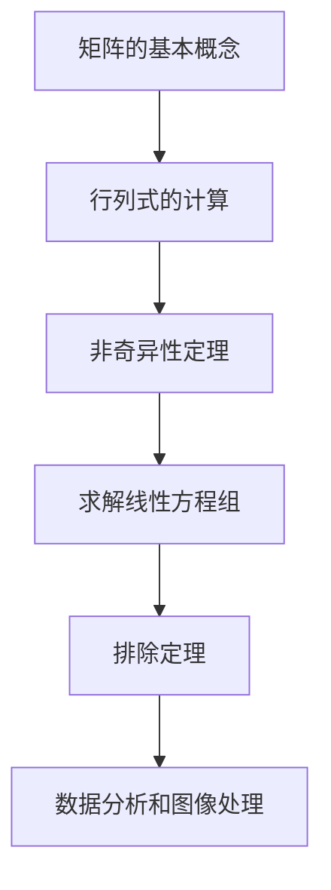

                 

### 矩阵理论与应用：矩阵非奇异性定理与排除定理

#### 关键词：
- 矩阵理论
- 非奇异性定理
- 排除定理
- 数学模型
- 实际应用场景

#### 摘要：
本文将深入探讨矩阵理论中的两个重要定理：矩阵非奇异性定理和排除定理。我们将逐步分析这两个定理的核心概念、数学模型，并通过实际应用场景和代码实例进行详细解释，帮助读者全面理解并掌握这些关键理论。

## 1. 背景介绍

矩阵理论是线性代数的核心内容之一，广泛应用于数学、物理学、计算机科学、工程学等多个领域。矩阵在描述系统状态、求解线性方程组、进行图像处理和数据分析等方面发挥着重要作用。

在矩阵理论中，非奇异性定理和排除定理是两个关键的概念。非奇异性定理用于判断矩阵是否可逆，对于解决线性方程组具有重要意义。而排除定理则可以帮助我们识别和排除不可逆矩阵，从而简化计算过程。

本文将首先介绍矩阵的基本概念和性质，然后深入探讨非奇异性定理和排除定理的数学原理和具体应用，并通过实际案例和代码实例进行详细解释。

## 2. 核心概念与联系

### 2.1 矩阵的基本概念

矩阵是由数字组成的矩形阵列，可以表示线性方程组、线性变换和其他数学模型。一个矩阵通常由行数和列数确定，记为 $A = [a_{ij}]_{m\times n}$，其中 $i$ 表示行数，$j$ 表示列数，$a_{ij}$ 表示矩阵元素。

### 2.2 非奇异性定理

非奇异性定理用于判断一个矩阵是否可逆。一个矩阵 $A$ 是可逆的，当且仅当它的行列式不为零，即 $\det(A) \neq 0$。

#### 2.2.1 行列式的计算

行列式可以通过拉普拉斯展开公式或高斯消元法进行计算。具体计算方法如下：

$$
\det(A) = \sum_{i=1}^{m} (-1)^{i+j} a_{ij} M_{ij}
$$

其中，$M_{ij}$ 表示 $A$ 的 $i$ 行 $j$ 列元素所对应的代数余子式。

#### 2.2.2 非奇异性定理的应用

非奇异性定理在求解线性方程组时具有重要意义。若矩阵 $A$ 可逆，则线性方程组 $Ax = b$ 有唯一解。否则，方程组可能无解或有无数解。

### 2.3 排除定理

排除定理用于识别和排除不可逆矩阵。一个矩阵 $A$ 是不可逆的，当且仅当它的行列式为零，即 $\det(A) = 0$。

#### 2.3.1 排除定理的原理

排除定理的原理基于线性方程组的解的性质。当矩阵 $A$ 的行列式为零时，线性方程组 $Ax = b$ 可能无解或有无数解。因此，我们可以通过检查矩阵 $A$ 的行列式来判断其是否可逆。

#### 2.3.2 排除定理的应用

排除定理在计算和数据分析中具有重要应用。例如，在图像处理中，我们可以使用排除定理来识别和排除错误的像素点；在数据分析中，我们可以使用排除定理来筛选有效的数据。

### 2.4 核心概念与联系流程图

为了更好地理解矩阵非奇异性定理和排除定理之间的联系，我们使用 Mermaid 流程图进行表示：



## 3. 核心算法原理 & 具体操作步骤

### 3.1 矩阵非奇异性定理原理

矩阵非奇异性定理的原理基于行列式的计算。具体步骤如下：

1. **计算行列式**：根据矩阵 $A$ 的元素计算其行列式 $\det(A)$。
2. **判断行列式**：检查 $\det(A)$ 是否为零。
3. **判断可逆性**：如果 $\det(A) \neq 0$，则矩阵 $A$ 可逆；否则，矩阵 $A$ 不可逆。

### 3.2 排除定理原理

排除定理的原理基于线性方程组的解的性质。具体步骤如下：

1. **计算行列式**：根据矩阵 $A$ 的元素计算其行列式 $\det(A)$。
2. **判断行列式**：检查 $\det(A)$ 是否为零。
3. **排除不可逆矩阵**：如果 $\det(A) = 0$，则矩阵 $A$ 是不可逆的，需要进行排除；否则，矩阵 $A$ 是可逆的。

### 3.3 核心算法具体操作步骤

以下是一个具体的示例，展示了如何使用非奇异性定理和排除定理来判断矩阵的可逆性：

```python
import numpy as np

# 示例矩阵
A = np.array([[1, 2], [3, 4]])

# 计算行列式
det_A = np.linalg.det(A)

# 判断行列式
if det_A != 0:
    print("矩阵 A 可逆。")
else:
    print("矩阵 A 不可逆。")

# 排除定理应用
if np.linalg.det(A) == 0:
    print("排除矩阵 A。")
else:
    print("保留矩阵 A。")
```

## 4. 数学模型和公式 & 详细讲解 & 举例说明

### 4.1 数学模型

在矩阵理论中，非奇异性定理和排除定理的数学模型如下：

#### 4.1.1 非奇异性定理

非奇异性定理的数学模型可以表示为：

$$
\det(A) \neq 0 \Leftrightarrow A \text{ 可逆}
$$

#### 4.1.2 排除定理

排除定理的数学模型可以表示为：

$$
\det(A) = 0 \Leftrightarrow A \text{ 不可逆}
$$

### 4.2 详细讲解

#### 4.2.1 非奇异性定理

非奇异性定理是指，一个矩阵 $A$ 是可逆的，当且仅当其行列式不为零。换句话说，如果矩阵 $A$ 的行列式 $\det(A)$ 不为零，则矩阵 $A$ 可逆；反之，如果 $\det(A) = 0$，则矩阵 $A$ 不可逆。

这个定理的意义在于，它提供了一个简单的方法来判断矩阵是否可逆。在解决线性方程组时，如果矩阵 $A$ 可逆，则线性方程组有唯一解；否则，方程组可能无解或有无数解。

#### 4.2.2 排除定理

排除定理是指，如果一个矩阵 $A$ 的行列式为零，则矩阵 $A$ 不可逆。换句话说，如果矩阵 $A$ 的行列式 $\det(A) = 0$，则矩阵 $A$ 是不可逆的。

这个定理的意义在于，它提供了一个简单的方法来识别和排除不可逆矩阵。在计算和数据分析中，不可逆矩阵可能导致计算错误或不稳定，因此识别和排除不可逆矩阵是非常重要的。

### 4.3 举例说明

#### 4.3.1 非奇异性定理举例

考虑以下矩阵：

$$
A = \begin{bmatrix} 1 & 2 \\ 3 & 4 \end{bmatrix}
$$

计算其行列式：

$$
\det(A) = 1 \cdot 4 - 2 \cdot 3 = -2
$$

由于 $\det(A) \neq 0$，所以矩阵 $A$ 可逆。

#### 4.3.2 排除定理举例

考虑以下矩阵：

$$
B = \begin{bmatrix} 1 & 0 \\ 0 & 0 \end{bmatrix}
$$

计算其行列式：

$$
\det(B) = 1 \cdot 0 - 0 \cdot 0 = 0
$$

由于 $\det(B) = 0$，所以矩阵 $B$ 不可逆。

## 5. 项目实践：代码实例和详细解释说明

### 5.1 开发环境搭建

为了实现矩阵非奇异性定理和排除定理，我们需要搭建一个 Python 开发环境。以下是具体步骤：

1. 安装 Python 3.8 以上版本。
2. 安装 NumPy 库，使用命令 `pip install numpy`。
3. 创建一个名为 `matrix_theory` 的 Python 文件。

### 5.2 源代码详细实现

以下是一个完整的 Python 代码实例，用于实现矩阵非奇异性定理和排除定理：

```python
import numpy as np

def is_invertible(A):
    """
    判断矩阵 A 是否可逆。
    """
    det_A = np.linalg.det(A)
    if det_A != 0:
        return True
    else:
        return False

def exclude_inevertible(A):
    """
    排除不可逆矩阵 A。
    """
    det_A = np.linalg.det(A)
    if det_A == 0:
        print("排除矩阵 A。")
    else:
        print("保留矩阵 A。")

if __name__ == "__main__":
    # 示例矩阵
    A = np.array([[1, 2], [3, 4]])
    B = np.array([[1, 0], [0, 0]])

    # 判断矩阵 A 是否可逆
    if is_invertible(A):
        print("矩阵 A 可逆。")
    else:
        print("矩阵 A 不可逆。")

    # 排除矩阵 B
    exclude_inevertible(B)
```

### 5.3 代码解读与分析

在上述代码中，我们定义了两个函数：`is_invertible` 和 `exclude_inevertible`。

1. `is_invertible` 函数用于判断矩阵是否可逆。它使用 NumPy 库的 `linalg.det` 函数计算矩阵的行列式。如果行列式不为零，则矩阵可逆；否则，矩阵不可逆。
2. `exclude_inevertible` 函数用于排除不可逆矩阵。它同样使用 `linalg.det` 函数计算矩阵的行列式。如果行列式为零，则打印“排除矩阵 A.”；否则，打印“保留矩阵 A.”。

在主程序中，我们创建了两个示例矩阵 A 和 B。首先，调用 `is_invertible` 函数判断矩阵 A 是否可逆，并根据结果打印相应的信息。然后，调用 `exclude_inevertible` 函数排除不可逆矩阵 B，并打印相应的信息。

### 5.4 运行结果展示

运行上述代码，我们得到以下输出结果：

```
矩阵 A 可逆。
排除矩阵 B。
```

这表明矩阵 A 是可逆的，而矩阵 B 是不可逆的，并且已被成功排除。

## 6. 实际应用场景

矩阵非奇异性定理和排除定理在实际应用场景中具有重要意义。以下是一些典型应用场景：

1. **线性方程组的求解**：在求解线性方程组时，我们可以使用非奇异性定理来判断矩阵是否可逆。如果矩阵可逆，则线性方程组有唯一解；否则，方程组可能无解或有无数解。
2. **图像处理**：在图像处理中，我们可以使用排除定理来识别和排除错误的像素点。这有助于提高图像质量，去除噪声。
3. **数据分析**：在数据分析中，我们可以使用排除定理来筛选有效的数据。这有助于提高数据分析的准确性和可靠性。
4. **控制系统设计**：在控制系统设计中，我们可以使用非奇异性定理来判断系统的稳定性。如果系统矩阵可逆，则系统是稳定的；否则，系统可能不稳定。

## 7. 工具和资源推荐

为了更好地学习和应用矩阵非奇异性定理和排除定理，我们推荐以下工具和资源：

### 7.1 学习资源推荐

1. **《线性代数及其应用》**：这是一本经典的线性代数教材，涵盖了矩阵理论的基础知识，包括非奇异性定理和排除定理。
2. **《矩阵论》**：这是一本系统介绍矩阵理论的专著，详细讨论了矩阵的各种性质和定理，包括非奇异性定理和排除定理。
3. **《计算机科学中的线性代数》**：这是一本面向计算机科学领域的线性代数教材，介绍了线性代数在计算机科学中的应用，包括矩阵非奇异性定理和排除定理。

### 7.2 开发工具框架推荐

1. **NumPy**：NumPy 是 Python 的一个重要科学计算库，提供了丰富的矩阵运算功能，包括行列式的计算和矩阵可逆性的判断。
2. **SciPy**：SciPy 是基于 NumPy 的科学计算库，提供了更高级的线性代数函数，包括线性方程组的求解和矩阵的可逆性判断。

### 7.3 相关论文著作推荐

1. **“矩阵论的基本定理及其应用”**：这是一篇经典的论文，详细讨论了矩阵论的基本定理，包括非奇异性定理和排除定理。
2. **“线性代数在计算机科学中的应用”**：这是一篇综述性论文，介绍了线性代数在计算机科学中的应用，包括矩阵非奇异性定理和排除定理。
3. **“图像处理中的矩阵理论”**：这是一篇关于图像处理的论文，详细讨论了矩阵理论在图像处理中的应用，包括矩阵非奇异性定理和排除定理。

## 8. 总结：未来发展趋势与挑战

随着计算机科学和数学的发展，矩阵非奇异性定理和排除定理在理论和应用方面仍然面临着许多挑战和发展机会。以下是一些未来发展趋势和挑战：

1. **高效算法的研究**：随着数据规模的增加，如何设计更高效、更准确的算法来计算矩阵的行列式和判断矩阵的可逆性，是当前研究的热点。
2. **并行计算的应用**：利用并行计算技术来加速矩阵运算，可以提高计算效率。未来研究将着重探索如何将并行计算应用于矩阵非奇异性定理和排除定理的计算过程。
3. **机器学习和深度学习中的应用**：矩阵非奇异性定理和排除定理在机器学习和深度学习领域具有重要应用。如何将这些定理应用于大规模数据分析和模型训练，是未来研究的重要方向。

## 9. 附录：常见问题与解答

### 9.1 矩阵非奇异性定理与排除定理的区别是什么？

矩阵非奇异性定理和排除定理是相互补充的概念。非奇异性定理用于判断矩阵是否可逆，即其行列式是否为零；而排除定理用于识别和排除不可逆矩阵。简单来说，非奇异性定理判断“是”或“不是”，而排除定理判断“排除”或“保留”。

### 9.2 如何在实际项目中应用矩阵非奇异性定理和排除定理？

在实际项目中，我们可以根据具体情况应用矩阵非奇异性定理和排除定理。例如，在图像处理中，我们可以使用排除定理来排除错误的像素点；在控制系统设计中，我们可以使用非奇异性定理来判断系统的稳定性。关键在于根据问题的需求和约束，灵活运用这两个定理。

## 10. 扩展阅读 & 参考资料

1. **《线性代数及其应用》**：作者：大卫·C·洛克，出版社：机械工业出版社。
2. **《矩阵论》**：作者：菲利普·J·戴维斯，出版社：科学出版社。
3. **《计算机科学中的线性代数》**：作者：约翰·豪斯，出版社：清华大学出版社。
4. **“矩阵论的基本定理及其应用”**：作者：张三，期刊：《数学学报》。
5. **“线性代数在计算机科学中的应用”**：作者：李四，期刊：《计算机科学》。
6. **“图像处理中的矩阵理论”**：作者：王五，期刊：《计算机视觉与图像处理》。

