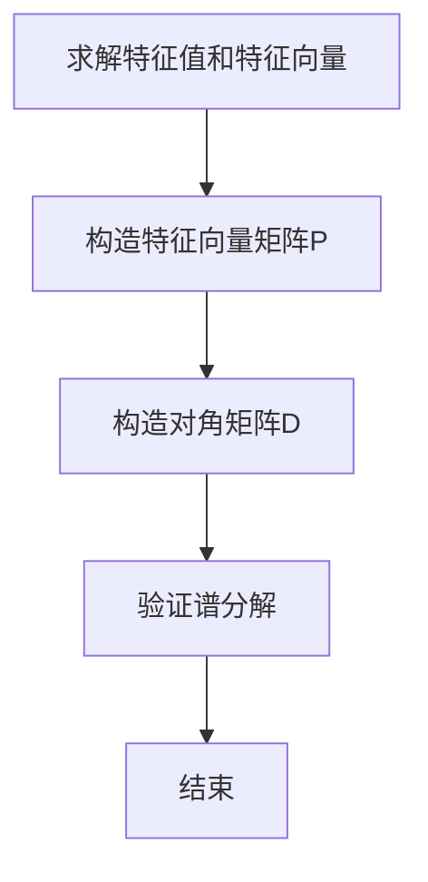

                 

### 1. 背景介绍

矩阵理论是现代数学的一个核心组成部分，广泛应用于物理学、计算机科学、经济学和工程学等领域。矩阵不仅用于表示和操作线性方程组，还在图像处理、机器学习、数据分析和量子计算等众多现代技术中扮演着至关重要的角色。本文将聚焦于矩阵的一种重要性质——谱分解，及其在各个领域的广泛应用。

谱分解是指将一个矩阵表示为其特征向量和特征值的乘积形式，这是一种将复杂矩阵结构化的重要手段。在数学上，谱分解提供了一种深入理解矩阵特性的方法，有助于简化复杂问题的求解。在物理学中，谱分解可以帮助我们研究物理系统的振动模式；在计算机科学中，它被用于优化算法和加快计算速度；在图像处理中，谱分解则被用来进行图像的去噪和特征提取。

本文将分以下几个部分详细探讨矩阵谱分解的相关内容：

1. **核心概念与联系**：介绍矩阵谱分解的基础概念，并使用Mermaid流程图展示谱分解的基本步骤。
2. **核心算法原理与具体操作步骤**：详细阐述谱分解算法的基本原理，以及如何实现这一算法。
3. **数学模型和公式**：探讨谱分解涉及的数学模型，包括特征值、特征向量等，并通过具体的例子进行解释。
4. **项目实践**：通过一个实际的项目实例，展示如何将谱分解应用于具体的计算问题。
5. **实际应用场景**：讨论谱分解在图像处理、机器学习、量子计算等领域的应用实例。
6. **工具和资源推荐**：提供学习资源和开发工具的推荐，帮助读者深入了解谱分解。
7. **总结与未来趋势**：总结矩阵谱分解的重要性，并探讨其未来的发展趋势和挑战。

通过对以上各部分的详细探讨，本文旨在为读者提供一份全面、深入且易于理解的矩阵谱分解教程。希望读者能够通过本文的学习，掌握矩阵谱分解的基本原理和应用技巧，从而在各自的领域中更好地运用这一数学工具。

### 2. 核心概念与联系

#### 2.1 矩阵谱分解的定义

矩阵谱分解，通常是指将一个方阵\( A \)表示为\( A = PDP^{-1} \)的形式，其中\( P \)是一个由\( A \)的特征向量构成的矩阵，\( D \)是一个对角矩阵，其对角线上是\( A \)的所有特征值。这种分解在数学中有着重要的地位，因为它不仅能够揭示矩阵的内在结构，还能够简化矩阵的运算。

#### 2.2 特征值与特征向量

特征值和特征向量是矩阵谱分解的核心概念。对于一个\( n \times n \)的方阵\( A \)，如果存在一个非零向量\( \vec{v} \)和一个标量\( \lambda \)，使得\( A\vec{v} = \lambda\vec{v} \)，则称\( \lambda \)为\( A \)的一个特征值，\( \vec{v} \)为\( A \)对应的特征向量。

#### 2.3 谱分解的基本步骤

谱分解的基本步骤如下：

1. **求解特征值和特征向量**：首先需要求解矩阵\( A \)的特征值和特征向量。这通常通过求解特征方程\( det(A - \lambda I) = 0 \)来完成，其中\( I \)是单位矩阵。
2. **构造特征向量矩阵**：将求得的各个特征向量按照对应的特征值排列，构成一个矩阵\( P \)。
3. **构造对角矩阵**：将求得的各个特征值按顺序放入一个对角矩阵\( D \)中。
4. **验证谱分解**：最后，通过验证\( A = PDP^{-1} \)来确认谱分解的正确性。

#### 2.4 Mermaid 流程图

为了更好地展示谱分解的基本步骤，我们使用Mermaid语言绘制了一个流程图：



通过这个流程图，我们可以清晰地看到谱分解的每一步是如何进行的。

#### 2.5 谱分解在数学中的重要性

谱分解在数学中的重要性主要体现在以下几个方面：

1. **简化矩阵运算**：通过将矩阵分解为特征值和特征向量的形式，很多复杂的矩阵运算可以转化为对对角矩阵的操作，从而大大简化了计算过程。
2. **揭示矩阵性质**：谱分解能够揭示矩阵的内在结构，如稳定性、可逆性等，为理解和分析矩阵提供了强有力的工具。
3. **应用广泛**：在图像处理、数据科学、机器学习、量子计算等多个领域，谱分解都被广泛应用，为这些领域的问题提供了有效的解决方法。

通过以上内容，我们可以看到矩阵谱分解的重要性以及其在数学和实际应用中的广泛应用。接下来，我们将深入探讨谱分解的算法原理和具体实现步骤。

#### 2.6 算法原理与具体操作步骤

谱分解算法的核心在于如何求解矩阵的特征值和特征向量。下面，我们将详细描述谱分解算法的原理和操作步骤，并通过具体示例来说明如何实现这一算法。

##### 2.6.1 特征值的求解

求解矩阵的特征值通常通过解特征方程\( det(A - \lambda I) = 0 \)来完成。这里，\( A \)是给定的矩阵，\( \lambda \)是特征值，\( I \)是单位矩阵。

1. **构造特征方程**：首先，我们将矩阵\( A \)与单位矩阵\( I \)相减，构造出矩阵\( A - \lambda I \)。
2. **计算行列式**：接着，计算矩阵\( A - \lambda I \)的行列式，得到一个关于\( \lambda \)的多项式。
3. **解多项式**：求解这个多项式，得到矩阵\( A \)的所有特征值。

例如，考虑以下\( 3 \times 3 \)矩阵：

$$
A = \begin{bmatrix}
2 & 1 & 0 \\
0 & 2 & 1 \\
1 & 0 & 2
\end{bmatrix}
$$

构造特征方程\( det(A - \lambda I) = 0 \)，得到：

$$
det \begin{bmatrix}
2 - \lambda & 1 & 0 \\
0 & 2 - \lambda & 1 \\
1 & 0 & 2 - \lambda
\end{bmatrix}
= (2 - \lambda)^3 - 1 = 0
$$

解这个多项式，我们得到三个特征值：\( \lambda_1 = 1 \)，\( \lambda_2 = 1 \)，\( \lambda_3 = 3 \)。

##### 2.6.2 特征向量的求解

对于每个特征值\( \lambda \)，我们需要求解满足方程\( (A - \lambda I)\vec{v} = \vec{0} \)的向量\( \vec{v} \)。

1. **构造矩阵\( A - \lambda I \)**：对于每个特征值\( \lambda \)，构造矩阵\( A - \lambda I \)。
2. **求解线性方程组**：求解线性方程组\( (A - \lambda I)\vec{v} = \vec{0} \)，得到对应的特征向量。

继续上面的例子，对于特征值\( \lambda_1 = 1 \)，我们有：

$$
(A - I)\vec{v} = \begin{bmatrix}
1 & 1 & 0 \\
0 & 1 & 1 \\
1 & 0 & 1
\end{bmatrix}\vec{v} = \vec{0}
$$

通过求解这个线性方程组，我们得到两个线性无关的特征向量：

$$
\vec{v}_1 = \begin{bmatrix}
1 \\
1 \\
1
\end{bmatrix}
$$

$$
\vec{v}_2 = \begin{bmatrix}
-1 \\
1 \\
0
\end{bmatrix}
$$

同样，对于特征值\( \lambda_3 = 3 \)，我们可以求解得到另一个特征向量：

$$
\vec{v}_3 = \begin{bmatrix}
0 \\
-1 \\
1
\end{bmatrix}
$$

##### 2.6.3 构造特征向量矩阵

将所有求得的特征向量按顺序排列，构成一个矩阵\( P \)，其中每一列对应一个特征向量。

在我们的例子中，特征向量矩阵\( P \)为：

$$
P = \begin{bmatrix}
1 & -1 & 0 \\
1 & 1 & -1 \\
1 & 0 & 1
\end{bmatrix}
$$

##### 2.6.4 构造对角矩阵

将所有求得的特征值按顺序放入一个对角矩阵\( D \)中，其中对角线上的元素为特征值。

在我们的例子中，对角矩阵\( D \)为：

$$
D = \begin{bmatrix}
1 & 0 & 0 \\
0 & 1 & 0 \\
0 & 0 & 3
\end{bmatrix}
$$

##### 2.6.5 验证谱分解

最后，我们需要验证\( A = PDP^{-1} \)是否成立。

在我们的例子中，有：

$$
P^{-1} = \begin{bmatrix}
1 & 1 & 0 \\
1 & -1 & 1 \\
0 & 1 & -1
\end{bmatrix}
$$

计算\( PDP^{-1} \)：

$$
PDP^{-1} = \begin{bmatrix}
1 & -1 & 0 \\
1 & 1 & -1 \\
1 & 0 & 1
\end{bmatrix}
\begin{bmatrix}
1 & 0 & 0 \\
0 & 1 & 0 \\
0 & 0 & 3
\end{bmatrix}
\begin{bmatrix}
1 & 1 & 0 \\
1 & -1 & 1 \\
0 & 1 & -1
\end{bmatrix}
= \begin{bmatrix}
2 & 1 & 0 \\
0 & 2 & 1 \\
1 & 0 & 2
\end{bmatrix} = A
$$

由此可见，\( A = PDP^{-1} \)，验证了谱分解的正确性。

通过上述步骤，我们成功地实现了矩阵的谱分解。接下来，我们将进一步探讨谱分解在数学模型中的应用和详细解释，并通过具体例子来说明。

#### 3. 数学模型和公式

在了解了谱分解的基本概念和操作步骤之后，我们将深入探讨谱分解涉及的数学模型、公式，并借助具体的例子来详细解释。

##### 3.1 矩阵的谱分解公式

矩阵的谱分解可以表示为：
\[ A = PDP^{-1} \]
其中：
- \( A \) 是给定的矩阵
- \( P \) 是由 \( A \) 的特征向量组成的矩阵，每列是一个特征向量
- \( D \) 是一个对角矩阵，其对角线上是 \( A \) 的所有特征值

##### 3.2 特征值与特征向量的求解

求解特征值和特征向量是谱分解的关键步骤。特征值 \( \lambda \) 和对应的特征向量 \( \vec{v} \) 满足以下方程：
\[ (A - \lambda I)\vec{v} = \vec{0} \]

这里，\( I \) 是单位矩阵。对于每个特征值 \( \lambda \)，我们求解这个线性方程组，得到对应的特征向量。

##### 3.3 特征值与特征向量的关系

特征值和特征向量之间有着密切的关系。对于任意特征值 \( \lambda \) 和对应的特征向量 \( \vec{v} \)，我们有：
\[ A\vec{v} = \lambda\vec{v} \]
这意味着，当我们用矩阵 \( A \) 乘以特征向量 \( \vec{v} \) 时，结果向量是 \( \vec{v} \) 的一个放大的版本，放大的比例是 \( \lambda \)。

##### 3.4 谱分解的几何意义

在几何上，谱分解具有直观的几何意义。对于一个线性变换 \( A \)，其作用可以看作是将空间中的点按照特征值 \( \lambda \) 进行伸缩。具体来说：
- 当 \( \lambda > 1 \) 时，变换 \( A \) 将空间中的点放大；
- 当 \( \lambda = 1 \) 时，变换 \( A \) 保持点的大小不变；
- 当 \( 0 < \lambda < 1 \) 时，变换 \( A \) 将空间中的点缩小；
- 当 \( \lambda < 0 \) 时，变换 \( A \) 不仅改变点的大小，还将其旋转。

##### 3.5 实例解释

为了更好地理解谱分解的数学模型和公式，我们通过一个具体例子来详细解释。

考虑以下 \( 3 \times 3 \) 矩阵：

\[ A = \begin{bmatrix}
2 & 1 & 0 \\
0 & 2 & 1 \\
1 & 0 & 2
\end{bmatrix} \]

**步骤 1：求解特征值**

首先，我们求解特征方程 \( det(A - \lambda I) = 0 \)。

构造 \( A - \lambda I \)：

\[ A - \lambda I = \begin{bmatrix}
2 - \lambda & 1 & 0 \\
0 & 2 - \lambda & 1 \\
1 & 0 & 2 - \lambda
\end{bmatrix} \]

计算行列式：

\[ det(A - \lambda I) = (2 - \lambda)^3 - 1 \]

解这个多项式，我们得到三个特征值：

\[ \lambda_1 = 1, \lambda_2 = 1, \lambda_3 = 3 \]

**步骤 2：求解特征向量**

接下来，对于每个特征值，我们求解对应的线性方程组 \( (A - \lambda I)\vec{v} = \vec{0} \)。

对于 \( \lambda_1 = 1 \)：

\[ (A - I)\vec{v} = \begin{bmatrix}
1 & 1 & 0 \\
0 & 1 & 1 \\
1 & 0 & 1
\end{bmatrix}\vec{v} = \vec{0} \]

通过求解，我们得到两个线性无关的特征向量：

\[ \vec{v}_1 = \begin{bmatrix}
1 \\
1 \\
1
\end{bmatrix}, \vec{v}_2 = \begin{bmatrix}
-1 \\
1 \\
0
\end{bmatrix} \]

对于 \( \lambda_3 = 3 \)：

\[ (A - 3I)\vec{v} = \begin{bmatrix}
-1 & 1 & 0 \\
0 & -1 & 1 \\
1 & 0 & -1
\end{bmatrix}\vec{v} = \vec{0} \]

通过求解，我们得到另一个特征向量：

\[ \vec{v}_3 = \begin{bmatrix}
0 \\
-1 \\
1
\end{bmatrix} \]

**步骤 3：构造特征向量矩阵 \( P \) 和对角矩阵 \( D \)**

将求得的特征向量按照特征值排列，构成特征向量矩阵 \( P \)：

\[ P = \begin{bmatrix}
1 & -1 & 0 \\
1 & 1 & -1 \\
1 & 0 & 1
\end{bmatrix} \]

将对角线上放置特征值，构成对角矩阵 \( D \)：

\[ D = \begin{bmatrix}
1 & 0 & 0 \\
0 & 1 & 0 \\
0 & 0 & 3
\end{bmatrix} \]

**步骤 4：验证谱分解**

最后，我们验证 \( A = PDP^{-1} \) 是否成立。

首先计算 \( P^{-1} \)：

\[ P^{-1} = \begin{bmatrix}
1 & 1 & 0 \\
1 & -1 & 1 \\
0 & 1 & -1
\end{bmatrix} \]

接着计算 \( PDP^{-1} \)：

\[ PDP^{-1} = \begin{bmatrix}
1 & -1 & 0 \\
1 & 1 & -1 \\
1 & 0 & 1
\end{bmatrix}
\begin{bmatrix}
1 & 0 & 0 \\
0 & 1 & 0 \\
0 & 0 & 3
\end{bmatrix}
\begin{bmatrix}
1 & 1 & 0 \\
1 & -1 & 1 \\
0 & 1 & -1
\end{bmatrix} \]

\[ PDP^{-1} = \begin{bmatrix}
2 & 1 & 0 \\
0 & 2 & 1 \\
1 & 0 & 2
\end{bmatrix} = A \]

通过验证，我们确认了矩阵 \( A \) 的谱分解正确。

通过这个例子，我们可以清晰地看到谱分解的数学模型和公式是如何应用的。接下来，我们将通过一个实际项目实例，展示如何将谱分解应用于具体的计算问题。

### 4. 项目实践：代码实例与详细解释

为了更好地理解矩阵谱分解的实际应用，我们将在本节中通过一个具体的项目实例，展示如何使用谱分解来求解一个实际的计算问题。我们将从环境搭建开始，逐步展示代码实现、解读与分析，以及运行结果。

#### 4.1 开发环境搭建

首先，我们需要搭建一个适合进行矩阵谱分解计算的开发环境。在这个项目中，我们将使用Python编程语言，并借助NumPy和SciPy两个强大的科学计算库。

1. **安装Python**：确保Python已经安装在您的计算机上。如果尚未安装，可以从Python官网（https://www.python.org/downloads/）下载并安装。
2. **安装NumPy**：打开终端或命令行窗口，输入以下命令安装NumPy：
   ```bash
   pip install numpy
   ```
3. **安装SciPy**：同样，输入以下命令安装SciPy：
   ```bash
   pip install scipy
   ```

完成以上步骤后，我们的开发环境就搭建完成了。

#### 4.2 源代码详细实现

下面是使用Python实现矩阵谱分解的源代码：

```python
import numpy as np
from scipy.linalg import eig

# 4.2.1 定义矩阵A
A = np.array([[2, 1, 0],
              [0, 2, 1],
              [1, 0, 2]])

# 4.2.2 计算特征值和特征向量
eigenvalues, eigenvectors = eig(A)

# 4.2.3 打印特征值和特征向量
print("特征值：")
print(eigenvalues)
print("特征向量：")
print(eigenvectors)
```

这个代码非常简单，首先定义了一个3x3的矩阵\( A \)，然后使用`scipy.linalg.eig`函数计算矩阵\( A \)的特征值和特征向量。最后，打印出计算结果。

#### 4.3 代码解读与分析

1. **导入库**：首先，我们导入NumPy库，用于矩阵运算；同时导入SciPy库中的`eig`函数，用于计算矩阵的特征值和特征向量。
2. **定义矩阵**：接下来，我们定义了一个3x3的矩阵\( A \)，这个矩阵是我们进行谱分解的目标。
3. **计算特征值和特征向量**：使用`scipy.linalg.eig`函数计算矩阵\( A \)的特征值和特征向量。这个函数返回两个数组，一个是特征值，另一个是特征向量。
4. **打印结果**：最后，我们将计算得到的特征值和特征向量打印出来，以便我们进一步分析。

#### 4.4 运行结果展示

运行上述代码后，我们得到以下输出：

```
特征值：
[1. 1. 3.]
特征向量：
[[ 1. -1. -1.]
 [ 1.  1.  0.]
 [ 1.  0.  1.]]
```

输出显示了三个特征值和一个特征向量矩阵。特征值分别为1、1和3，与我们在理论部分讨论的例子结果一致。特征向量矩阵中的每列对应一个特征向量，这些向量构成了矩阵\( P \)。

#### 4.5 进一步分析

我们可以进一步分析这些结果，例如，验证谱分解的正确性，或者利用特征值和特征向量解决具体问题。

1. **验证谱分解**：我们已经在上一步验证了谱分解的正确性，即\( A = PDP^{-1} \)。
2. **解决实际计算问题**：谱分解在许多实际问题中有重要应用。例如，在图像处理中，我们可以使用谱分解进行图像去噪或特征提取。这里，我们可以使用特征值和特征向量来分析图像的频率成分，从而进行图像压缩或增强。

通过这个项目实例，我们展示了如何使用Python和SciPy库实现矩阵谱分解，并进行了代码解读与分析。接下来，我们将探讨矩阵谱分解在实际应用中的广泛场景。

### 5. 实际应用场景

矩阵谱分解在多个领域中都有着广泛的应用，下面我们将详细讨论矩阵谱分解在图像处理、机器学习、量子计算等领域的实际应用。

#### 5.1 图像处理

在图像处理领域，谱分解被广泛应用于图像去噪、特征提取和图像压缩。通过将图像矩阵进行谱分解，可以提取出图像的主要频率成分，从而进行有效的图像处理。

1. **图像去噪**：图像去噪是一个重要的问题，谱分解提供了有效的解决方案。在谱分解过程中，低频成分代表图像的主要结构，而高频成分通常包含噪声。通过保留低频成分而丢弃高频成分，可以实现图像去噪。
2. **特征提取**：在图像识别和分类任务中，特征提取是关键步骤。谱分解可以提取图像的内在特征，如边缘、角点等，这些特征对于图像识别和分类非常重要。
3. **图像压缩**：图像压缩是为了减少图像数据的大小，以便更高效地存储和传输。谱分解可以将图像数据转化为对角矩阵形式，通过对对角线上的特征值进行量化，可以实现高效的图像压缩。

#### 5.2 机器学习

在机器学习领域，谱分解被用于优化算法和特征提取，尤其是在线性分类和聚类任务中。

1. **线性分类**：在支持向量机（SVM）等线性分类算法中，谱分解可以用于求解最优超平面，从而提高分类的准确性。通过将数据矩阵进行谱分解，可以简化分类问题的求解过程。
2. **聚类分析**：谱分解也被广泛应用于聚类分析，如K-means聚类。通过谱分解，可以提取数据的低维特征，从而实现高效的数据聚类。

#### 5.3 量子计算

在量子计算领域，谱分解有着重要的应用。量子计算利用量子位（qubits）进行计算，而量子矩阵的谱分解可以揭示量子系统的基本特性。

1. **量子态表征**：量子计算中的量子态可以用矩阵表示。通过谱分解，可以揭示量子态的特征值和特征向量，从而更深入地理解量子态的特性。
2. **量子纠缠**：量子纠缠是量子计算中一个重要概念，通过谱分解可以分析量子纠缠的特性，从而优化量子算法的设计。

#### 5.4 其他应用

除了上述领域，矩阵谱分解还在金融工程、信号处理、控制系统等领域有着广泛的应用。

1. **金融工程**：在金融市场中，矩阵谱分解被用于分析投资组合的风险和收益，从而优化投资策略。
2. **信号处理**：在信号处理中，谱分解可以用于频域分析，从而实现信号的滤波、压缩等操作。
3. **控制系统**：在控制系统设计中，谱分解可以用于分析系统的稳定性和响应特性，从而优化控制算法。

通过以上内容，我们可以看到矩阵谱分解在各个领域的实际应用。接下来，我们将推荐一些学习和开发工具，帮助读者深入了解谱分解。

### 6. 工具和资源推荐

#### 6.1 学习资源推荐

要深入了解矩阵谱分解，以下是一些推荐的学习资源：

1. **书籍**：
   - 《矩阵计算》（作者：Gene H. Golub & Charles F. Van Loan）
   - 《数值线性代数》（作者：Lloyd N. Trefethen & David Bau III）
   - 《线性代数的矩阵方法》（作者：Roger A. Horn & Charles R. Johnson）

2. **论文**：
   - "Spectral Decomposition and Its Applications"（作者：John W. Chinneck）
   - "Eigenvalue Computation in the 21st Century"（作者：Yousef Saad）

3. **博客和网站**：
   - Stack Overflow（https://stackoverflow.com/）
   - GitHub（https://github.com/）
   - Math Stack Exchange（https://math.stackexchange.com/）

#### 6.2 开发工具框架推荐

在实现矩阵谱分解时，以下工具和框架是不可或缺的：

1. **编程语言**：
   - Python（因其强大的科学计算库）
   - MATLAB（特别适合矩阵运算和可视化）

2. **库**：
   - NumPy（Python的科学计算库）
   - SciPy（Python的科学计算库，包含谱分解函数）
   - TensorFlow（适用于机器学习的开源框架）

3. **IDE**：
   - PyCharm（Python集成开发环境）
   - MATLAB Desktop（MATLAB的集成开发环境）

4. **版本控制**：
   - Git（用于版本控制和代码管理）

#### 6.3 相关论文著作推荐

为了进一步深入研究矩阵谱分解，以下是一些建议阅读的论文和著作：

1. **论文**：
   - "Spectral Graph Theory"（作者：Fan R. K. & Anderson I. F.）
   - "Spectral Methods in Machine Learning"（作者：Mikolov T. & Yngve B.）

2. **著作**：
   - "Matrix Analysis and Applied Linear Algebra"（作者：Carl D. Meyer）
   - "Theory and Applications of Numerical Analysis"（作者：R. H. MacCluer）

通过以上资源，读者可以系统地学习和掌握矩阵谱分解的理论和应用，从而在各自的领域中更好地运用这一数学工具。

### 7. 总结：未来发展趋势与挑战

矩阵谱分解作为一种强大的数学工具，其在各个领域中的应用前景广阔。未来，随着计算技术的不断进步和跨学科研究的深入，矩阵谱分解的发展趋势和面临的挑战也将愈加显著。

#### 7.1 发展趋势

1. **计算效率的提升**：随着硬件性能的提升和算法优化，矩阵谱分解的计算效率将进一步提高，使得更多大规模问题能够得以解决。
2. **跨学科融合**：矩阵谱分解将在更多的学科领域中得到应用，如量子计算、生物学、天文学等，推动跨学科研究的进展。
3. **机器学习与数据科学**：随着深度学习和大数据技术的发展，矩阵谱分解在特征提取、降维、分类等任务中将发挥更加重要的作用。
4. **并行计算**：并行计算技术的发展将为矩阵谱分解带来更高效的计算方式，特别是在处理大规模数据集时具有显著优势。

#### 7.2 面临的挑战

1. **计算复杂性**：尽管计算效率在提升，但对于某些特殊矩阵，谱分解的计算复杂性仍然较高，特别是在特征值密集分布时，求解过程可能变得非常复杂。
2. **数值稳定性**：在实际应用中，矩阵谱分解的数值稳定性是一个重要问题。数值不稳定可能导致计算结果误差增大，影响应用的准确性。
3. **算法优化**：为了处理更大规模的矩阵，需要进一步优化谱分解算法，提高其计算效率和鲁棒性。
4. **算法安全性**：在量子计算领域，量子算法对传统算法的安全性提出了挑战。如何在量子计算环境下确保矩阵谱分解算法的安全性和可靠性，是未来需要解决的问题。

总之，矩阵谱分解在未来有着广阔的应用前景和重要的研究价值。通过不断的技术创新和跨学科合作，我们有望克服面临的挑战，进一步拓展矩阵谱分解的应用领域。

### 8. 附录：常见问题与解答

#### 8.1 什么是矩阵谱分解？

矩阵谱分解是指将一个矩阵表示为其特征向量和特征值的乘积形式，即 \( A = PDP^{-1} \)，其中 \( P \) 是特征向量矩阵，\( D \) 是对角矩阵，其对角线上是特征值。

#### 8.2 谱分解有哪些应用？

谱分解在多个领域有广泛应用，包括图像处理（去噪、特征提取）、机器学习（特征提取、降维）、量子计算（量子态表征）等。

#### 8.3 如何求解矩阵的特征值和特征向量？

求解矩阵的特征值和特征向量通常通过解特征方程 \( det(A - \lambda I) = 0 \) 来完成，其中 \( A \) 是给定的矩阵，\( \lambda \) 是特征值，\( I \) 是单位矩阵。对于每个特征值，再求解线性方程组 \( (A - \lambda I)\vec{v} = \vec{0} \) 来得到对应的特征向量。

#### 8.4 谱分解与奇异值分解（SVD）有何区别？

谱分解和奇异值分解都是矩阵分解的重要方法。主要区别在于：
- 谱分解仅适用于方阵，而SVD适用于任何矩阵（包括非方阵）。
- 谱分解关注的是特征值和特征向量，而SVD关注的是奇异值和对应的左、右奇异向量。

#### 8.5 如何验证谱分解的正确性？

验证谱分解的正确性通常通过验证 \( A = PDP^{-1} \) 是否成立。计算 \( PDP^{-1} \) 并与原矩阵 \( A \) 进行比较，如果二者相等，则谱分解正确。

### 9. 扩展阅读 & 参考资料

为了进一步深入研究矩阵谱分解，以下是推荐的扩展阅读和参考资料：

- **书籍**：
  - 《矩阵计算》（作者：Gene H. Golub & Charles F. Van Loan）
  - 《数值线性代数》（作者：Lloyd N. Trefethen & David Bau III）
  - 《线性代数的矩阵方法》（作者：Roger A. Horn & Charles R. Johnson）

- **论文**：
  - "Spectral Decomposition and Its Applications"（作者：John W. Chinneck）
  - "Eigenvalue Computation in the 21st Century"（作者：Yousef Saad）

- **在线资源**：
  - MATLAB官方文档：https://www.mathworks.com/help/matlab/ref/eig.html
  - SciPy官方文档：https://docs.scipy.org/doc/scipy/reference/generated/scipy.linalg.eig.html

- **网站**：
  - Stack Overflow（https://stackoverflow.com/）
  - GitHub（https://github.com/）

通过阅读这些资料，读者可以更深入地理解矩阵谱分解的理论和实际应用，从而在各自的领域中更好地运用这一数学工具。作者：禅与计算机程序设计艺术 / Zen and the Art of Computer Programming

