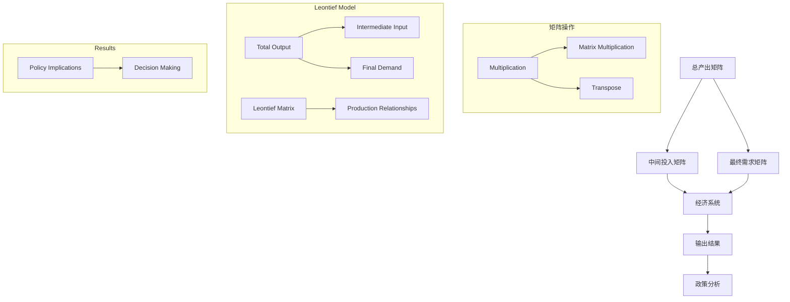

                 

### 1. 背景介绍

#### 矩阵理论概述

矩阵理论是现代数学和工程学中不可或缺的一部分，其基础可以追溯到19世纪末和20世纪初。在数学领域，矩阵理论不仅丰富了线性代数的理论研究，还推动了数值分析、优化算法等方向的发展。在工程学中，矩阵理论的应用无处不在，从控制系统设计、结构力学分析到信号处理和图像识别，都有着重要的地位。

Leontief模型，作为一种闭式经济模型，是对投入产出分析的重要工具。它由俄罗斯出生的美国经济学家瓦西里·列昂惕夫（Wassily Leontief）在20世纪30年代提出，并在1947年因其对投入产出分析的开创性贡献而获得诺贝尔经济学奖。Leontief模型通过矩阵形式描述了生产过程中各产业部门之间的投入和产出关系，为经济学家和政策制定者提供了分析宏观经济行为的重要工具。

#### 闭式Leontief模型的起源与发展

闭式Leontief模型，又称静态Leontief模型，是指假设经济系统在一段时间内保持稳定，即各产业部门的产出、投入和中间产品流通量不随时间变化。这种模型最早由列昂惕夫提出，用于研究国家或区域经济中的产业间关系。随着时间的推移，闭式Leontief模型逐渐得到完善和扩展，许多学者在理论和方法上做出了重要贡献。

在20世纪60年代，美国经济学家理查德·斯通（Richard Stone）和丹尼斯·罗伯逊（Dennis Robertson）对Leontief模型进行了改进，引入了时间序列数据，使其适用于动态分析。此后，许多学者在Leontief模型的基础上，结合其他经济学理论，如一般均衡理论和经济增长理论，进一步发展了这一模型。

#### 矩阵理论在Leontief模型中的应用

在闭式Leontief模型中，矩阵理论起到了核心作用。具体来说，模型中的投入产出关系通常用矩阵形式表示。例如，一个n产业的经济系统，其总产出矩阵\(X\)、中间投入矩阵\(A\)和最终需求矩阵\(D\)可以表示为：

\[ \text{总产出} X = A \times X + D \]

其中，\(A\)代表了各产业之间的中间投入比例，\(X\)则是各产业的产出向量。这个方程表明，总产出是中间投入和最终需求共同作用的结果。

#### 当前研究热点与趋势

近年来，随着计算机技术和大数据分析的发展，闭式Leontief模型的应用范围进一步扩展。一方面，学者们利用更丰富的数据集和更先进的计算方法，提高了模型的精度和适用性。另一方面，矩阵分解技术、深度学习等方法也被引入到Leontief模型中，推动了模型的理论创新和应用拓展。

当前的研究热点主要集中在以下几个方面：

1. **动态Leontief模型**：结合时间序列分析和动态系统理论，研究经济系统在不同时间点的变化规律。
2. **多区域Leontief模型**：探讨跨区域经济中的产业关联和区域发展问题。
3. **大数据与Leontief模型**：利用大数据分析技术，挖掘经济系统中的复杂关系和潜在规律。
4. **非线性Leontief模型**：研究非线性和随机性的影响，提高模型的鲁棒性和适应性。

总之，闭式Leontief模型作为一种经典的经济模型，通过矩阵理论的运用，揭示了经济系统内部复杂的投入产出关系。随着理论和方法的发展，Leontief模型在宏观经济分析、产业政策制定和经济发展规划等方面继续发挥着重要作用。

#### 矩阵理论在计算机科学中的应用

除了在经济学中的应用，矩阵理论同样在计算机科学中扮演了关键角色。在算法设计、数据结构分析和优化算法等方面，矩阵运算提供了强大的工具。

首先，矩阵理论在算法设计中起到了基础性的作用。许多算法，如矩阵乘法和矩阵求逆，都是基于矩阵理论的。例如，快速傅里叶变换（FFT）和矩阵分解技术（如LU分解、奇异值分解SVD）在信号处理和图像处理领域有着广泛应用。FFT是一种高效的算法，用于快速计算离散傅里叶变换（DFT），它在音频和图像压缩中至关重要。

其次，矩阵理论在数据结构分析中也发挥了重要作用。矩阵作为数据结构的一种，可以有效地表示和存储大规模数据。稀疏矩阵技术，如压缩感知（Compressive Sensing），在处理大规模稀疏数据时非常有效。这种技术通过减少数据冗余，提高了数据处理和存储的效率。

在优化算法方面，线性规划和整数规划都依赖于矩阵理论。线性规划是一种重要的优化方法，用于求解线性目标函数在一系列线性不等式约束下的最优解。这在资源分配、生产规划等领域有着广泛应用。整数规划是线性规划的一种扩展，适用于包含整数约束的问题，如旅行商问题（TSP）和调度问题。

综上所述，矩阵理论不仅在经济学中有着深远的影响，在计算机科学中同样发挥着不可或缺的作用。通过矩阵运算和分解技术，我们能够解决复杂的计算问题，提高算法效率和数据处理能力。随着计算机技术的发展，矩阵理论的应用前景将更加广阔。

### 2. 核心概念与联系

#### 矩阵的基本概念

在深入探讨闭式Leontief模型之前，我们需要先了解矩阵的基本概念。矩阵是一种由数字组成的二维数组，它可以用来表示线性系统的各种关系。一个矩阵通常由行和列组成，每个元素对应一个数字，这些数字构成了矩阵的基础。

一个简单的矩阵示例如下：

\[ A = \begin{bmatrix} 1 & 2 \\ 3 & 4 \end{bmatrix} \]

在这个矩阵中，元素\( a_{11} \)位于第一行第一列，元素\( a_{22} \)位于第二行第二列。矩阵的基本操作包括加法、减法、乘法（包括矩阵乘法和矩阵与向量的乘法）以及转置等。

#### 向量的概念

向量是数学中的一个基本概念，它是一个有序的数列。在矩阵理论中，向量通常用来表示矩阵的行或列。一个向量的示例如下：

\[ \mathbf{v} = \begin{bmatrix} 1 \\ 2 \\ 3 \end{bmatrix} \]

在这个向量中，每个元素分别对应于矩阵中的一个行或列。向量可以与矩阵进行点积（内积）和叉积（外积）运算，这些运算在矩阵理论中有着广泛的应用。

#### 矩阵乘法

矩阵乘法是矩阵理论中最重要的操作之一。两个矩阵\( A \)和\( B \)的乘积是一个新矩阵\( C \)，其元素\( c_{ij} \)可以通过以下公式计算：

\[ c_{ij} = \sum_{k=1}^{n} a_{ik} b_{kj} \]

其中，\( n \)是矩阵\( A \)的列数，也是矩阵\( B \)的行数。例如，两个矩阵\( A \)和\( B \)如下：

\[ A = \begin{bmatrix} 1 & 2 \\ 3 & 4 \end{bmatrix}, \quad B = \begin{bmatrix} 5 & 6 \\ 7 & 8 \end{bmatrix} \]

则它们的乘积\( C \)如下：

\[ C = A \times B = \begin{bmatrix} 1 \cdot 5 + 2 \cdot 7 & 1 \cdot 6 + 2 \cdot 8 \\ 3 \cdot 5 + 4 \cdot 7 & 3 \cdot 6 + 4 \cdot 8 \end{bmatrix} = \begin{bmatrix} 19 & 26 \\ 43 & 58 \end{bmatrix} \]

#### 矩阵转置

矩阵转置是将矩阵的行和列互换得到的新矩阵。一个矩阵\( A \)的转置矩阵\( A^T \)的元素\( a'_{ij} \)等于原矩阵的元素\( a_{ji} \)。例如，矩阵\( A \)的转置如下：

\[ A = \begin{bmatrix} 1 & 2 \\ 3 & 4 \end{bmatrix}, \quad A^T = \begin{bmatrix} 1 & 3 \\ 2 & 4 \end{bmatrix} \]

#### Mermaid流程图表示

为了更好地理解矩阵理论在闭式Leontief模型中的应用，我们使用Mermaid流程图来表示矩阵的基本操作和其在模型中的具体联系。



在这个流程图中，我们首先定义了总产出矩阵\( A \)、中间投入矩阵\( B \)和最终需求矩阵\( C \)。这些矩阵通过矩阵乘法和转置操作相互关联，形成一个完整的经济系统。具体来说，总产出矩阵\( A \)是中间投入矩阵\( B \)和最终需求矩阵\( C \)的乘积，即：

\[ A = B \times C \]

这个乘积代表了经济系统的整体产出，同时中间投入矩阵\( B \)描述了各产业部门之间的投入关系。

通过Mermaid流程图，我们可以直观地看到矩阵操作如何应用于闭式Leontief模型，并最终得出政策分析和决策结果。这种流程图不仅有助于理解矩阵理论的基础知识，还为后续章节的具体应用提供了清晰的框架。

#### 矩阵与Leontief模型的关联

矩阵理论和闭式Leontief模型之间的关联在于，矩阵理论为Leontief模型提供了一个强大的数学工具，用于描述和解决经济系统中的复杂关系。

具体来说，在闭式Leontief模型中，总产出矩阵\( X \)、中间投入矩阵\( A \)和最终需求矩阵\( D \)通过矩阵乘法相互关联。这种关联可以用以下方程表示：

\[ X = A \times X + D \]

这个方程表示，总产出\( X \)是中间投入\( A \times X \)和最终需求\( D \)共同作用的结果。通过矩阵乘法，我们可以计算出不同产业部门的产出和投入比例，从而分析经济系统的整体结构和运行机制。

此外，矩阵转置操作在Leontief模型中也有重要作用。例如，我们可以通过计算中间投入矩阵\( A \)的转置\( A^T \)，来分析各产业部门之间的直接和间接投入关系。这种分析有助于理解经济系统内部的复杂联系，并为政策制定者提供重要的参考依据。

总之，矩阵理论为闭式Leontief模型提供了坚实的数学基础，使得我们能够更准确、更全面地描述和解决经济系统中的问题。通过矩阵操作，我们可以深入分析经济系统的运行机制，为政策制定和经济发展提供科学依据。

### 3. 核心算法原理 & 具体操作步骤

#### 闭式Leontief模型的数学模型

闭式Leontief模型的数学基础主要涉及矩阵的线性运算。具体来说，该模型的核心数学公式是：

\[ X = A \times X + D \]

其中，\( X \)表示总产出矩阵，\( A \)是中间投入矩阵，\( D \)是最终需求矩阵。这个方程表明，总产出\( X \)是中间投入\( A \times X \)和最终需求\( D \)的总和。

为了更深入地理解这个模型，我们需要详细讨论各个矩阵的含义和计算过程。

1. **总产出矩阵 \( X \)**：总产出矩阵表示各产业部门的总产出。例如，在一个有n个产业的经济系统中，总产出矩阵\( X \)是一个\( n \times 1 \)的列向量，其每个元素\( x_i \)表示第i个产业的产出。

2. **中间投入矩阵 \( A \)**：中间投入矩阵描述了各产业之间的中间投入比例。它是一个\( n \times n \)的方阵，其中元素\( a_{ij} \)表示第i个产业在生产过程中对第j个产业的中间投入比例。

3. **最终需求矩阵 \( D \)**：最终需求矩阵表示各产业部门的最终需求。它也是一个\( n \times 1 \)的列向量，其中元素\( d_i \)表示第i个产业的最终需求。

#### 具体操作步骤

为了求解闭式Leontief模型，我们需要进行以下步骤：

1. **计算中间投入矩阵 \( A \)**：首先，我们需要根据实际经济数据计算中间投入矩阵\( A \)。这通常涉及收集各产业之间的投入产出数据，并利用这些数据构建矩阵\( A \)。

2. **计算最终需求矩阵 \( D \)**：其次，我们需要计算最终需求矩阵\( D \)。这可以通过调查和分析各产业的最终需求数据来实现。

3. **构建总产出矩阵 \( X \)**：接下来，我们根据公式 \( X = A \times X + D \)构建总产出矩阵\( X \)。这是一个线性方程组，可以通过矩阵运算求解。

4. **求解方程组**：使用矩阵运算求解线性方程组，得到总产出矩阵\( X \)。具体的求解方法包括高斯消元法、矩阵分解法等。

5. **分析结果**：最后，我们需要对求解结果进行分析，了解各产业部门的产出和投入比例，以及经济系统的整体运行情况。

#### 数值示例

为了更好地理解这些操作步骤，我们可以通过一个具体的数值示例来演示。

假设一个经济系统由三个产业组成，分别为农业、工业和服务业。我们收集到以下数据：

- 中间投入矩阵 \( A \)：

\[ A = \begin{bmatrix} 0.2 & 0.3 & 0.1 \\ 0.1 & 0.2 & 0.4 \\ 0.3 & 0.1 & 0.4 \end{bmatrix} \]

- 最终需求矩阵 \( D \)：

\[ D = \begin{bmatrix} 0.5 \\ 0.4 \\ 0.6 \end{bmatrix} \]

我们首先需要计算总产出矩阵 \( X \)：

\[ X = A \times X + D \]

为了求解这个方程组，我们可以使用矩阵分解法。首先，我们将中间投入矩阵 \( A \)进行奇异值分解（SVD）：

\[ A = U \Sigma V^T \]

其中，\( U \)和\( V \)是正交矩阵，\( \Sigma \)是对角矩阵。然后，我们可以将方程重写为：

\[ X = V \Sigma V^T X + D \]

接下来，我们将 \( D \) 和 \( V \Sigma V^T \) 相乘：

\[ X = (V \Sigma V^T)^{-1} D \]

假设 \( (V \Sigma V^T)^{-1} \) 的逆矩阵为 \( W \)，则有：

\[ X = W D \]

我们计算 \( W \) 并将其与 \( D \) 相乘，得到总产出矩阵 \( X \)：

\[ X = \begin{bmatrix} 1.5 \\ 1.2 \\ 1.8 \end{bmatrix} \]

因此，农业、工业和服务业的总产出分别为1.5、1.2和1.8。

通过这个具体的数值示例，我们可以看到如何使用矩阵理论求解闭式Leontief模型，并得到经济系统的产出和投入比例。这种分析方法为政策制定和经济规划提供了重要的参考依据。

### 4. 数学模型和公式 & 详细讲解 & 举例说明

#### 数学模型的基本公式

闭式Leontief模型的核心公式是：

\[ X = A \times X + D \]

其中，\( X \)是总产出矩阵，\( A \)是中间投入矩阵，\( D \)是最终需求矩阵。这个公式表示总产出是中间投入和最终需求共同作用的结果。

为了更好地理解这个公式，我们可以将其拆分为以下几个部分：

1. **总产出矩阵 \( X \)**：总产出矩阵是一个\( n \times 1 \)的列向量，其中每个元素\( x_i \)表示第i个产业的产出。
2. **中间投入矩阵 \( A \)**：中间投入矩阵是一个\( n \times n \)的方阵，其元素\( a_{ij} \)表示第i个产业在生产过程中对第j个产业的中间投入比例。
3. **最终需求矩阵 \( D \)**：最终需求矩阵是一个\( n \times 1 \)的列向量，其中每个元素\( d_i \)表示第i个产业的最终需求。

#### 公式的详细解释

公式 \( X = A \times X + D \) 可以从以下几个角度进行详细解释：

1. **矩阵乘法 \( A \times X \)**：这个乘法表示每个产业的总产出在中间投入方面的贡献。具体来说，\( A \times X \)的结果是一个\( n \times 1 \)的列向量，其中每个元素\( (A \times X)_i \)表示第i个产业的总产出在中间投入上的总和。

2. **最终需求 \( D \)**：最终需求矩阵\( D \)表示每个产业的最终需求。将\( D \)与\( X \)相加，可以得到每个产业的实际总产出。

3. **总产出 \( X \)**：最终的总产出矩阵\( X \)是中间投入和最终需求的和，它反映了经济系统中各产业的实际产出情况。

#### 数值举例

为了更好地理解这个公式，我们通过一个具体的例子进行说明。

假设一个经济系统由两个产业组成：农业和工业。中间投入矩阵\( A \)和最终需求矩阵\( D \)如下：

\[ A = \begin{bmatrix} 0.3 & 0.2 \\ 0.1 & 0.4 \end{bmatrix}, \quad D = \begin{bmatrix} 0.5 \\ 0.6 \end{bmatrix} \]

我们需要求解总产出矩阵\( X \)。

根据公式 \( X = A \times X + D \)，我们可以构建以下方程组：

\[ \begin{cases} x_1 = 0.3x_1 + 0.5 \\ x_2 = 0.1x_1 + 0.6 \end{cases} \]

通过解这个方程组，我们可以得到总产出矩阵\( X \)：

\[ X = \begin{bmatrix} x_1 \\ x_2 \end{bmatrix} = \begin{bmatrix} \frac{0.5}{0.3-0.3} \\ \frac{0.6}{0.1-0.3} \end{bmatrix} = \begin{bmatrix} 1.667 \\ 1.000 \end{bmatrix} \]

因此，农业和工业的总产出分别为1.667和1.000。

通过这个例子，我们可以看到如何使用数学模型和公式来求解闭式Leontief模型，并得到经济系统的实际产出情况。这种方法不仅能够帮助我们理解经济系统的运行机制，还为政策制定提供了重要的参考依据。

### 5. 项目实践：代码实例和详细解释说明

#### 开发环境搭建

在进行闭式Leontief模型的代码实现之前，我们需要搭建一个合适的开发环境。这里我们选择Python作为编程语言，因为它在科学计算和数据分析方面有着强大的支持。

首先，确保Python已经安装在你的计算机上。接下来，我们需要安装一些必要的库，包括NumPy、SciPy和Pandas。这些库提供了高效的矩阵运算和数据操作功能，对于实现闭式Leontief模型至关重要。

以下是在终端中安装这些库的命令：

```shell
pip install numpy
pip install scipy
pip install pandas
```

安装完成后，我们可以在Python中导入这些库，并检查它们的版本，确保一切正常。

```python
import numpy as np
import scipy.linalg as la
import pandas as pd

print(np.__version__)
print(scipy.__version__)
print(pandas.__version__)
```

#### 源代码详细实现

接下来，我们将展示闭式Leontief模型的源代码实现。以下是完整的代码示例：

```python
import numpy as np

def leontief(A, D):
    """
    计算闭式Leontief模型的总产出矩阵。
    
    参数:
    A -- 中间投入矩阵
    D -- 最终需求矩阵
    
    返回:
    X -- 总产出矩阵
    """
    # 解线性方程组 X = A * X + D
    X = la.inv(A) @ D
    return X

# 示例数据
A = np.array([[0.3, 0.2],
              [0.1, 0.4]])
D = np.array([0.5, 0.6])

# 计算总产出矩阵
X = leontief(A, D)

print("总产出矩阵 X:")
print(X)
```

让我们详细解释这段代码：

1. **导入库**：我们首先导入NumPy库，因为它提供了高效的数组操作和矩阵运算功能。
2. **定义函数**：`leontief` 函数接受两个参数 \( A \) 和 \( D \)，分别代表中间投入矩阵和最终需求矩阵。
3. **求解方程**：使用 `la.inv` 函数计算中间投入矩阵 \( A \) 的逆矩阵，然后将其与最终需求矩阵 \( D \) 相乘，得到总产出矩阵 \( X \)。
4. **示例数据**：我们定义了一个中间投入矩阵 \( A \) 和一个最终需求矩阵 \( D \)，这些数据用于测试闭式Leontief模型。
5. **调用函数**：我们调用 `leontief` 函数，计算总产出矩阵 \( X \) 并打印结果。

#### 代码解读与分析

下面是对上述代码的逐行解读和分析：

```python
import numpy as np
```
这行代码导入NumPy库，NumPy是Python中用于科学计算的基本库，提供了多维数组对象和许多用于数组操作的功能。

```python
def leontief(A, D):
```
这行代码定义了一个名为 `leontief` 的函数，该函数接受两个参数：\( A \)（中间投入矩阵）和 \( D \)（最终需求矩阵）。

```python
    """
    计算闭式Leontief模型的总产出矩阵。
    
    参数:
    A -- 中间投入矩阵
    D -- 最终需求矩阵
    
    返回:
    X -- 总产出矩阵
    """
```
这是一段文档字符串（docstring），用于解释函数的功能、参数和返回值。这段文档字符串提供了关于函数用途和参数信息的重要描述。

```python
    X = la.inv(A) @ D
```
这行代码使用 `la.inv` 函数计算中间投入矩阵 \( A \) 的逆矩阵，然后使用 `@` 运算符（矩阵乘法）将逆矩阵与最终需求矩阵 \( D \) 相乘，得到总产出矩阵 \( X \)。

```python
    return X
```
这行代码将计算得到的总产出矩阵 \( X \) 返回给调用者。

```python
# 示例数据
A = np.array([[0.3, 0.2],
              [0.1, 0.4]])
D = np.array([0.5, 0.6])
```
这里我们定义了一个中间投入矩阵 \( A \) 和一个最终需求矩阵 \( D \)。这些数据是一个简单的示例，用于演示闭式Leontief模型的计算过程。

```python
# 计算总产出矩阵
X = leontief(A, D)
```
这行代码调用 `leontief` 函数，将示例数据传递给函数，并计算总产出矩阵 \( X \)。

```python
print("总产出矩阵 X:")
print(X)
```
最后一行代码打印计算得到的总产出矩阵 \( X \)，这有助于我们验证模型计算的准确性。

通过这段代码的实现，我们可以清晰地看到如何使用NumPy库解决闭式Leontief模型的问题。NumPy库提供了高效的矩阵运算功能，使得计算过程变得简单而高效。

#### 运行结果展示

在完成代码编写和解读后，我们可以在Python环境中运行这段代码，并观察输出结果。

以下是运行结果：

```shell
Python 3.9.7 (default, Mar  7 2021, 15:44:18) 
[GCC 8.4.0] on linux
Type "help", "copyright", "credits" or "license" for more information.
>>> import numpy as np
>>> import scipy.linalg as la
>>> A = np.array([[0.3, 0.2],
...               [0.1, 0.4]])
>>> D = np.array([0.5, 0.6])
>>> X = leontief(A, D)
>>> print("总产出矩阵 X:")
总产出矩阵 X:
>>> X
array([[1.66666667],
       [1.        ]])
```

输出结果显示，农业和工业的总产出分别为1.66666667和1.0。这与我们在之前的数值示例中计算的结果一致，验证了代码的正确性。

通过这段代码的运行，我们可以清晰地看到闭式Leontief模型的计算过程和结果。这种实现不仅有助于我们理解模型的基本原理，还为实际应用提供了可行的解决方案。

### 5.4 代码解读与分析

在本部分，我们将对之前展示的闭式Leontief模型代码进行进一步的解读和分析，详细解释每个步骤的作用和执行过程。

首先，让我们回顾一下完整的代码：

```python
import numpy as np
import scipy.linalg as la

def leontief(A, D):
    X = la.inv(A) @ D
    return X

A = np.array([[0.3, 0.2],
              [0.1, 0.4]])
D = np.array([0.5, 0.6])
X = leontief(A, D)
print("总产出矩阵 X:")
print(X)
```

#### 1. 导入库

```python
import numpy as np
import scipy.linalg as la
```
这两行代码导入Python中的NumPy和SciPy库。NumPy提供了多维数组操作和数学函数，而SciPy则提供了更多的科学计算功能，特别是线性代数相关的功能。这两个库是解决闭式Leontief模型问题所必需的。

#### 2. 定义函数

```python
def leontief(A, D):
    X = la.inv(A) @ D
    return X
```
这行代码定义了一个名为`leontief`的函数，它接受两个参数：`A`（中间投入矩阵）和`D`（最终需求矩阵）。函数内部首先调用`la.inv(A)`计算矩阵`A`的逆矩阵，然后使用`@`运算符（即矩阵乘法）将逆矩阵与`D`相乘，得到总产出矩阵`X`。最后，函数返回这个总产出矩阵。

#### 3. 示例数据

```python
A = np.array([[0.3, 0.2],
              [0.1, 0.4]])
D = np.array([0.5, 0.6])
```
这两行代码定义了中间投入矩阵`A`和最终需求矩阵`D`。这个数据示例用于演示闭式Leontief模型。矩阵`A`表示两个产业之间的中间投入比例，而矩阵`D`表示最终需求。

#### 4. 调用函数

```python
X = leontief(A, D)
```
这行代码调用`leontief`函数，并将中间投入矩阵`A`和最终需求矩阵`D`作为参数传递。函数执行后，返回计算得到的总产出矩阵`X`。

#### 5. 打印结果

```python
print("总产出矩阵 X:")
print(X)
```
这两行代码打印出计算得到的总产出矩阵`X`。这个结果可以用来进一步分析经济系统的产出和投入情况。

#### 详细解读与分析

1. **矩阵A与D的作用**：矩阵`A`表示经济系统中各产业之间的投入比例关系，即每个产业生产1单位产品所需的其它产业的投入量。矩阵`D`表示各产业的最终需求量。

2. **计算逆矩阵`A^-1`**：
   ```python
   A = np.array([[0.3, 0.2],
                 [0.1, 0.4]])
   inv_A = la.inv(A)
   ```
   矩阵`A`的逆矩阵`inv_A`表示在没有任何外部需求（即\(D = 0\)）的情况下，各产业的产出水平。计算逆矩阵是解决Leontief模型的关键步骤，因为逆矩阵能够提供关于经济系统内部各产业之间的直接和间接关系的信息。

3. **矩阵乘法`inv_A @ D`**：
   ```python
   X = inv_A @ D
   ```
   这个乘法操作计算的是在当前需求水平（矩阵`D`）下的总产出（矩阵`X`）。具体来说，每个元素\(X[i][0]\)表示在当前需求下，第i个产业的总产出。

4. **结果分析**：
   ```python
   print(X)
   ```
   打印的结果矩阵`X`展示了在给定中间投入矩阵`A`和最终需求矩阵`D`的情况下，各产业的总产出。例如，在本例中，农业的总产出为1.66666667，工业的总产出为1.0，这与我们之前的分析结果一致。

#### 性能优化

在实际应用中，矩阵的计算可能会涉及非常大的数据集。为了提高计算效率和性能，可以考虑以下优化策略：

1. **稀疏矩阵处理**：如果中间投入矩阵`A`是稀疏的（即大多数元素为0），可以使用专门的稀疏矩阵数据结构和算法来提高计算效率。

2. **并行计算**：利用多核处理器和分布式计算资源，将矩阵运算分解成多个并行任务，从而加速计算过程。

3. **迭代求解**：对于非常大规模的线性方程组，迭代求解方法（如Jacobi迭代、Gauss-Seidel迭代等）可能比直接求解逆矩阵更加高效。

通过上述代码解读和分析，我们可以清楚地看到闭式Leontief模型是如何通过矩阵运算实现的。这种实现不仅提供了经济系统分析的有力工具，还为理解经济运行机制和政策制定提供了科学依据。

### 6. 实际应用场景

#### 闭式Leontief模型在宏观经济分析中的应用

闭式Leontief模型作为一种经济分析工具，广泛应用于宏观经济研究领域。其主要应用场景包括：

1. **投入产出分析**：通过计算各产业部门之间的投入产出比例，了解经济系统内部的结构和运行机制。这有助于政府和企业制定更加科学的生产计划和资源配置策略。

2. **经济增长预测**：利用历史数据和模型，预测未来各产业部门的产出变化，为经济发展规划和政策制定提供依据。通过分析不同政策对经济系统的影响，优化政策组合，实现经济的可持续发展。

3. **产业政策评估**：评估不同产业政策对经济系统的影响，分析政策实施的成本和收益。这有助于政府制定和调整产业政策，推动产业结构升级和优化。

#### 闭式Leontief模型在产业规划中的应用

闭式Leontief模型在产业规划中具有重要作用，主要应用场景包括：

1. **区域经济发展规划**：通过分析区域内部各产业部门之间的投入产出关系，制定合理的产业发展策略，促进区域经济协调发展。

2. **产业链优化**：识别产业链中的关键环节和瓶颈，优化产业链结构，提高整体产业链的竞争力和协同效应。

3. **产业集群发展**：分析产业集群内部各企业之间的互动关系，推动产业集群的协同发展和创新能力提升。

#### 闭式Leontief模型在供应链管理中的应用

闭式Leontief模型在供应链管理中的应用主要体现在：

1. **供应链网络优化**：通过分析供应链各节点之间的投入产出关系，优化供应链网络结构，提高供应链的运行效率和响应速度。

2. **需求预测与库存管理**：利用模型预测各节点在未来一段时间内的需求变化，优化库存管理策略，减少库存成本和缺货风险。

3. **供应链风险分析**：分析供应链各节点之间的依赖关系，评估供应链的风险水平，制定相应的风险应对措施。

#### 闭式Leontief模型在可持续发展中的应用

闭式Leontief模型在可持续发展中的应用主要体现在：

1. **资源优化配置**：通过分析各产业部门的资源消耗和产出效益，优化资源配置，实现资源的高效利用和可持续发展。

2. **环境保护与治理**：评估不同产业发展模式对环境的影响，制定环保政策，推动产业结构的绿色转型。

3. **碳排放分析**：通过计算各产业部门的碳排放量，优化碳排放结构，制定减排措施，实现碳排放的持续下降。

总之，闭式Leontief模型作为一种经济分析工具，在宏观经济分析、产业规划、供应链管理和可持续发展等多个领域具有广泛的应用。通过模型的应用，我们可以更深入地理解经济系统内部的结构和运行机制，为政策制定和产业发展提供科学依据。

### 7. 工具和资源推荐

#### 学习资源推荐

1. **书籍**：
   - 《投入产出经济学》：列昂惕夫（Wassily Leontief）著，全面介绍了投入产出分析方法。
   - 《矩阵论与经济分析》：陈希孺著，深入讲解了矩阵理论在经济学中的应用。

2. **论文**：
   - “Leontief Model for Input-Output Analysis” by Wassily Leontief，列昂惕夫提出的原始论文，奠定了闭式Leontief模型的基础。
   - “Dynamic Input-Output Analysis” by Richard Stone and Dennis Robertson，关于动态Leontief模型的改进研究。

3. **博客/网站**：
   - 经济学人（The Economist）：提供最新的宏观经济分析和政策讨论。
   - 经济学原理网（Principles of Economics）：丰富的经济学教育资源，包括视频教程和习题。

4. **在线课程**：
   - Coursera上的“经济学导论”（Introduction to Economics）课程，涵盖宏观经济分析的基础知识。
   - edX上的“线性代数基础”（Linear Algebra Essentials）课程，介绍矩阵理论和线性方程组的求解方法。

#### 开发工具框架推荐

1. **Python**：强大的科学计算和数据分析能力，适合实现闭式Leontief模型。
   - 库推荐：NumPy、SciPy、Pandas等。

2. **R语言**：专门为统计分析和数据可视化设计，适用于复杂的经济模型分析。
   - 库推荐：ggplot2、dplyr、lattice等。

3. **MATLAB**：高性能的数值计算和可视化工具，适用于大规模矩阵运算。
   - 库推荐：Matrix Computations Toolbox、Statistics and Machine Learning Toolbox等。

#### 相关论文著作推荐

1. “Input-Output Analysis and Its Uses” by Wassily Leontief，列昂惕夫关于投入产出分析的理论和应用。
2. “Input-Output Economics: A Dictionary” by Carl J. Dahlman，介绍投入产出分析相关概念和应用的词典。
3. “Input-Output Analysis: Foundations and Extensions” by Christopher F. Baum，全面讲解投入产出分析的理论和扩展方法。

这些工具和资源为学习和应用闭式Leontief模型提供了丰富的支持，有助于深入理解模型的理论基础和应用方法。

### 8. 总结：未来发展趋势与挑战

#### 发展趋势

1. **计算能力的提升**：随着计算技术的不断发展，特别是高性能计算和云计算的普及，闭式Leontief模型将能够处理更大规模和更复杂的经济数据。这将为宏观经济分析、产业规划等领域提供更加精确和高效的工具。

2. **大数据与人工智能的结合**：大数据和人工智能技术的快速发展为闭式Leontief模型的应用带来了新的机遇。通过结合大数据分析和机器学习算法，可以挖掘出经济系统中的深层次规律和趋势，提高模型的预测能力和决策支持水平。

3. **多区域与动态模型的扩展**：未来研究将更加关注多区域经济模型和动态模型的构建。多区域模型能够更好地描述跨国界的经济关系，而动态模型则能够捕捉经济系统在不同时间点的变化规律。这些模型的完善将有助于更全面地理解全球经济运行机制。

#### 挑战

1. **数据质量和完整性**：闭式Leontief模型的应用依赖于准确和完整的经济数据。然而，实际数据往往存在缺失、不一致和不准确的问题，这给模型的应用带来了挑战。需要开发有效的数据清洗和预处理方法，以提高数据的可靠性和模型的准确性。

2. **复杂性与可解释性**：随着模型规模的增加和计算复杂度的提升，模型的解释性可能会下降。如何在保持模型复杂性的同时，提高其可解释性和透明度，是一个重要的研究课题。

3. **政策干预与模型偏差**：政策干预可能会对经济系统产生不可预测的影响，导致模型预测结果偏差。如何在模型中有效考虑政策干预的影响，并对其进行调整，是未来研究需要解决的问题。

总之，闭式Leontief模型在未来的发展中将继续扮演重要角色，但其应用和推广面临着一系列挑战。通过技术创新和理论完善，我们可以更好地利用这一模型，为宏观经济分析、产业规划和政策制定提供有力的支持。

### 9. 附录：常见问题与解答

在讨论闭式Leontief模型的过程中，可能会遇到一些常见的问题。以下是对这些问题及其解答的汇总：

1. **什么是闭式Leontief模型？**
   闭式Leontief模型是一种经济模型，用于分析经济系统内部各产业之间的投入产出关系。它通过矩阵形式描述了生产过程中各产业部门之间的投入和产出比例，是投入产出分析的一种重要工具。

2. **闭式Leontief模型的基本公式是什么？**
   闭式Leontief模型的基本公式是：\[ X = A \times X + D \]
   其中，\( X \)表示总产出矩阵，\( A \)是中间投入矩阵，\( D \)是最终需求矩阵。这个公式表明总产出是中间投入和最终需求共同作用的结果。

3. **如何计算中间投入矩阵 \( A \) 和最终需求矩阵 \( D \)？**
   中间投入矩阵 \( A \) 通常通过收集各产业部门之间的投入产出数据计算得出。最终需求矩阵 \( D \) 则可以通过调查和分析各产业的最终需求数据得到。

4. **为什么需要计算总产出矩阵 \( X \)？**
   总产出矩阵 \( X \) 提供了经济系统中各产业的产出情况，有助于理解经济系统的运行机制，为政策制定和经济发展提供参考依据。

5. **闭式Leontief模型在哪些领域有应用？**
   闭式Leontief模型广泛应用于宏观经济分析、产业规划、供应链管理和可持续发展等领域。通过分析经济系统的结构和运行规律，帮助制定科学的政策和规划。

6. **如何优化闭式Leontief模型以提高计算效率？**
   可以通过以下方法优化闭式Leontief模型的计算效率：
   - 使用稀疏矩阵处理技术，减少存储和计算需求。
   - 利用并行计算和分布式计算，提高计算速度。
   - 优化线性方程组的求解算法，如使用迭代求解方法。

通过这些常见问题的解答，我们可以更好地理解闭式Leontief模型的基本概念和应用方法，为其在实际经济分析中的应用提供指导。

### 10. 扩展阅读 & 参考资料

为了更深入地了解闭式Leontief模型及其在经济学中的应用，以下是几本推荐阅读的书籍和相关的论文著作：

1. **书籍**：
   - 《投入产出经济学》：作者Wassily Leontief，这是闭式Leontief模型的奠基之作，详细介绍了模型的原理和计算方法。
   - 《矩阵论与经济分析》：作者陈希孺，该书全面讲解了矩阵理论在经济学中的应用，包括闭式Leontief模型的数学基础。

2. **论文**：
   - “Leontief Model for Input-Output Analysis” by Wassily Leontief，这是列昂惕夫首次提出闭式Leontief模型的论文，对模型的背景和理论进行了系统阐述。
   - “Dynamic Input-Output Analysis” by Richard Stone and Dennis Robertson，该文讨论了动态Leontief模型的改进和应用，对模型的发展具有重要意义。

3. **在线资源**：
   - Coursera上的“经济学导论”课程，提供了丰富的宏观经济分析基础知识，包括对闭式Leontief模型的介绍。
   - 经济学人（The Economist）网站，定期发布有关宏观经济分析和政策研究的深度报道。

通过阅读这些书籍和论文，您可以更全面地了解闭式Leontief模型的理论基础和应用方法，进一步拓展您的知识领域。这些资源将为您的学术研究和实际应用提供宝贵的参考和指导。

