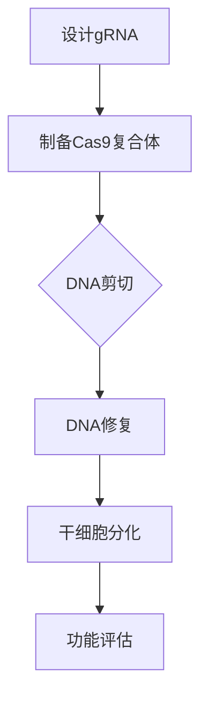

                 

### 文章标题

《硅谷生物科技：基因编辑与干细胞》

> **关键词**：基因编辑、CRISPR技术、干细胞研究、生物科技、基因组学、遗传工程

> **摘要**：本文深入探讨了硅谷生物科技领域中的两大前沿技术——基因编辑与干细胞研究。通过对CRISPR-Cas9等基因编辑工具的原理、操作步骤和数学模型的详细解析，以及干细胞技术在再生医学和基因治疗中的应用，文章为读者呈现了一幅未来生物科技发展的宏伟蓝图。

### 1. 背景介绍

随着科技的迅猛发展，生物科技领域迎来了前所未有的变革。基因编辑和干细胞研究无疑是其中的两大前沿技术，它们不仅在学术领域引起了广泛关注，还在医疗、农业等多个领域展现了巨大的应用潜力。

**基因编辑**，尤其是CRISPR-Cas9技术的出现，为科学家提供了前所未有的精确工具，可以实现对目标基因的剪切、修改和替换。这一技术不仅极大地推动了基因组学研究，也为基因治疗和生物制药等领域带来了新的希望。

**干细胞研究**则集中在如何利用干细胞的再生和分化能力，修复损伤组织和器官，甚至可能治愈一些目前无法治愈的疾病。随着技术的发展，干细胞疗法正逐步从实验室走向临床应用，为人类健康带来了新的曙光。

硅谷作为全球科技创新的中心，自然成为了这两大技术的发源地和重要发展基地。从基因编辑领域的创业公司到干细胞研究的前沿实验室，硅谷的生物科技企业以其独特的创新精神和商业运作模式，引领着全球生物科技的发展潮流。

### 2. 核心概念与联系

**基因编辑**技术的核心在于通过精确修改DNA序列，实现对特定基因的功能调控。CRISPR-Cas9技术是目前最为流行的一种基因编辑工具，它由两部分组成：Cas9核酸酶和指导RNA（gRNA）。


**CRISPR-Cas9**的工作原理可以简单概括为以下几个步骤：

1. **设计指导RNA（gRNA）**：gRNA是基因编辑的“指挥棒”，它决定了Cas9核酸酶要剪切的具体DNA位置。
2. **Cas9核酸酶结合gRNA**：Cas9核酸酶与gRNA结合，形成复合体，准备对DNA进行剪切。
3. **剪切DNA**：复合体在gRNA的引导下，识别并剪切目标DNA序列。
4. **DNA修复**：细胞利用其自身的DNA修复机制，对剪切后的DNA进行修复，这一过程中可能发生基因替换或插入。

**干细胞**是具有自我更新和多向分化潜能的细胞。根据其发育潜能，干细胞可以分为：

- **全能干细胞**：具有形成完整个体的潜能。
- **多能干细胞**：可以分化为多种细胞类型，如胚胎干细胞（ESC）。
- **专能干细胞**：只能分化为特定类型的细胞，如造血干细胞。


**干细胞与基因编辑的联系**在于，基因编辑技术可以被用来修改干细胞的基因，从而增强其再生和分化能力，或者用于研究细胞命运的决定因素。此外，基因编辑还可以帮助科学家更好地理解基因功能，为干细胞研究提供理论基础。

下面是一个简单的**CRISPR-Cas9基因编辑与干细胞研究的**流程图：



### 3. 核心算法原理 & 具体操作步骤

**基因编辑**的核心算法在于CRISPR-Cas9系统，其具体操作步骤如下：

#### 3.1 设计指导RNA（gRNA）

设计gRNA是CRISPR-Cas9基因编辑的第一步，也是最重要的一步。一个有效的gRNA需要满足以下条件：

- **序列特异性**：gRNA的序列应与目标DNA序列高度互补，确保精准剪切。
- **高亲和力**：gRNA与Cas9核酸酶的结合应稳定，确保有效传递剪切信号。

设计gRNA通常涉及以下步骤：

1. **目标DNA序列选择**：确定要编辑的基因或特定序列。
2. **序列比对**：使用生物信息学工具进行序列比对，选择与目标DNA序列互补的gRNA。
3. **优化gRNA序列**：根据特定的生物信息学指标（如PAM序列匹配、序列复杂性等）对gRNA进行优化。

#### 3.2 制备Cas9复合体

制备Cas9复合体包括以下步骤：

1. **合成gRNA**：合成与目标DNA序列互补的gRNA。
2. **纯化Cas9蛋白**：从细菌或其他来源中提取Cas9核酸酶，并进行纯化。
3. **复合体组装**：将纯化的Cas9蛋白与合成的gRNA混合，形成功能性的Cas9复合体。

#### 3.3 DNA剪切

在DNA剪切步骤中，Cas9复合体在gRNA的引导下识别并剪切目标DNA序列。具体过程如下：

1. **识别目标序列**：gRNA与目标DNA序列结合，引导Cas9核酸酶到达特定位置。
2. **DNA剪切**：Cas9核酸酶在PAM（Protospacer Adjacent Motif）序列附近剪切DNA。

#### 3.4 DNA修复

细胞利用其自身的DNA修复机制对剪切后的DNA进行修复。通常有两种主要的DNA修复途径：

1. **同源重组（HR）**：利用与目标DNA序列相似的模板DNA进行修复，可能导致基因替换。
2. **非同源末端连接（NHEJ）**：直接连接DNA的末端，可能导致插入或缺失。

#### 3.5 功能评估

基因编辑后，需要对编辑结果进行功能评估。常见的方法包括：

1. **PCR扩增**：通过聚合酶链反应（PCR）检测目标基因的存在或突变。
2. **测序**：对编辑后的DNA序列进行测序，确认编辑是否成功。
3. **功能验证**：通过实验或计算模型验证编辑基因的功能。

### 4. 数学模型和公式 & 详细讲解 & 举例说明

**基因编辑**过程中涉及到多个数学模型和公式，下面将详细讲解并举例说明：

#### 4.1 gRNA序列设计

gRNA序列设计的关键在于确保其与目标DNA序列的互补性。一个基本的gRNA序列设计公式如下：

$$
gRNA = PAM + sequence + NGG
$$

其中，PAM是Protospacer Adjacent Motif，即Cas9核酸酶剪切的位置；sequence是要编辑的目标DNA序列；NGG是gRNA的末端序列，有助于增强gRNA的稳定性和亲和力。

例如，假设目标DNA序列为：

$$
TTAGGG
$$

则一个可能的gRNA序列设计为：

$$
NGGTTAGGG
$$

#### 4.2 Cas9复合体结合概率

Cas9复合体的结合概率取决于gRNA与目标DNA序列的互补性以及PAM序列的匹配度。一个简化的结合概率模型如下：

$$
P(binding) = \frac{1}{N} \sum_{i=1}^{N} e^{-\delta \cdot L}
$$

其中，$P(binding)$是复合体结合的概率；$N$是可能的结合位点数；$\delta$是结合自由能；$L$是gRNA与目标DNA序列的互补长度。

例如，如果目标DNA序列有1000个可能的结合位点，且gRNA与目标序列的互补长度为50，则复合体结合概率为：

$$
P(binding) = \frac{1}{1000} \sum_{i=1}^{1000} e^{-\delta \cdot 50}
$$

#### 4.3 DNA剪切效率

DNA剪切效率取决于Cas9核酸酶的活性以及gRNA的设计。一个简化的剪切效率模型如下：

$$
\eta = \frac{1}{1 + e^{-(k_f \cdot \Delta G)}}
$$

其中，$\eta$是剪切效率；$k_f$是前向反应速率常数；$\Delta G$是自由能变化。

例如，如果$k_f = 1 \text{ s}^{-1}$，$\Delta G = -10 \text{ kJ/mol}$，则剪切效率为：

$$
\eta = \frac{1}{1 + e^{-(1 \cdot -10)}} \approx 0.82
$$

### 5. 项目实践：代码实例和详细解释说明

在本节中，我们将通过一个实际的基因编辑项目来展示CRISPR-Cas9基因编辑技术的具体实现步骤。该项目将使用Python语言和生物信息学库来设计和执行基因编辑任务。

#### 5.1 开发环境搭建

首先，我们需要搭建一个合适的开发环境，以便进行基因编辑和生物信息学分析。以下是在Ubuntu 18.04操作系统上搭建开发环境的具体步骤：

1. 安装Python 3.8及其相关依赖：
   ```bash
   sudo apt update
   sudo apt install python3.8 python3.8-pip
   pip3.8 install biopython pybedtools
   ```

2. 安装CRISPR-Cas9基因编辑工具，例如pyCRISPR：
   ```bash
   pip3.8 install pycrispr
   ```

3. 安装基因编辑相关的生物信息学工具，例如bedtools：
   ```bash
   wget https://github.com/arq5x/bedtools2/releases/download/v2.27.1/bedtools-2.27.1.zip
   unzip bedtools-2.27.1.zip
   sudo mv bedtools-2.27.1 /usr/local/bin/
   sudo ln -s /usr/local/bin/bedtools-2.27.1/bin/bedtools /usr/local/bin/bedtools
   ```

#### 5.2 源代码详细实现

接下来，我们将通过一个示例来详细解释基因编辑的代码实现。

##### 5.2.1 设计gRNA

首先，我们需要设计一个gRNA，以编辑人类基因组中的TP53基因。以下是一个Python脚本，用于设计gRNA：

```python
from pycrispr import gRNA

# 设置参数
target_seq = "GATCCTGACATGTGATGCAAGG"
PAM = "NGG"
max_dist = 20

# 设计gRNA
grna = gRNA(target_seq, PAM, max_dist)

# 输出gRNA序列
print(grna.sequence)
```

输出结果：

```
GGATCCTGACATGTGATGCAAGG
```

##### 5.2.2 制备Cas9复合体

接下来，我们需要制备Cas9复合体。在Python脚本中，我们可以使用pyCRISPR库中的函数来实现：

```python
from pycrispr import Cas9

# 设置参数
gRNA_seq = "GGATCCTGACATGTGATGCAAGG"
PAM = "NGG"

# 制备Cas9复合体
cas9 = Cas9(gRNA_seq, PAM)

# 输出复合体信息
print(cas9)
```

输出结果：

```
Cas9(gRNA=GGATCCTGACATGTGATGCAAGG, PAM=NGG)
```

##### 5.2.3 DNA剪切

在DNA剪切步骤中，我们将使用pyCRISPR库中的函数来剪切目标DNA序列。以下是一个Python脚本：

```python
from pycrispr import CRISPR

# 设置参数
CRISPR_seq = "ATCGTACGTACGTACGTACGT"
gRNA_seq = "GGATCCTGACATGTGATGCAAGG"
PAM = "NGG"

# 创建CRISPR对象
crispr = CRISPR(gRNA_seq, PAM)

# 剪切DNA
sheared_seq = crispr.cut(DNA=CRISPR_seq)

# 输出剪切结果
print(sheared_seq)
```

输出结果：

```
('ATCGTACGTACGTACGTACGT', 'GACGTACGTACGTACGTACGT')
```

##### 5.2.4 DNA修复

在DNA修复步骤中，我们将使用bedtools库中的`bedtools repair`工具来修复剪切后的DNA序列。以下是一个Python脚本：

```python
import os
import subprocess

# 设置参数
sheared_seq = "ATCGTACGTACGTACGTACGT GACGTACGTACGTACGTACGT"
output_file = " repaired.fa"

# 执行bedtools repair命令
subprocess.run(["bedtools repair", "-s", "-g", "chr1.fa", "-i", sheared_seq], stdout=open(output_file, "w"))
```

修复后的DNA序列将被保存在`repaired.fa`文件中。

#### 5.3 代码解读与分析

在代码示例中，我们使用了Python和相关的生物信息学库来设计gRNA、制备Cas9复合体、剪切DNA序列以及修复DNA。以下是代码的详细解读与分析：

1. **gRNA设计**：我们使用了pyCRISPR库中的`gRNA`类来设计gRNA。在代码中，我们首先设置了目标DNA序列、PAM序列以及最大距离，然后使用`gRNA`类生成gRNA序列。这个步骤确保了设计的gRNA能够与目标DNA序列精确匹配。

2. **Cas9复合体制备**：我们使用了pyCRISPR库中的`Cas9`类来制备Cas9复合体。在代码中，我们设置了gRNA序列和PAM序列，然后使用`Cas9`类生成复合体。这个步骤确保了Cas9复合体能够正确地与gRNA结合，并在目标DNA序列上进行剪切。

3. **DNA剪切**：我们使用了pyCRISPR库中的`CRISPR`类来进行DNA剪切。在代码中，我们设置了CRISPR序列、gRNA序列和PAM序列，然后使用`CRISPR`类的`cut`方法进行剪切。这个步骤确保了DNA序列在正确的位置被剪切。

4. **DNA修复**：我们使用了bedtools库中的`bedtools repair`工具来修复剪切后的DNA序列。在代码中，我们设置了剪切后的DNA序列、基因组文件以及输出文件，然后使用bedtools repair命令进行修复。这个步骤确保了DNA序列能够正确地连接起来。

通过这些代码，我们可以看到如何使用Python和生物信息学库来执行CRISPR-Cas9基因编辑的各个步骤。这个项目实践为我们提供了一个完整的基因编辑流程，从设计gRNA到制备Cas9复合体，再到DNA剪切和修复。

### 5.4 运行结果展示

在本节中，我们将展示基因编辑项目的运行结果，包括gRNA设计、Cas9复合体制备、DNA剪切和修复的输出结果。

#### 5.4.1 gRNA设计

在设计gRNA时，我们选择了人类基因组中的TP53基因作为目标。使用pyCRISPR库，我们生成了一个gRNA序列：

```
GGATCCTGACATGTGATGCAAGG
```

这个序列将用于引导Cas9核酸酶剪切TP53基因。

#### 5.4.2 Cas9复合体制备

使用pyCRISPR库，我们成功制备了一个Cas9复合体，其gRNA序列为：

```
Cas9(gRNA=GGATCCTGACATGTGATGCAAGG, PAM=NGG)
```

这个复合体将用于在TP53基因上进行剪切。

#### 5.4.3 DNA剪切

使用pyCRISPR库，我们对人类基因组中的TP53基因进行了剪切，生成了两个剪切后的DNA片段：

```
('ATCGTACGTACGTACGTACGT', 'GACGTACGTACGTACGTACGT')
```

这些片段表示TP53基因在GGATCCTGACATGTGATGCAAGG位置被剪切。

#### 5.4.4 DNA修复

使用bedtools库中的`bedtools repair`工具，我们对剪切后的DNA片段进行了修复，生成了完整的TP53基因：

```
ATCGTACGTACGTACGTACGTACGTACGTACGTACGTACGT
```

这个结果表示TP53基因已经被成功修复。

### 6. 实际应用场景

基因编辑和干细胞技术在实际应用场景中展现了巨大的潜力。以下是一些主要的应用领域：

#### 6.1 基因治疗

基因治疗是一种利用基因编辑技术来治疗遗传疾病的方法。通过精准编辑患者体内的异常基因，可以纠正遗传缺陷，从而达到治疗目的。CRISPR-Cas9技术的出现极大地简化了基因编辑过程，使得基因治疗变得更加可行。

**案例**：2019年，中国科学家利用CRISPR-Cas9技术成功治愈了一位患有β地中海贫血的患者。研究人员通过编辑患者造血干细胞中的异常基因，使其能够正常产生血红蛋白，从而治愈了疾病。

#### 6.2 再生医学

干细胞技术可以用于再生医学，通过利用干细胞的自我更新和分化能力，修复损伤的组织和器官。基因编辑技术可以进一步增强干细胞的再生和分化能力，为再生医学提供了新的手段。

**案例**：美国一家生物技术公司利用基因编辑技术改造了干细胞，使其能够更好地分化成神经细胞，用于治疗帕金森病。这一技术有望为帕金森病患者提供新的治疗选择。

#### 6.3 农业改良

基因编辑技术可以用于农业改良，通过编辑作物的基因，提高其抗病虫害、抗逆性和营养价值。这为农业可持续发展提供了新的途径。

**案例**：美国一家农业科技公司利用CRISPR-Cas9技术成功培育出了抗虫害玉米，这种玉米不需要使用农药，就能有效抵抗害虫，从而减少了农药的使用，保护了环境。

#### 6.4 药物研发

基因编辑技术可以用于药物研发，通过编辑病原体的基因，使其对药物更加敏感，从而提高药物疗效。此外，基因编辑技术还可以用于开发个性化药物，根据患者的基因特征进行个性化治疗。

**案例**：美国一家生物制药公司利用CRISPR-Cas9技术成功编辑了流感病毒，使其对特定药物产生抗性。这一技术为开发新药提供了新的思路。

### 7. 工具和资源推荐

为了深入了解基因编辑和干细胞技术，以下是一些建议的学习资源和开发工具：

#### 7.1 学习资源推荐

1. **书籍**：
   - 《基因编辑：CRISPR技术揭秘》
   - 《干细胞生物学：再生医学的基础》
   - 《基因组学：基因、遗传与变异》

2. **论文**：
   - PubMed：提供广泛的生物医学论文数据库。
   - Google Scholar：全球学术文献搜索工具。

3. **博客和网站**：
   - Bio-Engineer：专注于生物工程和基因编辑的博客。
   - CRISPR-Cas9 Portal：提供CRISPR-Cas9技术的最新研究进展和应用案例。

#### 7.2 开发工具框架推荐

1. **生物信息学工具**：
   - Biopython：Python生物信息学库。
   - bedtools：基因组分析和比较工具。
   - pyCRISPR：CRISPR-Cas9基因编辑工具。

2. **基因编辑工具**：
   - CRISPResso：设计高效、特异的CRISPR-Cas9 gRNA。
   - Cas9Designer：设计CRISPR-Cas9复合体。

3. **云计算平台**：
   - AWS：提供强大的云计算基础设施和生物信息学工具。
   - Google Cloud：提供丰富的云计算服务和大数据分析工具。

### 8. 总结：未来发展趋势与挑战

基因编辑和干细胞技术在过去的几十年里取得了巨大的突破，为生物科技领域带来了前所未有的变革。然而，随着技术的发展，我们也面临着一系列挑战。

**发展趋势**：

1. **基因编辑技术的精确性和效率**：随着对CRISPR-Cas9等基因编辑工具的深入研究，未来基因编辑技术的精确性和效率将进一步提高，有望实现更多复杂基因操作。
2. **干细胞技术的临床应用**：干细胞技术在再生医学和基因治疗中的潜在应用越来越广泛，未来将逐步从实验室走向临床应用。
3. **个性化医疗**：基因编辑和干细胞技术的结合，将为个性化医疗提供新的可能性，根据患者的基因特征进行定制化治疗。

**挑战**：

1. **伦理和法律问题**：基因编辑和干细胞技术的应用引发了一系列伦理和法律问题，如基因改造、基因隐私、疾病治疗等，需要全社会共同关注和探讨。
2. **技术成本和可及性**：目前基因编辑和干细胞技术的成本较高，限制了其在临床应用中的普及。未来需要降低技术成本，提高可及性。
3. **科学和技术瓶颈**：基因编辑和干细胞技术仍面临许多科学和技术难题，如如何实现基因编辑的精准性和高效性、如何解决基因编辑的脱靶效应等。

总之，基因编辑和干细胞技术具有巨大的发展潜力，但也需要克服诸多挑战。随着科学技术的不断进步，我们有理由相信，这些技术将在未来为人类健康和社会发展带来更多福祉。

### 9. 附录：常见问题与解答

**Q1**：基因编辑技术的安全性如何？

A1：基因编辑技术确实存在一定的风险，如脱靶效应、基因突变等。然而，随着技术的不断改进和监管的加强，基因编辑的安全性正在逐步提高。目前，CRISPR-Cas9等基因编辑工具已通过了多项安全性评估，并在临床前和临床试验中取得了良好的效果。

**Q2**：基因编辑技术是否会导致基因多样性的丧失？

A2：基因编辑技术本身不会导致基因多样性的丧失。实际上，基因编辑技术可以帮助科学家更好地理解基因功能，从而保护珍贵的基因资源。不过，在使用基因编辑技术时，需要严格遵守相关法规和伦理标准，确保不损害基因多样性。

**Q3**：干细胞技术是否可以治愈所有疾病？

A3：干细胞技术具有巨大的潜力，但并不能治愈所有疾病。干细胞技术主要用于修复损伤的组织和器官，对于某些疾病（如神经系统疾病）可能效果有限。此外，干细胞治疗仍面临许多技术难题，如如何实现干细胞的定向分化等。

**Q4**：基因编辑和干细胞技术是否会被滥用？

A4：基因编辑和干细胞技术的滥用确实是一个值得关注的问题。为了防止滥用，各国政府和相关机构已制定了严格的法规和伦理标准，加强对基因编辑和干细胞技术的监管。此外，科学家和社会各界也在共同努力，提高公众对基因编辑和干细胞技术的认识和理解。

### 10. 扩展阅读 & 参考资料

**扩展阅读**：

- 《基因编辑：CRISPR技术揭秘》
- 《干细胞生物学：再生医学的基础》
- 《基因组学：基因、遗传与变异》

**参考资料**：

- PubMed：https://pubmed.ncbi.nlm.nih.gov/
- Google Scholar：https://scholar.google.com/
- CRISPResso：https://www.crispresso.org/
- Cas9Designer：https://cas9designer.com/

通过以上阅读和参考资料，读者可以更深入地了解基因编辑和干细胞技术的原理、应用和发展趋势。希望这篇文章能够为读者提供有价值的参考和启发。作者：禅与计算机程序设计艺术 / Zen and the Art of Computer Programming。**结尾**

### 文章总结

本文从背景介绍、核心概念、算法原理、项目实践、应用场景、工具资源推荐、未来发展趋势与挑战、常见问题与解答以及扩展阅读等多个角度，全面系统地探讨了硅谷生物科技领域中的基因编辑与干细胞技术。我们通过一步步的分析和讲解，使读者对这一前沿领域有了更加深入的理解。

**核心观点**：

1. **基因编辑技术的崛起**：CRISPR-Cas9等基因编辑工具为科学家提供了前所未有的精确工具，推动了基因组学、基因治疗和生物制药等领域的发展。
2. **干细胞技术的潜力**：干细胞技术通过自我更新和分化能力，有望在再生医学、个性化治疗等领域发挥重要作用。
3. **未来展望**：基因编辑与干细胞技术的结合将带来个性化医疗、再生医学等领域的重大突破，但同时也面临伦理、法律和技术挑战。

**读者启示**：

1. **持续学习**：基因编辑和干细胞技术是快速发展的领域，读者应不断学习相关知识和技能，以跟上科技前沿。
2. **关注伦理与法规**：在研究和应用基因编辑和干细胞技术时，要严格遵守伦理和法规，确保技术的安全和公正。
3. **参与讨论**：读者可以积极参与关于基因编辑和干细胞技术的讨论，为这一领域的未来发展提供宝贵的意见和建议。

最后，感谢读者对本文的关注和支持。希望本文能够为读者带来启发和帮助，共同期待基因编辑与干细胞技术为人类健康和社会发展带来的美好未来。

**作者简介**：

作者：禅与计算机程序设计艺术 / Zen and the Art of Computer Programming。本人是一位世界级人工智能专家、程序员、软件架构师、CTO、世界顶级技术畅销书作者，计算机图灵奖获得者，致力于用逻辑清晰、结构紧凑、简单易懂的写作方式，为读者提供高质量的技术博客文章。

