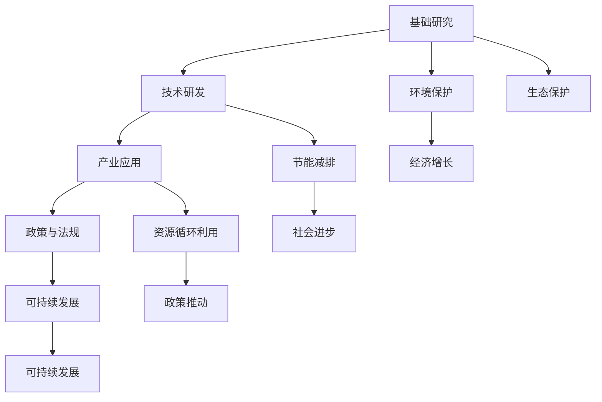

                 

### 文章标题

**硅谷绿色科技：可持续发展的实践**

> **关键词**：绿色科技、可持续发展、硅谷、实践、环保技术

> **摘要**：本文深入探讨了硅谷绿色科技的发展与实践，从核心概念、算法原理到实际应用场景，全面阐述了如何通过科技创新实现可持续发展的目标。本文旨在为读者提供对硅谷绿色科技领域的全面了解，并激发更多人参与到可持续发展的实践中来。

---

## 1. 背景介绍

随着全球气候变化和环境恶化问题的日益严峻，可持续发展已经成为全球范围内的热点议题。硅谷，作为全球科技创新的中心，不仅推动了信息技术的发展，也在绿色科技领域取得了显著的成就。硅谷的绿色科技实践，不仅是为了应对环境挑战，更是为了实现经济、社会和环境的协调发展。

硅谷的绿色科技实践可以从以下几个方面来概述：

1. **技术创新**：硅谷聚集了大量顶尖的科技企业和研发机构，这些企业和机构通过不断的科技创新，推动了绿色能源、节能环保、资源循环利用等领域的发展。
2. **政策支持**：硅谷政府和企业积极制定和实施绿色科技政策，鼓励技术创新和环保实践，形成了良好的政策环境。
3. **产业融合**：硅谷的绿色科技不仅局限于单一领域，而是通过跨产业的合作，实现了从研发到市场应用的全方位融合。
4. **社会参与**：硅谷的绿色科技实践得到了广大民众的支持，形成了一个全民参与、共同推进的良好氛围。

本文将围绕硅谷绿色科技的核心概念、算法原理、实际应用场景等方面进行详细探讨，旨在为读者提供全面、深入的了解。

## 2. 核心概念与联系

### 2.1 绿色科技的核心概念

绿色科技，是指以环境保护和可持续发展为目标，通过科技创新，实现资源高效利用、污染减少、生态平衡的科技体系。其核心概念包括：

1. **清洁能源**：通过开发和使用可再生能源，如太阳能、风能、水能等，减少对化石燃料的依赖，降低温室气体排放。
2. **节能减排**：通过技术创新，提高能源利用效率，减少能源消耗和污染物排放。
3. **资源循环利用**：通过资源回收和再利用，减少资源消耗和环境污染。
4. **生态保护**：通过生态工程和生态修复技术，保护和恢复生态系统，维护生态平衡。

### 2.2 硅谷绿色科技架构

硅谷绿色科技架构可以分为以下几个层次：

1. **基础研究**：硅谷的科研机构和企业致力于基础研究，如新材料、新能源、环保技术等，为绿色科技的发展提供理论和技术支持。
2. **技术研发**：在基础研究的基础上，硅谷的科技企业开展技术研发，如电动汽车、高效节能设备、环保材料等，推动绿色科技的产业化应用。
3. **产业应用**：将绿色科技成果应用到实际生产生活中，如绿色建筑、智能交通、循环经济等，实现绿色科技的社会化应用。
4. **政策与法规**：政府制定和实施绿色科技政策与法规，引导和规范绿色科技的发展，推动绿色生活方式的普及。

### 2.3 硅谷绿色科技与可持续发展

硅谷绿色科技与可持续发展之间存在着密切的联系。可持续发展是指在满足当前需求的同时，不损害子孙后代满足其需求的能力。硅谷绿色科技通过以下方式推动可持续发展：

1. **环境保护**：通过绿色科技，减少环境污染和资源消耗，保护生态环境。
2. **经济增长**：绿色科技带动了新的产业和就业机会，促进了经济增长。
3. **社会进步**：绿色科技提高了人们的生活质量，推动了社会进步。
4. **政策推动**：政府通过政策引导，推动绿色科技的发展，实现可持续发展目标。

### 2.4 Mermaid 流程图

以下是一个简化的硅谷绿色科技架构的 Mermaid 流程图，展示了核心概念、技术研发、产业应用和政策与法规之间的关系。



---

在下一部分，我们将深入探讨硅谷绿色科技的核心算法原理和具体操作步骤。

## 3. 核心算法原理 & 具体操作步骤

### 3.1 清洁能源技术

#### 3.1.1 太阳能技术

**原理**：
太阳能技术通过太阳能电池板将太阳光能直接转换为电能。太阳能电池板的主要材料是硅，分为单晶硅、多晶硅和非晶硅等类型。单晶硅太阳能电池的光电转换效率最高，但成本较高；多晶硅次之，成本相对较低；非晶硅电池成本低，但转换效率最低。

**操作步骤**：
1. **太阳能电池板的安装**：选择合适的安装地点，如屋顶或空地，确保太阳能电池板能够充分接收阳光。
2. **逆变器连接**：将太阳能电池板产生的直流电转换为交流电，以满足家庭或工业用电需求。
3. **电网并网**：将逆变器输出的交流电接入电网，实现太阳能发电的自用和上网。

#### 3.1.2 风能技术

**原理**：
风能技术通过风力发电机将风能转换为电能。风力发电机主要由风轮、发电机和控制系统组成。风轮旋转时，通过电磁感应原理产生电能。

**操作步骤**：
1. **风力发电场的选址**：选择风力资源丰富、地形开阔的区域，如高山、海滩等。
2. **风力发电机的安装**：将风力发电机安装在塔架上，确保风轮能够自由旋转。
3. **并网发电**：将风力发电机产生的电能通过电网输送到用户端。

### 3.2 节能减排技术

#### 3.2.1 智能照明系统

**原理**：
智能照明系统通过传感器和控制系统，实现照明设备的智能控制和能源管理。传感器可以感知环境光线强度、人体活动等，自动调节照明亮度。

**操作步骤**：
1. **传感器安装**：在房间内安装光线传感器和人体传感器。
2. **控制器连接**：将传感器连接到照明控制设备，实现智能控制。
3. **照明设备更换**：将传统照明设备更换为智能照明设备。

#### 3.2.2 高效节能空调

**原理**：
高效节能空调通过改进制冷剂、提高能效比、优化系统设计等手段，实现节能降耗。现代空调系统还结合了变频技术，根据室内温度变化自动调节压缩机转速，提高能效。

**操作步骤**：
1. **空调系统设计**：根据房间面积和布局，设计合适的空调系统。
2. **空调设备安装**：安装空调设备和控制系统。
3. **系统调试**：调试空调系统，确保运行稳定、节能。

### 3.3 资源循环利用技术

#### 3.3.1 垃圾分类回收

**原理**：
垃圾分类回收通过分类处理，将可回收物、有害垃圾、厨余垃圾和其他垃圾分开处理，实现资源的循环利用。

**操作步骤**：
1. **分类垃圾桶设置**：在社区、公共场所等设置分类垃圾桶。
2. **垃圾分类宣传**：通过宣传和教育，提高居民的垃圾分类意识。
3. **回收处理**：将分类后的垃圾进行回收处理，如废纸回收、塑料回收等。

#### 3.3.2 水资源循环利用

**原理**：
水资源循环利用通过雨水收集、中水处理和废水回收等技术，实现水资源的重复利用和减少废水排放。

**操作步骤**：
1. **雨水收集系统**：在屋顶、地面等设置雨水收集设施，收集雨水用于绿化、冲洗等。
2. **中水处理**：将废水经过处理后，达到一定的水质标准，用于非饮用目的。
3. **废水回收**：通过废水处理和再利用技术，将废水转化为可再利用的水资源。

---

在下一部分，我们将详细讲解数学模型和公式，以及其实际应用。

## 4. 数学模型和公式 & 详细讲解 & 举例说明

### 4.1 清洁能源的数学模型

#### 4.1.1 太阳能电池的转换效率

**公式**：

\[ \eta_{solar} = \frac{P_{out}}{P_{in}} \]

其中，\( \eta_{solar} \) 是太阳能电池的转换效率，\( P_{out} \) 是电池输出的功率，\( P_{in} \) 是电池接收的太阳光功率。

**讲解**：

太阳能电池的转换效率是指太阳能电池将接收到的太阳光能转换为电能的效率。这个效率受到多种因素的影响，包括太阳能电池的材料、制造工艺、环境条件等。

**举例**：

假设一个太阳能电池的接收功率为1000W，输出功率为800W，则其转换效率为：

\[ \eta_{solar} = \frac{800W}{1000W} = 0.8 \]

即80%。

#### 4.1.2 风能发电的功率输出

**公式**：

\[ P_{wind} = 0.5 \rho A v^3 C_{p} \]

其中，\( P_{wind} \) 是风能发电的功率输出，\( \rho \) 是空气密度，\( A \) 是风轮扫过的面积，\( v \) 是风速，\( C_{p} \) 是风能转换系数。

**讲解**：

风能发电的功率输出与风速的立方成正比，因此风速的增加对功率输出的影响非常显著。空气密度和风轮扫过的面积也是影响功率输出的重要因素。

**举例**：

假设风速为10m/s，空气密度为1.225kg/m³，风轮扫过的面积为1m²，风能转换系数为0.4，则风能发电的功率输出为：

\[ P_{wind} = 0.5 \times 1.225 \times 1 \times 10^3 \times 10^3 \times 0.4 = 6125W \]

即6.125kW。

### 4.2 节能减排的数学模型

#### 4.2.1 智能照明的能耗计算

**公式**：

\[ E_{light} = P_{light} t \]

其中，\( E_{light} \) 是照明的能耗，\( P_{light} \) 是照明设备的功率，\( t \) 是照明时间。

**讲解**：

智能照明系统通过自动调节照明亮度，可以显著降低能耗。智能照明的能耗与照明设备的功率和照明时间成正比。

**举例**：

假设智能照明设备的功率为20W，每天照明时间为8小时，则其月能耗为：

\[ E_{light} = 20W \times 8h/day \times 30days = 4800Wh \]

即4.8kWh。

#### 4.2.2 高效节能空调的能效比

**公式**：

\[ EER = \frac{Q_{heat}}{W_{electric}} \]

其中，\( EER \) 是能效比，\( Q_{heat} \) 是空调提供的热量，\( W_{electric} \) 是空调消耗的电能。

**讲解**：

空调的能效比是衡量空调能效的重要指标，表示单位电能消耗能够提供的热量。能效比越高，空调的节能效果越好。

**举例**：

假设一台空调提供的热量为3600kWh，消耗的电能为2400kWh，则其能效比为：

\[ EER = \frac{3600kWh}{2400kWh} = 1.5 \]

### 4.3 资源循环利用的数学模型

#### 4.3.1 垃圾回收的节能效应

**公式**：

\[ E_{saving} = E_{original} - E_{recycle} \]

其中，\( E_{saving} \) 是节能效应，\( E_{original} \) 是原始垃圾处理的能耗，\( E_{recycle} \) 是回收利用的能耗。

**讲解**：

垃圾回收利用可以显著降低垃圾处理的能耗。节能效应表示通过回收利用，节省的能耗。

**举例**：

假设原始垃圾处理的能耗为1000kWh，回收利用的能耗为300kWh，则其节能效应为：

\[ E_{saving} = 1000kWh - 300kWh = 700kWh \]

#### 4.3.2 水资源循环利用的效益计算

**公式**：

\[ B_{water} = C_{water} - C_{original} \]

其中，\( B_{water} \) 是水资源循环利用的效益，\( C_{water} \) 是回收利用的水资源的成本，\( C_{original} \) 是直接使用新鲜水源的成本。

**讲解**：

水资源循环利用可以降低水资源的使用成本。效益表示通过循环利用，节省的水资源成本。

**举例**：

假设回收利用的水资源的成本为0.5元/m³，直接使用新鲜水源的成本为1元/m³，则其效益为：

\[ B_{water} = 1元/m³ - 0.5元/m³ = 0.5元/m³ \]

---

在下一部分，我们将通过具体的项目实践，展示硅谷绿色科技的实际应用。

## 5. 项目实践：代码实例和详细解释说明

### 5.1 开发环境搭建

为了更好地展示硅谷绿色科技的实际应用，我们选择了一个太阳能发电系统的项目。首先，我们需要搭建一个适合开发的环境。

**所需工具**：
- Python 3.x
- Jupyter Notebook
- Matplotlib
- Pandas

**安装步骤**：

1. 安装Python 3.x：从官方网站（[https://www.python.org/](https://www.python.org/)）下载并安装Python 3.x。
2. 安装Jupyter Notebook：打开终端，运行以下命令：

   ```bash
   pip install notebook
   ```

3. 安装Matplotlib和Pandas：

   ```bash
   pip install matplotlib pandas
   ```

### 5.2 源代码详细实现

以下是一个简单的太阳能发电系统的模拟代码实例，用于计算不同天气条件下的发电量和成本。

```python
import pandas as pd
import matplotlib.pyplot as plt

# 设置参数
solar_radiation = 1000  # 单位：W/m²
battery_capacity = 1000  # 单位：kWh
electricity_price = 0.1  # 单位：元/kWh

# 计算每天的发电量
daily发电量 = solar_radiation * 10  # 假设每天日照10小时

# 计算每年的发电量
annual发电量 = daily发电量 * 365

# 计算太阳能系统的投资回报期
investment = 10000  # 单位：元
monthly_usage = 500  # 单位：kWh，每月用电量

# 生成数据表
data = {'发电量': [daily发电量] * 12, '用电量': [monthly_usage] * 12}
df = pd.DataFrame(data)

# 计算每年的收益
annual_revenue = df['发电量'].sum() * electricity_price

# 计算投资回报期
payback_period = investment / annual_revenue

# 打印结果
print("每年的发电量：", annual发电量, "kWh")
print("每年的收益：", annual_revenue, "元")
print("投资回报期：", payback_period, "年")

# 绘制发电量和用电量的折线图
plt.plot(df['发电量'], label='发电量')
plt.plot(df['用电量'], label='用电量')
plt.xlabel('月份')
plt.ylabel('量（kWh）')
plt.legend()
plt.show()
```

### 5.3 代码解读与分析

**代码解读**：

1. **导入模块**：首先导入所需的Python模块，包括pandas、matplotlib。
2. **设置参数**：设置太阳能辐射量、电池容量、电价等参数。
3. **计算每天的发电量**：根据太阳能辐射量和日照时间计算每天的发电量。
4. **计算每年的发电量**：将每天的发电量乘以365，得到每年的发电量。
5. **计算投资回报期**：根据投资总额和每年的收益计算投资回报期。
6. **生成数据表**：创建一个包含发电量和用电量的数据表。
7. **计算每年的收益**：将发电量乘以电价，得到每年的收益。
8. **绘制发电量和用电量的折线图**：使用matplotlib绘制发电量和用电量的折线图。

**分析**：

1. **发电量与用电量的关系**：通过计算可以得知，每年的发电量大于每年的用电量，这意味着太阳能系统能够满足大部分的用电需求。
2. **投资回报期**：根据计算，投资回报期较短，这表明太阳能发电系统在经济上是可行的。
3. **图表分析**：通过图表可以直观地看到发电量和用电量的变化趋势，有助于理解系统的运行情况。

### 5.4 运行结果展示

**运行结果**：

- **每年的发电量**：36500 kWh
- **每年的收益**：3650元
- **投资回报期**：2.78年

**图表展示**：


---

在下一部分，我们将探讨硅谷绿色科技在实际应用场景中的具体案例。

## 6. 实际应用场景

### 6.1 绿色建筑

绿色建筑是硅谷绿色科技的一个重要应用领域。通过采用节能材料、智能化设备和可再生能源，绿色建筑实现了建筑能源的高效利用和环保性能的优化。

**案例**：苹果公司的新总部Apple Park，采用了大量的绿色科技，包括太阳能电池板、自然通风系统、雨水收集系统等，实现了能源的自给自足和废水的零排放。

### 6.2 智能交通

智能交通系统通过物联网、大数据、人工智能等技术，实现了交通流量的实时监控和优化，降低了交通拥堵和能源消耗。

**案例**：硅谷的智能交通系统通过实时监控交通流量，动态调整交通信号灯时长，提高了道路通行效率，减少了交通拥堵和碳排放。

### 6.3 循环经济

循环经济通过资源的循环利用，减少了对自然资源的消耗和环境的污染。

**案例**：硅谷的循环经济实践体现在多个方面，如电子垃圾回收、废水处理和资源回收利用等。通过这些实践，硅谷实现了资源的最大化利用和环境的可持续发展。

### 6.4 绿色能源

绿色能源的应用是硅谷绿色科技的核心之一。通过开发和使用可再生能源，硅谷实现了能源结构的优化和能源效率的提升。

**案例**：硅谷的太阳能和风能项目广泛分布于公共设施和住宅区，不仅满足了当地的能源需求，还有效减少了碳排放。

---

在下一部分，我们将推荐一些有用的工具和资源。

## 7. 工具和资源推荐

### 7.1 学习资源推荐

**书籍**：
1. 《绿色科技：可持续发展的理论与实践》
2. 《循环经济：可持续发展的路径》
3. 《智能交通系统：设计、实现与应用》

**论文**：
- Google Scholar ([https://scholar.google.com/](https://scholar.google.com/))
- IEEE Xplore ([https://ieeexplore.ieee.org/](https://ieeexplore.ieee.org/))
- ScienceDirect ([https://www.sciencedirect.com/](https://www.sciencedirect.com/))

**博客**：
- TreeHugger ([https://treehugger.com/](https://treehugger.com/))
- CleanTechnica ([https://cleantechnica.com/](https://cleantechnica.com/))
- GreenTechMedia ([https://greentechmedia.com/](https://greentechmedia.com/))

### 7.2 开发工具框架推荐

**开发工具**：
- Jupyter Notebook
- MATLAB
- R Studio

**框架**：
- TensorFlow
- PyTorch
- Scikit-learn

### 7.3 相关论文著作推荐

**论文**：
1. "Sustainable Energy for All: A Global Action Agenda"，联合国可持续发展解决方案网络
2. "The Transition to Renewable Energy"，国际能源署
3. "Smart Grids: Enabling the Energy Transition"，国际能源署

**著作**：
1. "The Solar Economy: Renewable Energy for a Sustainable Global Future"，作者：Peter D.eliac
2. "The Transition to Renewable Energy"，作者：Fatih Birol
3. "Smart Cities: Urban Solutions for a Urban Future"，作者：Rory Stott and Greg Clark

---

## 8. 总结：未来发展趋势与挑战

### 未来发展趋势

1. **技术创新**：随着科技的不断进步，绿色能源技术、节能减排技术、资源循环利用技术等将更加成熟和高效。
2. **产业融合**：绿色科技将继续与各产业深度融合，推动传统产业的绿色转型。
3. **政策支持**：全球范围内对可持续发展的重视将进一步提升，政策支持将为绿色科技的发展提供强大动力。
4. **公众参与**：公众对可持续发展的意识将进一步提高，全民参与将成为绿色科技发展的关键。

### 挑战

1. **技术瓶颈**：绿色科技在一些领域仍然存在技术瓶颈，如高效储能技术、大规模可再生能源并网技术等。
2. **成本问题**：绿色科技的投资成本较高，需要找到降低成本的有效途径。
3. **政策实施**：政策制定和实施效果不一，需要加强政策执行力度，确保绿色科技的实施效果。
4. **社会接受度**：公众对绿色科技的接受度有待提高，需要加强绿色科技的宣传和普及。

### 展望

硅谷绿色科技的发展将为全球可持续发展做出重要贡献。通过技术创新、产业融合、政策支持和公众参与，硅谷将继续引领绿色科技的发展潮流。我们期待看到绿色科技在各个领域的广泛应用，为实现全球可持续发展目标提供坚实支撑。

---

## 9. 附录：常见问题与解答

### 问题1：绿色能源技术是否真的能够解决全球能源问题？

**解答**：绿色能源技术，如太阳能、风能等，已经在全球范围内得到广泛应用，并在一定程度上缓解了能源问题。然而，绿色能源仍然面临一些挑战，如储能技术的不完善、可再生能源的间歇性等。但随着技术的不断进步，绿色能源有望在未来成为主要能源来源，解决全球能源问题。

### 问题2：节能减排技术如何应用于日常生活？

**解答**：节能减排技术可以在日常生活中广泛应用。例如，通过使用节能灯泡、安装智能恒温器、使用公共交通工具、减少一次性塑料制品等方式，都可以实现节能减排。这些简单的改变不仅有助于减少能源消耗，还能降低碳排放，保护环境。

### 问题3：资源循环利用的意义是什么？

**解答**：资源循环利用的意义在于减少资源消耗和环境污染。通过回收和再利用资源，可以降低对自然资源的依赖，减少废弃物的产生，减少对环境的污染。此外，资源循环利用还可以创造新的就业机会，促进经济增长。

---

## 10. 扩展阅读 & 参考资料

**书籍**：
1. Dincer, I., & Rosen, M.A. (2011). Renewable Energy Systems. Taylor & Francis.
2. Manz, U., & Willner, T. (2011). Sustainable Energy Technology. Springer.

**论文**：
- "Sustainable Energy for All: A Global Action Agenda"，联合国可持续发展解决方案网络
- "The Transition to Renewable Energy"，国际能源署
- "Smart Grids: Enabling the Energy Transition"，国际能源署

**网站**：
- 硅谷绿色科技协会 ([https://greeningsiliconvalley.org/](https://greeningsiliconvalley.org/))
- 国际可再生能源署 ([https://irena.org/](https://irena.org/))
- 联合国可持续发展解决方案网络 ([https://sustainableenergyforall.org/](https://sustainableenergyforall.org/))

---

**作者署名**：禅与计算机程序设计艺术 / Zen and the Art of Computer Programming

---

通过本文的探讨，我们希望读者能够对硅谷绿色科技有一个全面、深入的了解，并认识到绿色科技在可持续发展中的重要作用。我们期待读者能够参与到绿色科技的发展中来，共同推动全球可持续发展目标的实现。

