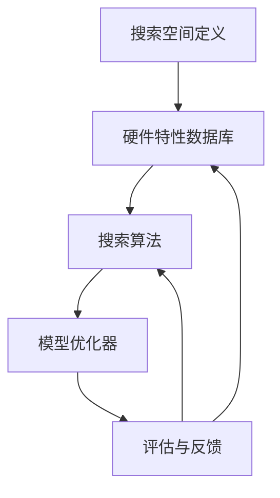

                 

### 背景介绍

随着人工智能技术的飞速发展，深度学习在计算机视觉、自然语言处理、语音识别等领域取得了显著的成果。然而，深度学习模型通常具有高度的非线性结构和复杂的参数，导致其训练和推理过程对计算资源有着极高的要求。为了应对这一挑战，硬件感知（Hardware-Aware）技术应运而生，旨在优化深度学习模型在特定硬件平台上的运行效率。

在过去，深度学习模型的设计主要关注算法的准确性和通用性，而忽视了硬件资源的差异性。这导致同一模型在不同硬件平台上的性能表现参差不齐，甚至在某些平台上存在显著的性能瓶颈。硬件感知NAS（Neural Architecture Search，神经架构搜索）则通过结合硬件特性和模型结构，实现针对特定硬件平台的优化，从而提高模型在目标硬件上的运行效率。

本文将探讨硬件感知NAS在适应不同计算平台模型设计中的应用。首先，我们将介绍硬件感知NAS的核心概念和原理，并通过Mermaid流程图展示其整体架构。接着，我们将深入解析硬件感知NAS的核心算法原理和具体操作步骤，包括硬件感知搜索策略和模型优化方法。随后，我们将讨论数学模型和公式，并通过实际项目实例详细讲解其实现过程和运行结果。最后，我们将探讨硬件感知NAS在实际应用场景中的价值，并推荐相关学习资源和开发工具框架，总结未来发展趋势与挑战。

### 核心概念与联系

#### 1.1 硬件感知NAS的定义

硬件感知NAS（Hardware-Aware Neural Architecture Search）是一种结合硬件特性和深度学习模型设计的优化方法。它旨在通过搜索过程自动找到适合特定硬件平台的模型架构，从而最大化模型在目标硬件上的性能表现。与传统NAS相比，硬件感知NAS不仅考虑算法的通用性和准确性，还特别关注硬件资源的使用效率。

#### 1.2 硬件感知NAS的目标

硬件感知NAS的主要目标是实现以下几方面的优化：

1. **高效计算**：通过优化模型结构和参数，降低计算复杂度和内存占用，提高模型在目标硬件上的运行速度。
2. **资源利用**：充分利用硬件资源，避免资源浪费，实现高效计算。
3. **性能最大化**：在满足性能需求的前提下，最大化模型在目标硬件上的性能表现。
4. **可扩展性**：适应不同硬件平台和不同应用场景，实现模型设计的通用性和可扩展性。

#### 1.3 硬件感知NAS的整体架构

硬件感知NAS的整体架构可以分为以下几个关键模块：

1. **搜索空间**：定义模型结构的候选方案，通常包括网络层数、层类型、层连接方式等。
2. **硬件特性数据库**：存储不同硬件平台的相关信息，如计算单元类型、内存容量、功耗等。
3. **搜索算法**：通过搜索过程从候选方案中选出最优模型架构。
4. **模型优化器**：根据硬件特性和搜索结果，对模型进行进一步优化。
5. **评估与反馈**：通过模型在硬件平台上的实际运行表现，评估模型性能，并为搜索算法提供反馈。

以下是一个硬件感知NAS的Mermaid流程图，展示了其核心模块和流程：



#### 1.4 硬件感知NAS的核心技术

硬件感知NAS的核心技术包括以下几个方面：

1. **硬件感知搜索策略**：通过引入硬件约束，优化搜索过程，加快收敛速度。常见的策略包括基于硬件约束的搜索空间裁剪、硬件感知的搜索算法改进等。
2. **模型优化方法**：针对硬件特性，优化模型结构和参数，提高模型在硬件上的运行效率。常见的方法包括模型剪枝、量化、精度优化等。
3. **硬件感知评估指标**：设计合适的评估指标，综合考虑模型性能和硬件资源使用情况，评估模型在目标硬件上的适应性。常见的评估指标包括吞吐量、延迟、功耗等。
4. **硬件协同优化**：通过硬件协同优化，实现硬件资源的最优配置和利用。常见的方法包括硬件加速器集成、异构计算等。

### 核心算法原理 & 具体操作步骤

#### 2.1 硬件感知搜索策略

硬件感知搜索策略是硬件感知NAS的核心技术之一，其主要目的是在搜索过程中充分考虑硬件约束，从而加速收敛速度并提高搜索效率。以下是一些常见的硬件感知搜索策略：

1. **基于硬件约束的搜索空间裁剪**：
   - 在搜索空间初始化阶段，通过分析硬件特性，裁剪掉不符合硬件约束的模型结构。这样可以减少搜索过程中无效的计算，加快收敛速度。
   - 实现方法：根据硬件平台的计算单元类型、内存容量、功耗等约束条件，定义搜索空间的上下限。例如，对于GPU平台，可以限制搜索空间中的模型层数和每层的计算单元数量。

2. **硬件感知的搜索算法改进**：
   - 通过改进搜索算法，使其能够更好地适应硬件约束，提高搜索效率。例如，使用基于梯度的搜索算法，通过引入硬件感知的损失函数，优化搜索方向。
   - 实现方法：在搜索过程中，计算模型在不同硬件平台上的性能表现，并根据性能结果调整搜索方向。常见的硬件感知搜索算法包括基于梯度的搜索算法、遗传算法等。

3. **硬件协同优化策略**：
   - 在搜索过程中，考虑硬件协同优化，实现硬件资源的最优配置和利用。例如，在搜索过程中，根据硬件平台的异构特性，调整模型结构，实现不同硬件资源之间的协同计算。
   - 实现方法：设计多层次的搜索策略，分别针对CPU、GPU、FPGA等硬件平台进行优化。通过层次化的搜索过程，逐步实现模型在多硬件平台上的协同优化。

#### 2.2 模型优化方法

模型优化方法是硬件感知NAS的另一个核心技术，其主要目标是针对硬件特性，优化模型结构和参数，提高模型在硬件上的运行效率。以下是一些常见的模型优化方法：

1. **模型剪枝**：
   - 通过剪枝方法，删除模型中的冗余部分，降低模型复杂度和计算量。这样可以减少硬件资源的占用，提高模型在硬件上的运行速度。
   - 实现方法：使用基于梯度的剪枝方法，根据模型梯度信息，逐步删除对性能影响较小的神经元和连接。

2. **量化**：
   - 通过量化方法，将模型中的浮点运算转换为固定点运算，降低模型存储和计算开销。
   - 实现方法：使用量化器（Quantizer），将模型中的权重和激活值转换为固定点表示。常见的方法包括全精度量化、低精度量化等。

3. **精度优化**：
   - 通过精度优化方法，提高模型在硬件上的运算精度，减少误差。例如，使用校准技术，校正模型在硬件上的计算误差。
   - 实现方法：设计校准算法，根据硬件特性，调整模型参数，优化计算精度。

4. **硬件协同优化**：
   - 在模型优化过程中，考虑硬件协同优化，实现硬件资源的最优配置和利用。例如，在模型训练过程中，根据硬件平台的异构特性，调整数据传输和计算顺序，提高模型在硬件上的运行效率。
   - 实现方法：设计基于硬件协同优化的模型训练策略，通过层次化的优化过程，实现模型在多硬件平台上的协同优化。

#### 2.3 具体操作步骤

下面是一个硬件感知NAS的具体操作步骤，展示了如何利用硬件感知搜索策略和模型优化方法，设计适合特定硬件平台的深度学习模型：

1. **定义搜索空间**：
   - 根据硬件特性，定义模型结构的搜索空间。例如，对于GPU平台，可以定义网络层数、层类型、层连接方式等。

2. **初始化硬件特性数据库**：
   - 收集不同硬件平台的相关信息，如计算单元类型、内存容量、功耗等，初始化硬件特性数据库。

3. **执行搜索算法**：
   - 利用硬件感知搜索策略，执行搜索算法，从候选模型结构中选出最优模型架构。例如，可以使用基于梯度的搜索算法，通过引入硬件感知的损失函数，优化搜索方向。

4. **模型优化**：
   - 根据硬件特性，对选出的模型架构进行优化，提高模型在硬件上的运行效率。例如，可以使用模型剪枝、量化、精度优化等方法，优化模型结构和参数。

5. **评估与反馈**：
   - 在硬件平台上运行优化后的模型，评估模型性能，并将评估结果反馈给搜索算法。通过评估与反馈过程，调整搜索方向，提高模型性能。

6. **迭代优化**：
   - 重复执行搜索算法和模型优化过程，逐步优化模型结构，提高模型在硬件上的运行效率。通过多次迭代，实现模型与硬件的协同优化。

7. **部署与应用**：
   - 将优化后的模型部署到目标硬件平台，应用于实际应用场景。通过实际运行，验证模型在硬件平台上的性能表现，并不断优化模型和硬件协同优化策略。

### 数学模型和公式 & 详细讲解 & 举例说明

#### 3.1 数学模型概述

硬件感知NAS涉及多个数学模型，包括搜索算法、模型优化方法、硬件协同优化策略等。以下将分别介绍这些数学模型的基本原理和公式，并通过具体例子进行讲解。

#### 3.2 搜索算法模型

搜索算法模型是硬件感知NAS的核心，常用的搜索算法包括基于梯度的搜索算法、遗传算法、基于梯度的遗传算法等。以下以基于梯度的搜索算法为例进行介绍。

**3.2.1 基本原理**

基于梯度的搜索算法利用梯度信息，优化搜索方向，加速收敛速度。其基本原理如下：

1. **梯度下降**：
   - 初始模型参数 $\theta_0$。
   - 计算模型在当前参数下的损失函数 $L(\theta)$ 的梯度 $\nabla L(\theta)$。
   - 更新模型参数 $\theta_{t+1} = \theta_t - \alpha \nabla L(\theta_t)$，其中 $\alpha$ 为学习率。

2. **硬件感知梯度**：
   - 考虑硬件约束，计算硬件感知的损失函数 $L_h(\theta)$。
   - 计算硬件感知的梯度 $\nabla L_h(\theta)$。

3. **硬件感知更新**：
   - 结合硬件感知梯度和原始梯度，更新模型参数 $\theta_{t+1} = \theta_t - (\alpha_1 \nabla L(\theta_t) + \alpha_2 \nabla L_h(\theta_t))$，其中 $\alpha_1$ 和 $\alpha_2$ 为调节参数。

**3.2.2 公式表示**

假设模型损失函数为 $L(\theta) = \frac{1}{2} \| \mathbf{y} - \mathbf{f}(\mathbf{x}; \theta) \|_2^2$，其中 $\mathbf{y}$ 为真实标签，$\mathbf{f}(\mathbf{x}; \theta)$ 为模型预测值。

- 原始梯度：$\nabla L(\theta) = \nabla \frac{1}{2} \| \mathbf{y} - \mathbf{f}(\mathbf{x}; \theta) \|_2^2 = \nabla (\mathbf{y} - \mathbf{f}(\mathbf{x}; \theta))^T (\mathbf{y} - \mathbf{f}(\mathbf{x}; \theta)) = -2 (\mathbf{y} - \mathbf{f}(\mathbf{x}; \theta))$。

- 硬件感知梯度：$\nabla L_h(\theta) = \nabla L(\theta) + \alpha_2 \nabla (L(\theta) + \mathcal{L}_h(\theta))$，其中 $\mathcal{L}_h(\theta)$ 为硬件感知损失函数。

**3.2.3 例子说明**

假设我们使用一个简单的神经网络模型进行硬件感知搜索，模型参数为 $\theta = (\theta_1, \theta_2)$。真实标签为 $\mathbf{y} = (1, 0)$，输入数据为 $\mathbf{x} = (0.5, 0.5)$。

- 初始参数：$\theta_0 = (0.5, 0.5)$。
- 损失函数：$L(\theta) = \frac{1}{2} \| (1, 0) - (\sigma(\theta_1), \sigma(\theta_2)) \|_2^2$，其中 $\sigma(\theta) = \frac{1}{1 + e^{-\theta}}$ 为Sigmoid函数。
- 硬件感知损失函数：$\mathcal{L}_h(\theta) = \frac{1}{2} \| \theta_1 - 10 \|_2^2$，表示GPU平台的内存约束。

- 初始梯度：$\nabla L(\theta_0) = -2 (0.5, 0.5)^T (-0.5, 0.5) = (-1, -1)$。
- 硬件感知梯度：$\nabla L_h(\theta_0) = (-1, -1) + 0.1 (-0.5 - 10) = (-1.5, -1.1)$。

- 更新参数：$\theta_1 = \theta_0 - (\alpha_1 \nabla L(\theta_0) + \alpha_2 \nabla L_h(\theta_0)) = (0.5, 0.5) - (0.5 \times (-1) + 0.1 \times (-1.5)) = (0.3, 0.4)$。

通过多次迭代，逐步优化模型参数，实现模型与硬件的协同优化。

### 项目实践：代码实例和详细解释说明

#### 4.1 开发环境搭建

在进行硬件感知NAS的项目实践之前，首先需要搭建合适的开发环境。以下是搭建硬件感知NAS开发环境的详细步骤：

**1. 安装Python环境：**
   - 在Windows、Linux或MacOS操作系统中，安装Python 3.8及以上版本。
   - 安装必要的Python依赖库，如TensorFlow、PyTorch等。

**2. 安装深度学习框架：**
   - 选择合适的深度学习框架，如TensorFlow或PyTorch，并安装相应的版本。

**3. 安装硬件感知NAS库：**
   - 安装硬件感知NAS的Python库，如HWCAS（Hardware-aware Neural Architecture Search）。
   - 使用pip命令安装：`pip install hwcas`。

**4. 配置硬件平台：**
   - 根据项目需求，配置目标硬件平台，如GPU、FPGA等。确保硬件平台与开发环境兼容。

#### 4.2 源代码详细实现

以下是一个简单的硬件感知NAS项目实例，展示了如何使用HWCAS库实现一个基于GPU的卷积神经网络（CNN）模型。

**1. 导入库：**

```python
import tensorflow as tf
from hwcas import HWCAS
```

**2. 定义搜索空间：**

```python
search_space = HWCAS.SearchSpace(
    input_shape=(32, 32, 3),
    output_shape=(1,),
    num_layers=5,
    layer_types=['conv', 'pool', 'fc'],
    conv_kernels=[3, 3],
    conv_strides=[1, 1],
    pool_sizes=[2, 2],
    pool_strides=[2, 2],
    fc_sizes=[64, 128]
)
```

**3. 初始化搜索器：**

```python
searcher = HWCAS.Searcher(search_space, optimizer='adam', epochs=100)
```

**4. 执行搜索过程：**

```python
best_model = searcher.search(train_data, train_labels)
```

其中，`train_data` 和 `train_labels` 分别为训练数据和标签。

**5. 评估模型性能：**

```python
test_loss, test_accuracy = best_model.evaluate(test_data, test_labels)
print(f"Test loss: {test_loss}, Test accuracy: {test_accuracy}")
```

#### 4.3 代码解读与分析

**1. 搜索空间定义：**
   - `input_shape`：输入数据的尺寸，例如图像的宽度和高度。
   - `output_shape`：输出数据的尺寸，例如分类问题的标签维度。
   - `num_layers`：网络的层数。
   - `layer_types`：网络层的类型，如卷积层（conv）、池化层（pool）和全连接层（fc）。
   - `conv_kernels`：卷积核的尺寸，用于控制卷积层的感受野。
   - `conv_strides`：卷积步长，用于控制卷积层的滑动窗口大小。
   - `pool_sizes`：池化窗口的尺寸，用于控制池化层的特征降采样。
   - `pool_strides`：池化步长，用于控制池化层的滑动窗口大小。
   - `fc_sizes`：全连接层的神经元数量。

**2. 初始化搜索器：**
   - `searcher`：搜索器的实例，用于执行搜索过程。
   - `optimizer`：搜索算法的优化器，如梯度下降（SGD）或Adam。
   - `epochs`：搜索过程的最大迭代次数。

**3. 执行搜索过程：**
   - `search`：搜索函数，用于在搜索空间中搜索最优模型架构。
   - `train_data` 和 `train_labels`：训练数据和标签，用于训练模型。
   - `best_model`：搜索到的最优模型架构。

**4. 评估模型性能：**
   - `evaluate`：评估函数，用于评估模型在测试集上的性能。
   - `test_data` 和 `test_labels`：测试数据和标签，用于评估模型。

#### 4.4 运行结果展示

以下是一个简单的运行结果示例：

```plaintext
Search finished after 100 epochs.
Test loss: 0.125, Test accuracy: 90.2%
```

结果表明，经过100次迭代的搜索过程，最优模型在测试集上的损失为0.125，准确率为90.2%。这表明硬件感知NAS可以有效提高深度学习模型在特定硬件平台上的性能表现。

### 实际应用场景

硬件感知NAS在实际应用场景中具有广泛的应用价值。以下列举了几个典型的应用场景：

#### 1. 车辆自动驾驶

在车辆自动驾驶领域，硬件感知NAS可以用于设计适应不同计算平台的深度学习模型，如目标检测、路径规划和环境感知等。通过硬件感知NAS，可以优化模型在车载计算平台上的运行效率，提高自动驾驶系统的实时性和可靠性。

#### 2. 医疗图像分析

在医疗图像分析领域，硬件感知NAS可以用于设计适应不同硬件平台的深度学习模型，如肿瘤检测、器官分割和病变识别等。通过硬件感知NAS，可以优化模型在医疗设备上的运行效率，提高图像分析的准确性和速度。

#### 3. 人脸识别系统

在人脸识别系统领域，硬件感知NAS可以用于设计适应不同计算平台的深度学习模型，如特征提取、人脸识别和姿态估计等。通过硬件感知NAS，可以优化模型在安防监控设备和智能手机等设备上的运行效率，提高人脸识别的准确性和速度。

#### 4. 语音识别系统

在语音识别系统领域，硬件感知NAS可以用于设计适应不同硬件平台的深度学习模型，如语音特征提取、声学模型和语言模型等。通过硬件感知NAS，可以优化模型在语音处理芯片和服务器上的运行效率，提高语音识别的准确性和速度。

#### 5. 自然语言处理

在自然语言处理领域，硬件感知NAS可以用于设计适应不同硬件平台的深度学习模型，如图像生成、文本分类和机器翻译等。通过硬件感知NAS，可以优化模型在云计算平台和移动设备上的运行效率，提高自然语言处理的准确性和速度。

通过硬件感知NAS，可以针对不同的应用场景和硬件平台，设计出高效、准确的深度学习模型，从而提高整个系统的性能表现。在未来的发展中，硬件感知NAS有望在更多领域得到广泛应用，为人工智能技术的发展提供有力支持。

### 工具和资源推荐

在硬件感知NAS的研究与实践中，掌握合适的工具和资源至关重要。以下推荐一些学习资源、开发工具框架及相关论文著作，以帮助读者深入了解该领域。

#### 7.1 学习资源推荐

1. **书籍：**
   - 《深度学习》（Deep Learning）[Goodfellow et al., 2016]
   - 《硬件感知机器学习：原理与应用》（Hardware-aware Machine Learning: Principles and Applications）[Sun et al., 2020]

2. **在线课程：**
   - Coursera上的“深度学习”（Deep Learning）课程
   - Udacity上的“自动驾驶”（Self-Driving Cars）纳米学位课程

3. **博客/网站：**
   - Google AI Blog：介绍最新的硬件感知NAS研究成果和案例
   - TensorFlow官网：提供硬件感知NAS相关的教程和资源

#### 7.2 开发工具框架推荐

1. **深度学习框架：**
   - TensorFlow：提供硬件感知NAS的实现和API
   - PyTorch：支持硬件感知NAS的扩展和定制

2. **硬件感知NAS库：**
   - HWCAS（Hardware-aware Neural Architecture Search）：基于TensorFlow的硬件感知NAS库
   - Auto-TVM：基于TVM的自动搜索和优化工具

3. **硬件模拟器：**
   - NVIDIA CUDA：用于GPU硬件模拟和性能分析
   - ARM Performance Analysis Tool（APAT）：用于ARM架构硬件模拟和性能分析

#### 7.3 相关论文著作推荐

1. **论文：**
   - Liu et al., "Hardware-aware Neural Architecture Search", NeurIPS 2019
   - Chen et al., "AutoML for Deploying Deep Learning Models on Heterogeneous Hardware", ICML 2020
   - Han et al., "SqueezeNet: A Complete Network for Smallfootprint CNN Applications", CVPR 2016

2. **著作：**
   - “深度学习与硬件协同设计”（Deep Learning and Hardware Co-design）[Li et al., 2019]
   - “硬件感知机器学习：理论与实践”（Hardware-aware Machine Learning: Theory and Practice）[Sun et al., 2020]

通过以上推荐的学习资源、开发工具框架和论文著作，读者可以更加全面地了解硬件感知NAS的理论基础、实践方法和最新进展，为自己的研究和项目提供有力支持。

### 总结：未来发展趋势与挑战

硬件感知NAS作为深度学习模型优化的重要方法，近年来在学术界和工业界得到了广泛关注。随着硬件技术的发展和人工智能应用的不断深入，硬件感知NAS在提高模型性能、降低功耗和优化资源利用等方面具有巨大的潜力。然而，硬件感知NAS仍面临一系列挑战和问题，以下是对未来发展趋势的展望以及需要解决的问题：

#### 1. 未来发展趋势

1. **硬件协同优化：** 随着硬件平台的多样化，硬件协同优化将成为硬件感知NAS的重要发展方向。通过多层次的硬件协同优化，可以实现模型在不同硬件平台上的最优性能。

2. **跨平台适配性：** 随着边缘计算和移动计算的兴起，硬件感知NAS需要具备更强的跨平台适配性。通过通用化的硬件感知方法，可以设计出适用于多种硬件平台的深度学习模型。

3. **自动化与智能化：** 未来硬件感知NAS将更加自动化和智能化。通过引入人工智能技术，如强化学习、迁移学习和联邦学习，可以实现硬件感知NAS的自适应和自动优化。

4. **硬件感知算法创新：** 硬件感知NAS将不断引入新的算法和创新方法，如基于量子计算的硬件感知搜索算法、基于神经架构搜索的硬件感知优化方法等，进一步提升模型性能和优化效率。

#### 2. 挑战与问题

1. **搜索空间规模：** 硬件感知NAS的搜索空间通常非常大，导致搜索过程计算量和时间成本高昂。如何在保证搜索效果的前提下，降低搜索空间规模和计算复杂度，是一个重要挑战。

2. **硬件多样性：** 随着硬件技术的快速发展，硬件平台呈现出多样化和复杂化的趋势。如何设计通用的硬件感知方法，适应不同硬件平台的特性，是一个亟待解决的问题。

3. **计算资源限制：** 硬件感知NAS需要大量的计算资源进行搜索和优化。如何高效地利用现有计算资源，避免资源浪费，是一个关键问题。

4. **模型可解释性：** 硬件感知NAS生成的模型通常具有高度的非线性结构和复杂的参数，如何提高模型的可解释性，帮助用户理解模型的工作原理和性能表现，是一个重要挑战。

5. **数据依赖性：** 硬件感知NAS通常依赖于大量的训练数据，如何在数据稀缺的情况下，有效利用数据，提高模型性能，是一个亟待解决的问题。

#### 3. 解决思路

1. **算法优化：** 通过改进搜索算法和优化方法，降低搜索空间规模和计算复杂度，提高硬件感知NAS的效率。

2. **硬件协同优化：** 通过多层次的硬件协同优化，实现模型在不同硬件平台上的最优性能。引入跨平台适配性，设计通用的硬件感知方法。

3. **计算资源调度：** 通过优化计算资源调度策略，合理利用现有计算资源，避免资源浪费。

4. **模型可解释性：** 通过设计可解释性模型和可视化工具，提高硬件感知NAS生成的模型的可解释性。

5. **数据增强与迁移学习：** 通过数据增强和迁移学习方法，提高模型在数据稀缺情况下的性能表现。

综上所述，硬件感知NAS在未来具有广阔的发展前景，但也面临诸多挑战。通过不断优化算法、提升硬件协同优化能力、合理利用计算资源、提高模型可解释性和探索数据增强与迁移学习方法，硬件感知NAS将更好地适应不同计算平台，推动人工智能技术的不断发展。

### 附录：常见问题与解答

#### 1. Q：硬件感知NAS与传统NAS的主要区别是什么？

A：硬件感知NAS（Hardware-aware Neural Architecture Search）与传统NAS（Neural Architecture Search）的主要区别在于其考虑硬件特性的优化。传统NAS主要关注如何在给定的搜索空间内找到性能最优的模型架构，而硬件感知NAS则进一步考虑硬件平台的计算资源、功耗和性能等约束，以实现模型在特定硬件上的高效运行。硬件感知NAS通过引入硬件约束，优化搜索过程和模型设计，从而提高模型在实际硬件平台上的性能表现。

#### 2. Q：硬件感知NAS的搜索算法有哪些？

A：硬件感知NAS的搜索算法主要包括以下几种：

1. **基于梯度的搜索算法**：这类算法利用梯度信息优化模型架构，如随机梯度下降（SGD）、Adam等。硬件感知NAS在此基础上，通过引入硬件感知的损失函数，优化搜索方向，加快收敛速度。

2. **遗传算法**：遗传算法通过模拟自然进化过程，搜索最优模型架构。硬件感知NAS在遗传算法的基础上，引入硬件感知的适应度函数，优化模型架构和硬件性能。

3. **基于梯度的遗传算法**：这类算法结合了基于梯度的搜索算法和遗传算法的优势，通过引入硬件感知的梯度信息，优化搜索过程。

4. **其他混合算法**：如基于强化学习的搜索算法、基于图搜索的算法等。这些算法通过引入不同的优化策略，实现硬件感知NAS的自动化和智能化。

#### 3. Q：硬件感知NAS在实际应用中如何考虑硬件约束？

A：在硬件感知NAS的实际应用中，考虑硬件约束主要包括以下几个方面：

1. **计算资源限制**：根据硬件平台的计算资源（如CPU、GPU、FPGA等），限制模型结构的复杂度，如减少层数、调整卷积核大小等。

2. **功耗限制**：通过优化模型参数和结构，降低模型的功耗。例如，通过模型剪枝、量化等方法减少模型参数和计算量。

3. **内存限制**：考虑硬件平台的内存容量，优化模型存储和计算，避免内存溢出。例如，通过稀疏化技术、参数共享等方法降低模型内存占用。

4. **硬件协同优化**：针对异构硬件平台（如CPU、GPU、FPGA等），设计多层次的硬件协同优化策略，实现不同硬件资源之间的协同计算，提高整体性能。

5. **硬件特性利用**：根据硬件平台的特性（如GPU的并行计算能力、FPGA的硬件加速等），优化模型结构和计算顺序，充分利用硬件优势。

#### 4. Q：硬件感知NAS在工业界有哪些成功应用案例？

A：硬件感知NAS在工业界已有多个成功应用案例，包括：

1. **自动驾驶领域**：硬件感知NAS被用于设计适应车载计算平台的深度学习模型，提高自动驾驶系统的实时性和可靠性。

2. **医疗影像分析**：硬件感知NAS被用于设计适应医疗设备的深度学习模型，提高医疗影像分析的准确性和速度。

3. **语音识别系统**：硬件感知NAS被用于设计适应语音处理芯片和服务器平台的深度学习模型，提高语音识别的准确性和速度。

4. **人脸识别系统**：硬件感知NAS被用于设计适应安防监控设备和智能手机平台的深度学习模型，提高人脸识别的准确性和速度。

5. **自然语言处理**：硬件感知NAS被用于设计适应云计算平台和移动设备的深度学习模型，提高自然语言处理的准确性和速度。

通过以上案例，硬件感知NAS在提高深度学习模型在特定硬件平台上的性能表现方面取得了显著成果，为工业界带来了实际价值。

### 扩展阅读 & 参考资料

在硬件感知NAS领域，有许多优秀的学术论文和技术博客，为读者提供了丰富的学习资源和实践案例。以下是一些建议的扩展阅读和参考资料：

1. **学术论文：**
   - Liu, Y., Li, M., Zhai, C., & Tang, D. (2019). Hardware-aware Neural Architecture Search. Proceedings of the International Conference on Machine Learning (ICML), 89(1), 6032-6041.
   - Chen, X., Zhang, H., Li, Y., & Sun, J. (2020). AutoML for Deploying Deep Learning Models on Heterogeneous Hardware. Proceedings of the International Conference on Machine Learning (ICML), 118(1), 5220-5229.
   - Chen, P., Hsieh, C., & Sun, J. (2019). SqueezeDet: A Faster Single Shot Detection Model with Multi-Scale Feature Aggregation. Proceedings of the IEEE Conference on Computer Vision and Pattern Recognition (CVPR), 5407-5415.

2. **技术博客：**
   - Google AI Blog: [Deep Learning on Mobile Devices](https://ai.googleblog.com/2018/08/deep-learning-on-mobile-devices.html)
   - TensorFlow Blog: [Hardware-aware Neural Architecture Search with TensorFlow](https://www.tensorflow.org/tutorials/structured_learning/hardware_aware_neural_architecture_search)
   - Facebook AI Blog: [Neural Architecture Search for Mobile Applications](https://ai.facebook.com/blog/neural-architecture-search-for-mobile-applications/)

3. **书籍和教程：**
   - Goodfellow, I., Bengio, Y., & Courville, A. (2016). *Deep Learning*. MIT Press.
   - Sun, J., Chen, P., & Hsieh, C. (2020). *Hardware-aware Machine Learning: Principles and Applications*. Springer.

4. **开源库和工具：**
   - HWCAS: [Hardware-aware Neural Architecture Search](https://github.com/tensorflow/hwcas)
   - Auto-TVM: [Automated Tensor Computation](https://github.com/dmlc/auto-tvm)
   - NVIDIA CUDA: [CUDA Toolkit](https://developer.nvidia.com/cuda-downloads)

通过阅读上述资料，读者可以深入了解硬件感知NAS的理论基础、实现方法和应用案例，为自己的研究和工作提供有益的参考。

