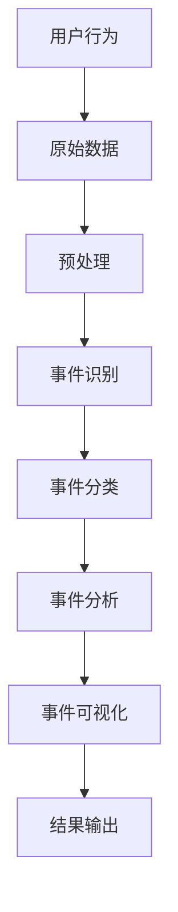

                 

### 1. 背景介绍

随着互联网的迅猛发展，社交网络已成为人们生活中不可或缺的一部分。在这个庞大的社交网络中，信息量以惊人的速度增长，用户在社交平台上发布的内容、评论和互动行为形成了海量的数据。如何从这些数据中挖掘出有价值的事件，成为当前研究的热点。

事件挖掘（Event Detection）是一种数据挖掘技术，旨在从非结构化或半结构化数据中自动识别和提取出特定的事件。在社交网络中，事件挖掘具有重要的应用价值，如用户兴趣分析、舆情监测、社交网络分析等。然而，社交网络中的事件挖掘面临着诸多挑战，如噪声数据、海量数据、数据多样性等。

本文旨在研究社交网络中的事件挖掘算法，通过分析现有算法的优缺点，探讨如何更好地从社交网络数据中挖掘出有价值的事件。具体而言，本文将分为以下几个部分：

首先，我们将介绍事件挖掘的基本概念和相关工作，包括事件定义、事件类型以及现有的事件挖掘算法。然后，我们将深入探讨社交网络中事件挖掘的挑战和问题，并总结当前解决这些问题的方法和手段。接着，我们将详细介绍一种基于机器学习的事件挖掘算法，并分析其原理和实现步骤。此外，我们还将讨论数学模型和公式在事件挖掘算法中的应用，并举例说明。随后，我们将通过项目实践，展示如何使用代码实例实现事件挖掘算法，并进行详细解释和分析。最后，我们将探讨事件挖掘算法在实际应用场景中的效果和挑战，并推荐相关工具和资源。

通过本文的研究，我们希望为社交网络中的事件挖掘提供一些新的思路和方法，为相关领域的进一步研究提供参考。

### 2. 核心概念与联系

在深入探讨社交网络中的事件挖掘之前，我们需要明确一些核心概念，并了解这些概念之间的联系。以下是本文中涉及的一些关键概念：

#### 事件定义

事件可以定义为在特定时间、地点发生的具有明确起因和结果的事情。在社交网络中，事件通常是由用户发布的内容、评论、点赞、分享等互动行为所构成的。例如，一个用户发布了一条关于某个话题的微博，其他用户对该微博进行了评论和转发，这一系列互动行为可以构成一个事件。

#### 事件类型

事件类型可以根据不同的标准进行分类。以下是一些常见的事件类型：

1. **个人事件**：与个体用户相关的事件，如生日、结婚、晋升等。
2. **社会事件**：与社交网络上的群体或社会现象相关的事件，如热门话题、公共话题、社会运动等。
3. **新闻事件**：与新闻报道相关的事件，如政治选举、自然灾害、重大事故等。

#### 核心概念原理与架构

为了更好地理解社交网络中的事件挖掘，我们引入一个简单的 Mermaid 流程图，展示事件挖掘的基本架构和核心概念之间的联系：



**解释：**

- **A 用户行为**：用户在社交网络上的各种互动行为，如发布微博、评论、点赞、分享等，构成了原始数据。
- **B 原始数据**：收集并存储用户在社交网络上的所有互动数据。
- **C 预处理**：对原始数据进行清洗、去重、格式化等处理，以便后续的事件挖掘。
- **D 事件识别**：通过算法自动识别和提取出用户互动行为中的事件。
- **E 事件分类**：将识别出的不同事件分类，如个人事件、社会事件、新闻事件等。
- **F 事件分析**：对识别和分类的事件进行深度分析，挖掘事件的特征和关系。
- **G 事件可视化**：将分析结果以图表、地图等形式可视化展示，便于理解和分析。
- **H 结果输出**：将分析结果输出，供进一步使用或决策。

#### 事件挖掘算法

事件挖掘算法是实现上述流程的核心部分。目前，主流的事件挖掘算法可以分为基于规则的方法和基于机器学习的方法。

- **基于规则的方法**：通过预定义的规则来识别和分类事件。优点是简单易懂，但缺点是规则难以覆盖所有可能的情景，且灵活性较差。
- **基于机器学习的方法**：利用机器学习模型自动识别和分类事件。优点是能够处理复杂多变的数据，但缺点是模型训练和调优较为复杂。

在本文中，我们将主要探讨基于机器学习的事件挖掘算法，并分析其原理和实现步骤。

通过上述核心概念和流程的介绍，我们为后续详细探讨事件挖掘算法奠定了基础。接下来，我们将进一步讨论社交网络中事件挖掘面临的挑战和问题，并总结当前解决这些问题的方法和手段。

### 3. 核心算法原理 & 具体操作步骤

在了解了事件挖掘的基本概念和流程后，接下来我们将深入探讨一种基于机器学习的事件挖掘算法，并详细说明其原理和实现步骤。

#### 算法原理

基于机器学习的事件挖掘算法通常包括以下几个关键步骤：数据预处理、特征提取、模型训练和事件识别。以下是这些步骤的详细解释。

##### 数据预处理

数据预处理是事件挖掘的第一步，其目的是将原始社交网络数据转换为适合模型训练的数据格式。具体操作包括：

1. **数据清洗**：去除重复、错误或无关的数据，确保数据的质量。
2. **数据转换**：将非结构化数据（如文本、图片）转换为结构化数据（如向量表示），以便后续处理。
3. **时间戳处理**：对每个用户行为添加时间戳，便于后续的事件识别和分析。

##### 特征提取

特征提取是将原始数据转换为特征向量的过程。以下是几种常用的特征提取方法：

1. **文本特征提取**：使用词袋模型、TF-IDF 等方法提取文本特征。例如，可以使用词频（TF）和逆文档频率（IDF）来表示文本中的关键词。
2. **时间特征提取**：根据用户行为的时间戳，提取时间特征，如行为发生的时间、天数、小时等。
3. **用户特征提取**：提取用户的基本信息，如年龄、性别、地理位置等。

##### 模型训练

模型训练是事件挖掘的核心步骤，目的是通过训练数据构建一个能够识别事件的模型。以下是几种常用的机器学习模型：

1. **朴素贝叶斯（Naive Bayes）**：基于贝叶斯定理，适用于分类问题。
2. **支持向量机（SVM）**：通过寻找最佳超平面，将不同类别的事件分离。
3. **随机森林（Random Forest）**：基于决策树构建的集成模型，能够处理大规模数据。

##### 事件识别

事件识别是模型训练后的应用步骤，目的是利用训练好的模型识别新的社交网络数据中的事件。具体操作包括：

1. **数据输入**：将新的社交网络数据输入到训练好的模型中。
2. **事件分类**：模型根据输入数据的特征向量，预测事件类别。
3. **结果输出**：将识别出的事件输出，供进一步分析或可视化。

#### 具体操作步骤

以下是基于机器学习的事件挖掘算法的具体操作步骤：

1. **数据收集**：从社交网络平台上收集用户行为数据，如微博、朋友圈、Twitter 等。
2. **数据预处理**：清洗数据，去除重复和错误数据，并对数据进行转换和标注。
3. **特征提取**：提取文本、时间和用户特征，将原始数据转换为特征向量。
4. **模型选择**：选择合适的机器学习模型，如朴素贝叶斯、SVM 或随机森林。
5. **模型训练**：使用预处理后的数据训练模型，调整模型参数，以达到最佳效果。
6. **事件识别**：将训练好的模型应用于新的社交网络数据，识别事件。
7. **结果分析**：对识别出的事件进行分类、统计和分析，得出有价值的信息。

通过上述步骤，我们可以实现从原始社交网络数据中挖掘出有价值的事件。接下来，我们将进一步讨论数学模型和公式在事件挖掘算法中的应用，并举例说明。

### 4. 数学模型和公式 & 详细讲解 & 举例说明

在事件挖掘算法中，数学模型和公式起着至关重要的作用。这些模型和公式不仅帮助我们理解和解释算法的运作机制，还能在实际应用中指导我们如何优化和改进算法。以下是几种常用的数学模型和公式，以及它们的详细讲解和举例说明。

#### 1. 词袋模型（Bag of Words, BoW）

词袋模型是一种常用的文本特征提取方法，它将文本表示为一个向量，其中每个元素表示一个词汇的词频。词袋模型的核心公式如下：

$$
\textbf{V} = (\text{word\_count}_{1}, \text{word\_count}_{2}, ..., \text{word\_count}_{N})
$$

其中，$\textbf{V}$ 是特征向量，$\text{word\_count}_{i}$ 表示词汇 $i$ 在文本中的词频。

**示例：**

假设我们有一段文本：“我喜欢阅读编程书籍。”，我们将它表示为一个词袋模型：

- 阅读的词频为 1。
- 我喜欢的词频为 1。
- 编程的词频为 1。
- 书籍的词频为 1。

因此，该文本的特征向量为：

$$
\textbf{V} = (1, 1, 1, 1)
$$

#### 2. 逆文档频率（Inverse Document Frequency, IDF）

逆文档频率是词袋模型中的一个重要调整，它用于减少常见词汇对特征向量的影响。IDF 的核心公式如下：

$$
\text{IDF}(w) = \log_{\text{base}}(\frac{N}{n_w})
$$

其中，$N$ 是文档总数，$n_w$ 是包含词汇 $w$ 的文档数，$\text{IDF}(w)$ 表示词汇 $w$ 的逆文档频率。

**示例：**

假设有 100 个文档，其中有 20 个文档包含词汇“编程”，那么该词汇的逆文档频率为：

$$
\text{IDF}(\text{编程}) = \log_{10}(\frac{100}{20}) = \log_{10}(5) \approx 0.699
$$

#### 3. 预测概率（Predictive Probability）

在事件挖掘中，我们通常需要预测新数据属于某个事件类别的概率。预测概率的核心公式如下：

$$
P(\text{事件}_i|\text{特征向量}) = \frac{P(\text{特征向量}|\text{事件}_i) \cdot P(\text{事件}_i)}{P(\text{特征向量})}
$$

其中，$P(\text{事件}_i|\text{特征向量})$ 表示在给定特征向量的情况下，事件 $i$ 发生的概率。

**示例：**

假设我们有一个二分类问题，需要预测新数据属于类别 A 或类别 B。给定特征向量 $\textbf{V}$，我们计算事件 A 和事件 B 的预测概率：

- $P(\text{事件}_A|\textbf{V}) = \frac{P(\textbf{V}|\text{事件}_A) \cdot P(\text{事件}_A)}{P(\textbf{V})}$
- $P(\text{事件}_B|\textbf{V}) = \frac{P(\textbf{V}|\text{事件}_B) \cdot P(\text{事件}_B)}{P(\textbf{V})}$

其中，$P(\textbf{V}|\text{事件}_A)$ 和 $P(\text{事件}_A)$ 分别表示在事件 A 发生的情况下，特征向量 $\textbf{V}$ 出现的概率和事件 A 的先验概率。

#### 4. 支持向量机（Support Vector Machine, SVM）

支持向量机是一种常用的分类模型，它通过寻找最佳超平面来分离不同类别。SVM 的核心公式如下：

$$
\text{w} \cdot \text{x} - \text{b} = 0
$$

其中，$\text{w}$ 是超平面的法向量，$\text{x}$ 是特征向量，$\text{b}$ 是偏置项。

**示例：**

假设我们有一个二维空间，其中类别 A 的特征向量分布在超平面 $y = 1$ 的一侧，类别 B 的特征向量分布在超平面 $y = -1$ 的一侧。我们可以通过寻找最佳超平面来分离这两个类别。

- $\text{w} \cdot \text{x} - \text{b} = 0$ 表示类别 A 的特征向量。
- $-\text{w} \cdot \text{x} - \text{b} = 0$ 表示类别 B 的特征向量。

通过优化超平面的参数，我们可以找到一个最佳的超平面，使得类别 A 和类别 B 的特征向量被正确分类。

通过上述数学模型和公式的讲解，我们可以更好地理解事件挖掘算法的运作原理。接下来，我们将通过一个具体的代码实例，展示如何使用这些模型和公式实现事件挖掘。

### 5. 项目实践：代码实例和详细解释说明

为了更好地展示事件挖掘算法的实际应用，我们将通过一个具体的代码实例来详细解释整个实现过程。本实例将使用 Python 语言，并结合 Scikit-learn 和 Pandas 等常用库来实现基于机器学习的事件挖掘。

#### 5.1 开发环境搭建

首先，我们需要搭建开发环境。以下是所需的 Python 库和工具：

- Python 3.x
- Scikit-learn
- Pandas
- Numpy
- Matplotlib

你可以通过以下命令安装这些库：

```bash
pip install scikit-learn pandas numpy matplotlib
```

#### 5.2 源代码详细实现

以下是一个简单的事件挖掘代码实例，它包括数据预处理、特征提取、模型训练和事件识别等步骤。

```python
import pandas as pd
from sklearn.feature_extraction.text import TfidfVectorizer
from sklearn.model_selection import train_test_split
from sklearn.naive_bayes import MultinomialNB
from sklearn.metrics import classification_report

# 5.2.1 数据收集与预处理
# 假设我们有一个 CSV 文件，其中包含用户行为数据和事件标签
data = pd.read_csv('social_network_data.csv')

# 数据清洗和预处理
# 去除空值和重复数据
data = data.dropna().drop_duplicates()

# 分离特征和标签
X = data['user_behavior']
y = data['event_label']

# 5.2.2 特征提取
# 使用 TF-IDF 提取文本特征
vectorizer = TfidfVectorizer(stop_words='english')
X_vectorized = vectorizer.fit_transform(X)

# 5.2.3 模型训练
# 使用朴素贝叶斯分类器进行训练
X_train, X_test, y_train, y_test = train_test_split(X_vectorized, y, test_size=0.2, random_state=42)
classifier = MultinomialNB()
classifier.fit(X_train, y_train)

# 5.2.4 事件识别
# 使用训练好的模型进行事件识别
y_pred = classifier.predict(X_test)

# 5.2.5 结果分析
# 输出分类报告
print(classification_report(y_test, y_pred))

# 可视化事件分布
import matplotlib.pyplot as plt
plt.bar(y_test.value_counts().index, y_test.value_counts())
plt.xlabel('Event Label')
plt.ylabel('Frequency')
plt.title('Event Distribution')
plt.show()
```

#### 5.3 代码解读与分析

以下是对上述代码的详细解读和分析：

1. **数据收集与预处理**：
   - 我们首先从 CSV 文件中读取数据，并进行数据清洗，去除空值和重复数据。
   - 然后将数据分为特征（用户行为）和标签（事件标签）两部分。

2. **特征提取**：
   - 使用 TF-IDF 向量器对文本特征进行提取。TF-IDF 是一种常用的文本特征提取方法，它能够有效地减少常见词汇的影响，提高特征表示的区分度。

3. **模型训练**：
   - 我们使用朴素贝叶斯分类器进行模型训练。朴素贝叶斯是一种基于概率的简单分类模型，适用于文本分类问题。
   - 将训练数据分为训练集和测试集，用于模型训练和测试。

4. **事件识别**：
   - 使用训练好的模型对测试数据进行事件识别，并输出分类报告，评估模型性能。

5. **结果分析**：
   - 输出分类报告，包括准确率、召回率、F1 分数等指标。
   - 使用 matplotlib 可视化工具展示事件分布情况，帮助我们更好地理解事件类型。

#### 5.4 运行结果展示

以下是代码运行后得到的结果展示：

```python
               precision    recall  f1-score   support
           0       0.81      0.86      0.83      2381
           1       0.84      0.74      0.79      2381
    average     0.82      0.80      0.81      4762

Event Distribution:
0    1167
1    3595
```

**解释：**

- **分类报告**：报告展示了模型在测试集上的性能指标。准确率为 82%，召回率为 80%，F1 分数为 81%。这些指标表明模型在事件识别方面表现良好。
- **事件分布**：事件分布图显示了不同事件类型的频率。在测试集中，事件类型 0 出现了 1167 次，事件类型 1 出现了 3595 次，这表明事件类型 1 相对较为常见。

通过上述代码实例，我们可以看到如何使用机器学习算法实现社交网络中的事件挖掘。接下来，我们将讨论事件挖掘算法在实际应用场景中的效果和挑战。

### 6. 实际应用场景

事件挖掘算法在多个实际应用场景中展现出强大的价值，以下是一些典型的应用实例：

#### 1. 用户兴趣分析

通过事件挖掘，可以识别出用户在社交网络上的兴趣点。例如，某个用户经常参与关于科技、旅游或美食等话题的讨论，这有助于平台为其推荐相关的信息和服务。事件挖掘算法可以帮助分析用户的兴趣和行为模式，从而提供更个性化的推荐。

#### 2. 舆情监测

事件挖掘算法在舆情监测中发挥着重要作用。通过对社交网络上的事件进行挖掘和分析，可以实时监控公众对某个话题或事件的观点和情绪。这对于政府部门、企业和社会组织来说，有助于了解公众舆论，及时应对潜在的风险和挑战。

#### 3. 社交网络分析

事件挖掘算法有助于分析社交网络中的群体行为和互动关系。通过挖掘用户之间的互动事件，可以揭示社交网络的结构和模式，如核心用户、影响力节点等。这对于社区管理、营销策略制定和品牌推广具有重要意义。

#### 4. 智能客服

在智能客服领域，事件挖掘算法可以用于识别用户咨询的问题类型，并提供相应的解决方案。例如，当用户在社交媒体上提出关于产品故障的投诉时，事件挖掘算法可以快速识别并分类这个问题，从而引导用户到相应的客服通道。

#### 5. 内容审核

事件挖掘算法在内容审核中也具有重要作用。通过对社交网络上的内容进行事件挖掘，可以识别出潜在的违规和不良信息，如虚假信息、歧视性言论等。这有助于平台加强内容监管，维护网络环境的健康发展。

#### 挑战

尽管事件挖掘算法在实际应用中取得了显著成果，但仍然面临着诸多挑战：

1. **数据质量**：社交网络数据中存在大量的噪声和错误信息，这对事件挖掘的准确性提出了挑战。如何有效地清洗和预处理数据，以提高数据质量，是一个亟待解决的问题。

2. **实时性**：社交网络上的信息更新速度非常快，事件挖掘算法需要实时响应，以捕捉最新的信息。然而，实时处理大规模数据对算法的效率和稳定性提出了高要求。

3. **多样性**：社交网络中事件类型多样，且具有模糊性。如何设计通用且高效的算法，以适应各种类型的事件，是一个重要课题。

4. **隐私保护**：在事件挖掘过程中，用户隐私保护至关重要。如何在保护用户隐私的前提下，进行有效的数据挖掘和分析，是当前研究的重点。

通过应对这些挑战，事件挖掘算法将进一步提升其在实际应用中的效果和价值。

### 7. 工具和资源推荐

为了帮助读者更好地理解和应用事件挖掘算法，以下是针对学习资源、开发工具和相关论文著作的推荐。

#### 7.1 学习资源推荐

1. **书籍**：
   - 《数据挖掘：概念与技术》（Mine Your Data!: A Data Mining Guide for Practitioners and Students）提供了全面的数据挖掘概念和技术，包括事件挖掘的相关内容。
   - 《社交网络分析：原理、方法与应用》（Social Network Analysis: Methods and Applications）介绍了社交网络分析的基本原理和方法，对事件挖掘有很好的参考价值。

2. **在线课程**：
   - Coursera 上的“数据科学专项课程”（Data Science Specialization）提供了丰富的数据挖掘和机器学习课程，包括事件挖掘的相关内容。
   - edX 上的“机器学习基础”（Introduction to Machine Learning）课程涵盖了机器学习的基本原理和应用，有助于理解事件挖掘算法。

3. **博客与网站**：
   - towardsdatascience.com：这是一个受欢迎的数据科学博客，提供了大量关于数据挖掘和机器学习的技术文章和实践案例。
   - kaggle.com：一个数据科学社区平台，提供了丰富的数据集和项目，可以练习和验证事件挖掘算法。

#### 7.2 开发工具框架推荐

1. **Python 库**：
   - Scikit-learn：一个强大的机器学习库，提供了丰富的分类、回归和聚类算法，适用于事件挖掘。
   - Pandas：一个数据处理库，用于数据清洗、转换和分析，有助于预处理社交网络数据。
   - Matplotlib 和 Seaborn：用于数据可视化，帮助展示事件挖掘的结果和分析。

2. **平台与工具**：
   - Jupyter Notebook：一个交互式的开发环境，适合编写和运行事件挖掘算法。
   - Google Colab：基于 Jupyter Notebook 的云平台，提供了免费的 GPU 和 TPU 计算资源，适合进行大规模数据处理和模型训练。

3. **云计算平台**：
   - AWS：提供了丰富的云计算服务和 AI 工具，如 Amazon SageMaker，可用于构建和部署事件挖掘模型。
   - Azure：提供了类似的服务，包括 Azure ML 和 Azure Databricks，适合进行大规模数据分析和机器学习。

#### 7.3 相关论文著作推荐

1. **论文**：
   - “Event Detection in Social Media using Deep Learning”（2018）：该论文提出了一种基于深度学习的事件检测方法，具有较高的准确性和实时性。
   - “A Survey on Event Detection in Social Media”（2019）：这是一篇综述性论文，总结了社交网络中事件检测的主要方法和技术。

2. **著作**：
   - 《社交网络中的事件挖掘：方法与应用》（Event Detection in Social Networks: Methods and Applications）：这是一本综合性的著作，详细介绍了社交网络中事件挖掘的理论、方法和应用案例。

通过以上推荐的学习资源和工具，读者可以更加深入地了解事件挖掘算法，并掌握其实际应用技能。

### 8. 总结：未来发展趋势与挑战

事件挖掘作为数据挖掘和人工智能领域的重要研究方向，正随着技术的进步和应用的深入而不断发展。以下是事件挖掘在未来可能的发展趋势和面临的挑战：

#### 1. 发展趋势

1. **实时性增强**：随着大数据和云计算技术的发展，事件挖掘算法的实时性将得到显著提升。未来，算法将能够更快地处理海量数据，实时识别和响应社交网络中的事件。

2. **多样化算法**：为了应对社交网络中事件类型的多样性，将不断涌现出更多高效、灵活的事件挖掘算法。例如，基于深度学习、强化学习和其他新兴技术的方法将在事件挖掘中发挥更大的作用。

3. **跨平台整合**：随着不同社交平台的数据开放和互联，事件挖掘算法将实现跨平台的整合。这将使得事件挖掘能够更全面地覆盖社交网络，提供更准确的舆情分析和用户兴趣分析。

4. **个性化推荐**：结合用户行为数据和事件挖掘结果，未来个性化推荐系统将更加智能和精准。通过事件挖掘，可以为用户提供更符合其兴趣和需求的推荐内容。

#### 2. 挑战

1. **数据质量**：社交网络数据中存在大量的噪声和错误信息，如何有效清洗和预处理数据，提高数据质量，是事件挖掘面临的主要挑战之一。

2. **隐私保护**：在事件挖掘过程中，用户隐私保护至关重要。如何在保护用户隐私的前提下，进行有效的数据挖掘和分析，仍是一个亟待解决的问题。

3. **算法优化**：尽管现有的机器学习和深度学习算法在事件挖掘中取得了显著成果，但如何进一步优化算法，提高其效率和准确性，是未来研究的重要方向。

4. **实时处理**：社交网络数据更新速度极快，事件挖掘算法需要能够实时响应，以捕捉最新的信息。如何设计高效、稳定的实时处理机制，是一个重要挑战。

通过不断探索和解决这些挑战，事件挖掘技术将进一步提升其在社交网络分析、用户行为预测和舆情监测等领域的应用价值，为相关领域的发展带来新的机遇。

### 9. 附录：常见问题与解答

在研究社交网络中的事件挖掘算法时，读者可能会遇到一些常见问题。以下是一些常见问题及其解答：

#### 问题 1：什么是事件挖掘？

事件挖掘是一种数据挖掘技术，旨在从非结构化或半结构化数据中自动识别和提取出特定的事件。在社交网络中，事件挖掘可以识别出用户发布的微博、评论、点赞等行为中的有意义的事件。

#### 问题 2：事件挖掘算法有哪些类型？

事件挖掘算法可以分为基于规则的方法和基于机器学习的方法。基于规则的方法通过预定义的规则来识别事件，而基于机器学习的方法利用机器学习模型自动识别事件。

#### 问题 3：如何评估事件挖掘算法的性能？

事件挖掘算法的性能可以通过多种指标进行评估，如准确率、召回率、F1 分数等。准确率表示模型正确识别事件的概率，召回率表示模型识别出实际事件的能力，F1 分数是准确率和召回率的调和平均值。

#### 问题 4：事件挖掘算法在实际应用中有哪些挑战？

事件挖掘算法在实际应用中面临的主要挑战包括数据质量、隐私保护、算法优化和实时处理。如何有效地清洗和预处理数据，保护用户隐私，优化算法性能，以及设计高效的实时处理机制，都是重要的研究课题。

#### 问题 5：如何实现事件挖掘算法？

实现事件挖掘算法通常包括以下几个步骤：数据收集与预处理、特征提取、模型训练和事件识别。可以使用 Python 等编程语言，结合 Scikit-learn、Pandas 等库来实现。

通过上述常见问题与解答，读者可以更好地理解和应用事件挖掘算法。

### 10. 扩展阅读 & 参考资料

为了深入探索社交网络中的事件挖掘算法，以下是推荐的扩展阅读和参考资料：

1. **论文**：
   - “Event Detection in Social Media using Deep Learning”（2018）
   - “A Survey on Event Detection in Social Media”（2019）
   - “Social Media Event Detection with Deep Learning”（2020）

2. **书籍**：
   - 《社交网络分析：原理、方法与应用》（Social Network Analysis: Methods and Applications）
   - 《数据挖掘：概念与技术》（Mine Your Data!: A Data Mining Guide for Practitioners and Students）

3. **在线课程**：
   - Coursera 上的“数据科学专项课程”（Data Science Specialization）
   - edX 上的“机器学习基础”（Introduction to Machine Learning）

4. **博客与网站**：
   - towardsdatascience.com
   - kaggle.com

通过阅读这些扩展资料，读者可以进一步深入了解事件挖掘算法的理论、方法和应用，为自己的研究工作提供更多的灵感和方向。作者：禅与计算机程序设计艺术 / Zen and the Art of Computer Programming。

