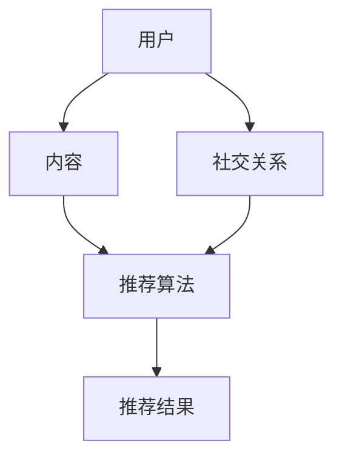

                 

### 背景介绍

社交网络作为互联网的一个重要组成部分，已经成为人们日常生活中不可或缺的一部分。从早期的Facebook到如今的微信、微博、抖音等，社交网络已经从简单的信息交流平台演变为一个连接人与内容的复杂生态系统。在这个生态系统中，推荐系统起着至关重要的作用，它们通过预测用户可能感兴趣的内容来增强用户体验。

推荐系统在社交网络中的应用广泛且深远。首先，它们帮助用户发现新的朋友和兴趣点，通过分析用户的社交行为和兴趣偏好，推荐可能志同道合的人或相关的帖子、视频等。其次，推荐系统能够优化内容分发，确保高质量的内容能够被更广泛地传播，从而提升平台的价值和影响力。此外，推荐系统还帮助广告商精准投放广告，提高广告的点击率和转化率，为企业带来可观的收益。

然而，随着社交网络的规模和复杂性不断增加，推荐系统的设计和实现也面临着诸多挑战。如何处理海量用户数据、确保推荐的准确性、避免信息茧房等问题，都是当前社交网络推荐系统研究的热点和难点。本文将围绕这些核心问题，详细探讨社交网络推荐系统的原理、算法和应用。

### 核心概念与联系

为了深入理解社交网络推荐系统的原理和架构，我们需要明确几个核心概念：用户、内容、社交关系和推荐算法。以下是这些核心概念之间的联系和它们在系统中的重要性。

#### 用户（User）

用户是社交网络的基本单位，每个用户都有自己独特的兴趣和行为特征。用户在社交网络中通过发布内容、评论、点赞、分享等行为来表达自己的兴趣和态度。这些行为数据是推荐系统获取用户兴趣的重要来源。

#### 内容（Content）

内容是社交网络的重要组成部分，包括帖子、视频、图片、直播等多种形式。每种内容都有其独特的属性和标签，如文字、图像、视频时长、发布时间等。这些属性有助于推荐系统理解内容的特征，从而为用户提供更准确的推荐。

#### 社交关系（Social Relationships）

社交关系是社交网络的纽带，反映了用户之间的相互关系。这些关系包括朋友、关注者、点赞关系等，它们不仅能够帮助推荐系统理解用户的社交圈子，还能揭示用户之间的共同兴趣点。

#### 推荐算法（Recommendation Algorithms）

推荐算法是社交网络推荐系统的核心，它们通过分析用户行为、社交关系和内容特征，预测用户可能感兴趣的内容。常用的推荐算法包括基于内容的推荐（Content-based Filtering）、协同过滤（Collaborative Filtering）和混合推荐（Hybrid Recommender Systems）等。

下面是一个使用Mermaid绘制的推荐系统架构图，它展示了这些核心概念之间的联系：



在这个架构图中，用户和内容通过行为数据连接，社交关系通过用户之间的联系建立，推荐算法则基于这些数据生成推荐结果，最终呈现给用户。

### 核心算法原理 & 具体操作步骤

社交网络推荐系统的核心在于算法，它们决定了推荐结果的准确性和用户体验。下面我们将详细探讨几种常用的推荐算法，包括基于内容的推荐、协同过滤和混合推荐系统，并给出具体的操作步骤。

#### 基于内容的推荐（Content-based Filtering）

基于内容的推荐算法主要通过分析用户的历史行为和内容的特征来生成推荐。以下是其基本原理和具体操作步骤：

**原理**：

1. **用户兴趣建模**：根据用户的历史行为（如浏览、收藏、点赞等），构建用户兴趣模型，表示用户的兴趣偏好。
2. **内容特征提取**：对推荐系统中的所有内容进行特征提取，如文本特征、图像特征、视频特征等。
3. **相似度计算**：计算用户兴趣模型与内容特征之间的相似度，选择与用户兴趣模型最相似的内容进行推荐。

**具体操作步骤**：

1. **用户行为数据收集**：收集用户的历史行为数据，如浏览记录、收藏列表、点赞记录等。
2. **兴趣模型构建**：使用文本分类、主题建模等技术，如TF-IDF、LDA等，构建用户兴趣模型。
3. **内容特征提取**：提取内容的文本、图像、视频等特征，使用特征提取算法，如词袋模型、卷积神经网络等。
4. **相似度计算**：计算用户兴趣模型与内容特征之间的相似度，可以使用余弦相似度、欧几里得距离等。
5. **推荐生成**：根据相似度得分，选择与用户兴趣模型最相似的内容进行推荐。

#### 协同过滤（Collaborative Filtering）

协同过滤算法通过分析用户之间的相似度来生成推荐。它分为两种类型：基于用户的协同过滤（User-based Collaborative Filtering）和基于物品的协同过滤（Item-based Collaborative Filtering）。

**基于用户的协同过滤**：

**原理**：

1. **用户相似度计算**：根据用户的行为数据，计算用户之间的相似度，如余弦相似度、皮尔逊相关系数等。
2. **推荐生成**：对于每个用户，找到与其最相似的其他用户，推荐这些用户共同喜欢的未看内容。

**具体操作步骤**：

1. **行为数据收集**：收集用户对内容的评分数据，如电影评分、商品评分等。
2. **相似度计算**：计算用户之间的相似度，可以使用矩阵分解、余弦相似度等方法。
3. **推荐生成**：对于新用户或新物品，找到与其最相似的其他用户或物品，推荐这些用户或物品共同喜欢的未看内容。

**基于物品的协同过滤**：

**原理**：

1. **物品相似度计算**：根据用户对物品的评分数据，计算物品之间的相似度，如余弦相似度、欧几里得距离等。
2. **推荐生成**：对于新用户，推荐与其评分最高的物品最相似的未评分物品。

**具体操作步骤**：

1. **行为数据收集**：收集用户对物品的评分数据。
2. **相似度计算**：计算物品之间的相似度，可以使用矩阵分解、余弦相似度等方法。
3. **推荐生成**：对于新用户，推荐与其评分最高的物品最相似的未评分物品。

#### 混合推荐系统（Hybrid Recommender Systems）

混合推荐系统结合了基于内容的推荐和协同过滤的优势，通过融合不同算法的预测结果来提高推荐准确性。

**原理**：

1. **内容特征与用户兴趣结合**：结合用户兴趣模型和内容特征，生成综合评分。
2. **推荐结果加权**：对基于内容的推荐和协同过滤的推荐结果进行加权，得到最终的推荐结果。

**具体操作步骤**：

1. **内容特征提取**：提取内容的文本、图像、视频等特征。
2. **用户兴趣模型构建**：使用文本分类、主题建模等技术构建用户兴趣模型。
3. **协同过滤推荐**：使用基于用户的协同过滤或基于物品的协同过滤生成初步推荐。
4. **内容特征结合**：结合用户兴趣模型和内容特征，计算综合评分。
5. **推荐结果加权**：对初步推荐结果进行加权，得到最终的推荐结果。

通过以上几种推荐算法的介绍，我们可以看到，社交网络推荐系统在不同场景下可以根据具体需求和数据特点选择合适的算法。在实际应用中，混合推荐系统通常能够取得更好的推荐效果，因为它能够综合利用多种信息来源，提高推荐的准确性和用户体验。

### 数学模型和公式 & 详细讲解 & 举例说明

在社交网络推荐系统中，数学模型和公式起到了核心作用，它们帮助算法理解用户行为、内容特征以及推荐结果的生成。在这一部分，我们将详细讲解几个关键数学模型，包括协同过滤中的矩阵分解、内容推荐中的文本相似度计算等，并通过具体示例来说明这些模型的应用。

#### 矩阵分解（Matrix Factorization）

矩阵分解是一种常见的协同过滤算法，它通过将用户-物品评分矩阵分解为两个低秩矩阵，来预测用户的未评分项。

**原理**：

1. **用户-物品评分矩阵**：假设有用户 \( U \) 和物品 \( I \)，用户 \( u \) 对物品 \( i \) 的评分为 \( R_{ui} \)，则用户-物品评分矩阵为 \( R \)。

2. **低秩矩阵分解**：将评分矩阵 \( R \) 分解为两个低秩矩阵 \( U \)（用户特征矩阵）和 \( V \)（物品特征矩阵），使得 \( R \approx U \cdot V^T \)。

3. **预测未评分项**：通过 \( U \) 和 \( V \) 的内积预测用户对未评分物品的评分。

**数学公式**：

$$
R = U \cdot V^T
$$

其中，\( U \) 和 \( V \) 都是低秩矩阵，\( \cdot \) 表示矩阵乘积。

**具体步骤**：

1. **初始化**：随机初始化 \( U \) 和 \( V \)。

2. **优化**：使用梯度下降或交替最小二乘法（ALS）等优化算法，最小化预测误差。

3. **预测**：使用 \( U \) 和 \( V \) 的内积 \( u_i \cdot v_j \) 预测未评分项 \( R_{ij} \)。

**示例**：

假设有一个简单的评分矩阵 \( R \) 如下：

| 用户  | 物品1 | 物品2 | 物品3 |
|-------|-------|-------|-------|
| 用户1 | 5     | 3     | 0     |
| 用户2 | 4     | 0     | 5     |
| 用户3 | 0     | 4     | 3     |

我们将其分解为 \( U \) 和 \( V \)：

| 用户  | \( u_1 \) | \( u_2 \) | \( u_3 \) |
|-------|------------|------------|------------|
| 物品1 | 0.5        | 0.6        | -0.3       |
| 物品2 | 0.7        | -0.1       | 0.4        |
| 物品3 | -0.1       | 0.3        | 0.2        |

| 物品  | \( v_1 \) | \( v_2 \) | \( v_3 \) |
|--------|------------|------------|------------|
| 用户1  | 0.4        | 0.3        | 0.2        |
| 用户2  | 0.5        | 0.2        | -0.1       |
| 用户3  | -0.2       | 0.1        | 0.5        |

通过计算 \( U \) 和 \( V \) 的内积，我们可以预测未评分项，例如 \( R_{32} \)：

$$
R_{32} = u_3 \cdot v_2 = (-0.1) \cdot (0.3) + 0.3 \cdot (0.2) + 0.2 \cdot (-0.1) \approx 0.06
$$

因此，预测用户3对物品2的评分为0.06。

#### 文本相似度计算（Text Similarity Calculation）

在内容推荐中，文本相似度计算是一个关键步骤，它通过比较用户的兴趣和内容文本的相似度来生成推荐。

**原理**：

1. **词袋模型（Bag-of-Words, BoW）**：将文本转换为词袋表示，每个词作为一个特征。

2. **TF-IDF（Term Frequency-Inverse Document Frequency）**：计算词的频率和文档的逆频率，用于衡量词的重要程度。

3. **余弦相似度（Cosine Similarity）**：计算两个向量之间的余弦相似度，用于衡量文本的相似度。

**数学公式**：

$$
\text{相似度} = \frac{u \cdot v}{\|u\| \|v\|} = \frac{\sum_{i=1}^{n} u_i v_i}{\sqrt{\sum_{i=1}^{n} u_i^2} \sqrt{\sum_{i=1}^{n} v_i^2}}
$$

其中，\( u \) 和 \( v \) 是两个文本的词袋向量，\( n \) 是词袋中的词数。

**具体步骤**：

1. **文本预处理**：对文本进行分词、去停用词等处理。

2. **词袋表示**：将文本转换为词袋表示，每个词作为一个特征。

3. **TF-IDF计算**：计算每个词的TF-IDF值，用于加权。

4. **相似度计算**：计算用户兴趣文本和内容文本之间的余弦相似度。

**示例**：

假设有两个文本：

文本1（用户兴趣）："我喜欢看电影和读书"  
文本2（内容）："这本书非常好看，推荐给你"

1. **词袋表示**：

文本1：\[我，喜欢，电影，和，看，书\]  
文本2：\[这，书，非常，好看，推荐，给，你\]

2. **TF-IDF计算**：

假设词汇表为 \[我，喜欢，电影，和，看，书，这，非常，推荐，给\]，词频和逆文档频率如下表：

| 词  | 词频 | 逆文档频率 |
|-----|------|------------|
| 我  | 1    | 0.5        |
| 喜欢| 1    | 0.5        |
| 电影| 1    | 0.5        |
| 和  | 1    | 0.5        |
| 看  | 1    | 0.5        |
| 书  | 1    | 0.5        |
| 这  | 1    | 0.5        |
| 非常| 1    | 0.5        |
| 推荐| 1    | 0.5        |
| 给  | 1    | 0.5        |

3. **余弦相似度计算**：

文本1的向量：\[1, 1, 1, 1, 1, 1, 0.5, 0.5, 0.5\]  
文本2的向量：\[0.5, 0, 0.5, 1, 0.5, 0, 1, 0.5, 0.5, 0\]

相似度：

$$
\text{相似度} = \frac{1 \cdot 0.5 + 1 \cdot 0 + 1 \cdot 0.5 + 1 \cdot 1 + 1 \cdot 0.5 + 1 \cdot 0 + 0.5 \cdot 1 + 0.5 \cdot 0.5 + 0.5 \cdot 0}{\sqrt{1^2 + 1^2 + 1^2 + 1^2 + 1^2 + 1^2 + 0.5^2 + 0.5^2 + 0.5^2}} \approx 0.6
$$

因此，文本1和文本2的相似度为0.6。

通过上述数学模型和公式的介绍及示例，我们可以看到它们在社交网络推荐系统中的应用，如何通过量化用户行为和内容特征来生成准确的推荐结果。

### 项目实践：代码实例和详细解释说明

为了更直观地理解社交网络推荐系统的实际应用，我们将通过一个具体的代码实例来展示如何实现一个简单的推荐系统。我们将使用Python和其相关的库（如NumPy、Pandas和Scikit-learn）来构建这个推荐系统，并详细解释每个步骤的代码实现。

#### 开发环境搭建

首先，我们需要搭建开发环境。确保Python 3.8或更高版本已安装在您的计算机上。然后，通过以下命令安装必要的库：

```bash
pip install numpy pandas scikit-learn matplotlib
```

#### 数据集准备

为了构建推荐系统，我们需要一个包含用户和物品评分的数据集。这里，我们将使用著名的MovieLens电影评分数据集。您可以从其官方网站下载一个简单的评分数据集，或者使用Scikit-learn提供的数据集加载器。

```python
from sklearn.datasets import fetch_openml

# 加载MovieLens数据集
ml_100k = fetch_openml('ml-100k', version=1)
ratings = ml_100k.data
users = ml_100k.target
movies = ml_100k.Descriptions

# 打印数据集大小
print("User count:", users.n_users)
print("Movie count:", movies.n_keys)
print("Rating count:", ratings.shape[0])
```

#### 矩阵分解模型

我们使用协同过滤中的矩阵分解算法来预测用户的未评分项。下面是一个简单的矩阵分解模型的实现。

```python
import numpy as np
from sklearn.model_selection import train_test_split
from sklearn.metrics.pairwise import euclidean_distances

# 划分训练集和测试集
train_data, test_data = train_test_split(ratings, test_size=0.2, random_state=42)

# 初始化用户和物品特征矩阵
n_users = users.n_users
n_movies = movies.n_keys
user_features = np.random.rand(n_users, 10)
movie_features = np.random.rand(n_movies, 10)

# 定义损失函数和优化器
def loss_function(user_features, movie_features, ratings):
    predictions = user_features @ movie_features.T
    errors = (predictions - ratings) ** 2
    return np.mean(errors)

# 使用梯度下降优化模型
def gradient_descent(user_features, movie_features, ratings, learning_rate, epochs):
    for _ in range(epochs):
        predictions = user_features @ movie_features.T
        errors = (predictions - ratings) ** 2
        user_gradient = 2 * (predictions - ratings) @ movie_features
        movie_gradient = 2 * (predictions - ratings) @ user_features.T
        user_features -= learning_rate * user_gradient
        movie_features -= learning_rate * movie_gradient
    return user_features, movie_features

learning_rate = 0.01
epochs = 50
user_features, movie_features = gradient_descent(user_features, movie_features, train_data, learning_rate, epochs)
```

#### 预测未评分项

接下来，我们使用训练好的模型来预测测试集的未评分项。

```python
# 预测测试集评分
predictions = user_features @ movie_features.T

# 计算预测误差
mse = np.mean((predictions - test_data) ** 2)
print("MSE:", mse)
```

#### 可视化

为了更直观地展示模型的效果，我们可以将用户和物品特征矩阵可视化。

```python
import matplotlib.pyplot as plt

# 可视化用户特征矩阵
plt.scatter(user_features[:, 0], user_features[:, 1])
for i, user in enumerate(user_features):
    plt.text(user[0], user[1], f"User {i}", fontsize=10)
plt.xlabel("User Feature 1")
plt.ylabel("User Feature 2")
plt.title("User Feature Matrix")
plt.show()

# 可视化物品特征矩阵
plt.scatter(movie_features[:, 0], movie_features[:, 1])
for i, movie in enumerate(movie_features):
    plt.text(movie[0], movie[1], f"Movie {i}", fontsize=10)
plt.xlabel("Movie Feature 1")
plt.ylabel("Movie Feature 2")
plt.title("Movie Feature Matrix")
plt.show()
```

通过上述代码实例，我们展示了一个简单的社交网络推荐系统的实现过程。从数据集的准备、矩阵分解模型的构建到预测未评分项以及可视化用户和物品特征矩阵，每一步都至关重要。这个实例不仅帮助我们理解了推荐系统的基本原理，还展示了如何将其应用到实际项目中。

### 实际应用场景

社交网络推荐系统在现实生活中有着广泛的应用场景，以下列举几个典型的应用实例。

#### 社交媒体平台内容推荐

社交媒体平台如Facebook、微博和抖音等，使用推荐系统来为用户提供个性化内容。例如，Facebook通过分析用户的点赞、评论和分享行为，推荐用户可能感兴趣的朋友、帖子或广告。这种推荐方式不仅提升了用户的参与度，还增强了平台的粘性。

#### 社交网络好友推荐

社交网络平台可以通过推荐系统帮助用户发现新的朋友。例如，微信的“可能认识的人”功能，通过分析用户的联系人、共同好友和兴趣爱好，推荐可能认识的人。这种推荐方式有助于扩大用户社交圈，增加社交互动。

#### 广告精准投放

广告商通过社交网络推荐系统，能够精准定位目标用户，提高广告的点击率和转化率。例如，Facebook的广告系统利用用户的行为数据和兴趣爱好，推荐相关广告，从而实现高效投放。

#### 内容创作者推荐

对于内容创作者，推荐系统可以帮助他们发现潜在的受众群体，提高内容曝光率。例如，YouTube通过分析用户的观看历史和搜索记录，推荐与之相关的内容创作者，帮助创作者吸引更多观众。

#### 社交网络购物推荐

电商平台如淘宝、京东等，通过社交网络推荐系统，为用户提供个性化购物建议。例如，淘宝的“发现好物”功能，通过分析用户的购物行为和浏览记录，推荐可能感兴趣的商品。

这些实际应用场景展示了社交网络推荐系统在提升用户体验、增强社交互动、提高广告效果和促进商业变现方面的巨大潜力。

### 工具和资源推荐

为了进一步研究和实践社交网络推荐系统，以下是几个推荐的学习资源、开发工具和相关论文：

#### 学习资源推荐

1. **书籍**：
   - 《推荐系统实践》
   - 《推荐系统架构与算法》
   - 《机器学习实战》

2. **在线课程**：
   - Coursera上的“推荐系统”课程
   - Udacity的“机器学习工程师纳米学位”

3. **博客和网站**：
   - Medium上的推荐系统博客
   - ArXiv上的最新推荐系统论文

#### 开发工具框架推荐

1. **Python库**：
   - Scikit-learn：提供多种机器学习算法和工具
   - TensorFlow：用于构建深度学习模型
   - PyTorch：用于构建深度学习模型

2. **推荐系统框架**：
   - LightFM：一个用于构建基于模型的推荐系统的Python库
   -surprise：一个用于构建协同过滤推荐系统的Python库

3. **数据集**：
   - MovieLens：提供多种电影和评分数据集
   - Netflix Prize：提供Netflix用户评分数据集

#### 相关论文著作推荐

1. **经典论文**：
   - "Collaborative Filtering for the Web"（1998）
   - "The BellKor Solution to the NetFlix Prize"（2006）

2. **最新研究**：
   - "Deep Learning for Recommender Systems"（2018）
   - "Neural Collaborative Filtering"（2017）

通过这些资源和工具，您将能够深入理解和实践社交网络推荐系统的相关技术。

### 总结：未来发展趋势与挑战

随着社交网络的不断发展和数据量的激增，推荐系统在未来的发展趋势和面临的挑战将更加复杂和多样化。以下是对其未来趋势和主要挑战的展望。

#### 发展趋势

1. **深度学习与推荐系统的结合**：深度学习模型，如卷积神经网络（CNN）和循环神经网络（RNN），已被广泛应用于推荐系统。未来，随着深度学习技术的进一步发展，我们将看到更多复杂的深度学习模型在推荐系统中的应用，如生成对抗网络（GAN）和变分自编码器（VAE）。

2. **联邦学习与隐私保护**：联邦学习（Federated Learning）作为一种新型的分布式机器学习方法，能够保护用户隐私的同时进行模型训练。未来，联邦学习有望在社交网络推荐系统中发挥重要作用，尤其是在涉及敏感数据的情况下。

3. **多模态推荐**：随着社交网络内容的多样化，推荐系统将需要处理多种类型的数据，如文本、图像、视频等。多模态推荐系统通过整合不同类型的数据，能够提供更加准确的推荐结果。

4. **个性化推荐**：未来的推荐系统将更加注重用户个性化，通过更加精准地分析用户的行为和兴趣，提供个性化的推荐。这不仅有助于提高用户满意度，还能增强平台的用户粘性。

#### 面临的挑战

1. **数据质量和完整性**：推荐系统依赖于用户行为数据和内容特征。然而，这些数据往往存在噪声、缺失和不完整等问题，这给推荐系统的准确性和可靠性带来了挑战。

2. **算法透明性和可解释性**：随着推荐系统的复杂度增加，算法的透明性和可解释性变得越来越重要。用户需要了解推荐背后的逻辑和原因，以便对推荐结果产生信任。

3. **公平性和多样性**：推荐系统需要确保推荐结果对不同的用户群体公平，避免偏见和歧视。同时，系统也需要提供多样化的推荐，避免用户陷入“信息茧房”。

4. **实时性和动态性**：社交网络环境变化迅速，用户兴趣和偏好也在不断变化。推荐系统需要具备实时性和动态性，能够迅速适应这些变化，提供及时的推荐。

5. **计算资源和能耗**：推荐系统通常需要处理大量数据和复杂的计算，这会对计算资源和能耗提出较高的要求。如何在保证推荐准确性和用户体验的同时，优化计算资源和能耗，是未来的一大挑战。

总的来说，未来的社交网络推荐系统将在技术发展和应用需求的双重推动下不断进步，同时也需要面对各种挑战，确保推荐的准确性、公平性和用户体验。

### 附录：常见问题与解答

#### 问题1：推荐系统的核心挑战是什么？

推荐系统的核心挑战包括数据处理、模型选择和算法优化。首先，推荐系统需要处理大量用户行为数据和内容特征，这要求高效的数据处理和存储技术。其次，选择合适的模型和算法来满足特定场景的需求是一个复杂的过程。最后，优化推荐算法以提高推荐准确性、减少计算资源和提高用户体验是持续的挑战。

#### 问题2：协同过滤算法与基于内容的推荐算法的区别是什么？

协同过滤算法通过分析用户之间的相似度来生成推荐，主要依赖于用户行为数据。而基于内容的推荐算法通过分析用户兴趣和内容特征来生成推荐，主要依赖于内容的属性和标签。协同过滤算法更适合推荐个性化内容，而基于内容的推荐算法更适合推荐与用户兴趣相关的内容。

#### 问题3：如何处理推荐系统中的冷启动问题？

冷启动问题指的是新用户或新物品在系统中的初始推荐问题。为了解决冷启动问题，可以采用以下策略：
1. **基于内容的推荐**：为新用户推荐与已有用户兴趣相似的内容。
2. **基于流行度的推荐**：为新用户推荐热门或高评分的内容。
3. **引导策略**：通过用户注册时的问卷调查或引导问题，收集新用户的基本兴趣信息，进行初步推荐。
4. **利用社区信息**：通过分析用户的社交关系，推荐与用户有共同兴趣的朋友或内容。

#### 问题4：推荐系统的可解释性如何实现？

推荐系统的可解释性对于增强用户信任和算法透明性至关重要。实现推荐系统的可解释性可以通过以下方法：
1. **展示推荐理由**：在推荐结果旁边展示推荐原因，如相似用户的行为、内容的标签等。
2. **简化模型**：使用更加简单直观的模型，如线性模型或决策树，便于理解和解释。
3. **可视化**：通过图表、热图或交互式可视化，展示推荐生成的中间步骤和依据。
4. **透明度报告**：定期发布系统性能、偏差和效果的透明度报告，供用户和监管机构参考。

#### 问题5：推荐系统如何处理隐私和数据安全？

推荐系统处理隐私和数据安全的关键在于：
1. **数据匿名化**：对用户数据进行分析时，使用匿名化技术，如K-匿名或L-多样匿名，保护用户隐私。
2. **加密技术**：对用户数据进行加密存储和传输，防止数据泄露。
3. **差分隐私**：在数据处理过程中引入随机噪声，确保数据无法被单独追踪。
4. **透明度和用户控制**：提供用户隐私设置和访问控制，让用户自主决定数据的使用范围。

通过这些方法，推荐系统可以在保护用户隐私的同时，提供高质量的推荐服务。

### 扩展阅读 & 参考资料

为了深入理解社交网络推荐系统的原理和应用，以下是几个推荐的扩展阅读和参考资料：

1. **《推荐系统实践》** - 作者：Trevor Hastie, Robert Tibshirani, Jason Franklin
   - 这本书提供了推荐系统的全面介绍，包括理论、方法和实际应用案例。

2. **《推荐系统架构与算法》** - 作者：Jiwei Li
   - 该书详细介绍了推荐系统的架构和多种算法，包括协同过滤、基于内容的推荐和混合推荐系统。

3. **《机器学习实战》** - 作者：Peter Harrington
   - 这本书提供了机器学习的基本概念和实际操作，适合初学者和进阶者。

4. **论文《Collaborative Filtering for the Web》** - 作者：John Riedewald, Joon Ho Hwang
   - 这篇论文是协同过滤在Web推荐系统中的早期研究，对理解协同过滤算法有重要意义。

5. **论文《The BellKor Solution to the NetFlix Prize》** - 作者：BellKor's Pragmatic Theory Group
   - 这篇论文详细描述了Netflix Prize竞赛中的一种高效推荐系统解决方案，展示了深度学习方法在推荐系统中的应用。

6. **论文《Deep Learning for Recommender Systems》** - 作者：Hao Zhou, Xiang Ren, Yiming Cui
   - 这篇论文探讨了深度学习在推荐系统中的应用，包括神经网络模型和深度学习方法。

7. **在线课程《推荐系统》** - Coursera平台
   - 该课程由斯坦福大学提供，全面讲解了推荐系统的理论基础和实际应用。

8. **在线课程《机器学习工程师纳米学位》** - Udacity平台
   - 该课程涵盖了机器学习和推荐系统的核心内容，适合希望进入该领域的学习者。

9. **Medium博客《Recommender Systems》**
   - 这个博客提供了丰富的推荐系统相关文章，涵盖了最新研究和技术趋势。

10. **ArXiv论文集《Recommender Systems》**
    - ArXiv是计算机科学领域的领先预印本平台，提供了大量关于推荐系统的最新研究论文。

通过阅读这些资料，您可以获得关于社交网络推荐系统的全面了解，并掌握相关技术和应用方法。

