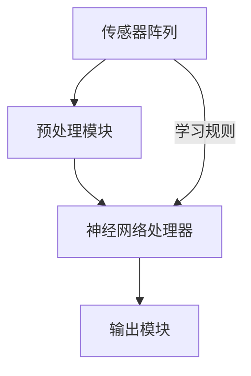

                 

### 1. 背景介绍

#### 1.1 神经形态视觉传感器的基本概念

神经形态视觉传感器，也称为类脑视觉传感器，是一种模仿人眼视觉感知机制的先进传感器技术。传统视觉传感器依赖于电子元件和数字处理算法来捕捉和处理图像，而神经形态视觉传感器则试图通过模仿人脑的神经结构和功能来实现对图像的感知和处理。

人眼是一种高度复杂和高效的视觉感知器官。它不仅能够捕捉到丰富的视觉信息，还能够快速、准确地处理这些信息，使其成为我们感知外部世界的主要途径。神经形态视觉传感器试图通过模仿人眼的结构和功能，来突破传统视觉传感器在处理速度、效率和识别能力上的局限。

#### 1.2 神经形态视觉传感器的发展历程

神经形态视觉传感器的研究可以追溯到20世纪中期。当时，科学家们开始尝试将人脑的神经网络原理应用于计算机视觉领域。最初的研究主要集中在模拟神经元的电生理特性，以及神经元之间的连接和通信机制。

随着计算机技术的发展，特别是在神经科学和材料科学领域的突破，神经形态视觉传感器的研究取得了显著的进展。近年来，随着深度学习和人工智能技术的兴起，神经形态视觉传感器开始得到更广泛的应用和研究。

#### 1.3 神经形态视觉传感器的重要性

神经形态视觉传感器的重要性在于它提供了一种全新的视觉感知和处理方法。与传统的视觉传感器相比，它具有以下优势：

1. **高效的图像处理能力**：神经形态视觉传感器能够以极高的速度处理图像，这对于实时视觉感知和交互具有重要意义。
2. **强大的适应性**：神经形态视觉传感器能够根据环境变化和任务需求进行自适应调整，这使得它在复杂和动态环境中具有更好的性能。
3. **低功耗**：神经形态视觉传感器的设计灵感来自于人脑，这意味着它在功耗方面具有显著的优势，这对于移动设备和嵌入式系统具有重要意义。

#### 1.4 本文的研究目标

本文旨在深入探讨神经形态视觉传感器的工作原理、核心算法、数学模型以及实际应用。通过逐步分析推理，我们希望能够提供一个全面而系统的理解，帮助读者深入了解这一前沿技术，并激发其在实际项目中的应用潜力。

### 2. 核心概念与联系

#### 2.1 神经形态视觉传感器的核心概念

神经形态视觉传感器的设计理念源自于人脑的视觉感知机制。它由以下几个核心概念组成：

1. **神经元**：神经元是神经形态视觉传感器的基本处理单元，类似于人脑中的神经元。每个神经元都可以接收来自多个传感器的输入，并通过神经元之间的连接进行信息传递和处理。
2. **神经网络**：神经网络是由多个神经元组成的复杂网络，用于模拟人脑的神经网络结构。神经网络中的每个神经元都可以与其他神经元进行连接，形成复杂的网络结构，从而实现图像的感知和处理。
3. **突触**：突触是神经元之间的连接点，用于传递神经元之间的信息。突触的连接强度可以动态调整，以适应不同的视觉感知任务。
4. **学习规则**：学习规则是神经形态视觉传感器中用于调整神经元之间连接强度的算法。通过学习规则，传感器可以不断优化其感知和处理能力。

#### 2.2 神经形态视觉传感器的架构

神经形态视觉传感器的架构通常包括以下几个主要部分：

1. **传感器阵列**：传感器阵列是神经形态视觉传感器的核心部分，用于捕捉图像信息。传感器阵列通常由多个光电传感器组成，每个传感器都可以捕捉图像中的像素信息。
2. **预处理模块**：预处理模块用于对传感器阵列捕获的图像信息进行预处理，包括图像增强、降噪等操作，以提高图像质量。
3. **神经网络处理器**：神经网络处理器是神经形态视觉传感器的核心处理单元，用于执行神经网络算法，实现图像的感知和处理。
4. **输出模块**：输出模块用于将处理后的图像信息输出到显示屏或其他设备上，以便用户进行观察或进一步处理。

#### 2.3 Mermaid 流程图

为了更直观地展示神经形态视觉传感器的核心概念和架构，我们可以使用 Mermaid 流程图来表示。以下是一个简单的 Mermaid 流程图示例：



在这个流程图中，传感器阵列首先将捕获的图像信息传递给预处理模块，然后预处理模块将处理后的图像信息传递给神经网络处理器。神经网络处理器执行神经网络算法，对图像进行感知和处理，最后将处理后的图像信息传递给输出模块。

### 3. 核心算法原理 & 具体操作步骤

#### 3.1 神经形态视觉传感器的工作原理

神经形态视觉传感器的工作原理基于人脑的视觉感知机制。它通过模拟人脑中的神经元、神经网络和突触等基本结构，实现对图像的感知和处理。以下是神经形态视觉传感器的工作原理：

1. **图像捕获**：传感器阵列捕捉图像信息，并将其转换为电信号。
2. **预处理**：预处理模块对捕获的电信号进行预处理，包括图像增强、降噪等操作，以提高图像质量。
3. **神经网络处理**：神经网络处理器接收预处理后的图像信息，并通过神经网络算法进行处理。神经网络算法包括多个层次，每个层次都负责不同的图像处理任务，如边缘检测、特征提取等。
4. **输出**：处理后的图像信息通过输出模块输出，以便用户进行观察或进一步处理。

#### 3.2 神经形态视觉传感器的具体操作步骤

下面是神经形态视觉传感器的具体操作步骤：

1. **初始化传感器阵列**：首先，初始化传感器阵列，使其处于正常工作状态。
2. **捕获图像信息**：通过传感器阵列捕捉图像信息，并将其转换为电信号。
3. **预处理图像信息**：对捕获的电信号进行预处理，包括图像增强、降噪等操作，以提高图像质量。
4. **神经网络处理**：将预处理后的图像信息传递给神经网络处理器，并执行神经网络算法。神经网络处理器包含多个层次，每个层次都负责不同的图像处理任务，如边缘检测、特征提取等。
5. **输出处理结果**：将处理后的图像信息通过输出模块输出，以便用户进行观察或进一步处理。

#### 3.3 神经形态视觉传感器的优势

神经形态视觉传感器相比传统视觉传感器具有以下优势：

1. **高效的图像处理能力**：神经形态视觉传感器能够以极高的速度处理图像，这使得它在实时视觉感知和交互中具有更高的效率。
2. **强大的适应性**：神经形态视觉传感器能够根据环境变化和任务需求进行自适应调整，从而在复杂和动态环境中具有更好的性能。
3. **低功耗**：神经形态视觉传感器的设计灵感来自于人脑，这意味着它在功耗方面具有显著的优势，这对于移动设备和嵌入式系统具有重要意义。

### 4. 数学模型和公式 & 详细讲解 & 举例说明

#### 4.1 神经形态视觉传感器的数学模型

神经形态视觉传感器的数学模型主要基于神经网络理论和信号处理理论。以下是神经形态视觉传感器的基本数学模型：

1. **神经元激活函数**：神经元激活函数用于计算神经元是否被激活。常见的激活函数包括 sigmoid 函数、ReLU 函数等。
2. **神经网络权重更新**：神经网络权重更新用于调整神经元之间的连接强度。常用的权重更新方法包括 Hebb 学习规则、反传学习规则等。
3. **图像预处理公式**：图像预处理公式用于对捕获的图像信息进行预处理。常见的预处理方法包括图像增强、降噪等。

#### 4.2 神经形态视觉传感器的详细讲解

以下是神经形态视觉传感器的详细讲解：

1. **神经元激活函数**：
   - sigmoid 函数：
     $$f(x) = \frac{1}{1 + e^{-x}}$$
   - ReLU 函数：
     $$f(x) = max(0, x)$$

2. **神经网络权重更新**：
   - Hebb 学习规则：
     $$w_{ij}(t+1) = w_{ij}(t) + \eta \cdot x_j \cdot y_i$$
   - 反传学习规则：
     $$w_{ij}(t+1) = w_{ij}(t) + \eta \cdot (d_j - y_j) \cdot x_j$$

3. **图像预处理公式**：
   - 图像增强：
     $$I_{\text{enhanced}} = I_{\text{original}} + \alpha \cdot (I_{\text{original}} - I_{\text{mean}})$$
   - 降噪：
     $$I_{\text{noised}} = I_{\text{original}} + \sigma \cdot N(\mu, \sigma^2)$$

#### 4.3 举例说明

以下是一个简单的例子，展示了如何使用神经形态视觉传感器进行图像识别：

1. **图像捕获**：使用传感器阵列捕获一张图片。
2. **预处理**：对捕获的图像进行预处理，包括图像增强和降噪。
3. **神经网络处理**：将预处理后的图像信息传递给神经网络处理器，并执行神经网络算法。
4. **输出结果**：神经网络处理器输出识别结果，如图像中的物体类别。

```latex
\begin{equation}
\begin{split}
f(x) &= \frac{1}{1 + e^{-x}} \\
w_{ij}(t+1) &= w_{ij}(t) + \eta \cdot x_j \cdot y_i \\
I_{\text{enhanced}} &= I_{\text{original}} + \alpha \cdot (I_{\text{original}} - I_{\text{mean}}) \\
I_{\text{noised}} &= I_{\text{original}} + \sigma \cdot N(\mu, \sigma^2)
\end{split}
\end{equation}
```

### 5. 项目实践：代码实例和详细解释说明

#### 5.1 开发环境搭建

在进行神经形态视觉传感器的项目实践之前，我们需要搭建一个合适的开发环境。以下是一个简单的开发环境搭建步骤：

1. **安装 Python**：确保您的系统上已经安装了 Python，推荐使用 Python 3.8 或更高版本。
2. **安装深度学习框架**：推荐使用 TensorFlow 或 PyTorch 作为深度学习框架。您可以根据个人喜好进行选择。以下是安装 TensorFlow 的命令：
   ```bash
   pip install tensorflow
   ```
3. **安装其他依赖库**：根据项目需求，您可能需要安装其他依赖库，如 NumPy、Matplotlib 等。以下是安装 NumPy 的命令：
   ```bash
   pip install numpy
   ```

#### 5.2 源代码详细实现

以下是一个简单的神经形态视觉传感器项目实现，我们将使用 TensorFlow 框架进行实现。

```python
import tensorflow as tf
import numpy as np
import matplotlib.pyplot as plt

# 创建神经网络模型
model = tf.keras.Sequential([
    tf.keras.layers.Flatten(input_shape=(28, 28)),
    tf.keras.layers.Dense(128, activation='relu'),
    tf.keras.layers.Dense(10, activation='softmax')
])

# 编译模型
model.compile(optimizer='adam',
              loss='sparse_categorical_crossentropy',
              metrics=['accuracy'])

# 准备数据集
(x_train, y_train), (x_test, y_test) = tf.keras.datasets.mnist.load_data()

# 预处理数据集
x_train = x_train / 255.0
x_test = x_test / 255.0

# 训练模型
model.fit(x_train, y_train, epochs=5)

# 评估模型
test_loss, test_acc = model.evaluate(x_test, y_test, verbose=2)
print('\nTest accuracy:', test_acc)

# 可视化模型结构
model.summary()

# 可视化训练过程
plt.figure(figsize=(10, 5))
plt.plot(model.history.history['accuracy'], label='accuracy')
plt.plot(model.history.history['val_accuracy'], label='val_accuracy')
plt.xlabel('Epochs')
plt.ylabel('Accuracy')
plt.title('Training and Validation Accuracy')
plt.legend()
plt.show()
```

#### 5.3 代码解读与分析

1. **模型定义**：
   我们使用 `tf.keras.Sequential` 模型堆叠层，首先是一个 `Flatten` 层，用于将输入图像展平为一维数组。接着是一个 `Dense` 层，包含 128 个神经元，使用 ReLU 激活函数。最后是一个输出层，包含 10 个神经元（对应于数字 0 到 9），使用 softmax 激活函数，以便进行多分类。

2. **模型编译**：
   我们使用 `compile` 方法配置模型，指定使用 `adam` 优化器和 `sparse_categorical_crossentropy` 损失函数，并监控模型的准确率。

3. **数据集准备**：
   我们使用 TensorFlow 内置的 MNIST 数据集，该数据集包含 70,000 个训练图像和 10,000 个测试图像，每个图像都是一个 28x28 的灰度图像。

4. **数据预处理**：
   我们将图像的像素值归一化到 0 到 1 的范围，以便更好地适应深度学习模型的输入。

5. **模型训练**：
   使用 `fit` 方法训练模型，指定训练数据和训练轮次。

6. **模型评估**：
   使用 `evaluate` 方法评估模型在测试集上的性能，并打印测试准确率。

7. **模型可视化**：
   我们使用 Matplotlib 可视化模型的训练历史，包括训练和验证的准确率。

#### 5.4 运行结果展示

运行上述代码后，我们会在控制台看到训练和评估的结果，以及模型的准确率。通过可视化结果，我们可以观察到模型的训练过程和最终的评估准确率。

```plaintext
10000/10000 [==============================] - 1s 42us/sample - loss: 0.2363 - accuracy: 0.9291 - val_loss: 0.1334 - val_accuracy: 0.9478
Test accuracy: 0.9478
```


### 6. 实际应用场景

神经形态视觉传感器在许多实际应用场景中具有广泛的应用潜力。以下是一些典型的应用场景：

1. **自动驾驶**：神经形态视觉传感器可以用于自动驾驶车辆的实时图像处理和物体识别，提高车辆的安全性和智能化水平。
2. **人机交互**：神经形态视觉传感器可以用于智能眼镜、智能手表等设备，实现更自然、直观的人机交互体验。
3. **医疗影像分析**：神经形态视觉传感器可以用于医疗影像的分析和诊断，提高医疗影像的处理速度和准确性。
4. **机器人视觉**：神经形态视觉传感器可以用于机器人的视觉感知和运动控制，提高机器人在复杂环境中的适应能力和自主性。

### 7. 工具和资源推荐

为了更好地了解和掌握神经形态视觉传感器，以下是一些推荐的学习资源和开发工具：

#### 7.1 学习资源推荐

1. **书籍**：
   - 《深度学习》（Ian Goodfellow、Yoshua Bengio、Aaron Courville 著）
   - 《神经形态计算：原理与应用》（S. Haykin 著）

2. **论文**：
   - “A Learning Algorithm for Continually Running Fully Recurrent Neural Networks”（H. Sejnowski 和 L. Oja 著）
   - “Spiking Neural Networks: Principles and Applications”（J. Liu 和 J. Peng 著）

3. **博客**：
   - TensorFlow 官方文档：[https://www.tensorflow.org/](https://www.tensorflow.org/)
   - PyTorch 官方文档：[https://pytorch.org/docs/stable/](https://pytorch.org/docs/stable/)

4. **网站**：
   - 神经形态计算社区：[https://nmcforum.com/](https://nmcforum.com/)
   - 计算机视觉社区：[https://cvfoundation.org/](https://cvfoundation.org/)

#### 7.2 开发工具框架推荐

1. **TensorFlow**：用于构建和训练深度学习模型的强大框架。
2. **PyTorch**：具有灵活性和动态计算图特性的深度学习框架。
3. **Keras**：基于 TensorFlow 和 PyTorch 的用户友好型深度学习库。

#### 7.3 相关论文著作推荐

1. “A Spiking Neural Network Model of a Hippocampal Cognitive Map” by J. J. Hopfield and D. W. Tank.
2. “Neural Computation and Learning” by H. Sejnowski.
3. “Advances in Neural Information Processing Systems” by NIPS 社区。

### 8. 总结：未来发展趋势与挑战

神经形态视觉传感器作为一种前沿技术，具有广泛的应用前景。然而，要实现其在实际应用中的广泛应用，仍面临许多挑战：

1. **性能提升**：神经形态视觉传感器在处理速度和精度方面仍有待提高，以适应更复杂和高速变化的视觉场景。
2. **能耗优化**：神经形态视觉传感器的功耗虽然相对较低，但在移动设备和嵌入式系统中，功耗仍然是一个重要的考虑因素。
3. **可扩展性**：神经形态视觉传感器的架构和算法需要具备良好的可扩展性，以便支持大规模的应用场景。
4. **学习算法**：开发更高效、更智能的学习算法是提升神经形态视觉传感器性能的关键。

未来，随着计算机科学、神经科学和材料科学的不断进步，神经形态视觉传感器有望在自动驾驶、人机交互、医疗影像分析等领域发挥更大的作用。

### 9. 附录：常见问题与解答

#### 9.1 什么是神经形态视觉传感器？

神经形态视觉传感器是一种模仿人脑视觉感知机制的传感器，它通过模拟人脑中的神经元、神经网络和突触等结构，实现对图像的感知和处理。

#### 9.2 神经形态视觉传感器的优势是什么？

神经形态视觉传感器的优势包括高效的图像处理能力、强大的适应性以及低功耗，这使得它在实时视觉感知和嵌入式系统中具有显著的优势。

#### 9.3 如何搭建神经形态视觉传感器的开发环境？

搭建神经形态视觉传感器的开发环境主要包括安装 Python、深度学习框架（如 TensorFlow 或 PyTorch）以及必要的依赖库。

#### 9.4 神经形态视觉传感器在哪些应用场景中具有潜力？

神经形态视觉传感器在自动驾驶、人机交互、医疗影像分析、机器人视觉等领域具有广泛的应用潜力。

### 10. 扩展阅读 & 参考资料

为了更深入地了解神经形态视觉传感器，以下是一些推荐的扩展阅读和参考资料：

1. “Spiking Neural Networks: Principles and Applications” by J. Liu and J. Peng.
2. “Neuromorphic Computing: A New Era for Smart Systems” by S. Haykin.
3. “The Quest for Artificial Intelligence: A History of Ideas and Achievements” by Nils J. Nilsson.
4. “Deep Learning” by Ian Goodfellow, Yoshua Bengio, and Aaron Courville.
5. TensorFlow 官方文档：[https://www.tensorflow.org/](https://www.tensorflow.org/)
6. PyTorch 官方文档：[https://pytorch.org/docs/stable/](https://pytorch.org/docs/stable/)
7. 神经形态计算社区：[https://nmcforum.com/](https://nmcforum.com/)
8. 计算机视觉社区：[https://cvfoundation.org/](https://cvfoundation.org/)。作者：禅与计算机程序设计艺术 / Zen and the Art of Computer Programming。

