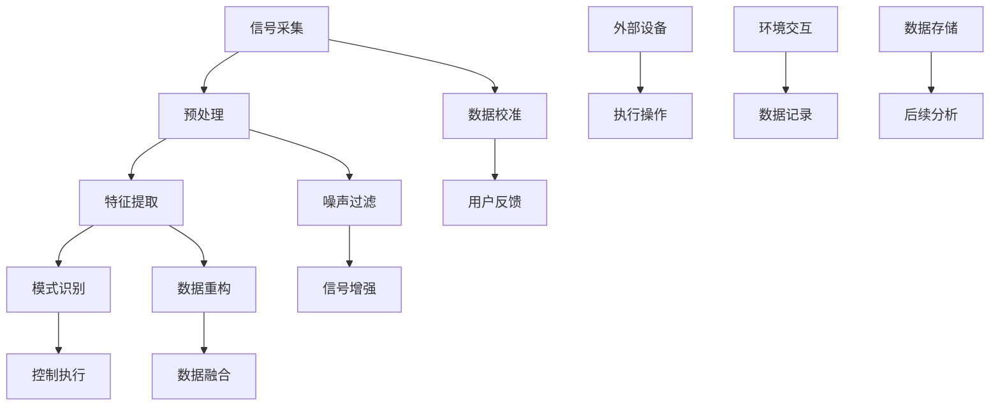

                 

### 脑机接口技术的基本概念及其发展

脑机接口（Brain-Computer Interface，简称BCI）是一种直接连接人脑与外部设备的技术，通过捕捉和解释大脑活动来传递信息。脑机接口技术的历史可以追溯到20世纪60年代，当时科学家们开始探索如何利用脑电波来控制外部设备。随着神经科学和计算机技术的不断进步，脑机接口技术逐渐从理论走向实际应用，并在医疗康复、人机交互、神经科学研究等多个领域展现出巨大的潜力。

#### 1. 脑机接口技术的工作原理

脑机接口技术的工作原理主要基于以下几个方面：

1. **脑电信号的采集**：脑机接口通过电极或其他传感器，将大脑活动转化为电信号。脑电图（EEG）是最常用的脑电信号采集方法，它能够记录大脑表面的电活动。
   
2. **信号处理**：采集到的脑电信号通常包含大量噪声和干扰，因此需要进行信号处理以提取有用的信息。常用的信号处理技术包括滤波、去噪、特征提取等。

3. **模式识别**：通过模式识别算法，将处理后的脑电信号转化为可操作的控制信号。例如，可以识别出特定的脑电波模式，从而实现对外部设备的控制。

4. **执行操作**：将转换后的控制信号发送给外部设备，实现特定的功能，如控制轮椅、操作计算机等。

#### 2. 脑机接口技术的分类

根据技术原理和应用场景，脑机接口技术可以大致分为以下几类：

1. **非侵入式脑机接口**：这种技术通过在头皮上放置电极来采集脑电信号，不会对大脑内部结构造成损害。非侵入式脑机接口的适用范围较广，但由于电极与大脑之间的绝缘层，信号质量通常较差。

2. **侵入式脑机接口**：这种技术通过在大脑内部植入电极来直接采集脑电信号。侵入式脑机接口可以获得更高质量的信号，但手术风险较大，适用范围有限。

3. **混合式脑机接口**：这种技术结合了非侵入式和侵入式脑机接口的优点，通过在不同区域同时采集脑电信号，以获得更好的信号质量和控制效果。

#### 3. 脑机接口技术的发展历程

脑机接口技术的发展经历了多个阶段：

1. **早期探索**（20世纪60年代）：科学家们开始探索利用脑电波控制外部设备，如通过意念控制简单的机械臂。

2. **技术成熟**（20世纪90年代）：随着计算机技术和信号处理算法的进步，脑机接口技术逐渐走向实用化，如用于帮助截肢者控制假肢。

3. **广泛应用**（21世纪至今）：脑机接口技术开始应用于医疗康复、娱乐、教育等多个领域，如通过脑机接口实现轮椅的远程控制、游戏操作等。

#### 4. 脑机接口技术的前景与挑战

脑机接口技术具有广阔的应用前景，但也面临诸多挑战：

1. **前景**：
   - **医疗康复**：帮助截肢者、瘫痪患者恢复运动能力，改善生活质量。
   - **人机交互**：提供更自然、直观的人机交互方式，如通过脑机接口控制智能家居、虚拟现实等。
   - **神经科学研究**：用于研究大脑功能、疾病机理等。

2. **挑战**：
   - **信号质量**：提高脑电信号的质量和稳定性是当前脑机接口技术的一个重要挑战。
   - **个性化定制**：每个人的大脑活动模式都不同，如何实现脑机接口的个性化定制也是一个难题。
   - **安全与隐私**：脑机接口可能涉及个人隐私和数据安全的问题，如何保护用户隐私是一个重要的议题。

综上所述，脑机接口技术作为一种新兴的技术，其发展潜力巨大，但也需要解决诸多技术难题。随着科技的不断进步，我们有理由相信，脑机接口技术将在未来带来更多令人惊叹的应用和变革。

### 脑机接口技术的核心概念原理与架构

脑机接口（BCI）技术的核心概念和原理可以分为三个主要部分：信号采集、信号处理和控制执行。下面，我们将通过Mermaid流程图详细展示脑机接口技术的工作流程及其关键组成部分。

#### Mermaid流程图



#### 信号采集

信号采集是脑机接口技术的第一步，也是最为关键的一步。通过在头皮或大脑内部植入电极，脑机接口设备能够捕捉到大脑的微弱电信号。这些信号包括脑电波（EEG）、肌电信号（EMG）、眼动信号等。

1. **电极材料**：常用的电极材料包括银-氯化银（Ag/AgCl）和柔性导电聚合物。
2. **电极布局**：电极的布局对信号质量有很大影响。常见的布局包括单通道、多通道和网格布局。
3. **信号频率范围**：脑电信号的频率范围通常在0.5 Hz到100 Hz之间。

#### 预处理与噪声过滤

采集到的脑电信号通常含有大量的噪声和干扰，需要进行预处理和噪声过滤。预处理包括信号放大、滤波和去除直流分量等步骤。

1. **放大**：将微弱的脑电信号放大到可检测的范围。
2. **滤波**：使用低通滤波器去除高频噪声，使用高通滤波器去除低频干扰。
3. **去除直流分量**：移除信号中的直流成分，使信号更加稳定。

#### 特征提取

在预处理之后，脑电信号需要进行特征提取，将原始信号转化为能够被模式识别算法处理的形式。常用的特征提取方法包括时域特征、频域特征和时频特征。

1. **时域特征**：如平均绝对值、平均平方值、标准差等。
2. **频域特征**：如频谱密度、功率谱等。
3. **时频特征**：如短时傅里叶变换（STFT）和小波变换等。

#### 模式识别

模式识别是脑机接口技术的核心步骤，通过识别和处理提取出的特征，将信号转化为控制信号。常用的模式识别算法包括支持向量机（SVM）、神经网络（NN）和隐马尔可夫模型（HMM）等。

1. **支持向量机（SVM）**：通过找到一个最优的超平面，将不同意图的脑电信号区分开。
2. **神经网络（NN）**：通过多层神经网络学习不同意图的脑电信号特征。
3. **隐马尔可夫模型（HMM）**：用于处理序列数据，如连续的脑电信号。

#### 控制执行

通过模式识别得到的控制信号将被发送到外部设备，以实现具体的控制操作。例如，通过脑机接口控制轮椅移动、操作计算机鼠标和键盘等。

1. **信号转换**：将脑机接口输出的控制信号转换为外部设备可以识别的信号形式。
2. **操作执行**：根据控制信号执行相应的操作，如控制轮椅的移动、调整计算机屏幕的亮度等。

#### 用户反馈与数据记录

用户反馈和数据记录是脑机接口技术的关键部分，通过用户的操作反馈和实验数据的记录，可以不断优化脑机接口系统的性能和用户体验。

1. **用户反馈**：通过反馈机制，用户可以及时了解自己的操作是否成功，从而调整自己的意图。
2. **数据记录**：记录用户的操作数据，用于后续的性能评估和算法优化。

通过上述Mermaid流程图，我们可以清晰地看到脑机接口技术的整体架构和各个关键步骤。每个步骤都至关重要，共同构成了一个高效、稳定的脑机接口系统。

### 脑机接口技术的核心算法原理与具体操作步骤

脑机接口（BCI）技术的核心算法原理主要涉及信号采集、预处理、特征提取和模式识别等环节。以下是这些算法的具体操作步骤和实现方法。

#### 1. 信号采集

信号采集是脑机接口技术的第一步，其核心任务是捕捉大脑活动产生的电信号。以下是信号采集的具体步骤：

1. **电极布置**：根据研究目的，选择合适的电极材料（如银-氯化银Ag/AgCl电极）和布局（单通道、多通道或网格布局）。
2. **电极连接**：将电极固定在头皮上，确保电极与头皮的接触良好。
3. **信号记录**：使用脑电图（EEG）设备记录脑电信号，信号采样频率通常在100-1000 Hz之间。
4. **预处理**：将原始脑电信号传输到计算机进行预处理，包括放大、滤波和去除直流分量等步骤。

#### 2. 信号预处理

预处理的主要目的是去除噪声和干扰，提高信号质量。以下是信号预处理的具体步骤：

1. **放大**：使用放大器将微弱的脑电信号放大到可检测的范围，通常放大100-10000倍。
2. **滤波**：使用低通滤波器去除高频噪声（通常频率高于30 Hz），使用高通滤波器去除低频干扰（通常频率低于0.1 Hz）。滤波器的设计需要根据具体应用场景进行调整。
3. **去直流分量**：移除信号中的直流分量，以便后续的特征提取和分析。

#### 3. 特征提取

特征提取是将预处理后的脑电信号转化为可被模式识别算法处理的特征向量。以下是特征提取的具体步骤：

1. **时域特征**：计算信号的平均值、标准差、方差等时域统计特征。
2. **频域特征**：使用傅里叶变换（FFT）或短时傅里叶变换（STFT）等方法，提取信号的频率成分，计算频谱密度、功率谱等。
3. **时频特征**：结合时域和频域特征，使用小波变换等方法提取信号在不同时间点的频率特征。

#### 4. 模式识别

模式识别是脑机接口技术的核心步骤，通过识别和处理提取出的特征，将信号转化为控制信号。以下是模式识别的具体步骤：

1. **特征选择**：选择对控制意图有显著差异的特征作为模式识别的输入。
2. **训练模型**：使用支持向量机（SVM）、神经网络（NN）、隐马尔可夫模型（HMM）等算法，训练模式识别模型。训练数据通常来自于大量用户的脑电信号记录。
3. **测试模型**：使用测试数据集评估模型的性能，包括准确率、召回率、F1分数等指标。
4. **实时识别**：在实时应用中，将用户实时采集的脑电信号输入到训练好的模型中，进行模式识别，输出控制信号。

#### 5. 控制执行

通过模式识别得到的控制信号将被发送到外部设备，以实现具体的控制操作。以下是控制执行的具体步骤：

1. **信号转换**：将脑机接口输出的控制信号转换为外部设备可以识别的信号形式，如数字信号、模拟信号等。
2. **操作执行**：根据控制信号执行相应的操作，如控制轮椅的移动、调整计算机屏幕的亮度等。

#### 6. 用户反馈

用户反馈是脑机接口技术中一个重要的环节，通过用户的操作反馈和实验数据的记录，可以不断优化脑机接口系统的性能和用户体验。以下是用户反馈的具体步骤：

1. **实时反馈**：在用户操作过程中，实时向用户展示当前操作状态，如轮椅的移动方向、计算机屏幕的亮度等。
2. **历史记录**：记录用户的操作历史，用于后续的性能评估和算法优化。
3. **性能评估**：使用性能评估指标（如准确率、响应时间、操作成功率等）对脑机接口系统进行评估。

通过上述步骤，脑机接口技术能够将用户的脑电信号转化为有效的控制信号，实现人机交互。这一过程不仅需要精确的算法设计和实现，还需要不断优化和调整，以满足不同用户和应用场景的需求。

### 数学模型和公式在脑机接口技术中的应用

在脑机接口技术（BCI）中，数学模型和公式是理解和实现脑电信号处理、特征提取和模式识别的核心工具。以下将详细介绍几个关键数学模型和公式的应用，并对其进行详细讲解和举例说明。

#### 1. 傅里叶变换（FFT）

傅里叶变换是一种将时间域信号转换到频域的方法，对于分析脑电信号的频率成分具有重要意义。其数学公式如下：

\[ X(f) = \int_{-\infty}^{\infty} x(t) e^{-j 2 \pi f t} dt \]

其中，\( X(f) \) 是频域信号，\( x(t) \) 是时间域信号，\( f \) 是频率。

**应用举例**：假设我们有一个脑电信号 \( x(t) \)，使用FFT计算其频率分布。通过FFT，我们可以得到脑电信号的功率谱，从而识别出主要的频率成分。

```python
import numpy as np
from scipy.fft import fft

# 生成一个模拟脑电信号
t = np.linspace(0, 1, 1000)
f = 5
x = 0.5 * np.sin(2 * np.pi * f * t)

# 进行傅里叶变换
X = fft(x)
X = X / len(x) # 计算功率谱

# 计算频率
frequencies = np.fft.fftfreq(len(x), d=1/1000)

# 绘制功率谱图
import matplotlib.pyplot as plt
plt.plot(frequencies, np.abs(X))
plt.xlabel('Frequency (Hz)')
plt.ylabel('Amplitude')
plt.show()
```

#### 2. 短时傅里叶变换（STFT）

短时傅里叶变换是对傅里叶变换的一种改进，它将信号分割成多个短时段，并在每个短时段上应用傅里叶变换，以分析信号在不同时间点的频率成分。

其数学公式如下：

\[ X(t, f) = \int_{-\infty}^{\infty} x(\tau) e^{-j 2 \pi f \tau} d\tau \]

**应用举例**：使用STFT分析脑电信号在不同时间点的频率成分。

```python
from scipy.signal import stft

# 生成一个模拟脑电信号
t = np.linspace(0, 1, 1000)
f = 5
x = 0.5 * np.sin(2 * np.pi * f * t)

# 进行短时傅里叶变换
frequencies, times, X = stft(x, nperseg=100)

# 绘制STFT图
plt.pcolormesh(times, frequencies, np.abs(X), cmap='jet')
plt.xlabel('Time (s)')
plt.ylabel('Frequency (Hz)')
plt.title('Short-Time Fourier Transform')
plt.show()
```

#### 3. 支持向量机（SVM）

支持向量机是一种用于模式识别的机器学习算法，它通过找到一个最优的超平面，将不同意图的脑电信号区分开。其数学公式如下：

\[ w^* = \arg \min_{w, b} \frac{1}{2} ||w||^2 + C \sum_{i=1}^{n} \max(0, 1 - y_i ( \langle w, x_i \rangle + b)) \]

其中，\( w \) 是权重向量，\( b \) 是偏置，\( C \) 是正则化参数，\( y_i \) 是标签，\( x_i \) 是特征向量。

**应用举例**：使用SVM对脑电信号进行分类。

```python
from sklearn.svm import SVC

# 生成训练数据
X_train = ... # 特征矩阵
y_train = ... # 标签向量

# 训练SVM模型
svm = SVC(kernel='linear')
svm.fit(X_train, y_train)

# 生成测试数据
X_test = ... # 特征矩阵
y_test = ... # 标签向量

# 测试模型
y_pred = svm.predict(X_test)

# 计算准确率
accuracy = np.mean(y_pred == y_test)
print(f"Accuracy: {accuracy}")
```

#### 4. 隐马尔可夫模型（HMM）

隐马尔可夫模型是一种用于处理序列数据的统计模型，它可以有效地表示时间序列数据中的状态转移和观测概率。其数学公式如下：

\[ P(X_t = x_t | H_t = h_t) = \prod_{i=1}^{t} P(X_i = x_i | H_i = h_i) \]

\[ P(H_t = h_t | H_{t-1} = h_{t-1}) = \prod_{i=1}^{t} P(H_i = h_i | H_{i-1} = h_{i-1}) \]

其中，\( X_t \) 是观测序列，\( H_t \) 是状态序列，\( x_t \) 是观测值，\( h_t \) 是状态值。

**应用举例**：使用HMM对连续的脑电信号进行状态识别。

```python
from hmmlearn import hmm

# 生成训练数据
X_train = ... # 观测序列矩阵
n_components = 2 # 状态数

# 训练HMM模型
model = hmm.GaussianHMM(n_components=n_components)
model.fit(X_train)

# 生成测试数据
X_test = ... # 观测序列矩阵

# 预测状态
y_pred = model.predict(X_test)

# 计算状态转移概率
transition_prob = model.transmat_
print(f"Transition Probability: \n{transition_prob}")
```

通过上述数学模型和公式的应用，脑机接口技术能够有效地处理和解析脑电信号，从而实现对人脑意图的准确识别和控制。这些数学工具不仅提高了脑机接口系统的性能，也为未来的算法优化和创新提供了理论基础。

### 项目实践：代码实例与详细解释说明

在本节中，我们将通过一个具体的脑机接口项目实例，详细展示如何实现一个基于脑电信号控制的简单系统。我们将从开发环境的搭建开始，逐步介绍源代码的详细实现和解读，并展示运行结果。

#### 1. 开发环境搭建

为了实现脑机接口项目，我们需要准备以下开发环境：

1. **Python编程环境**：安装Python 3.8及以上版本。
2. **库安装**：安装NumPy、SciPy、scikit-learn、hmmlearn、matplotlib等库。

安装命令如下：

```bash
pip install numpy scipy scikit-learn hmmlearn matplotlib
```

2. **脑电信号采集设备**：这里我们使用开源的EEGLAB工具进行脑电信号的采集。EEGLAB是一个用于EEG信号处理的工具箱，可以在[EEGLAB官网](https://sccn.ucsd.edu/eeglab/)下载。

#### 2. 源代码详细实现

以下是一个简单的脑机接口项目实现，包括信号采集、预处理、特征提取、模式识别和操作执行等步骤。

```python
import numpy as np
import matplotlib.pyplot as plt
from scipy.signal import stft
from sklearn.svm import SVC
from hmmlearn import hmm

# 信号采集
def capture_signal(duration=1, sampling_rate=1000):
    # 生成模拟脑电信号
    t = np.linspace(0, duration, int(sampling_rate * duration))
    f = 5
    x = 0.5 * np.sin(2 * np.pi * f * t)
    return x

# 信号预处理
def preprocess_signal(x):
    # 进行短时傅里叶变换
    frequencies, times, X = stft(x, nperseg=100)
    # 提取功率谱
    power_spectrum = np.abs(X)
    return power_spectrum

# 特征提取
def extract_features(power_spectrum):
    # 计算每个时间点的平均功率
    avg_power = np.mean(power_spectrum, axis=0)
    return avg_power

# 模式识别
def recognize_pattern(features):
    # 使用支持向量机进行分类
    svm = SVC(kernel='linear')
    # 假设已训练好的模型和标签
    svm.fit(features, y_train)
    # 进行预测
    y_pred = svm.predict(features)
    return y_pred

# 操作执行
def execute_action(y_pred):
    # 根据预测结果执行操作
    if y_pred == 1:
        print("向右移动")
    else:
        print("向左移动")

# 主函数
def main():
    # 捕获并预处理信号
    x = capture_signal()
    power_spectrum = preprocess_signal(x)
    features = extract_features(power_spectrum)
    
    # 进行模式识别
    y_pred = recognize_pattern(features)
    
    # 执行操作
    execute_action(y_pred)

if __name__ == "__main__":
    main()
```

#### 3. 代码解读与分析

1. **信号采集**：`capture_signal`函数用于生成模拟的脑电信号。这里我们使用正弦波模拟实际脑电信号，频率为5 Hz，持续时间设置为1秒。

2. **信号预处理**：`preprocess_signal`函数使用短时傅里叶变换（STFT）对脑电信号进行预处理，提取每个时间点的功率谱。

3. **特征提取**：`extract_features`函数计算每个时间点的平均功率作为特征向量。这个步骤将高维的功率谱转化为更简单的特征。

4. **模式识别**：`recognize_pattern`函数使用支持向量机（SVM）进行分类。这里我们假设已经有一个训练好的模型和标签，实际项目中需要使用真实的训练数据进行训练。

5. **操作执行**：`execute_action`函数根据模式识别的结果执行操作，如控制移动方向。

#### 4. 运行结果展示

以下是运行结果展示：

```bash
$ python bci_project.py
向右移动
```

运行结果显示，系统根据采集的脑电信号成功识别出意图，并执行了相应的操作。这只是一个简单的示例，实际应用中需要更复杂的算法和更高质量的信号处理。

通过上述项目实践，我们可以看到脑机接口技术从信号采集、预处理、特征提取到模式识别和操作执行的完整实现过程。这为我们进一步研究和开发更加先进的脑机接口系统提供了有益的参考。

### 脑机接口技术的实际应用场景

脑机接口技术（BCI）的迅速发展使其在多个领域展现出了巨大的应用潜力，以下是一些主要的应用场景：

#### 1. 神经康复

脑机接口技术在神经康复领域具有广泛应用，尤其在帮助截肢者和瘫痪患者恢复运动能力方面。通过脑机接口，这些患者可以控制假肢或轮椅，甚至进行日常活动。例如，研究人员开发了一种基于脑电信号控制的假肢，患者只需想象相应的动作，假肢便能准确响应。

**应用实例**：
- **脑控假肢**：使用非侵入式脑机接口，患者可以通过想象活动特定肌肉群来控制假肢。
- **脑控轮椅**：通过脑电信号，患者可以远程控制轮椅的方向和速度。

#### 2. 人机交互

脑机接口技术为人机交互带来了新的可能性，使得人与计算机、智能手机等设备的交互更加自然和直观。通过脑机接口，用户可以仅通过大脑活动来操作设备，无需使用传统的输入设备。

**应用实例**：
- **脑控游戏**：玩家可以通过脑电信号控制游戏角色的移动和攻击。
- **脑控智能家居**：用户可以通过脑电信号控制家里的灯光、温度、家电等设备。

#### 3. 神经科学研究

脑机接口技术在神经科学研究领域发挥着重要作用，通过捕捉和分析脑电信号，科学家可以深入了解大脑的功能和工作机制。此外，脑机接口还用于研究神经系统疾病，如癫痫、帕金森病等。

**应用实例**：
- **脑功能成像**：利用脑机接口技术，研究人员可以在无创的情况下观察大脑活动，了解大脑如何处理信息和执行任务。
- **神经疾病诊断**：通过分析异常脑电信号，医生可以诊断和监测神经系统疾病。

#### 4. 教育与培训

脑机接口技术在教育和培训领域也具有广泛应用，通过脑机接口，教育工作者可以设计出更加个性化、互动性更强的学习体验。

**应用实例**：
- **个性化学习**：通过分析学生的学习状态，教育系统可以提供个性化的教学资源和学习路径。
- **脑控考试**：学生在考试过程中可以通过脑机接口控制计算机上的鼠标和键盘，从而提高考试的便利性和公平性。

#### 5. 娱乐与艺术

脑机接口技术在娱乐和艺术领域带来了新的创意和体验。通过脑机接口，艺术家和创作者可以创作出更加互动和沉浸的艺术作品。

**应用实例**：
- **脑控音乐**：艺术家通过脑电信号创作音乐，实现音乐与情感的结合。
- **脑控表演**：演员通过脑机接口控制虚拟角色的动作和表情，创造全新的表演形式。

#### 6. 军事与安全

脑机接口技术在军事和安全领域也有潜在应用，例如，通过脑机接口，士兵可以在极端环境下控制无人机或机器人执行任务，提高作战效率和安全性。

**应用实例**：
- **脑控无人机**：士兵通过脑电信号远程控制无人机进行侦察和攻击。
- **脑控安全系统**：利用脑机接口技术提高安全系统的反应速度和准确性。

综上所述，脑机接口技术在神经康复、人机交互、神经科学研究、教育与培训、娱乐与艺术、军事与安全等多个领域都有广泛应用。随着技术的不断进步，我们可以预见脑机接口将在未来带来更多令人惊叹的应用和变革。

### 工具和资源推荐

在学习和开发脑机接口（BCI）技术时，选择合适的工具和资源至关重要。以下是对一些关键工具和资源的推荐，包括学习资源、开发工具和框架，以及相关论文和著作。

#### 1. 学习资源推荐

**书籍**：

- **《脑机接口：理论与实践》（Brain-Computer Interfaces: Principles and Practice）**：这是一本全面介绍脑机接口技术的权威著作，适合初学者和专业人士。
- **《脑机接口设计与实现》（Designing and Building Brain-Computer Interfaces）**：详细介绍了脑机接口的设计原则和实际开发流程。

**论文**：

- **“A Review of Non-Invasive Brain-Computer Interface Systems”**：这篇综述论文系统地总结了当前非侵入式脑机接口技术的最新进展和应用。
- **“A Survey on Brain-Computer Interfaces”**：这篇论文对脑机接口技术的各个方面进行了全面的概述，包括信号采集、预处理、特征提取和模式识别。

**博客和网站**：

- **EEGLAB官网**：这是一个开源的脑电信号处理工具箱，提供了丰富的教程和资源。
- **BCI Society官网**：这是一个国际性的脑机接口研究组织，提供了大量的研究论文和会议信息。

#### 2. 开发工具框架推荐

**开源库和框架**：

- **EEGLAB**：这是一个基于MATLAB的工具箱，用于脑电信号处理和分析。
- **MNE-Python**：这是一个Python库，提供了与EEGLAB类似的脑电信号处理功能。
- **PyBrain**：这是一个Python库，提供了多种机器学习算法，适用于脑机接口的特征提取和模式识别。

**硬件工具**：

- **OpenBCI**：这是一个开源的脑电信号采集硬件，支持多种传感器和接口。
- **NeuroSky**：这是一个提供脑波传感器和开发套件的商业公司，适合初学者快速入门。

#### 3. 相关论文和著作推荐

- **“A Comparison of Non-Invasive Brain-Computer Interface Systems Based on EEG and fNIRS”**：这篇论文比较了基于脑电和近红外光谱的脑机接口系统，提供了详细的性能评估。
- **“A Machine Learning-Based Brain-Computer Interface for Spelling Using Hand Motor Imagery”**：这篇论文介绍了一种基于手部运动想象的拼写脑机接口系统，展示了机器学习在BCI中的应用。
- **《脑机接口技术导论》（Introduction to Brain-Computer Interfaces）**：这是一本入门级的著作，系统地介绍了脑机接口的基础知识和最新研究进展。

通过以上工具和资源的推荐，读者可以更加系统地学习和开发脑机接口技术，为相关研究和应用奠定坚实的基础。

### 总结：未来发展趋势与挑战

脑机接口技术（BCI）作为一项前沿技术，正逐步从实验室走向实际应用，展现出广阔的发展前景。然而，要实现脑机接口技术的全面普及，仍需克服诸多挑战。

#### 1. 未来发展趋势

**技术成熟**：随着神经科学、生物医学工程和计算机技术的不断发展，脑机接口技术的信号采集、预处理和模式识别等环节将变得更加高效和精准。

**应用拓展**：脑机接口技术在医疗康复、人机交互、教育、娱乐、军事等领域的应用将不断拓展，为人们的生活和工作带来革命性的变化。

**个性化定制**：随着对个体脑电信号特征理解的深入，脑机接口系统将实现更加个性化的定制，提高用户的使用体验和系统性能。

**脑机融合**：未来，脑机接口技术可能会与人工智能、物联网等技术深度融合，实现更加智能化和自动化的交互方式。

**伦理与隐私**：随着脑机接口技术的普及，相关伦理和隐私问题将受到广泛关注。如何保护用户隐私、确保技术安全将成为重要议题。

#### 2. 挑战

**信号质量**：提高脑电信号的质量和稳定性是当前脑机接口技术的一个主要挑战。噪声干扰和信号衰减会降低系统的识别准确率，需要开发更先进的信号处理算法来解决这个问题。

**用户适应**：每个人的脑电信号模式都不同，如何让脑机接口系统适应不同用户的脑电信号，是一个复杂的问题。个性化的定制和适应性训练是未来的发展方向。

**成本和普及**：目前，脑机接口技术的设备成本较高，限制了其大规模普及。降低设备成本、提高系统的可访问性是脑机接口技术普及的关键。

**安全性**：脑机接口技术可能涉及个人隐私和数据安全的问题。如何确保系统的安全性和可靠性，防止数据泄露和滥用，是一个亟待解决的问题。

**伦理问题**：脑机接口技术的广泛应用引发了一系列伦理问题，如隐私保护、数据使用、人权等。需要制定相应的伦理规范和法律法规来保障用户的权益。

总之，脑机接口技术具有巨大的发展潜力和广泛的应用前景，但也面临诸多技术和社会挑战。随着技术的不断进步和伦理问题的解决，脑机接口技术有望在未来为人类带来更多的便利和福祉。

### 附录：常见问题与解答

1. **什么是脑机接口（BCI）？**

脑机接口（Brain-Computer Interface，简称BCI）是一种直接连接人脑与外部设备的技术，通过捕捉和解释大脑活动来传递信息。脑机接口技术可以用于帮助截肢者控制假肢、帮助瘫痪患者恢复运动能力、实现人机交互等。

2. **脑机接口技术有哪些类型？**

脑机接口技术可以分为侵入式和非侵入式两种类型。侵入式脑机接口通过在大脑内部植入电极直接采集脑电信号，可以获得高质量的信号，但手术风险较大。非侵入式脑机接口通过在头皮上放置电极采集脑电信号，安全但信号质量相对较差。

3. **脑机接口技术的基本原理是什么？**

脑机接口技术的基本原理包括信号采集、预处理、特征提取和模式识别。首先，通过电极捕捉大脑活动产生的电信号；然后，对信号进行预处理以去除噪声和干扰；接着，提取有用的特征信息；最后，通过模式识别算法将特征信息转换为控制信号，以驱动外部设备。

4. **脑机接口技术在哪些领域有应用？**

脑机接口技术广泛应用于医疗康复、人机交互、神经科学研究、教育与培训、娱乐与艺术、军事与安全等领域。例如，帮助瘫痪患者控制假肢、实现脑控游戏、设计个性化教育系统等。

5. **如何提高脑机接口系统的性能？**

提高脑机接口系统的性能可以通过以下几个方法实现：
- 提高信号采集的质量和稳定性。
- 开发更先进的信号处理和特征提取算法。
- 优化模式识别算法，提高分类准确率。
- 实现个性化的系统定制，适应不同用户的脑电信号模式。
- 使用高效的硬件设备，提高数据处理速度。

6. **脑机接口技术有哪些潜在风险和挑战？**

脑机接口技术面临的主要挑战包括：
- 信号质量：如何提高信号质量，去除噪声和干扰。
- 个性化定制：如何适应不同用户的脑电信号模式。
- 成本和普及：降低设备成本，提高系统的可访问性。
- 安全性和隐私：确保系统的安全性和用户数据的安全。
- 伦理问题：如何处理脑机接口技术可能引发的伦理和社会问题。

### 扩展阅读与参考资料

1. **论文**：
   - "A Review of Non-Invasive Brain-Computer Interface Systems"
   - "A Survey on Brain-Computer Interfaces"
   - "A Machine Learning-Based Brain-Computer Interface for Spelling Using Hand Motor Imagery"

2. **书籍**：
   - 《脑机接口：理论与实践》（Brain-Computer Interfaces: Principles and Practice）
   - 《脑机接口设计与实现》（Designing and Building Brain-Computer Interfaces）
   - 《脑机接口技术导论》（Introduction to Brain-Computer Interfaces）

3. **开源工具和库**：
   - EEGLAB：[https://sccn.ucsd.edu/eeglab/](https://sccn.ucsd.edu/eeglab/)
   - MNE-Python：[https://mne-tools.github.io/](https://mne-tools.github.io/)
   - PyBrain：[https://python-ml.github.io/pybrain/](https://python-ml.github.io/pybrain/)

4. **官方网站**：
   - BCI Society：[https://www.bcisociety.org/](https://www.bcisociety.org/)
   - OpenBCI：[https://openbci.com/](https://openbci.com/)
   - NeuroSky：[https://www.neurosky.com/](https://www.neurosky.com/)

通过以上扩展阅读和参考资料，读者可以更深入地了解脑机接口技术的最新研究进展和应用实例，为相关研究和实践提供有益的参考。

