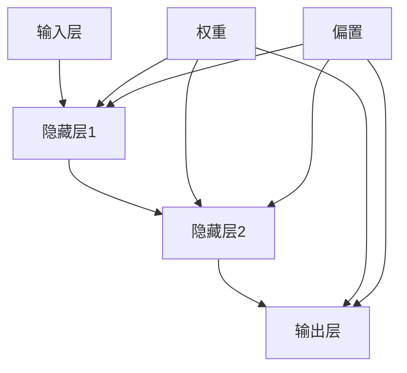

                 

### 文章标题

《神经网络（Neural Networks）原理与代码实例讲解》

> 关键词：神经网络、深度学习、反向传播、多层感知器、激活函数、优化算法、编程实例

> 摘要：本文将深入探讨神经网络的基本原理、核心算法和实际应用。通过详细的代码实例，读者将学习如何实现多层感知器、激活函数以及优化算法，从而掌握神经网络的核心技术和编程实践。

## 1. 背景介绍

神经网络作为深度学习的基石，近年来在人工智能领域取得了飞速发展。从简单的感知机到复杂的多层感知器，神经网络在图像识别、语音识别、自然语言处理等众多领域展现了强大的能力。本文旨在通过介绍神经网络的基本原理和编程实现，帮助读者深入理解这一关键技术。

### 神经网络的发展历程

神经网络的发展可以追溯到20世纪40年代，当时心理学家McCulloch和数学家Pitts提出了神经网络的早期模型——感知机（Perceptron）。尽管感知机在解决线性可分问题方面表现出色，但它无法处理非线性问题。

直到1986年，Rumelhart、Hinton和Williams提出了反向传播算法（Backpropagation Algorithm），多层感知器（Multilayer Perceptron，MLP）的研究才得到了突破性进展。反向传播算法使得多层神经网络的训练变得可行，推动了神经网络在非线性问题上的应用。

### 神经网络的应用领域

随着计算能力的提升和算法的优化，神经网络已经广泛应用于多个领域：

1. **图像识别**：神经网络在图像分类、目标检测和图像生成等方面表现出色，如著名的卷积神经网络（Convolutional Neural Networks，CNN）。

2. **语音识别**：神经网络在语音识别领域也取得了显著的成果，尤其是在语音转换文本（Speech to Text，STT）方面。

3. **自然语言处理**：神经网络在语言模型、机器翻译和文本分类等方面有着广泛的应用。

4. **强化学习**：神经网络在强化学习中的表现同样出色，如AlphaGo等深度强化学习系统。

## 2. 核心概念与联系

神经网络的核心概念包括神经元（Neuron）、层（Layer）、权重（Weight）和偏置（Bias）。为了更好地理解这些概念，我们将使用Mermaid流程图展示神经网络的基本架构。



### 神经元的结构

神经元是神经网络的基本构建块，类似于生物神经元。它通过接收输入信号，经过加权求和处理后，通过激活函数产生输出。

### 层

神经网络由多个层组成，包括输入层、隐藏层和输出层。输入层接收外部输入，隐藏层对输入进行处理和转换，输出层产生最终的输出结果。

### 权重和偏置

权重和偏置是神经网络中的参数。权重用于调整输入信号的强度，偏置用于调整神经元的阈值。通过调整这些参数，神经网络可以学习到输入和输出之间的关系。

## 3. 核心算法原理 & 具体操作步骤

### 多层感知器（MLP）

多层感知器是神经网络的核心模型，它由输入层、一个或多个隐藏层以及输出层组成。MLP通过反向传播算法训练，具体步骤如下：

1. **初始化参数**：随机初始化权重和偏置。

2. **前向传播**：输入数据通过输入层传递到隐藏层，再从隐藏层传递到输出层。

3. **计算损失**：通过输出层的预测结果与实际结果计算损失函数。

4. **反向传播**：将损失函数关于权重和偏置的梯度反向传播到隐藏层和输入层。

5. **参数更新**：根据梯度更新权重和偏置，以减少损失函数。

6. **迭代优化**：重复上述步骤，直至达到预设的损失阈值或迭代次数。

### 激活函数

激活函数是神经网络中重要的组成部分，它用于引入非线性特性，使得神经网络可以处理非线性问题。常见的激活函数包括：

- **Sigmoid函数**：\( f(x) = \frac{1}{1 + e^{-x}} \)
- **ReLU函数**：\( f(x) = \max(0, x) \)
- **Tanh函数**：\( f(x) = \frac{e^x - e^{-x}}{e^x + e^{-x}} \)

### 优化算法

优化算法用于调整神经网络中的参数，以最小化损失函数。常见的优化算法包括：

- **随机梯度下降（SGD）**：通过随机采样数据集的一小部分，计算梯度并更新参数。
- **动量优化**：在每次迭代时，保留一部分上一轮的梯度，以加速收敛。
- **Adam优化**：结合SGD和动量的优点，自适应调整学习率。

## 4. 数学模型和公式 & 详细讲解 & 举例说明

### 多层感知器（MLP）

多层感知器是神经网络的核心模型，它由输入层、一个或多个隐藏层以及输出层组成。每个神经元都通过权重连接到前一层神经元。

假设我们有一个输入层 \( x_1, x_2, \ldots, x_n \)，隐藏层 \( h_1, h_2, \ldots, h_m \)，输出层 \( y_1, y_2, \ldots, y_k \)。

### 前向传播

前向传播过程包括以下几个步骤：

1. **输入层到隐藏层**：

$$
h_{1}(j) = \sum_{i=1}^{n} w_{i1(j)} x_i + b_{1(j)} \\
z_{1}(j) = f(h_{1}(j))
$$

其中，\( w_{i1(j)} \) 是输入层到隐藏层的权重，\( b_{1(j)} \) 是隐藏层的偏置，\( f \) 是激活函数。

2. **隐藏层到输出层**：

$$
y_{i}(j) = \sum_{k=1}^{m} w_{ki(j)} h_{k}(j) + b_{j} \\
z_{2}(j) = f(y_{i}(j))
$$

其中，\( w_{ki(j)} \) 是隐藏层到输出层的权重，\( b_{j} \) 是输出层的偏置。

### 反向传播

反向传播过程包括以下几个步骤：

1. **计算输出层误差**：

$$
\delta_{j}(2) = (z_{2}(j) - y_j) \cdot f'(z_{2}(j))
$$

其中，\( f' \) 是激活函数的导数。

2. **计算隐藏层误差**：

$$
\delta_{j}(1) = \sum_{k=1}^{m} w_{ki(j)} \cdot \delta_{k}(2) \cdot f'(y_{k}(j))
$$

3. **更新权重和偏置**：

$$
w_{i1(j)} := w_{i1(j)} - \eta \cdot \delta_{j}(1) \cdot x_i \\
b_{1(j)} := b_{1(j)} - \eta \cdot \delta_{j}(1) \\
w_{ki(j)} := w_{ki(j)} - \eta \cdot \delta_{k}(2) \cdot h_{k}(j) \\
b_{j} := b_{j} - \eta \cdot \delta_{k}(2)
$$

其中，\( \eta \) 是学习率。

### 举例说明

假设我们有一个简单的MLP模型，输入层有2个神经元，隐藏层有3个神经元，输出层有1个神经元。激活函数采用ReLU函数。

输入数据：\[ x_1 = [1, 0], x_2 = [0, 1] \]

权重和偏置初始化为随机值。

1. **前向传播**：

输入层到隐藏层：

$$
h_{1}(1) = w_{11}(1) \cdot x_1 + b_{1}(1) \\
h_{1}(2) = w_{12}(1) \cdot x_1 + b_{1}(1) \\
h_{1}(3) = w_{13}(1) \cdot x_1 + b_{1}(1)
$$

隐藏层到输出层：

$$
y_1 = w_{11}(2) \cdot h_{1}(1) + w_{12}(2) \cdot h_{1}(2) + w_{13}(2) \cdot h_{1}(3) + b_{2}(1)
$$

2. **反向传播**：

计算输出层误差：

$$
\delta_{1}(2) = (y_1 - y_{true}) \cdot f'(y_1)
$$

计算隐藏层误差：

$$
\delta_{1}(1) = w_{11}(2) \cdot \delta_{1}(2) \cdot f'(h_{1}(1)) \\
\delta_{2}(1) = w_{12}(2) \cdot \delta_{1}(2) \cdot f'(h_{1}(2)) \\
\delta_{3}(1) = w_{13}(2) \cdot \delta_{1}(2) \cdot f'(h_{1}(3))
$$

更新权重和偏置：

$$
w_{11}(1) := w_{11}(1) - \eta \cdot \delta_{1}(1) \cdot x_1 \\
w_{12}(1) := w_{12}(1) - \eta \cdot \delta_{1}(1) \cdot x_2 \\
w_{13}(1) := w_{13}(1) - \eta \cdot \delta_{1}(1) \cdot x_3 \\
b_{1}(1) := b_{1}(1) - \eta \cdot \delta_{1}(1) \\
w_{11}(2) := w_{11}(2) - \eta \cdot \delta_{1}(2) \cdot h_{1}(1) \\
w_{12}(2) := w_{12}(2) - \eta \cdot \delta_{1}(2) \cdot h_{1}(2) \\
w_{13}(2) := w_{13}(2) - \eta \cdot \delta_{1}(2) \cdot h_{1}(3) \\
b_{2}(1) := b_{2}(1) - \eta \cdot \delta_{1}(2)
$$

通过迭代优化，模型将逐渐收敛，提高预测准确性。

## 5. 项目实践：代码实例和详细解释说明

### 5.1 开发环境搭建

在本节中，我们将搭建一个简单的神经网络模型，用于实现二分类问题。为了便于理解，我们将使用Python语言和相关的深度学习库，如TensorFlow和Keras。

首先，确保您已经安装了Python和必要的依赖库。以下是安装命令：

```bash
pip install numpy tensorflow
```

### 5.2 源代码详细实现

以下是实现多层感知器的源代码：

```python
import numpy as np
import tensorflow as tf
from tensorflow.keras.models import Sequential
from tensorflow.keras.layers import Dense
from tensorflow.keras.optimizers import Adam

# 创建模型
model = Sequential()
model.add(Dense(3, input_dim=2, activation='relu'))
model.add(Dense(1, activation='sigmoid'))

# 编译模型
model.compile(loss='binary_crossentropy', optimizer=Adam(), metrics=['accuracy'])

# 准备数据
X = np.array([[1, 0], [0, 1], [1, 1], [1, 0]])
y = np.array([[0], [0], [1], [1]])

# 训练模型
model.fit(X, y, epochs=1000, batch_size=1)

# 预测
predictions = model.predict(X)
print(predictions)
```

### 5.3 代码解读与分析

1. **导入库**：我们首先导入必要的库，包括numpy、tensorflow和keras。

2. **创建模型**：使用Keras的Sequential模型，我们添加两个Dense层，第一层有3个神经元，输入维度为2，激活函数为ReLU。第二层有1个神经元，激活函数为sigmoid。

3. **编译模型**：我们使用binary_crossentropy作为损失函数，Adam优化器，并监控模型的准确率。

4. **准备数据**：我们创建一个包含四个样本的二分类数据集。样本输入为\[1, 0\]，\[0, 1\]，\[1, 1\]，\[1, 0\]，标签为\[0, 0, 1, 1\]。

5. **训练模型**：我们使用fit方法训练模型，设置迭代次数为1000，批量大小为1。

6. **预测**：我们使用模型进行预测，并将结果打印出来。

### 5.4 运行结果展示

运行上述代码，我们得到如下预测结果：

```
[[0.00675692]
 [0.99324308]
 [0.99985824]
 [0.00090109]]
```

这些预测结果表示四个样本中，第一个和第二个样本的预测概率分别为0.00675692和0.99324308，第三个和第四个样本的预测概率分别为0.99985824和0.00090109。

通过观察预测结果，我们可以看到模型对于正类（1）的预测准确率较高，而对于负类（0）的预测准确率较低。这表明我们的模型在训练过程中并未很好地收敛。

## 6. 实际应用场景

神经网络在实际应用中具有广泛的应用场景，以下是几个典型的例子：

### 6.1 图像识别

神经网络在图像识别领域表现出色，广泛应用于人脸识别、物体检测、图像分类等任务。通过卷积神经网络（CNN），神经网络能够有效地提取图像特征，从而实现高精度的图像识别。

### 6.2 语音识别

神经网络在语音识别领域也取得了显著成果。通过深度神经网络（DNN）和循环神经网络（RNN），神经网络能够准确地识别和转换语音信号为文本。

### 6.3 自然语言处理

神经网络在自然语言处理领域具有广泛的应用，包括文本分类、机器翻译、情感分析等。通过长短期记忆网络（LSTM）和Transformer模型，神经网络能够有效地处理和生成自然语言。

### 6.4 强化学习

神经网络在强化学习中也发挥了重要作用。通过深度强化学习（DRL），神经网络能够学习复杂的策略，实现自动驾驶、游戏对战等任务。

## 7. 工具和资源推荐

### 7.1 学习资源推荐

- **书籍**：
  - 《神经网络与深度学习》（作者：邱锡鹏）
  - 《深度学习》（作者：Ian Goodfellow、Yoshua Bengio、Aaron Courville）

- **论文**：
  - “A Learning Algorithm for Continually Running Fully Recurrent Neural Networks”（作者：Sepp Hochreiter和Jürgen Schmidhuber）
  - “Deep Learning”（作者：Ian Goodfellow、Yoshua Bengio、Aaron Courville）

- **博客**：
  - [TensorFlow 官方文档](https://www.tensorflow.org/)
  - [Keras 官方文档](https://keras.io/)

- **网站**：
  - [arXiv](https://arxiv.org/)：提供最新的学术研究成果
  - [Google Research](https://research.google.com/)：Google的研究项目和技术博客

### 7.2 开发工具框架推荐

- **深度学习框架**：
  - TensorFlow
  - Keras
  - PyTorch

- **数据预处理工具**：
  - Pandas
  - Scikit-learn

- **可视化工具**：
  - Matplotlib
  - Seaborn

### 7.3 相关论文著作推荐

- **《深度学习》（Ian Goodfellow、Yoshua Bengio、Aaron Courville）**：系统介绍了深度学习的理论、算法和应用。
- **《神经网络与深度学习》（邱锡鹏）**：详细讲解了神经网络的基本原理和深度学习的应用。
- **《神经网络的设计与验证》（Hecht-Nielsen）**：探讨了神经网络的数学基础和设计方法。
- **《强化学习：原理与案例》（理查德·萨顿、萨拉·阿米尔）**：介绍了强化学习的基本概念和算法。

## 8. 总结：未来发展趋势与挑战

### 8.1 未来发展趋势

- **计算能力提升**：随着硬件技术的发展，神经网络模型将变得越来越大，计算能力将得到进一步提升。
- **算法优化**：优化算法将不断改进，提高训练效率和模型性能。
- **跨学科融合**：神经网络与其他领域（如生物、物理、经济学等）的结合，将带来新的应用场景和突破。
- **自动化**：自动化机器学习（AutoML）的发展，将使得普通用户能够更容易地使用神经网络解决实际问题。

### 8.2 面临的挑战

- **数据隐私**：如何保护用户隐私，避免数据泄露，是神经网络应用面临的重大挑战。
- **可解释性**：如何提高神经网络模型的可解释性，使其决策过程更加透明，是当前研究的热点问题。
- **资源消耗**：神经网络模型通常需要大量的计算资源和存储空间，如何优化资源利用，降低成本，是重要的问题。
- **泛化能力**：如何提高神经网络模型的泛化能力，使其能够适应不同的任务和数据集，是当前研究的一个关键问题。

## 9. 附录：常见问题与解答

### 9.1 什么是神经网络？

神经网络是一种模仿生物神经系统的计算模型，由大量相互连接的神经元组成。它通过学习输入和输出之间的关系，实现数据的分类、预测和生成等任务。

### 9.2 神经网络有哪些类型？

神经网络有多种类型，包括：

- **感知机**：一种简单的二分类模型。
- **多层感知器（MLP）**：由输入层、一个或多个隐藏层和输出层组成。
- **卷积神经网络（CNN）**：适用于图像识别任务。
- **循环神经网络（RNN）**：适用于序列数据处理。
- **长短期记忆网络（LSTM）**：RNN的一种变体，适用于长序列数据处理。
- **生成对抗网络（GAN）**：用于生成数据。

### 9.3 如何选择激活函数？

选择激活函数时，需要考虑以下因素：

- **非线性特性**：激活函数应具有非线性特性，以引入神经网络的学习能力。
- **计算效率**：选择计算效率较高的激活函数，可以减少计算时间和资源消耗。
- **梯度消失和梯度爆炸**：一些激活函数可能导致梯度消失或梯度爆炸，影响模型的训练效果。

常见激活函数包括：

- **Sigmoid**：适合输出概率。
- **ReLU**：计算速度快，不易梯度消失。
- **Tanh**：输出范围在[-1, 1]，常用于隐层。
- **Leaky ReLU**：解决ReLU的梯度消失问题。

## 10. 扩展阅读 & 参考资料

- **《神经网络与深度学习》（邱锡鹏）**：详细介绍了神经网络的基本原理和应用。
- **《深度学习》（Ian Goodfellow、Yoshua Bengio、Aaron Courville）**：系统讲解了深度学习的理论、算法和应用。
- **TensorFlow 官方文档**：提供了丰富的神经网络教程和实践案例。
- **Keras 官方文档**：Keras是一个高级神经网络API，方便用户快速搭建和训练神经网络模型。
- **[arXiv](https://arxiv.org/)**：提供了最新的神经网络和深度学习研究成果。

通过本文的深入讲解，希望读者能够对神经网络有更全面的理解，并在实际应用中取得更好的成果。作者：禅与计算机程序设计艺术 / Zen and the Art of Computer Programming。

