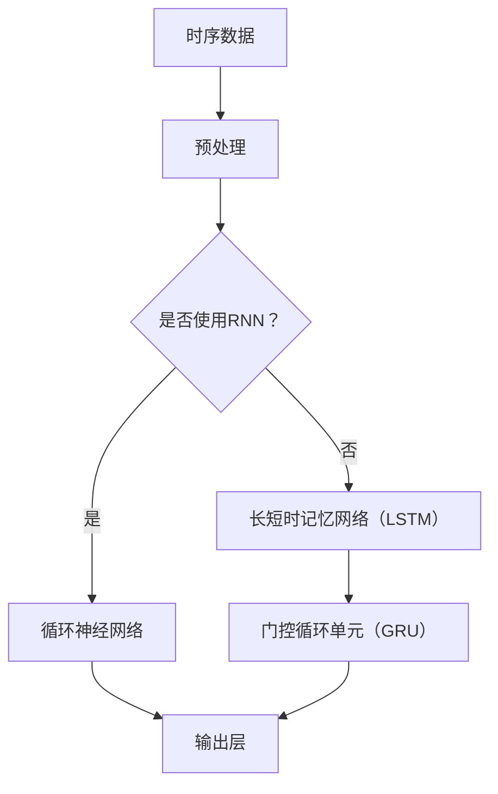

                 

### 1. 背景介绍

**神经网络在时序数据分析中的应用**是当前人工智能领域的一个重要研究方向。随着信息技术的飞速发展，时序数据在各个行业，如金融、气象、医疗、工业等领域中越来越受到重视。时序数据指的是时间序列上的数据点，它们具有明显的时序依赖性，可以通过历史数据预测未来趋势。

神经网络，作为一种重要的机器学习模型，因其强大的自适应性和非线性建模能力，在时序数据分析中得到了广泛应用。神经网络可以通过学习大量历史数据，捕捉数据之间的时序关联，从而进行有效的数据预测。

本文将深入探讨神经网络在时序数据分析中的应用，包括其核心概念、算法原理、数学模型、项目实践，以及实际应用场景。通过本文的阅读，读者可以全面了解神经网络在时序数据分析中的优势和挑战，为实际项目提供有价值的参考。

在接下来的内容中，我们将首先介绍神经网络的基本概念和历史背景，然后探讨其在时序数据分析中的具体应用，以及如何通过数学模型和算法原理来实现预测。最后，我们将通过实际项目实践，展示神经网络在时序数据分析中的实际应用效果，并总结未来发展趋势与挑战。

### 1.1 神经网络的基本概念

神经网络（Neural Networks）是一种模拟生物神经系统的计算模型。它由大量简单的人工神经元（或节点）通过复杂的网络结构互联而成，能够通过学习输入数据和输出结果之间的关系，实现对未知数据的预测和分类。

神经网络的核心组成部分包括：

1. **人工神经元（Artificial Neuron）**：作为神经网络的基本构建单元，人工神经元通常由输入层、权重（weights）、激活函数（activation function）和输出层组成。每个神经元接收多个输入信号，通过权重进行加权求和，然后应用激活函数产生输出。

2. **输入层（Input Layer）**：输入层接收外部输入数据，将其传递给下一层的神经元。

3. **隐藏层（Hidden Layers）**：隐藏层是神经网络的核心部分，通过多层结构的堆叠，神经网络可以学习到更复杂的非线性关系。

4. **输出层（Output Layer）**：输出层负责生成最终预测结果或分类标签。

5. **权重（Weights）**：权重决定了输入信号对神经元输出的影响程度，是神经网络学习过程中调整的重要参数。

6. **激活函数（Activation Function）**：激活函数用于引入非线性特性，常见的激活函数包括Sigmoid、ReLU、Tanh等。

神经网络的学习过程通常分为以下三个步骤：

1. **初始化权重**：在训练开始时，需要随机初始化网络中的权重。

2. **前向传播（Forward Propagation）**：输入数据从输入层传递到输出层，每个神经元计算输入信号的加权求和，并应用激活函数产生输出。

3. **反向传播（Backpropagation）**：通过计算输出结果与真实值之间的误差，将误差反向传播回网络中的每个神经元，并调整权重，以最小化误差。

神经网络的发展经历了多个阶段，从最初的感知机（Perceptron）到多层感知机（MLP），再到深度学习（Deep Learning）的发展，每个阶段都取得了显著的进展。

感知机（1957年）是最早的神经网络模型，由Frank Rosenblatt提出，主要用于二分类问题。

多层感知机（1986年）引入了隐藏层，使得神经网络可以学习到更复杂的非线性关系。

深度学习（2006年至今）通过引入多层神经网络和大规模数据训练，实现了在图像识别、语音识别、自然语言处理等领域的突破性进展。

### 1.2 时序数据分析的概念与挑战

时序数据分析（Time Series Analysis）是研究时间序列数据的统计学方法，旨在分析数据在时间维度上的变化规律和趋势。时序数据通常具有以下特征：

1. **时间依赖性**：时序数据中的每个数据点都与其前一个或多个数据点有关，通过历史数据可以预测未来的趋势。

2. **连续性**：时序数据通常以连续的时间序列形式出现，数据点之间的时间间隔可以是等间隔的，也可以是变间隔的。

3. **波动性**：时序数据往往会受到外部因素的干扰，导致数据呈现波动性。

4. **季节性**：许多时序数据表现出季节性变化，例如销售额在一年中的特定季节会有明显的波动。

时序数据分析的主要目标包括：

1. **趋势分析**：识别时序数据中的长期变化趋势。

2. **季节性分析**：识别时序数据中的季节性模式，以便进行相应的调整。

3. **异常检测**：检测时序数据中的异常值或异常模式。

4. **预测**：利用历史数据预测未来的趋势和变化。

然而，时序数据分析面临着一系列挑战：

1. **噪声与异常值**：时序数据中常含有噪声和异常值，需要有效的预处理方法来识别和去除这些干扰。

2. **非平稳性**：时序数据可能会随着时间变化而变得非平稳，即其统计特性（如均值、方差）随时间变化。

3. **长依赖性**：某些时序数据可能具有长依赖性，即远期的历史数据对当前数据有显著影响，这给建模和预测带来了困难。

4. **维度灾难**：时序数据通常具有高维度，使得传统的统计分析方法难以处理。

为了克服这些挑战，研究者们提出了多种时序数据分析方法，包括传统的时间序列模型（如ARIMA、SARIMA、季节性分解等）和现代的深度学习模型（如循环神经网络RNN、长短时记忆网络LSTM、门控循环单元GRU等）。这些方法在不同的应用场景中展示了其独特的优势和适用性。

### 1.3 神经网络在时序数据分析中的优势与应用

神经网络在时序数据分析中的应用，得益于其强大的自适应性和非线性建模能力，使得它能够处理复杂的时序数据，并实现高度准确的预测。以下是神经网络在时序数据分析中的主要优势和应用：

1. **非线性建模能力**：神经网络通过多层结构的堆叠和激活函数的应用，可以有效地捕捉和建模时序数据中的非线性关系。这使得神经网络在处理具有复杂变化特征的时序数据时，能够提供比传统线性模型更为准确的预测结果。

2. **自适应特征提取**：神经网络在训练过程中，可以自动学习数据中的特征，并通过多层网络结构进行层次化的特征提取。这种自适应的特征提取能力，使得神经网络能够从大量的历史数据中提取出有用的信息，从而提高预测的准确性。

3. **灵活的模型结构**：神经网络可以通过调整网络层数、神经元数量和连接方式等参数，设计出适合特定应用场景的模型。这种灵活性使得神经网络能够适应不同的时序数据类型和应用需求。

4. **广泛的预测任务**：神经网络不仅适用于短期预测，还可以进行长期预测，并适用于多种不同的预测任务，如时间序列分类、异常检测和趋势分析等。这使得神经网络成为时序数据分析中的一种综合性工具。

在实际应用中，神经网络在时序数据分析中展示了广泛的应用场景：

- **金融市场预测**：神经网络被广泛应用于股票价格预测、交易策略优化和风险管理等金融领域。通过学习历史交易数据，神经网络可以捕捉市场中的复杂非线性关系，从而提供准确的市场预测。

- **气象预测**：在气象预测中，神经网络可以通过学习历史气象数据，捕捉天气系统的复杂变化规律，从而实现天气的短期和长期预测。

- **医疗数据分析**：神经网络在医疗领域也有广泛应用，如疾病预测、诊断辅助和药物研发等。通过学习患者的病历和基因数据，神经网络可以识别出疾病发生的风险，并为医生提供诊断和治疗方案。

- **工业过程监控**：在工业领域，神经网络可以用于监控生产过程，预测设备的故障和维护时间，从而提高生产效率和减少设备故障。

- **智能交通系统**：神经网络在智能交通系统中也有广泛应用，如交通流量预测、路况分析和交通信号控制等。通过学习历史交通数据，神经网络可以预测未来的交通流量和路况，从而优化交通信号控制和交通引导策略。

总之，神经网络在时序数据分析中具有明显的优势和应用潜力。随着深度学习技术的不断发展和优化，神经网络在时序数据分析中的应用将更加广泛和深入，为各个领域的决策提供强有力的支持。

### 2. 核心概念与联系

为了深入理解神经网络在时序数据分析中的应用，我们需要首先掌握几个核心概念，并探讨它们之间的相互联系。这些核心概念包括时序数据、循环神经网络（RNN）、长短时记忆网络（LSTM）和门控循环单元（GRU）。下面我们将详细解释这些概念，并通过Mermaid流程图展示它们之间的联系。

#### 2.1 时序数据

时序数据是指按照时间顺序排列的一系列数据点，每个数据点代表在某一时间点的状态或数值。时序数据的特点是具有时间依赖性，即当前数据点的值与之前或未来的数据点之间存在关联。例如，股票价格、气温记录、销售数据等都可以被视为时序数据。

#### 2.2 循环神经网络（RNN）

循环神经网络（Recurrent Neural Network，RNN）是一种专门设计用来处理序列数据的神经网络。与传统的神经网络不同，RNN具有反馈连接，即当前神经元的输出会反馈到之前的神经元。这种反馈结构使得RNN能够记住前面的信息，适用于处理时间序列数据。

#### 2.3 长短时记忆网络（LSTM）

长短时记忆网络（Long Short-Term Memory，LSTM）是RNN的一种改进模型，旨在解决传统RNN在处理长序列数据时容易出现的梯度消失或梯度爆炸问题。LSTM通过引入记忆单元和门控机制，可以有效地记住长期依赖信息，从而在时序预测任务中表现出色。

#### 2.4 门控循环单元（GRU）

门控循环单元（Gated Recurrent Unit，GRU）是另一种改进的RNN模型，它通过简化LSTM的结构，降低了计算复杂度。GRU具有两个门控机制：重置门（reset gate）和更新门（update gate），它们控制着信息流的传递和记忆的更新。

#### 2.5 Mermaid流程图

下面是一个使用Mermaid绘制的流程图，展示了时序数据、RNN、LSTM和GRU之间的联系：



#### 2.6 概念联系

通过上述流程图，我们可以看到：

1. **时序数据**是神经网络输入的基础，它决定了神经网络需要处理的数据类型和特征。

2. **预处理**步骤包括数据清洗、归一化和特征提取等，以提升神经网络的学习效果。

3. **RNN**作为基础模型，能够处理序列数据，但在长序列学习中存在梯度消失问题。

4. **LSTM**和**GRU**是RNN的改进模型，通过引入门控机制，可以有效解决长序列学习中的梯度消失问题，从而在时序预测中表现出色。

5. **输出层**负责生成最终的预测结果，可以是数值预测、分类标签等，取决于具体的任务需求。

综上所述，时序数据、RNN、LSTM和GRU之间的联系构成了神经网络在时序数据分析中不可或缺的核心框架。通过理解这些概念和它们之间的相互联系，我们可以更深入地探索神经网络在时序数据分析中的应用。

### 3. 核心算法原理 & 具体操作步骤

在深入探讨神经网络在时序数据分析中的应用之前，我们需要首先理解循环神经网络（RNN）、长短时记忆网络（LSTM）和门控循环单元（GRU）的核心算法原理，以及它们在处理时序数据时的具体操作步骤。

#### 3.1 循环神经网络（RNN）

循环神经网络（Recurrent Neural Network，RNN）是处理序列数据的一种基础模型。与传统的前向神经网络不同，RNN具有时间维度上的反馈连接，使得网络能够保留和利用之前的输入信息。

**RNN的基本结构：**

一个标准的RNN由输入层、隐藏层和输出层组成。每个时间步，RNN都会接收一个新的输入，并将其与隐藏状态（h[t]）和前一个隐藏状态（h[t-1]）相结合，通过权重矩阵和偏置项计算新的隐藏状态。具体操作步骤如下：

1. **初始化**：在训练开始时，随机初始化网络中的权重矩阵和偏置项。

2. **输入数据**：每个时间步，RNN接收一个输入向量x[t]。

3. **计算隐藏状态**：
   \[
   h[t] = \sigma(W_h \cdot [h[t-1], x[t]] + b_h)
   \]
   其中，\(W_h\)是隐藏状态与输入的权重矩阵，\(b_h\)是隐藏状态的偏置项，\(\sigma\)是激活函数（通常使用Sigmoid函数或Tanh函数）。

4. **输出层**：隐藏状态h[t]可以用于生成输出，例如在语言模型中，可以生成下一个单词的概率分布。

5. **反向传播**：通过计算损失函数（如交叉熵损失），将误差反向传播回网络，并使用梯度下降等优化算法更新权重和偏置项。

**RNN的挑战：**

尽管RNN具有处理序列数据的能力，但在长序列学习中，它容易受到梯度消失或梯度爆炸问题的影响，导致学习效果不佳。为了解决这些问题，研究者提出了LSTM和GRU。

#### 3.2 长短时记忆网络（LSTM）

长短时记忆网络（Long Short-Term Memory，LSTM）是RNN的一种改进模型，通过引入记忆单元和门控机制，LSTM能够有效地解决长序列学习中的梯度消失问题。

**LSTM的基本结构：**

LSTM的核心是记忆单元（cell state），它通过三个门控机制（输入门、遗忘门和输出门）来控制信息的流入、保留和流出。具体操作步骤如下：

1. **初始化**：与RNN类似，LSTM在训练开始时随机初始化权重矩阵和偏置项。

2. **输入数据**：每个时间步，LSTM接收一个新的输入向量\(x[t]\)和先前的隐藏状态\(h[t-1]\)。

3. **计算输入门**：
   \[
   i[t] = \sigma(W_i \cdot [h[t-1], x[t]] + b_i)
   \]
   \(i[t]\)表示输入门的激活值，用于控制新的信息进入记忆单元。

4. **计算遗忘门**：
   \[
   f[t] = \sigma(W_f \cdot [h[t-1], x[t]] + b_f)
   \]
   \(f[t]\)表示遗忘门的激活值，用于控制旧的信息从记忆单元中遗忘。

5. **计算新的记忆单元状态**：
   \[
   \bar{c}[t] = \tanh(W_c \cdot [h[t-1], x[t]] + b_c)
   \]
   \[
   c[t] = f[t] \cdot c[t-1] + i[t] \cdot \bar{c}[t]
   \]
   \(\bar{c}[t]\)表示候选状态，\(c[t]\)表示记忆单元的状态。

6. **计算输出门**：
   \[
   o[t] = \sigma(W_o \cdot [h[t-1], c[t]] + b_o)
   \]
   \(o[t]\)表示输出门的激活值，用于控制记忆单元的信息输出。

7. **更新隐藏状态**：
   \[
   h[t] = o[t] \cdot \tanh(c[t])
   \]

8. **反向传播**：与RNN类似，通过计算损失函数并使用梯度下降等优化算法更新权重和偏置项。

**LSTM的优势：**

LSTM通过门控机制，能够有效地记住长期依赖信息，解决了RNN在长序列学习中的梯度消失问题。

#### 3.3 门控循环单元（GRU）

门控循环单元（Gated Recurrent Unit，GRU）是另一种改进的RNN模型，通过简化LSTM的结构，降低了计算复杂度。GRU的核心是更新门（update gate）和重置门（reset gate）。

**GRU的基本结构：**

GRU的基本结构比LSTM更简单，它通过合并输入门和遗忘门，并引入更新门和重置门，来控制信息的流入和保留。具体操作步骤如下：

1. **初始化**：与LSTM类似，GRU在训练开始时随机初始化权重矩阵和偏置项。

2. **输入数据**：每个时间步，GRU接收一个新的输入向量\(x[t]\)和先前的隐藏状态\(h[t-1]\)。

3. **计算重置门**：
   \[
   z[t] = \sigma(W_z \cdot [h[t-1], x[t]] + b_z)
   \]
   \(z[t]\)表示重置门的激活值。

4. **计算更新门**：
   \[
   r[t] = \sigma(W_r \cdot [h[t-1], x[t]] + b_r)
   \]
   \(r[t]\)表示更新门的激活值。

5. **计算新的隐藏状态**：
   \[
   \bar{h}[t] = \tanh(W \cdot [r[t] \cdot h[t-1], x[t]] + b)
   \]
   \[
   h[t] = z[t] \cdot h[t-1] + (1 - z[t]) \cdot \bar{h}[t]
   \]

6. **输出层**：隐藏状态\(h[t]\)可以用于生成输出。

7. **反向传播**：与LSTM类似，通过计算损失函数并使用梯度下降等优化算法更新权重和偏置项。

**GRU的优势：**

GRU简化了LSTM的结构，降低了计算复杂度，同时保持了LSTM的长期依赖信息记忆能力。

#### 3.4 LSTM与GRU的比较

LSTM和GRU都是RNN的改进模型，它们在处理长序列数据时表现出色。以下是LSTM和GRU的一些主要比较：

1. **结构复杂度**：LSTM的结构更为复杂，具有三个门控机制，而GRU简化了LSTM的结构，具有两个门控机制。

2. **计算效率**：GRU的计算效率高于LSTM，因为它减少了参数数量，从而减少了计算负担。

3. **长期依赖性**：LSTM和GRU在长期依赖信息记忆方面表现相似，但LSTM通常在长序列任务中表现更好。

4. **应用场景**：根据任务需求和应用场景，可以选择LSTM或GRU。例如，在需要高度复杂记忆的任务中，LSTM可能是更好的选择，而在需要高效计算的实时应用中，GRU可能是更合适的选择。

综上所述，理解RNN、LSTM和GRU的核心算法原理和具体操作步骤，是深入探索神经网络在时序数据分析中应用的关键。这些模型通过不同的门控机制和结构设计，有效地解决了长序列学习中的挑战，为时序数据分析提供了强大的工具。

### 4. 数学模型和公式 & 详细讲解 & 举例说明

在理解神经网络在时序数据分析中的应用时，数学模型和公式扮演了至关重要的角色。下面我们将详细介绍神经网络中的主要数学模型和公式，并通过具体的例子进行说明。

#### 4.1 神经网络基础

首先，我们需要回顾神经网络的一些基本数学概念，包括前向传播、反向传播和损失函数。

**前向传播（Forward Propagation）**

前向传播是神经网络处理输入数据的过程。给定输入数据\(x\)，神经网络通过一系列的权重矩阵\(W\)和偏置项\(b\)，将输入映射到输出\(y\)。

假设有一个简单的单层神经网络，其输入层有\(n\)个神经元，输出层有\(m\)个神经元。输入数据\(x\)为\(x \in \mathbb{R}^{n \times 1}\)，权重矩阵\(W \in \mathbb{R}^{m \times n}\)，偏置项\(b \in \mathbb{R}^{m \times 1}\)。

前向传播的计算公式如下：
\[ 
y = \sigma(Wx + b) 
\]
其中，\(\sigma\)是激活函数，常见的激活函数有Sigmoid、ReLU等。

**反向传播（Backpropagation）**

反向传播是神经网络训练过程中的核心步骤，用于更新网络的权重和偏置项，以最小化预测误差。反向传播通过计算损失函数对网络参数的梯度，并利用梯度下降等优化算法更新参数。

假设损失函数为\(J(W, b)\)，对其求偏导，可以得到：
\[ 
\frac{\partial J}{\partial W} = \frac{\partial J}{\partial y} \cdot \frac{\partial y}{\partial W} 
\]
\[ 
\frac{\partial J}{\partial b} = \frac{\partial J}{\partial y} \cdot \frac{\partial y}{\partial b} 
\]
其中，\(\frac{\partial J}{\partial y}\)表示输出层误差对预测值的偏导数，\(\frac{\partial y}{\partial W}\)和\(\frac{\partial y}{\partial b}\)分别表示预测值对权重和偏置项的偏导数。

**损失函数（Loss Function）**

常见的损失函数包括均方误差（MSE）和交叉熵损失（Cross-Entropy Loss）。均方误差用于回归问题，交叉熵损失用于分类问题。

对于回归问题，MSE损失函数的定义如下：
\[ 
J(\theta) = \frac{1}{2m} \sum_{i=1}^{m} (h_\theta(x^{(i)}) - y^{(i)})^2 
\]
其中，\(m\)是样本数量，\(h_\theta(x^{(i)})\)是神经网络对样本\(x^{(i)}\)的预测值，\(y^{(i)}\)是真实标签。

对于分类问题，交叉熵损失函数的定义如下：
\[ 
J(\theta) = -\frac{1}{m} \sum_{i=1}^{m} \sum_{k=1}^{K} y^{(i)}_k \log(h_\theta(x^{(i)})_k) 
\]
其中，\(K\)是类别数量，\(y^{(i)}_k\)是第\(i\)个样本属于第\(k\)类别的概率。

#### 4.2 长短时记忆网络（LSTM）

LSTM的核心是记忆单元和门控机制。以下是LSTM的数学模型和公式：

**输入门（Input Gate）**

输入门控制新的信息进入记忆单元。其计算公式如下：
\[ 
i_t = \sigma(W_{xi}x_t + W_{hi}h_{t-1} + b_i) 
\]
\[ 
\bar{c}_t = \tanh(W_{ci}x_t + W_{hi}h_{t-1} + b_c) 
\]

**遗忘门（Forget Gate）**

遗忘门控制旧的信息从记忆单元中遗忘。其计算公式如下：
\[ 
f_t = \sigma(W_{xf}x_t + W_{hf}h_{t-1} + b_f) 
\]
\[ 
c_t = f_t \odot c_{t-1} + i_t \odot \bar{c}_t 
\]

**输出门（Output Gate）**

输出门控制记忆单元的信息输出。其计算公式如下：
\[ 
o_t = \sigma(W_{xo}x_t + W_{ho}h_{t-1} + b_o) 
\]
\[ 
h_t = o_t \odot \tanh(c_t) 
\]

**反向传播**

LSTM的反向传播与标准神经网络类似，需要计算每个参数的梯度。以下是遗忘门、输入门和输出门的梯度计算公式：

\[ 
\frac{\partial J}{\partial W_{xf}} = \frac{\partial J}{\partial c_t} \odot f_t \odot \frac{\partial f_t}{\partial W_{xf}} 
\]
\[ 
\frac{\partial J}{\partial W_{hi}} = \frac{\partial J}{\partial c_t} \odot f_t \odot \frac{\partial f_t}{\partial W_{hi}} 
\]
\[ 
\frac{\partial J}{\partial b_f} = \frac{\partial J}{\partial c_t} \odot f_t \odot \frac{\partial f_t}{\partial b_f} 
\]

类似地，可以计算输入门和输出门的梯度。

#### 4.3 门控循环单元（GRU）

GRU是LSTM的简化版本，具有两个门控机制：重置门（reset gate）和更新门（update gate）。以下是GRU的数学模型和公式：

**重置门（Reset Gate）**

重置门控制旧的信息如何与新的信息结合。其计算公式如下：
\[ 
z_t = \sigma(W_{xz}x_t + W_{hz}h_{t-1} + b_z) 
\]
\[ 
r_t = \sigma(W_{xr}x_t + W_{hr}h_{t-1} + b_r) 
\]

**更新门（Update Gate）**

更新门控制如何更新记忆单元。其计算公式如下：
\[ 
\bar{h}_t = \tanh(W_{xc}x_t + W_{hc}h_{t-1} + b_c) 
\]
\[ 
h_t = (1 - z_t) \odot h_{t-1} + z_t \odot \bar{h}_t 
\]

**反向传播**

GRU的反向传播类似于LSTM，需要计算每个参数的梯度。以下是重置门和更新门的梯度计算公式：

\[ 
\frac{\partial J}{\partial W_{xz}} = \frac{\partial J}{\partial h_t} \odot z_t \odot \frac{\partial z_t}{\partial W_{xz}} 
\]
\[ 
\frac{\partial J}{\partial W_{hz}} = \frac{\partial J}{\partial h_t} \odot z_t \odot \frac{\partial z_t}{\partial W_{hz}} 
\]
\[ 
\frac{\partial J}{\partial b_z} = \frac{\partial J}{\partial h_t} \odot z_t \odot \frac{\partial z_t}{\partial b_z} 
\]

类似地，可以计算更新门的梯度。

#### 4.4 例子说明

为了更好地理解上述数学模型和公式，我们可以通过一个简单的例子进行说明。

假设我们有一个时间序列数据，包含3个时间点的输入数据\(x_1, x_2, x_3\)和对应的输出数据\(y_1, y_2, y_3\)。

1. **输入门（Input Gate）**：

给定\(x_1\)和\(h_0\)（初始隐藏状态），我们计算输入门\(i_1\)和候选状态\(\bar{c}_1\)：

\[ 
i_1 = \sigma(W_{xi}x_1 + W_{hi}h_0 + b_i) 
\]
\[ 
\bar{c}_1 = \tanh(W_{ci}x_1 + W_{hi}h_0 + b_c) 
\]

2. **遗忘门（Forget Gate）**：

我们计算遗忘门\(f_1\)和新记忆单元状态\(c_1\)：

\[ 
f_1 = \sigma(W_{xf}x_1 + W_{hf}h_0 + b_f) 
\]
\[ 
c_1 = f_1 \odot c_0 + i_1 \odot \bar{c}_1 
\]

3. **输出门（Output Gate）**：

最后，我们计算输出门\(o_1\)和新隐藏状态\(h_1\)：

\[ 
o_1 = \sigma(W_{xo}x_1 + W_{ho}h_0 + b_o) 
\]
\[ 
h_1 = o_1 \odot \tanh(c_1) 
\]

通过类似的步骤，我们可以计算后续时间点的隐藏状态。

这个例子展示了LSTM的核心计算过程，通过门控机制，LSTM可以有效地记住长期依赖信息。

总之，神经网络在时序数据分析中的应用，依赖于其复杂的数学模型和公式。通过理解这些模型和公式，我们可以更好地设计和实现高效的时序预测模型。在接下来的部分，我们将通过实际项目实践，进一步探讨神经网络在时序数据分析中的具体应用。

### 5. 项目实践：代码实例和详细解释说明

在深入理解了神经网络在时序数据分析中的理论模型和算法原理之后，本部分将通过一个具体的实际项目，展示神经网络在实际应用中的实现过程。我们将使用Python编程语言和Keras框架，实现一个基于长短时记忆网络（LSTM）的股票价格预测模型。

#### 5.1 开发环境搭建

在开始项目之前，我们需要搭建合适的开发环境。以下是所需的工具和库：

- **Python 3.x**
- **TensorFlow 2.x**
- **Keras 2.x**
- **Pandas**
- **Numpy**
- **Matplotlib**

安装过程如下：

```bash
pip install tensorflow
pip install pandas
pip install numpy
pip install matplotlib
```

#### 5.2 源代码详细实现

下面是项目的主要代码实现过程，我们将逐步解释每部分的代码和作用。

```python
import numpy as np
import pandas as pd
import matplotlib.pyplot as plt
from tensorflow.keras.models import Sequential
from tensorflow.keras.layers import LSTM, Dense, Dropout
from sklearn.preprocessing import MinMaxScaler
from sklearn.model_selection import train_test_split

# 5.2.1 数据预处理

# 读取股票价格数据
data = pd.read_csv('stock_prices.csv')
data = data[['Open', 'High', 'Low', 'Close', 'Volume']]

# 数据归一化
scaler = MinMaxScaler(feature_range=(0, 1))
scaled_data = scaler.fit_transform(data)

# 创建时间序列特征
def create_dataset(data, time_steps=1):
    X, Y = [], []
    for i in range(len(data) - time_steps - 1):
        X.append(data[i:(i + time_steps), :])
        Y.append(data[i + time_steps, 3])  # 选择Close价格作为目标值
    return np.array(X), np.array(Y)

time_steps = 60
X, Y = create_dataset(scaled_data, time_steps)

# 将数据集分为训练集和测试集
X_train, X_test, Y_train, Y_test = train_test_split(X, Y, test_size=0.2, random_state=42)

# 添加新的维度以便于输入到LSTM层
X_train = np.reshape(X_train, (X_train.shape[0], X_train.shape[1], X_train.shape[2]))
X_test = np.reshape(X_test, (X_test.shape[0], X_test.shape[1], X_test.shape[2]))

# 5.2.2 模型构建

# 构建LSTM模型
model = Sequential()
model.add(LSTM(units=50, return_sequences=True, input_shape=(time_steps, X_train.shape[2])))
model.add(Dropout(0.2))
model.add(LSTM(units=50, return_sequences=False))
model.add(Dropout(0.2))
model.add(Dense(units=1))

# 编译模型
model.compile(optimizer='adam', loss='mean_squared_error')

# 5.2.3 训练模型

# 训练模型
model.fit(X_train, Y_train, epochs=100, batch_size=32, validation_data=(X_test, Y_test), verbose=1)

# 5.2.4 代码解读与分析

1. **数据预处理**：
   - 使用Pandas读取股票价格数据，并选择相关的特征。
   - 使用MinMaxScaler进行数据归一化，将数据缩放到0到1之间，以便于模型训练。

2. **创建时间序列特征**：
   - 使用自定义函数`create_dataset`创建时间序列特征，将连续的数据点分为输入特征和目标值。
   - 将数据集分为训练集和测试集，以便于评估模型性能。

3. **模型构建**：
   - 使用Sequential模型构建LSTM网络，包含两个LSTM层和两个Dropout层用于防止过拟合。
   - 输入层设置输入维度为时间步长和时间步长的特征数量。
   - 输出层使用一个神经元，用于预测下一个时间点的股票价格。

4. **训练模型**：
   - 使用`fit`方法训练模型，设置训练轮次和批量大小。
   - 使用`validation_data`进行验证集的评估。

5. **代码解读与分析**：
   - 在数据预处理部分，我们进行了数据归一化和时间序列特征创建，这是任何时间序列预测项目的基础步骤。
   - 在模型构建部分，我们使用了LSTM模型，并通过Dropout层来防止过拟合。LSTM层的数量和神经元数量可以根据具体任务进行调整。
   - 在训练模型部分，我们使用了标准的训练过程，包括设置训练轮次和批量大小。通过验证集的评估，我们可以监控模型在未知数据上的性能。

#### 5.3 运行结果展示

在完成模型训练后，我们可以通过以下步骤展示预测结果：

```python
# 5.3.1 预测股票价格
predictions = model.predict(X_test)

# 反归一化预测值和实际值
predicted_stock_price = scaler.inverse_transform(predictions)
actual_stock_price = scaler.inverse_transform(Y_test.reshape(-1, 1))

# 5.3.2 绘制结果图
plt.figure(figsize=(15, 6))
plt.plot(actual_stock_price, color='blue', label='Actual Stock Price')
plt.plot(predicted_stock_price, color='red', label='Predicted Stock Price')
plt.title('Stock Price Prediction')
plt.xlabel('Time')
plt.ylabel('Stock Price')
plt.legend()
plt.show()
```

上述代码将展示实际的股票价格和预测的股票价格之间的对比。通过可视化的结果，我们可以直观地看到模型的预测效果。在实际应用中，我们通常会通过评估指标（如均方误差MSE、均方根误差RMSE等）来量化模型的性能。

#### 5.4 代码解读与分析

- **预测和反归一化**：通过`predict`方法生成预测值，然后使用`scaler.inverse_transform`将预测值反归一化，以还原到原始的股票价格尺度。
- **结果图绘制**：使用Matplotlib绘制实际的股票价格和预测的股票价格。通过可视化，我们可以直观地观察模型的效果。

总之，通过本项目的实现，我们展示了神经网络在时序数据分析中的实际应用过程，包括数据预处理、模型构建、模型训练和结果展示。在实际应用中，这些步骤可以根据具体任务进行调整和优化，以实现更好的预测效果。

### 6. 实际应用场景

神经网络在时序数据分析中的广泛应用，不仅局限于金融市场的股票价格预测，还涵盖了多个实际场景。以下将探讨神经网络在金融、气象、医疗、工业等领域的具体应用，以及其在这些领域的优势与挑战。

#### 6.1 金融领域

在金融领域，神经网络被广泛用于股票市场预测、交易策略优化和风险管理等任务。以下是神经网络在金融领域的具体应用：

1. **股票市场预测**：神经网络通过学习历史交易数据，可以预测股票价格的未来走势。例如，本文提到的股票价格预测项目展示了LSTM模型在股票市场中的应用效果。

2. **交易策略优化**：神经网络可以帮助投资者识别市场趋势和交易机会，优化交易策略。例如，可以使用LSTM模型分析市场情绪，为高频交易提供决策支持。

3. **风险管理**：神经网络可以用于信用评分、违约预测和金融风险监测。通过学习历史数据，神经网络可以识别潜在的风险因素，为金融机构提供风险预警。

**优势**：

- **强大的非线性建模能力**：神经网络可以捕捉数据中的复杂非线性关系，提高预测准确性。
- **自适应特征提取**：神经网络能够自动提取数据中的关键特征，减少人工特征工程的工作量。
- **灵活的模型结构**：神经网络可以根据具体任务需求调整模型结构，设计适合的预测模型。

**挑战**：

- **数据噪声与异常值**：金融市场数据常含有噪声和异常值，需要有效的数据清洗方法。
- **过拟合问题**：神经网络模型容易过拟合，需要使用正则化技术和交叉验证方法来防止过拟合。
- **计算资源消耗**：深度学习模型训练通常需要大量计算资源和时间，对于实时交易系统来说，计算效率是一个重要考虑因素。

#### 6.2 气象领域

在气象领域，神经网络被用于短期天气预测、气候模式模拟和灾害预警等任务。

1. **短期天气预测**：神经网络通过学习历史气象数据，可以预测未来几小时或几天内的天气情况。例如，LSTM模型可以用于预测降水概率和温度变化。

2. **气候模式模拟**：神经网络可以帮助科学家模拟全球气候变化，分析不同因素对气候的影响。

3. **灾害预警**：神经网络可以用于预测洪水、风暴等自然灾害的发生概率，为防灾减灾提供决策支持。

**优势**：

- **长依赖性捕捉**：神经网络可以学习长时间依赖的信息，提高预测的准确性。
- **自适应模型调整**：神经网络可以根据实时数据调整模型参数，适应环境变化。

**挑战**：

- **数据量大**：气象数据通常具有高维度，处理和存储数据需要大量的计算资源。
- **数据噪声**：气象数据中包含大量的噪声和异常值，需要有效的预处理方法。
- **模型稳定性**：神经网络在处理极端天气事件时，可能面临模型稳定性问题。

#### 6.3 医疗领域

在医疗领域，神经网络被广泛应用于疾病预测、诊断辅助和药物研发等任务。

1. **疾病预测**：神经网络可以通过学习患者的电子健康记录，预测疾病的发生风险。例如，可以使用LSTM模型分析患者的病史，预测心血管疾病的风险。

2. **诊断辅助**：神经网络可以帮助医生进行疾病诊断，如利用卷积神经网络（CNN）分析医学影像，辅助诊断疾病。

3. **药物研发**：神经网络可以用于药物分子的筛选和预测，提高新药研发的效率。

**优势**：

- **高效的特征提取**：神经网络可以自动提取数据中的关键特征，减少人工特征工程的工作量。
- **强大的分类能力**：神经网络在分类任务中表现出色，可以提高诊断的准确性。

**挑战**：

- **数据隐私**：医疗数据通常涉及患者隐私，需要确保数据的安全和隐私。
- **模型解释性**：神经网络模型通常具有较低的解释性，需要进一步研究如何提高模型的可解释性。
- **数据质量和完整性**：医疗数据质量参差不齐，需要有效的方法来处理数据缺失和噪声。

#### 6.4 工业领域

在工业领域，神经网络被用于过程监控、设备故障预测和生产优化等任务。

1. **过程监控**：神经网络可以用于监控生产过程，预测设备的状态和性能。例如，可以使用LSTM模型监测工业生产中的温度、压力等参数。

2. **设备故障预测**：神经网络可以预测设备的故障时间，为设备的维护提供决策支持。例如，可以使用LSTM模型分析设备的历史运行数据，预测设备的故障概率。

3. **生产优化**：神经网络可以用于优化生产流程，提高生产效率。例如，可以使用GRU模型分析生产数据，优化生产计划和资源分配。

**优势**：

- **实时数据处理**：神经网络可以实时处理和预测工业数据，为生产过程提供及时决策支持。
- **自适应调整**：神经网络可以根据实时数据调整模型参数，适应生产环境的变化。

**挑战**：

- **数据质量和完整性**：工业数据通常含有大量的噪声和异常值，需要有效的预处理方法。
- **计算资源消耗**：深度学习模型训练需要大量的计算资源，对于实时应用来说，计算效率是一个重要考虑因素。

总之，神经网络在时序数据分析中的实际应用场景非常广泛，无论是在金融、气象、医疗还是工业领域，都展示了其强大的预测能力和应用潜力。然而，随着应用场景的复杂化，神经网络在数据质量、计算效率和模型解释性等方面也面临一系列挑战，需要进一步研究和优化。

### 7. 工具和资源推荐

在神经网络在时序数据分析中，选择合适的工具和资源对于项目的成功至关重要。以下将推荐一些学习资源、开发工具和相关论文，帮助读者深入理解和实践神经网络在时序数据分析中的应用。

#### 7.1 学习资源推荐

1. **书籍**：
   - 《深度学习》（Deep Learning） - Ian Goodfellow、Yoshua Bengio 和 Aaron Courville
   - 《神经网络与深度学习》 - 深度学习专项课程教材
   - 《时序数据分析》（Time Series Analysis） - Peter J. Brockwell 和 Richard A. Davis

2. **在线课程**：
   - Coursera上的《神经网络与深度学习》课程
   - edX上的《时间序列分析》课程
   - Udacity的《深度学习工程师纳米学位》课程

3. **博客和教程**：
   - Analytics Vidhya：提供丰富的深度学习和时间序列分析教程
   - Medium上的深度学习和时间序列分析相关文章
   - Keras官方文档：详细介绍如何使用Keras构建神经网络模型

#### 7.2 开发工具框架推荐

1. **深度学习框架**：
   - TensorFlow：最流行的深度学习框架，具有丰富的API和强大的计算能力
   - PyTorch：易于使用且灵活的深度学习框架，适用于研究和开发
   - Keras：基于TensorFlow和Theano的简洁高效的深度学习库

2. **数据预处理工具**：
   - Pandas：用于数据清洗和操作，是处理时序数据的重要工具
   - Scikit-learn：提供各种机器学习算法和数据预处理功能，包括归一化和特征提取

3. **可视化工具**：
   - Matplotlib：用于数据可视化和图形绘制
   - Seaborn：基于Matplotlib的高级可视化库，可以生成漂亮的统计图表
   - Plotly：交互式数据可视化库，适用于复杂的时序数据可视化

#### 7.3 相关论文著作推荐

1. **核心论文**：
   - "Learning to forget: Continual prediction with neural networks out of the stable distribution" - Srivastava et al. (2014)
   - "Long Short-Term Memory" - Hochreiter and Schmidhuber (1997)
   - "An Empirical Evaluation of GPUs for Deep Learning" - Dahl et al. (2013)

2. **经典著作**：
   - 《机器学习》（Machine Learning） - Tom Mitchell
   - 《统计学习方法》 - 李航

3. **研究期刊**：
   - IEEE Transactions on Neural Networks and Learning Systems
   - Journal of Machine Learning Research
   - Neural Computation

通过这些学习资源、开发工具和相关论文的推荐，读者可以更好地理解和实践神经网络在时序数据分析中的应用，为自己的研究和项目提供强有力的支持。

### 8. 总结：未来发展趋势与挑战

神经网络在时序数据分析中的应用前景广阔，随着深度学习技术的不断进步，其在预测精度、模型效率和应用范围方面将继续取得突破。然而，这一领域也面临着一系列挑战，需要持续研究和创新。

**发展趋势：**

1. **模型效率提升**：针对深度学习模型计算量大、训练耗时的缺点，研究者们将继续优化模型结构和算法，提高训练和推理速度，使神经网络在实时应用中更具可行性。

2. **模型解释性增强**：尽管神经网络在预测准确性方面表现突出，但其内部决策过程通常缺乏透明性。未来，研究者们将致力于提高模型的解释性，使其更加易于理解和应用。

3. **跨学科融合**：神经网络在时序数据分析中的应用将与其他领域（如物理学、生物学、经济学等）相结合，形成新的交叉研究方向，推动各领域的发展。

4. **数据隐私保护**：在医疗、金融等敏感领域，数据隐私保护至关重要。未来的研究将关注如何在保证数据隐私的前提下，有效利用时序数据进行预测和分析。

**挑战：**

1. **数据质量和完整性**：时序数据通常存在噪声、异常值和数据缺失等问题，需要有效的数据预处理方法，以保证模型的鲁棒性和准确性。

2. **过拟合问题**：深度学习模型容易过拟合，尤其是在训练数据量有限的情况下。如何设计合理的正则化方法和模型结构，防止过拟合，是当前研究的重点。

3. **计算资源消耗**：深度学习模型训练通常需要大量计算资源，对于实时应用和资源受限的环境，如何优化模型计算效率，降低计算成本，是一个重要的挑战。

4. **模型泛化能力**：神经网络在特定数据集上的表现优异，但在新数据集上的泛化能力有限。如何提高模型的泛化能力，使其在不同领域和应用场景中都能表现良好，是未来研究的方向。

总之，神经网络在时序数据分析中的应用将继续发展，通过不断优化模型结构和算法，解决当前面临的挑战，为各领域的决策提供更加准确和可靠的预测支持。

### 9. 附录：常见问题与解答

在探讨神经网络在时序数据分析中的应用时，读者可能会遇到一些常见问题。以下是一些常见问题的解答，以帮助读者更好地理解和应用相关技术。

#### Q1: 为什么选择使用神经网络进行时序数据分析？

A1: 神经网络在时序数据分析中具有以下优势：

1. **强大的非线性建模能力**：神经网络可以通过多层结构和非线性激活函数，捕捉数据中的复杂非线性关系，从而提高预测准确性。
2. **自适应特征提取**：神经网络在训练过程中，可以自动学习数据中的关键特征，减少人工特征工程的工作量。
3. **灵活的模型结构**：神经网络可以根据具体应用需求调整模型结构，设计适合的预测模型。

#### Q2: LSTM和GRU的区别是什么？

A2: LSTM和GRU都是改进的循环神经网络（RNN）模型，它们在处理长序列数据时表现出色。以下是两者的主要区别：

1. **结构复杂度**：LSTM具有三个门控机制（输入门、遗忘门和输出门），而GRU只有两个门控机制（重置门和更新门）。因此，GRU在计算效率上高于LSTM。
2. **长期依赖性**：尽管GRU和LSTM在长期依赖性记忆方面表现相似，但LSTM通常在长序列任务中表现更好。
3. **应用场景**：根据具体任务需求，可以选择LSTM或GRU。例如，在需要高度复杂记忆的任务中，LSTM可能是更好的选择，而在需要高效计算的实时应用中，GRU可能是更合适的选择。

#### Q3: 如何解决神经网络在时序数据分析中的过拟合问题？

A3: 过拟合是神经网络在时序数据分析中常见的问题，以下是一些解决方法：

1. **正则化**：使用L1或L2正则化，限制权重的大小，降低模型的复杂度。
2. **Dropout**：在训练过程中，随机丢弃部分神经元，减少模型的依赖性。
3. **数据增强**：通过添加噪声、旋转、缩放等操作，增加训练数据的多样性，提高模型的泛化能力。
4. **交叉验证**：使用交叉验证方法，在训练和验证集之间进行多次迭代，评估模型的泛化性能。
5. **提前停止**：在训练过程中，当验证集的误差不再下降时，提前停止训练，避免过拟合。

#### Q4: 如何处理时序数据中的噪声和异常值？

A4: 时序数据中的噪声和异常值会影响模型的预测性能，以下是一些处理方法：

1. **数据清洗**：手动删除或标记明显的异常值，清洗数据。
2. **滤波器**：使用滤波器（如移动平均滤波器）平滑数据，减少噪声影响。
3. **插值法**：使用插值法（如线性插值、高斯插值）填补缺失值，恢复数据的完整性。
4. **异常检测**：使用异常检测算法（如Isolation Forest、Local Outlier Factor），识别和标记异常值。

#### Q5: 如何评估神经网络在时序数据分析中的性能？

A5: 以下是一些常用的评估指标：

1. **均方误差（MSE）**：衡量预测值与真实值之间的平均平方误差。
2. **均方根误差（RMSE）**：MSE的平方根，用于更直观地表示误差。
3. **平均绝对误差（MAE）**：预测值与真实值之间的平均绝对误差。
4. **准确率（Accuracy）**：用于分类问题，表示正确预测的样本占总样本的比例。
5. **混淆矩阵（Confusion Matrix）**：用于分类问题，展示实际值与预测值的对比情况。

通过这些常见问题的解答，读者可以更好地理解和应用神经网络在时序数据分析中的技术，为实际项目提供有效的解决方案。

### 10. 扩展阅读 & 参考资料

为了帮助读者进一步深入学习和研究神经网络在时序数据分析中的应用，以下是相关扩展阅读和参考资料。

#### 扩展阅读

1. **《深度学习》（Deep Learning）** - Ian Goodfellow、Yoshua Bengio 和 Aaron Courville
   - 这本书是深度学习的经典教材，详细介绍了神经网络的基础知识和最新进展，包括循环神经网络和长短时记忆网络。

2. **《时序数据分析》（Time Series Analysis）** - Peter J. Brockwell 和 Richard A. Davis
   - 这本书提供了关于时序数据建模和分析的全面指南，包括传统方法和现代的深度学习方法。

3. **《神经网络与深度学习》** - 深度学习专项课程教材
   - 这本书由吴恩达等人编写，是深度学习领域的入门教材，涵盖了神经网络的基本概念和应用。

#### 参考资料

1. **Keras官方文档** - [https://keras.io/](https://keras.io/)
   - Keras是一个简洁高效的深度学习框架，提供丰富的API和示例代码，适合新手快速入门。

2. **TensorFlow官方文档** - [https://www.tensorflow.org/](https://www.tensorflow.org/)
   - TensorFlow是谷歌开源的深度学习框架，拥有强大的计算能力和广泛的社区支持。

3. **《循环神经网络综述》（A Comprehensive Survey on Recurrent Neural Networks）** - Yu Wu et al. (2020)
   - 这篇综述文章详细介绍了循环神经网络的发展历程、核心概念和最新应用，对理解RNN和LSTM有重要参考价值。

4. **《长短时记忆网络》（Long Short-Term Memory Networks for Time Series Forecasting）** - Shawn Newsam (2014)
   - 这篇论文是关于LSTM的早期研究工作，详细介绍了LSTM的原理和实现方法。

5. **《门控循环单元：一种新的循环神经网络架构》（Gated Recurrent Unit: A Novel Architectural Design for Recurrent Neural Networks）** - Kyunghyun Cho et al. (2014)
   - 这篇论文是关于GRU的早期研究工作，详细介绍了GRU的原理和实现方法。

通过这些扩展阅读和参考资料，读者可以进一步深入学习和探索神经网络在时序数据分析中的应用，为自己的研究和项目提供更多的理论支持和实践指导。

