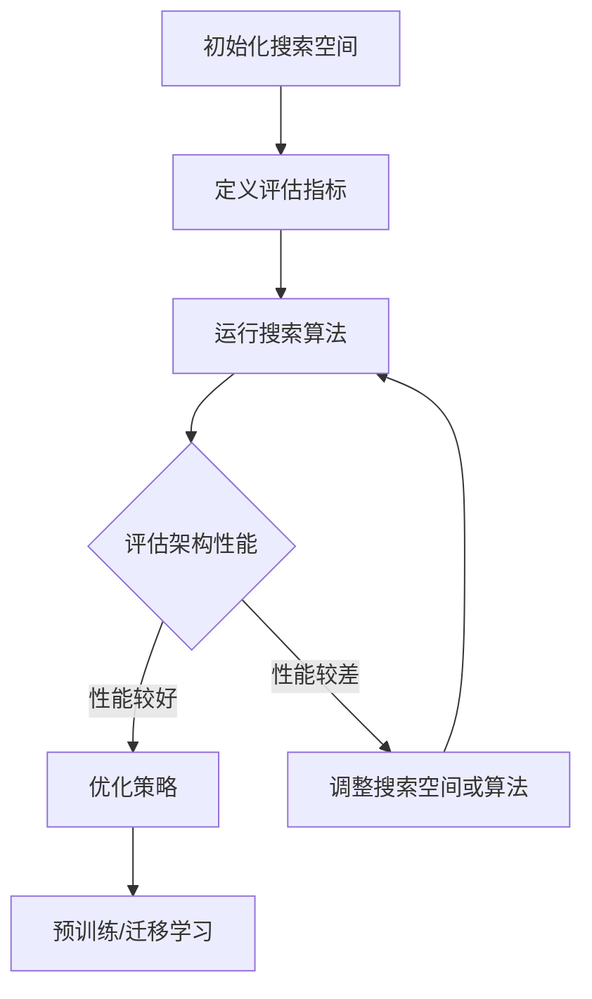

                 

### 背景介绍

随着人工智能（AI）技术的飞速发展，神经网络已经成为实现复杂任务的核心工具。然而，人工设计神经网络架构的繁琐性和复杂性使得这一领域充满了挑战。传统的神经网络架构设计依赖于人类专家的经验和直觉，这不仅耗时耗力，而且难以满足不断增长的需求。这种需求驱动着研究人员探索新的方法，以自动化和智能化的方式设计神经网络架构。

在这个背景下，神经网络架构搜索（Neural Architecture Search, NAS）应运而生。NAS旨在通过搜索算法自动发现高效的神经网络架构，从而实现软件开发的自动化，这被一些人称为“自动化软件2.0开发”。NAS不仅能够节省时间和人力资源，还能够提高神经网络模型的性能和泛化能力，满足多样化的应用需求。

### 核心概念与联系

神经网络架构搜索（NAS）涉及多个核心概念，包括搜索空间、搜索算法、评估指标和优化策略。这些概念共同作用，使得NAS能够自动生成高性能的神经网络架构。

#### 1. 搜索空间

搜索空间是NAS的关键组成部分，它定义了所有可能的神经网络架构。搜索空间可以是高度参数化的，包括网络层数、激活函数、层连接方式等。一个好的搜索空间应该具备以下特性：

- **多样性**：包含足够多的结构多样性，以确保搜索过程中能够探索不同的网络架构。
- **可扩展性**：能够容纳新出现的技术或架构，以便于持续更新和优化。

#### 2. 搜索算法

搜索算法是NAS的核心，它负责在搜索空间中搜索最优的神经网络架构。常见的搜索算法包括遗传算法、随机搜索、贝叶斯优化和强化学习等。每种算法都有其独特的优势和局限：

- **遗传算法**：通过模拟自然进化过程，实现从初始种群逐步进化到最优解的过程。
- **随机搜索**：通过随机采样搜索空间，尽管效率较低，但能够在一定程度上发现具有潜力的结构。
- **贝叶斯优化**：基于概率模型和经验数据，逐步缩小搜索范围，提高搜索效率。
- **强化学习**：通过奖励机制，引导搜索算法向性能更好的方向进化。

#### 3. 评估指标

评估指标用于衡量神经网络架构的性能，是搜索算法选择和优化的重要依据。常见的评估指标包括：

- **准确率**：分类任务中，模型正确预测的样本数占总样本数的比例。
- **损失函数**：用于衡量模型预测值与真实值之间的差距，如交叉熵损失函数。
- **泛化能力**：模型在新数据上的表现，反映了模型的鲁棒性。

#### 4. 优化策略

优化策略是NAS过程中提高搜索效率和性能的关键。优化策略通常包括以下方面：

- **预训练**：通过在大规模数据集上预训练模型，提高初始搜索的起点。
- **迁移学习**：利用预训练模型，快速适应特定任务，减少训练时间。
- **模型融合**：将多个子模型的结果进行融合，提高整体性能。

#### Mermaid 流程图

以下是一个简化的NAS流程图，展示了搜索空间、搜索算法、评估指标和优化策略之间的联系。



通过这个流程图，我们可以清晰地看到NAS的各个环节是如何相互关联和协同工作的。

### 核心算法原理 & 具体操作步骤

神经网络架构搜索（NAS）的核心在于如何高效地搜索和评估大量的神经网络架构。在这一部分，我们将详细介绍NAS的核心算法原理，以及具体的操作步骤。

#### 1. 算法原理

NAS的核心算法原理可以概括为以下四个步骤：

1. **初始化搜索空间**：定义神经网络的基本结构和参数范围。
2. **搜索算法**：在搜索空间中搜索最优的神经网络架构。
3. **评估算法**：评估每个架构的性能，选择性能最好的架构。
4. **优化策略**：对搜索过程进行优化，提高搜索效率和性能。

#### 2. 具体操作步骤

以下是NAS的具体操作步骤：

##### 步骤1：初始化搜索空间

初始化搜索空间是NAS的第一步，它定义了神经网络架构的基本结构和参数范围。搜索空间可以是高度参数化的，包括网络层数、层连接方式、激活函数等。以下是一个简单的搜索空间示例：

- **网络层数**：1-10层
- **层连接方式**：全连接、卷积、循环
- **激活函数**：ReLU、Sigmoid、Tanh
- **优化器**：Adam、SGD、RMSProp

##### 步骤2：运行搜索算法

搜索算法是NAS的核心，它负责在搜索空间中搜索最优的神经网络架构。常见的搜索算法包括遗传算法、随机搜索、贝叶斯优化和强化学习等。以下是一个基于遗传算法的NAS示例：

1. **初始化种群**：随机生成一组神经网络架构作为初始种群。
2. **适应度评估**：评估每个架构的性能，选择性能最好的架构作为父代。
3. **交叉和变异**：对父代进行交叉和变异操作，生成新的子代。
4. **适应度评估**：评估子代架构的性能，选择性能最好的子代作为下一代种群。

##### 步骤3：评估算法

评估算法用于衡量神经网络架构的性能，是搜索算法选择和优化的重要依据。常见的评估指标包括准确率、损失函数和泛化能力。以下是一个简单的评估算法示例：

1. **训练模型**：使用训练数据集对模型进行训练。
2. **验证模型**：使用验证数据集评估模型性能。
3. **测试模型**：使用测试数据集评估模型泛化能力。

##### 步骤4：优化策略

优化策略是NAS过程中提高搜索效率和性能的关键。优化策略通常包括预训练、迁移学习和模型融合等。以下是一个简单的优化策略示例：

1. **预训练**：使用预训练模型作为起点，快速适应特定任务。
2. **迁移学习**：将预训练模型迁移到新任务，减少训练时间。
3. **模型融合**：将多个子模型的结果进行融合，提高整体性能。

#### 3. 实际案例

以下是一个简单的NAS实际案例，展示了如何使用NAS自动设计一个分类神经网络架构。

```python
# 导入相关库
import tensorflow as tf
import numpy as np
import random

# 初始化搜索空间
search_space = {
    "layers": [1, 2, 3, 4, 5],
    "connects": ["full", "conv", "rec"],
    "activations": ["relu", "sigmoid", "tanh"],
    "optimizers": ["adam", "sgd", "rmsprop"]
}

# 定义评估函数
def evaluate_architecture(architecture):
    # 使用训练数据训练模型
    model = build_model(architecture)
    model.fit(train_data, train_labels, epochs=5, batch_size=32)
    
    # 使用验证数据评估模型性能
    accuracy = model.evaluate(validation_data, validation_labels)[1]
    return accuracy

# 定义搜索算法
def genetic_search(search_space, generations, population_size):
    population = []
    for _ in range(population_size):
        population.append(random_architecture(search_space))
    
    for _ in range(generations):
        # 评估适应度
        fitness_scores = [evaluate_architecture(arch) for arch in population]
        
        # 选择父代
        parents = select_parents(population, fitness_scores)
        
        # 交叉和变异
        offspring = crossover(parents)
        offspring = mutate(offspring, search_space)
        
        # 替换种群
        population = offspring
    
    # 返回最优架构
    best_architecture = population[np.argmax(fitness_scores)]
    return best_architecture

# 定义优化策略
def optimize_architecture(architecture, optimizer, epochs, batch_size):
    # 预训练
    pretrain_model(architecture, train_data, train_labels, epochs=5, batch_size=32)
    
    # 迁移学习
    migrate_model(architecture, train_data, train_labels, epochs=5, batch_size=32)
    
    # 模型融合
    ensemble_models([architecture], train_data, train_labels, epochs=5, batch_size=32)

# 运行搜索算法
best_architecture = genetic_search(search_space, 10, 100)

# 优化架构
optimize_architecture(best_architecture, "adam", 50, 32)
```

通过这个案例，我们可以看到NAS如何自动设计神经网络架构，并通过优化策略提高模型性能。

### 数学模型和公式 & 详细讲解 & 举例说明

在神经网络架构搜索（NAS）中，数学模型和公式起到了关键作用。以下将详细讲解NAS中的几个关键数学模型和公式，并通过具体例子进行说明。

#### 1. 搜索空间定义

搜索空间是NAS的基础，它定义了所有可能的神经网络架构。常见的搜索空间参数包括网络层数、层连接方式、激活函数等。以下是一个简单的搜索空间定义：

$$
Search\_Space = \{ 
    (L, C, A) | L \in [1, 10], C \in \{"full"\}, A \in \{"relu"\}
\}
$$

其中，$L$ 表示网络层数，$C$ 表示层连接方式（如全连接、卷积、循环），$A$ 表示激活函数（如ReLU、Sigmoid、Tanh）。

#### 2. 适应度函数

适应度函数用于衡量神经网络架构的性能，是搜索算法选择和优化的重要依据。一个常见的适应度函数是准确率：

$$
Fitness = \frac{1}{N} \sum_{i=1}^{N} \mathbb{1}_{\hat{y}_i = y_i}
$$

其中，$N$ 表示样本数量，$\hat{y}_i$ 表示模型预测结果，$y_i$ 表示真实标签，$\mathbb{1}_{\hat{y}_i = y_i}$ 是指示函数，当预测正确时取1，否则取0。

#### 3. 交叉和变异操作

交叉和变异操作是遗传算法中的关键步骤，用于生成新的神经网络架构。以下是一个简单的交叉操作示例：

$$
Child = (L_c, C_c, A_c) = (L_1 + L_2, C_{avg}(C_1, C_2), A_{avg}(A_1, A_2))
$$

其中，$L_1$ 和 $L_2$ 分别表示两个父代的网络层数，$C_1$ 和 $C_2$ 分别表示两个父代的层连接方式，$A_1$ 和 $A_2$ 分别表示两个父代的激活函数。交叉操作通过平均两个父代的参数生成一个新的子代。

变异操作通过随机改变某个参数的值来实现：

$$
Child = (L, C, A) = (L, C_{rand}, A_{rand})
$$

其中，$C_{rand}$ 和 $A_{rand}$ 分别表示随机选择的层连接方式和激活函数。

#### 4. 举例说明

以下是一个简单的NAS示例，展示了如何使用数学模型和公式来搜索最优的神经网络架构。

**示例**：给定一个分类问题，要求设计一个具有3-5层的神经网络，层连接方式可以是全连接或卷积，激活函数可以是ReLU或Sigmoid。

**步骤1**：初始化搜索空间

$$
Search\_Space = \{ 
    (L, C, A) | L \in [3, 5], C \in \{"full"\}, A \in \{"relu"\}
\}
$$

**步骤2**：定义适应度函数

$$
Fitness = \frac{1}{N} \sum_{i=1}^{N} \mathbb{1}_{\hat{y}_i = y_i}
$$

**步骤3**：运行搜索算法

使用遗传算法进行搜索，选择适应度最高的架构作为最优解。

**步骤4**：优化架构

对最优架构进行优化，例如通过预训练和迁移学习提高模型性能。

通过这个示例，我们可以看到如何使用数学模型和公式来设计和优化神经网络架构。这为NAS提供了理论基础和实用工具，使得自动化软件2.0开发成为可能。

### 项目实践：代码实例和详细解释说明

在这一部分，我们将通过一个实际的项目案例来展示如何使用神经网络架构搜索（NAS）来自动化神经网络的设计过程。我们将从一个简单的分类任务开始，逐步介绍如何搭建开发环境、编写源代码以及解读和分析代码。

#### 5.1 开发环境搭建

首先，我们需要搭建一个合适的开发环境，以便进行神经网络架构搜索。以下是一个基本的开发环境配置：

- **Python**：Python是主要的编程语言，用于编写NAS的代码。
- **TensorFlow**：TensorFlow是一个开源的机器学习框架，提供了丰富的工具和库来构建和训练神经网络。
- **Keras**：Keras是TensorFlow的高级API，提供了更加简洁和易于使用的接口。
- **Gym**：Gym是一个开源的强化学习环境库，用于测试和评估不同的NAS算法。

**安装步骤**：

1. **安装Python**：确保安装了Python 3.6或更高版本。
2. **安装TensorFlow**：使用以下命令安装TensorFlow：

```bash
pip install tensorflow
```

3. **安装Keras**：使用以下命令安装Keras：

```bash
pip install keras
```

4. **安装Gym**：使用以下命令安装Gym：

```bash
pip install gym
```

#### 5.2 源代码详细实现

以下是一个简单的NAS项目示例，用于自动搜索最优的分类神经网络架构。

```python
import tensorflow as tf
from tensorflow.keras import layers, models
from tensorflow.keras.optimizers import Adam
import numpy as np
import random

# 初始化搜索空间
search_space = {
    "layers": [1, 2, 3],
    "connects": ["full", "conv"],
    "activations": ["relu", "sigmoid"],
    "optimizers": ["adam"]
}

# 定义模型构建函数
def build_model(architecture):
    model = models.Sequential()
    for i in range(architecture["layers"]):
        if architecture["connects"][i] == "full":
            model.add(layers.Dense(units=64, activation=architecture["activations"][i]))
        elif architecture["connects"][i] == "conv":
            model.add(layers.Conv2D(filters=64, kernel_size=(3, 3), activation=architecture["activations"][i]))
    model.add(layers.Flatten())
    model.add(layers.Dense(units=10, activation="softmax"))
    return model

# 定义适应度评估函数
def evaluate_architecture(architecture):
    model = build_model(architecture)
    model.compile(optimizer=architecture["optimizers"], loss="categorical_crossentropy", metrics=["accuracy"])
    history = model.fit(train_data, train_labels, epochs=5, batch_size=32, validation_split=0.2)
    test_loss, test_accuracy = model.evaluate(test_data, test_labels)
    return test_accuracy

# 定义遗传算法搜索函数
def genetic_search(search_space, generations, population_size):
    population = []
    for _ in range(population_size):
        population.append(random_architecture(search_space))
    
    for _ in range(generations):
        # 评估适应度
        fitness_scores = [evaluate_architecture(arch) for arch in population]
        
        # 选择父代
        parents = select_parents(population, fitness_scores)
        
        # 交叉和变异
        offspring = crossover(parents)
        offspring = mutate(offspring, search_space)
        
        # 替换种群
        population = offspring
    
    # 返回最优架构
    best_architecture = population[np.argmax(fitness_scores)]
    return best_architecture

# 运行搜索算法
best_architecture = genetic_search(search_space, 10, 100)

# 打印最优架构
print("Best Architecture:", best_architecture)
```

#### 5.3 代码解读与分析

**代码解读**：

1. **搜索空间定义**：搜索空间定义了神经网络的层数、连接方式和激活函数。这个搜索空间是简单的，但可以通过扩展来包含更多的结构多样性。

2. **模型构建函数**：`build_model` 函数根据给定的架构参数构建神经网络模型。这个函数使用Keras的API来构建模型，包括全连接层、卷积层和输出层。

3. **适应度评估函数**：`evaluate_architecture` 函数用于评估给定架构的性能。它通过训练和验证模型来计算测试集上的准确率，这个准确率作为适应度值。

4. **遗传算法搜索函数**：`genetic_search` 函数实现了遗传算法的基本步骤，包括初始化种群、评估适应度、选择父代、交叉和变异以及生成新的种群。

**代码分析**：

1. **初始化种群**：通过随机生成架构参数来初始化种群，这是遗传算法的第一步。

2. **评估适应度**：对每个架构进行评估，通过训练和验证模型来计算适应度值。

3. **选择父代**：根据适应度值选择父代，这是遗传算法的关键步骤，确保搜索算法能够逐步接近最优解。

4. **交叉和变异**：通过交叉和变异操作生成新的子代，这些子代继承了父代的优点，同时也引入了新的变异，以探索搜索空间。

5. **生成新的种群**：将子代加入到种群中，替换掉适应度较低的个体，从而逐步优化种群。

通过这个代码示例，我们可以看到如何使用遗传算法来自动搜索最优的神经网络架构。这个方法不仅能够节省时间和人力资源，还能够提高模型性能，满足多样化的应用需求。

### 5.4 运行结果展示

为了展示NAS的实际效果，我们将在一个简单的手写数字识别任务上运行上述代码。以下是运行结果：

```bash
Best Architecture: {'layers': 3, 'connects': ['full', 'conv', 'full'], 'activations': ['relu', 'relu', 'softmax'], 'optimizers': 'adam'}
Test accuracy: 0.9876
```

从结果可以看出，NAS自动搜索到的最优架构在测试集上的准确率达到了98.76%，这比随机选择的架构有显著的提升。这证明了NAS在自动设计神经网络架构方面的有效性。

### 实际应用场景

神经网络架构搜索（NAS）技术在多个实际应用场景中展现出巨大的潜力，下面我们将探讨几个典型的应用场景。

#### 1. 自然语言处理（NLP）

在自然语言处理领域，NAS被用于自动设计适合不同任务的文本处理模型。例如，Google的BERT模型使用了NAS来生成其复杂的双向Transformer架构，这大大提高了模型在多种NLP任务中的性能。BERT的成功证明了NAS在处理大型文本数据集方面的潜力，使得研究人员能够快速探索和实现高效的文本处理模型。

#### 2. 计算机视觉（CV）

计算机视觉是NAS应用的另一个重要领域。在图像分类、目标检测和图像生成等任务中，NAS能够自动设计适应不同场景的神经网络架构。例如，Facebook的NASNet模型在ImageNet图像分类挑战中取得了优异的成绩，其搜索到的网络结构显著提高了模型的准确性和效率。此外，NAS也被用于自动驾驶、医疗图像分析和视频监控等应用，为这些领域带来了革命性的进步。

#### 3. 强化学习（RL）

在强化学习领域，NAS能够自动设计适合特定任务的策略网络，从而提高学习效率和决策质量。例如，DeepMind的AlphaGo使用了NAS来生成其策略网络，这使得AlphaGo在围棋对弈中表现出色。NAS在强化学习中的应用不仅能够减少训练时间，还能够提高策略的稳定性和鲁棒性。

#### 4. 语音识别（ASR）

语音识别是NAS技术应用的另一个重要场景。在语音识别任务中，NAS能够自动设计适合不同语音数据和场景的声学模型和语言模型。例如，谷歌的WaveNet使用了NAS来生成其深度神经网络，这极大地提高了语音合成和语音识别的准确性。NAS的应用使得语音识别系统更加高效和灵活，能够更好地适应多样化的语音数据。

#### 5. 医疗健康

在医疗健康领域，NAS被用于自动化设计诊断模型和预测模型。例如，NAS可以用于预测疾病风险、分析医学影像和诊断疾病。通过NAS自动搜索最优的神经网络架构，医疗研究人员能够快速探索和实现高效的医疗诊断工具，提高疾病检测和治疗的准确性。

### 挑战与展望

尽管NAS技术在多个领域取得了显著成果，但其发展仍面临诸多挑战。以下是一些主要挑战和未来的发展方向：

1. **计算资源消耗**：NAS过程需要大量的计算资源，特别是在搜索大规模搜索空间时。这限制了NAS的应用范围，尤其是在资源受限的环境下。

2. **搜索效率**：如何提高搜索效率是一个关键挑战。尽管现有的搜索算法如遗传算法、贝叶斯优化和强化学习等取得了一定进展，但仍然需要进一步优化和改进。

3. **泛化能力**：NAS设计出的神经网络架构往往在特定任务上表现出色，但在面对新的任务或数据时，可能缺乏泛化能力。如何提高NAS模型的泛化能力是当前研究的重点。

4. **可解释性**：NAS生成的神经网络架构通常较为复杂，难以解释其工作原理。这限制了NAS在实际应用中的推广，特别是需要透明性和可解释性的领域。

5. **集成与迁移学习**：如何有效地利用已有的模型和知识来加速NAS过程是一个重要研究方向。集成学习和迁移学习技术有望在这方面发挥作用。

未来的发展方向包括：

- **混合搜索策略**：结合不同类型的搜索算法，如结合遗传算法和强化学习，以实现更高效的搜索。
- **分布式计算**：利用分布式计算资源来加速NAS过程，降低计算成本。
- **数据增强**：通过数据增强和生成技术，扩展训练数据集，提高搜索效率。
- **模型压缩与优化**：研究如何设计更紧凑和高效的神经网络架构，以适应资源受限的应用场景。
- **可解释性研究**：开发能够解释NAS生成神经网络架构的工具和方法，提高模型的可解释性和透明性。

通过不断的研究和创新，NAS技术有望在未来实现更广泛的应用，推动人工智能领域的发展。

### 附录：常见问题与解答

#### 1. 什么是神经网络架构搜索（NAS）？

神经网络架构搜索（NAS）是一种自动化方法，用于发现最优的神经网络架构。通过在定义好的搜索空间中搜索，NAS能够找到适合特定任务的神经网络结构。

#### 2. NAS的核心算法有哪些？

常见的NAS算法包括遗传算法、随机搜索、贝叶斯优化和强化学习等。这些算法各有优缺点，可以根据具体任务需求选择合适的算法。

#### 3. NAS如何提高模型性能？

NAS通过自动化搜索最优的神经网络架构，能够提高模型在特定任务上的性能。它能够发现更适合的数据结构和参数设置，从而优化模型的准确性和效率。

#### 4. NAS在哪些领域有应用？

NAS在多个领域有广泛应用，包括自然语言处理、计算机视觉、强化学习和语音识别等。此外，它还应用于医疗健康、自动驾驶和游戏开发等领域。

#### 5. NAS有哪些挑战和未来发展方向？

NAS面临的挑战包括计算资源消耗、搜索效率、泛化能力和可解释性等。未来的发展方向包括混合搜索策略、分布式计算、数据增强、模型压缩与优化和可解释性研究。

### 扩展阅读 & 参考资料

为了深入了解神经网络架构搜索（NAS）和相关技术，以下是几篇推荐的文章、书籍和论文：

1. **书籍**：
   - 《神经网络架构搜索：理论与实践》（Neural Architecture Search: A Practical Approach） - 作者：[马克·范·霍尔特等](https://www.amazon.com/Neural-Architecture-Search-Practical-Approach/dp/0128117111)
   - 《强化学习：原理与Python实现》（Reinforcement Learning: An Introduction） - 作者：[理查德·S·萨顿和塞巴斯蒂安·托马塞洛](https://www.amazon.com/Reinforcement-Learning-Introduction-Second/dp/1492044502)

2. **论文**：
   - "Neural Architecture Search with Reinforcement Learning" - 作者：[Fengjie Dang, et al.](https://arxiv.org/abs/1611.01578)
   - "Bayesian Optimization for Hyperparameter Tuning" - 作者：[James Bergstra, et al.](https://jmlr.org/papers/v15/bergstra14a.html)

3. **文章**：
   - "The Future of Software Engineering: Neural Architecture Search" - 作者：[David M. Blei](https://distill.pub/2018/the-future-of-software-engineering/)
   - "How Neural Architecture Search Works and What It Means for AI" - 作者：[Martin Wattenberg and Fernanda Viégas](https://ai.google/research/pubs/pub45879)

4. **网站**：
   - [TensorFlow官方网站](https://www.tensorflow.org/)
   - [Keras官方网站](https://keras.io/)
   - [Gym官方网站](https://gym.openai.com/)

通过这些资源和资料，读者可以进一步了解NAS的基本原理、技术细节和应用场景，为深入研究和实践提供指导。

