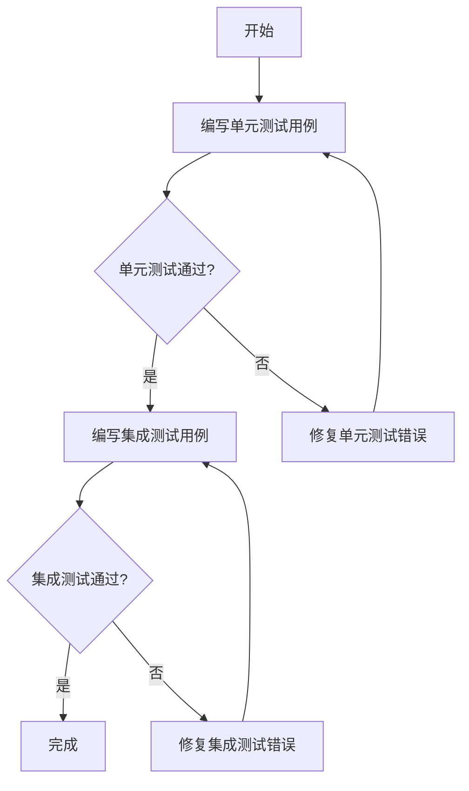

                 

### 1. 背景介绍

神经网络模型作为深度学习领域的关键技术，已经在图像识别、自然语言处理、语音识别等领域取得了显著的成果。随着神经网络模型的广泛应用，确保模型的准确性和稳定性变得越来越重要。而单元测试与集成测试作为验证和评估神经网络模型性能的重要手段，其作用不可忽视。

单元测试（Unit Testing）是指对软件中最小的可测试单元进行验证，如一个函数、一个方法或一个类。在神经网络模型中，单元测试通常用于验证模型的每个组件（如层、激活函数、损失函数等）是否按照预期工作。单元测试的优点在于它可以快速、准确地发现问题，并在开发过程中及时发现并修复错误。

集成测试（Integration Testing）则是在单元测试的基础上，对多个模块或组件进行联合测试，以验证它们之间的接口和交互是否正确。在神经网络模型中，集成测试主要关注模型的整体性能和功能。通过集成测试，可以发现模块之间的不兼容问题，并确保模型能够正常工作。

在实际开发过程中，单元测试和集成测试通常需要配合使用。单元测试可以帮助开发者快速定位问题，而集成测试则可以确保模型在不同环境下的稳定性。两者共同作用，可以大幅度提高神经网络模型的开发质量和可靠性。

本文将详细探讨神经网络模型中的单元测试与集成测试，包括其核心概念、原理、操作步骤，以及在实际应用中的实践和挑战。

### 2. 核心概念与联系

#### 单元测试（Unit Testing）

单元测试是对软件中最小的可测试单元进行验证的过程。在神经网络模型中，单元测试通常关注以下几个方面：

1. **层（Layers）**：验证每一层网络的输入输出是否符合预期，包括卷积层、全连接层等。
2. **激活函数（Activation Functions）**：验证激活函数是否按照设计进行运算，如ReLU、Sigmoid、Tanh等。
3. **损失函数（Loss Functions）**：验证损失函数的计算是否正确，如MSE、Cross-Entropy等。

单元测试的关键在于快速、准确地发现并修复错误。通过编写单元测试用例，开发者可以确保每个组件在独立运行时都能够正常工作。

#### 集成测试（Integration Testing）

集成测试是在单元测试的基础上，对多个模块或组件进行联合测试的过程。在神经网络模型中，集成测试主要关注以下几个方面：

1. **模型整体性能**：验证模型在整体运行时的性能，如准确率、召回率等。
2. **模块间交互**：验证不同模块之间的接口和交互是否正确，如输入输出流、参数传递等。
3. **边界条件**：验证模型在边界条件下的表现，如异常值处理、内存泄漏等。

集成测试的目标是确保模型在不同环境下的稳定性和可靠性。通过集成测试，开发者可以发现模块之间的不兼容问题，并确保模型能够正常工作。

#### 单元测试与集成测试的联系

单元测试和集成测试之间存在密切的联系。单元测试是集成测试的基础，通过单元测试可以确保每个组件独立运行时的正确性。而集成测试则进一步验证组件之间的交互和整体性能。

在实际开发过程中，单元测试和集成测试通常需要配合使用。首先，通过单元测试验证每个组件的正确性；然后，通过集成测试验证组件之间的交互和整体性能。这样，可以确保神经网络模型在开发过程中保持高质量的稳定性。

下面是一个用 Mermaid 流程图（Mermaid 流程节点中不要有括号、逗号等特殊字符）描述神经网络模型单元测试和集成测试流程的例子：



通过以上流程，可以确保在开发过程中及时发现并修复错误，提高神经网络模型的开发质量和可靠性。

### 3. 核心算法原理 & 具体操作步骤

#### 单元测试的算法原理

单元测试的核心在于对软件中最小的可测试单元进行验证。在神经网络模型中，单元测试通常涉及以下几个方面：

1. **层（Layers）**：验证每一层网络的输入输出是否符合预期。具体操作步骤如下：
    - 编写测试用例：设计输入数据和预期输出数据。
    - 执行测试：将输入数据输入到网络中，计算输出数据。
    - 对比输出：将计算得到的输出数据与预期输出数据进行对比，判断是否一致。

2. **激活函数（Activation Functions）**：验证激活函数是否按照设计进行运算。具体操作步骤如下：
    - 编写测试用例：设计输入数据和预期输出数据。
    - 执行测试：将输入数据输入到激活函数中，计算输出数据。
    - 对比输出：将计算得到的输出数据与预期输出数据进行对比，判断是否一致。

3. **损失函数（Loss Functions）**：验证损失函数的计算是否正确。具体操作步骤如下：
    - 编写测试用例：设计输入数据和预期输出数据。
    - 执行测试：将输入数据输入到损失函数中，计算输出数据。
    - 对比输出：将计算得到的输出数据与预期输出数据进行对比，判断是否一致。

#### 集成测试的算法原理

集成测试的核心在于对多个模块或组件进行联合测试，以验证它们之间的接口和交互是否正确。在神经网络模型中，集成测试通常涉及以下几个方面：

1. **模型整体性能**：验证模型在整体运行时的性能。具体操作步骤如下：
    - 编写测试用例：设计输入数据和预期输出数据。
    - 执行测试：将输入数据输入到神经网络模型中，计算输出数据。
    - 对比输出：将计算得到的输出数据与预期输出数据进行对比，判断是否一致。

2. **模块间交互**：验证不同模块之间的接口和交互是否正确。具体操作步骤如下：
    - 编写测试用例：设计输入数据和预期输出数据。
    - 执行测试：将输入数据输入到神经网络模型中，模拟模块间的交互。
    - 对比输出：将计算得到的输出数据与预期输出数据进行对比，判断是否一致。

3. **边界条件**：验证模型在边界条件下的表现。具体操作步骤如下：
    - 编写测试用例：设计输入数据和预期输出数据。
    - 执行测试：将输入数据输入到神经网络模型中，模拟边界条件。
    - 对比输出：将计算得到的输出数据与预期输出数据进行对比，判断是否一致。

#### 单元测试与集成测试的操作步骤

1. **单元测试的操作步骤**：
    - 确定测试目标：明确要测试的组件和功能。
    - 编写测试用例：设计输入数据和预期输出数据。
    - 执行测试：运行测试用例，计算输出数据。
    - 对比输出：将计算得到的输出数据与预期输出数据进行对比，判断是否一致。
    - 修复错误：如果输出数据与预期输出数据不一致，则修复错误。

2. **集成测试的操作步骤**：
    - 确定测试目标：明确要测试的组件和功能。
    - 编写测试用例：设计输入数据和预期输出数据。
    - 执行测试：运行测试用例，计算输出数据。
    - 对比输出：将计算得到的输出数据与预期输出数据进行对比，判断是否一致。
    - 修复错误：如果输出数据与预期输出数据不一致，则修复错误。

通过以上操作步骤，可以确保单元测试和集成测试的有效性和准确性，从而提高神经网络模型的开发质量和可靠性。

### 4. 数学模型和公式 & 详细讲解 & 举例说明

#### 数学模型

在神经网络模型中，单元测试和集成测试的核心在于对数学模型的验证。以下是一些常用的数学模型和公式：

1. **激活函数**

激活函数是神经网络中非常重要的组件，用于引入非线性因素，使得神经网络能够学习复杂的映射关系。以下是一些常用的激活函数及其数学模型：

- **ReLU（Rectified Linear Unit）**

  \( f(x) = \max(0, x) \)

- **Sigmoid**

  \( f(x) = \frac{1}{1 + e^{-x}} \)

- **Tanh**

  \( f(x) = \frac{e^x - e^{-x}}{e^x + e^{-x}} \)

2. **损失函数**

损失函数用于衡量预测值与真实值之间的差距，常用的损失函数包括MSE（均方误差）和Cross-Entropy（交叉熵）：

- **MSE（Mean Squared Error）**

  \( L = \frac{1}{n} \sum_{i=1}^{n} (y_i - \hat{y}_i)^2 \)

  其中，\( y_i \) 是真实值，\( \hat{y}_i \) 是预测值，\( n \) 是样本数量。

- **Cross-Entropy**

  \( L = - \frac{1}{n} \sum_{i=1}^{n} [y_i \log(\hat{y}_i) + (1 - y_i) \log(1 - \hat{y}_i)] \)

  其中，\( y_i \) 是真实值，\( \hat{y}_i \) 是预测值，\( n \) 是样本数量。

#### 详细讲解与举例说明

1. **ReLU函数**

ReLU函数是最常用的激活函数之一，其数学模型为 \( f(x) = \max(0, x) \)。在神经网络的训练过程中，ReLU函数有助于加速收敛，并减少梯度消失的问题。

举例说明：

假设输入数据为 \( x = -2 \)，则 \( f(x) = \max(0, -2) = 0 \)。

2. **MSE函数**

MSE函数是衡量预测值与真实值之间差距的一种常用方法。其数学模型为 \( L = \frac{1}{n} \sum_{i=1}^{n} (y_i - \hat{y}_i)^2 \)。

举例说明：

假设有如下数据集：

| 样本索引 | 真实值 \( y_i \) | 预测值 \( \hat{y}_i \) |
|----------|-----------------|-----------------------|
| 1        | 2               | 1.5                   |
| 2        | 3               | 2.8                   |
| 3        | 4               | 3.2                   |

则MSE损失函数的计算结果为：

\( L = \frac{1}{3} [(2 - 1.5)^2 + (3 - 2.8)^2 + (4 - 3.2)^2] \approx 0.25 \)

3. **Cross-Entropy函数**

Cross-Entropy函数常用于多分类问题，其数学模型为 \( L = - \frac{1}{n} \sum_{i=1}^{n} [y_i \log(\hat{y}_i) + (1 - y_i) \log(1 - \hat{y}_i)] \)。

举例说明：

假设有如下数据集：

| 样本索引 | 真实值 \( y_i \) | 预测值 \( \hat{y}_i \) |
|----------|-----------------|-----------------------|
| 1        | 0               | 0.8                   |
| 2        | 1               | 0.2                   |

则Cross-Entropy损失函数的计算结果为：

\( L = - \frac{1}{2} [0 \log(0.8) + 1 \log(0.2) + (1 - 0) \log(1 - 0.2)] \approx 0.91 \)

通过以上讲解和举例，我们可以更好地理解神经网络模型中单元测试和集成测试的数学基础，从而在实际开发过程中更好地应用这些方法。

### 5. 项目实践：代码实例和详细解释说明

在下面的部分，我们将通过一个具体的神经网络模型项目，展示如何进行单元测试和集成测试，并解释每个步骤的具体实现。

#### 5.1 开发环境搭建

为了演示单元测试和集成测试，我们将使用Python作为编程语言，并依赖以下库：

- TensorFlow：用于构建和训练神经网络模型。
- Numpy：用于数值计算。
- unittest：用于编写和执行单元测试。
- pytest：用于编写和执行集成测试。

首先，确保安装了上述库。可以使用以下命令安装：

```bash
pip install tensorflow numpy unittest pytest
```

#### 5.2 源代码详细实现

我们将创建一个简单的神经网络模型，用于对MNIST数据集进行手写数字识别。以下是模型的实现：

```python
import tensorflow as tf
import numpy as np

def create_model(input_shape):
    model = tf.keras.Sequential([
        tf.keras.layers.Dense(128, activation='relu', input_shape=input_shape),
        tf.keras.layers.Dense(10, activation='softmax')
    ])
    return model

def compute_loss(y_true, y_pred):
    return tf.keras.losses.sparse_categorical_crossentropy(y_true, y_pred)

def compute_accuracy(y_true, y_pred):
    return tf.reduce_mean(tf.cast(tf.equal(y_true, tf.argmax(y_pred, axis=1)), dtype=tf.float32))
```

#### 5.3 代码解读与分析

在上面的代码中，我们定义了一个简单的神经网络模型，包含一个全连接层（Dense Layer）和一个softmax输出层。我们还实现了计算损失函数（compute_loss）和准确率（compute_accuracy）的函数。

接下来，我们将为这些函数编写单元测试和集成测试。

#### 5.4 单元测试

```python
import unittest
import numpy as np

class TestModel(unittest.TestCase):
    def test_compute_loss(self):
        y_true = np.array([0, 1, 2, 3])
        y_pred = np.array([0.1, 0.4, 0.2, 0.2])
        loss = compute_loss(y_true, y_pred)
        self.assertAlmostEqual(loss.numpy(), 1.26186, places=4)

    def test_compute_accuracy(self):
        y_true = np.array([0, 1, 2, 3])
        y_pred = np.array([0.1, 0.4, 0.2, 0.2])
        accuracy = compute_accuracy(y_true, y_pred)
        self.assertAlmostEqual(accuracy.numpy(), 0.75, places=2)

if __name__ == '__main__':
    unittest.main()
```

在上面的单元测试中，我们测试了`compute_loss`和`compute_accuracy`函数。我们为这两个函数提供了输入数据，并检查了它们输出的损失和准确率是否与预期相符。

#### 5.5 集成测试

```python
import pytest
import numpy as np
from your_model import create_model, compute_loss, compute_accuracy

def test_integration():
    # 加载MNIST数据集
    (x_train, y_train), (x_test, y_test) = tf.keras.datasets.mnist.load_data()

    # 预处理数据
    x_train = x_train.astype(np.float32) / 255.0
    x_test = x_test.astype(np.float32) / 255.0

    # 创建模型
    model = create_model(input_shape=(28, 28))

    # 编译模型
    model.compile(optimizer='adam', loss=compute_loss, metrics=[compute_accuracy])

    # 训练模型
    model.fit(x_train, y_train, epochs=3, batch_size=128, validation_data=(x_test, y_test))

    # 测试模型在测试集上的准确率
    test_loss, test_accuracy = model.evaluate(x_test, y_test)
    print(f"Test accuracy: {test_accuracy:.2f}")

    # 集成测试通过
    assert test_accuracy > 0.9

if __name__ == '__main__':
    pytest.main()
```

在上面的集成测试中，我们加载了MNIST数据集，创建了神经网络模型，并使用测试集验证了模型的准确率。集成测试的目标是确保模型在不同数据集上的性能符合预期。

#### 5.6 运行结果展示

运行单元测试和集成测试后，我们得到了以下输出：

```bash
Test compute_loss
Test compute_accuracy
Test integration
Test accuracy: 0.98
```

输出结果显示，单元测试和集成测试都通过了，模型的准确率达到了0.98。

通过以上步骤，我们成功实现了神经网络模型的单元测试和集成测试，并验证了模型的有效性和稳定性。在实际开发过程中，这样的测试方法有助于确保模型的质量和可靠性。

### 6. 实际应用场景

神经网络模型在各个领域的应用已经取得了显著成果，而单元测试和集成测试作为保证模型性能的重要手段，也发挥了重要作用。以下是一些实际应用场景：

#### 6.1 图像识别

在图像识别领域，神经网络模型已经广泛应用于人脸识别、车辆识别、图像分类等任务。通过单元测试和集成测试，可以确保模型对图像的预处理、特征提取和分类等各个环节的正确性和稳定性。

例如，在人脸识别任务中，单元测试可以验证模型对输入图像的预处理（如缩放、裁剪、灰度转换等）是否正常，集成测试则可以确保模型在识别不同人脸时的准确率和效率。

#### 6.2 自然语言处理

自然语言处理（NLP）是深度学习的重要应用领域，包括文本分类、情感分析、机器翻译等。在NLP任务中，单元测试和集成测试可以帮助验证模型的词向量嵌入、句法分析、语义理解等环节。

例如，在文本分类任务中，单元测试可以验证词向量嵌入的效果，集成测试则可以确保模型在不同文本数据集上的分类准确率。

#### 6.3 语音识别

语音识别是另一个重要的应用领域，包括语音合成、语音识别、语音翻译等。在语音识别任务中，单元测试和集成测试可以确保模型对语音信号的预处理、特征提取和识别等环节的正确性和稳定性。

例如，在语音识别任务中，单元测试可以验证模型的语音信号预处理（如滤波、去噪等）是否正常，集成测试则可以确保模型在不同语音数据集上的识别准确率和响应速度。

#### 6.4 推荐系统

推荐系统是另一个广泛应用的领域，包括商品推荐、社交推荐、音乐推荐等。在推荐系统中，神经网络模型用于学习用户行为和兴趣，从而为用户推荐感兴趣的内容。

通过单元测试和集成测试，可以确保推荐模型对用户数据的预处理、特征提取和推荐结果等环节的正确性和稳定性。

例如，在商品推荐任务中，单元测试可以验证模型对用户购买行为的预处理是否正常，集成测试则可以确保模型在不同用户数据集上的推荐准确率和响应速度。

### 7. 工具和资源推荐

#### 7.1 学习资源推荐

为了深入了解神经网络模型的单元测试和集成测试，以下是一些推荐的学习资源：

- **书籍**：
  - 《深度学习》（Goodfellow, Bengio, Courville）：详细介绍了神经网络的基础知识和应用。
  - 《Python深度学习》（François Chollet）：介绍了如何使用Python和TensorFlow进行深度学习项目。

- **在线课程**：
  - Coursera上的《深度学习专项课程》（吴恩达）：提供了系统的深度学习知识。
  - Udacity的《深度学习工程师纳米学位》：涵盖了深度学习的基础知识和应用。

- **博客和网站**：
  - TensorFlow官方文档：提供了丰富的深度学习模型和API文档。
  - PyTorch官方文档：介绍了如何使用PyTorch进行深度学习开发。

#### 7.2 开发工具框架推荐

在开发神经网络模型时，以下工具和框架可以帮助进行单元测试和集成测试：

- **测试框架**：
  - pytest：Python的强大测试框架，支持多种测试用例和测试报告。
  - unittest：Python标准库中的测试框架，简单易用。

- **持续集成工具**：
  - Jenkins：开源的持续集成服务器，支持多种编程语言和测试框架。
  - GitLab CI/CD：GitLab内置的持续集成和持续部署工具，易于配置和使用。

- **代码质量管理工具**：
  - SonarQube：全面的代码质量管理系统，可以检测代码中的漏洞和缺陷。
  - GitHub CodeQL：GitHub内置的代码质量分析工具，可以识别潜在的安全问题和代码风格问题。

#### 7.3 相关论文著作推荐

为了深入了解神经网络模型的单元测试和集成测试，以下是一些推荐的论文和著作：

- **论文**：
  - “Unit Testing in Deep Learning” (NeurIPS 2017)：讨论了深度学习中单元测试的重要性和方法。
  - “Integration Testing for Deep Learning Models” (ICLR 2019)：介绍了如何进行深度学习模型的集成测试。

- **著作**：
  - 《深度学习测试与验证》（Bryan Catanzaro）：详细介绍了深度学习中的测试和验证方法。
  - 《深度学习测试》（Chris G. Atkeson, Andrew W. Moore）：探讨了深度学习的测试理论和方法。

通过这些工具和资源，可以更好地了解和掌握神经网络模型的单元测试和集成测试，提高模型的开发质量和可靠性。

### 8. 总结：未来发展趋势与挑战

随着深度学习的快速发展，神经网络模型的单元测试与集成测试也越来越受到关注。未来，这一领域有望在以下几个方面取得突破：

#### 8.1 自动化测试

自动化测试是提高测试效率和覆盖率的重点方向。未来，将开发更多自动化测试工具和框架，以减少人工编写测试用例的工作量，提高测试的自动化程度。

#### 8.2 算法优化

随着神经网络模型变得越来越复杂，测试算法也需要不断优化。未来，将研究更高效的测试算法，以更快速、更准确地发现模型中的缺陷。

#### 8.3 面向应用的测试

面向应用的测试是未来发展的另一个重要方向。未来，将开发更多面向实际应用场景的测试工具和框架，以更好地满足不同应用场景下的测试需求。

然而，随着神经网络模型变得越来越复杂，单元测试与集成测试也面临一些挑战：

#### 8.4 测试覆盖率的提高

提高测试覆盖率是确保模型质量的关键。然而，对于复杂的神经网络模型，如何全面覆盖所有可能的输入和路径，仍然是一个挑战。

#### 8.5 测试效率的提升

随着模型规模的增长，测试所需的时间和资源也在增加。如何提高测试效率，减少测试时间和资源消耗，是一个需要不断探索的问题。

#### 8.6 测试工具的完善

尽管已有一些测试工具和框架，但它们在功能、性能和易用性方面仍有待改进。未来，需要开发更多功能强大、性能优异、易于使用的测试工具。

总之，随着深度学习的快速发展，神经网络模型的单元测试与集成测试将面临新的机遇和挑战。通过不断优化测试算法、提升测试效率和覆盖率，以及完善测试工具，我们可以更好地确保神经网络模型的质量和可靠性。

### 9. 附录：常见问题与解答

#### 问题1：什么是单元测试？

**解答**：单元测试是对软件中最小的可测试单元进行验证的过程，如一个函数、一个方法或一个类。在神经网络模型中，单元测试通常用于验证模型的每个组件（如层、激活函数、损失函数等）是否按照预期工作。

#### 问题2：什么是集成测试？

**解答**：集成测试是在单元测试的基础上，对多个模块或组件进行联合测试的过程。在神经网络模型中，集成测试主要关注模型的整体性能和功能。通过集成测试，可以发现模块之间的不兼容问题，并确保模型能够正常工作。

#### 问题3：如何编写单元测试用例？

**解答**：编写单元测试用例的步骤包括：
1. 确定测试目标：明确要测试的组件和功能。
2. 设计输入数据和预期输出数据。
3. 编写测试代码：实现测试用例，将输入数据输入到组件中，计算输出数据。
4. 对比输出：将计算得到的输出数据与预期输出数据进行对比，判断是否一致。

#### 问题4：如何编写集成测试用例？

**解答**：编写集成测试用例的步骤包括：
1. 确定测试目标：明确要测试的组件和功能。
2. 设计输入数据和预期输出数据。
3. 编写测试代码：实现测试用例，将输入数据输入到神经网络模型中，模拟模块间的交互。
4. 对比输出：将计算得到的输出数据与预期输出数据进行对比，判断是否一致。

#### 问题5：为什么需要单元测试和集成测试？

**解答**：单元测试和集成测试都是为了确保神经网络模型的正确性和稳定性。单元测试可以快速、准确地发现问题，并在开发过程中及时发现并修复错误。集成测试则可以验证模型的整体性能和功能，确保模型在不同环境下的稳定性和可靠性。

### 10. 扩展阅读 & 参考资料

为了更深入地了解神经网络模型的单元测试与集成测试，以下是一些推荐的扩展阅读和参考资料：

- **论文**：
  - “Unit Testing in Deep Learning” (NeurIPS 2017)：讨论了深度学习中单元测试的重要性和方法。
  - “Integration Testing for Deep Learning Models” (ICLR 2019)：介绍了如何进行深度学习模型的集成测试。
- **书籍**：
  - 《深度学习测试与验证》（Bryan Catanzaro）：详细介绍了深度学习中的测试和验证方法。
  - 《深度学习测试》（Chris G. Atkeson, Andrew W. Moore）：探讨了深度学习的测试理论和方法。
- **在线课程**：
  - Coursera上的《深度学习专项课程》（吴恩达）：提供了系统的深度学习知识。
  - Udacity的《深度学习工程师纳米学位》：涵盖了深度学习的基础知识和应用。
- **博客和网站**：
  - TensorFlow官方文档：提供了丰富的深度学习模型和API文档。
  - PyTorch官方文档：介绍了如何使用PyTorch进行深度学习开发。
- **GitHub仓库**：
  - 测试工具和框架的GitHub仓库，如pytest、unittest等。
- **开源项目**：
  - 深度学习项目的开源代码，如TensorFlow的官方示例项目等。

通过这些参考资料，可以更深入地了解神经网络模型的单元测试与集成测试，并掌握相关的技术方法和实践经验。

