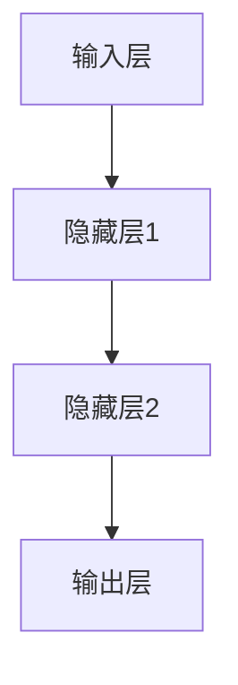

                 

### 背景介绍

神经网络（Neural Networks）作为现代人工智能（AI）的核心技术之一，起源于20世纪40年代。最初，由心理学家沃伦·麦卡洛克（Warren McCulloch）和数学家沃尔特·皮茨（Walter Pitts）提出，后由心理学家弗兰克·罗森布拉特（Frank Rosenblatt）发展，形成了感知机（Perceptron）这一早期的神经网络模型。

随着计算机科学的进步，神经网络的理论体系不断完善，特别是深度学习（Deep Learning）的崛起，使得神经网络在图像识别、自然语言处理、语音识别等领域取得了革命性的突破。如今，神经网络已经成为了人工智能技术不可或缺的基石。

神经网络之所以受到广泛关注，主要是因为它们能够通过大量的数据自动学习和调整内部参数，以实现对复杂模式的识别和分类。这种能力使神经网络在许多实际应用中表现出色，例如：

- **图像识别**：神经网络能够高效地识别图片中的物体和场景，被广泛应用于自动驾驶、人脸识别等领域。
- **自然语言处理**：神经网络能够处理和生成自然语言，使得机器翻译、情感分析等应用变得可能。
- **语音识别**：神经网络在语音识别中扮演了重要角色，使得语音助手等应用变得更加智能。

本篇文章将深入探讨神经网络的核心概念、算法原理、数学模型以及实际应用，旨在为广大读者提供一个全面而清晰的神经网络知识体系。

### 核心概念与联系

神经网络（Neural Networks）的基本构建块是神经元（Neurons）。神经元是一种计算单元，通过接受输入信号并产生输出信号来完成计算。一个简单的神经网络通常由多个神经元组成，这些神经元通过权重（Weights）相互连接，形成一个网络结构。

#### 神经元的基本原理

神经元的基本原理可以类比于人脑中的神经元。人脑中的神经元通过树突（Dendrites）接收其他神经元的信号，通过细胞体（Cell Body）进行计算，并通过轴突（Axon）将计算结果传递给其他神经元。在神经网络中，每个神经元也类似地接收来自其他神经元的输入信号，并通过激活函数（Activation Function）产生输出信号。

#### 神经网络的架构

神经网络可以分为输入层（Input Layer）、隐藏层（Hidden Layers）和输出层（Output Layer）。

- **输入层**：接收外部输入信号，每个输入信号对应一个神经元。
- **隐藏层**：多个神经元组成，用于对输入信号进行变换和处理，可以有多个隐藏层。
- **输出层**：产生最终输出信号，每个输出信号对应一个神经元。

#### 神经网络的连接方式

神经网络中的神经元通过权重相互连接。每个连接（边）都有一个权重值，用于表示连接的强度。在训练过程中，神经网络通过调整这些权重值来提高其性能。

#### 激活函数的作用

激活函数是神经网络中的一个关键组件，用于将神经元的线性组合映射到非负值域。常见的激活函数包括 sigmoid 函数、ReLU函数和Tanh函数。

##### sigmoid函数

sigmoid函数是一个S型曲线，其数学表达式为：

\[ f(x) = \frac{1}{1 + e^{-x}} \]

sigmoid函数将输入值映射到0和1之间，非常适合用于二分类问题。

##### ReLU函数

ReLU函数（Rectified Linear Unit）是一个简单的线性函数，其数学表达式为：

\[ f(x) = \max(0, x) \]

ReLU函数在神经网络中非常流行，因为它可以加速训练过程，并且对于训练深度较大的网络非常有效。

##### Tanh函数

Tanh函数（Hyperbolic Tangent Function）是一个双曲正切函数，其数学表达式为：

\[ f(x) = \frac{e^x - e^{-x}}{e^x + e^{-x}} \]

Tanh函数的输出范围在-1到1之间，与sigmoid函数类似，但具有更平滑的输出曲线。

#### Mermaid 流程图

以下是一个简单的神经网络 Mermaid 流程图：



在这个流程图中，输入层A通过权重连接到隐藏层1B，隐藏层1B再连接到隐藏层2C，最后隐藏层2C连接到输出层D。

### 核心算法原理 & 具体操作步骤

神经网络的训练过程主要包括前向传播（Forward Propagation）和反向传播（Back Propagation）。通过这两个过程，神经网络能够不断调整内部参数，以达到对给定数据的准确预测。

#### 前向传播

前向传播的过程可以分为以下几个步骤：

1. **初始化参数**：首先，我们需要随机初始化网络中的权重和偏置。这些参数将在训练过程中不断调整。
   
2. **计算输入到隐藏层的输出**：对于输入层的每个神经元，将其输入值乘以相应的权重，再加上偏置，得到隐藏层的输入值。然后，通过激活函数计算出隐藏层的输出值。

3. **计算隐藏层到输出层的输出**：同样地，将隐藏层的输出值乘以相应的权重，再加上偏置，得到输出层的输入值。然后，通过激活函数计算出输出层的输出值。

4. **计算损失函数**：输出层的输出值与真实值之间的差异构成了损失函数（Loss Function）。常见的损失函数包括均方误差（Mean Squared Error, MSE）和交叉熵（Cross Entropy Loss）。

5. **反向传播**：将损失函数关于网络参数进行求导，得到梯度信息。这些梯度信息将用于更新网络参数。

#### 反向传播

反向传播的过程可以分为以下几个步骤：

1. **计算输出层误差**：将输出层的损失函数关于输出层输出进行求导，得到输出层的误差。

2. **传播误差到隐藏层**：将输出层的误差传递到隐藏层。这一步需要将误差沿着网络结构反向传播，直到输入层。

3. **更新网络参数**：利用反向传播得到的梯度信息，通过梯度下降（Gradient Descent）或其他优化算法更新网络参数。

4. **重复前向传播和反向传播**：重复执行前向传播和反向传播，直到网络参数达到收敛条件。

#### 梯度下降算法

梯度下降是一种常见的优化算法，用于更新网络参数。其基本思想是沿着损失函数的梯度方向不断调整参数，以最小化损失函数。

1. **计算梯度**：首先，计算损失函数关于网络参数的梯度。

2. **更新参数**：利用梯度信息更新网络参数。更新公式如下：

\[ \theta = \theta - \alpha \cdot \nabla \theta \]

其中，\(\theta\) 表示网络参数，\(\alpha\) 表示学习率，\(\nabla \theta\) 表示梯度。

3. **重复迭代**：重复计算梯度和更新参数，直到达到收敛条件。

#### 具体步骤示例

假设我们有一个简单的神经网络，包含一个输入层、一个隐藏层和一个输出层。输入层有两个神经元，隐藏层有三个神经元，输出层有两个神经元。数据集包含100个样本，每个样本有两个特征和一个标签。

1. **初始化参数**：随机初始化权重和偏置。

2. **前向传播**：
   - 计算输入到隐藏层的输出：
     \[ z_1 = x_1 \cdot w_{11} + x_2 \cdot w_{12} + b_1 \]
     \[ z_2 = x_1 \cdot w_{21} + x_2 \cdot w_{22} + b_2 \]
     \[ z_3 = x_1 \cdot w_{31} + x_2 \cdot w_{32} + b_3 \]
     \[ a_1 = \sigma(z_1) \]
     \[ a_2 = \sigma(z_2) \]
     \[ a_3 = \sigma(z_3) \]
   - 计算隐藏层到输出层的输出：
     \[ z_4 = a_1 \cdot w_{41} + a_2 \cdot w_{42} + a_3 \cdot w_{43} + b_4 \]
     \[ z_5 = a_1 \cdot w_{51} + a_2 \cdot w_{52} + a_3 \cdot w_{53} + b_5 \]
     \[ a_4 = \sigma(z_4) \]
     \[ a_5 = \sigma(z_5) \]

3. **计算损失函数**：
   \[ loss = \frac{1}{2} \sum_{i=1}^{100} (y_i - a_4)^2 + \frac{1}{2} \sum_{i=1}^{100} (y_i - a_5)^2 \]

4. **反向传播**：
   - 计算输出层误差：
     \[ \delta_4 = (y - a_4) \cdot \sigma'(z_4) \]
     \[ \delta_5 = (y - a_5) \cdot \sigma'(z_5) \]
   - 计算隐藏层误差：
     \[ \delta_1 = \delta_4 \cdot w_{41} \cdot \sigma'(z_1) \]
     \[ \delta_2 = \delta_4 \cdot w_{42} \cdot \sigma'(z_2) \]
     \[ \delta_3 = \delta_4 \cdot w_{43} \cdot \sigma'(z_3) \]
   - 更新网络参数：
     \[ w_{41} = w_{41} - \alpha \cdot \delta_4 \cdot a_1 \]
     \[ w_{42} = w_{42} - \alpha \cdot \delta_4 \cdot a_2 \]
     \[ w_{43} = w_{43} - \alpha \cdot \delta_4 \cdot a_3 \]
     \[ w_{51} = w_{51} - \alpha \cdot \delta_5 \cdot a_1 \]
     \[ w_{52} = w_{52} - \alpha \cdot \delta_5 \cdot a_2 \]
     \[ w_{53} = w_{53} - \alpha \cdot \delta_5 \cdot a_3 \]

5. **重复前向传播和反向传播**：重复执行前向传播和反向传播，直到网络参数达到收敛条件。

通过上述步骤，神经网络能够不断调整内部参数，以提高对给定数据的预测准确性。

### 数学模型和公式 & 详细讲解 & 举例说明

神经网络的训练过程依赖于一系列数学模型和公式。本节将详细讲解这些模型和公式，并通过具体例子进行说明。

#### 激活函数

激活函数是神经网络中的一个关键组件，用于将神经元的线性组合映射到非负值域。常见的激活函数包括 sigmoid 函数、ReLU函数和Tanh函数。

1. **sigmoid函数**

sigmoid函数是一个S型曲线，其数学表达式为：

\[ f(x) = \frac{1}{1 + e^{-x}} \]

sigmoid函数的导数为：

\[ f'(x) = \frac{e^{-x}}{(1 + e^{-x})^2} \]

2. **ReLU函数**

ReLU函数（Rectified Linear Unit）是一个简单的线性函数，其数学表达式为：

\[ f(x) = \max(0, x) \]

ReLU函数的导数为：

\[ f'(x) = \begin{cases} 
      0, & \text{if } x < 0 \\
      1, & \text{if } x \geq 0 
   \end{cases} \]

3. **Tanh函数**

Tanh函数（Hyperbolic Tangent Function）是一个双曲正切函数，其数学表达式为：

\[ f(x) = \frac{e^x - e^{-x}}{e^x + e^{-x}} \]

Tanh函数的导数为：

\[ f'(x) = \frac{1 - \tanh^2(x)}{2} \]

#### 损失函数

损失函数是神经网络训练过程中用于衡量模型预测准确性的指标。常见的损失函数包括均方误差（Mean Squared Error, MSE）和交叉熵（Cross Entropy Loss）。

1. **均方误差（MSE）**

均方误差是一种用于衡量预测值与真实值之间差异的损失函数，其数学表达式为：

\[ MSE = \frac{1}{m} \sum_{i=1}^{m} (y_i - \hat{y}_i)^2 \]

其中，\( y_i \) 表示真实值，\( \hat{y}_i \) 表示预测值，\( m \) 表示样本数量。

MSE的导数为：

\[ \frac{dMSE}{d\theta} = 2 \cdot (y - \hat{y}) \]

2. **交叉熵（Cross Entropy Loss）**

交叉熵是一种用于衡量预测概率分布与真实概率分布之间差异的损失函数，其数学表达式为：

\[ CrossEntropy = -\frac{1}{m} \sum_{i=1}^{m} y_i \cdot \log(\hat{y}_i) \]

其中，\( y_i \) 表示真实值，\( \hat{y}_i \) 表示预测值，\( m \) 表示样本数量。

交叉熵的导数为：

\[ \frac{dCrossEntropy}{d\theta} = \hat{y}_i - y_i \]

#### 梯度下降

梯度下降是一种常见的优化算法，用于更新网络参数。其基本思想是沿着损失函数的梯度方向不断调整参数，以最小化损失函数。

1. **计算梯度**

   假设损失函数为 \( J(\theta) \)，则梯度 \( \nabla J(\theta) \) 表示为：

   \[ \nabla J(\theta) = \frac{dJ(\theta)}{d\theta} \]

2. **更新参数**

   梯度下降的基本公式为：

   \[ \theta = \theta - \alpha \cdot \nabla J(\theta) \]

   其中，\( \theta \) 表示网络参数，\( \alpha \) 表示学习率。

#### 具体例子

假设我们有一个简单的神经网络，包含一个输入层、一个隐藏层和一个输出层。输入层有两个神经元，隐藏层有三个神经元，输出层有两个神经元。数据集包含100个样本，每个样本有两个特征和一个标签。

1. **初始化参数**

   随机初始化权重和偏置。

2. **前向传播**

   计算输入到隐藏层的输出：
   \[ z_1 = x_1 \cdot w_{11} + x_2 \cdot w_{12} + b_1 \]
   \[ z_2 = x_1 \cdot w_{21} + x_2 \cdot w_{22} + b_2 \]
   \[ z_3 = x_1 \cdot w_{31} + x_2 \cdot w_{32} + b_3 \]
   \[ a_1 = \sigma(z_1) \]
   \[ a_2 = \sigma(z_2) \]
   \[ a_3 = \sigma(z_3) \]

   计算隐藏层到输出层的输出：
   \[ z_4 = a_1 \cdot w_{41} + a_2 \cdot w_{42} + a_3 \cdot w_{43} + b_4 \]
   \[ z_5 = a_1 \cdot w_{51} + a_2 \cdot w_{52} + a_3 \cdot w_{53} + b_5 \]
   \[ a_4 = \sigma(z_4) \]
   \[ a_5 = \sigma(z_5) \]

3. **计算损失函数**

   假设我们使用均方误差作为损失函数：
   \[ loss = \frac{1}{2} \sum_{i=1}^{100} (y_i - a_4)^2 + \frac{1}{2} \sum_{i=1}^{100} (y_i - a_5)^2 \]

4. **反向传播**

   计算输出层误差：
   \[ \delta_4 = (y - a_4) \cdot \sigma'(z_4) \]
   \[ \delta_5 = (y - a_5) \cdot \sigma'(z_5) \]

   计算隐藏层误差：
   \[ \delta_1 = \delta_4 \cdot w_{41} \cdot \sigma'(z_1) \]
   \[ \delta_2 = \delta_4 \cdot w_{42} \cdot \sigma'(z_2) \]
   \[ \delta_3 = \delta_4 \cdot w_{43} \cdot \sigma'(z_3) \]

   更新网络参数：
   \[ w_{41} = w_{41} - \alpha \cdot \delta_4 \cdot a_1 \]
   \[ w_{42} = w_{42} - \alpha \cdot \delta_4 \cdot a_2 \]
   \[ w_{43} = w_{43} - \alpha \cdot \delta_4 \cdot a_3 \]
   \[ w_{51} = w_{51} - \alpha \cdot \delta_5 \cdot a_1 \]
   \[ w_{52} = w_{52} - \alpha \cdot \delta_5 \cdot a_2 \]
   \[ w_{53} = w_{53} - \alpha \cdot \delta_5 \cdot a_3 \]

5. **重复前向传播和反向传播**

   重复执行前向传播和反向传播，直到网络参数达到收敛条件。

通过上述过程，神经网络能够不断调整内部参数，以提高对给定数据的预测准确性。

### 项目实践：代码实例和详细解释说明

在本节中，我们将通过一个简单的神经网络项目实例，展示如何使用Python和TensorFlow框架实现神经网络的训练和预测过程。该实例将包含一个输入层、一个隐藏层和一个输出层，用于对二分类问题进行建模。

#### 1. 开发环境搭建

在进行项目开发之前，我们需要搭建一个合适的开发环境。以下是搭建开发环境的步骤：

1. 安装Python环境：确保安装了Python 3.6或更高版本。
2. 安装TensorFlow：在命令行中执行以下命令安装TensorFlow：

   ```bash
   pip install tensorflow
   ```

3. 安装其他依赖：根据项目需求，可能需要安装其他Python库，例如NumPy、Matplotlib等。

#### 2. 源代码详细实现

以下是完整的源代码实现，包括数据预处理、神经网络搭建、训练和预测等步骤。

```python
import tensorflow as tf
import numpy as np
import matplotlib.pyplot as plt

# 数据预处理
# 假设数据集包含100个样本，每个样本有两个特征和一个标签
x_data = np.random.rand(100, 2)
y_data = np.array([[1] if np.random.rand() > 0.5 else [0] for _ in range(100)])

# 神经网络搭建
# 定义输入层、隐藏层和输出层
inputs = tf.keras.layers.Input(shape=(2,))
hidden = tf.keras.layers.Dense(units=10, activation='relu')(inputs)
outputs = tf.keras.layers.Dense(units=1, activation='sigmoid')(hidden)

# 定义损失函数和优化器
model = tf.keras.Model(inputs=inputs, outputs=outputs)
model.compile(optimizer='adam', loss='binary_crossentropy', metrics=['accuracy'])

# 训练模型
model.fit(x_data, y_data, epochs=10, batch_size=10)

# 预测
x_test = np.random.rand(10, 2)
y_pred = model.predict(x_test)

# 结果展示
plt.scatter(x_data[:, 0], x_data[:, 1], c=y_data, cmap=plt.cm.Spectral)
plt.scatter(x_test[:, 0], x_test[:, 1], c=y_pred, cmap=plt.cm.Spectral, marker='^')
plt.xlabel('Feature 1')
plt.ylabel('Feature 2')
plt.title('Neural Network Classification')
plt.show()
```

#### 3. 代码解读与分析

以下是代码的详细解读和分析：

1. **数据预处理**：我们使用随机生成的数据集，其中包含100个样本，每个样本有两个特征和一个标签。标签以0和1的形式表示两个类别。

2. **神经网络搭建**：
   - 定义输入层、隐藏层和输出层。输入层包含两个神经元，隐藏层包含10个神经元，输出层包含一个神经元。
   - 使用`tf.keras.layers.Input`函数定义输入层。
   - 使用`tf.keras.layers.Dense`函数定义隐藏层和输出层，其中`units`参数指定神经元的数量，`activation`参数指定激活函数。

3. **定义损失函数和优化器**：
   - 使用`model.compile`函数定义损失函数（`binary_crossentropy`）和优化器（`adam`）。

4. **训练模型**：
   - 使用`model.fit`函数训练模型，其中`epochs`参数指定训练的轮数，`batch_size`参数指定每个批次的样本数量。

5. **预测**：
   - 使用`model.predict`函数对随机生成的测试数据进行预测。

6. **结果展示**：
   - 使用`plt.scatter`函数绘制训练数据和测试数据的散点图，其中训练数据用实心点表示，测试数据用三角形表示。
   - 使用`plt.xlabel`、`plt.ylabel`和`plt.title`函数添加坐标轴标签和标题。

#### 4. 运行结果展示

运行上述代码后，我们将看到一个散点图，其中包含了训练数据和测试数据的散点。训练数据的散点以不同的颜色表示两个类别，测试数据的散点以三角形表示，其颜色反映了预测结果。

通过这个实例，我们可以看到如何使用Python和TensorFlow框架实现神经网络的训练和预测。这种方法不仅简单易行，而且具有很高的灵活性和扩展性。

### 实际应用场景

神经网络在实际应用中具有广泛的应用场景，以下是其中几个典型领域：

#### 1. 图像识别

图像识别是神经网络最早且最成功的应用之一。通过卷积神经网络（Convolutional Neural Networks, CNNs），神经网络能够在不进行任何人工标注的情况下自动学习图像中的特征。例如，在自动驾驶中，神经网络可以用于识别道路标志、行人、车辆等物体，从而提高行车安全性。在医疗领域，神经网络可以用于图像分析，帮助医生诊断疾病，如癌症筛查和视网膜病变检测。

#### 2. 自然语言处理

自然语言处理（Natural Language Processing, NLP）是另一个神经网络的重要应用领域。通过循环神经网络（Recurrent Neural Networks, RNNs）和长短期记忆网络（Long Short-Term Memory, LSTM），神经网络可以处理和理解自然语言。例如，神经网络可以用于机器翻译、情感分析、问答系统和文本生成。在社交媒体分析中，神经网络可以帮助企业理解用户反馈和需求，从而优化产品和服务。

#### 3. 语音识别

语音识别是神经网络在语音处理领域的重要应用。通过深度神经网络（Deep Neural Networks, DNNs）和卷积神经网络，神经网络可以准确地将语音信号转换为文本。这使语音识别技术在语音助手、自动字幕生成和语音控制等领域得到广泛应用。例如，苹果的Siri、亚马逊的Alexa和谷歌助手都是基于神经网络实现的。

#### 4. 推荐系统

推荐系统是神经网络在商业领域的重要应用之一。通过基于协同过滤（Collaborative Filtering）和深度学习（Deep Learning）的推荐算法，神经网络可以分析用户的偏好和历史行为，从而提供个性化的推荐。例如，Netflix和亚马逊等公司使用神经网络来推荐电影和产品，从而提高用户满意度和销售额。

#### 5. 游戏

神经网络在游戏领域也有广泛的应用。通过深度强化学习（Deep Reinforcement Learning），神经网络可以学会玩各种游戏，如围棋、国际象棋和电子游戏。例如，谷歌的AlphaGo使用神经网络结合强化学习算法，战胜了世界围棋冠军李世石，展现了神经网络在游戏领域的高超能力。

这些实际应用场景展示了神经网络在各个领域的强大能力。随着技术的不断进步，神经网络将在更多领域发挥重要作用，推动人工智能的发展。

### 工具和资源推荐

在学习和研究神经网络的过程中，选择合适的工具和资源至关重要。以下是一些推荐的工具和资源，包括学习资源、开发工具框架和相关论文著作。

#### 学习资源

1. **书籍**：
   - 《深度学习》（Deep Learning） by Ian Goodfellow、Yoshua Bengio 和 Aaron Courville
   - 《神经网络与深度学习》 by 凡梦溪
   - 《Python深度学习》 by François Chollet

2. **在线课程**：
   - Coursera 上的“Deep Learning Specialization”由 Andrew Ng教授主讲
   - edX 上的“Neural Networks for Machine Learning”由 Geoffrey H. Fox 主讲
   - Udacity 上的“Deep Learning Nanodegree”

3. **博客和网站**：
   - Fast.ai 的博客
   - Medium 上的深度学习相关文章
   - TensorFlow 官方文档和教程

4. **论文**：
   - “A Learning Algorithm for Continually Running Fully Recurrent Neural Networks” by David E. Rumelhart, Geoffrey E. Hinton, and Ronald J. Williams
   - “Backpropagation: Like a Tourist inanother City” by Paul Werbos
   - “Gradient Flow in Recurrent Neural Networks and the Emergence of Cognition” by Wennekers et al.

#### 开发工具框架

1. **TensorFlow**：由Google开发，是最流行的开源深度学习框架之一。
2. **PyTorch**：由Facebook开发，以其灵活性和动态计算图著称。
3. **Keras**：是一个高层神经网络API，可以与TensorFlow和Theano后端配合使用。
4. **Theano**：由蒙特利尔大学开发，是一个用于定义、优化和评估数学表达式的Python库。

#### 相关论文著作

1. **“Deep Learning” by Yann LeCun**：详细介绍了深度学习的原理和应用。
2. **“Convolutional Networks and Applications in Vision” by Yann LeCun**：探讨了卷积神经网络在计算机视觉中的应用。
3. **“Long Short-Term Memory Recurrent Neural Networks” by Sepp Hochreiter and Jürgen Schmidhuber**：介绍了长短期记忆网络，并详细讨论了其在时间序列数据处理中的应用。

通过这些工具和资源，您将能够更加深入地学习和研究神经网络，从而在人工智能领域取得更大的成就。

### 总结：未来发展趋势与挑战

神经网络作为人工智能的基石，其发展前景广阔。随着计算能力的提升、大数据的涌现和算法的优化，神经网络的应用领域将进一步扩展。以下是未来神经网络的发展趋势与面临的挑战：

#### 发展趋势

1. **更深的网络结构**：当前深度学习的成功很大程度上依赖于深度网络的采用。未来，将会有更多层、更复杂的网络结构被提出和验证，以提高模型的泛化能力和计算效率。

2. **更高效的算法**：算法的优化是神经网络发展的关键。近年来，诸如AutoML、模型剪枝、量化等技术使得训练深度神经网络所需的时间和资源大大减少，未来这些技术将会进一步优化，使神经网络更易于部署和使用。

3. **跨领域融合**：神经网络将在多个领域实现跨学科融合，如生物信息学、经济学和物理学等。这种融合将推动神经网络在更多实际应用场景中发挥作用。

4. **量子神经网络**：随着量子计算技术的发展，量子神经网络（Quantum Neural Networks, QNNs）将成为研究热点。量子神经网络结合了量子计算和神经网络的优点，有望解决当前深度学习中的计算瓶颈问题。

#### 挑战

1. **计算资源消耗**：深度神经网络训练过程需要大量的计算资源和存储空间。尽管算法优化和技术进步在一定程度上缓解了这一问题，但如何更高效地利用现有计算资源仍然是一个挑战。

2. **数据隐私和安全**：神经网络训练和预测过程中需要大量的数据，这可能涉及用户隐私问题。如何在保护用户隐私的前提下充分利用数据是一个重要的挑战。

3. **泛化能力**：深度神经网络在某些特定任务上取得了卓越的成绩，但在泛化能力方面仍存在不足。如何提高神经网络的泛化能力，使其能够处理更广泛的任务，是一个亟待解决的问题。

4. **伦理和社会影响**：随着神经网络在各个领域的广泛应用，其伦理和社会影响也日益凸显。如何确保神经网络系统的公平性、透明性和可控性，是一个需要深入探讨的问题。

总之，神经网络在未来将继续发挥重要作用，但同时也需要克服一系列挑战。通过不断的技术创新和深入研究，我们有理由相信神经网络将在人工智能领域取得更加辉煌的成就。

### 附录：常见问题与解答

1. **什么是神经网络？**

神经网络是一种模仿人脑结构和功能的计算模型，由许多相互连接的简单计算单元（神经元）组成。通过学习输入数据并调整内部连接的权重，神经网络能够对复杂数据模式进行自动识别和分类。

2. **神经网络如何工作？**

神经网络通过前向传播和反向传播两个过程进行工作。在前向传播过程中，输入信号通过神经网络中的多个层次，每个层次都对信号进行加权求和并应用激活函数。在反向传播过程中，网络根据预测结果与实际结果的误差，调整内部连接的权重，以优化模型性能。

3. **什么是深度学习？**

深度学习是神经网络的一种特殊形式，通过设计具有多个隐藏层的神经网络模型，深度学习能够自动学习和提取数据中的层次化特征。这使得深度学习在图像识别、语音识别和自然语言处理等领域取得了显著成就。

4. **什么是激活函数？**

激活函数是神经网络中的一个关键组件，用于将神经元的线性组合映射到非负值域。常见的激活函数包括 sigmoid、ReLU和Tanh等。激活函数的作用是引入非线性，使神经网络能够对复杂的数据进行建模。

5. **什么是梯度下降？**

梯度下降是一种优化算法，用于在训练过程中调整神经网络中的参数，以最小化损失函数。梯度下降的基本思想是沿着损失函数的梯度方向逐步调整参数，直到找到最优解。

6. **神经网络有哪些应用领域？**

神经网络在许多领域都有广泛应用，包括图像识别、自然语言处理、语音识别、推荐系统和游戏等。例如，神经网络可以用于自动识别道路标志和行人，提高自动驾驶系统的安全性；在医疗领域，神经网络可以用于疾病诊断和药物设计。

7. **如何选择合适的神经网络架构？**

选择合适的神经网络架构取决于具体的应用场景和数据特点。例如，对于图像识别任务，卷积神经网络（CNNs）是一个很好的选择；对于序列数据处理，循环神经网络（RNNs）或长短期记忆网络（LSTMs）可能更为合适。在实践中，通常需要通过实验和比较不同架构的性能来选择最佳模型。

### 扩展阅读 & 参考资料

1. **《深度学习》** by Ian Goodfellow、Yoshua Bengio 和 Aaron Courville
   - 详细介绍了深度学习的理论基础、算法实现和应用案例。

2. **《神经网络与深度学习》** by 凡梦溪
   - 从基础知识出发，深入讲解了神经网络和深度学习的原理和应用。

3. **《Python深度学习》** by François Chollet
   - 通过实际案例，展示了如何使用Python和TensorFlow框架实现深度学习算法。

4. **《深度学习 Specialization》** by Andrew Ng（Coursera）
   - 一系列在线课程，涵盖深度学习的理论基础、实践方法和应用案例。

5. **《Neural Networks and Deep Learning》** by Michael Nielsen
   - 一本免费的在线书籍，详细介绍了神经网络和深度学习的原理和实现。

6. **《卷积神经网络与视觉识别》** by Yann LeCun
   - 探讨了卷积神经网络在计算机视觉中的应用，包括图像识别和物体检测。

7. **《长短期记忆网络》** by Sepp Hochreiter 和 Jürgen Schmidhuber
   - 介绍了长短期记忆网络的基本原理和在不同领域的应用。

通过阅读这些资料，您将能够更深入地了解神经网络和深度学习的原理、方法和应用。这些资源不仅适合初学者，也为专业人士提供了宝贵的知识财富。希望这些阅读材料能够帮助您在神经网络领域取得更大的成就。

