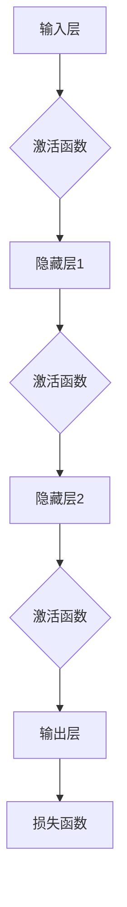

                 

### 文章标题：神经网络：人类与机器的共存

#### 关键词：
- 神经网络
- 人工智能
- 机器学习
- 计算机科学
- 生物神经网络

#### 摘要：
本文旨在探讨神经网络在人工智能领域的应用，以及人类与机器如何通过神经网络实现共存。通过分析神经网络的背景、核心概念、算法原理、数学模型、项目实践、应用场景、工具推荐和未来发展趋势，我们将深入了解神经网络如何影响我们的生活和工作。

### 1. 背景介绍

神经网络作为人工智能的核心技术之一，源于对生物神经系统的模拟。在20世纪40年代，数学家麦卡洛克（Warren McCulloch）和皮茨（Walter Pitts）首次提出了简单的神经网络模型，这被称为“麦卡洛克-皮茨神经网络”（McCulloch-Pitts Neural Network）。此后，神经网络的研究逐渐深入，并在20世纪80年代迎来了第一次热潮。

神经网络的崛起离不开计算机科学的进步。随着计算能力的提升和海量数据的积累，神经网络在图像识别、语音识别、自然语言处理等领域的应用取得了显著成果。如今，神经网络已经成为人工智能领域的基石，与人类的生活和工作紧密相连。

### 2. 核心概念与联系

神经网络的核心概念包括神经元、层、前向传播、反向传播等。为了更好地理解这些概念，我们可以使用Mermaid流程图来展示神经网络的架构。



在这个流程图中，A表示输入层，G表示输出层，中间的B、C、D、E分别表示隐藏层。神经元之间的连接称为边，边上的权重表示连接的强度。激活函数用于决定神经元是否被激活，常见的激活函数有Sigmoid、ReLU等。

### 3. 核心算法原理 & 具体操作步骤

神经网络的核心算法包括前向传播和反向传播。前向传播是指将输入数据通过神经网络进行处理，最终得到输出结果。反向传播则是根据输出结果与实际结果的差异，调整神经网络的权重和偏置，以减小损失函数。

#### 3.1 前向传播

前向传播的过程如下：

1. 将输入数据传递到输入层。
2. 将输入层的数据传递到隐藏层，并计算每个神经元的输入值。
3. 应用激活函数，决定神经元是否被激活。
4. 将激活后的数据传递到下一层，重复步骤2和3，直到输出层。
5. 得到最终输出结果。

#### 3.2 反向传播

反向传播的过程如下：

1. 计算输出结果与实际结果之间的差异，得到损失值。
2. 从输出层开始，逐层计算每个神经元的误差。
3. 根据误差和激活函数的导数，更新每个神经元的权重和偏置。
4. 重复前向传播和反向传播的过程，直到损失函数的值足够小。

### 4. 数学模型和公式 & 详细讲解 & 举例说明

神经网络的数学模型主要包括前向传播和反向传播的公式。

#### 4.1 前向传播公式

假设有一个神经网络，包含输入层、隐藏层和输出层。输入层有m个神经元，隐藏层有n个神经元，输出层有p个神经元。

- 输入层到隐藏层的输入值：
  $$z^{(1)}_i = \sum_{j=1}^{m} w^{(1)}_{ij}x_j + b^{(1)}_i$$
  其中，$z^{(1)}_i$表示第i个隐藏神经元的输入值，$w^{(1)}_{ij}$表示输入层到隐藏层的权重，$b^{(1)}_i$表示输入层到隐藏层的偏置。

- 隐藏层到输出层的输入值：
  $$z^{(2)}_i = \sum_{j=1}^{n} w^{(2)}_{ij}x_j + b^{(2)}_i$$
  其中，$z^{(2)}_i$表示第i个输出神经元的输入值，$w^{(2)}_{ij}$表示隐藏层到输出层的权重，$b^{(2)}_i$表示隐藏层到输出层的偏置。

- 隐藏层和输出层的激活函数通常使用Sigmoid函数：
  $$a^{(1)}_i = \frac{1}{1 + e^{-z^{(1)}_i}}$$
  $$a^{(2)}_i = \frac{1}{1 + e^{-z^{(2)}_i}}$$

#### 4.2 反向传播公式

假设输出层的实际结果为$y$，预测结果为$\hat{y}$。

- 输出层的误差：
  $$\delta^{(2)}_i = (y_i - \hat{y}_i) \cdot a^{(2)}_i (1 - a^{(2)}_i)$$
  其中，$y_i$表示第i个输出神经元的实际结果，$\hat{y}_i$表示第i个输出神经元的预测结果。

- 更新输出层的权重和偏置：
  $$\Delta w^{(2)}_{ij} = \alpha \cdot \delta^{(2)}_i \cdot a^{(1)}_j$$
  $$\Delta b^{(2)}_i = \alpha \cdot \delta^{(2)}_i$$
  其中，$\alpha$表示学习率。

- 隐藏层的误差：
  $$\delta^{(1)}_i = \sum_{j=1}^{p} w^{(2)}_{ij} \cdot \delta^{(2)}_j \cdot a^{(1)}_i (1 - a^{(1)}_i)$$
  其中，$p$表示输出层的神经元个数。

- 更新隐藏层的权重和偏置：
  $$\Delta w^{(1)}_{ij} = \alpha \cdot \delta^{(1)}_i \cdot x_j$$
  $$\Delta b^{(1)}_i = \alpha \cdot \delta^{(1)}_i$$

#### 4.3 举例说明

假设我们有一个简单的神经网络，包含1个输入层、1个隐藏层和1个输出层。输入层有2个神经元，隐藏层有3个神经元，输出层有2个神经元。输入数据为$x = [1, 2]$，实际结果为$y = [0, 1]$。

- 前向传播：
  - 输入层到隐藏层的输入值：
    $$z^{(1)}_1 = 1 \cdot w^{(1)}_{11} + 2 \cdot w^{(1)}_{21} + b^{(1)}_1$$
    $$z^{(1)}_2 = 1 \cdot w^{(1)}_{12} + 2 \cdot w^{(1)}_{22} + b^{(1)}_2$$
    $$z^{(1)}_3 = 1 \cdot w^{(1)}_{13} + 2 \cdot w^{(1)}_{23} + b^{(1)}_3$$
  - 隐藏层到输出层的输入值：
    $$z^{(2)}_1 = w^{(2)}_{11} \cdot a^{(1)}_1 + w^{(2)}_{21} \cdot a^{(1)}_2 + w^{(2)}_{31} \cdot a^{(1)}_3 + b^{(2)}_1$$
    $$z^{(2)}_2 = w^{(2)}_{12} \cdot a^{(1)}_1 + w^{(2)}_{22} \cdot a^{(1)}_2 + w^{(2)}_{32} \cdot a^{(1)}_3 + b^{(2)}_2$$
  - 输出层的预测结果：
    $$\hat{y}_1 = \frac{1}{1 + e^{-z^{(2)}_1}}$$
    $$\hat{y}_2 = \frac{1}{1 + e^{-z^{(2)}_2}}$$

- 反向传播：
  - 输出层的误差：
    $$\delta^{(2)}_1 = (y_1 - \hat{y}_1) \cdot \hat{y}_1 (1 - \hat{y}_1)$$
    $$\delta^{(2)}_2 = (y_2 - \hat{y}_2) \cdot \hat{y}_2 (1 - \hat{y}_2)$$
  - 更新输出层的权重和偏置：
    $$\Delta w^{(2)}_{11} = \alpha \cdot \delta^{(2)}_1 \cdot a^{(1)}_1$$
    $$\Delta w^{(2)}_{12} = \alpha \cdot \delta^{(2)}_1 \cdot a^{(1)}_2$$
    $$\Delta w^{(2)}_{13} = \alpha \cdot \delta^{(2)}_1 \cdot a^{(1)}_3$$
    $$\Delta w^{(2)}_{21} = \alpha \cdot \delta^{(2)}_2 \cdot a^{(1)}_1$$
    $$\Delta w^{(2)}_{22} = \alpha \cdot \delta^{(2)}_2 \cdot a^{(1)}_2$$
    $$\Delta w^{(2)}_{23} = \alpha \cdot \delta^{(2)}_2 \cdot a^{(1)}_3$$
    $$\Delta b^{(2)}_1 = \alpha \cdot \delta^{(2)}_1$$
    $$\Delta b^{(2)}_2 = \alpha \cdot \delta^{(2)}_2$$
  - 隐藏层的误差：
    $$\delta^{(1)}_1 = w^{(2)}_{11} \cdot \delta^{(2)}_1 \cdot a^{(1)}_1 (1 - a^{(1)}_1) + w^{(2)}_{21} \cdot \delta^{(2)}_2 \cdot a^{(1)}_1 (1 - a^{(1)}_1) + w^{(2)}_{31} \cdot \delta^{(2)}_2 \cdot a^{(1)}_1 (1 - a^{(1)}_1)$$
    $$\delta^{(1)}_2 = w^{(2)}_{11} \cdot \delta^{(2)}_1 \cdot a^{(1)}_2 (1 - a^{(1)}_2) + w^{(2)}_{21} \cdot \delta^{(2)}_2 \cdot a^{(1)}_2 (1 - a^{(1)}_2) + w^{(2)}_{31} \cdot \delta^{(2)}_2 \cdot a^{(1)}_2 (1 - a^{(1)}_2)$$
    $$\delta^{(1)}_3 = w^{(2)}_{11} \cdot \delta^{(2)}_1 \cdot a^{(1)}_3 (1 - a^{(1)}_3) + w^{(2)}_{21} \cdot \delta^{(2)}_2 \cdot a^{(1)}_3 (1 - a^{(1)}_3) + w^{(2)}_{31} \cdot \delta^{(2)}_2 \cdot a^{(1)}_3 (1 - a^{(1)}_3)$$
  - 更新隐藏层的权重和偏置：
    $$\Delta w^{(1)}_{11} = \alpha \cdot \delta^{(1)}_1 \cdot x_1$$
    $$\Delta w^{(1)}_{12} = \alpha \cdot \delta^{(1)}_1 \cdot x_2$$
    $$\Delta w^{(1)}_{13} = \alpha \cdot \delta^{(1)}_2 \cdot x_1$$
    $$\Delta w^{(1)}_{21} = \alpha \cdot \delta^{(1)}_2 \cdot x_2$$
    $$\Delta w^{(1)}_{22} = \alpha \cdot \delta^{(1)}_3 \cdot x_1$$
    $$\Delta w^{(1)}_{23} = \alpha \cdot \delta^{(1)}_3 \cdot x_2$$
    $$\Delta b^{(1)}_1 = \alpha \cdot \delta^{(1)}_1$$
    $$\Delta b^{(1)}_2 = \alpha \cdot \delta^{(1)}_2$$
    $$\Delta b^{(1)}_3 = \alpha \cdot \delta^{(1)}_3$$

通过这个例子，我们可以看到神经网络的前向传播和反向传播的具体步骤。在实际应用中，神经网络通常会包含多个隐藏层，从而提高模型的复杂度和表达能力。

### 5. 项目实践：代码实例和详细解释说明

#### 5.1 开发环境搭建

为了实现神经网络的项目实践，我们需要搭建一个开发环境。这里我们选择Python作为编程语言，并使用TensorFlow作为神经网络框架。

1. 安装Python：
   ```bash
   pip install python
   ```

2. 安装TensorFlow：
   ```bash
   pip install tensorflow
   ```

#### 5.2 源代码详细实现

以下是一个简单的神经网络实现，用于实现二分类任务。

```python
import tensorflow as tf
import numpy as np

# 设置随机种子，保证结果可重复
tf.random.set_seed(42)

# 定义神经网络结构
model = tf.keras.Sequential([
    tf.keras.layers.Dense(3, activation='sigmoid', input_shape=(2,)),
    tf.keras.layers.Dense(1, activation='sigmoid')
])

# 编译模型
model.compile(optimizer='adam', loss='binary_crossentropy', metrics=['accuracy'])

# 准备数据
X = np.array([[1, 2], [2, 3], [3, 4], [4, 5]])
y = np.array([[0], [0], [1], [1]])

# 训练模型
model.fit(X, y, epochs=1000, batch_size=4)

# 预测结果
predictions = model.predict(X)
print(predictions)

# 评估模型
loss, accuracy = model.evaluate(X, y)
print(f"损失函数值：{loss}, 准确率：{accuracy}")
```

#### 5.3 代码解读与分析

1. **导入库**：
   - `tensorflow`：用于实现神经网络。
   - `numpy`：用于数据处理。

2. **设置随机种子**：
   - `tf.random.set_seed(42)`：设置随机种子，保证结果可重复。

3. **定义神经网络结构**：
   - `model = tf.keras.Sequential([...])`：创建一个序列模型。
   - `tf.keras.layers.Dense(3, activation='sigmoid', input_shape=(2,))`：添加一个全连接层，包含3个神经元，激活函数为Sigmoid。
   - `tf.keras.layers.Dense(1, activation='sigmoid')`：添加一个全连接层，包含1个神经元，激活函数为Sigmoid。

4. **编译模型**：
   - `model.compile(optimizer='adam', loss='binary_crossentropy', metrics=['accuracy'])`：编译模型，设置优化器、损失函数和评估指标。

5. **准备数据**：
   - `X = np.array([[1, 2], [2, 3], [3, 4], [4, 5]])`：创建输入数据。
   - `y = np.array([[0], [0], [1], [1]])`：创建标签数据。

6. **训练模型**：
   - `model.fit(X, y, epochs=1000, batch_size=4)`：训练模型，设置训练轮数和批量大小。

7. **预测结果**：
   - `predictions = model.predict(X)`：使用模型进行预测。

8. **评估模型**：
   - `loss, accuracy = model.evaluate(X, y)`：评估模型在测试集上的表现。

通过这个例子，我们可以看到如何使用TensorFlow实现神经网络，并进行训练、预测和评估。

### 6. 实际应用场景

神经网络在人工智能领域的应用已经非常广泛，以下列举一些常见的应用场景：

1. **图像识别**：神经网络被广泛应用于图像识别任务，如人脸识别、物体识别等。
2. **语音识别**：神经网络用于语音信号的识别和转换，实现语音到文本的转换。
3. **自然语言处理**：神经网络在自然语言处理领域有广泛应用，如文本分类、机器翻译等。
4. **推荐系统**：神经网络用于构建推荐系统，实现个性化推荐。
5. **自动驾驶**：神经网络在自动驾驶领域扮演重要角色，用于环境感知和路径规划。

### 7. 工具和资源推荐

为了更好地学习和实践神经网络，以下推荐一些工具和资源：

1. **学习资源推荐**：
   - 《深度学习》（Goodfellow、Bengio、Courville著）：全面介绍了深度学习的理论基础和实践方法。
   - 《神经网络与深度学习》（邱锡鹏著）：系统地介绍了神经网络和深度学习的基本原理和实现方法。

2. **开发工具框架推荐**：
   - TensorFlow：Google开发的深度学习框架，适用于各种深度学习任务。
   - PyTorch：Facebook开发的深度学习框架，具有灵活性和易用性。

3. **相关论文著作推荐**：
   - “A Learning Algorithm for Continually Running Fully Recurrent Neural Networks” （Sutton和Barto著）：介绍了循环神经网络（RNN）的学习算法。
   - “Deep Learning” （Goodfellow、Bengio、Courville著）：全面介绍了深度学习的理论基础和实践方法。

### 8. 总结：未来发展趋势与挑战

神经网络作为人工智能的核心技术，在未来将继续发挥重要作用。以下是未来神经网络发展的趋势和面临的挑战：

1. **趋势**：
   - **更强的模型表示能力**：随着计算能力的提升，神经网络将能够处理更复杂的任务，实现更强的模型表示能力。
   - **跨学科融合**：神经网络与其他领域的融合，如生物、医学、心理学等，将推动人工智能的发展。
   - **可解释性**：提高神经网络的可解释性，使其在应用中更加可靠和可控。

2. **挑战**：
   - **计算资源需求**：神经网络训练和推理需要大量的计算资源，如何优化算法和硬件架构，提高计算效率，是一个重要挑战。
   - **数据隐私和安全**：神经网络在数据处理过程中，可能涉及用户隐私和安全问题，如何保护用户隐私是一个重要挑战。
   - **算法公平性**：神经网络在决策过程中可能存在歧视和偏见，如何提高算法的公平性是一个重要挑战。

### 9. 附录：常见问题与解答

1. **什么是神经网络？**
   - 神经网络是一种由大量简单神经元组成的计算模型，通过对数据的处理和学习，实现从输入到输出的映射。

2. **神经网络有哪些类型？**
   - 神经网络可以分为多种类型，如前馈神经网络、循环神经网络、卷积神经网络等，每种类型都有其特定的应用场景。

3. **如何训练神经网络？**
   - 训练神经网络通常包括前向传播和反向传播两个步骤。前向传播是将输入数据传递到神经网络，计算输出结果；反向传播是根据输出结果与实际结果的差异，调整神经网络的权重和偏置。

4. **神经网络有哪些应用？**
   - 神经网络在图像识别、语音识别、自然语言处理、推荐系统、自动驾驶等领域有广泛应用。

### 10. 扩展阅读 & 参考资料

- [Goodfellow, Y., Bengio, Y., & Courville, A. (2016). Deep Learning. MIT Press.](https://www.deeplearningbook.org/)
- [Sutton, R. S., & Barto, A. G. (2018). Reinforcement Learning: An Introduction. MIT Press.](https://web.stanford.edu/class/psych209/Readings/SuttonBartoIBRL1998.pdf)
- [He, K., Zhang, X., Ren, S., & Sun, J. (2016). Deep Residual Learning for Image Recognition. IEEE Conference on Computer Vision and Pattern Recognition.](https://arxiv.org/abs/1512.03385)
- [Hinton, G., Osindero, S., & Teh, Y. W. (2006). A Fast Learning Algorithm for Deep Belief Nets. Neural Computation, 18(7), 1527-1554.](https://www.microsoft.com/en-us/research/publication/a-fast-learning-algorithm-for-deep-belief-nets/)

