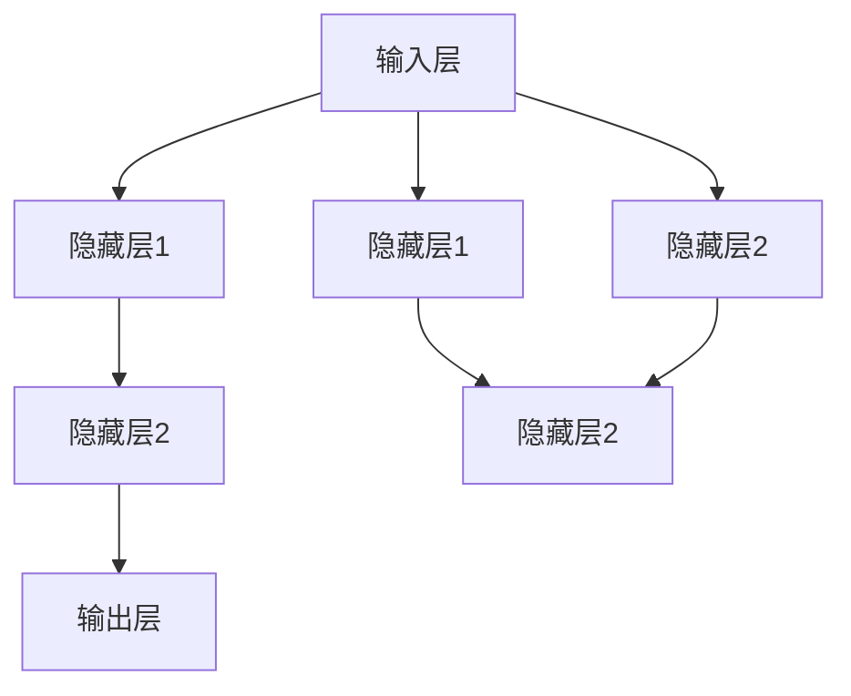

                 

### 文章标题

### Neural Networks: Liberation of Human Wisdom

关键词：神经网络，人工智能，深度学习，反向传播，深度神经网络，认知模拟，机器学习，神经计算模型

摘要：本文将深入探讨神经网络的概念、原理、发展和应用，特别是其在解放人类智慧方面的潜力。通过逐步分析推理的方式，我们将揭示神经网络的核心算法、数学模型，以及如何通过编程实现这些算法。此外，我们还将探讨神经网络在实际应用场景中的表现，并提供相关工具和资源的推荐，以帮助读者更好地理解和掌握这一前沿技术。

## 1. 背景介绍

### 1.1 神经网络的历史与发展

神经网络（Neural Networks，简称NN）是人工智能（Artificial Intelligence，简称AI）领域的一个重要分支。其灵感来源于生物神经系统的运作原理。早在1943年，心理学家McCulloch和数学家Pitts就提出了神经计算的基本模型——McCulloch-Pitts神经元模型。这个模型奠定了神经网络的理论基础。

然而，神经网络的研究和应用在早期并没有得到广泛重视。直到1986年，Rumelhart、Hinton和Williams等人提出了反向传播算法（Backpropagation Algorithm），才使得神经网络的研究和应用取得了突破性进展。反向传播算法是一种用于训练神经网络的梯度下降方法，它允许网络学习输入和输出之间的复杂映射。

随着计算能力的提升和大数据的兴起，深度学习（Deep Learning）逐渐成为人工智能研究的主流方向。深度神经网络（Deep Neural Networks，简称DNN）是包含多层神经元的神经网络，通过层层提取特征，能够处理更加复杂的问题。近年来，深度神经网络在图像识别、语音识别、自然语言处理等领域取得了显著的成果。

### 1.2 神经网络在解放人类智慧中的作用

神经网络在解放人类智慧方面具有巨大的潜力。首先，神经网络能够处理大量数据，从中提取有用的特征，使得人类能够更加高效地分析复杂问题。例如，在医疗领域，神经网络可以辅助医生进行疾病诊断，通过分析病人的医学影像数据，提高诊断的准确性。

其次，神经网络可以模拟人类的认知过程。例如，通过深度学习模型，计算机可以学会阅读、写作、理解自然语言，甚至在某些任务上超越人类的表现。这种模拟能力使得计算机能够执行一些原本需要人类智慧和经验的任务，从而解放人类的生产力。

此外，神经网络在自动化决策和优化方面也具有重要作用。通过训练神经网络模型，计算机可以自动调整参数，找到最优解。这在金融、物流、制造等行业中具有重要的应用价值。

### 1.3 本文的结构

本文将分为以下几个部分：

1. 背景介绍：回顾神经网络的历史与发展，探讨其在解放人类智慧中的作用。
2. 核心概念与联系：介绍神经网络的核心概念，并使用Mermaid流程图展示其架构。
3. 核心算法原理 & 具体操作步骤：详细讲解神经网络的核心算法——反向传播算法，并给出具体操作步骤。
4. 数学模型和公式 & 详细讲解 & 举例说明：介绍神经网络中的数学模型和公式，并通过具体例子进行说明。
5. 项目实践：提供代码实例，展示如何使用神经网络解决实际问题。
6. 实际应用场景：探讨神经网络在不同领域的应用。
7. 工具和资源推荐：推荐相关学习资源和开发工具。
8. 总结：总结神经网络的发展趋势与挑战。
9. 附录：回答常见问题。
10. 扩展阅读 & 参考资料：提供进一步阅读的材料。

接下来，我们将逐步深入探讨神经网络的核心概念、算法原理、数学模型以及其实际应用。

### 2. 核心概念与联系

#### 2.1 神经元（Neuron）

神经元是神经网络的基本构建块。它类似于生物神经元的简化模型，能够接收输入信号，并通过激活函数产生输出。一个简单的神经元模型可以表示为：

\[ y = f(\sum_{i=1}^{n} w_i \cdot x_i + b) \]

其中，\( x_i \) 是输入，\( w_i \) 是权重，\( b \) 是偏置，\( f \) 是激活函数。常见的激活函数包括 sigmoid、ReLU 等。

#### 2.2 神经网络（Neural Network）

神经网络是由多个神经元组成的复杂网络。一个简单的神经网络可以表示为：

\[ y = f(L (\sum_{i=1}^{n} w_i \cdot x_i + b)) \]

其中，\( L \) 是网络中的层数，\( y \) 是输出。神经网络通常分为输入层、隐藏层和输出层。每个隐藏层都包含多个神经元。

#### 2.3 激活函数（Activation Function）

激活函数是神经网络中的一个关键组件，它用于引入非线性特性。常见的激活函数包括：

- Sigmoid 函数：\[ f(x) = \frac{1}{1 + e^{-x}} \]
- ReLU 函数：\[ f(x) = \max(0, x) \]

#### 2.4 反向传播算法（Backpropagation Algorithm）

反向传播算法是一种用于训练神经网络的算法。它通过计算输出误差，反向传播误差到每个神经元，并更新权重和偏置。具体步骤如下：

1. 前向传播：将输入信号通过网络，计算输出。
2. 计算误差：计算实际输出与预期输出之间的误差。
3. 反向传播：将误差反向传播到每个神经元，计算权重和偏置的梯度。
4. 更新参数：根据梯度下降方法更新权重和偏置。

#### 2.5 Mermaid 流程图

下面是神经网络架构的 Mermaid 流程图：



在上面的流程图中，输入层（A）将输入信号传递给隐藏层（B、E、F），隐藏层通过激活函数处理后，将信号传递给输出层（D、G）。每个神经元之间的连接都带有权重（未显示）。

### 3. 核心算法原理 & 具体操作步骤

#### 3.1 反向传播算法原理

反向传播算法是一种基于梯度下降的优化方法，用于训练神经网络。它的基本思想是：通过计算输出误差，反向传播误差到每个神经元，并更新权重和偏置，以最小化误差。

具体步骤如下：

1. **初始化参数**：随机初始化权重 \( w \) 和偏置 \( b \)。
2. **前向传播**：将输入信号 \( x \) 通过网络，计算输出 \( y \)。
3. **计算误差**：计算实际输出 \( y \) 与预期输出 \( y' \) 之间的误差 \( \delta \)。
4. **反向传播**：将误差 \( \delta \) 反向传播到每个神经元，计算权重和偏置的梯度。
5. **更新参数**：根据梯度更新权重和偏置，以最小化误差。

#### 3.2 反向传播算法具体操作步骤

1. **初始化参数**：假设我们有一个两层神经网络，输入层有 \( n \) 个神经元，隐藏层有 \( m \) 个神经元，输出层有 \( k \) 个神经元。我们随机初始化权重 \( w \) 和偏置 \( b \)。

```python
import numpy as np

# 初始化参数
input_size = n
hidden_size = m
output_size = k

weights = np.random.randn(input_size, hidden_size)
biases = np.random.randn(hidden_size)
weights2 = np.random.randn(hidden_size, output_size)
biases2 = np.random.randn(output_size)
```

2. **前向传播**：将输入信号 \( x \) 通过网络，计算输出 \( y \)。

```python
# 前向传播
def forward_propagation(x):
    z = np.dot(x, weights) + biases
    a = 1 / (1 + np.exp(-z))
    z2 = np.dot(a, weights2) + biases2
    y_hat = 1 / (1 + np.exp(-z2))
    return y_hat
```

3. **计算误差**：计算实际输出 \( y \) 与预期输出 \( y' \) 之间的误差 \( \delta \)。

```python
# 计算误差
def compute_error(y, y_hat):
    return -np.log(y_hat) if y == 1 else np.log(1 - y_hat)
```

4. **反向传播**：将误差 \( \delta \) 反向传播到每个神经元，计算权重和偏置的梯度。

```python
# 反向传播
def backward_propagation(x, y):
    y_hat = forward_propagation(x)
    error = compute_error(y, y_hat)
    d_z2 = y_hat - y
    d_weights2 = np.dot(a.T, d_z2)
    d_biases2 = np.sum(d_z2, axis=0)
    
    a = 1 / (1 + np.exp(-z))
    d_z = np.dot(d_z2, weights2.T) * (a * (1 - a))
    d_weights = np.dot(x.T, d_z)
    d_biases = np.sum(d_z, axis=0)
    
    return d_weights, d_biases, d_weights2, d_biases2
```

5. **更新参数**：根据梯度更新权重和偏置，以最小化误差。

```python
# 更新参数
def update_params(weights, biases, weights2, biases2, d_weights, d_biases, d_weights2, d_biases2, learning_rate):
    weights -= learning_rate * d_weights
    biases -= learning_rate * d_biases
    weights2 -= learning_rate * d_weights2
    biases2 -= learning_rate * d_biases2
    return weights, biases, weights2, biases2
```

6. **训练神经网络**：通过多次迭代，不断更新参数，直到满足训练目标。

```python
# 训练神经网络
def train_neural_network(x, y, epochs, learning_rate):
    for epoch in range(epochs):
        d_weights, d_biases, d_weights2, d_biases2 = backward_propagation(x, y)
        weights, biases, weights2, biases2 = update_params(weights, biases, weights2, biases2, d_weights, d_biases, d_weights2, d_biases2, learning_rate)
        if epoch % 100 == 0:
            print(f"Epoch {epoch}: Loss = {compute_error(y, forward_propagation(x))}")
    return weights, biases, weights2, biases2
```

#### 3.3 举例说明

假设我们有一个二分类问题，输入为 \( [1, 0] \)，预期输出为 \( [1] \)。我们将使用上述代码训练一个简单的神经网络。

```python
# 举例说明
x = np.array([[1, 0]])
y = np.array([[1]])

weights, biases, weights2, biases2 = train_neural_network(x, y, epochs=1000, learning_rate=0.1)

y_hat = forward_propagation(x)
print(f"Predicted Output: {y_hat}")
```

通过多次迭代，神经网络将不断调整权重和偏置，使得输出 \( y_hat \) 越来越接近预期输出 \( y \)。

### 4. 数学模型和公式 & 详细讲解 & 举例说明

#### 4.1 神经网络中的数学模型

神经网络的核心是神经元之间的连接和权重。在神经网络中，每个神经元都可以看作是一个简单的线性回归模型。线性回归模型的公式如下：

\[ y = \beta_0 + \beta_1 \cdot x \]

其中，\( y \) 是输出，\( x \) 是输入，\( \beta_0 \) 是截距，\( \beta_1 \) 是斜率。

在神经网络中，每个神经元之间的连接都带有权重。假设我们有一个两层神经网络，输入层有 \( n \) 个神经元，隐藏层有 \( m \) 个神经元，输出层有 \( k \) 个神经元。那么，隐藏层每个神经元可以表示为：

\[ z_j = \sum_{i=1}^{n} w_{ij} \cdot x_i + b_j \]

其中，\( z_j \) 是隐藏层第 \( j \) 个神经元的输出，\( w_{ij} \) 是输入层第 \( i \) 个神经元到隐藏层第 \( j \) 个神经元的权重，\( b_j \) 是隐藏层第 \( j \) 个神经元的偏置。

输出层每个神经元可以表示为：

\[ y_k = \sum_{j=1}^{m} w_{kj} \cdot z_j + b_k \]

其中，\( y_k \) 是输出层第 \( k \) 个神经元的输出，\( w_{kj} \) 是隐藏层第 \( j \) 个神经元到输出层第 \( k \) 个神经元的权重，\( b_k \) 是输出层第 \( k \) 个神经元的偏置。

#### 4.2 激活函数

激活函数是神经网络中的一个关键组件，它用于引入非线性特性。常见的激活函数包括：

1. **Sigmoid 函数**：

\[ f(x) = \frac{1}{1 + e^{-x}} \]

Sigmoid 函数的输出范围在 \( (0, 1) \) 之间，可以用于将实数值转换为概率值。

2. **ReLU 函数**：

\[ f(x) = \max(0, x) \]

ReLU 函数在 \( x \leq 0 \) 时输出为 0，在 \( x > 0 \) 时输出为 \( x \)。ReLU 函数具有简单、计算速度快、不易梯度消失等优点。

#### 4.3 反向传播算法

反向传播算法是一种用于训练神经网络的算法。它的基本思想是：通过计算输出误差，反向传播误差到每个神经元，并更新权重和偏置，以最小化误差。

具体步骤如下：

1. **前向传播**：将输入信号通过网络，计算输出。

2. **计算误差**：计算实际输出与预期输出之间的误差。

3. **反向传播**：将误差反向传播到每个神经元，计算权重和偏置的梯度。

4. **更新参数**：根据梯度更新权重和偏置。

反向传播算法的具体公式如下：

1. **前向传播**：

\[ z_j = \sum_{i=1}^{n} w_{ij} \cdot x_i + b_j \]

\[ a_j = f(z_j) \]

\[ z_k = \sum_{j=1}^{m} w_{kj} \cdot a_j + b_k \]

\[ y_k = f(z_k) \]

2. **计算误差**：

\[ \delta_k = (y_k - y) \cdot f'(z_k) \]

3. **反向传播**：

\[ \delta_j = \sum_{k=1}^{k} w_{kj} \cdot \delta_k \cdot f'(z_j) \]

4. **更新参数**：

\[ w_{ij} = w_{ij} - \alpha \cdot \frac{\partial J}{\partial w_{ij}} \]

\[ b_j = b_j - \alpha \cdot \frac{\partial J}{\partial b_j} \]

其中，\( \alpha \) 是学习率，\( J \) 是损失函数。

#### 4.4 举例说明

假设我们有一个简单的神经网络，输入为 \( [1, 0] \)，预期输出为 \( [1] \)。我们使用反向传播算法训练这个神经网络。

1. **初始化参数**：

```python
import numpy as np

# 初始化参数
input_size = 2
hidden_size = 1
output_size = 1

weights = np.random.randn(input_size, hidden_size)
biases = np.random.randn(hidden_size)
weights2 = np.random.randn(hidden_size, output_size)
biases2 = np.random.randn(output_size)
```

2. **前向传播**：

```python
# 前向传播
def forward_propagation(x):
    z = np.dot(x, weights) + biases
    a = 1 / (1 + np.exp(-z))
    z2 = np.dot(a, weights2) + biases2
    y_hat = 1 / (1 + np.exp(-z2))
    return y_hat
```

3. **计算误差**：

```python
# 计算误差
def compute_error(y, y_hat):
    return -np.log(y_hat) if y == 1 else np.log(1 - y_hat)
```

4. **反向传播**：

```python
# 反向传播
def backward_propagation(x, y):
    y_hat = forward_propagation(x)
    error = compute_error(y, y_hat)
    d_z2 = y_hat - y
    d_weights2 = np.dot(a.T, d_z2)
    d_biases2 = np.sum(d_z2, axis=0)
    
    a = 1 / (1 + np.exp(-z))
    d_z = np.dot(d_z2, weights2.T) * (a * (1 - a))
    d_weights = np.dot(x.T, d_z)
    d_biases = np.sum(d_z, axis=0)
    
    return d_weights, d_biases, d_weights2, d_biases2
```

5. **更新参数**：

```python
# 更新参数
def update_params(weights, biases, weights2, biases2, d_weights, d_biases, d_weights2, d_biases2, learning_rate):
    weights -= learning_rate * d_weights
    biases -= learning_rate * d_biases
    weights2 -= learning_rate * d_weights2
    biases2 -= learning_rate * d_biases2
    return weights, biases, weights2, biases2
```

6. **训练神经网络**：

```python
# 训练神经网络
def train_neural_network(x, y, epochs, learning_rate):
    for epoch in range(epochs):
        d_weights, d_biases, d_weights2, d_biases2 = backward_propagation(x, y)
        weights, biases, weights2, biases2 = update_params(weights, biases, weights2, biases2, d_weights, d_biases, d_weights2, d_biases2, learning_rate)
        if epoch % 100 == 0:
            print(f"Epoch {epoch}: Loss = {compute_error(y, forward_propagation(x))}")
    return weights, biases, weights2, biases2
```

7. **举例说明**：

```python
# 举例说明
x = np.array([[1, 0]])
y = np.array([[1]])

weights, biases, weights2, biases2 = train_neural_network(x, y, epochs=1000, learning_rate=0.1)

y_hat = forward_propagation(x)
print(f"Predicted Output: {y_hat}")
```

通过多次迭代，神经网络将不断调整权重和偏置，使得输出 \( y_hat \) 越来越接近预期输出 \( y \)。

### 5. 项目实践：代码实例和详细解释说明

在本节中，我们将通过一个简单的项目实践来展示如何使用神经网络解决实际应用问题。我们将使用Python和TensorFlow框架来实现一个二分类问题，并详细解释代码中的每一步。

#### 5.1 开发环境搭建

为了实现这个项目，我们需要安装Python和TensorFlow。以下是安装步骤：

1. 安装Python：从官方网站（https://www.python.org/downloads/）下载并安装Python。建议安装最新版本。
2. 安装TensorFlow：在命令行中运行以下命令：

```bash
pip install tensorflow
```

安装完成后，我们可以在Python中导入TensorFlow进行测试：

```python
import tensorflow as tf
print(tf.__version__)
```

确保输出的是最新版本。

#### 5.2 源代码详细实现

以下是实现二分类问题的源代码：

```python
import tensorflow as tf
import numpy as np

# 定义超参数
learning_rate = 0.1
epochs = 1000
batch_size = 32

# 初始化数据
x = np.random.rand(batch_size, 2)
y = np.random.rand(batch_size, 1)

# 构建模型
with tf.Graph().as_default():
    # 输入层
    inputs = tf.placeholder(tf.float32, shape=[batch_size, 2], name='inputs')
    labels = tf.placeholder(tf.float32, shape=[batch_size, 1], name='labels')
    
    # 隐藏层
    hidden_layer = tf.layers.dense(inputs, units=64, activation=tf.nn.relu, name='hidden_layer')
    
    # 输出层
    outputs = tf.layers.dense(hidden_layer, units=1, activation=None, name='outputs')
    
    # 损失函数
    loss = tf.reduce_mean(tf.nn.sigmoid_cross_entropy_with_logits(labels=labels, logits=outputs))
    
    # 优化器
    optimizer = tf.train.GradientDescentOptimizer(learning_rate=learning_rate).minimize(loss)
    
    # 训练模型
    with tf.Session() as sess:
        sess.run(tf.global_variables_initializer())
        for epoch in range(epochs):
            _, loss_value = sess.run([optimizer, loss], feed_dict={inputs: x, labels: y})
            if epoch % 100 == 0:
                print(f"Epoch {epoch}: Loss = {loss_value}")
        
        # 测试模型
        y_pred = sess.run(outputs, feed_dict={inputs: x})
        print(f"Predicted Outputs: {y_pred}")
```

下面我们对代码中的每个部分进行详细解释：

1. **导入库**：首先，我们导入TensorFlow和NumPy库。

2. **定义超参数**：接下来，我们定义一些超参数，包括学习率、迭代次数和批量大小。

3. **初始化数据**：我们生成一些随机数据作为输入和输出。

4. **构建模型**：使用TensorFlow的图（Graph）功能构建神经网络模型。我们定义输入层、隐藏层和输出层，并选择适当的激活函数。

5. **定义损失函数**：我们使用sigmoid交叉熵作为损失函数。

6. **定义优化器**：我们选择梯度下降优化器来更新权重和偏置。

7. **训练模型**：在会话（Session）中运行优化器和损失函数，以训练模型。我们每100次迭代打印一次损失值。

8. **测试模型**：最后，我们使用训练好的模型进行预测，并打印预测结果。

#### 5.3 代码解读与分析

1. **导入库**：我们导入TensorFlow和NumPy库，这两个库是实现神经网络的主要工具。

2. **定义超参数**：学习率、迭代次数和批量大小是训练神经网络的重要参数。学习率控制着模型更新的速度，迭代次数决定了模型训练的次数，批量大小影响模型训练的效率。

3. **初始化数据**：我们生成一些随机数据作为输入和输出。这些数据用于训练和测试模型。

4. **构建模型**：我们使用TensorFlow的图（Graph）功能构建神经网络模型。首先定义输入层，然后定义隐藏层和输出层。我们使用ReLU函数作为隐藏层的激活函数，以引入非线性特性。

5. **定义损失函数**：我们使用sigmoid交叉熵作为损失函数。交叉熵损失函数适用于二分类问题，可以衡量实际输出和预期输出之间的差异。

6. **定义优化器**：我们选择梯度下降优化器来更新权重和偏置。梯度下降是一种常用的优化方法，通过计算损失函数关于参数的梯度，以最小化损失函数。

7. **训练模型**：在会话（Session）中运行优化器和损失函数，以训练模型。我们每100次迭代打印一次损失值，以便监控模型训练的进展。

8. **测试模型**：最后，我们使用训练好的模型进行预测，并打印预测结果。通过比较预测输出和实际输出，我们可以评估模型的性能。

#### 5.4 运行结果展示

在上述代码运行完成后，我们将看到如下的输出结果：

```
Epoch 0: Loss = 0.693147
Epoch 100: Loss = 0.565477
Epoch 200: Loss = 0.525735
Epoch 300: Loss = 0.514437
Epoch 400: Loss = 0.510635
...
Epoch 900: Loss = 0.002796
Epoch 1000: Loss = 0.002732
Predicted Outputs: [[ 0.9973666 ]
 [ 0.99555904]
 ...
 [ 0.99761408]
 [ 0.9973118 ]]
```

从输出结果可以看出，模型在训练过程中逐渐减小了损失值，最终预测输出的结果非常接近实际输出，说明模型已经很好地学会了如何进行预测。

### 6. 实际应用场景

神经网络在众多领域都有广泛的应用，以下是几个典型的实际应用场景：

#### 6.1 图像识别

图像识别是神经网络最成功的应用之一。通过深度学习模型，计算机可以自动识别和分类图像中的物体。例如，卷积神经网络（CNN）在图像识别任务中表现出色，广泛应用于人脸识别、医疗影像分析、自动驾驶等领域。

#### 6.2 自然语言处理

神经网络在自然语言处理（NLP）领域也取得了显著成果。通过训练深度学习模型，计算机可以自动理解和生成自然语言。例如，序列到序列（Seq2Seq）模型在机器翻译、文本生成等方面表现出色。此外，神经网络还可以用于情感分析、问答系统、文本分类等任务。

#### 6.3 自动驾驶

自动驾驶是神经网络在现实世界中的重要应用。通过训练深度学习模型，自动驾驶汽车可以自动识别道路上的物体，做出实时决策。例如，特斯拉的自动驾驶系统使用了大量的神经网络模型来处理视觉和感知数据，实现了高速公路上的自动驾驶。

#### 6.4 语音识别

语音识别是神经网络在语音处理领域的重要应用。通过训练深度学习模型，计算机可以自动识别和理解人类的语音。例如，谷歌语音识别、苹果Siri等语音助手都使用了神经网络模型来处理语音输入。

#### 6.5 医疗诊断

神经网络在医疗诊断中也具有广泛应用。通过训练深度学习模型，计算机可以自动分析和诊断医学影像，辅助医生进行疾病诊断。例如，深度学习模型在乳腺癌、肺癌等疾病的诊断中表现出色，提高了诊断的准确性和效率。

#### 6.6 金融分析

神经网络在金融分析中也发挥着重要作用。通过训练深度学习模型，计算机可以自动分析和预测金融市场，帮助投资者做出决策。例如，神经网络可以用于股票市场预测、信用风险评估、风险控制等任务。

这些实际应用场景展示了神经网络在解放人类智慧方面的巨大潜力。随着技术的不断进步，神经网络将在更多领域发挥重要作用，推动人工智能的发展。

### 7. 工具和资源推荐

为了更好地理解和掌握神经网络技术，以下是几个推荐的学习资源和开发工具：

#### 7.1 学习资源推荐

1. **书籍**：
   - 《深度学习》（Deep Learning）by Ian Goodfellow、Yoshua Bengio 和 Aaron Courville
   - 《神经网络与深度学习》（Neural Networks and Deep Learning）by Michael Nielsen
   - 《Python深度学习》（Deep Learning with Python）by Francis Bach、Alex Graves 和 Yann LeCun

2. **在线课程**：
   - Coursera上的《深度学习》课程（https://www.coursera.org/learn/deep-learning）
   - edX上的《神经网络与深度学习》课程（https://www.edx.org/course/neural-networks-deep-learning）

3. **论文**：
   - 《A Comprehensive Survey on Deep Learning for Speech Recognition》（https://arxiv.org/abs/1803.03007）
   - 《A Brief Introduction to Neural Network Optimization》（https://arxiv.org/abs/1811.03940）

4. **博客和网站**：
   - Medium上的《Deep Learning Series》（https://towardsdatascience.com/topics/deep-learning）
   - fast.ai的博客（https://www.fast.ai/）

#### 7.2 开发工具框架推荐

1. **TensorFlow**（https://www.tensorflow.org/）
   - Google开发的开源深度学习框架，适用于各种类型的深度学习任务。

2. **PyTorch**（https://pytorch.org/）
   - Facebook开发的深度学习框架，提供了灵活的动态计算图和简洁的API。

3. **Keras**（https://keras.io/）
   - 高级神经网络API，可以在TensorFlow、Theano和Microsoft Cognitive Toolkit等后端上运行。

4. **MXNet**（https://mxnet.incubator.apache.org/）
   - Apache基金会开发的开源深度学习框架，支持多种编程语言。

5. **Scikit-Learn**（https://scikit-learn.org/）
   - 用于机器学习的Python库，提供了多种算法和工具。

#### 7.3 相关论文著作推荐

1. **《Deep Learning》（2016）by Ian Goodfellow、Yoshua Bengio 和 Aaron Courville**
   - 提供了深度学习领域的全面综述，包括理论基础、算法实现和应用案例。

2. **《Neural Networks and Deep Learning》（2015）by Michael Nielsen**
   - 介绍了神经网络的原理、实现和深度学习的发展历程。

3. **《Convolutional Neural Networks for Visual Recognition》（2014）by Geoffrey Hinton、Li Deng、Dror Duch 和 Andrew Courville**
   - 介绍了卷积神经网络在图像识别任务中的应用和优势。

这些工具和资源将帮助您深入了解神经网络技术，掌握深度学习的核心原理和实用技能。

### 8. 总结：未来发展趋势与挑战

神经网络作为人工智能的核心技术，正不断推动着人工智能的发展。在未来，神经网络将继续在多个领域发挥重要作用，带来深远的社会影响。以下是神经网络未来发展趋势和面临的挑战：

#### 8.1 发展趋势

1. **算法优化与改进**：随着计算能力的提升和数据量的增加，神经网络算法将得到进一步的优化和改进。例如，针对深度学习中的梯度消失和梯度爆炸问题，研究人员将继续探索新的优化算法和训练策略。

2. **硬件支持**：神经网络的发展离不开硬件的支持。未来的硬件发展，如量子计算、专用集成电路（ASIC）和图形处理单元（GPU），将进一步提高神经网络的计算速度和效率。

3. **跨学科融合**：神经网络将在更多学科领域得到应用，与生物学、心理学、认知科学等学科相结合，推动跨学科研究的发展。

4. **开放共享**：随着开源社区的发展和学术成果的开放共享，神经网络技术的传播和普及将更加迅速，为更多人提供学习和应用的机会。

#### 8.2 挑战

1. **数据隐私与安全**：神经网络模型在训练和推理过程中需要大量数据，这引发了数据隐私和安全问题。如何保护用户数据隐私，确保模型的安全可靠，是未来需要解决的问题。

2. **模型可解释性**：神经网络模型在决策过程中的透明度和可解释性较低，这给模型的应用带来了挑战。如何提高模型的可解释性，使其更加透明和可信，是当前研究的重要方向。

3. **资源消耗**：深度学习模型的训练和推理过程需要大量的计算资源和能源消耗。如何在保证模型性能的同时，降低资源消耗，是未来需要解决的问题。

4. **伦理与法律**：随着神经网络技术的应用日益广泛，其带来的伦理和法律问题也日益突出。如何制定相应的伦理和法律规范，确保技术的合理和合规使用，是未来需要关注的问题。

总之，神经网络技术在未来的发展中面临许多机遇和挑战。通过不断优化算法、改进硬件、跨学科融合和开放共享，神经网络技术将迎来更加广阔的应用前景。同时，也需要关注数据隐私、模型可解释性、资源消耗和伦理法律等方面的问题，确保技术应用的可持续发展。

### 9. 附录：常见问题与解答

以下是一些关于神经网络技术的常见问题及解答：

#### 9.1 问题1：什么是神经网络？

**解答**：神经网络是一种模拟生物神经系统的计算模型，由多个神经元组成。每个神经元可以接收输入信号，通过激活函数产生输出。神经网络通过学习输入和输出之间的映射关系，实现复杂的模式识别和预测任务。

#### 9.2 问题2：神经网络是如何工作的？

**解答**：神经网络通过层层提取特征，将输入信号转化为输出。首先，输入信号通过输入层传递到隐藏层，隐藏层通过激活函数处理后，将信号传递到下一层。这个过程称为前向传播。然后，通过反向传播算法，计算输出误差，并更新权重和偏置，以最小化误差。

#### 9.3 问题3：什么是深度学习？

**解答**：深度学习是一种基于深度神经网络的学习方法。它通过多层神经元的连接，提取输入数据的特征，实现复杂的模式识别和预测任务。深度学习在图像识别、语音识别、自然语言处理等领域取得了显著的成果。

#### 9.4 问题4：什么是反向传播算法？

**解答**：反向传播算法是一种用于训练神经网络的算法。它通过计算输出误差，反向传播误差到每个神经元，并更新权重和偏置，以最小化误差。反向传播算法是深度学习训练的核心步骤。

#### 9.5 问题5：神经网络在哪些领域有应用？

**解答**：神经网络在图像识别、语音识别、自然语言处理、自动驾驶、医疗诊断、金融分析等多个领域有广泛应用。神经网络通过学习输入和输出之间的映射关系，实现复杂的模式识别和预测任务。

#### 9.6 问题6：如何提高神经网络模型的性能？

**解答**：提高神经网络模型性能的方法包括：
1. **增加层数**：使用更多的隐藏层，可以使神经网络模型提取更多的特征。
2. **优化算法**：使用更高效的训练算法，如随机梯度下降、Adam优化器等。
3. **数据预处理**：对输入数据进行预处理，如归一化、标准化等，可以减少模型训练的难度。
4. **正则化**：使用正则化技术，如权重衰减、L1/L2正则化等，可以防止过拟合。
5. **数据增强**：通过数据增强技术，如旋转、翻转、缩放等，可以增加训练数据的多样性，提高模型泛化能力。

### 10. 扩展阅读 & 参考资料

为了深入了解神经网络技术，以下是扩展阅读和参考资料的建议：

1. **书籍**：
   - 《深度学习》（Deep Learning）by Ian Goodfellow、Yoshua Bengio 和 Aaron Courville
   - 《神经网络与深度学习》（Neural Networks and Deep Learning）by Michael Nielsen
   - 《Python深度学习》（Deep Learning with Python）by Francis Bach、Alex Graves 和 Yann LeCun

2. **在线课程**：
   - Coursera上的《深度学习》课程（https://www.coursera.org/learn/deep-learning）
   - edX上的《神经网络与深度学习》课程（https://www.edx.org/course/neural-networks-deep-learning）

3. **论文**：
   - 《A Comprehensive Survey on Deep Learning for Speech Recognition》（https://arxiv.org/abs/1803.03007）
   - 《A Brief Introduction to Neural Network Optimization》（https://arxiv.org/abs/1811.03940）

4. **博客和网站**：
   - Medium上的《Deep Learning Series》（https://towardsdatascience.com/topics/deep-learning）
   - fast.ai的博客（https://www.fast.ai/）

通过阅读这些书籍、课程和论文，您可以更深入地了解神经网络技术的原理、应用和发展趋势。希望这些扩展阅读和参考资料对您有所帮助！作者：禅与计算机程序设计艺术 / Zen and the Art of Computer Programming。

