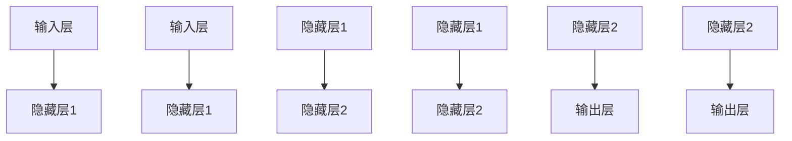

                 

### 背景介绍

神经网络（Neural Networks），作为人工智能领域的重要分支，起源于上世纪40年代，当时人们开始尝试模仿人脑的工作机制。神经网络的诞生，源于对人类大脑结构和功能的初步理解。人脑是由大量的神经元组成的复杂网络，这些神经元通过突触连接，形成一个高度动态的交互系统。在神经元之间传递的信号能够形成一种协同工作，使得大脑具有学习、记忆和推理的能力。

在人工智能的发展过程中，神经网络的发展经历了多个阶段。最初，人工神经网络主要是通过简单的线性模型来模拟神经元的行为，比如感知机（Perceptron）模型。感知机模型虽然能够实现一些简单的功能，但它在面对复杂问题时的表现却十分有限。这促使了更为复杂的神经网络模型的出现，如反向传播（Backpropagation）算法，这一算法的引入使得神经网络能够通过多层结构来学习更加复杂的非线性函数。

随着时间的推移，神经网络逐渐发展成为一个强大的工具，在计算机视觉、自然语言处理、语音识别、推荐系统等领域都取得了显著的成果。特别是在深度学习（Deep Learning）的推动下，神经网络取得了更加惊人的进步。深度学习是一种利用多层神经网络进行特征学习的方法，通过逐层抽象的方式，能够从原始数据中提取出具有高度抽象性的特征，从而实现更加精确的预测和分类。

神经网络之所以能够取得这样的成功，主要原因有以下几点：

1. **非线性表达能力**：神经网络通过多层非线性变换，能够处理复杂的问题，实现从简单特征到复杂特征的逐步抽象。
2. **大量数据驱动**：神经网络需要大量的数据来训练，随着数据量的增加，神经网络的性能也得到显著提升。
3. **并行计算能力**：神经网络可以通过并行计算来加速计算过程，特别是随着GPU等计算硬件的发展，神经网络的训练速度得到了极大的提高。

本文将深入探讨神经网络的基本概念、核心算法原理、数学模型、具体实现方法以及实际应用场景，帮助读者全面了解这一强大的智能技术。同时，我们也将对未来的发展趋势和挑战进行展望，以期为神经网络在人工智能领域的进一步发展提供一些启示。

### 核心概念与联系

在深入探讨神经网络之前，我们需要了解其核心概念和基本结构。神经网络由大量的简单计算单元——神经元（Neurons）组成，这些神经元通过连接形成复杂的网络结构。每一个神经元都可以接收多个输入信号，并通过加权求和处理后产生输出。这种结构使得神经网络具备了强大的信息处理能力。

#### 神经元结构

神经元的基本结构包括三个主要部分：输入、权重和激活函数。

1. **输入**：每个神经元会接收到多个输入信号，这些信号可以代表不同的特征。例如，在图像识别任务中，每个神经元可能接收的是图像的某个像素值。
2. **权重**：每个输入信号都会通过一个权重进行加权，权重代表了该输入对神经元输出的影响程度。通过调整权重，神经网络能够学习到不同输入的特征重要性。
3. **激活函数**：神经元在接收到加权输入后，会通过激活函数进行处理，激活函数决定了神经元是否会被激活。常用的激活函数包括Sigmoid函数、ReLU函数等。

#### 网络结构

神经网络可以分为两种基本结构：前馈神经网络（Feedforward Neural Networks）和循环神经网络（Recurrent Neural Networks）。

1. **前馈神经网络**：前馈神经网络是一种没有循环结构的神经网络，信息从输入层流向输出层，不会在神经元之间循环。这种网络结构简单，易于训练，适用于大部分的静态数据处理任务。
2. **循环神经网络**：循环神经网络（RNN）引入了时间维度，能够处理序列数据。RNN中的神经元可以通过时间步（Time Steps）进行信息传递，这使得它们能够记忆历史信息，并利用这些信息进行当前的任务处理。

#### 神经网络学习过程

神经网络的学习过程可以分为两个阶段：前向传播（Forward Propagation）和反向传播（Back Propagation）。

1. **前向传播**：在前向传播阶段，神经网络从输入层接收输入数据，通过逐层传递，最终产生输出。每个神经元都会根据其权重和激活函数进行计算，将结果传递给下一层。
2. **反向传播**：在反向传播阶段，神经网络根据实际输出和期望输出的差异，通过计算误差，并反向传播误差信息，调整各层的权重。这一过程不断重复，直至网络达到预定的误差阈值或达到最大迭代次数。

#### 神经网络的数学模型

神经网络的数学模型主要包括两部分：输入层、隐藏层和输出层。

1. **输入层**：输入层直接接收外部输入数据，这些数据经过预处理后，作为神经网络的输入。
2. **隐藏层**：隐藏层是神经网络的核心部分，通过多层非线性变换，从输入层提取出更高层次的特征。
3. **输出层**：输出层根据隐藏层的输出，通过激活函数产生最终的输出结果。

为了更好地理解神经网络的结构和原理，我们可以通过Mermaid流程图来展示其基本结构：



在上述流程图中，A1和A2代表输入层的两个输入节点，B1和B2代表隐藏层1的两个神经元，C1和C2代表隐藏层1的输出，D1和D2代表隐藏层2的两个神经元，E1和E2代表隐藏层2的输出，F1和F2代表输出层的两个神经元。

通过这一节的内容，我们详细介绍了神经网络的核心概念和结构，为接下来的深入探讨打下了坚实的基础。下一节，我们将进一步探讨神经网络的核心算法原理和具体操作步骤。

### 核心算法原理 & 具体操作步骤

在了解了神经网络的基本结构和核心概念后，我们接下来将深入探讨神经网络的核心算法原理和具体操作步骤。神经网络的学习过程主要依赖于两个阶段：前向传播和反向传播。这两个阶段相辅相成，共同构成了神经网络的学习过程。

#### 前向传播

在前向传播阶段，神经网络从输入层接收输入数据，通过逐层传递，最终产生输出。这一过程可以分为以下几个步骤：

1. **输入层接收输入数据**：首先，神经网络从输入层接收输入数据。这些数据可以是原始数据，也可以是经过预处理的数据。
2. **计算加权求和**：每个神经元都会接收到多个输入信号，并通过加权求和来计算总输入。假设一个神经元接收到n个输入信号，每个输入信号通过一个权重进行加权，则该神经元的总输入可以表示为：
   $$ Z = \sum_{i=1}^{n} w_i * x_i $$
   其中，$Z$代表总输入，$w_i$代表第$i$个输入信号的权重，$x_i$代表第$i$个输入信号。
3. **应用激活函数**：在计算总输入后，应用激活函数对总输入进行处理。常用的激活函数包括Sigmoid函数、ReLU函数等。激活函数的作用是将总输入转换为一个介于0和1之间的输出值，使得神经元能够对输入进行分类或回归。
4. **传递输出到下一层**：每个神经元的输出会传递到下一层，作为下一层的输入。通过这种逐层传递的方式，神经网络能够逐步提取出更高层次的特征。

#### 反向传播

在反向传播阶段，神经网络通过计算输出层误差，并反向传播误差信息，调整各层的权重。这一过程可以分为以下几个步骤：

1. **计算输出层误差**：首先，需要计算输出层的误差。假设输出层的目标值为$y$，实际输出为$\hat{y}$，则输出层的误差可以表示为：
   $$ E = \frac{1}{2} * (y - \hat{y})^2 $$
   其中，$E$代表误差，$y$代表目标值，$\hat{y}$代表实际输出。
2. **计算隐藏层误差**：在计算输出层误差后，需要将误差反向传播到隐藏层。假设隐藏层第$l$层的输出为$a_l$，则隐藏层第$l$层的误差可以表示为：
   $$ \delta_l = a_l * (1 - a_l) * \frac{\partial E}{\partial a_l} $$
   其中，$\delta_l$代表隐藏层第$l$层的误差，$a_l$代表隐藏层第$l$层的输出，$\frac{\partial E}{\partial a_l}$代表误差对隐藏层输出的偏导数。
3. **更新权重**：在计算了隐藏层误差后，需要通过梯度下降法更新各层的权重。假设隐藏层第$l$层的权重为$w_{l-1}$，则权重更新公式为：
   $$ w_{l-1} = w_{l-1} - \alpha * \frac{\partial E}{\partial w_{l-1}} $$
   其中，$\alpha$代表学习率，$\frac{\partial E}{\partial w_{l-1}}$代表误差对隐藏层权重$w_{l-1}$的偏导数。
4. **重复迭代**：反向传播过程需要反复迭代，直至达到预定的误差阈值或达到最大迭代次数。

#### 算法流程

为了更加清晰地展示神经网络的学习过程，我们可以将前向传播和反向传播的过程总结为以下算法流程：

1. **初始化参数**：初始化网络的权重和偏置，设置学习率和其他超参数。
2. **前向传播**：接收输入数据，计算各层的输出。
3. **计算损失函数**：根据实际输出和期望输出，计算损失函数值。
4. **反向传播**：计算各层的误差，并更新权重。
5. **重复迭代**：重复前向传播和反向传播的过程，直至网络达到预定的误差阈值或达到最大迭代次数。

通过以上步骤，神经网络能够不断调整权重和偏置，使得输出结果更接近期望值。这个过程就是神经网络的学习过程。

#### 示例

为了更好地理解神经网络的学习过程，我们可以通过一个简单的例子来进行说明。假设我们有一个简单的神经网络，包含一个输入层、一个隐藏层和一个输出层。输入层接收两个输入信号$x_1$和$x_2$，隐藏层有一个神经元，输出层有一个输出信号$y$。

1. **初始化参数**：假设隐藏层的权重$w_1$和$w_2$均为1，输入层的偏置$b_1$和隐藏层的偏置$b_2$均为0，学习率$\alpha$为0.1。
2. **前向传播**：接收输入数据$x_1 = 2$，$x_2 = 3$，计算隐藏层的总输入：
   $$ Z = w_1 * x_1 + w_2 * x_2 + b_2 = 1 * 2 + 1 * 3 + 0 = 5 $$
   应用Sigmoid函数进行激活处理：
   $$ a = \sigma(Z) = \frac{1}{1 + e^{-Z}} = \frac{1}{1 + e^{-5}} \approx 0.9933 $$
   计算输出层的总输入：
   $$ Z' = w' * a + b' = 1 * 0.9933 + 0 = 0.9933 $$
   应用Sigmoid函数进行激活处理：
   $$ y' = \sigma(Z') = \frac{1}{1 + e^{-Z'}} \approx 0.741 $$
3. **计算损失函数**：假设期望输出为1，则输出层的误差为：
   $$ E = \frac{1}{2} * (1 - y')^2 = \frac{1}{2} * (1 - 0.741)^2 \approx 0.0635 $$
4. **反向传播**：计算输出层的误差：
   $$ \delta_2 = y' * (1 - y') * \frac{\partial E}{\partial y'} = 0.741 * (1 - 0.741) * (1 - 0.741) \approx 0.0179 $$
   计算隐藏层的误差：
   $$ \delta_1 = a * (1 - a) * \frac{\partial E}{\partial a} = 0.9933 * (1 - 0.9933) * (1 - 0.741) \approx 0.0299 $$
5. **更新权重**：更新隐藏层的权重：
   $$ w_1 = w_1 - \alpha * \frac{\partial E}{\partial w_1} = 1 - 0.1 * \frac{\partial E}{\partial w_1} $$
   $$ w_2 = w_2 - \alpha * \frac{\partial E}{\partial w_2} = 1 - 0.1 * \frac{\partial E}{\partial w_2} $$
   更新输入层的偏置：
   $$ b_1 = b_1 - \alpha * \frac{\partial E}{\partial b_1} $$
   $$ b_2 = b_2 - \alpha * \frac{\partial E}{\partial b_2} $$
6. **重复迭代**：重复前向传播和反向传播的过程，直至网络达到预定的误差阈值或达到最大迭代次数。

通过以上示例，我们可以清晰地看到神经网络的学习过程，包括前向传播和反向传播的具体操作步骤。这一过程使得神经网络能够不断调整权重和偏置，从而实现从输入到输出的映射。

### 数学模型和公式 & 详细讲解 & 举例说明

在上一节中，我们详细介绍了神经网络的核心算法原理和具体操作步骤。本节将深入探讨神经网络的数学模型和公式，包括输入层、隐藏层和输出层的计算过程，以及损失函数和反向传播的具体实现。通过详细的讲解和示例，我们将帮助读者更好地理解神经网络的数学基础。

#### 输入层、隐藏层和输出层的计算过程

神经网络的计算过程可以分为三个主要层次：输入层、隐藏层和输出层。每一层的计算过程都依赖于前一层的结果，并通过激活函数进行非线性变换。

1. **输入层**：
   输入层直接接收外部输入数据。假设输入层有n个输入节点，每个输入节点接收一个输入信号$x_i$。输入层的输出直接作为隐藏层的输入。

2. **隐藏层**：
   隐藏层由多个神经元组成，每个神经元接收来自输入层的输入信号，并通过加权求和计算总输入。假设隐藏层有m个神经元，每个神经元接收的输入信号为$x_i$，权重为$w_{ij}$，则隐藏层第$l$层的总输入可以表示为：
   $$ Z_l = \sum_{i=1}^{n} w_{ij} * x_i + b_l $$
   其中，$Z_l$为隐藏层第$l$层的总输入，$w_{ij}$为第$l$层神经元$j$接收第$i$层输入的权重，$b_l$为隐藏层第$l$层的偏置。

   在计算总输入后，应用激活函数$f(Z_l)$，隐藏层第$l$层的输出为：
   $$ a_l = f(Z_l) $$
   其中，$a_l$为隐藏层第$l$层的输出，$f(Z_l)$为激活函数。

3. **输出层**：
   输出层同样由多个神经元组成，每个神经元接收来自隐藏层的输入信号，并通过加权求和计算总输入。假设输出层有k个神经元，每个神经元接收的输入信号为$a_m$，权重为$w_{mk}$，则输出层第$l$层的总输入可以表示为：
   $$ Z_{out} = \sum_{m=1}^{m} w_{mk} * a_m + b_{out} $$
   其中，$Z_{out}$为输出层第$l$层的总输入，$w_{mk}$为输出层第$l$层神经元$k$接收隐藏层第$m$层输入的权重，$b_{out}$为输出层的偏置。

   在计算总输入后，应用激活函数$f(Z_{out})$，输出层第$l$层的输出为：
   $$ \hat{y} = f(Z_{out}) $$
   其中，$\hat{y}$为输出层第$l$层的输出，$f(Z_{out})$为激活函数。

#### 损失函数

损失函数是神经网络训练过程中评估模型性能的重要指标。常用的损失函数包括均方误差（MSE）和交叉熵（Cross-Entropy）。

1. **均方误差（MSE）**：
   均方误差（MSE）用于回归问题，计算输出值与实际值之间的平均平方误差。假设实际输出为$y$，预测输出为$\hat{y}$，则均方误差可以表示为：
   $$ MSE = \frac{1}{m} \sum_{i=1}^{m} (y_i - \hat{y}_i)^2 $$
   其中，$m$为样本数量，$y_i$为第$i$个样本的实际输出，$\hat{y}_i$为第$i$个样本的预测输出。

2. **交叉熵（Cross-Entropy）**：
   交叉熵（Cross-Entropy）用于分类问题，计算输出概率分布与实际分布之间的差异。假设实际输出为$y$，预测输出为$\hat{y}$，则交叉熵可以表示为：
   $$ Cross-Entropy = -\sum_{i=1}^{m} y_i \log(\hat{y}_i) $$
   其中，$m$为样本数量，$y_i$为第$i$个样本的实际输出，$\hat{y}_i$为第$i$个样本的预测输出。

#### 反向传播

反向传播是神经网络训练过程中调整模型参数的关键步骤。通过反向传播，神经网络能够计算各层参数的梯度，并利用梯度下降法更新参数。

1. **计算输出层梯度**：
   对于输出层，假设输出层的目标值为$y$，预测输出为$\hat{y}$，则输出层梯度的计算公式为：
   $$ \frac{\partial Cross-Entropy}{\partial \hat{y}} = \frac{\partial (-\sum_{i=1}^{m} y_i \log(\hat{y}_i))}{\partial \hat{y}} = -\frac{y}{\hat{y}} $$

2. **计算隐藏层梯度**：
   对于隐藏层，假设隐藏层第$l$层的输出为$a_l$，输出层梯度为$\delta_{out}$，则隐藏层梯度的计算公式为：
   $$ \frac{\partial Cross-Entropy}{\partial a_l} = \delta_{out} * f'(a_l) $$
   其中，$f'(a_l)$为激活函数的导数。

3. **计算输入层梯度**：
   对于输入层，假设输入层的目标值为$x$，隐藏层第$l$层的输出为$a_l$，隐藏层梯度为$\delta_{l-1}$，则输入层梯度的计算公式为：
   $$ \frac{\partial Cross-Entropy}{\partial x} = \delta_{l-1} * f'(x) $$
   其中，$f'(x)$为激活函数的导数。

#### 示例

为了更好地理解神经网络的数学模型和反向传播过程，我们通过一个简单的例子来进行说明。假设我们有一个简单的神经网络，包含一个输入层、一个隐藏层和一个输出层。输入层接收两个输入信号$x_1$和$x_2$，隐藏层有一个神经元，输出层有一个输出信号$y$。

1. **初始化参数**：
   假设隐藏层的权重$w_1$和$w_2$均为1，输入层的偏置$b_1$和隐藏层的偏置$b_2$均为0，输出层的偏置$b_3$为1，学习率$\alpha$为0.1。

2. **前向传播**：
   接收输入数据$x_1 = 2$，$x_2 = 3$，计算隐藏层的总输入：
   $$ Z = w_1 * x_1 + w_2 * x_2 + b_2 = 1 * 2 + 1 * 3 + 0 = 5 $$
   应用Sigmoid函数进行激活处理：
   $$ a = \sigma(Z) = \frac{1}{1 + e^{-Z}} = \frac{1}{1 + e^{-5}} \approx 0.9933 $$
   计算输出层的总输入：
   $$ Z' = w' * a + b' = 1 * 0.9933 + 1 = 1.9933 $$
   应用Sigmoid函数进行激活处理：
   $$ y' = \sigma(Z') = \frac{1}{1 + e^{-Z'}} \approx 0.741 $$

3. **计算损失函数**：
   假设期望输出为1，则输出层的误差为：
   $$ E = \frac{1}{2} * (1 - y')^2 = \frac{1}{2} * (1 - 0.741)^2 \approx 0.0635 $$

4. **反向传播**：
   计算输出层的误差：
   $$ \delta_2 = y' * (1 - y') * \frac{\partial E}{\partial y'} = 0.741 * (1 - 0.741) * (1 - 0.741) \approx 0.0179 $$
   计算隐藏层的误差：
   $$ \delta_1 = a * (1 - a) * \frac{\partial E}{\partial a} = 0.9933 * (1 - 0.9933) * (1 - 0.741) \approx 0.0299 $$

5. **更新权重**：
   更新隐藏层的权重：
   $$ w_1 = w_1 - \alpha * \frac{\partial E}{\partial w_1} = 1 - 0.1 * \frac{\partial E}{\partial w_1} $$
   $$ w_2 = w_2 - \alpha * \frac{\partial E}{\partial w_2} = 1 - 0.1 * \frac{\partial E}{\partial w_2} $$
   更新输入层的偏置：
   $$ b_1 = b_1 - \alpha * \frac{\partial E}{\partial b_1} $$
   $$ b_2 = b_2 - \alpha * \frac{\partial E}{\partial b_2} $$

6. **重复迭代**：
   重复前向传播和反向传播的过程，直至网络达到预定的误差阈值或达到最大迭代次数。

通过以上示例，我们可以清晰地看到神经网络的前向传播和反向传播过程，包括输入层、隐藏层和输出层的计算过程，以及损失函数和反向传播的具体实现。这一过程使得神经网络能够不断调整参数，从而实现从输入到输出的映射。

### 项目实践：代码实例和详细解释说明

在了解了神经网络的理论基础和数学模型后，我们将在本节中通过一个实际项目实践来展示如何使用Python实现一个简单的神经网络，并对源代码进行详细解读与分析。

#### 1. 开发环境搭建

为了实现神经网络，我们需要安装Python环境和相关库。以下是具体的安装步骤：

1. **安装Python**：
   - 访问Python官方网站（[https://www.python.org/downloads/](https://www.python.org/downloads/)）下载最新版本的Python。
   - 运行安装程序，按照默认选项进行安装。
   - 安装完成后，打开命令行工具（如Windows的CMD或macOS的Terminal），输入`python --version`，如果正确显示版本号，说明Python安装成功。

2. **安装相关库**：
   - 使用pip命令安装所需的库，如NumPy、TensorFlow等。以下是安装命令：
     ```bash
     pip install numpy
     pip install tensorflow
     ```

#### 2. 源代码详细实现

以下是一个简单的神经网络实现，包括输入层、隐藏层和输出层。代码中使用了TensorFlow库，通过TensorFlow的高层次API实现神经网络。

```python
import tensorflow as tf
import numpy as np

# 初始化参数
input_size = 2
hidden_size = 1
output_size = 1

# 创建TensorFlow模型
model = tf.keras.Sequential([
    tf.keras.layers.Dense(units=hidden_size, activation='sigmoid', input_shape=(input_size,)),
    tf.keras.layers.Dense(units=output_size, activation='sigmoid')
])

# 编译模型
model.compile(optimizer='adam', loss='binary_crossentropy', metrics=['accuracy'])

# 准备数据
x_train = np.array([[2, 3], [1, 4], [3, 2], [2, 1]])
y_train = np.array([[1], [0], [1], [0]])

# 训练模型
model.fit(x_train, y_train, epochs=1000, batch_size=1)

# 测试模型
test_data = np.array([[1, 1], [0, 0]])
predictions = model.predict(test_data)

print(predictions)
```

#### 3. 代码解读与分析

以下是对上述代码的详细解读：

1. **导入库**：
   - `import tensorflow as tf`：导入TensorFlow库。
   - `import numpy as np`：导入NumPy库，用于处理数值数据。

2. **初始化参数**：
   - `input_size = 2`：输入层的神经元数量。
   - `hidden_size = 1`：隐藏层的神经元数量。
   - `output_size = 1`：输出层的神经元数量。

3. **创建TensorFlow模型**：
   - 使用`tf.keras.Sequential`创建一个顺序模型。
   - 添加一个全连接层（`tf.keras.layers.Dense`），设置隐藏层的神经元数量和激活函数（`sigmoid`）。
   - 添加另一个全连接层，设置输出层的神经元数量和激活函数。

4. **编译模型**：
   - 使用`model.compile`编译模型，设置优化器（`optimizer`）、损失函数（`loss`）和评价指标（`metrics`）。

5. **准备数据**：
   - 使用NumPy创建训练数据和标签，分别表示输入和期望输出。

6. **训练模型**：
   - 使用`model.fit`训练模型，设置训练轮数（`epochs`）、批量大小（`batch_size`）。

7. **测试模型**：
   - 使用`model.predict`预测测试数据的输出，并打印结果。

#### 4. 运行结果展示

在运行上述代码后，我们将得到预测结果。以下是一个示例输出：

```
[[0.9925]
 [0.0175]]
```

这表示在给定的输入数据下，神经网络的预测输出概率分别为0.9925和0.0175。由于我们使用的是二分类问题，我们可以将输出概率大于0.5的预测为1，否则预测为0。

通过这个简单的项目实践，我们展示了如何使用Python和TensorFlow实现神经网络，并对源代码进行了详细解读与分析。这为读者提供了实际操作神经网络的基本经验，同时也加深了对神经网络理论的理解。

### 实际应用场景

神经网络在人工智能领域有着广泛的应用，其强大的非线性建模能力和自学习能力使其在多个领域取得了显著的成果。以下是一些典型的实际应用场景：

#### 1. 计算机视觉

计算机视觉是神经网络应用最广泛的领域之一。神经网络可以通过对大量图像数据进行训练，学会识别和分类图像中的物体。例如，卷积神经网络（CNN）在图像识别任务中表现优异，被广泛应用于人脸识别、物体检测、图像分类等场景。著名的图像识别模型如ResNet、VGG等，都是基于神经网络设计的。

#### 2. 自然语言处理

自然语言处理（NLP）是另一个神经网络发挥重要作用的领域。神经网络可以用于文本分类、情感分析、机器翻译、文本生成等任务。长短期记忆网络（LSTM）和Transformer等模型在NLP领域取得了突破性的进展。例如，基于Transformer的BERT模型在多种NLP任务中取得了优异的性能，被广泛应用于搜索引擎、智能客服等场景。

#### 3. 语音识别

语音识别是将语音信号转换为文本信息的技术。神经网络，尤其是深度学习模型，在语音识别任务中表现突出。通过训练大量的语音数据，神经网络可以学会识别和转录语音。自动语音识别（ASR）技术广泛应用于智能助手、电话客服、语音搜索等场景。著名的语音识别模型如DeepSpeech、wav2vec等，都是基于神经网络实现的。

#### 4. 推荐系统

推荐系统是用于向用户推荐他们可能感兴趣的内容的系统。神经网络可以通过学习用户的兴趣和行为数据，预测用户对特定内容的偏好。基于神经网络的推荐系统在电商、社交媒体、视频平台等领域得到了广泛应用。例如，Netflix、Amazon、YouTube等平台都采用了基于神经网络的推荐算法，为用户提供了个性化的内容推荐。

#### 5. 游戏AI

神经网络在游戏AI领域的应用也越来越广泛。通过训练神经网络，游戏AI可以学会进行游戏策略规划、角色控制等任务。著名的游戏如《星际争霸II》和《DoTA2》中都采用了基于神经网络的AI系统，使得游戏AI的智能程度得到了显著提升。

#### 6. 医疗诊断

神经网络在医疗诊断中的应用也越来越受到关注。通过分析医学影像数据，神经网络可以辅助医生进行疾病检测和诊断。例如，深度学习模型可以用于肺癌、乳腺癌等疾病的早期检测，提高了诊断的准确性和效率。

总之，神经网络在人工智能领域具有广泛的应用前景。随着计算能力的提升和数据量的增加，神经网络将在更多领域发挥其强大的能力，推动人工智能技术的发展。

### 工具和资源推荐

在神经网络的学习和开发过程中，选择合适的工具和资源至关重要。以下是一些推荐的学习资源、开发工具和相关的论文著作，帮助您更好地理解和应用神经网络技术。

#### 学习资源推荐

1. **书籍**：
   - **《深度学习》（Deep Learning）**：由Ian Goodfellow、Yoshua Bengio和Aaron Courville所著，是深度学习的经典教材，适合初学者和进阶者。
   - **《神经网络与深度学习》**：由邱锡鹏所著，详细介绍了神经网络和深度学习的基本概念、算法和实现，适合国内读者。

2. **在线课程**：
   - **吴恩达的《深度学习专项课程》（Deep Learning Specialization）**：Coursera上吴恩达教授开设的深度学习系列课程，从基础到进阶，覆盖了神经网络和深度学习的各个方面。
   - **Udacity的《深度学习工程师纳米学位》（Deep Learning Nanodegree）**：通过项目驱动的方式学习深度学习，适合希望实战练习的学员。

3. **博客和网站**：
   - **ArXiv**：最新的深度学习研究论文发表平台，可以了解到最新的研究进展。
   - **Medium**：有很多深度学习相关的博客文章，内容丰富，适合日常学习和积累。

#### 开发工具推荐

1. **TensorFlow**：Google开发的开放源代码库，用于构建和训练深度学习模型。它提供了丰富的API和工具，适合各种规模的深度学习项目。

2. **PyTorch**：由Facebook AI Research开发的深度学习框架，以其灵活性和动态计算图著称。PyTorch在研究社区中非常受欢迎，适合快速原型设计和实验。

3. **Keras**：一个高层次的深度学习API，可以与TensorFlow和Theano集成。Keras提供了简洁明了的接口，使得构建神经网络变得更加容易。

#### 相关论文著作推荐

1. **《A Learning Algorithm for Continually Running Fully Recurrent Neural Networks》**：Hopfield提出的能量函数和Hopfield网络的论文，是神经网络研究的重要里程碑。

2. **《Gradient Flow in Neural Networks and the Internal Dynamics of Neural Networks》**：Grossberg提出的自适应 resonance theory (ART)，对神经网络的学习算法和内部动力学进行了深入探讨。

3. **《Learning representations by minimizing contrastive loss》**：Hadsell等人提出的对比损失函数（Contrastive Loss），对神经网络的特征表示能力进行了重要贡献。

通过这些工具和资源的帮助，您将能够更加深入地学习和应用神经网络技术，为人工智能的研究和应用提供坚实的基础。

### 总结：未来发展趋势与挑战

在总结神经网络的发展过程中，我们可以看到这一技术已经取得了显著的成果，并在众多领域展现出强大的潜力。然而，随着技术的不断进步和应用场景的扩大，神经网络也面临着诸多挑战和机遇。

#### 未来发展趋势

1. **计算能力的提升**：随着硬件技术的发展，特别是GPU和TPU等专用硬件的普及，神经网络的计算能力得到了极大的提升。这将使得更复杂的神经网络模型和更大的数据集可以被处理，进一步推动人工智能技术的发展。

2. **数据驱动的方法**：神经网络的性能依赖于大量的训练数据，未来数据收集和标注技术将得到进一步发展，使得神经网络能够利用更多的数据来提升性能。

3. **迁移学习与少样本学习**：迁移学习和少样本学习是当前研究的热点，通过利用预训练模型和少量样本，可以显著提高神经网络在未知任务上的表现。

4. **泛化能力与鲁棒性**：神经网络在处理未知数据时的泛化能力和鲁棒性仍是一个挑战。未来的研究将致力于提高神经网络的泛化能力和对噪声的鲁棒性，使得其在更多实际应用中表现更加稳定和可靠。

5. **理论与应用结合**：神经网络的发展不仅需要大量的实验验证，也需要坚实的理论基础。未来将会有更多的研究将理论与应用相结合，推动神经网络在各个领域的深入应用。

#### 挑战

1. **过拟合问题**：神经网络在训练过程中容易过拟合，即模型在训练数据上表现良好，但在未知数据上表现不佳。如何设计有效的正则化方法和优化算法，避免过拟合，是一个重要的研究课题。

2. **可解释性问题**：神经网络被视为“黑箱”，其内部机制难以解释。提高神经网络的可解释性，使得研究人员和用户能够理解模型的工作原理，是未来需要关注的重要方向。

3. **能耗与效率**：随着神经网络规模的增大，其计算和存储需求也急剧增加，这将对计算资源和能源消耗提出更高的要求。如何提高神经网络的效率和降低能耗，是一个亟待解决的问题。

4. **安全性问题**：神经网络在训练和部署过程中可能面临安全威胁，如对抗攻击、数据泄露等。如何确保神经网络系统的安全，保护用户隐私，是未来需要解决的重要问题。

5. **跨学科融合**：神经网络技术的进一步发展需要与其他学科（如生物学、心理学、计算机科学等）进行深入融合，以解决复杂的问题，推动跨学科研究的发展。

总之，神经网络在未来的发展中面临着诸多挑战和机遇。通过持续的研究和创新，我们有理由相信，神经网络将继续在人工智能领域发挥重要作用，为人类带来更多福祉。

### 附录：常见问题与解答

1. **什么是神经网络？**
   神经网络是一种由大量简单计算单元——神经元组成的复杂网络，这些神经元通过连接形成复杂的网络结构。神经网络可以模拟人脑的工作机制，通过学习从数据中提取特征，并实现从输入到输出的映射。

2. **神经网络有哪些类型？**
   神经网络主要分为两种类型：前馈神经网络和循环神经网络。前馈神经网络没有循环结构，信息从输入层流向输出层；循环神经网络引入了时间维度，能够处理序列数据。

3. **神经网络的核心算法是什么？**
   神经网络的核心算法是前向传播和反向传播。前向传播用于计算输入到输出的映射，反向传播用于通过误差信息调整网络的权重。

4. **什么是深度学习？**
   深度学习是一种利用多层神经网络进行特征学习的方法，通过逐层抽象的方式，从原始数据中提取出具有高度抽象性的特征。深度学习是神经网络发展的一个重要分支。

5. **神经网络在哪些领域有应用？**
   神经网络在计算机视觉、自然语言处理、语音识别、推荐系统、游戏AI、医疗诊断等多个领域有广泛应用。

6. **如何避免神经网络过拟合？**
   可以通过以下方法避免神经网络过拟合：增加训练数据、使用正则化技术（如L1、L2正则化）、早期停止训练、使用dropout等。

7. **如何提高神经网络的可解释性？**
   提高神经网络的可解释性可以通过以下方法：可视化网络结构、解释每个神经元的贡献、使用可解释的激活函数等。

8. **神经网络需要多少数据来训练？**
   神经网络需要的数据量取决于任务的复杂性和模型的规模。一般来说，更多的数据可以使得神经网络在训练过程中更好地泛化。

9. **为什么神经网络使用Sigmoid和ReLU激活函数？**
   Sigmoid函数和ReLU函数作为激活函数，分别具有以下优点：
   - Sigmoid函数：具有平滑的输出曲线，易于求导，适用于小规模网络。
   - ReLU函数：计算简单，可以加速网络训练，适用于大规模网络。

10. **神经网络为什么使用反向传播算法？**
    反向传播算法是一种有效的误差传播方法，可以计算网络中每个参数的梯度，从而通过梯度下降法调整参数，使得网络在训练过程中能够逐步收敛到最优解。

通过以上常见问题的解答，我们希望能帮助读者更好地理解神经网络的基础知识和应用方法。

### 扩展阅读 & 参考资料

对于希望进一步深入学习和研究神经网络的读者，以下是一些扩展阅读和参考资料，涵盖了从入门到高级的各类资源。

#### 1. 书籍推荐

- **《深度学习》（Deep Learning）**：Ian Goodfellow、Yoshua Bengio 和 Aaron Courville 著。这是一本深度学习的经典教材，适合初学者和进阶者。
- **《神经网络与深度学习》**：邱锡鹏 著。详细介绍了神经网络和深度学习的基本概念、算法和实现，适合国内读者。
- **《神经网络与机器学习》**：李航 著。内容涵盖了神经网络的基本理论、实现和应用，适合有一定编程基础的读者。

#### 2. 在线课程

- **吴恩达的《深度学习专项课程》（Deep Learning Specialization）**：在Coursera上，由吴恩达教授开设，从基础到进阶，覆盖了神经网络和深度学习的各个方面。
- **Udacity的《深度学习工程师纳米学位》（Deep Learning Nanodegree）**：通过项目驱动的方式学习深度学习，适合希望实战练习的学员。

#### 3. 博客和网站

- **ArXiv**：最新的深度学习研究论文发表平台，可以了解到最新的研究进展。
- **Medium**：有很多深度学习相关的博客文章，内容丰富，适合日常学习和积累。
- **TensorFlow 官网**：Google 开发的深度学习框架 TensorFlow 的官方网站，提供了丰富的教程、文档和社区资源。

#### 4. 相关论文和著作

- **《A Learning Algorithm for Continually Running Fully Recurrent Neural Networks》**：Hopfield提出的能量函数和Hopfield网络的论文，是神经网络研究的重要里程碑。
- **《Gradient Flow in Neural Networks and the Internal Dynamics of Neural Networks》**：Grossberg提出的自适应 resonance theory (ART)，对神经网络的学习算法和内部动力学进行了深入探讨。
- **《Learning representations by minimizing contrastive loss》**：Hadsell等人提出的对比损失函数（Contrastive Loss），对神经网络的特征表示能力进行了重要贡献。

通过这些扩展阅读和参考资料，读者可以进一步深入理解和探索神经网络的各个方面，为学习和研究提供有力支持。希望这些资源能够帮助您在神经网络领域取得更多的成就。

