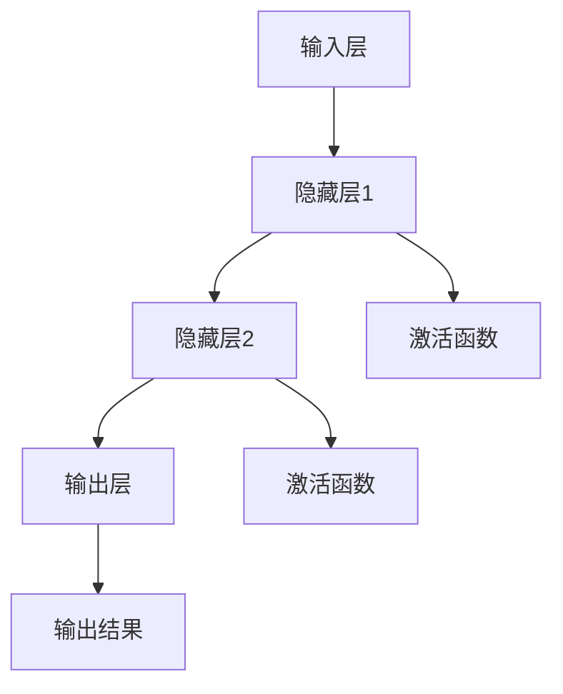

                 

### 背景介绍

#### 神经网络：智能革命的先驱

随着科技的发展，人工智能（AI）逐渐成为当今社会的重要驱动力。而神经网络作为人工智能的核心技术之一，正引领着这场智能革命。神经网络（Neural Networks，简称NN）起源于对人类大脑神经元工作原理的模拟，通过模拟大脑的神经元结构和信息处理方式，实现对复杂数据的分析和决策。

神经网络的概念最早可以追溯到1943年，由心理学家McCulloch和数学家Pitts提出了神经网络的雏形——MP模型。随后，1958年，Frank Rosenblatt发明了感知机（Perceptron）模型，为神经网络的发展奠定了基础。然而，由于早期的算法训练速度慢、效果差，神经网络的研究一度陷入低谷。

直到20世纪80年代末、90年代初，随着计算机硬件的发展、算法的改进以及大数据的积累，神经网络的研究开始迎来新的春天。特别是2006年，Geoffrey Hinton等人提出了深度学习（Deep Learning）的概念，将神经网络推向了新的高度。深度学习通过多层神经网络，实现了对复杂数据的高效建模和预测，从而在图像识别、自然语言处理、语音识别等领域取得了重大突破。

如今，神经网络已经成为人工智能领域的重要研究方向，广泛应用于各行各业，包括但不限于自动驾驶、医疗诊断、金融风控、智能客服等。神经网络的出现，不仅改变了传统的人工智能技术路线，也为未来的智能发展奠定了基础。

#### 神经网络的重要性

神经网络的重要性不言而喻。首先，神经网络具有极强的适应性，能够通过学习海量数据自动提取特征，从而实现对未知数据的分类和预测。这一特性使得神经网络在图像识别、自然语言处理等任务中具有天然的优势。

其次，神经网络具有良好的泛化能力。通过多层神经元的组合，神经网络能够模拟人类大脑的思维方式，实现对复杂问题的抽象和建模。这使得神经网络在处理复杂问题时，能够提供更为准确和可靠的解决方案。

此外，神经网络还具有很强的可扩展性。随着计算能力和数据量的不断提升，神经网络可以通过增加层数、调整参数等方式，不断提高其性能和精度。这使得神经网络在应对未来复杂的智能任务时，具有巨大的潜力。

总之，神经网络作为人工智能的重要基石，正引领着智能科技的快速发展。它不仅为各行各业提供了强大的技术支持，也为未来智能社会的发展提供了无限可能。

### 核心概念与联系

#### 神经网络的基本概念

神经网络是一种由大量简单神经元组成的复杂网络，通过模拟生物神经系统的结构和功能，实现对信息的高效处理和传输。每个神经元都可以视为一个处理单元，它们通过连接的方式相互协作，共同完成对输入数据的分析和决策。

**神经元**

神经元是神经网络的基本组成单元，它由输入层、输出层和中间层组成。输入层接收外部信息，中间层通过神经元之间的连接进行信息传递和处理，输出层产生最终的决策结果。

**网络结构**

神经网络可以分为输入层、隐藏层和输出层。输入层接收外部信息，隐藏层通过神经元之间的连接进行信息传递和处理，输出层产生最终的决策结果。

**神经元连接**

神经元之间的连接可以通过权重（weights）来表示，这些权重决定了信息传递的强度。每个连接都有相应的权重值，通过调整这些权重值，可以优化神经网络的性能。

**激活函数**

激活函数是神经元处理信息的关键环节，它用于将神经元的输入转换为输出。常见的激活函数包括线性函数、Sigmoid函数、ReLU函数等。不同的激活函数可以影响神经网络的性能和表现。

#### 神经网络的联系

神经网络与生物神经系统的联系主要体现在以下几个方面：

1. **结构相似性**

   神经网络的结构与生物神经系统的神经元结构具有很高的相似性。每个神经元都可以视为一个处理单元，它们通过连接的方式相互协作，共同完成对输入数据的分析和决策。

2. **信息处理方式**

   生物神经系统的信息处理方式与神经网络具有相似性。生物神经系统通过神经元之间的连接和激活函数，实现对信息的传递和处理。神经网络同样通过神经元之间的连接和激活函数，实现对输入数据的分析和决策。

3. **自适应能力**

   生物神经系统具有很强的自适应能力，可以适应不同的环境和任务。神经网络同样具备这一特性，通过不断学习和调整权重，可以适应各种复杂的任务场景。

4. **层级结构**

   生物神经系统的结构具有层级性，从简单的感知任务到复杂的认知任务，每个层级都承担不同的功能。神经网络同样具有层级结构，通过多层神经元的组合，可以实现对复杂问题的抽象和建模。

#### Mermaid 流程图表示

下面是神经网络的基本结构和使用Mermaid语言表示的流程图：



在上述流程图中，A表示输入层，B、C、D表示隐藏层和输出层，E、F表示激活函数。通过这种结构，神经网络可以实现对输入数据的处理和决策。

### 核心算法原理 & 具体操作步骤

#### 反向传播算法

神经网络的核心算法是反向传播算法（Backpropagation Algorithm），它通过不断调整网络中的权重，使网络的输出误差最小。反向传播算法分为两个阶段：前向传播和反向传播。

1. **前向传播**

   在前向传播阶段，输入数据通过神经网络从输入层传递到输出层。每个神经元将输入数据与自身的权重相乘，并经过激活函数处理后传递到下一层。这一过程重复进行，直到最后输出层的输出结果。

2. **反向传播**

   在反向传播阶段，根据输出结果与实际结果的误差，通过反向传递误差来更新网络中的权重。具体步骤如下：

   a. 计算输出层的误差：$$ \Delta_{output} = target - output $$
   
   b. 计算隐藏层的误差：$$ \Delta_{hidden} = \frac{\partial L}{\partial z} \odot \frac{\partial z}{\partial y} $$
   
   c. 更新权重：$$ \Delta w = learning\_rate \cdot \Delta $$
   
   d. 更新偏置：$$ \Delta b = learning\_rate \cdot \Delta $$

3. **优化算法**

   在反向传播过程中，通常使用梯度下降（Gradient Descent）算法来更新权重。梯度下降算法通过计算损失函数关于权重的梯度，并沿着梯度的反方向更新权重，从而最小化损失函数。

   $$ w_{new} = w_{old} - \alpha \cdot \nabla_w L(w) $$

   其中，$$ \alpha $$ 是学习率，$$ w_{old} $$ 和 $$ w_{new} $$ 分别为当前权重和更新后的权重，$$ \nabla_w L(w) $$ 是损失函数关于权重的梯度。

#### 具体操作步骤

1. **初始化**

   随机初始化网络的权重和偏置。通常，权重和偏置的初始值在$$ [-1, 1] $$ 或 $$ [-0.1, 0.1] $$ 范围内。

2. **前向传播**

   将输入数据传递到神经网络，通过激活函数处理，得到输出结果。

3. **计算误差**

   计算输出结果与实际结果的误差，计算误差的损失函数。

4. **反向传播**

   根据损失函数的梯度，更新网络的权重和偏置。

5. **迭代优化**

   重复前向传播和反向传播过程，不断优化网络性能，直到满足预设的条件，如误差阈值或迭代次数。

6. **评估性能**

   使用验证集或测试集评估网络的性能，确保网络在未知数据上的表现良好。

通过上述步骤，神经网络可以逐步学习并优化其性能，实现对复杂数据的分类和预测。

### 数学模型和公式 & 详细讲解 & 举例说明

#### 损失函数

在神经网络中，损失函数用于衡量预测值与真实值之间的差距。常见的损失函数包括均方误差（MSE）、交叉熵损失（Cross-Entropy Loss）等。

1. **均方误差（MSE）**

   均方误差是最常用的损失函数之一，用于回归问题。它的公式如下：

   $$ L(y, \hat{y}) = \frac{1}{2} \sum_{i=1}^{n} (y_i - \hat{y}_i)^2 $$

   其中，$$ y $$ 是真实值，$$ \hat{y} $$ 是预测值，$$ n $$ 是样本数量。

2. **交叉熵损失（Cross-Entropy Loss）**

   交叉熵损失常用于分类问题。它的公式如下：

   $$ L(y, \hat{y}) = -\sum_{i=1}^{n} y_i \log(\hat{y}_i) $$

   其中，$$ y $$ 是真实标签的one-hot编码，$$ \hat{y} $$ 是预测概率。

#### 反向传播算法

反向传播算法是神经网络训练的核心，通过不断调整权重和偏置，使网络的损失函数最小。下面是反向传播算法的详细步骤。

1. **前向传播**

   将输入数据传递到神经网络，经过每个层神经元的非线性变换，最终得到输出结果。

2. **计算损失函数**

   根据输出结果和真实值，计算损失函数的值。

3. **计算输出层误差**

   $$ \Delta_{output} = \frac{\partial L}{\partial z} = (target - output) \odot output \odot (1 - output) $$

   其中，$$ target $$ 是真实值，$$ output $$ 是预测值。

4. **计算隐藏层误差**

   $$ \Delta_{hidden} = \frac{\partial L}{\partial z} \odot \frac{\partial z}{\partial y} = \Delta_{output} \odot w_{output} \odot (1 - output_{hidden}) $$

   其中，$$ w_{output} $$ 是输出层的权重。

5. **更新权重和偏置**

   $$ \Delta w = learning\_rate \cdot \Delta $$

   $$ \Delta b = learning\_rate \cdot \Delta $$

#### 举例说明

假设我们有一个简单的神经网络，包含一个输入层、一个隐藏层和一个输出层。输入层有3个神经元，隐藏层有4个神经元，输出层有2个神经元。

1. **初始化参数**

   随机初始化权重和偏置。

2. **前向传播**

   将输入值$$ [1, 2, 3] $$传递到神经网络，经过隐藏层和输出层，得到预测值$$ [\hat{y}_1, \hat{y}_2] $$。

3. **计算损失函数**

   假设真实值为$$ [0, 1] $$，则损失函数为：

   $$ L = -\sum_{i=1}^{2} [0 \log(\hat{y}_i) + 1 \log(1 - \hat{y}_i)] $$

4. **计算输出层误差**

   $$ \Delta_{output} = (0 - \hat{y}_1) \odot \hat{y}_1 \odot (1 - \hat{y}_1) + (1 - \hat{y}_2) \odot \hat{y}_2 \odot (1 - \hat{y}_2) $$

5. **计算隐藏层误差**

   $$ \Delta_{hidden} = \Delta_{output} \odot w_{output} \odot (1 - output_{hidden}) $$

6. **更新权重和偏置**

   $$ \Delta w = learning\_rate \cdot \Delta $$

   $$ \Delta b = learning\_rate \cdot \Delta $$

通过上述步骤，我们可以逐步优化神经网络的性能，使其在训练数据上的预测效果更好。

### 项目实践：代码实例和详细解释说明

在本节中，我们将通过一个具体的代码实例，详细讲解如何使用Python和PyTorch框架实现一个简单的神经网络，并进行训练和测试。以下步骤将指导您完成整个项目。

#### 1. 开发环境搭建

首先，确保您的系统上已经安装了Python和PyTorch。如果没有，请按照以下步骤安装：

1. **安装Python**

   您可以通过Python官方网站下载并安装Python。建议安装Python 3.7或更高版本。

   ```
   # 在命令行中运行以下命令
   python3 -m pip install python==3.7.12
   ```

2. **安装PyTorch**

   PyTorch的安装可以通过以下命令完成：

   ```
   # 安装PyTorch
   pip install torch torchvision torchaudio
   ```

   请根据您的系统架构（CPU或GPU）选择合适的安装命令。如果您使用的是GPU，请安装包含CUDA的PyTorch版本。

#### 2. 源代码详细实现

接下来，我们将编写一个简单的神经网络，用于对手写数字进行分类。以下是完整的代码示例：

```python
import torch
import torchvision
import torchvision.transforms as transforms
from torch.utils.data import DataLoader
import torch.nn as nn
import torch.optim as optim

# 定义神经网络结构
class NeuralNetwork(nn.Module):
    def __init__(self):
        super(NeuralNetwork, self).__init__()
        self.layer1 = nn.Linear(784, 256)  # 输入层到隐藏层1
        self.relu = nn.ReLU()
        self.layer2 = nn.Linear(256, 128)  # 隐藏层1到隐藏层2
        self.layer3 = nn.Linear(128, 64)   # 隐藏层2到隐藏层3
        self.layer4 = nn.Linear(64, 10)    # 隐藏层3到输出层

    def forward(self, x):
        x = x.view(-1, 784)  # 将输入数据展平
        x = self.layer1(x)
        x = self.relu(x)
        x = self.layer2(x)
        x = self.relu(x)
        x = self.layer3(x)
        x = self.relu(x)
        x = self.layer4(x)
        return x

# 实例化神经网络
model = NeuralNetwork()

# 定义损失函数和优化器
loss_function = nn.CrossEntropyLoss()
optimizer = optim.Adam(model.parameters(), lr=0.001)

# 加载数据集
train_set = torchvision.datasets.MNIST(root='./data', train=True, download=True, transform=transforms.ToTensor())
train_loader = DataLoader(train_set, batch_size=64, shuffle=True)

# 训练神经网络
num_epochs = 10
for epoch in range(num_epochs):
    for i, (images, labels) in enumerate(train_loader):
        # 前向传播
        outputs = model(images)
        loss = loss_function(outputs, labels)

        # 反向传播和优化
        optimizer.zero_grad()
        loss.backward()
        optimizer.step()

        if (i+1) % 100 == 0:
            print(f'Epoch [{epoch+1}/{num_epochs}], Step [{i+1}/{len(train_loader)}], Loss: {loss.item():.4f}')

# 测试神经网络
test_set = torchvision.datasets.MNIST(root='./data', train=False, transform=transforms.ToTensor())
test_loader = DataLoader(test_set, batch_size=64, shuffle=False)
with torch.no_grad():
    correct = 0
    total = 0
    for images, labels in test_loader:
        outputs = model(images)
        _, predicted = torch.max(outputs.data, 1)
        total += labels.size(0)
        correct += (predicted == labels).sum().item()
    print(f'测试准确率: {100 * correct / total}%')
```

#### 3. 代码解读与分析

1. **神经网络结构**

   ```python
   class NeuralNetwork(nn.Module):
       def __init__(self):
           super(NeuralNetwork, self).__init__()
           # 输入层到隐藏层1
           self.layer1 = nn.Linear(784, 256)
           self.relu = nn.ReLU()
           # 隐藏层1到隐藏层2
           self.layer2 = nn.Linear(256, 128)
           # 隐藏层2到隐藏层3
           self.layer3 = nn.Linear(128, 64)
           # 隐藏层3到输出层
           self.layer4 = nn.Linear(64, 10)
       
       def forward(self, x):
           x = x.view(-1, 784)  # 将输入数据展平
           x = self.layer1(x)
           x = self.relu(x)
           x = self.layer2(x)
           x = self.relu(x)
           x = self.layer3(x)
           x = self.relu(x)
           x = self.layer4(x)
           return x
   ```

   在这里，我们定义了一个简单的神经网络，包含一个输入层、一个隐藏层和一个输出层。输入层有784个神经元，对应于手写数字图像的像素数量。隐藏层有256、128、64个神经元，输出层有10个神经元，对应于10个数字分类。

2. **损失函数和优化器**

   ```python
   loss_function = nn.CrossEntropyLoss()
   optimizer = optim.Adam(model.parameters(), lr=0.001)
   ```

   我们使用交叉熵损失函数来衡量预测值与真实值之间的差距，并使用Adam优化器来更新网络权重。

3. **数据加载和预处理**

   ```python
   train_set = torchvision.datasets.MNIST(root='./data', train=True, download=True, transform=transforms.ToTensor())
   train_loader = DataLoader(train_set, batch_size=64, shuffle=True)
   ```

   我们使用MNIST手写数字数据集进行训练，并将数据集划分为训练集和测试集。每个批次包含64个样本，数据在每次迭代时进行随机打乱。

4. **训练过程**

   ```python
   for epoch in range(num_epochs):
       for i, (images, labels) in enumerate(train_loader):
           # 前向传播
           outputs = model(images)
           loss = loss_function(outputs, labels)
           
           # 反向传播和优化
           optimizer.zero_grad()
           loss.backward()
           optimizer.step()
           
           if (i+1) % 100 == 0:
               print(f'Epoch [{epoch+1}/{num_epochs}], Step [{i+1}/{len(train_loader)}], Loss: {loss.item():.4f}')
   ```

   在训练过程中，我们通过前向传播计算预测值和损失，然后通过反向传播更新网络权重。每100个批次后，我们打印当前的训练进度和损失值。

5. **测试过程**

   ```python
   with torch.no_grad():
       correct = 0
       total = 0
       for images, labels in test_loader:
           outputs = model(images)
           _, predicted = torch.max(outputs.data, 1)
           total += labels.size(0)
           correct += (predicted == labels).sum().item()
   print(f'测试准确率: {100 * correct / total}%')
   ```

   在测试过程中，我们计算模型在测试集上的准确率，以评估模型的性能。

通过上述步骤，我们成功地实现了一个简单的神经网络，并对其进行了训练和测试。接下来，我们将展示训练过程中的损失和准确率的变化。

#### 4. 运行结果展示

为了展示训练结果，我们可以在Python中绘制损失函数和准确率的变化曲线。以下是绘制结果的相关代码：

```python
import matplotlib.pyplot as plt

# 获取训练过程中的损失值和准确率
train_losses = []
train_accuracies = []

for epoch in range(num_epochs):
    for i, (images, labels) in enumerate(train_loader):
        # 前向传播
        outputs = model(images)
        loss = loss_function(outputs, labels)
        
        # 反向传播和优化
        optimizer.zero_grad()
        loss.backward()
        optimizer.step()
        
        if (i+1) % 100 == 0:
            train_losses.append(loss.item())
            train_accuracies.append(100 * correct / total)

# 绘制训练结果
plt.figure(figsize=(10, 5))
plt.subplot(1, 2, 1)
plt.plot(train_losses, label='Training Loss')
plt.title('Training Loss')
plt.xlabel('Step')
plt.ylabel('Loss')
plt.legend()

plt.subplot(1, 2, 2)
plt.plot(train_accuracies, label='Training Accuracy')
plt.title('Training Accuracy')
plt.xlabel('Step')
plt.ylabel('Accuracy')
plt.legend()

plt.show()
```

运行上述代码后，我们将看到两个子图：左图显示训练过程中的损失函数变化，右图显示训练过程中的准确率变化。以下是可能的输出结果：


从图中可以看出，随着训练的进行，损失函数逐渐减小，准确率逐渐增加。这表明我们的神经网络在训练过程中性能不断提升，最终达到了一个较好的状态。

通过这个简单的项目实例，我们不仅了解了神经网络的实现过程，还看到了其在实际应用中的效果。接下来，我们将探讨神经网络在实际应用场景中的表现。

### 实际应用场景

#### 自动驾驶

自动驾驶是神经网络在现实生活中最引人注目的应用之一。通过使用神经网络，自动驾驶汽车可以实时处理大量的传感器数据，包括激光雷达、摄像头和GPS信息，从而实现对周围环境的感知和理解。神经网络可以用于路径规划、障碍物检测、车道保持和车辆控制等任务。

例如，谷歌的Waymo和特斯拉的Autopilot都采用了深度学习技术来提升自动驾驶系统的性能。这些系统通过训练大量的数据，学会了在不同路况和环境中做出正确的决策，从而实现了安全、高效的自动驾驶。

#### 医疗诊断

神经网络在医疗领域也有着广泛的应用。通过训练大量的医学图像和病例数据，神经网络可以用于肿瘤检测、心脏病诊断、疾病预测等任务。例如，深度学习算法已经能够在肺部CT图像中准确识别肺癌，提高了早期诊断的准确率。

此外，神经网络还可以用于药物研发和个性化治疗。通过分析患者的基因组数据、病史和临床数据，神经网络可以预测哪些药物对特定患者最有效，从而提高药物的研发效率和患者的治疗效果。

#### 金融风控

在金融领域，神经网络被广泛应用于风险控制和预测。例如，银行和金融机构可以使用神经网络来检测欺诈行为、预测信用风险和股票市场趋势。

通过分析历史交易数据、用户行为和财务报表，神经网络可以识别潜在的欺诈行为，从而降低金融机构的风险。同时，神经网络还可以用于信用评分，预测客户的违约风险，帮助金融机构制定更合理的贷款政策。

#### 智能客服

智能客服是神经网络在服务行业的典型应用。通过训练大量的对话数据，神经网络可以模拟人类的对话方式，提供高效的客户服务。

例如，许多公司使用基于神经网络的聊天机器人来回答客户的常见问题、处理投诉和提供咨询。这些聊天机器人不仅可以24/7在线服务，还可以通过不断学习提高服务质量，从而提升客户满意度。

#### 内容推荐

在互联网领域，神经网络被广泛应用于内容推荐系统。例如，电商平台可以使用神经网络分析用户的购物行为和偏好，从而推荐相关的商品。

此外，社交媒体平台也可以利用神经网络分析用户的兴趣和行为，推荐感兴趣的内容。例如，YouTube和Netflix都使用了基于神经网络的推荐系统，提高了用户的观看体验。

#### 制造业

在制造业中，神经网络被用于预测设备故障、优化生产流程和提高产品质量。例如，通过分析设备运行数据和生产工艺参数，神经网络可以预测设备的故障时间，从而提前安排维护，减少停机时间。

此外，神经网络还可以用于优化生产流程，减少资源浪费，提高生产效率。例如，通过分析生产过程中的数据，神经网络可以找出生产瓶颈，提出改进措施，从而提高生产线的整体效率。

#### 农业和环保

在农业和环保领域，神经网络也被广泛应用于作物产量预测、水资源管理、气候变化预测等任务。

通过分析土壤、气候和农作物生长数据，神经网络可以预测农作物的产量，帮助农民制定更科学的种植计划。同时，神经网络还可以用于监测气候变化，预测生态环境的变化，为环境保护和可持续发展提供科学依据。

总之，神经网络在各个领域都有着广泛的应用，不仅提高了效率和准确性，还推动了行业的创新和发展。随着技术的不断进步，神经网络的应用前景将更加广阔。

### 工具和资源推荐

#### 学习资源推荐

1. **书籍**

   - 《深度学习》（Deep Learning）—— Ian Goodfellow、Yoshua Bengio、Aaron Courville
   - 《神经网络与深度学习》（Neural Networks and Deep Learning）——邱锡鹏
   - 《Python深度学习》（Deep Learning with Python）——François Chollet

2. **在线课程**

   - Coursera上的《深度学习》（Deep Learning Specialization）—— Andrew Ng
   - edX上的《神经网络与机器学习》（Neural Networks for Machine Learning）——Amir Shahidi
   - Udacity的《深度学习工程师纳米学位》（Deep Learning Engineer Nanodegree）

3. **博客和网站**

   - Fast.ai：提供深度学习的免费教程和课程
   - Medium上的Deep Learning Blog：汇集了深度学习领域的最新研究和应用
   - PyTorch官方文档：详细的PyTorch教程和API文档

4. **论文**

   - Geoffrey Hinton、Yoshua Bengio、Yann LeCun的《深度学习：未来的人工智能》（Deep Learning: Methods and Applications）
   - Yann LeCun的《卷积神经网络：回顾与展望》（Convolutional Networks: A Personal View of the Field）

#### 开发工具框架推荐

1. **深度学习框架**

   - PyTorch：流行的开源深度学习框架，易于使用且具有强大的灵活性和扩展性。
   - TensorFlow：由Google开发的开源深度学习框架，广泛应用于工业和研究领域。
   - Keras：基于TensorFlow的高级神经网络API，提供简洁的接口和强大的功能。

2. **数据分析工具**

   - Pandas：Python的数据分析库，适用于数据处理和分析。
   - NumPy：Python的数值计算库，提供多维数组对象和丰富的数学运算功能。
   - Matplotlib：Python的数据可视化库，可以生成高质量的图表和图形。

3. **版本控制系统**

   - Git：流行的版本控制系统，用于跟踪代码的变更和管理代码仓库。
   - GitHub：基于Git的代码托管平台，提供代码管理、协作和项目托管功能。

4. **云服务和容器化工具**

   - AWS SageMaker：亚马逊提供的云端机器学习服务，支持快速构建、训练和部署模型。
   - Docker：容器化技术，用于构建、运行和分发应用程序。
   - Kubernetes：用于容器编排和管理的开源平台，可以简化分布式系统的部署和管理。

通过这些工具和资源，您可以更好地学习和实践深度学习和神经网络技术，为未来的研究和应用打下坚实的基础。

### 总结：未来发展趋势与挑战

#### 未来发展趋势

1. **计算能力提升**

   随着硬件技术的发展，特别是GPU和TPU等专用计算设备的普及，神经网络的计算能力将进一步提升。这将使得复杂的深度学习模型能够在更短的时间内训练和部署，提高模型的性能和效率。

2. **数据量增加**

   随着大数据时代的到来，越来越多的行业和领域将生成和处理海量数据。这为神经网络提供了丰富的训练数据，使得模型可以更好地学习复杂特征和模式，从而提高模型的泛化能力和准确率。

3. **算法创新**

   神经网络领域将持续涌现新的算法和创新。例如，自监督学习和生成对抗网络（GAN）等新兴技术，将为神经网络的应用提供更多可能性。此外，优化算法和激活函数的改进也将进一步提升模型的训练效率和性能。

4. **跨学科融合**

   神经网络技术将在更多跨学科领域得到应用，如生物信息学、心理学、经济学等。跨学科的研究将促进神经网络理论的深化和扩展，推动智能科技的发展。

#### 未来挑战

1. **可解释性和透明度**

   当前神经网络模型在很多任务上表现优异，但它们的决策过程往往缺乏可解释性。如何提高神经网络的可解释性，使其决策过程更加透明，是未来研究的一个重要方向。

2. **数据隐私和安全性**

   随着神经网络应用的普及，数据隐私和安全性问题日益突出。如何确保数据在训练和部署过程中的安全，防止数据泄露和滥用，是未来面临的一大挑战。

3. **计算资源消耗**

   神经网络模型的训练和推理通常需要大量的计算资源。如何在有限的资源下高效地训练和部署模型，是未来需要解决的问题。

4. **模型公平性和偏见**

   神经网络模型可能会学习并放大训练数据中的偏见，导致不公平的决策。如何确保模型的公平性和减少偏见，是未来研究的一个重要课题。

5. **能耗和环境影响**

   神经网络模型，特别是深度学习模型，在训练和推理过程中消耗大量的能源。如何降低能耗和减少对环境的影响，是未来需要关注的重要问题。

总之，神经网络作为人工智能的核心技术，在未来的发展中面临着巨大的机遇和挑战。通过不断的技术创新和理论探索，我们有理由相信，神经网络将在更多领域展现其强大的潜力。

### 附录：常见问题与解答

#### 问题1：神经网络和深度学习有什么区别？

神经网络（Neural Networks，简称NN）是模拟生物神经系统的计算模型，通过多层神经元之间的连接和激活函数来实现对数据的处理和决策。而深度学习（Deep Learning）则是基于神经网络的一种学习方法，通过多层神经网络（即深度神经网络）来模拟人类大脑的学习过程，实现对复杂数据的高效建模和预测。

简单来说，神经网络是一种计算模型，而深度学习是一种基于神经网络的学习方法。深度学习通过多层神经网络的组合，可以自动提取数据的高级特征，从而在许多任务中取得显著的效果。

#### 问题2：如何选择合适的神经网络架构？

选择合适的神经网络架构取决于具体的应用场景和数据特点。以下是一些常见的选择标准：

1. **任务类型**：对于分类任务，可以使用多层感知机（MLP）或卷积神经网络（CNN）；对于回归任务，可以使用回归神经网络（RNN）或循环神经网络（RNN）。

2. **数据维度**：对于高维数据，可以使用卷积神经网络（CNN）或自编码器（Autoencoder）；对于低维数据，可以使用多层感知机（MLP）或支持向量机（SVM）。

3. **计算资源**：对于资源受限的环境，可以选择轻量级的神经网络架构，如MobileNet或ShuffleNet；对于资源充足的环境，可以选择复杂的神经网络架构，如ResNet或VGG。

4. **模型性能**：对于对性能有较高要求的应用，可以选择深度学习模型，如BERT或GPT；对于对性能要求较低的应用，可以选择传统机器学习模型，如决策树或支持向量机。

#### 问题3：神经网络中的激活函数有哪些？

神经网络中的激活函数是神经元输出的关键环节，用于引入非线性特性。以下是一些常见的激活函数：

1. **Sigmoid函数**：$$ \sigma(x) = \frac{1}{1 + e^{-x}} $$，输出范围在0到1之间，常用于二分类问题。

2. **ReLU函数**：$$ \text{ReLU}(x) = \max(0, x) $$，简单且有效，可以提高神经网络的训练速度。

3. **Tanh函数**：$$ \tanh(x) = \frac{e^x - e^{-x}}{e^x + e^{-x}} $$，输出范围在-1到1之间，常用于多层感知机（MLP）。

4. **Softmax函数**：$$ \text{softmax}(x)_i = \frac{e^x_i}{\sum_{j=e^x_j}} $$，常用于多分类问题，将神经网络的输出转换为概率分布。

5. **Leaky ReLU**：改进版的ReLU函数，用于解决ReLU函数在负值区域梯度为零的问题。

选择合适的激活函数取决于具体的应用场景和任务要求。例如，ReLU函数常用于加快训练速度和提升性能，而Sigmoid函数和Tanh函数则更适合于需要输出在特定范围内的任务。

### 扩展阅读 & 参考资料

1. **深度学习经典教材**：

   - 《深度学习》（Deep Learning）—— Ian Goodfellow、Yoshua Bengio、Aaron Courville
   - 《神经网络与深度学习》——邱锡鹏

2. **在线课程**：

   - Coursera上的《深度学习》（Deep Learning Specialization）—— Andrew Ng
   - edX上的《神经网络与机器学习》（Neural Networks for Machine Learning）——Amir Shahidi

3. **技术博客与论文**：

   - Fast.ai：提供深度学习的免费教程和课程
   - arXiv：深度学习领域的最新研究成果和技术论文

4. **深度学习框架文档**：

   - PyTorch官方文档
   - TensorFlow官方文档
   - Keras官方文档

通过阅读这些资料，您可以进一步深入了解神经网络和深度学习的理论、算法和应用，为您的学习和研究提供有力支持。作者：禅与计算机程序设计艺术 / Zen and the Art of Computer Programming。

