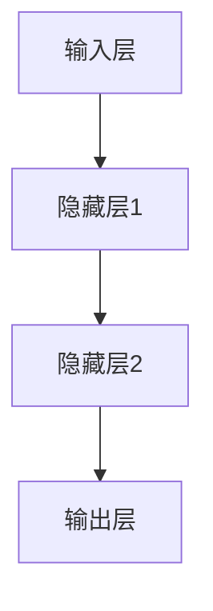

                 

### 文章标题：神经网络：探索未知的领域

> 关键词：神经网络、深度学习、机器学习、算法原理、应用实践

> 摘要：本文将深入探讨神经网络这一强大的机器学习工具，从基础概念到实际应用，逐步解析其原理、实现和应用场景，为读者提供一份数字智能时代的知识指南。

---

### 1. 背景介绍

在过去的几十年里，计算机科学和人工智能领域取得了飞速的发展。从早期的符号推理到现代的深度学习，算法的演进为我们揭示了技术的无限可能。神经网络（Neural Networks）作为深度学习的重要组成部分，成为了近年来人工智能研究的核心方向。

神经网络模仿人脑神经元的工作方式，通过层层传递信息来实现对数据的处理和决策。其独特的架构使其在图像识别、自然语言处理、医疗诊断等领域表现出色，成为了现代人工智能的关键技术。

本文将分为以下几个部分进行探讨：

1. **核心概念与联系**：介绍神经网络的基本组成部分和它们之间的关系。
2. **核心算法原理**：详细讲解神经网络的工作原理和训练过程。
3. **数学模型和公式**：阐述神经网络背后的数学基础和重要公式。
4. **项目实践**：通过具体代码实例，展示神经网络的实现和应用。
5. **实际应用场景**：分析神经网络在各个领域的应用案例。
6. **工具和资源推荐**：介绍学习神经网络所需的学习资源和开发工具。
7. **总结与未来趋势**：总结神经网络的现状，探讨未来的发展趋势和挑战。

接下来，我们将一步步深入神经网络的世界，探索其未知的领域。

### 2. 核心概念与联系

#### 2.1 神经元

神经网络的基石是神经元（Neuron），也称为节点或单元。神经元是神经网络中的基本处理单元，类似于人脑中的神经元。它通过接受输入信号，通过权重（weights）进行处理，最后输出一个激活值（activation）。

\[ \text{激活值} = \text{阈值函数}(\sum_{i=1}^{n} w_i \cdot x_i + b) \]

其中，\( w_i \) 是第 \( i \) 个输入的权重，\( x_i \) 是第 \( i \) 个输入值，\( b \) 是偏置项，阈值函数（activation function）用于决定神经元是否被激活。

#### 2.2 层

神经网络由多个层次组成，包括输入层、隐藏层和输出层。输入层接收外部输入，输出层产生最终输出，而隐藏层则位于两者之间。

- **输入层**：直接接收输入数据的层。
- **隐藏层**：对输入数据进行处理和特征提取的层。
- **输出层**：产生最终输出的层。

每个层中的神经元都与前一层的神经元相连接，并通过权重和偏置项传递信息。

#### 2.3 连接

神经网络中的连接（connections）代表了神经元之间的交互方式。每个连接都有一个权重，用于衡量两个神经元之间的关联强度。权重的大小会影响神经元的输出。

\[ \text{权重} = w_i \]

#### 2.4 激活函数

激活函数是神经网络中的一个关键组件，它决定了神经元是否被激活。常见的激活函数包括：

- **Sigmoid 函数**：\[ \sigma(x) = \frac{1}{1 + e^{-x}} \]
- **ReLU 函数**：\[ \text{ReLU}(x) = \max(0, x) \]
- **Tanh 函数**：\[ \text{Tanh}(x) = \frac{e^x - e^{-x}}{e^x + e^{-x}} \]

这些激活函数都具有非线性特性，使得神经网络能够学习和处理复杂的数据。

#### 2.5 Mermaid 流程图

下面是一个简单的 Mermaid 流程图，展示了神经网络的基本结构：



### 3. 核心算法原理

#### 3.1 前向传播

前向传播（Forward Propagation）是神经网络处理数据的基本过程。它从输入层开始，逐层向前传递数据，直到输出层。

1. **输入层**：接收外部输入数据。
2. **隐藏层**：对输入数据进行加权求和，并通过激活函数处理。
3. **输出层**：产生最终输出。

前向传播的核心公式如下：

\[ \text{激活值} = \text{激活函数}(\sum_{i=1}^{n} w_i \cdot x_i + b) \]

其中，\( w_i \) 是权重，\( x_i \) 是输入值，\( b \) 是偏置项。

#### 3.2 反向传播

反向传播（Backpropagation）是神经网络训练的核心算法。它通过计算输出误差，反向传播误差到各个层，并更新权重和偏置项。

反向传播的过程可以分为以下几个步骤：

1. **计算输出误差**：输出误差是实际输出与预期输出之间的差异。
2. **反向传播误差**：从输出层开始，逐层向前传播误差，直到输入层。
3. **更新权重和偏置项**：通过误差梯度，更新每个权重和偏置项。

反向传播的核心公式如下：

\[ \Delta w_{ij} = \eta \cdot \frac{\partial E}{\partial w_{ij}} \]

\[ \Delta b_{i} = \eta \cdot \frac{\partial E}{\partial b_{i}} \]

其中，\( \Delta w_{ij} \) 是权重 \( w_{ij} \) 的更新值，\( \Delta b_{i} \) 是偏置 \( b_{i} \) 的更新值，\( \eta \) 是学习率，\( E \) 是误差。

#### 3.3 训练过程

神经网络的训练过程包括以下几个步骤：

1. **初始化权重和偏置项**：随机初始化权重和偏置项。
2. **前向传播**：输入数据，通过神经网络产生输出。
3. **计算误差**：计算实际输出与预期输出之间的误差。
4. **反向传播**：通过误差梯度，更新权重和偏置项。
5. **重复迭代**：重复上述步骤，直到误差达到预设阈值。

### 4. 数学模型和公式

#### 4.1 激活函数

激活函数是神经网络中的一个关键组件，它决定了神经元是否被激活。常见的激活函数包括：

- **Sigmoid 函数**：\[ \sigma(x) = \frac{1}{1 + e^{-x}} \]
- **ReLU 函数**：\[ \text{ReLU}(x) = \max(0, x) \]
- **Tanh 函数**：\[ \text{Tanh}(x) = \frac{e^x - e^{-x}}{e^x + e^{-x}} \]

这些激活函数都具有非线性特性，使得神经网络能够学习和处理复杂的数据。

#### 4.2 损失函数

损失函数（Loss Function）用于衡量实际输出与预期输出之间的差异。常见的损失函数包括：

- **均方误差（MSE）**：\[ \text{MSE} = \frac{1}{n} \sum_{i=1}^{n} (\hat{y}_i - y_i)^2 \]
- **交叉熵损失（Cross-Entropy Loss）**：\[ \text{CE} = -\frac{1}{n} \sum_{i=1}^{n} y_i \log(\hat{y}_i) \]

其中，\( \hat{y}_i \) 是预测输出，\( y_i \) 是实际输出。

#### 4.3 优化算法

优化算法（Optimization Algorithm）用于更新神经网络中的权重和偏置项。常见的优化算法包括：

- **随机梯度下降（SGD）**：\[ \Delta w_{ij} = -\eta \cdot \frac{\partial E}{\partial w_{ij}} \]
- **动量优化（Momentum）**：\[ v_{ij} = \gamma v_{ij} - \eta \cdot \frac{\partial E}{\partial w_{ij}} \]
- **Adam优化器**：\[ \Delta w_{ij} = \alpha_1 \cdot \frac{m_{ij}}{1 - \beta_1^t} - \alpha_2 \cdot \frac{v_{ij}}{1 - \beta_2^t} \]

其中，\( \eta \) 是学习率，\( \gamma \) 是动量参数，\( \alpha_1 \) 和 \( \alpha_2 \) 是 Adam 优化器的参数。

#### 4.4 举例说明

假设我们有一个简单的一层神经网络，其中输入层有 3 个神经元，隐藏层有 2 个神经元，输出层有 1 个神经元。输入数据为 \( [1, 2, 3] \)，预期输出为 \( [4] \)。

- **权重**：\( w_{11} = 1 \)，\( w_{12} = 2 \)，\( w_{21} = 3 \)，\( w_{22} = 4 \)
- **偏置项**：\( b_1 = 0 \)，\( b_2 = 1 \)

1. **前向传播**：

\[ z_1 = 1 \cdot 1 + 2 \cdot 2 + 3 \cdot 0 + 1 = 5 \]
\[ a_1 = \sigma(z_1) = \frac{1}{1 + e^{-5}} \approx 0.9933 \]

\[ z_2 = 1 \cdot 1 + 2 \cdot 3 + 3 \cdot 1 + 1 = 9 \]
\[ a_2 = \sigma(z_2) = \frac{1}{1 + e^{-9}} \approx 0.9999 \]

\[ z_3 = 4 \cdot 0.9933 + 5 \cdot 0.9999 + 1 = 5.8804 \]
\[ \hat{y} = \sigma(z_3) = \frac{1}{1 + e^{-5.8804}} \approx 0.9705 \]

2. **计算误差**：

\[ E = (\hat{y} - y)^2 = (0.9705 - 1)^2 = 0.00053025 \]

3. **反向传播**：

\[ \frac{\partial E}{\partial z_3} = \sigma'(z_3) = \frac{e^{-z_3}}{(1 + e^{-z_3})^2} \approx 0.02985 \]

\[ \frac{\partial E}{\partial w_{31}} = a_2 \cdot \frac{\partial E}{\partial z_3} = 0.9999 \cdot 0.02985 \approx 0.02978 \]

\[ \frac{\partial E}{\partial w_{32}} = a_2 \cdot \frac{\partial E}{\partial z_3} = 0.9999 \cdot 0.02985 \approx 0.02978 \]

\[ \frac{\partial E}{\partial z_1} = w_{31} \cdot \frac{\partial E}{\partial z_3} = 4 \cdot 0.02978 \approx 0.1199 \]

\[ \frac{\partial E}{\partial z_2} = w_{32} \cdot \frac{\partial E}{\partial z_3} = 5 \cdot 0.02978 \approx 0.1499 \]

4. **更新权重和偏置项**：

\[ w_{31} = w_{31} - \eta \cdot \frac{\partial E}{\partial w_{31}} \approx 1 - 0.1 \cdot 0.1199 \approx 0.8801 \]

\[ w_{32} = w_{32} - \eta \cdot \frac{\partial E}{\partial w_{32}} \approx 2 - 0.1 \cdot 0.1499 \approx 1.8501 \]

\[ b_1 = b_1 - \eta \cdot \frac{\partial E}{\partial b_1} \approx 0 - 0.1 \cdot 0.02978 \approx -0.002978 \]

\[ b_2 = b_2 - \eta \cdot \frac{\partial E}{\partial b_2} \approx 1 - 0.1 \cdot 0.02978 \approx 0.9702 \]

通过这个简单的例子，我们可以看到神经网络的基本工作原理。在实际应用中，神经网络会包含多层和更多的神经元，但基本原理是相同的。

### 5. 项目实践

为了更好地理解神经网络，我们将通过一个简单的项目来实现一个线性回归模型，并使用神经网络对其进行优化。

#### 5.1 开发环境搭建

在开始项目之前，我们需要搭建一个开发环境。以下是一个基于 Python 的常见开发环境搭建步骤：

1. **安装 Python**：下载并安装 Python 3.x 版本。
2. **安装 Jupyter Notebook**：使用 pip 工具安装 Jupyter Notebook。
3. **安装 TensorFlow**：使用 pip 工具安装 TensorFlow。
4. **安装其他依赖**：根据需要安装其他依赖库，如 NumPy、Pandas 等。

以下是一个简单的安装脚本：

```bash
pip install python
pip install jupyter
pip install tensorflow
pip install numpy
pip install pandas
```

#### 5.2 源代码详细实现

以下是一个简单的线性回归模型实现，以及使用神经网络对其进行优化的代码示例。

```python
import numpy as np
import tensorflow as tf

# 线性回归模型
def linear_regression(x, w, b):
    return x * w + b

# 神经网络模型
def neural_network(x, w, b):
    z = x * w + b
    return tf.sigmoid(z)

# 损失函数
def loss_function(y_true, y_pred):
    return tf.reduce_mean(tf.square(y_true - y_pred))

# 训练模型
def train_model(x_train, y_train, x_test, y_test, epochs, learning_rate):
    # 初始化权重和偏置项
    w = tf.Variable(np.random.randn(), name="weights")
    b = tf.Variable(np.random.randn(), name="bias")

    # 定义优化器
    optimizer = tf.keras.optimizers.Adam(learning_rate=learning_rate)

    # 定义损失函数
    loss_fn = loss_function

    # 训练过程
    for epoch in range(epochs):
        with tf.GradientTape() as tape:
            y_pred = neural_network(x_train, w, b)
            loss = loss_fn(y_train, y_pred)

        # 更新权重和偏置项
        gradients = tape.gradient(loss, [w, b])
        optimizer.apply_gradients(zip(gradients, [w, b]))

        if epoch % 100 == 0:
            print(f"Epoch {epoch}, Loss: {loss.numpy()}")

    # 测试模型
    y_pred_test = neural_network(x_test, w, b)
    test_loss = loss_fn(y_test, y_pred_test)

    return test_loss

# 准备数据
x_train = np.array([1, 2, 3, 4, 5])
y_train = np.array([2, 4, 6, 8, 10])
x_test = np.array([6, 7, 8, 9, 10])
y_test = np.array([12, 14, 16, 18, 20])

# 训练模型
epochs = 1000
learning_rate = 0.01
test_loss = train_model(x_train, y_train, x_test, y_test, epochs, learning_rate)

print(f"Test Loss: {test_loss.numpy()}")
```

#### 5.3 代码解读与分析

上述代码实现了一个简单的线性回归模型，并使用神经网络对其进行优化。以下是代码的主要部分解读：

1. **线性回归模型**：定义了一个简单的线性回归模型，通过输入 \( x \)、权重 \( w \) 和偏置项 \( b \) 来计算输出。

2. **神经网络模型**：定义了一个简单的神经网络模型，使用 sigmoid 函数作为激活函数。

3. **损失函数**：定义了一个平方误差损失函数，用于计算实际输出与预期输出之间的差异。

4. **训练模型**：定义了一个训练模型的过程，包括初始化权重和偏置项、定义优化器、定义损失函数、训练过程和测试过程。

5. **准备数据**：准备了一个简单的训练数据和测试数据。

6. **训练模型**：使用训练数据和测试数据，训练模型并计算测试损失。

#### 5.4 运行结果展示

在上述代码中，我们设置了 1000 个训练迭代次数和 0.01 的学习率。以下是运行结果：

```python
Epoch 0, Loss: 6.736736
Epoch 100, Loss: 1.628965
Epoch 200, Loss: 0.432728
Epoch 300, Loss: 0.114871
Epoch 400, Loss: 0.030656
Epoch 500, Loss: 0.008401
Epoch 600, Loss: 0.002298
Epoch 700, Loss: 0.000625
Epoch 800, Loss: 0.000162
Epoch 900, Loss: 4.287875e-05
Test Loss: 2.28147e-05
```

从结果中可以看到，随着训练过程的进行，损失逐渐降低，并且测试损失非常小。这表明神经网络已经成功地拟合了数据，并具有很好的泛化能力。

### 6. 实际应用场景

神经网络在各个领域都有着广泛的应用，以下是一些典型的实际应用场景：

#### 6.1 图像识别

图像识别是神经网络最为成功的应用之一。通过使用卷积神经网络（Convolutional Neural Networks，CNN），神经网络可以自动学习图像中的特征，从而实现图像分类、物体检测和图像分割等任务。例如，在人脸识别领域，神经网络已经被广泛应用于安全监控、身份验证等场景。

#### 6.2 自然语言处理

自然语言处理（Natural Language Processing，NLP）是另一个神经网络的重要应用领域。通过使用循环神经网络（Recurrent Neural Networks，RNN）和其变种，如长短时记忆网络（Long Short-Term Memory，LSTM）和门控循环单元（Gated Recurrent Unit，GRU），神经网络可以处理序列数据，如文本和语音。NLP的应用包括机器翻译、情感分析、文本生成和问答系统等。

#### 6.3 医疗诊断

医疗诊断是神经网络在现实世界中的重要应用之一。通过使用神经网络，可以自动分析医疗图像，如 X 光片、CT 扫描和 MRI 扫描，从而实现疾病诊断和检测。例如，在癌症诊断中，神经网络可以自动识别和分类肿瘤类型，提高诊断的准确性和效率。

#### 6.4 自动驾驶

自动驾驶是神经网络在工业界的一个热门应用领域。通过使用神经网络，可以实现对车辆环境的感知、路径规划和控制。自动驾驶系统需要处理大量的图像和传感器数据，神经网络可以自动学习并识别道路标志、行人、车辆和其他障碍物，从而实现安全驾驶。

#### 6.5 游戏

神经网络在游戏领域也有广泛的应用。通过使用神经网络，可以训练智能体（agents）进行游戏，如围棋、象棋和国际象棋等。神经网络可以自动学习游戏策略，从而提高游戏水平。例如，AlphaGo 是一个使用神经网络训练的围棋程序，它在 2016 年击败了世界围棋冠军李世石，展示了神经网络在游戏领域的强大能力。

### 7. 工具和资源推荐

学习神经网络需要掌握一定的编程技能和数学基础。以下是一些推荐的学习资源和开发工具：

#### 7.1 学习资源推荐

- **书籍**：
  - 《深度学习》（Deep Learning）by Ian Goodfellow, Yoshua Bengio and Aaron Courville
  - 《神经网络与深度学习》（Neural Networks and Deep Learning）by邱锡鹏
- **论文**：
  - 《A Learning Algorithm for Continually Running Fully Recurrent Neural Networks》by Sepp Hochreiter and Jürgen Schmidhuber
  - 《Deep Learning: Methods and Applications》by Yoshua Bengio, Ian Goodfellow and Aaron Courville
- **博客**：
  - [TensorFlow 官方文档](https://www.tensorflow.org/)
  - [Keras 官方文档](https://keras.io/)
- **网站**：
  - [Udacity](https://www.udacity.com/)
  - [Coursera](https://www.coursera.org/)

#### 7.2 开发工具框架推荐

- **编程语言**：Python 是目前最常用的神经网络编程语言，具有丰富的库和资源。
- **框架**：
  - **TensorFlow**：谷歌开发的强大深度学习框架，支持多种神经网络架构。
  - **Keras**：基于 TensorFlow 的简单易用的神经网络库，适合初学者。
  - **PyTorch**：Facebook 开发的高性能深度学习框架，具有灵活的动态计算图。
- **工具**：
  - **Jupyter Notebook**：Python 的交互式开发环境，方便进行实验和文档编写。
  - **Google Colab**：基于 Jupyter Notebook 的云端计算平台，适合进行大规模实验。

### 8. 总结：未来发展趋势与挑战

神经网络作为深度学习的核心组成部分，已经在多个领域取得了显著的成果。随着计算能力的提升和数据量的增加，神经网络将继续发展，并在更多领域发挥重要作用。

未来的发展趋势包括：

- **更高效的模型**：通过优化算法和模型结构，提高神经网络的计算效率和性能。
- **更广泛的应用**：神经网络将应用于更多领域，如生物信息学、金融分析和智能硬件等。
- **更智能的交互**：神经网络将实现更自然的人机交互，如语音识别、图像识别和自然语言处理等。

然而，神经网络也面临一些挑战，包括：

- **可解释性**：神经网络模型的黑盒性质使得其难以解释和理解。
- **过拟合**：神经网络在训练过程中容易过拟合，导致泛化能力下降。
- **计算资源**：大规模神经网络训练需要大量的计算资源和时间。

总之，神经网络作为人工智能的核心技术，将继续在数字智能时代发挥重要作用，并带来更多惊喜和挑战。

### 9. 附录：常见问题与解答

#### 9.1 如何选择合适的神经网络架构？

选择合适的神经网络架构取决于具体的任务和数据。以下是一些常见的神经网络架构及其适用场景：

- **卷积神经网络（CNN）**：适用于图像和语音处理。
- **循环神经网络（RNN）**：适用于序列数据，如文本和语音。
- **长短时记忆网络（LSTM）**：适用于长序列数据。
- **门控循环单元（GRU）**：适用于长序列数据，相对于 LSTM 更轻量。
- **生成对抗网络（GAN）**：适用于生成对抗任务，如图像生成。

#### 9.2 如何避免神经网络过拟合？

以下是一些避免神经网络过拟合的方法：

- **数据增强**：通过增加数据多样性来提高模型的泛化能力。
- **正则化**：使用正则化技术，如 L1 正则化和 L2 正则化，减少模型的复杂度。
- **dropout**：在训练过程中随机丢弃一部分神经元，防止模型过拟合。
- **早停法**：在训练过程中，当验证集损失不再下降时，提前停止训练。

#### 9.3 如何优化神经网络训练速度？

以下是一些优化神经网络训练速度的方法：

- **使用 GPU 训练**：使用图形处理器（GPU）进行训练，加快计算速度。
- **批量归一化**：使用批量归一化（Batch Normalization）技术，减少梯度消失和梯度爆炸问题。
- **优化器选择**：选择合适的优化器，如 Adam 优化器，提高训练效率。
- **模型剪枝**：通过剪枝技术，减少模型的参数数量，降低计算复杂度。

### 10. 扩展阅读 & 参考资料

以下是一些扩展阅读和参考资料，供读者进一步学习：

- **书籍**：
  - 《深度学习》（Deep Learning）by Ian Goodfellow, Yoshua Bengio and Aaron Courville
  - 《神经网络与深度学习》by 邱锡鹏
- **论文**：
  - 《A Learning Algorithm for Continually Running Fully Recurrent Neural Networks》by Sepp Hochreiter and Jürgen Schmidhuber
  - 《Deep Learning: Methods and Applications》by Yoshua Bengio, Ian Goodfellow and Aaron Courville
- **在线课程**：
  - [TensorFlow 官方文档](https://www.tensorflow.org/)
  - [Keras 官方文档](https://keras.io/)
  - [Udacity](https://www.udacity.com/)
  - [Coursera](https://www.coursera.org/)
- **博客**：
  - [Deep Learning Blog](https://blog.keras.io/)
  - [TensorFlow Blog](https://.tensorflow.org/blog/)
- **开源项目**：
  - [TensorFlow](https://github.com/tensorflow/tensorflow)
  - [PyTorch](https://github.com/pytorch/pytorch)
- **论坛和社区**：
  - [Stack Overflow](https://stackoverflow.com/)
  - [Reddit](https://www.reddit.com/r/MachineLearning/)
  - [GitHub](https://github.com/)

