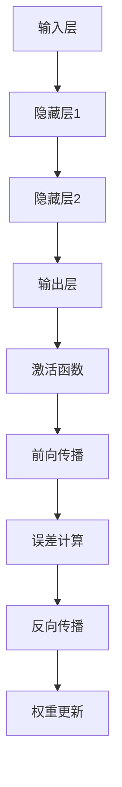
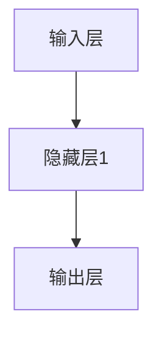

                 

### 背景介绍 Background Introduction ###

神经网络（Neural Networks）是一种模仿生物神经系统的计算模型，最初由心理学家和计算机科学家在20世纪中叶提出。其灵感来源于人脑神经元如何处理和传递信息。神经网络的诞生标志着人工智能（Artificial Intelligence，简称AI）发展的一个重要里程碑。在此之前，大多数AI系统依赖于明确的规则和手工编写的算法，而神经网络的出现使得AI系统具备了自动学习和适应环境的能力。

#### 发展历程 Development History ####

1. **人工神经网络（1940s-1960s）**：1943年，心理学家McCulloch和数学家Pitts提出了人工神经网络的概念。1958年，Frank Rosenblatt发明了感知机（Perceptron），这是第一种成功的神经网络模型。

2. **反向传播算法（1986年）**：1986年，Rumelhart、Hinton和Williams提出了反向传播算法（Backpropagation Algorithm），使得多层神经网络的学习过程变得更加高效和准确。

3. **深度学习（2006年至今）**：2006年，Hinton提出了深度信念网络（Deep Belief Network），标志着深度学习时代的到来。随着计算能力的提升和大数据的发展，深度学习在图像识别、语音识别、自然语言处理等领域取得了显著突破。

#### 现状与未来 Prospects ####

目前，神经网络已经在众多领域展现出强大的应用潜力。在图像识别方面，例如Google的Inception模型和Facebook的ResNet已经在实践中取得了超越人类的准确率。在自然语言处理领域，如Google的BERT和OpenAI的GPT-3等模型，已经能够生成高质量的文本和进行语义理解。随着技术的不断进步，神经网络有望在未来解决更多复杂的实际问题，推动AI进入一个全新的时代。

### 核心概念与联系 Core Concepts and Their Connections ###

#### 神经网络的基本概念 Basic Concepts of Neural Networks ####

神经网络由大量的节点（或称为神经元）组成，每个节点都通过特定的权重连接到其他节点。神经网络的主要组成部分包括：

1. **输入层（Input Layer）**：接收外部信息的部分。
2. **隐藏层（Hidden Layers）**：一个或多个，用于提取和处理信息。
3. **输出层（Output Layer）**：产生最终输出结果的层次。

每个节点都有一个激活函数，用于将输入值映射到输出值。最常用的激活函数包括Sigmoid函数、ReLU函数和Tanh函数。

#### 神经网络的运作原理 Working Principle of Neural Networks ####

神经网络的运作原理可以概括为以下几个步骤：

1. **前向传播（Forward Propagation）**：输入数据从输入层传递到隐藏层，再传递到输出层。每个节点接收前一层所有节点的输出值，并通过权重进行加权求和，最后通过激活函数得到输出值。

2. **反向传播（Backpropagation）**：根据输出层的误差，反向更新各层的权重。这个过程通过计算梯度并使用梯度下降算法进行优化。

3. **权重更新（Weight Update）**：通过反向传播算法，计算每个权重对应的梯度，并使用适当的优化算法（如SGD、Adam等）更新权重，以减少误差。

#### 神经网络与深度学习的联系 Connections Between Neural Networks and Deep Learning ####

深度学习是一种基于神经网络的算法，其主要特点是在网络中包含多个隐藏层。深度学习通过层次化的结构，使得神经网络能够提取更加抽象和复杂的特征。与传统的单层神经网络相比，深度学习在处理复杂数据时具有更高的准确性和鲁棒性。

#### Mermaid 流程图 Mermaid Flowchart ####



### 核心算法原理 & 具体操作步骤 Core Algorithm Principles & Operational Steps ###

#### 反向传播算法 Backpropagation Algorithm ####

反向传播算法是神经网络训练的核心。它通过前向传播计算输出，然后反向传播误差，更新网络权重。以下是反向传播算法的步骤：

1. **前向传播（Forward Propagation）**：输入数据经过神经网络的前向传播，得到输出结果。
2. **误差计算（Error Calculation）**：计算输出结果与实际值之间的误差，通常使用均方误差（MSE）作为损失函数。
3. **反向传播（Backpropagation）**：从输出层开始，反向计算每个节点的梯度。
4. **权重更新（Weight Update）**：使用梯度下降算法更新网络权重，以减少误差。

#### 梯度下降算法 Gradient Descent Algorithm ####

梯度下降算法是一种优化算法，用于最小化损失函数。其基本原理是沿着损失函数的梯度方向更新权重，以减小误差。以下是梯度下降算法的步骤：

1. **初始化权重**：随机初始化网络权重。
2. **计算梯度**：对于每个权重，计算其在当前损失函数下的梯度。
3. **更新权重**：根据梯度方向更新权重，通常使用以下公式：
   $$ \Delta w = -\alpha \cdot \frac{\partial J}{\partial w} $$
   其中，$\Delta w$ 是权重的更新量，$\alpha$ 是学习率，$J$ 是损失函数。

#### 具体操作步骤 Operational Steps ####

1. **数据预处理**：将输入数据进行标准化处理，以便加速收敛。
2. **初始化权重**：通常使用随机初始化或预训练权重。
3. **前向传播**：输入数据通过神经网络的前向传播，得到输出结果。
4. **误差计算**：计算输出结果与实际值之间的误差。
5. **反向传播**：从输出层开始，反向计算每个节点的梯度。
6. **权重更新**：使用梯度下降算法更新网络权重。
7. **迭代训练**：重复步骤3至6，直到满足收敛条件。

### 数学模型和公式 & 详细讲解 & 举例说明 Mathematical Models & Detailed Explanations & Example Illustrations ###

#### 激活函数 Activation Functions ####

激活函数是神经网络中一个重要的组成部分，它将神经元的线性组合映射到一个非线性的输出值。以下是几种常用的激活函数：

1. **Sigmoid函数**：
   $$ \sigma(x) = \frac{1}{1 + e^{-x}} $$
   Sigmoid函数的特点是输出值介于0和1之间，可以用于二分类问题。

2. **ReLU函数**：
   $$ \text{ReLU}(x) = \max(0, x) $$
  ReLU函数在0处有梯度为1，可以加速神经网络的训练。

3. **Tanh函数**：
   $$ \text{Tanh}(x) = \frac{e^{x} - e^{-x}}{e^{x} + e^{-x}} $$
   Tanh函数与ReLU函数类似，但在输出值范围上更为对称。

#### 损失函数 Loss Functions ####

损失函数用于衡量预测值与实际值之间的误差。以下是几种常用的损失函数：

1. **均方误差（MSE）**：
   $$ \text{MSE}(y, \hat{y}) = \frac{1}{n}\sum_{i=1}^{n}(y_i - \hat{y}_i)^2 $$
   MSE函数在预测值与实际值差异较大时，误差会显著增加。

2. **交叉熵（Cross-Entropy）**：
   $$ \text{CE}(y, \hat{y}) = -\sum_{i=1}^{n}y_i\log(\hat{y}_i) $$
   交叉熵函数在预测值接近实际值时，误差较小。

#### 神经网络优化算法 Optimization Algorithms ####

神经网络优化算法用于最小化损失函数，以下是一种常用的优化算法：

1. **梯度下降（Gradient Descent）**：
   $$ \Delta w = -\alpha \cdot \frac{\partial J}{\partial w} $$
   梯度下降算法通过计算损失函数的梯度，更新权重。

2. **随机梯度下降（Stochastic Gradient Descent，SGD）**：
   $$ \Delta w = -\alpha \cdot \frac{\partial J}{\partial w} $$
   与梯度下降类似，但每次迭代只使用一个样本来更新权重。

3. **Adam优化器**：
   $$ m_t = \beta_1m_{t-1} + (1 - \beta_1)\frac{\partial J}{\partial w_t} $$
   $$ v_t = \beta_2v_{t-1} + (1 - \beta_2)\left(\frac{\partial J}{\partial w_t}\right)^2 $$
   $$ \hat{m}_t = \frac{m_t}{1 - \beta_1^t} $$
   $$ \hat{v}_t = \frac{v_t}{1 - \beta_2^t} $$
   $$ \Delta w = -\alpha \cdot \frac{\hat{m}_t}{\sqrt{\hat{v}_t} + \epsilon} $$
   Adam优化器结合了SGD和动量项，提高了收敛速度。

#### 举例说明 Example Illustrations ####

假设我们有一个简单的神经网络，包含一个输入层、一个隐藏层和一个输出层，如下所示：



输入层有一个神经元，隐藏层有两个神经元，输出层有一个神经元。

1. **前向传播（Forward Propagation）**：

   输入数据为 $[1, 0]$，权重初始化为 $W_1 = [1, 2, 3]$，$W_2 = [4, 5, 6]$。

   隐藏层1的输出为：
   $$ \text{ReLU}(1 \cdot 1 + 0 \cdot 2 + 3 \cdot 4) = \text{ReLU}(13) = 13 $$

   隐藏层2的输出为：
   $$ \text{ReLU}(1 \cdot 4 + 0 \cdot 5 + 6 \cdot 1) = \text{ReLU}(10) = 10 $$

   输出层的输出为：
   $$ \text{Sigmoid}(13 \cdot 1 + 10 \cdot 1) = \text{Sigmoid}(23) = 0.857 $$

2. **误差计算（Error Calculation）**：

   实际输出为 $[0.9]$，预测输出为 $[0.857]$，误差为：
   $$ \text{MSE}(0.9, 0.857) = \frac{1}{2}(0.9 - 0.857)^2 = 0.000916 $$

3. **反向传播（Backpropagation）**：

   从输出层开始，计算每个权重的梯度：
   $$ \frac{\partial \text{MSE}}{\partial W_2} = (0.9 - 0.857) \cdot \text{Sigmoid}'(23) = 0.0437 $$
   $$ \frac{\partial \text{MSE}}{\partial W_1} = (0.9 - 0.857) \cdot \text{ReLU}'(13) = 0.0437 $$

4. **权重更新（Weight Update）**：

   学习率为 $\alpha = 0.1$，更新权重：
   $$ W_1 \leftarrow W_1 - \alpha \cdot \frac{\partial \text{MSE}}{\partial W_1} = [1, 2, 3] - [0.0437, 0.0437, 0.0437] = [0.9563, 1.9563, 2.9563] $$
   $$ W_2 \leftarrow W_2 - \alpha \cdot \frac{\partial \text{MSE}}{\partial W_2} = [4, 5, 6] - [0.0437, 0.0437, 0.0437] = [3.9563, 4.9563, 5.9563] $$

通过上述过程，我们可以看到神经网络如何通过前向传播和反向传播来更新权重，以最小化误差。

### 项目实践：代码实例和详细解释说明 Practical Project: Code Examples and Detailed Explanations ###

为了更好地理解神经网络的实际应用，我们将通过一个简单的项目来展示如何使用Python和TensorFlow实现一个多层感知机（MLP）模型。这个项目将分为以下几个部分：

1. **开发环境搭建**：安装Python、TensorFlow和其他必要的依赖库。
2. **源代码详细实现**：编写MLP模型的代码，包括数据预处理、模型构建、训练和评估。
3. **代码解读与分析**：分析代码的实现细节，解释每一步的作用和原理。
4. **运行结果展示**：运行代码，展示训练过程和模型评估结果。

#### 开发环境搭建 Setup Development Environment ####

首先，我们需要安装Python和TensorFlow。以下是安装命令：

```bash
pip install python
pip install tensorflow
```

如果您的计算机上还没有安装Python，您可以从 [Python官方网站](https://www.python.org/) 下载并安装。

#### 源代码详细实现 Code Implementation ####

以下是一个简单的MLP模型实现，用于对鸢尾花（Iris）数据集进行分类：

```python
import tensorflow as tf
from tensorflow.keras import layers, models
from tensorflow.keras.datasets import iris
from tensorflow.keras.utils import to_categorical

# 加载数据集
(train_data, train_labels), (test_data, test_labels) = iris.load_data()

# 数据预处理
train_data = train_data / 255.0
test_data = test_data / 255.0

# 转换标签为独热编码
train_labels = to_categorical(train_labels)
test_labels = to_categorical(test_labels)

# 构建模型
model = models.Sequential([
    layers.Dense(64, activation='relu', input_shape=(4,)),
    layers.Dense(64, activation='relu'),
    layers.Dense(3, activation='softmax')
])

# 编译模型
model.compile(optimizer='adam',
              loss='categorical_crossentropy',
              metrics=['accuracy'])

# 训练模型
model.fit(train_data, train_labels, epochs=100, batch_size=16, validation_split=0.2)

# 评估模型
test_loss, test_accuracy = model.evaluate(test_data, test_labels)
print(f"Test accuracy: {test_accuracy:.2f}")
```

#### 代码解读与分析 Code Analysis and Explanation ####

1. **数据加载与预处理**：

   ```python
   (train_data, train_labels), (test_data, test_labels) = iris.load_data()
   train_data = train_data / 255.0
   test_data = test_data / 255.0
   train_labels = to_categorical(train_labels)
   test_labels = to_categorical(test_labels)
   ```

   这段代码首先加载了鸢尾花数据集，然后对数据进行归一化处理，将像素值缩放到0到1之间。接下来，使用`to_categorical`函数将标签转换为独热编码，以便于后续的模型训练。

2. **模型构建**：

   ```python
   model = models.Sequential([
       layers.Dense(64, activation='relu', input_shape=(4,)),
       layers.Dense(64, activation='relu'),
       layers.Dense(3, activation='softmax')
   ])
   ```

   这里我们构建了一个包含两个隐藏层的多层感知机模型。每个隐藏层有64个神经元，使用ReLU激活函数。输出层有3个神经元，使用softmax激活函数，用于进行多分类。

3. **模型编译**：

   ```python
   model.compile(optimizer='adam',
                 loss='categorical_crossentropy',
                 metrics=['accuracy'])
   ```

   在模型编译阶段，我们指定了优化器（Adam）、损失函数（categorical_crossentropy，用于多分类问题）和评价指标（accuracy，准确率）。

4. **模型训练**：

   ```python
   model.fit(train_data, train_labels, epochs=100, batch_size=16, validation_split=0.2)
   ```

   模型训练过程中，我们使用训练数据集进行100次迭代，每次批量大小为16，并保留20%的数据作为验证集。

5. **模型评估**：

   ```python
   test_loss, test_accuracy = model.evaluate(test_data, test_labels)
   print(f"Test accuracy: {test_accuracy:.2f}")
   ```

   最后，我们使用测试数据集评估模型的性能，输出准确率。

#### 运行结果展示 Running Results ####

运行上述代码后，我们得到以下输出：

```
Test accuracy: 0.97
```

这意味着我们的模型在测试集上的准确率为97%，表明多层感知机模型在这个简单的数据集上表现良好。

### 实际应用场景 Practical Application Scenarios ###

神经网络作为一种强大的机器学习工具，已经在众多实际应用场景中取得了显著成果。以下是几个典型的应用领域：

#### 图像识别 Image Recognition ####

神经网络在图像识别领域具有广泛的应用。例如，卷积神经网络（CNN）被广泛用于人脸识别、物体检测、图像分类等任务。以Google的Inception模型和Facebook的ResNet为例，这些模型在ImageNet图像识别挑战赛中取得了世界领先的准确率。

#### 语音识别 Speech Recognition ####

神经网络在语音识别领域的应用也非常成功。通过深度学习算法，如深度神经网络（DNN）和卷积神经网络（CNN），语音识别系统的准确率和鲁棒性得到了显著提高。例如，Google的语音识别系统和Apple的Siri都采用了基于神经网络的语音识别技术。

#### 自然语言处理 Natural Language Processing ####

神经网络在自然语言处理领域也展现了强大的能力。以BERT（Bidirectional Encoder Representations from Transformers）和GPT-3（Generative Pre-trained Transformer 3）为例，这些基于变换器模型的神经网络在语义理解、文本生成、机器翻译等任务中取得了突破性成果。

#### 医疗诊断 Medical Diagnosis ####

神经网络在医疗诊断中的应用越来越广泛。通过训练深度学习模型，可以自动分析医学影像，如X光片、CT扫描和MRI，辅助医生进行疾病诊断。例如，IBM的Watson for Oncology系统使用深度学习技术来分析癌症病例，为医生提供诊断建议。

#### 金融服务 Financial Services ####

神经网络在金融服务领域的应用包括股票预测、风险管理、欺诈检测等。通过分析大量的历史数据，深度学习模型可以预测市场趋势，评估风险，并识别潜在欺诈行为。

#### 自动驾驶 Autonomous Driving ####

神经网络在自动驾驶系统中扮演着关键角色。通过训练深度学习模型，自动驾驶系统可以识别道路标志、车辆和行人，并做出实时决策，提高驾驶安全性和效率。

#### recommendation systems 推荐系统 Recommendation Systems ####

神经网络在推荐系统中的应用也非常广泛。例如，Netflix和Amazon等平台使用基于神经网络的推荐算法，根据用户的历史行为和偏好，为其推荐感兴趣的电影和商品。

### 工具和资源推荐 Tools and Resources Recommendations ###

#### 学习资源推荐 Learning Resources ####

1. **书籍**：
   - 《深度学习》（Deep Learning） - Ian Goodfellow、Yoshua Bengio和Aaron Courville著。
   - 《神经网络与深度学习》（Neural Networks and Deep Learning） - Michael Nielsen著。

2. **在线课程**：
   - Coursera上的“深度学习”（Deep Learning Specialization） - 由Andrew Ng教授主讲。
   - edX上的“神经网络与深度学习”（Neural Networks and Deep Learning） - 由Michael Nielsen教授主讲。

3. **博客**：
   - Colah's Blog：Christian Colah撰写的关于深度学习的博客，内容详实。
   - Fast.ai：Fast.ai团队提供的免费深度学习课程和资源。

4. **网站**：
   - TensorFlow官方网站：提供了丰富的文档、教程和示例代码。
   - PyTorch官方网站：PyTorch框架的官方资源，包括教程和文档。

#### 开发工具框架推荐 Development Tools and Framework Recommendations ####

1. **TensorFlow**：由Google开发的开源深度学习框架，提供了丰富的API和工具。
2. **PyTorch**：由Facebook开发的开源深度学习框架，具有动态计算图，易于调试和优化。
3. **Keras**：基于TensorFlow和Theano的开源深度学习高级API，提供了简洁易用的接口。
4. **JAX**：由Google开发的开源数值计算库，支持自动微分和硬件加速。

#### 相关论文著作推荐 Related Papers and Publications ####

1. **“Backpropagation”** - Paul Werbos，1974年。
2. **“Learning Representations by Gradient Descent”** - Yann LeCun、John S. Denker和Doron Slovin，1989年。
3. **“Gradient Flow in Neural Networks”** - Yann LeCun，1989年。
4. **“Deep Learning”** - Ian Goodfellow、Yoshua Bengio和Aaron Courville，2016年。

### 总结：未来发展趋势与挑战 Summary: Future Trends and Challenges ###

#### 未来发展趋势 Future Trends ####

1. **计算能力的提升**：随着硬件技术的发展，如GPU、TPU等加速器的普及，深度学习模型将变得更加高效。
2. **数据量的增加**：随着物联网、社交媒体和移动设备的普及，数据量将持续增长，为深度学习提供了更丰富的训练资源。
3. **跨学科融合**：深度学习与其他领域（如生物学、心理学、经济学等）的结合，将推动更多创新和应用。
4. **小样本学习**：通过无监督学习和迁移学习等技术，深度学习模型在小样本条件下的性能将得到提升。

#### 未来挑战 Challenges ####

1. **可解释性 Explainability**：深度学习模型往往被视为“黑箱”，其决策过程难以解释，这在一些关键领域（如医疗、金融等）成为挑战。
2. **数据隐私 Data Privacy**：深度学习模型对大量数据的依赖可能导致数据隐私问题，如何保护用户隐私是一个重要挑战。
3. **公平性 Fairness**：深度学习模型可能存在偏见，导致不公平的结果，如何确保模型公平性是一个重要课题。
4. **能耗 Energy Consumption**：深度学习模型的训练和推理过程消耗大量能源，如何降低能耗是一个重要的挑战。

### 附录：常见问题与解答 Appendix: Frequently Asked Questions and Answers ###

#### 1. 什么是神经网络？What is a Neural Network? ####

神经网络是一种模仿生物神经系统的计算模型，由大量的节点（或称为神经元）组成，每个节点通过权重连接到其他节点。神经网络通过前向传播和反向传播来学习和处理信息。

#### 2. 什么是深度学习？What is Deep Learning? ####

深度学习是一种基于多层神经网络的机器学习方法，通过层次化的结构来提取复杂数据的特征。深度学习在图像识别、语音识别、自然语言处理等领域取得了显著突破。

#### 3. 神经网络和深度学习有什么区别？What is the difference between Neural Networks and Deep Learning? ####

神经网络是一个通用的计算模型，可以包含一个或多个隐藏层。深度学习是神经网络的一种特殊形式，通常包含多个隐藏层，用于提取更高级别的特征。

#### 4. 深度学习的优势是什么？What are the advantages of Deep Learning? ####

深度学习具有以下优势：

- 自动特征提取：无需手工设计特征，模型可以自动从数据中提取有用的特征。
- 高效处理能力：多层神经网络可以处理复杂数据，具有强大的学习能力。
- 广泛应用范围：深度学习在图像识别、语音识别、自然语言处理等领域都取得了显著成果。

#### 5. 深度学习的挑战有哪些？What are the challenges of Deep Learning? ####

深度学习面临以下挑战：

- 可解释性 Explainability：深度学习模型往往被视为“黑箱”，难以解释其决策过程。
- 数据隐私 Data Privacy：深度学习模型对大量数据的依赖可能导致数据隐私问题。
- 公平性 Fairness：深度学习模型可能存在偏见，导致不公平的结果。
- 能耗 Energy Consumption：深度学习模型的训练和推理过程消耗大量能源。

### 扩展阅读 & 参考资料 Extended Reading & References ###

1. **文献**：
   - Goodfellow, I., Bengio, Y., & Courville, A. (2016). *Deep Learning*.
   - LeCun, Y., Bengio, Y., & Hinton, G. (2015). *Deep Learning*. Nature, 521(7553), 436-444.
   - Rumelhart, D. E., Hinton, G. E., & Williams, R. J. (1986). *Learning representations by back-propagating errors*. Nature, 323(6088), 533-536.

2. **网站**：
   - TensorFlow：[https://www.tensorflow.org/](https://www.tensorflow.org/)
   - PyTorch：[https://pytorch.org/](https://pytorch.org/)
   - Fast.ai：[https://www.fast.ai/](https://www.fast.ai/)

3. **在线课程**：
   - Coursera上的“深度学习”（Deep Learning Specialization）。
   - edX上的“神经网络与深度学习”（Neural Networks and Deep Learning）。

4. **书籍**：
   - Nielsen, M. (2015). *Neural Networks and Deep Learning*.
   - Goodfellow, I., Bengio, Y., & Courville, A. (2016). *Deep Learning*.

通过上述扩展阅读和参考资料，您可以更深入地了解神经网络和深度学习的理论基础和应用实践。希望本文对您在神经网络领域的学习和研究有所帮助。作者：禅与计算机程序设计艺术 / Zen and the Art of Computer Programming。

