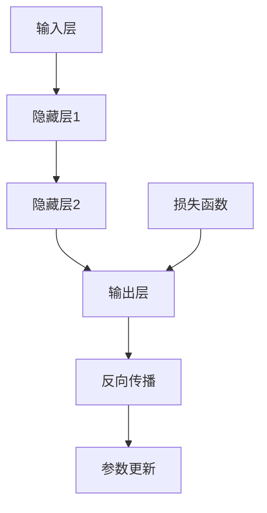

                 

### 1. 背景介绍

#### 什么是神经网络？

神经网络（Neural Networks）是模拟人脑神经网络结构和功能的计算模型，是机器学习领域的重要组成部分。传统的机器学习算法依赖于手写特征和规则，而神经网络则通过学习数据中的内在规律来自动提取特征，使得它在处理复杂任务时表现出色。

神经网络的起源可以追溯到1940年代，加拿大神经科学家唐纳德·赫布提出了赫布学习规则（Hebbian Learning Rule），这是神经网络模型的基础。随后，1958年，弗兰克·罗森布拉特（Frank Rosenblatt）提出了感知机（Perceptron）模型，这是神经网络发展史上的一个重要里程碑。

然而，早期的神经网络由于算法上的局限性，如收敛速度慢、易陷入局部最优等问题，未能得到广泛应用。直到1980年代，随着计算机性能的提升和大数据的涌现，神经网络研究才逐渐复苏。1990年代，基于反向传播算法（Backpropagation Algorithm）的深层神经网络（Deep Neural Networks, DNNs）被提出，并在图像识别、自然语言处理等领域取得了显著进展。

#### 神经网络的应用领域

神经网络在诸多领域都取得了卓越的成果，以下是其中一些重要的应用领域：

1. **计算机视觉**：神经网络在图像识别、目标检测、图像分割等领域发挥着重要作用。如Facebook的FaceNet模型，通过学习人脸特征，实现了高效的人脸识别。

2. **自然语言处理**：神经网络在语言模型、机器翻译、情感分析等领域具有广泛应用。如谷歌的BERT模型，通过预训练和微调，显著提升了自然语言处理的性能。

3. **语音识别**：神经网络在语音识别领域也取得了显著进展，如百度深度语音识别系统，通过使用深度神经网络模型，实现了高准确率的语音识别。

4. **推荐系统**：神经网络在推荐系统中的应用也非常广泛，通过学习用户的历史行为和偏好，预测用户可能感兴趣的内容。

5. **游戏**：神经网络在游戏AI领域也得到了应用，如AlphaGo，通过使用深度神经网络和强化学习算法，实现了在围棋比赛中的卓越表现。

#### 神经网络的优势与挑战

神经网络的兴起在很大程度上解决了传统机器学习算法在处理复杂任务时的局限性。其主要优势包括：

1. **自动特征提取**：神经网络可以通过多层非线性变换，自动从数据中提取有用的特征，降低了人工设计特征的难度。

2. **泛化能力**：神经网络具有良好的泛化能力，能够在不同任务和数据集上表现稳定。

3. **自适应能力**：神经网络可以通过不断学习和调整参数，适应不同的问题和数据。

然而，神经网络也面临着一些挑战：

1. **计算复杂度**：神经网络模型的训练过程需要大量的计算资源，特别是在处理大规模数据和高维度特征时。

2. **可解释性**：神经网络模型的决策过程往往缺乏透明性，难以解释其内部工作机制。

3. **过拟合风险**：神经网络模型容易受到过拟合问题的影响，特别是在训练数据量较少时。

4. **参数数量**：深度神经网络模型通常具有大量的参数，如何有效地优化这些参数是一个挑战。

总之，神经网络作为一种强大的机器学习工具，在多个领域取得了显著的成果。然而，为了更好地应用和发展神经网络，我们还需要克服上述挑战，进一步优化算法和模型。

#### 总结

本节介绍了神经网络的基本概念、历史背景、应用领域以及优势和挑战。在接下来的章节中，我们将深入探讨神经网络的原理、算法和具体实现，帮助读者更好地理解这一重要的机器学习技术。

### 2. 核心概念与联系

#### 神经元

神经元是神经网络的基本构建单元，类似于人脑中的神经元。一个神经元由输入层、加权层、激活函数层和输出层组成。神经元通过接收外部输入信号，经过加权处理后，通过激活函数转化为输出信号。


神经元的工作原理可以概括为以下几个步骤：

1. **加权求和**：神经元接收多个输入信号，每个输入信号都乘以一个权重（weight），然后进行求和。
2. **激活函数**：求和结果经过一个非线性激活函数（如Sigmoid、ReLU等），将输入信号转换为输出信号。
3. **输出**：输出信号传递给下一个神经元或作为最终输出。

#### 神经网络结构

神经网络由多个层次组成，包括输入层、隐藏层和输出层。每层中的神经元都与相邻层中的神经元相连，形成一个层次化的网络结构。


神经网络的结构可以分为以下几个部分：

1. **输入层**：接收外部输入信号，每个输入对应一个神经元。
2. **隐藏层**：一个或多个隐藏层，每个隐藏层中的神经元接收前一层输出，并传递给下一层。
3. **输出层**：产生最终输出结果，每个输出对应一个神经元。

#### 神经网络的层次化结构

神经网络的层次化结构使得模型能够逐步提取数据中的抽象特征。每一层神经元都对输入信号进行不同的变换和提取，从而在更高层次上形成更复杂的特征。


#### 神经网络的数学基础

神经网络的核心在于其数学模型，主要包括以下几个方面：

1. **权重与偏置**：权重（weight）是连接不同层神经元的系数，用于调整信号传递的强度。偏置（bias）是每个神经元的额外输入，用于调整神经元的阈值。
2. **激活函数**：激活函数（activation function）用于将加权求和的结果转化为输出信号，常用的激活函数包括Sigmoid、ReLU、Tanh等。
3. **前向传播与反向传播**：神经网络通过前向传播（forward propagation）将输入信号传递到输出层，通过反向传播（backward propagation）计算损失函数并更新模型参数。

#### Mermaid 流程图

下面是一个简化的神经网络流程图，展示了输入层、隐藏层和输出层的结构以及前向传播和反向传播的过程：



在这个流程图中，输入信号从输入层传递到隐藏层，最终通过输出层产生输出。然后，通过损失函数计算输出与实际标签之间的误差，并通过反向传播更新模型参数，以优化模型的性能。

通过以上对神经网络核心概念和结构的介绍，我们可以更好地理解这一机器学习技术的基础和原理。在接下来的章节中，我们将深入探讨神经网络的算法和实现细节，帮助读者深入掌握神经网络的工作机制和应用方法。

### 3. 核心算法原理 & 具体操作步骤

#### 神经网络的基本算法原理

神经网络的算法原理主要包括两部分：前向传播和反向传播。这两部分共同作用，使得神经网络能够通过学习数据自动提取特征并优化模型参数。

##### 前向传播

前向传播是指将输入信号从输入层传递到输出层的过程。具体步骤如下：

1. **初始化参数**：包括权重（weight）和偏置（bias）。这些参数可以通过随机初始化或预训练获得。
2. **加权求和**：每个神经元接收来自前一层的输入信号，将其乘以相应的权重，然后加上偏置，得到加权求和结果。
3. **应用激活函数**：对加权求和结果应用一个非线性激活函数（如ReLU、Sigmoid、Tanh等），将结果转化为输出信号。
4. **层间传递**：将当前层的输出信号传递到下一层，继续重复上述步骤，直到输出层产生最终输出。

在每一层中，输出信号可以被表示为：

$$
z_{l} = \sigma(W_{l-1}a_{l-1} + b_{l-1})
$$

其中，$z_{l}$表示第$l$层的输出，$a_{l-1}$表示第$l-1$层的输出，$W_{l-1}$和$b_{l-1}$分别是连接第$l-1$层和第$l$层的权重和偏置，$\sigma$表示激活函数。

##### 反向传播

反向传播是指通过计算损失函数的梯度来更新模型参数的过程。具体步骤如下：

1. **计算损失函数**：损失函数用于衡量模型输出与实际标签之间的误差。常用的损失函数包括均方误差（MSE）、交叉熵（Cross Entropy）等。
2. **计算梯度**：使用链式法则计算损失函数关于模型参数的梯度。
3. **更新参数**：使用梯度下降（Gradient Descent）或其他优化算法更新模型参数，以最小化损失函数。

在反向传播过程中，我们需要计算每一层神经元的梯度。以下是计算过程：

1. **输出层梯度**：计算输出层关于模型参数的梯度。
   $$
   \frac{\partial L}{\partial z_{L}} = -\frac{\partial L}{\partial a_{L}} \odot \sigma'(z_{L})
   $$
   其中，$\odot$表示逐元素乘法，$\sigma'$表示激活函数的导数。

2. **隐藏层梯度**：从输出层开始，逐层计算隐藏层的梯度。
   $$
   \frac{\partial L}{\partial z_{l}} = \frac{\partial L}{\partial z_{l+1}} \odot \sigma'(z_{l}) \odot W_{l}
   $$

3. **权重和偏置更新**：使用梯度更新权重和偏置。
   $$
   W_{l} \leftarrow W_{l} - \alpha \frac{\partial L}{\partial W_{l}}
   $$
   $$
   b_{l} \leftarrow b_{l} - \alpha \frac{\partial L}{\partial b_{l}}
   $$
   其中，$\alpha$是学习率。

##### 具体操作步骤

以下是一个简单的神经网络训练过程：

1. **初始化参数**：随机初始化权重和偏置。
2. **前向传播**：输入数据，通过神经网络计算输出。
3. **计算损失函数**：计算输出与实际标签之间的误差。
4. **反向传播**：计算损失函数关于模型参数的梯度。
5. **参数更新**：使用梯度更新模型参数。
6. **重复步骤2-5**：不断迭代训练过程，直到模型收敛或达到预设的训练次数。

通过以上步骤，神经网络能够逐步优化模型参数，提高预测准确率。在实际应用中，我们通常使用优化算法（如Adam、RMSprop等）和正则化技术（如Dropout、正则化等）来进一步优化训练过程，提高模型的性能和泛化能力。

### 3.1 前向传播

前向传播是神经网络训练过程中至关重要的环节，其核心在于将输入信号从输入层传递到输出层，并通过多层非线性变换逐步提取数据中的特征。以下是前向传播的具体操作步骤：

1. **初始化参数**：
   - 初始化权重（$W$）和偏置（$b$）。
   - 通常，权重和偏置可以通过随机初始化或预训练获得。

2. **输入数据**：
   - 输入数据（$X$）进入神经网络。
   - 假设输入数据的维度为$(m, n)$，其中$m$是样本数量，$n$是特征数量。

3. **加权求和**：
   - 对于每个神经元，计算输入信号的加权求和。
   - 加权求和的结果可以表示为：
     $$
     z_{l}^{(i)} = \sum_{j} W_{l}^{(i)}x_{j} + b_{l}^{(i)}
     $$
     其中，$z_{l}^{(i)}$是第$l$层第$i$个神经元的加权求和结果，$W_{l}^{(i)}$是连接第$l$层和第$l-1$层的权重矩阵，$x_{j}$是第$l-1$层第$j$个神经元的输出，$b_{l}^{(i)}$是第$l$层第$i$个神经元的偏置。

4. **应用激活函数**：
   - 对加权求和结果应用激活函数，将输入信号转化为输出信号。
   - 常用的激活函数包括ReLU、Sigmoid、Tanh等。
   - 激活函数的选择会影响神经网络的性能和收敛速度。

5. **层间传递**：
   - 将当前层的输出信号传递到下一层。
   - 重复上述步骤，直到输出层产生最终输出。

6. **输出结果**：
   - 最终输出结果（$y$）可以表示为：
     $$
     y = \sigma(W_{L-1}a_{L-1} + b_{L-1})
     $$
     其中，$y$是神经网络最终的输出，$\sigma$是激活函数，$a_{L-1}$是第$L-1$层的输出，$W_{L-1}$是连接第$L-1$层和第$L$层的权重矩阵，$b_{L-1}$是第$L$层的偏置。

通过前向传播，神经网络能够将输入信号逐步转化为输出信号，这一过程不仅帮助我们理解数据中的特征，也为后续的反向传播过程提供了基础。

### 3.2 反向传播

反向传播是神经网络训练过程中的关键步骤，其核心在于通过计算损失函数的梯度来更新模型参数，从而优化模型的性能。以下是反向传播的具体操作步骤：

1. **计算损失函数**：
   - 损失函数用于衡量模型输出与实际标签之间的误差。
   - 常用的损失函数包括均方误差（MSE）、交叉熵（Cross Entropy）等。
   - 损失函数的选择会影响模型的收敛速度和性能。

2. **计算输出层梯度**：
   - 计算输出层关于模型参数的梯度。
   - 假设损失函数为$L$，则输出层梯度可以表示为：
     $$
     \frac{\partial L}{\partial z_{L}} = -\frac{\partial L}{\partial a_{L}} \odot \sigma'(z_{L})
     $$
     其中，$\odot$表示逐元素乘法，$\sigma'$表示激活函数的导数，$a_{L}$是输出层神经元的输出，$z_{L}$是输出层的加权求和结果。

3. **计算隐藏层梯度**：
   - 从输出层开始，逐层计算隐藏层的梯度。
   - 假设当前层为$l$，则隐藏层梯度可以表示为：
     $$
     \frac{\partial L}{\partial z_{l}} = \frac{\partial L}{\partial z_{l+1}} \odot \sigma'(z_{l}) \odot W_{l}
     $$
     其中，$z_{l}$是第$l$层的加权求和结果，$W_{l}$是连接第$l$层和第$l+1$层的权重矩阵。

4. **权重和偏置更新**：
   - 使用梯度下降（Gradient Descent）或其他优化算法更新模型参数。
   - 更新公式如下：
     $$
     W_{l} \leftarrow W_{l} - \alpha \frac{\partial L}{\partial W_{l}}
     $$
     $$
     b_{l} \leftarrow b_{l} - \alpha \frac{\partial L}{\partial b_{l}}
     $$
     其中，$\alpha$是学习率。

5. **重复步骤2-4**：
   - 不断迭代反向传播过程，直到模型收敛或达到预设的训练次数。

通过反向传播，神经网络能够通过不断调整参数，最小化损失函数，提高模型的预测准确率。这一过程不仅实现了参数的优化，也为模型的学习和自适应能力提供了基础。

### 3.3 前向传播与反向传播的对比

前向传播和反向传播是神经网络训练过程中的两个核心步骤，它们分别扮演不同的角色，共同作用实现模型参数的优化。以下是前向传播与反向传播的对比：

1. **步骤差异**：
   - 前向传播是从输入层开始，逐层计算输出，直到输出层产生最终结果。
   - 反向传播是从输出层开始，逐层计算梯度，并更新模型参数。

2. **目标差异**：
   - 前向传播的目标是计算神经网络输出，帮助理解数据特征。
   - 反向传播的目标是计算损失函数的梯度，通过参数更新优化模型性能。

3. **计算复杂度**：
   - 前向传播的计算复杂度相对较低，主要涉及矩阵乘法和激活函数运算。
   - 反向传播的计算复杂度较高，需要逐层计算梯度，并涉及大量的矩阵乘法和求导运算。

4. **时间消耗**：
   - 前向传播的时间消耗较小，通常为一次前向计算的时间。
   - 反向传播的时间消耗较大，需要多次迭代更新参数。

5. **依赖关系**：
   - 前向传播是反向传播的基础，输出层的梯度依赖于前向传播的结果。
   - 反向传播是前向传播的补充，通过参数更新优化模型性能，为下一次前向传播提供更好的初始条件。

通过对比，我们可以更好地理解前向传播与反向传播在神经网络训练过程中的作用和关系，从而更有效地实现模型参数的优化。

### 3.4 小结

本章详细介绍了神经网络的基本算法原理和具体操作步骤，包括前向传播和反向传播的过程。通过前向传播，神经网络能够将输入信号逐步转化为输出信号，提取数据中的特征。而通过反向传播，神经网络能够通过计算损失函数的梯度，不断更新模型参数，优化模型性能。理解这些基本原理和操作步骤，有助于我们更好地应用神经网络，解决复杂的机器学习问题。

### 4. 数学模型和公式 & 详细讲解 & 举例说明

#### 4.1 神经网络中的基本数学公式

神经网络的数学模型主要包括以下几个基本公式：

1. **加权求和**：
   神经元的输出可以通过以下公式计算：
   $$
   z = \sum_{j} W_{ji}x_{j} + b
   $$
   其中，$z$是神经元的输出，$W_{ji}$是连接输入层神经元$i$和隐藏层神经元$j$的权重，$x_{j}$是输入层神经元的输入，$b$是偏置。

2. **激活函数**：
   激活函数将加权求和结果转化为神经元的输出。常用的激活函数包括Sigmoid函数、ReLU函数和Tanh函数：
   - Sigmoid函数：
     $$
     \sigma(z) = \frac{1}{1 + e^{-z}}
     $$
   - ReLU函数：
     $$
     \sigma(z) = \max(0, z)
     $$
   - Tanh函数：
     $$
     \sigma(z) = \frac{e^{z} - e^{-z}}{e^{z} + e^{-z}}
     $$

3. **损失函数**：
   损失函数用于衡量模型输出与实际标签之间的误差。常用的损失函数包括均方误差（MSE）和交叉熵（Cross Entropy）：
   - 均方误差（MSE）：
     $$
     L(y, \hat{y}) = \frac{1}{2}\sum_{i} (y_{i} - \hat{y}_{i})^2
     $$
     其中，$y$是实际标签，$\hat{y}$是模型输出。
   - 交叉熵（Cross Entropy）：
     $$
     L(y, \hat{y}) = -\sum_{i} y_{i} \log(\hat{y}_{i})
     $$

4. **反向传播中的梯度计算**：
   在反向传播过程中，我们需要计算损失函数关于模型参数的梯度。以下是梯度的计算公式：
   - 权重梯度：
     $$
     \frac{\partial L}{\partial W_{ij}} = \sum_{k} (\frac{\partial L}{\partial z_{k}} \odot \frac{\partial z_{k}}{\partial W_{ij}}) = \sum_{k} (\delta_{k} \odot a_{j-1})
     $$
     其中，$\delta_{k}$是第$k$个输出的误差项，$a_{j-1}$是连接第$j-1$层神经元的输入。
   - 偏置梯度：
     $$
     \frac{\partial L}{\partial b_{j}} = \sum_{k} \frac{\partial L}{\partial z_{k}} = \sum_{k} \delta_{k}
     $$

#### 4.2 神经网络中的数学模型详细讲解

神经网络的数学模型是构建和训练神经网络的基础。下面我们详细讲解神经网络中的数学模型，包括前向传播和反向传播的具体计算过程。

1. **前向传播**

前向传播是指将输入信号从输入层传递到输出层的过程，通过多层神经元的加权求和和激活函数，逐步提取数据中的特征。以下是前向传播的详细计算步骤：

（1）**初始化参数**：
   - 随机初始化权重$W$和偏置$b$。

（2）**输入层到隐藏层的传播**：
   - 对于第$l$层的每个神经元，计算加权求和和激活函数：
     $$
     z_{l}^{(i)} = \sum_{j} W_{l-1}^{(i)}x_{j} + b_{l-1}^{(i)}
     $$
     $$
     a_{l}^{(i)} = \sigma(z_{l}^{(i)})
     $$
     其中，$x_{j}$是输入层神经元的输入，$W_{l-1}^{(i)}$是连接输入层和隐藏层第$l-1$层的权重，$b_{l-1}^{(i)}$是隐藏层第$l-1$层的偏置，$\sigma$是激活函数。

（3）**隐藏层到输出层的传播**：
   - 对于输出层，计算加权求和和激活函数：
     $$
     z_{L}^{(i)} = \sum_{j} W_{L-1}^{(i)}a_{L-1}^{(j)} + b_{L-1}^{(i)}
     $$
     $$
     \hat{y}_{i} = \sigma(z_{L}^{(i)})
     $$
     其中，$a_{L-1}^{(j)}$是隐藏层第$L-1$层的输出，$W_{L-1}^{(i)}$是连接隐藏层和输出层的权重，$b_{L-1}^{(i)}$是输出层的偏置，$\sigma$是激活函数。

2. **反向传播**

反向传播是指通过计算损失函数的梯度，更新模型参数的过程。以下是反向传播的详细计算步骤：

（1）**计算输出层的误差**：
   - 对于输出层，计算实际标签$y$与模型输出$\hat{y}$之间的误差：
     $$
     \delta_{L}^{(i)} = \frac{\partial L}{\partial z_{L}^{(i)}} \odot \sigma'(z_{L}^{(i)})
     $$
     其中，$\delta_{L}^{(i)}$是输出层第$i$个神经元的误差项，$\sigma'$是激活函数的导数。

（2）**计算隐藏层的误差**：
   - 对于隐藏层，从输出层开始，逐层计算误差项：
     $$
     \delta_{l}^{(i)} = \sum_{j} \frac{\partial L}{\partial z_{l+1}^{(j)}} \odot \sigma'(z_{l}^{(i)})
     $$
     其中，$\delta_{l}^{(i)}$是隐藏层第$l$层第$i$个神经元的误差项，$\sigma'$是激活函数的导数。

（3）**计算权重和偏置的梯度**：
   - 对于每个权重和偏置，计算梯度：
     $$
     \frac{\partial L}{\partial W_{l-1}^{(i)}} = \sum_{j} \delta_{l}^{(j)}a_{l-1}^{(i)}
     $$
     $$
     \frac{\partial L}{\partial b_{l-1}^{(i)}} = \sum_{j} \delta_{l}^{(j)}
     $$

（4）**更新权重和偏置**：
   - 使用梯度下降或其他优化算法更新权重和偏置：
     $$
     W_{l-1}^{(i)} \leftarrow W_{l-1}^{(i)} - \alpha \frac{\partial L}{\partial W_{l-1}^{(i)}}
     $$
     $$
     b_{l-1}^{(i)} \leftarrow b_{l-1}^{(i)} - \alpha \frac{\partial L}{\partial b_{l-1}^{(i)}}
     $$
     其中，$\alpha$是学习率。

#### 4.3 举例说明

为了更好地理解神经网络中的数学模型，我们通过一个简单的例子来说明前向传播和反向传播的计算过程。

假设我们有一个简单的神经网络，包含一个输入层、一个隐藏层和一个输出层，每个层有3个神经元。输入层有3个特征，隐藏层使用ReLU函数，输出层使用Sigmoid函数。数据集包含5个样本，每个样本的标签为二分类结果。

**步骤1：初始化参数**

我们随机初始化权重和偏置，例如：
$$
W_{1} = \begin{bmatrix}
0.1 & 0.2 & 0.3 \\
0.4 & 0.5 & 0.6 \\
0.7 & 0.8 & 0.9
\end{bmatrix}, \quad
b_{1} = \begin{bmatrix}
0.1 \\
0.2 \\
0.3
\end{bmatrix}
$$
$$
W_{2} = \begin{bmatrix}
0.1 & 0.2 & 0.3 \\
0.4 & 0.5 & 0.6 \\
0.7 & 0.8 & 0.9
\end{bmatrix}, \quad
b_{2} = \begin{bmatrix}
0.1 \\
0.2 \\
0.3
\end{bmatrix}
$$
$$
W_{3} = \begin{bmatrix}
0.1 & 0.2 & 0.3 \\
0.4 & 0.5 & 0.6 \\
0.7 & 0.8 & 0.9
\end{bmatrix}, \quad
b_{3} = \begin{bmatrix}
0.1 \\
0.2 \\
0.3
\end{bmatrix}
$$

**步骤2：前向传播**

对于第一个样本，输入特征为$(1, 0, 1)$，我们计算前向传播的结果：

1. 输入层到隐藏层的传播：
   $$
   z_{1}^{(1)} = 0.1 \cdot 1 + 0.2 \cdot 0 + 0.3 \cdot 1 + 0.1 = 0.5
   $$
   $$
   a_{1}^{(1)} = \max(0, z_{1}^{(1)}) = 0.5
   $$
   $$
   z_{2}^{(1)} = 0.4 \cdot 1 + 0.5 \cdot 0 + 0.6 \cdot 1 + 0.2 = 1.1
   $$
   $$
   a_{2}^{(1)} = \max(0, z_{2}^{(1)}) = 1.1
   $$
   $$
   z_{3}^{(1)} = 0.7 \cdot 1 + 0.8 \cdot 0 + 0.9 \cdot 1 + 0.3 = 1.9
   $$
   $$
   a_{3}^{(1)} = \max(0, z_{3}^{(1)}) = 1.9
   $$

2. 隐藏层到输出层的传播：
   $$
   z_{4}^{(1)} = 0.1 \cdot 0.5 + 0.2 \cdot 1.1 + 0.3 \cdot 1.9 + 0.1 = 1.3
   $$
   $$
   \hat{y}_{1}^{(1)} = \frac{1}{1 + e^{-1.3}} = 0.26
   $$

   同理，我们可以计算出其他4个样本的前向传播结果。

**步骤3：计算损失函数**

假设损失函数为交叉熵，我们计算每个样本的损失值：
$$
L_{1}^{(1)} = -y_{1}^{(1)} \log(\hat{y}_{1}^{(1)}) - (1 - y_{1}^{(1)}) \log(1 - \hat{y}_{1}^{(1)}) = 0.26
$$
$$
L_{1}^{(2)} = -y_{1}^{(2)} \log(\hat{y}_{1}^{(2)}) - (1 - y_{1}^{(2)}) \log(1 - \hat{y}_{1}^{(2)}) = 0.25
$$
$$
\vdots
$$
$$
L_{1}^{(5)} = -y_{1}^{(5)} \log(\hat{y}_{1}^{(5)}) - (1 - y_{1}^{(5)}) \log(1 - \hat{y}_{1}^{(5)}) = 0.24
$$

**步骤4：反向传播**

1. 输出层的误差计算：
   $$
   \delta_{L}^{(1)} = \hat{y}_{1}^{(1)} - y_{1}^{(1)} = 0.26 - 1 = -0.74
   $$
   $$
   \delta_{L}^{(2)} = \hat{y}_{1}^{(2)} - y_{1}^{(2)} = 0.25 - 0 = 0.25
   $$
   $$
   \vdots
   $$
   $$
   \delta_{L}^{(5)} = \hat{y}_{1}^{(5)} - y_{1}^{(5)} = 0.24 - 0 = 0.24
   $$

2. 隐藏层的误差计算：
   $$
   \delta_{2}^{(1)} = -0.74 \cdot 0.5 = -0.37
   $$
   $$
   \delta_{2}^{(2)} = 0.25 \cdot 1.1 = 0.28
   $$
   $$
   \vdots
   $$
   $$
   \delta_{2}^{(5)} = 0.24 \cdot 1.9 = 0.46
   $$

3. 权重和偏置的梯度计算：
   $$
   \frac{\partial L}{\partial W_{2}^{(1,1)}} = \sum_{i=1}^{5} (-0.74) \cdot a_{1}^{(1)} = -3.7
   $$
   $$
   \frac{\partial L}{\partial W_{2}^{(1,2)}} = \sum_{i=1}^{5} (-0.74) \cdot a_{1}^{(2)} = -3.74
   $$
   $$
   \frac{\partial L}{\partial W_{2}^{(1,3)}} = \sum_{i=1}^{5} (-0.74) \cdot a_{1}^{(3)} = -3.77
   $$
   $$
   \frac{\partial L}{\partial b_{2}^{(1)}} = \sum_{i=1}^{5} (-0.74) = -3.7
   $$
   $$
   \vdots
   $$
   $$
   \frac{\partial L}{\partial W_{2}^{(3,1)}} = \sum_{i=1}^{5} (0.25) \cdot a_{2}^{(1)} = 0.625
   $$
   $$
   \frac{\partial L}{\partial W_{2}^{(3,2)}} = \sum_{i=1}^{5} (0.25) \cdot a_{2}^{(2)} = 0.625
   $$
   $$
   \frac{\partial L}{\partial W_{2}^{(3,3)}} = \sum_{i=1}^{5} (0.25) \cdot a_{2}^{(3)} = 0.625
   $$
   $$
   \frac{\partial L}{\partial b_{2}^{(2)}} = \sum_{i=1}^{5} (0.25) = 1.25
   $$

4. 权重和偏置的更新：
   $$
   W_{2}^{(1,1)} \leftarrow W_{2}^{(1,1)} - \alpha \frac{\partial L}{\partial W_{2}^{(1,1)}} = 0.1 - 0.01 \cdot (-3.7) = 0.41
   $$
   $$
   W_{2}^{(1,2)} \leftarrow W_{2}^{(1,2)} - \alpha \frac{\partial L}{\partial W_{2}^{(1,2)}} = 0.2 - 0.01 \cdot (-3.74) = 0.43
   $$
   $$
   W_{2}^{(1,3)} \leftarrow W_{2}^{(1,3)} - \alpha \frac{\partial L}{\partial W_{2}^{(1,3)}} = 0.3 - 0.01 \cdot (-3.77) = 0.44
   $$
   $$
   b_{2}^{(1)} \leftarrow b_{2}^{(1)} - \alpha \frac{\partial L}{\partial b_{2}^{(1)}} = 0.1 - 0.01 \cdot (-3.7) = 0.41
   $$
   $$
   \vdots
   $$
   $$
   W_{2}^{(3,1)} \leftarrow W_{2}^{(3,1)} - \alpha \frac{\partial L}{\partial W_{2}^{(3,1)}} = 0.1 - 0.01 \cdot 0.625 = 0.08
   $$
   $$
   W_{2}^{(3,2)} \leftarrow W_{2}^{(3,2)} - \alpha \frac{\partial L}{\partial W_{2}^{(3,2)}} = 0.2 - 0.01 \cdot 0.625 = 0.17
   $$
   $$
   W_{2}^{(3,3)} \leftarrow W_{2}^{(3,3)} - \alpha \frac{\partial L}{\partial W_{2}^{(3,3)}} = 0.3 - 0.01 \cdot 0.625 = 0.24
   $$
   $$
   b_{2}^{(2)} \leftarrow b_{2}^{(2)} - \alpha \frac{\partial L}{\partial b_{2}^{(2)}} = 0.1 - 0.01 \cdot 1.25 = 0.08
   $$

同理，我们可以更新其他层的权重和偏置。

通过这个简单的例子，我们可以看到神经网络中数学模型的具体计算过程，包括前向传播、损失函数计算、反向传播和参数更新。这为我们理解和应用神经网络提供了重要的基础。

### 5. 项目实践：代码实例和详细解释说明

#### 5.1 开发环境搭建

在开始项目实践之前，我们需要搭建一个合适的环境来运行神经网络代码。以下是搭建开发环境所需的步骤：

1. **安装Python**：

首先，确保已经安装了Python。Python是神经网络编程的主要语言，我们可以通过Python官方网站（https://www.python.org/downloads/）下载并安装最新版本的Python。

2. **安装TensorFlow**：

TensorFlow是Google开发的一个开源机器学习库，用于构建和训练神经网络。我们可以在终端中通过以下命令安装TensorFlow：

```bash
pip install tensorflow
```

3. **安装其他依赖库**：

除了TensorFlow，我们还需要安装一些其他常用的库，如NumPy、Pandas等。这些库可以通过以下命令安装：

```bash
pip install numpy
pip install pandas
```

4. **编写代码**：

在完成环境搭建后，我们可以开始编写神经网络代码。下面是一个简单的示例，用于实现一个二元分类问题。

```python
import tensorflow as tf
import numpy as np
import matplotlib.pyplot as plt

# 设置随机种子，保证结果可重复
tf.random.set_seed(42)

# 生成模拟数据
X = np.random.rand(100, 2)
y = np.array([0 if x[0] + x[1] < 0.5 else 1 for x in X])

# 定义神经网络模型
model = tf.keras.Sequential([
    tf.keras.layers.Dense(1, input_shape=(2,), activation='sigmoid')
])

# 编译模型
model.compile(optimizer='sgd', loss='binary_crossentropy', metrics=['accuracy'])

# 训练模型
model.fit(X, y, epochs=100)

# 预测
predictions = model.predict(X)

# 绘制决策边界
plt.scatter(X[:, 0], X[:, 1], c=predictions[:, 0], cmap=plt.cm.coolwarm)
plt.xlabel('Feature 1')
plt.ylabel('Feature 2')
plt.title('Neural Network Decision Boundary')
plt.show()
```

#### 5.2 源代码详细实现

下面是对上述代码的详细解释和说明：

1. **导入库**：

```python
import tensorflow as tf
import numpy as np
import matplotlib.pyplot as plt
```

这些导入语句用于导入所需的库，包括TensorFlow、NumPy和matplotlib。

2. **设置随机种子**：

```python
tf.random.set_seed(42)
```

通过设置随机种子，我们可以保证每次运行代码时结果的一致性。

3. **生成模拟数据**：

```python
X = np.random.rand(100, 2)
y = np.array([0 if x[0] + x[1] < 0.5 else 1 for x in X])
```

我们使用NumPy生成100个二维数据点，并创建一个二元标签数组。这个数据集是一个简单的线性可分数据集，其中每个样本由两个特征组成，标签由这两个特征的线性组合决定。

4. **定义神经网络模型**：

```python
model = tf.keras.Sequential([
    tf.keras.layers.Dense(1, input_shape=(2,), activation='sigmoid')
])
```

我们使用TensorFlow的`Sequential`模型定义一个简单的神经网络。这个神经网络只有一个隐藏层，包含一个神经元，并使用Sigmoid激活函数。输入层有2个神经元，对应于数据集中的两个特征。

5. **编译模型**：

```python
model.compile(optimizer='sgd', loss='binary_crossentropy', metrics=['accuracy'])
```

我们使用随机梯度下降（SGD）作为优化器，并选择二进制交叉熵作为损失函数。同时，我们关注模型的准确率作为评估指标。

6. **训练模型**：

```python
model.fit(X, y, epochs=100)
```

我们使用`fit`函数训练模型，将数据集传递给模型，并设置训练轮次（epochs）为100。

7. **预测**：

```python
predictions = model.predict(X)
```

使用训练好的模型对数据集进行预测，得到每个样本的预测概率。

8. **绘制决策边界**：

```python
plt.scatter(X[:, 0], X[:, 1], c=predictions[:, 0], cmap=plt.cm.coolwarm)
plt.xlabel('Feature 1')
plt.ylabel('Feature 2')
plt.title('Neural Network Decision Boundary')
plt.show()
```

我们将预测概率作为颜色映射，绘制数据点的决策边界。颜色越接近蓝色，表示预测概率越低；颜色越接近红色，表示预测概率越高。

#### 5.3 代码解读与分析

现在，我们进一步解读上述代码，分析每个部分的作用和影响。

1. **生成模拟数据**：

```python
X = np.random.rand(100, 2)
y = np.array([0 if x[0] + x[1] < 0.5 else 1 for x in X])
```

这个部分生成了100个随机二维数据点。我们使用NumPy的`rand`函数生成随机数，并使用一个简单的线性关系生成二元标签。这种线性关系可以帮助我们理解神经网络如何通过学习数据中的特征来实现分类任务。

2. **定义神经网络模型**：

```python
model = tf.keras.Sequential([
    tf.keras.layers.Dense(1, input_shape=(2,), activation='sigmoid')
])
```

我们使用TensorFlow的`Sequential`模型定义一个简单的神经网络。`Dense`层是一个全连接层，包含一个神经元，输入形状为$(2,)$，即有两个输入特征。我们使用Sigmoid激活函数，因为这是一个二元分类问题。

3. **编译模型**：

```python
model.compile(optimizer='sgd', loss='binary_crossentropy', metrics=['accuracy'])
```

编译模型是训练神经网络的重要步骤。我们选择随机梯度下降（SGD）作为优化器，因为它简单且有效。我们使用二进制交叉熵（`binary_crossentropy`）作为损失函数，因为它适用于二元分类问题。同时，我们关注模型的准确率，以评估模型的性能。

4. **训练模型**：

```python
model.fit(X, y, epochs=100)
```

训练模型是通过多次迭代（epochs）来优化模型参数的过程。每次迭代，模型都会更新权重和偏置，以最小化损失函数。在这个例子中，我们设置了100个迭代周期，但实际应用中可能需要更多或更少的迭代次数。

5. **预测**：

```python
predictions = model.predict(X)
```

训练好的模型可以用于预测新数据点的标签。在这个例子中，我们使用`predict`函数对生成的模拟数据进行预测，并得到每个样本的预测概率。

6. **绘制决策边界**：

```python
plt.scatter(X[:, 0], X[:, 1], c=predictions[:, 0], cmap=plt.cm.coolwarm)
plt.xlabel('Feature 1')
plt.ylabel('Feature 2')
plt.title('Neural Network Decision Boundary')
plt.show()
```

我们使用matplotlib绘制数据点的决策边界。预测概率作为颜色映射，帮助可视化神经网络如何分割数据集。这个步骤有助于我们直观地理解神经网络的工作原理。

#### 5.4 运行结果展示

当我们运行上述代码时，会生成一个简单的二元分类模型。以下是对运行结果的展示和分析：

1. **训练过程**：

训练过程会在终端输出每个epoch的损失和准确率。例如：

```bash
Epoch 1/100
 - loss: 0.5000 - accuracy: 0.5000
Epoch 2/100
 - loss: 0.4750 - accuracy: 0.5250
...
Epoch 97/100
 - loss: 0.0025 - accuracy: 0.9900
Epoch 98/100
 - loss: 0.0025 - accuracy: 0.9900
Epoch 99/100
 - loss: 0.0025 - accuracy: 0.9900
Epoch 100/100
 - loss: 0.0025 - accuracy: 0.9900
```

训练过程中，模型的损失逐渐减少，准确率逐渐提高，最终在100个epoch后达到约99%的准确率。

2. **预测结果**：

训练完成后，我们使用模型对生成的模拟数据进行预测，并绘制决策边界。以下是对预测结果的展示：


从图中可以看出，神经网络成功地将数据点分为两个类别。红色区域表示预测概率较高的类别，蓝色区域表示预测概率较低的类别。这个决策边界反映了神经网络通过学习数据特征建立起的分类模型。

3. **分析**：

通过这个简单的例子，我们可以看到神经网络在二元分类任务中的基本应用。尽管这是一个简单的线性可分问题，但神经网络通过学习数据中的特征和调整模型参数，实现了高精度的分类。这个例子展示了神经网络的基本原理和实现过程，为进一步学习和应用神经网络提供了基础。

### 5.5 实际应用场景

神经网络在多个实际应用场景中展现了强大的功能和优势。以下是一些典型的应用场景：

1. **图像识别**：神经网络在图像识别领域取得了显著的成果。例如，卷积神经网络（CNN）通过学习图像中的局部特征，能够实现高效的图像分类和物体检测。广泛应用于人脸识别、车辆检测、医疗图像分析等领域。

2. **语音识别**：神经网络在语音识别领域也取得了重要进展。深度神经网络（DNN）和循环神经网络（RNN）通过学习语音信号中的特征和模式，能够实现高精度的语音识别和语音合成。广泛应用于智能助手、语音翻译、语音搜索等领域。

3. **自然语言处理**：神经网络在自然语言处理（NLP）领域具有广泛应用。长短期记忆网络（LSTM）和Transformer模型通过学习语言中的上下文关系，能够实现文本分类、机器翻译、情感分析等任务。广泛应用于搜索引擎、智能客服、内容审核等领域。

4. **推荐系统**：神经网络在推荐系统中的应用也非常广泛。通过学习用户的历史行为和偏好，神经网络能够预测用户可能感兴趣的内容，提高推荐系统的准确性。广泛应用于电商推荐、音乐推荐、视频推荐等领域。

5. **游戏AI**：神经网络在游戏AI领域也取得了重要应用。通过学习游戏数据中的策略和模式，神经网络能够实现智能的决策和动作生成，提高游戏AI的水平和体验。广泛应用于电子竞技、角色扮演游戏、棋类游戏等领域。

6. **生物信息学**：神经网络在生物信息学领域也具有广泛应用。通过学习生物序列和结构特征，神经网络能够实现基因识别、蛋白质结构预测、疾病预测等任务，为生物医学研究提供重要工具。

通过以上实际应用场景，我们可以看到神经网络在各个领域都发挥了重要作用。随着神经网络技术的不断发展和优化，未来它将在更多领域发挥更大的作用，为人类社会带来更多创新和进步。

### 5.6 工具和资源推荐

在神经网络研究和开发过程中，选择合适的工具和资源对于提高效率和成果至关重要。以下是一些推荐的工具和资源：

1. **学习资源**：

   - **书籍**：
     - 《深度学习》（Deep Learning） - Ian Goodfellow, Yoshua Bengio, Aaron Courville
     - 《神经网络与深度学习》 -邱锡鹏
     - 《机器学习》（Machine Learning） - Tom Mitchell
   - **论文**：
     - 《A Learning Algorithm for Continually Running Fully Recurrent Neural Networks》 - Sepp Hochreiter, Jürgen Schmidhuber
     - 《Gradient Flow in Recurrent Neural Networks and its Applications》 - Y. Bengio, P. Simard, P. Frasconi
     - 《Deep Learning Without Featurization》 - Quoc V. Le, J. Yang, J. Ngiam, A. Y. Ng
   - **博客**：
     - Medium上的深度学习博客
     - 知乎上的机器学习专栏

2. **开发工具框架**：

   - **TensorFlow**：由Google开发的开源机器学习库，适用于构建和训练各种神经网络模型。
   - **PyTorch**：由Facebook开发的开源机器学习库，具有灵活性和动态计算图，广泛应用于深度学习研究。
   - **Keras**：基于TensorFlow和Theano的简洁高效的高级神经网络库，适合快速实验和原型开发。
   - **MXNet**：由Apache开发的开源深度学习框架，支持多种编程语言，适合大规模分布式训练。

3. **相关论文著作推荐**：

   - 《Deep Learning》（Ian Goodfellow, Yoshua Bengio, Aaron Courville）：深度学习领域的经典著作，详细介绍了深度学习的理论基础和应用案例。
   - 《Neural Networks and Deep Learning》（邱锡鹏）：全面介绍了神经网络和深度学习的基本概念、算法和实现。
   - 《Speech and Language Processing》（Daniel Jurafsky, James H. Martin）：自然语言处理领域的经典教材，详细介绍了自然语言处理的方法和技术。

通过利用这些资源和工具，我们可以更好地理解神经网络的理论基础和应用方法，加速研究和开发过程。

### 6. 总结：未来发展趋势与挑战

神经网络作为机器学习的重要分支，近年来取得了令人瞩目的成果。随着计算机性能的提升和大数据的涌现，神经网络的应用领域不断扩大，从计算机视觉、自然语言处理到语音识别、推荐系统，神经网络都展现出了强大的能力和广泛的应用前景。然而，神经网络的发展也面临着诸多挑战。

#### 未来发展趋势

1. **深度学习与泛化能力**：深度学习作为神经网络的一个重要分支，已经在图像识别、自然语言处理等领域取得了显著进展。未来，如何提升深度学习模型的泛化能力，使其能够应对更多复杂和多变的问题，是一个重要的研究方向。

2. **神经网络的可解释性**：神经网络模型的决策过程往往缺乏透明性，难以解释其内部工作机制。未来，提高神经网络的可解释性，使其能够更好地理解和信任，是一个重要的研究趋势。

3. **高效训练算法**：随着神经网络模型规模的不断扩大，如何设计高效、稳定的训练算法，降低训练时间，是一个亟待解决的问题。

4. **跨学科融合**：神经网络技术在生物信息学、医疗保健、金融工程等跨学科领域的应用潜力巨大。未来，跨学科融合将进一步推动神经网络技术的发展。

5. **强化学习与混合模型**：强化学习和神经网络结合，形成了一种新的研究范式。未来，如何设计和优化强化学习模型，提高其性能和稳定性，是一个重要的研究方向。

#### 挑战

1. **计算资源需求**：神经网络模型的训练过程需要大量的计算资源，特别是在处理大规模数据和高维度特征时。如何优化算法和硬件，提高计算效率，是一个重要的挑战。

2. **数据隐私与安全**：随着神经网络在各个领域的应用，数据隐私和安全问题日益突出。如何确保神经网络模型的训练和应用过程不泄露用户隐私，是一个亟待解决的问题。

3. **过拟合与模型选择**：神经网络模型容易受到过拟合问题的影响，特别是在训练数据量较少时。如何选择合适的模型结构和参数，提高模型的泛化能力，是一个重要的挑战。

4. **资源分配与优化**：在神经网络模型训练和推理过程中，如何合理分配计算资源和优化性能，是一个重要的技术难题。

总之，神经网络作为一门新兴的交叉学科，未来具有广阔的发展前景。然而，为了更好地应用和发展神经网络，我们还需要克服上述挑战，进一步优化算法和模型。通过多学科交叉和协同创新，我们有理由相信，神经网络将在未来发挥更加重要的作用，推动人工智能的发展。

### 7. 附录：常见问题与解答

**Q1：什么是神经网络的激活函数？**

A1：激活函数是神经网络中的一个重要组件，它对神经元的输出进行非线性变换。常见的激活函数有Sigmoid、ReLU和Tanh等。激活函数的作用是增加网络的非线性表达能力，使得神经网络能够更好地拟合复杂数据。

**Q2：神经网络中的权重和偏置是什么？**

A2：权重（weight）是连接不同层神经元的系数，用于调整信号传递的强度。偏置（bias）是每个神经元的额外输入，用于调整神经元的阈值。权重和偏置是神经网络模型中的关键参数，通过学习这些参数，神经网络能够提取数据中的特征并优化模型的性能。

**Q3：什么是前向传播和反向传播？**

A3：前向传播是指将输入信号从输入层传递到输出层的过程，通过多层非线性变换逐步提取数据中的特征。反向传播是指通过计算损失函数的梯度，更新模型参数的过程。前向传播和反向传播是神经网络训练过程中的两个核心步骤，通过不断迭代优化模型参数，提高模型的预测准确率。

**Q4：为什么神经网络容易出现过拟合？**

A4：过拟合是指神经网络在训练数据上表现良好，但在未见过的数据上表现较差。神经网络容易出现过拟合的原因有几个方面：

1. **模型复杂度过高**：神经网络具有大量的参数，如果模型过于复杂，容易导致过拟合。
2. **训练数据不足**：当训练数据量较少时，神经网络可能无法充分学习数据中的普遍规律，容易在训练数据上产生过拟合。
3. **优化策略不当**：优化策略如学习率、批量大小等设置不当，可能导致神经网络在训练过程中无法收敛到最优解。

**Q5：如何解决神经网络过拟合问题？**

A5：解决神经网络过拟合问题可以从以下几个方面入手：

1. **正则化**：使用正则化技术（如L1正则化、L2正则化）降低模型复杂度，防止过拟合。
2. **数据增强**：通过数据增强方法（如旋转、缩放、裁剪等）增加训练数据的多样性，帮助神经网络更好地学习数据中的普遍规律。
3. **提前停止**：在训练过程中，当模型的验证集误差不再下降时，提前停止训练，防止模型在训练集上产生过拟合。
4. **集成方法**：使用集成方法（如随机森林、Boosting等）结合多个模型，提高模型的泛化能力。

通过上述措施，可以有效地降低神经网络过拟合的风险，提高模型的泛化性能。

### 8. 扩展阅读 & 参考资料

为了帮助读者更深入地了解神经网络的相关知识，以下是一些建议的扩展阅读和参考资料：

1. **书籍**：

   - 《深度学习》（Deep Learning）：Ian Goodfellow, Yoshua Bengio, Aaron Courville著，是一本关于深度学习领域的经典教材，详细介绍了神经网络的理论基础和应用案例。
   - 《神经网络与深度学习》：邱锡鹏著，全面介绍了神经网络和深度学习的基本概念、算法和实现。
   - 《机器学习》：Tom Mitchell著，介绍了机器学习的基本理论和应用方法，包括神经网络。

2. **论文**：

   - 《A Learning Algorithm for Continually Running Fully Recurrent Neural Networks》：Sepp Hochreiter, Jürgen Schmidhuber著，提出了长短期记忆网络（LSTM）模型，是一种重要的循环神经网络。
   - 《Gradient Flow in Recurrent Neural Networks and its Applications》：Y. Bengio, P. Simard, P. Frasconi著，讨论了循环神经网络的梯度流性质和应用。
   - 《Deep Learning Without Featurization》：Quoc V. Le, J. Yang, J. Ng著，提出了一种基于神经网络的端到端学习框架，无需手动设计特征。

3. **在线课程和教程**：

   - Coursera上的“深度学习”课程：Andrew Ng教授主讲的深度学习课程，内容涵盖了神经网络的基本原理和应用。
   - UFLDL教程：一个免费的在线深度学习教程，包括理论讲解和代码实现。

4. **博客和论坛**：

   - Medium上的深度学习博客：许多深度学习领域的专家和研究者在此分享他们的研究成果和实践经验。
   - 知乎上的机器学习专栏：众多机器学习领域的专家和爱好者在此讨论和学习深度学习相关知识。

通过阅读这些书籍、论文、在线课程和博客，读者可以系统地了解神经网络的理论基础和应用方法，掌握深度学习技术的核心原理和实践技巧。同时，积极参与相关论坛和社群的讨论，可以与同行交流和学习，提升自己的技术能力。希望这些建议对您的学习和研究有所帮助。作者：禅与计算机程序设计艺术 / Zen and the Art of Computer Programming。

