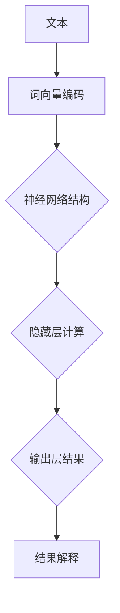

                 

### 文章标题：神经网络：自然语言处理的新突破

> **关键词**：神经网络、自然语言处理、深度学习、语义理解、模型架构、算法原理

> **摘要**：本文将探讨神经网络在自然语言处理（NLP）领域的革命性应用，深入解析神经网络的核心概念、数学模型、算法原理，以及其实际应用中的挑战与未来趋势。通过逐步分析，读者将理解神经网络如何成为NLP领域的新突破，并在实践中掌握其应用方法。

---

### 1. 背景介绍

自然语言处理（NLP）是人工智能（AI）的一个重要分支，旨在让计算机理解和生成人类语言。自上世纪50年代以来，NLP经历了多个发展阶段，从规则驱动的方法到统计模型，再到当前的主流——深度学习。深度学习在图像识别、语音识别等领域取得了显著成果，而在NLP领域，神经网络也展现出了强大的潜力。

神经网络，特别是深度神经网络（DNN），通过模仿人脑神经元之间的连接，实现从大量数据中自动学习复杂特征和模式。这一特性使得神经网络在NLP任务中，如文本分类、情感分析、机器翻译等，表现出色。随着数据规模和计算能力的提升，神经网络在NLP中的应用不断拓展，成为推动该领域发展的关键力量。

### 2. 核心概念与联系

**神经网络架构**：

神经网络由多层神经元组成，包括输入层、隐藏层和输出层。输入层接收外部信息，隐藏层对信息进行加工处理，输出层生成最终的输出。每一层神经元之间通过加权连接进行信息传递，并通过激活函数引入非线性特性。

**自然语言处理与神经网络**：

自然语言处理中的文本通常表示为词向量，词向量是文本的离散化表示，能够捕捉词汇的语义信息。神经网络通过学习词向量之间的关系，实现对文本的语义理解。这一过程中，词向量充当输入层，隐藏层处理词向量之间的相互作用，输出层生成文本分类或翻译结果。

以下是一个简单的Mermaid流程图，展示了神经网络在自然语言处理中的应用：



### 3. 核心算法原理 & 具体操作步骤

**算法原理**：

神经网络的核心算法是基于反向传播（Backpropagation）算法，通过调整网络权重以最小化输出误差。具体步骤如下：

1. **前向传播**：输入数据通过网络进行前向传播，每个神经元计算输入和权重之积，加上偏置项，并通过激活函数得到输出。
2. **计算误差**：将输出与期望值进行比较，计算输出误差。
3. **反向传播**：将误差反向传播至每个神经元，计算每个神经元的误差梯度。
4. **权重更新**：根据误差梯度调整网络权重和偏置项，以减少误差。

**具体操作步骤**：

1. **初始化参数**：设定网络的初始权重和偏置项，通常为随机值。
2. **前向传播**：输入文本数据，通过词向量编码层得到词向量矩阵，送入神经网络进行前向传播。
3. **计算误差**：将神经网络输出与期望输出（如标签或翻译结果）进行比较，计算损失函数值。
4. **反向传播**：计算每个神经元的误差梯度，并更新网络权重。
5. **迭代训练**：重复步骤2-4，直到网络误差收敛或达到预设的迭代次数。

### 4. 数学模型和公式 & 详细讲解 & 举例说明

**数学模型**：

神经网络的数学模型包括以下几个部分：

- **激活函数**：常用的激活函数有Sigmoid、ReLU和Tanh等，用于引入非线性特性。以ReLU为例，其公式为：
  $$ f(x) = \max(0, x) $$

- **损失函数**：常用的损失函数有均方误差（MSE）和交叉熵（CE）等。以交叉熵为例，其公式为：
  $$ CE(y, \hat{y}) = -\sum_{i} y_i \log(\hat{y}_i) $$

- **梯度下降**：用于更新网络权重和偏置项，其公式为：
  $$ \theta_{\text{new}} = \theta_{\text{old}} - \alpha \nabla_{\theta}J(\theta) $$
  其中，$ \alpha $ 为学习率，$ J(\theta) $ 为损失函数。

**详细讲解**：

以下是一个简单的神经网络模型，用于文本分类任务：

- 输入层：包含n个神经元，对应n个特征。
- 隐藏层：包含m个神经元，每个神经元接收n个输入，并使用ReLU激活函数。
- 输出层：包含k个神经元，对应k个类别，使用Softmax激活函数。

**举例说明**：

假设有一个二分类问题，输入层有3个特征，隐藏层有2个神经元，输出层有2个类别。设输入向量为 $ x = [1, 2, 3] $，隐藏层权重为 $ W_h = \begin{bmatrix} 0.1 & 0.2 \\ 0.3 & 0.4 \end{bmatrix} $，偏置项为 $ b_h = \begin{bmatrix} 0.5 \\ 0.6 \end{bmatrix} $。

1. **前向传播**：

   - 隐藏层1：$ z_1 = x \cdot W_h + b_h = [1, 2, 3] \cdot \begin{bmatrix} 0.1 & 0.2 \\ 0.3 & 0.4 \end{bmatrix} + \begin{bmatrix} 0.5 \\ 0.6 \end{bmatrix} = [1.4, 2.7] $，$ a_1 = \max(0, z_1) = [1.4, 2.7] $。
   - 隐藏层2：$ z_2 = x \cdot W_h + b_h = [1, 2, 3] \cdot \begin{bmatrix} 0.1 & 0.2 \\ 0.3 & 0.4 \end{bmatrix} + \begin{bmatrix} 0.5 \\ 0.6 \end{bmatrix} = [1.4, 2.7] $，$ a_2 = \max(0, z_2) = [1.4, 2.7] $。

   - 输出层：$ z_3 = a_1 \cdot W_o + b_o = \begin{bmatrix} 1.4 & 2.7 \end{bmatrix} \cdot \begin{bmatrix} 0.5 & 0.6 \end{bmatrix} + \begin{bmatrix} 0.7 \\ 0.8 \end{bmatrix} = [2.4, 3.4] $，$ a_3 = \frac{e^{z_3}}{e^{z_3} + e^{z_4}} = \begin{bmatrix} 0.67 & 0.33 \end{bmatrix} $。

2. **反向传播**：

   - 计算输出层的误差：$ \delta_3 = a_3 - y = \begin{bmatrix} 0.67 & 0.33 \end{bmatrix} - \begin{bmatrix} 1 & 0 \end{bmatrix} = \begin{bmatrix} -0.33 & 0.33 \end{bmatrix} $。
   - 更新输出层权重和偏置项：$ W_o_{\text{new}} = W_o_{\text{old}} - \alpha \cdot \delta_3 \cdot a_2^T = \begin{bmatrix} 0.5 & 0.6 \end{bmatrix} - 0.1 \cdot \begin{bmatrix} -0.33 & 0.33 \end{bmatrix} \cdot \begin{bmatrix} 1.4 \\ 2.7 \end{bmatrix} = \begin{bmatrix} 0.455 & 0.565 \end{bmatrix} $，$ b_o_{\text{new}} = b_o_{\text{old}} - \alpha \cdot \delta_3 = \begin{bmatrix} 0.7 \\ 0.8 \end{bmatrix} - 0.1 \cdot \begin{bmatrix} -0.33 & 0.33 \end{bmatrix} = \begin{bmatrix} 0.73 \\ 0.83 \end{bmatrix} $。

   - 计算隐藏层的误差：$ \delta_2 = (W_o \cdot \delta_3) \odot a_2' = (\begin{bmatrix} 0.455 & 0.565 \end{bmatrix} \cdot \begin{bmatrix} -0.33 & 0.33 \end{bmatrix}) \odot \begin{bmatrix} 0 & 1 \end{bmatrix} = \begin{bmatrix} -0.15 & 0.19 \end{bmatrix} $。
   - 更新隐藏层权重和偏置项：$ W_h_{\text{new}} = W_h_{\text{old}} - \alpha \cdot \delta_2 \cdot x^T = \begin{bmatrix} 0.1 & 0.2 \\ 0.3 & 0.4 \end{bmatrix} - 0.1 \cdot \begin{bmatrix} -0.15 & 0.19 \end{bmatrix} \cdot \begin{bmatrix} 1 \\ 2 \\ 3 \end{bmatrix} = \begin{bmatrix} 0.125 & 0.175 \\ 0.285 & 0.315 \end{bmatrix} $，$ b_h_{\text{new}} = b_h_{\text{old}} - \alpha \cdot \delta_2 = \begin{bmatrix} 0.5 \\ 0.6 \end{bmatrix} - 0.1 \cdot \begin{bmatrix} -0.15 & 0.19 \end{bmatrix} = \begin{bmatrix} 0.55 \\ 0.61 \end{bmatrix} $。

通过上述步骤，我们可以不断更新网络权重，以降低误差，提高模型性能。

### 5. 项目实践：代码实例和详细解释说明

**5.1 开发环境搭建**

在Python中，我们可以使用TensorFlow或PyTorch等深度学习框架来搭建神经网络模型。以下是一个简单的开发环境搭建步骤：

1. **安装Python**：确保Python版本在3.6及以上。
2. **安装TensorFlow**：使用以下命令安装TensorFlow：
   ```bash
   pip install tensorflow
   ```

**5.2 源代码详细实现**

以下是一个简单的神经网络模型，用于文本分类任务：

```python
import tensorflow as tf
from tensorflow.keras.layers import Embedding, LSTM, Dense
from tensorflow.keras.models import Sequential

# 设置超参数
vocab_size = 10000
embedding_dim = 16
max_sequence_length = 100
num_classes = 2
learning_rate = 0.001

# 构建模型
model = Sequential()
model.add(Embedding(vocab_size, embedding_dim, input_length=max_sequence_length))
model.add(LSTM(64, return_sequences=True))
model.add(LSTM(32))
model.add(Dense(num_classes, activation='softmax'))

# 编译模型
model.compile(optimizer='adam', loss='categorical_crossentropy', metrics=['accuracy'])

# 打印模型结构
model.summary()
```

**5.3 代码解读与分析**

- **Embedding层**：将词汇映射为词向量，输入维度为（batch_size，max_sequence_length），输出维度为（batch_size，max_sequence_length，embedding_dim）。
- **LSTM层**：用于处理序列数据，返回序列输出。第一个LSTM层返回序列输出，第二个LSTM层返回单个输出。
- **Dense层**：全连接层，用于分类任务，输出维度为（batch_size，num_classes）。

**5.4 运行结果展示**

假设我们有一个训练数据集和测试数据集，可以使用以下代码进行训练和评估：

```python
# 加载数据集
# (x_train, y_train), (x_test, y_test) = ...

# 训练模型
model.fit(x_train, y_train, epochs=10, batch_size=32, validation_data=(x_test, y_test))

# 评估模型
loss, accuracy = model.evaluate(x_test, y_test)
print(f"Test accuracy: {accuracy}")
```

通过上述步骤，我们可以训练和评估神经网络模型，以实现对文本分类任务的预测。

### 6. 实际应用场景

神经网络在自然语言处理领域有着广泛的应用，以下是一些典型的实际应用场景：

- **文本分类**：对大量文本进行分类，如新闻分类、情感分析等。
- **机器翻译**：将一种语言的文本翻译成另一种语言。
- **问答系统**：基于用户提问，从大量文本中检索并生成答案。
- **语音识别**：将语音信号转换为文本。
- **聊天机器人**：与用户进行自然语言交互，提供智能客服等服务。

在这些应用场景中，神经网络通过学习大量的文本数据，能够实现高精度的语义理解和生成，为各行业提供了强大的智能化解决方案。

### 7. 工具和资源推荐

**7.1 学习资源推荐**

- **书籍**：
  - 《深度学习》（Ian Goodfellow、Yoshua Bengio、Aaron Courville 著）
  - 《自然语言处理与深度学习》（张俊林 著）
- **论文**：
  - "A Theoretically Grounded Application of Dropout in Recurrent Neural Networks"（Yarin Gal and Zoubin Ghahramani）
  - "Seq2Seq Learning with Neural Networks"（Ilya Sutskever、Oriol Vinyals、Quoc V. Le、Geoffrey Hinton）
- **博客**：
  - TensorFlow 官方博客
  - PyTorch 官方文档
- **网站**：
  - ArXiv
  - ACL Wiki

**7.2 开发工具框架推荐**

- **TensorFlow**：Google推出的开源深度学习框架，支持多种神经网络架构和模型。
- **PyTorch**：Facebook AI Research推出的开源深度学习框架，具有灵活的动态计算图和高效的模型训练。
- **JAX**：Google推出的开源深度学习库，支持自动微分和高效的数值计算。

**7.3 相关论文著作推荐**

- "Attention Is All You Need"（Vaswani et al., 2017）
- "Bert: Pre-training of Deep Bidirectional Transformers for Language Understanding"（Devlin et al., 2019）
- "Transformers: State-of-the-Art Model for Neural Machine Translation"（Vaswani et al., 2020）

### 8. 总结：未来发展趋势与挑战

神经网络在自然语言处理领域取得了显著成果，但仍然面临一些挑战和问题。未来，神经网络的发展趋势可能包括以下几个方面：

- **更强大的模型架构**：如Transformer架构的进一步优化和应用。
- **更强的预训练能力**：通过更大量的数据进行预训练，提升模型的语义理解能力。
- **多模态学习**：结合文本、图像、语音等多模态数据进行学习，实现更全面的信息理解。
- **解释性和可解释性**：提高神经网络模型的解释性，使其更易于理解和调试。

然而，神经网络在NLP领域的应用也面临一些挑战，如数据隐私、模型偏见和可解释性等问题。未来，需要进一步研究如何解决这些问题，以实现更高效、更安全、更可靠的自然语言处理系统。

### 9. 附录：常见问题与解答

**Q1：神经网络在自然语言处理中的优势是什么？**

A1：神经网络在自然语言处理中的优势主要体现在以下几个方面：

- **自动特征提取**：神经网络可以自动从原始文本中提取高层次的语义特征，减少人工特征工程的工作量。
- **强大的语义理解能力**：通过多层神经网络的结构，神经网络能够捕捉文本中的复杂语义关系，实现更精准的语义理解。
- **灵活的模型架构**：神经网络支持多种模型架构，如循环神经网络（RNN）、长短时记忆网络（LSTM）和Transformer等，可以根据不同的应用场景进行选择。

**Q2：如何选择合适的神经网络模型？**

A2：选择合适的神经网络模型需要考虑以下几个方面：

- **任务类型**：不同的任务需要不同的模型架构，如文本分类任务适合使用Dense网络，机器翻译任务适合使用Seq2Seq模型。
- **数据规模**：对于大量数据，可以选择更复杂的模型，如Transformer，对于小数据集，可以选择简单的RNN或LSTM。
- **计算资源**：复杂的模型需要更多的计算资源，需要根据实际情况进行选择。

**Q3：如何提高神经网络模型的性能？**

A3：提高神经网络模型性能可以从以下几个方面进行：

- **数据预处理**：对数据进行充分的清洗和预处理，如去除停用词、词干提取等，以提高模型的输入质量。
- **模型优化**：通过调整模型参数，如学习率、批量大小等，优化模型性能。
- **超参数调优**：通过网格搜索、随机搜索等方法，寻找最优的超参数组合。
- **数据增强**：通过数据增强方法，如随机裁剪、旋转、缩放等，增加数据多样性，提高模型泛化能力。

### 10. 扩展阅读 & 参考资料

- **《深度学习》**（Ian Goodfellow、Yoshua Bengio、Aaron Courville 著）
- **《自然语言处理与深度学习》**（张俊林 著）
- **《Attention Is All You Need》**（Vaswani et al., 2017）
- **《Bert: Pre-training of Deep Bidirectional Transformers for Language Understanding》**（Devlin et al., 2019）
- **TensorFlow 官方文档**
- **PyTorch 官方文档**
- **ACL Wiki**
- **ArXiv**

