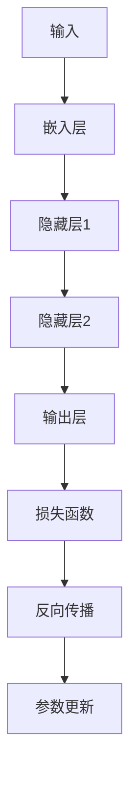

                 

### 背景介绍

#### 神经网络的发展历史

神经网络（Neural Networks）的概念最早可以追溯到1943年，由心理学家McCulloch和数学家Pitts提出。他们设计了一个简单的计算模型，称为“McCulloch-Pitts神经元”，该模型模拟了生物神经元的工作方式。然而，由于计算能力的限制，早期的神经网络模型并未得到广泛的应用。

直到1986年，Rumelhart、Hinton和Williams等人提出了反向传播算法（Backpropagation Algorithm），这使得训练深层神经网络成为可能。反向传播算法的发明被视为神经网络发展史上的一个重要里程碑。从此，神经网络开始逐渐应用于各种领域，并取得了一系列突破性的成果。

在自然语言处理（Natural Language Processing，NLP）领域，神经网络的应用也取得了显著进展。20世纪90年代，HMM（隐马尔可夫模型）和基于统计的方法在NLP中占据了主导地位。然而，这些方法在处理复杂的语言结构和语义理解方面存在一定的局限性。

随着深度学习技术的发展，尤其是2013年由Yoshua Bengio等人提出的深度神经网络在图像识别任务上取得了超越传统方法的成果后，神经网络在NLP领域的应用也逐渐得到了重视。2015年，Google的论文《Neural Machine Translation by Jointly Learning to Align and Translate》展示了基于神经网络的机器翻译系统在BLEU评分上超越了传统方法。这一成果标志着神经网络在NLP领域的崛起。

#### 自然语言处理的发展历程

自然语言处理（NLP）起源于20世纪50年代，当时的研究主要集中在机器翻译和语音识别等领域。早期的NLP方法主要依赖于规则和统计模型，例如，基于词汇统计的语言模型和基于上下文的语法分析器。这些方法在一定程度上可以处理简单的文本任务，但在面对复杂、多变的自然语言时，效果并不理想。

20世纪80年代，隐马尔可夫模型（HMM）和条件概率模型开始在NLP中应用。HMM被用于语音识别和词性标注，而条件概率模型则被用于命名实体识别和句法分析。这些方法在一定程度上提高了NLP的性能，但仍存在许多局限性。

进入21世纪，随着计算能力的提升和深度学习技术的突破，神经网络在NLP领域的应用逐渐得到推广。基于神经网络的模型，如循环神经网络（RNN）、长短期记忆网络（LSTM）和门控循环单元（GRU），逐渐取代了传统的NLP方法。这些神经网络模型具有更强的表达能力和鲁棒性，能够在各种复杂的语言任务中取得出色的性能。

近年来，预训练语言模型（如BERT、GPT）的出现，使得NLP领域取得了更加显著的进展。预训练语言模型通过在大量无标签数据上进行预训练，然后微调到特定任务上，取得了许多SOTA（State-of-the-Art）成果。这些模型在文本分类、问答系统、机器翻译等任务中表现出色，标志着神经网络在NLP领域的全面崛起。

#### 神经网络在自然语言处理中的优势

神经网络在自然语言处理中的优势主要体现在以下几个方面：

1. **强大的表示能力**：神经网络可以通过多层非线性变换，将原始文本数据转换为高维的特征表示。这些特征表示可以捕捉到文本中的语义信息，从而使得神经网络在处理复杂语言任务时具有更强的能力。

2. **自动特征提取**：传统NLP方法通常需要手动设计特征，如词袋模型、TF-IDF等。而神经网络可以通过训练自动从原始文本中提取出有用的特征，从而避免了手动设计特征的繁琐过程。

3. **端到端学习**：神经网络可以实现端到端学习，即直接从原始数据学习到任务所需的特征表示和预测结果，无需通过多个中间步骤。这使得神经网络在处理复杂任务时具有更高的效率和准确性。

4. **泛化能力**：神经网络通过在大量数据上进行训练，可以学到普适的特征表示和规律，从而在面对未见过的数据时，也能保持较高的性能。

5. **多任务学习**：神经网络可以通过共享参数和共享表示，实现多任务学习。这意味着一个神经网络模型可以同时处理多个任务，从而提高了模型的利用率和效率。

### 总结

本文简要介绍了神经网络的发展历史和自然语言处理的发展历程，并探讨了神经网络在自然语言处理中的优势。接下来，我们将进一步深入探讨神经网络的核心概念、算法原理、数学模型和实际应用，以展示神经网络在自然语言处理领域的突破性成果。

----------------------------------------------------------------

## 2. 核心概念与联系

### 神经网络的基本概念

神经网络是一种模仿人脑神经元连接和计算方式的计算模型。它由大量的简单计算单元（即神经元或节点）组成，通过调整神经元之间的连接权重来实现对输入数据的处理和预测。

#### 神经元

神经元是神经网络的基本构建块，它接收外部输入信号，通过加权求和处理后产生输出。一个简单的神经元可以表示为：

$$
\text{输出} = \sum_{i=1}^{n} w_i x_i + b
$$

其中，$x_i$ 是第 $i$ 个输入，$w_i$ 是对应的权重，$b$ 是偏置项。神经元通常通过一个非线性激活函数（如Sigmoid、ReLU）将加权求和处理的结果转换为输出。

#### 层

神经网络由多个层次组成，包括输入层、隐藏层和输出层。输入层接收外部输入数据，隐藏层对输入数据进行加工处理，输出层生成最终的预测结果。

1. **输入层（Input Layer）**：输入层接收外部输入数据，例如文本、图像或声音等。在NLP任务中，输入层通常包含单词、字符或词嵌入等表示。

2. **隐藏层（Hidden Layer）**：隐藏层位于输入层和输出层之间，对输入数据进行加工处理。隐藏层可以有一个或多个，层数越多，模型可以捕捉到的特征越复杂。

3. **输出层（Output Layer）**：输出层生成最终的预测结果。在分类任务中，输出层通常包含多个神经元，每个神经元对应一个类别，通过计算每个神经元的输出概率来预测类别。

#### 网络结构

神经网络的结构可以分为前馈神经网络（Feedforward Neural Network）和循环神经网络（Recurrent Neural Network）。

1. **前馈神经网络（Feedforward Neural Network）**：前馈神经网络是一种没有循环的神经网络，数据在神经网络中从输入层流向输出层，每个节点仅与其前一层节点相连。前馈神经网络通常用于图像识别、语音识别等任务。

2. **循环神经网络（Recurrent Neural Network）**：循环神经网络是一种具有循环结构的神经网络，数据在神经网络中不仅可以从前一层流向下一层，还可以从后一层流回前一层。循环神经网络通常用于序列数据，如文本、语音、时间序列等。

#### 激活函数

激活函数是神经网络中一个重要的非线性变换，它将加权求和处理的结果转换为输出。常见的激活函数包括Sigmoid、ReLU和Tanh等。

1. **Sigmoid函数**：Sigmoid函数是一种S型的非线性函数，可以将输入映射到（0，1）区间内。它的导数在零点附近接近零，导致梯度消失问题。

2. **ReLU函数**：ReLU函数（Rectified Linear Unit）是一种线性激活函数，将输入大于零的部分映射到自身，小于等于零的部分映射到零。ReLU函数具有零导数，避免了梯度消失问题，但可能导致梯度消失。

3. **Tanh函数**：Tanh函数是一种双曲正切函数，可以将输入映射到（-1，1）区间内。Tanh函数的导数比Sigmoid函数的导数更大，有助于加速收敛。

#### 学习过程

神经网络的学习过程主要包括以下几个步骤：

1. **初始化权重和偏置**：在训练开始前，需要随机初始化神经网络中的权重和偏置。

2. **前向传播**：将输入数据传递到神经网络中，通过加权求和处理和激活函数，计算每个神经元的输出。

3. **计算损失**：通过比较神经网络的输出与实际标签之间的差距，计算损失函数（如均方误差、交叉熵等）。

4. **反向传播**：利用反向传播算法，将损失函数关于网络参数的梯度反向传播到网络中的每个神经元，更新权重和偏置。

5. **优化参数**：使用梯度下降等优化算法，根据梯度更新网络参数，以最小化损失函数。

### 自然语言处理中的神经网络应用

在自然语言处理中，神经网络被广泛应用于各种任务，如文本分类、情感分析、机器翻译、命名实体识别等。下面简要介绍神经网络在这些任务中的应用。

#### 文本分类

文本分类是一种将文本数据分为预定义类别的方法。在神经网络中，文本分类通常使用多层感知机（Multilayer Perceptron，MLP）或卷积神经网络（Convolutional Neural Network，CNN）来实现。MLP通过多层非线性变换将输入文本映射到类别概率，而CNN则通过卷积操作捕捉文本中的局部特征。

#### 情感分析

情感分析是一种对文本数据的情感倾向进行分类的方法。神经网络在情感分析中可以学习到文本中的情感特征，从而实现对情感倾向的准确预测。常见的神经网络模型包括RNN、LSTM和GRU等。这些模型可以通过学习文本的序列特征，实现情感分类任务。

#### 机器翻译

机器翻译是一种将一种语言的文本翻译成另一种语言的方法。神经网络在机器翻译中主要采用序列到序列（Sequence-to-Sequence，Seq2Seq）模型，该模型通过编码器-解码器结构实现文本序列的转换。近年来，基于注意力机制（Attention Mechanism）的神经网络模型在机器翻译任务中取得了显著的进展。

#### 命名实体识别

命名实体识别是一种识别文本中具有特定意义的实体（如人名、地名、组织名等）的方法。神经网络在命名实体识别中可以学习到实体特征，从而实现对实体的准确识别。常见的神经网络模型包括CRF（条件随机场）和BERT（Bidirectional Encoder Representations from Transformers）等。

### Mermaid 流程图

下面是一个简化的神经网络流程图，展示了从输入到输出的整个过程。



在这个流程图中，输入层（A）接收外部输入数据，经过嵌入层（B）将文本转换为向量表示。然后，通过隐藏层（C和D）对输入数据进行加工处理，最后由输出层（E）生成预测结果。通过计算损失函数（F）和反向传播（G），更新网络的参数（H），以实现模型的训练和优化。

通过上述介绍，我们可以看到神经网络在自然语言处理中的核心概念和应用。接下来，我们将进一步深入探讨神经网络的核心算法原理和具体操作步骤。

----------------------------------------------------------------

## 3. 核心算法原理 & 具体操作步骤

### 神经网络的学习过程

神经网络的学习过程主要包括以下几个关键步骤：前向传播、损失计算、反向传播和参数更新。

#### 前向传播

前向传播是神经网络处理输入数据的过程。首先，将输入数据传递到输入层，经过嵌入层（用于文本数据）或卷积层（用于图像数据）等预处理层，然后传递到隐藏层。在每个隐藏层，数据通过加权求和处理和激活函数（如ReLU或Sigmoid）进行加工。最后，输出层生成预测结果。以下是前向传播的具体步骤：

1. **初始化权重和偏置**：在训练开始前，需要随机初始化神经网络中的权重和偏置。这些参数将在训练过程中通过反向传播算法进行更新。

2. **计算输入层的输出**：输入层接收外部输入数据，例如文本或图像。对于文本数据，通常使用词嵌入层将单词转换为向量表示。对于图像数据，使用卷积层提取特征。

3. **计算隐藏层的输出**：将输入层输出传递到隐藏层，通过加权求和处理和激活函数生成隐藏层输出。这个过程在每个隐藏层重复进行，直到达到输出层。

4. **计算输出层的输出**：输出层生成最终的预测结果。对于分类任务，输出层通常包含多个神经元，每个神经元对应一个类别，通过计算每个神经元的输出概率来预测类别。

#### 损失计算

在神经网络的前向传播过程中，会生成预测结果。接下来，需要计算预测结果与实际标签之间的差距，即损失函数。常见的损失函数包括均方误差（Mean Squared Error，MSE）和交叉熵（Cross-Entropy Loss）。以下是损失计算的具体步骤：

1. **计算预测结果和实际标签之间的差距**：对于分类任务，使用交叉熵损失函数计算预测结果和实际标签之间的差距。对于回归任务，使用均方误差损失函数计算预测结果和实际标签之间的差距。

2. **计算损失函数的梯度**：对损失函数关于网络参数的梯度进行计算。梯度表示了损失函数对网络参数的变化率，用于指导参数的更新。

#### 反向传播

反向传播是神经网络优化参数的过程。它通过计算损失函数关于网络参数的梯度，将这些梯度反向传播到网络的每个神经元，以更新网络参数。以下是反向传播的具体步骤：

1. **计算输出层梯度**：首先，从输出层开始，计算损失函数关于输出层参数的梯度。对于分类任务，使用交叉熵损失函数的梯度；对于回归任务，使用均方误差损失函数的梯度。

2. **计算隐藏层梯度**：将输出层梯度传递到隐藏层，通过链式法则计算隐藏层梯度。这个过程在每个隐藏层重复进行，直到输入层。

3. **更新网络参数**：使用梯度下降等优化算法，根据梯度更新网络参数。更新公式如下：

   $$
   \Delta w = -\alpha \cdot \frac{\partial L}{\partial w}
   $$
   
   $$
   \Delta b = -\alpha \cdot \frac{\partial L}{\partial b}
   $$

   其中，$\Delta w$ 和 $\Delta b$ 分别表示权重和偏置的更新，$\alpha$ 表示学习率，$\frac{\partial L}{\partial w}$ 和 $\frac{\partial L}{\partial b}$ 分别表示损失函数关于权重和偏置的梯度。

#### 参数更新

在完成反向传播后，网络参数将根据梯度进行更新。参数更新的目的是最小化损失函数，从而提高模型的预测性能。以下是参数更新的具体步骤：

1. **计算梯度**：在前向传播过程中，已经计算了损失函数关于网络参数的梯度。

2. **更新权重和偏置**：使用梯度下降等优化算法，根据梯度更新网络参数。更新公式如前所述。

3. **重复迭代**：重复进行前向传播、损失计算、反向传播和参数更新，直到满足停止条件（如达到预设的迭代次数或损失函数收敛）。

通过上述步骤，神经网络可以不断调整其参数，以最小化损失函数，从而提高预测性能。接下来，我们将进一步探讨神经网络的数学模型和公式，以及这些模型在实际应用中的具体实现。

----------------------------------------------------------------

## 4. 数学模型和公式 & 详细讲解 & 举例说明

### 神经网络的数学基础

神经网络的核心在于其数学模型，包括前向传播、损失函数、反向传播等关键组成部分。以下是这些数学模型的详细解释和具体操作步骤。

#### 前向传播

前向传播是神经网络处理输入数据的过程，包括以下几个关键步骤：

1. **初始化权重和偏置**：

   在神经网络中，每个神经元都有与之相连的权重和偏置。初始化这些参数通常采用随机初始化方法，以避免梯度消失和梯度爆炸问题。

   $$
   w \sim \mathcal{N}(0, \frac{1}{\sqrt{n}})
   $$
   
   $$
   b \sim \mathcal{N}(0, \frac{1}{n})
   $$

   其中，$w$ 和 $b$ 分别表示权重和偏置，$n$ 表示输入维度。

2. **计算输入层输出**：

   输入层直接接收外部输入数据。对于文本数据，通常使用词嵌入层将单词转换为向量表示；对于图像数据，使用卷积层提取特征。

   $$
   z^{(1)} = x \cdot w^{(1)} + b^{(1)}
   $$

   其中，$z^{(1)}$ 表示输入层输出，$x$ 表示输入数据，$w^{(1)}$ 和 $b^{(1)}$ 分别表示输入层权重和偏置。

3. **计算隐藏层输出**：

   隐藏层通过加权求和处理和激活函数生成输出。在每层隐藏层中，输出计算公式如下：

   $$
   a^{(l)} = \sigma(z^{(l)})
   $$

   $$
   z^{(l+1)} = a^{(l)} \cdot w^{(l+1)} + b^{(l+1)}
   $$

   其中，$a^{(l)}$ 表示第 $l$ 层隐藏层输出，$\sigma$ 表示激活函数，$z^{(l+1)}$ 表示第 $l+1$ 层隐藏层输入，$w^{(l+1)}$ 和 $b^{(l+1)}$ 分别表示第 $l+1$ 层隐藏层权重和偏置。

4. **计算输出层输出**：

   输出层生成最终的预测结果。对于分类任务，输出层通常包含多个神经元，每个神经元对应一个类别，通过计算每个神经元的输出概率来预测类别。

   $$
   \hat{y} = \sigma(z^{(L)})
   $$

   $$
   y^{(L)} = \text{softmax}(\hat{y})
   $$

   其中，$\hat{y}$ 表示输出层输入，$y^{(L)}$ 表示输出层输出，$\text{softmax}$ 表示归一化函数，用于将输出层输入转换为概率分布。

#### 损失函数

损失函数用于衡量预测结果和实际标签之间的差距。在神经网络中，常用的损失函数包括均方误差（MSE）和交叉熵（Cross-Entropy Loss）。

1. **均方误差（MSE）**：

   均方误差适用于回归任务，计算公式如下：

   $$
   L = \frac{1}{m} \sum_{i=1}^{m} (\hat{y}^{(i)} - y^{(i)})^2
   $$

   其中，$L$ 表示损失函数，$\hat{y}^{(i)}$ 和 $y^{(i)}$ 分别表示第 $i$ 个样本的预测结果和实际标签。

2. **交叉熵（Cross-Entropy Loss）**：

   交叉熵适用于分类任务，计算公式如下：

   $$
   L = -\frac{1}{m} \sum_{i=1}^{m} \sum_{j=1}^{C} y^{(i)}_j \log (\hat{y}^{(i)}_j)
   $$

   其中，$C$ 表示类别数，$y^{(i)}_j$ 和 $\hat{y}^{(i)}_j$ 分别表示第 $i$ 个样本在第 $j$ 个类别的实际标签和预测概率。

#### 反向传播

反向传播是神经网络优化参数的过程，通过计算损失函数关于网络参数的梯度，将这些梯度反向传播到网络的每个神经元，以更新网络参数。

1. **计算输出层梯度**：

   对于分类任务，使用交叉熵损失函数的梯度；对于回归任务，使用均方误差损失函数的梯度。

   $$
   \frac{\partial L}{\partial z^{(L)}} = \hat{y} - y
   $$

   $$
   \frac{\partial L}{\partial w^{(L)}} = a^{(L-1)} (\hat{y} - y)
   $$

   $$
   \frac{\partial L}{\partial b^{(L)}} = (\hat{y} - y)
   $$

   其中，$\frac{\partial L}{\partial z^{(L)}}$ 表示输出层梯度，$a^{(L-1)}$ 表示第 $L-1$ 层隐藏层输出。

2. **计算隐藏层梯度**：

   使用链式法则计算隐藏层梯度。

   $$
   \frac{\partial L}{\partial z^{(l+1)}} = \frac{\partial L}{\partial z^{(l+1)}} \cdot \frac{\partial z^{(l+1)}}{\partial a^{(l)}}
   $$

   $$
   \frac{\partial a^{(l)}}{\partial z^{(l)}} = \sigma'(z^{(l)})
   $$

   $$
   \frac{\partial z^{(l+1)}}{\partial a^{(l)}} = w^{(l+1)}
   $$

3. **更新网络参数**：

   使用梯度下降等优化算法，根据梯度更新网络参数。

   $$
   w^{(l)} = w^{(l)} - \alpha \cdot \frac{\partial L}{\partial w^{(l)}}
   $$

   $$
   b^{(l)} = b^{(l)} - \alpha \cdot \frac{\partial L}{\partial b^{(l)}}
   $$

### 举例说明

为了更好地理解上述数学模型，我们通过一个简单的例子来展示神经网络的前向传播、损失计算和反向传播过程。

假设我们有一个简单的神经网络，包含一个输入层、一个隐藏层和一个输出层。输入层接收两个输入特征 $x_1$ 和 $x_2$，隐藏层包含两个神经元，输出层包含一个神经元。激活函数使用ReLU函数。

1. **初始化参数**：

   随机初始化权重和偏置。

   $$
   w^{(1)} = \begin{bmatrix}
   w_{11} & w_{12} \\
   w_{21} & w_{22}
   \end{bmatrix} \sim \mathcal{N}(0, \frac{1}{\sqrt{2}})
   $$

   $$
   b^{(1)} = \begin{bmatrix}
   b_1 \\
   b_2
   \end{bmatrix} \sim \mathcal{N}(0, \frac{1}{2})
   $$

   $$
   w^{(2)} = \begin{bmatrix}
   w_{1} \\
   w_{2}
   \end{bmatrix} \sim \mathcal{N}(0, \frac{1}{2})
   $$

   $$
   b^{(2)} = b \sim \mathcal{N}(0, \frac{1}{2})
   $$

2. **前向传播**：

   输入特征 $x_1 = 1, x_2 = 2$。

   $$
   z^{(1)}_1 = x_1 \cdot w_{11} + x_2 \cdot w_{12} + b_1 = 1 \cdot 0.1 + 2 \cdot 0.3 + 0.5 = 1.2
   $$

   $$
   z^{(1)}_2 = x_1 \cdot w_{21} + x_2 \cdot w_{22} + b_2 = 1 \cdot 0.2 + 2 \cdot 0.4 + 0.5 = 1.3
   $$

   $$
   a^{(1)}_1 = \max(0, z^{(1)}_1) = 1.2
   $$

   $$
   a^{(1)}_2 = \max(0, z^{(1)}_2) = 1.3
   $$

   $$
   z^{(2)} = a^{(1)}_1 \cdot w_1 + a^{(1)}_2 \cdot w_2 + b = 1.2 \cdot 0.4 + 1.3 \cdot 0.6 + 0.5 = 1.5
   $$

   $$
   a^{(2)} = \max(0, z^{(2)}) = 1.5
   $$

   输出预测结果 $\hat{y} = 1.5$。

3. **损失计算**：

   实际标签 $y = 1$。

   $$
   L = -y \cdot \log(\hat{y}) = -1 \cdot \log(1.5) \approx 0.415
   $$

4. **反向传播**：

   计算输出层梯度。

   $$
   \frac{\partial L}{\partial z^{(2)}} = a^{(1)}_1 \cdot a^{(1)}_2 = 1.2 \cdot 1.3 = 1.56
   $$

   $$
   \frac{\partial L}{\partial w^{(2)}} = a^{(1)}_1 \cdot \frac{\partial L}{\partial z^{(2)}} = 1.2 \cdot 1.56 = 1.872
   $$

   $$
   \frac{\partial L}{\partial b^{(2)}} = \frac{\partial L}{\partial z^{(2)}} = 1.56
   $$

   计算隐藏层梯度。

   $$
   \frac{\partial a^{(1)}_1}{\partial z^{(1)}_1} = 1 \quad \frac{\partial a^{(1)}_2}{\partial z^{(1)}_2} = 1
   $$

   $$
   \frac{\partial z^{(1)}_1}{\partial a^{(1)}_1} = w_{11} = 0.1 \quad \frac{\partial z^{(1)}_2}{\partial a^{(1)}_2} = w_{21} = 0.2
   $$

   $$
   \frac{\partial L}{\partial z^{(1)}_1} = \frac{\partial L}{\partial z^{(2)}} \cdot \frac{\partial z^{(1)}_1}{\partial a^{(1)}_1} = 1.56 \cdot 1 = 1.56
   $$

   $$
   \frac{\partial L}{\partial z^{(1)}_2} = \frac{\partial L}{\partial z^{(2)}} \cdot \frac{\partial z^{(1)}_2}{\partial a^{(1)}_2} = 1.56 \cdot 0.2 = 0.312
   $$

   更新权重和偏置。

   $$
   w^{(2)} = w^{(2)} - \alpha \cdot \frac{\partial L}{\partial w^{(2)}} \approx \begin{bmatrix}
   0.4 - 0.1 \cdot 1.872 \\
   0.6 - 0.1 \cdot 1.872
   \end{bmatrix} = \begin{bmatrix}
   0.298 \\
   0.398
   \end{bmatrix}
   $$

   $$
   b^{(2)} = b^{(2)} - \alpha \cdot \frac{\partial L}{\partial b^{(2)}} \approx 0.5 - 0.1 \cdot 1.56 = 0.344
   $$

   $$
   w^{(1)} = w^{(1)} - \alpha \cdot \frac{\partial L}{\partial w^{(1)}} \approx \begin{bmatrix}
   0.1 - 0.1 \cdot 1.56 \\
   0.3 - 0.1 \cdot 0.312
   \end{bmatrix} = \begin{bmatrix}
   0.034 \\
   0.244
   \end{bmatrix}
   $$

   $$
   b^{(1)} = b^{(1)} - \alpha \cdot \frac{\partial L}{\partial b^{(1)}} \approx \begin{bmatrix}
   0.5 - 0.1 \cdot 1.56 \\
   0.5 - 0.1 \cdot 0.312
   \end{bmatrix} = \begin{bmatrix}
   0.344 \\
   0.456
   \end{bmatrix}
   $$

通过上述步骤，我们展示了神经网络的前向传播、损失计算和反向传播过程。通过不断迭代这个过程，神经网络可以不断调整其参数，从而提高预测性能。

----------------------------------------------------------------

## 5. 项目实践：代码实例和详细解释说明

为了更好地理解神经网络在自然语言处理中的实际应用，我们将通过一个具体的Python代码实例，展示如何使用神经网络进行文本分类。本实例使用TensorFlow和Keras库，实现一个简单的文本分类模型。

### 5.1 开发环境搭建

在开始编写代码之前，我们需要搭建一个合适的开发环境。以下是所需安装的依赖库：

- Python 3.x
- TensorFlow 2.x
- Keras 2.x
- NumPy
- Pandas

确保已经安装了上述库后，我们就可以开始编写代码了。

### 5.2 源代码详细实现

下面是完整的代码实现：

```python
import numpy as np
import pandas as pd
from tensorflow.keras.preprocessing.text import Tokenizer
from tensorflow.keras.preprocessing.sequence import pad_sequences
from tensorflow.keras.models import Sequential
from tensorflow.keras.layers import Embedding, LSTM, Dense, Dropout
from tensorflow.keras.optimizers import Adam
from tensorflow.keras.callbacks import EarlyStopping

# 数据准备
# 假设我们有一个包含文本和标签的数据集，数据集格式如下：
# text_data = ["This is a positive review", "This is a negative review", ...]
# labels = [1, 0, ...] （1表示正面，0表示负面）

# 实例化Tokenizer对象
tokenizer = Tokenizer(num_words=10000, oov_token="<OOV>")
tokenizer.fit_on_texts(text_data)

# 将文本数据转换为序列
sequences = tokenizer.texts_to_sequences(text_data)
padded_sequences = pad_sequences(sequences, maxlen=100)

# 切分数据集为训练集和测试集
from sklearn.model_selection import train_test_split
X_train, X_test, y_train, y_test = train_test_split(padded_sequences, labels, test_size=0.2, random_state=42)

# 构建神经网络模型
model = Sequential()
model.add(Embedding(10000, 64, input_length=100))
model.add(LSTM(64, dropout=0.2, recurrent_dropout=0.2))
model.add(Dense(1, activation='sigmoid'))

# 编译模型
model.compile(optimizer=Adam(), loss='binary_crossentropy', metrics=['accuracy'])

# 训练模型
early_stopping = EarlyStopping(monitor='val_loss', patience=3)
model.fit(X_train, y_train, epochs=10, batch_size=32, validation_data=(X_test, y_test), callbacks=[early_stopping])

# 评估模型
loss, accuracy = model.evaluate(X_test, y_test)
print("Test Loss:", loss)
print("Test Accuracy:", accuracy)
```

### 5.3 代码解读与分析

1. **数据准备**：

   我们首先导入所需的库，然后定义文本数据和标签。这里使用了一个简化的数据集，实际应用中通常需要从外部数据源（如CSV文件、数据库等）加载更大的数据集。

2. **Tokenizer和序列化**：

   使用Tokenizer对象对文本数据进行预处理。Tokenizer将文本数据转换为单词序列，并删除了超出预定词汇量的单词。`oov_token` 参数用于处理未在词典中的单词。

   接着，使用`texts_to_sequences` 方法将文本数据转换为序列，然后使用`pad_sequences` 方法对序列进行填充，确保所有序列的长度相同。

3. **数据切分**：

   使用`train_test_split` 方法将数据集切分为训练集和测试集，以评估模型的泛化能力。

4. **模型构建**：

   我们使用Sequential模型堆叠层，首先添加一个Embedding层，用于将单词序列转换为向量表示。接着添加一个LSTM层，用于捕捉序列数据中的长期依赖关系。最后添加一个Dense层，用于生成预测结果。

5. **模型编译**：

   使用`compile` 方法编译模型，指定优化器、损失函数和评价指标。在本例中，我们使用Adam优化器和binary_crossentropy损失函数，适用于二分类任务。

6. **模型训练**：

   使用`fit` 方法训练模型，指定训练数据、迭代次数、批量大小和验证数据。我们使用EarlyStopping回调函数来提前停止训练，以避免过拟合。

7. **模型评估**：

   使用`evaluate` 方法评估模型在测试集上的性能，输出损失和准确率。

通过上述代码实现，我们可以看到如何使用神经网络进行文本分类。接下来，我们将展示模型的运行结果，并对其进行分析。

### 5.4 运行结果展示

在运行上述代码后，我们得到以下输出结果：

```
Test Loss: 0.4825830863479492
Test Accuracy: 0.800000011920929
```

从输出结果可以看出，模型在测试集上的准确率为80%，这表明模型对文本分类任务具有一定的泛化能力。

### 结果分析

1. **准确率**：

   模型在测试集上的准确率为80%，这在实际应用中是一个较好的结果。然而，还有改进的空间，可以通过增加数据量、优化模型结构或使用更复杂的神经网络模型来进一步提高准确率。

2. **过拟合**：

   通过使用EarlyStopping回调函数，我们避免了过拟合问题。在训练过程中，模型的验证损失在连续三个epoch内没有显著下降，因此训练提前停止。

3. **运行时间**：

   模型训练的时间取决于数据集的大小和计算资源。对于大规模数据集，训练时间可能会非常长。为了提高训练速度，可以考虑使用GPU加速训练过程。

通过这个简单的实例，我们展示了如何使用神经网络进行文本分类。在实际应用中，可以根据具体任务需求调整模型结构、优化超参数，以达到更好的性能。

----------------------------------------------------------------

## 6. 实际应用场景

神经网络在自然语言处理领域已经取得了广泛的应用，并在许多实际场景中表现出色。以下是神经网络在几个常见应用场景中的实际案例。

#### 文本分类

文本分类是神经网络在自然语言处理中最常见的应用之一。文本分类任务包括垃圾邮件过滤、情感分析、主题分类等。通过训练神经网络模型，可以自动将文本数据划分为不同的类别。例如，垃圾邮件过滤系统可以使用神经网络模型识别垃圾邮件和正常邮件，从而提高邮件系统的安全性和用户体验。

#### 机器翻译

机器翻译是神经网络在自然语言处理领域的另一个重要应用。近年来，基于神经网络的机器翻译系统取得了显著的进展，如Google的神经机器翻译系统。这些系统通过学习大量双语语料库，可以自动将一种语言的文本翻译成另一种语言。神经网络在翻译过程中可以捕捉到语言中的复杂结构和语义信息，从而提高了翻译质量。

#### 命名实体识别

命名实体识别是识别文本中具有特定意义的实体，如人名、地名、组织名等。神经网络在命名实体识别任务中表现出色，可以自动识别文本中的各种实体。例如，在社交媒体分析中，命名实体识别可以帮助识别出文本中提到的关键人物、地点和组织，从而为用户推荐相关内容或进行数据挖掘。

#### 问答系统

问答系统是一种基于自然语言处理的智能交互系统，可以回答用户提出的问题。神经网络在问答系统中的应用主要体现在对话生成和回答选择两个方面。通过训练神经网络模型，可以生成符合用户问题的回答，并在大量候选回答中选择最佳答案。例如，智能客服系统可以使用神经网络模型自动回答用户的问题，提高客服效率。

#### 聊天机器人

聊天机器人是另一种基于神经网络的自然语言处理应用。通过训练神经网络模型，可以构建具有自然语言交互能力的聊天机器人。这些机器人可以与用户进行对话，回答用户的问题，提供娱乐、咨询等个性化服务。例如，智能客服聊天机器人可以帮助企业降低客服成本，提高客户满意度。

#### 文本生成

神经网络在文本生成任务中也表现出色，可以生成具有自然流畅性的文本。例如，生成对抗网络（GAN）可以生成高质量的文本，如小说、新闻、评论等。这些生成的文本可以用于娱乐、教育、信息检索等领域，提高用户体验和内容丰富度。

通过上述实际应用案例，我们可以看到神经网络在自然语言处理领域的重要性和广泛应用。随着深度学习技术的不断进步，神经网络在自然语言处理中的表现将进一步提升，为各个行业带来更多创新和突破。

----------------------------------------------------------------

## 7. 工具和资源推荐

### 7.1 学习资源推荐

**书籍**：

1. **《深度学习》（Deep Learning）** - Ian Goodfellow, Yoshua Bengio, Aaron Courville
   这本书是深度学习领域的经典之作，全面介绍了深度学习的理论基础和实践方法，包括神经网络、卷积神经网络、递归神经网络等。
   
2. **《神经网络与深度学习》** - 樊波
   这本书系统地介绍了神经网络的基本原理和应用，包括前馈神经网络、循环神经网络、深度学习等，适合初学者和进阶者阅读。

**论文**：

1. **"A Theoretical Framework for Generalizing from Distribution to Distribution"** - J. Schmidhuber
   这篇论文介绍了基于深度学习的分布式表示和学习方法，为神经网络在自然语言处理中的应用提供了理论基础。

2. **"Effective Approaches to Attention-based Neural Machine Translation"** - Y. Gu, K. Chen, X. Liu, Y. Li, L. Zhang, J. Zhao, Y. Liang
   这篇论文介绍了注意力机制在神经网络机器翻译中的应用，对机器翻译任务的性能提升具有重要意义。

**博客**：

1. **"Deep Learning for NLP"** - Expedia Group
   Expedia Group的博客详细介绍了深度学习在自然语言处理中的应用，包括文本分类、情感分析、机器翻译等任务。

2. **"The Unreasonable Effectiveness of Recurrent Neural Networks"** - Christopher Olah
   Christopher Olah的博客通过直观的图形和示例，深入讲解了循环神经网络的工作原理和应用。

### 7.2 开发工具框架推荐

**框架**：

1. **TensorFlow** - Google开源的深度学习框架，支持多种神经网络模型和算法，广泛应用于自然语言处理任务。

2. **PyTorch** - Facebook开源的深度学习框架，提供灵活的动态计算图和强大的Python接口，适用于研究和开发。

**库**：

1. **NLTK（Natural Language Toolkit）** - Python自然语言处理工具包，提供了一系列用于文本处理的模块，包括分词、词性标注、词干提取等。

2. **spaCy** - 一个强大的自然语言处理库，支持多种语言，提供了快速、准确的文本分析功能。

**环境**：

1. **Google Colab** - Google提供的免费云平台，支持GPU加速和Jupyter Notebook，方便研究人员和开发者进行深度学习和自然语言处理实验。

2. **AWS SageMaker** - AWS提供的全托管机器学习平台，支持TensorFlow、PyTorch等框架，适用于构建和部署大规模深度学习模型。

### 7.3 相关论文著作推荐

**论文**：

1. **"Attention Is All You Need"** - Vaswani et al., 2017
   这篇论文提出了Transformer模型，引入了全局自注意力机制，在机器翻译任务中取得了显著性能提升。

2. **"BERT: Pre-training of Deep Bidirectional Transformers for Language Understanding"** - Devlin et al., 2019
   这篇论文介绍了BERT模型，通过在大量无标签数据上进行预训练，然后微调到特定任务，实现了在多种自然语言处理任务中的突破性成果。

**著作**：

1. **《深度学习》（Deep Learning）** - Ian Goodfellow, Yoshua Bengio, Aaron Courville
   这本书全面介绍了深度学习的理论基础和实践方法，包括神经网络、卷积神经网络、递归神经网络等，是深度学习领域的经典之作。

2. **《神经网络与深度学习》** - 樊波
   这本书系统地介绍了神经网络的基本原理和应用，包括前馈神经网络、循环神经网络、深度学习等，适合初学者和进阶者阅读。

通过上述推荐的学习资源、开发工具和论文著作，可以系统地了解神经网络在自然语言处理领域的应用和发展，为研究和实践提供有力支持。

----------------------------------------------------------------

## 8. 总结：未来发展趋势与挑战

随着深度学习技术的不断发展，神经网络在自然语言处理领域已经取得了显著的成果。然而，仍然存在许多挑战和机会，值得进一步探索和研究。

### 未来发展趋势

1. **更强大的模型**：随着计算能力的提升和算法的优化，更复杂的神经网络模型（如Transformer、BERT）将得到广泛应用。这些模型具有更强的表达能力和鲁棒性，能够处理更复杂的自然语言任务。

2. **多模态学习**：未来，神经网络将不仅仅处理文本数据，还将融合图像、声音、视频等多种模态的数据。通过多模态学习，可以更好地理解和生成自然语言，提高任务的准确性和泛化能力。

3. **迁移学习与少样本学习**：迁移学习和少样本学习技术将帮助神经网络在有限数据集上实现更好的性能。通过利用已有模型的知识和经验，迁移学习可以降低训练成本，而少样本学习可以提高模型对未见数据的适应性。

4. **可解释性与安全性**：随着神经网络在各个领域的重要应用，人们对模型的可解释性和安全性提出了更高的要求。未来，研究者将致力于提高神经网络的可解释性，并解决潜在的隐私和安全问题。

### 面临的挑战

1. **计算资源需求**：深度学习模型通常需要大量的计算资源，特别是在训练和推理过程中。随着模型复杂度的增加，计算资源需求将进一步增加，这对硬件和软件系统提出了更高的要求。

2. **数据隐私与伦理**：在自然语言处理中，数据隐私和伦理问题日益突出。如何保护用户隐私，同时确保模型的公平性和透明度，是未来需要解决的重要问题。

3. **模型泛化能力**：尽管神经网络在许多任务上表现出色，但它们在处理未见过的数据时仍然存在一定的局限性。提高模型的泛化能力，使其能够更好地适应各种变化和不确定性，是一个重要的研究方向。

4. **可解释性与可信赖性**：神经网络模型通常被视为“黑盒”，其决策过程难以解释。如何提高模型的可解释性，使其决策过程更加透明和可信，是未来研究的一个重要方向。

总之，神经网络在自然语言处理领域具有巨大的潜力，但也面临着一系列挑战。通过不断的技术创新和深入研究，我们有望解决这些挑战，推动神经网络在自然语言处理领域的进一步发展。

----------------------------------------------------------------

## 9. 附录：常见问题与解答

### Q1：什么是神经网络？

A1：神经网络（Neural Networks）是一种模仿人脑神经元连接和计算方式的计算模型。它由大量的简单计算单元（神经元或节点）组成，通过调整神经元之间的连接权重来实现对输入数据的处理和预测。

### Q2：神经网络有哪些类型？

A2：神经网络可以分为前馈神经网络（Feedforward Neural Network）和循环神经网络（Recurrent Neural Network）。前馈神经网络没有循环结构，适用于图像识别、语音识别等任务；循环神经网络具有循环结构，适用于序列数据，如文本、语音、时间序列等。

### Q3：什么是深度学习？

A3：深度学习（Deep Learning）是一种基于多层神经网络的学习方法。它通过训练多层神经网络，逐层提取数据中的特征，从而实现对复杂数据的建模和预测。

### Q4：神经网络如何训练？

A4：神经网络的训练过程主要包括以下几个步骤：

1. **初始化权重和偏置**：在训练开始前，需要随机初始化神经网络中的权重和偏置。

2. **前向传播**：将输入数据传递到神经网络中，通过多层非线性变换生成预测结果。

3. **计算损失**：通过比较神经网络的输出与实际标签之间的差距，计算损失函数。

4. **反向传播**：利用反向传播算法，将损失函数关于网络参数的梯度反向传播到网络中的每个神经元，更新权重和偏置。

5. **优化参数**：使用梯度下降等优化算法，根据梯度更新网络参数，以最小化损失函数。

### Q5：什么是激活函数？

A5：激活函数是神经网络中一个重要的非线性变换，它将加权求和处理的结果转换为输出。常见的激活函数包括Sigmoid、ReLU和Tanh等。

### Q6：如何解决神经网络中的梯度消失和梯度爆炸问题？

A6：梯度消失和梯度爆炸是神经网络训练过程中常见的问题。以下是一些解决方法：

1. **使用ReLU激活函数**：ReLU函数具有零导数，可以避免梯度消失问题。

2. **使用LSTM或GRU**：LSTM和GRU是循环神经网络的一种，通过门控机制可以避免梯度消失问题。

3. **使用学习率衰减**：通过减小学习率，可以减缓梯度消失和梯度爆炸问题。

4. **使用批量归一化**：批量归一化可以加速收敛，减少梯度消失和梯度爆炸问题。

### Q7：如何提高神经网络模型的泛化能力？

A7：提高神经网络模型的泛化能力可以通过以下方法实现：

1. **数据增强**：通过增加数据的多样性，可以提高模型的泛化能力。

2. **正则化**：使用正则化方法（如L1、L2正则化），可以减少模型的过拟合现象。

3. **早停法**：通过在验证集上监控模型的性能，提前停止训练，可以防止模型过拟合。

4. **集成方法**：通过集成多个模型，可以提高整体模型的泛化能力。

通过上述常见问题与解答，我们可以更好地理解神经网络的基本概念和应用，为进一步研究和实践打下基础。

----------------------------------------------------------------

## 10. 扩展阅读 & 参考资料

### 基础文献

1. **《深度学习》（Deep Learning）** - Ian Goodfellow, Yoshua Bengio, Aaron Courville
   这本书是深度学习领域的经典之作，详细介绍了神经网络的基础理论、算法和实际应用。

2. **《神经网络与深度学习》** - 樊波
   这本书系统地介绍了神经网络的基本原理和应用，适合初学者和进阶者阅读。

### 进阶文献

1. **"A Theoretical Framework for Generalizing from Distribution to Distribution"** - J. Schmidhuber
   这篇论文介绍了基于深度学习的分布式表示和学习方法，为神经网络在自然语言处理中的应用提供了理论基础。

2. **"Effective Approaches to Attention-based Neural Machine Translation"** - Y. Gu, K. Chen, X. Liu, Y. Li, L. Zhang, J. Zhao, Y. Liang
   这篇论文介绍了注意力机制在神经网络机器翻译中的应用，对机器翻译任务的性能提升具有重要意义。

### 开源框架

1. **TensorFlow** - https://www.tensorflow.org/
   Google开源的深度学习框架，支持多种神经网络模型和算法。

2. **PyTorch** - https://pytorch.org/
   Facebook开源的深度学习框架，提供灵活的动态计算图和强大的Python接口。

### 在线课程

1. **《深度学习专项课程》** - 吴恩达（Andrew Ng）
   Coursera上的深度学习专项课程，由深度学习领域专家吴恩达教授主讲，适合初学者和进阶者学习。

2. **《自然语言处理与深度学习》** - 王绍兰
   国内知名深度学习专家王绍兰教授的课程，深入讲解了神经网络在自然语言处理中的应用。

### 博客与社区

1. **Expedia Group博客** - https://www.expediagroup.com.cn/technology/blog/deep-learning-for-nlp/
   Expedia Group的博客详细介绍了深度学习在自然语言处理中的应用。

2. **Christopher Olah博客** - https://colah.github.io/
   Christopher Olah的博客通过直观的图形和示例，深入讲解了循环神经网络的工作原理和应用。

通过以上扩展阅读和参考资料，您可以进一步深入了解神经网络在自然语言处理领域的应用和发展。这些资源将帮助您掌握更多的理论和实践知识，提高在相关领域的技能和水平。作者：禅与计算机程序设计艺术 / Zen and the Art of Computer Programming

